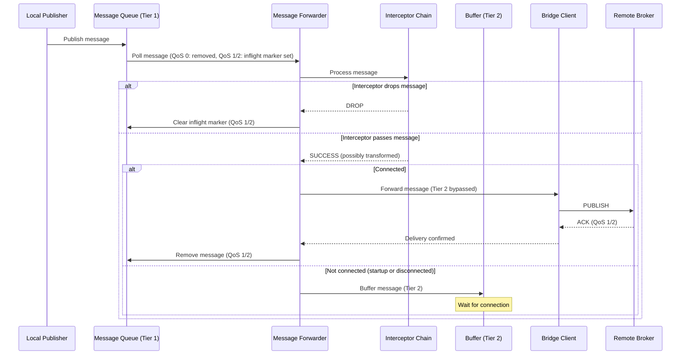
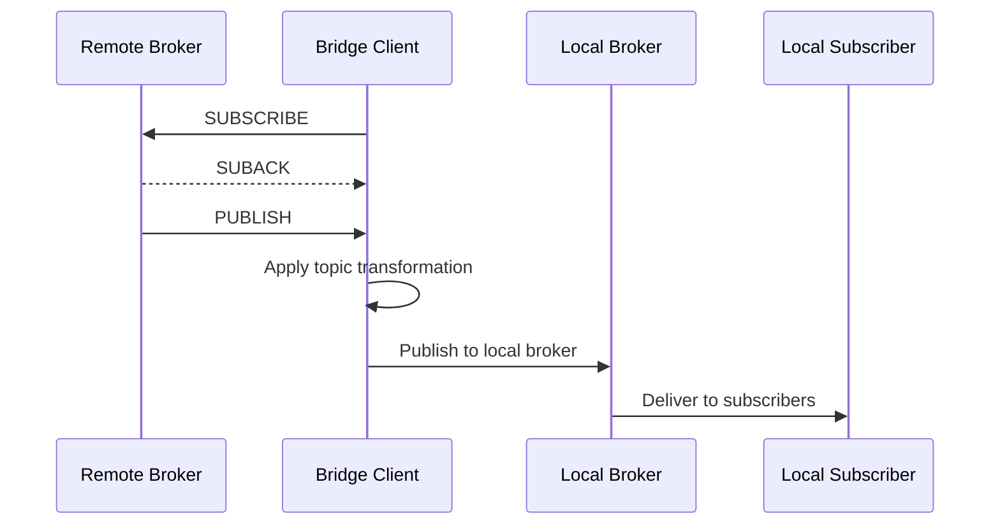
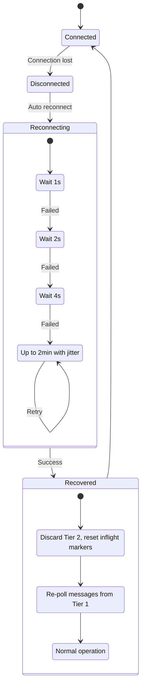
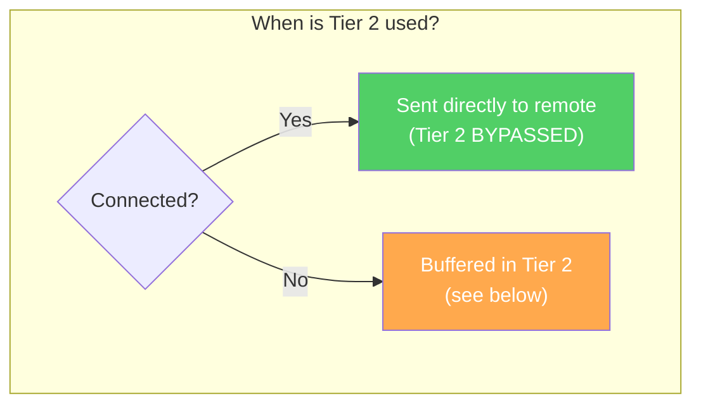
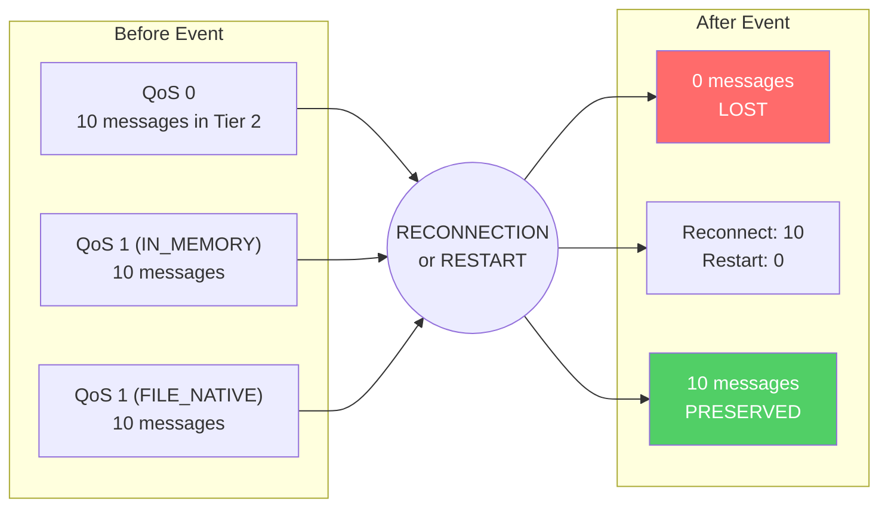
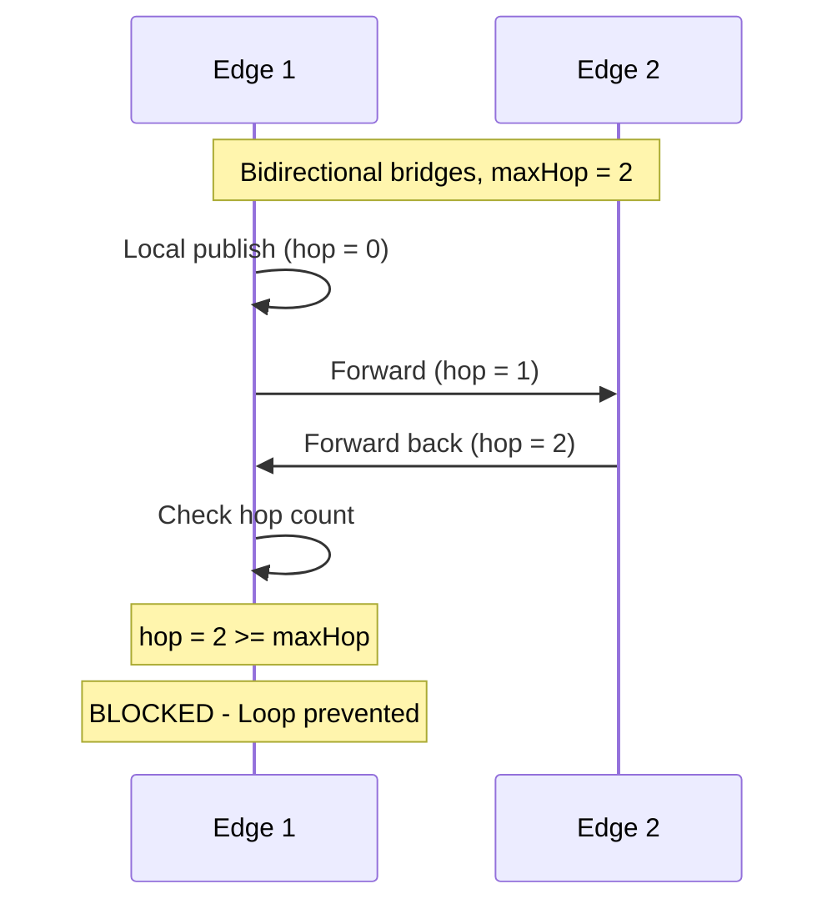
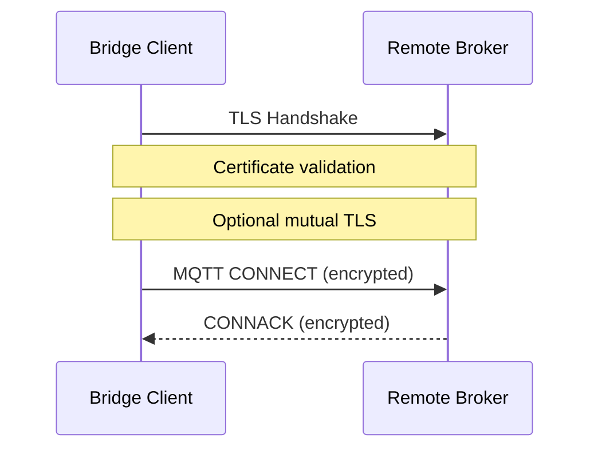
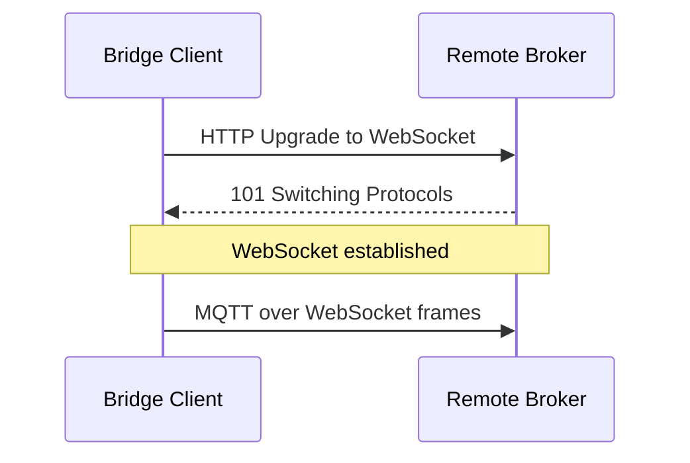
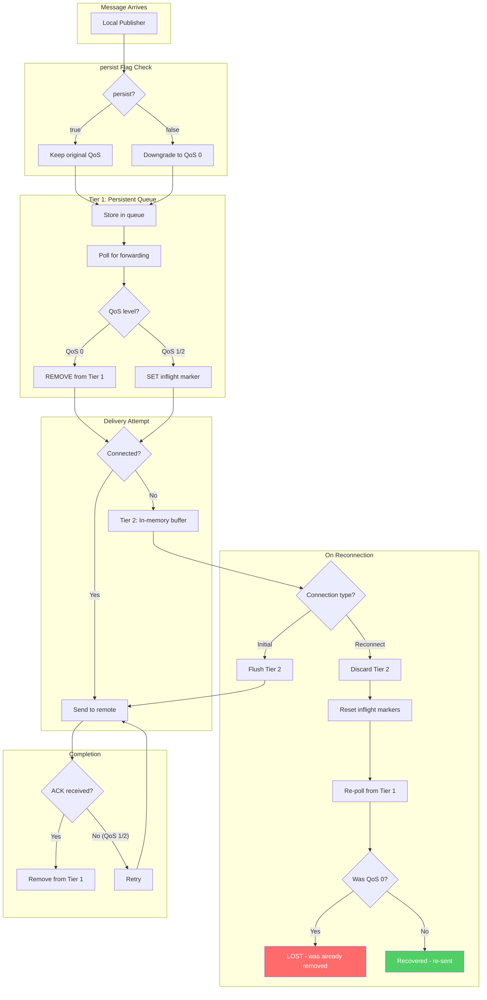

# HiveMQ Edge Bridges

MQTT Bridges connect local brokers to remote brokers, forwarding messages in one or both directions. This allows HiveMQ Edge to act as a gateway between edge devices and cloud infrastructure.

---

## What Bridges Enable

A bridge acts as a specialized MQTT client that subscribes to topics on the local broker and publishes matching messages to a remote broker—and vice versa. This simple concept unlocks powerful capabilities:

- **Cloud Integration**: Stream edge data to cloud-based MQTT brokers
- **Hierarchical Topologies**: Build multi-tier MQTT infrastructures
- **Bandwidth Optimization**: Forward only relevant messages
- **Topic Transformation**: Remap topics between local and remote namespaces
- **Bi-directional Communication**: Enable command-and-control from cloud to edge

---

## Architecture at a Glance

```
┌──────────────────────────────────────────────────────────────────────────────┐
│                              HiveMQ Edge                                     │
│                                                                              │
│  Local Devices                                                               │
│       ↓                                                                      │
│  ┌────────────────────────────────────────────────────────────────────────┐  │
│  │ Tier 1: Persistent Queue                                               │  │
│  │ (QoS 0: removed on poll, QoS 1/2: inflight marker set)                 │  │
│  └────────────────────────────────────────────────────────────────────────┘  │
│       ↓                                                                      │
│  Message Forwarder → Interceptor Chain (transform/drop)                      │
│       ↓                                                                      │
│       ├─────────────────────────────────────────────┐                        │
│       │ [Connected]                                 │ [Not Connected]        │
│       ↓                                             ↓                        │
│  Bridge MQTT Client                 ┌────────────────────────────────────┐   │
│       │                             │ Tier 2: In-Memory Buffer           │   │
│       │                             │ (startup or disconnected)          │   │
│       │                             │                                    │   │
│       │                             │ Initial connect → FLUSHED          │   │
│       │                             │ Reconnect → DISCARDED, re-poll T1  │   │
│       │                             └────────────────────────────────────┘   │
│       │                                             │                        │
│       │◄────────────────────────────────────────────┘                        │
└───────┴──────────────────────────────────────────────────────────────────────┘
                            │
                            │ MQTT over TCP/TLS/WebSocket
                            ↓
                   ┌────────────────┐
                   │  Remote Broker │
                   │  (Cloud/Hub)   │
                   └────────────────┘
```

Messages flow through a pipeline: from local publishers, through a persistent queue (Tier 1), the interceptor chain, and directly to the remote broker when connected. **Tier 2 (in-memory buffer) is only used when not connected**—primarily during startup while waiting for the initial connection, and during disconnection periods. On initial connection, Tier 2 is flushed; on reconnection, it's discarded and messages are re-polled from Tier 1.

---

## Understanding Quality of Service

MQTT defines three QoS levels that determine delivery guarantees:

| QoS Level | Name | Guarantee | Acknowledgment |
|-----------|------|-----------|----------------|
| **0** | At Most Once | Fire-and-forget, may be lost | None |
| **1** | At Least Once | Delivered at least once, may duplicate | PUBACK |
| **2** | Exactly Once | Delivered exactly once | 4-way handshake |

**QoS 0** prioritizes speed over reliability—ideal for high-frequency sensor data where occasional loss is acceptable.

**QoS 1** ensures delivery through acknowledgment tracking. If no PUBACK arrives, the message is resent.

**QoS 2** guarantees exactly-once delivery through a four-step handshake, eliminating both loss and duplication—critical for billing or transactional data.

---

## Message Flow

### Local to Remote (Forward Path)



Messages pass through an **interceptor chain** that can transform or drop messages. When connected, messages are sent directly (Tier 2 bypassed). When not connected (during startup or after a disconnect), messages are buffered in Tier 2. For QoS 1/2, the message remains in Tier 1 with an inflight marker until acknowledgment confirms delivery. For QoS 0, the message is removed from Tier 1 immediately when polled.

### Remote to Local (Reverse Path)



The bridge subscribes to topics on the remote broker and republishes incoming messages to the local broker, optionally transforming topics along the way.

---

## The `persist` Flag

The `persist` flag controls **QoS downgrading**, not whether messages are queued.

| persist | Behavior |
|---------|----------|
| **true** (default) | QoS levels preserved. Full delivery tracking for QoS 1/2. |
| **false** | All messages downgraded to QoS 0. Fire-and-forget only. |

When `persist=false`, messages are still queued and buffered during disconnection—but without delivery guarantees. They become fire-and-forget regardless of their original QoS.

---

## Two-Tier Buffering

Messages flow through two tiers, but **Tier 2 is only used when not connected**:

```
                                                        ┌─────────────────────────────┐
Message arrives → [Tier 1: Persistent Queue] → Polled ──┤ Connected?                  │
                                                        │   │                         │
                                                        │  Yes → Sent directly        │
                                                        │   │                         │
                                                        │  No → [Tier 2: Buffer]      │
                                                        │         ↓                   │
                                                        │       (wait for connection) │
                                                        │         ↓                   │
                                                        │       Sent                  │
                                                        └─────────────────────────────┘
```

### Tier 2's Primary Purpose: Initial Connection

**Tier 2 exists primarily for the startup scenario.** When the bridge starts:

1. System starts up
2. Bridge begins connecting to remote broker (takes time: TLS handshake, authentication, etc.)
3. Meanwhile, local publishers send messages
4. Messages are polled from Tier 1, pass through interceptors
5. They reach the forwarder—**but the connection isn't established yet**
6. Messages are buffered in Tier 2
7. Connection established (initial)
8. **Tier 2 is FLUSHED** → messages sent successfully

Without Tier 2, messages arriving during startup would be lost.

> **Note**: When connected, messages bypass Tier 2 entirely and are sent directly to the remote broker. Tier 2 is purely a buffer for when no connection exists.

### Why Polling Doesn't Stop When Disconnected

You might ask: "Why not just stop polling from Tier 1 when disconnected?"

The architecture keeps polling active regardless of connection state for:
1. **Simplicity**: Decouples polling logic from connection state management
2. **Interceptor pipeline**: Interceptors may have batching/state that's complex to pause mid-flight
3. **Consistent code path**: Same flow handles both startup and disconnection scenarios

### Tier 2 Behavior: Initial Connection vs Reconnection

| Scenario | Tier 2 Buffer | Tier 1 Markers | Rationale |
|----------|---------------|----------------|-----------|
| **Initial connection** | **FLUSHED** and sent | NOT reset | Messages buffered during startup are delivered |
| **Reconnection** | **DISCARDED** | Reset, re-poll from Tier 1 | Clean slate for consistency |

**Why discard on reconnection instead of flush?**

On reconnection, the system cannot know:
- Which messages were partially sent before the disconnect
- Whether the interceptor chain was mid-processing when the connection dropped
- What state the remote broker's session is in

By discarding Tier 2 and re-polling from Tier 1 (with reset inflight markers), the system achieves a **clean, consistent state**. For QoS 1/2, the messages are safe in Tier 1 anyway—discarding Tier 2 only wastes CPU/memory for the re-poll, not the messages themselves.

For QoS 0, this means **message loss on reconnection**—but that's acceptable under QoS 0's "fire-and-forget" contract.

**Where do messages live during disconnection?**

While disconnected, messages may exist in both places:
- **Tier 1** holds the message with its inflight marker (reservation)
- **Tier 2** holds the message content in memory

For QoS 0, there is no inflight marker—after polling, the message is **removed from Tier 1** and only lives in Tier 2. This means QoS 0 messages **cannot be recovered** if Tier 2 is discarded on reconnection.

**Recovery behavior:**

| Scenario | What happens |
|----------|--------------|
| **Reconnect** | Tier 2 buffer is **DISCARDED**. Tier 1 inflight markers are reset. Messages are re-polled from Tier 1. |
| **Restart** | Tier 2 is lost (volatile). Inflight markers in Tier 1 are reset. Messages are re-polled from Tier 1. |

Both reconnection and restart follow the same recovery pattern: clear volatile state and re-poll from persistent storage.

For QoS 1/2 with FILE_NATIVE mode, restart causes no data loss—messages are recovered from Tier 1. For QoS 0, messages are never persisted to disk (by MQTT design), so any in-flight QoS 0 messages are lost on restart.

---

## Handling Disconnection

When the bridge loses connection to the remote broker:

1. **Detection**: The bridge client detects the connection loss
2. **Buffering continues**: Polling from Tier 1 continues; messages are buffered in Tier 2 (same flow as startup)
3. **Reconnection**: Exponential backoff prevents overwhelming the remote broker
4. **Recovery**: On successful reconnection, Tier 2 is **discarded** and messages are re-polled from Tier 1



The backoff strategy doubles wait times (1s → 2s → 4s → ...) up to 2 minutes, with 25% jitter to prevent thundering herd problems when multiple bridges reconnect simultaneously.

---

## QoS Behavior During Disconnection

> **Reminder**: Tier 2 is **only used when not connected** (during startup or after a disconnect). When connected, messages are sent directly to the remote broker, bypassing Tier 2 entirely. Tier 2's primary purpose is buffering during startup; on reconnection, it's discarded and messages are re-polled from Tier 1.

The diagrams below show what happens when a message is polled **while not connected**:



Messages are handled differently by QoS level due to how inflight markers work:

```mermaid
flowchart TB
    subgraph qos0 ["QoS 0 (Fire-and-Forget) — WHILE DISCONNECTED"]
        Q0_POLL["Polled from Tier 1"] --> Q0_REMOVED["REMOVED immediately"]
        Q0_REMOVED --> Q0_BUF["Buffered in Tier 2"]
        Q0_BUF --> Q0_RECONN{"Reconnection?"}
        Q0_RECONN -->|Yes| Q0_DISCARD["Tier 2 DISCARDED"]
        Q0_DISCARD --> Q0_LOST["MESSAGE LOST"]
        Q0_RECONN -->|Initial connect| Q0_SEND["Sent from Tier 2"]
        style Q0_LOST fill:#ff6b6b,color:white
        style Q0_REMOVED fill:#ffa94d,color:white
    end

    subgraph qos12 ["QoS 1/2 (Tracked) — WHILE DISCONNECTED"]
        Q1_POLL["Polled from Tier 1"] --> Q1_MARKED["Inflight marker SET"]
        Q1_MARKED --> Q1_BUF["Buffered in Tier 2"]
        Q1_BUF --> Q1_RECONN{"Reconnection?"}
        Q1_RECONN -->|Yes| Q1_RESET["Markers RESET, Tier 2 discarded"]
        Q1_RESET --> Q1_REPOLL["Re-polled from Tier 1"]
        Q1_REPOLL --> Q1_SEND["Sent"]
        Q1_SEND --> Q1_ACK{"ACK?"}
        Q1_ACK -->|Yes| Q1_DONE["Complete"]
        Q1_ACK -->|No| Q1_RETRY["Retry"]
        style Q1_REPOLL fill:#51cf66,color:white
    end
```



**QoS 0**: Fire-and-forget. Messages are removed from Tier 1 immediately when polled (no inflight marker). On reconnection, Tier 2 is discarded and QoS 0 messages **cannot be recovered**—they are lost.

**QoS 1/2**: Tracked delivery. Messages remain in Tier 1 with inflight markers. On reconnection, markers are reset and messages are re-polled from Tier 1, ensuring no loss.

**Important**: QoS 0 messages are only safe during **initial connection** (Tier 2 is flushed). During **reconnection**, they are lost.

---

## Persistence Modes

HiveMQ Edge offers two persistence modes:

| Mode | Storage | Performance | Restart Survival | License |
|------|---------|-------------|------------------|---------|
| **IN_MEMORY** | RAM | Fast | No | Free |
| **FILE_NATIVE** | Disk | Moderate | QoS 1/2 only | Licensed |

**IN_MEMORY** (default) provides high throughput but loses all queued messages on restart.

**FILE_NATIVE** persists QoS 1/2 messages to disk, surviving restarts—but QoS 0 messages are never persisted (by MQTT design).

---

## Data Durability Summary

| Event | QoS 0 | QoS 1/2 (IN_MEMORY) | QoS 1/2 (FILE_NATIVE) |
|-------|-------|---------------------|----------------------|
| **Initial Connection** | Sent from Tier 2 | Sent from Tier 2 | Sent from Tier 2 |
| **Reconnection** | **LOST** (Tier 2 discarded, already removed from Tier 1) | Re-polled from Tier 1 | Re-polled from Tier 1 |
| **Process Restart** | **LOST** | **LOST** (IN_MEMORY cleared) | **PRESERVED** (re-polled from disk) |



**Key insight**: QoS 0 messages are vulnerable during reconnection because they're removed from Tier 1 immediately when polled. When Tier 2 is discarded on reconnect, there's no copy to recover.

For mission-critical data, use **QoS 1 or 2** with **FILE_NATIVE** persistence mode.

---

## Loop Prevention

When bridges form bidirectional connections, messages could loop infinitely. HiveMQ Edge prevents this through hop count tracking:



Each bridge increments the hop count. When it reaches the configured maximum, further forwarding is blocked.

---

## Secure Connections

### TLS Encryption

Bridges support TLS for encrypted communication:



Configure truststores for server certificate validation and keystores for mutual TLS authentication.

### WebSocket Transport

For environments where raw TCP is blocked, bridges can tunnel MQTT over WebSocket:



---

## Complete Message Lifecycle



**Note**: The diagram shows why QoS 0 messages can be lost on reconnection—they're removed from Tier 1 immediately when polled, so when Tier 2 is discarded, there's no copy to recover.

---

## Key Takeaways

1. **Bridges enable edge-to-cloud connectivity** with intelligent message routing and topic transformation

2. **The `persist` flag controls QoS downgrading**, not queueing—messages are always queued

3. **Tier 2's primary purpose is startup buffering**: Messages arriving while waiting for the initial connection are buffered in Tier 2, then flushed when the connection is established

4. **Tier 2 is only used when not connected**: When connected, messages bypass Tier 2 entirely and are sent directly to the remote broker

5. **On reconnection, Tier 2 is discarded** (not flushed) for consistency—the system re-polls from Tier 1 to achieve a clean state. This is a design tradeoff: QoS 1/2 messages are safe in Tier 1, but **QoS 0 messages are lost** on reconnection

6. **QoS determines delivery guarantees**: QoS 0 is fire-and-forget (can be lost on reconnection); QoS 1/2 guarantee delivery with retry from Tier 1

7. **Persistence mode determines restart survival**: Only FILE_NATIVE + QoS 1/2 survives restarts

8. **Loop prevention** protects bidirectional topologies from infinite message cycling

9. **Exponential backoff** with jitter ensures graceful reconnection without overwhelming remote brokers
