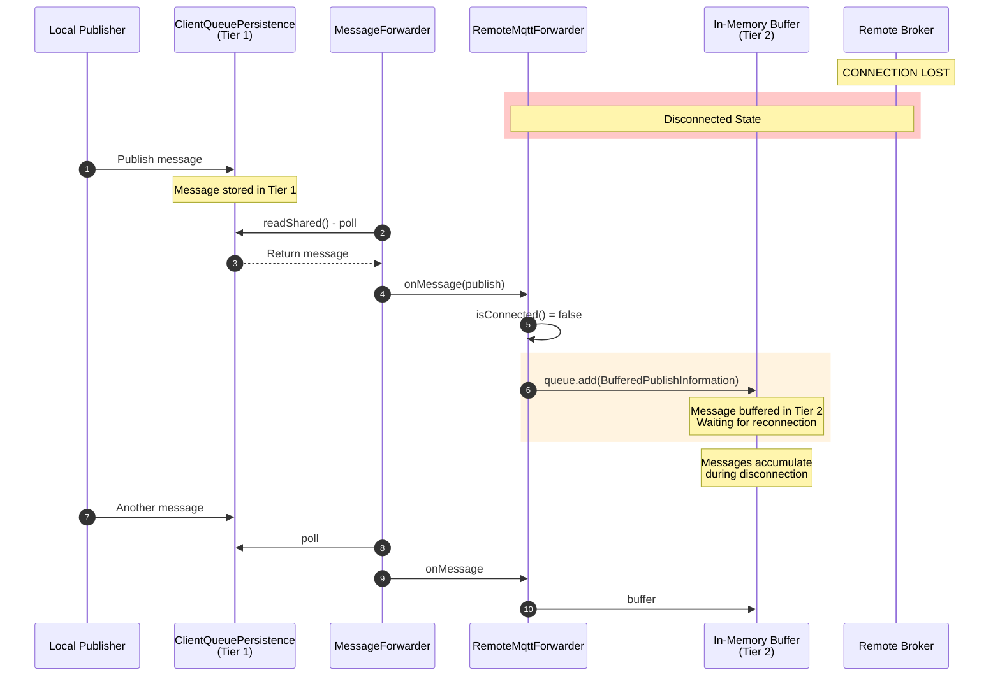

# QoS and Persistence Visual Guide

This document provides visual diagrams illustrating message flow through HiveMQ Edge bridges under various scenarios.

---

## Table of Contents

1. [Normal Operation](#normal-operation)
   - [QoS 0 with persist=true](#qos-0-with-persisttrue-normal-operation)
   - [QoS 1 with persist=true](#qos-1-with-persisttrue-normal-operation)
   - [QoS 2 with persist=true](#qos-2-with-persisttrue-normal-operation)
   - [QoS 1/2 with persist=false (Downgrade)](#qos-12-with-persistfalse-downgrade-scenario)
2. [Persistence Modes](#persistence-modes)
   - [IN_MEMORY Mode](#in_memory-mode)
   - [FILE_NATIVE Mode](#file_native-mode)
3. [Disconnect Scenarios](#disconnect-scenarios)
   - [Two-Tier Buffering](#two-tier-buffering-during-disconnect)
   - [QoS Comparison During Disconnect](#qos-comparison-during-disconnect)
4. [Reconnect Scenarios](#reconnect-scenarios)
   - [Exponential Backoff State Machine](#exponential-backoff-reconnection)
   - [Message Flow on Reconnect](#message-flow-on-reconnect)
5. [Intermittent Network Scenarios](#intermittent-network-scenarios)
   - [Message Lifecycle State Machine](#message-lifecycle-in-intermittent-network)
   - [QoS Behavior Comparison](#qos-behavior-comparison-intermittent-network)
6. [Restart Scenarios](#restart-scenarios)
   - [Data Survival by Mode](#data-survival-on-restart)

---

## Normal Operation

### QoS 0 with persist=true (Normal Operation)

**Key Points:**
- Message is queued in ClientQueuePersistence (Tier 1) even for QoS 0
- No inflight marker is set for QoS 0 messages
- Message is removed from queue after processing attempt, regardless of delivery success
- No acknowledgment expected from remote broker
- If send fails, message is lost (no retry mechanism for QoS 0)

---

### QoS 1 with persist=true (Normal Operation)

**Key Points:**
- Message is queued with inflight marker set
- Inflight marker prevents message from being re-polled while in flight
- PUBACK from remote broker confirms delivery
- Only after PUBACK is the inflight marker cleared and message removed
- If PUBACK not received, message remains in queue for retry on reconnect

---

### QoS 2 with persist=true (Normal Operation)

**Key Points:**
- QoS 2 uses a 4-way handshake: PUBLISH → PUBREC → PUBREL → PUBCOMP
- Ensures exactly-once delivery to remote broker
- Message only removed after PUBCOMP completes the handshake
- If any step fails, message remains in queue for retry
- Most resource-intensive but most reliable delivery guarantee

---

### QoS 1/2 with persist=false (Downgrade Scenario)

**Key Points:**
- Original QoS (1 or 2) is forcefully downgraded to QoS 0
- This happens in `PublishDistributorImpl.java:242-244`
- Message is still queued (not skipped)
- No inflight marker set (QoS 0 behavior)
- No delivery guarantee - message may be lost if send fails
- Log message warns: "QoS for publishes from local subscriptions will be downgraded to AT_MOST_ONCE"

---

## Persistence Modes

### IN_MEMORY Mode

**Key Points:**
- Default persistence mode, available to all users (free)
- Data stored in HashMap + LinkedList structures in RAM
- Fast performance, low latency
- **All data lost on restart** - no disk persistence
- QoS 1/2 delivery tracking works during runtime
- Suitable for scenarios where restart data loss is acceptable

---

### FILE_NATIVE Mode

**Key Points:**
- Requires commercial license
- QoS 1/2 messages persisted to disk
- QoS 0 messages NOT persisted (by MQTT design - fire-and-forget has no persistence guarantee)
- **QoS 1/2 messages survive restarts**
- Slightly higher latency due to disk I/O
- Recommended for production where message durability is critical

---

### Persistence Mode Comparison

**Key Points:**
- IN_MEMORY mode: All messages lost on restart
- FILE_NATIVE mode with QoS 1/2: Messages preserved
- FILE_NATIVE mode with QoS 0: Messages lost (not persisted by design)
- Tier 2 in-memory buffer: Always lost on restart (volatile RAM)

---

## Disconnect Scenarios

### Two-Tier Buffering During Disconnect

**Key Points:**
- When remote broker is disconnected, messages are buffered in Tier 2 (in-memory buffer)
- Tier 1 (ClientQueuePersistence) continues receiving new messages
- MessageForwarder continues polling from Tier 1
- RemoteMqttForwarder detects `isConnected() == false` and buffers instead of sending
- Code location: `RemoteMqttForwarder.java:301-308`
- Buffer is unbounded (limited only by available memory)

---

### QoS Comparison During Disconnect

**Key Points:**
- ALL QoS levels are buffered during disconnection
- The difference is in inflight marker handling:
  - QoS 0: No marker, removed after attempt
  - QoS 1/2: Marker set, kept for retry
- persist=false forces QoS downgrade BEFORE queueing
- Tier 2 buffer holds messages until reconnection regardless of QoS

---

## Reconnect Scenarios

### Exponential Backoff Reconnection

**Key Points:**
- Exponential backoff prevents overwhelming the remote broker
- Initial delay: 1 second
- Doubles each attempt: 1s → 2s → 4s → 8s → ...
- Maximum delay: 2 minutes
- 25% jitter added to prevent thundering herd problem
- On success: immediately drain buffers and resume normal operation

---

### Message Flow on Reconnect

**Key Points:**
- On reconnect, Tier 2 buffer is drained FIRST
- This ensures message ordering is preserved
- Buffered messages retain their original QoS for ACK handling
- After buffer is drained, normal Tier 1 polling resumes
- QoS 1/2 messages: inflight markers cleared only after ACK
- QoS 0 messages: processed immediately without ACK

---

### Reconnect with QoS 1/2 Retry

**Key Points:**
- QoS 1/2 messages that weren't ACKed before disconnect are retried
- `drainQueue()` resets inflight markers so messages can be re-polled
- This ensures at-least-once (QoS 1) or exactly-once (QoS 2) delivery
- Message only removed from Tier 1 after successful ACK
- Code location: `RemoteMqttForwarder.java:346-379`

---

## Intermittent Network Scenarios

### Message Lifecycle in Intermittent Network

**Key Points:**
- Message lifecycle depends on QoS level and network state
- QoS 0: Single attempt, lost on failure
- QoS 1/2: Retry on failure, wait for ACK
- Intermittent network causes messages to cycle through buffered/sending states
- Only successful ACK (QoS 1/2) or send attempt (QoS 0) ends the lifecycle

---

### QoS Behavior Comparison (Intermittent Network)

**Key Points:**
- **QoS 0**: Best-effort delivery, no retry on failure
- **QoS 1/2**: Guaranteed delivery with retry mechanism
- **persist=false**: Forces QoS 0 behavior regardless of original QoS
- Intermittent network affects delivery time but not eventual delivery (for QoS 1/2)
- QoS 0 messages may be lost during network issues

---

### Network Flapping Scenario

**Key Points:**
- Network flapping causes messages to cycle between buffered and sending states
- QoS 1/2 ensures eventual delivery despite network instability
- Message order is preserved (M2 before M3 before M4)
- Each message is tracked independently for ACK status
- Tier 2 buffer grows during network outages

---

## Restart Scenarios

### Data Survival on Restart

**Key Points:**
- **IN_MEMORY mode**: All messages lost
- **FILE_NATIVE mode**: Only QoS 1/2 messages preserved
- **Tier 2 buffer**: Always lost (volatile RAM)
- **Inflight messages**: Reset on restart, will be re-polled and retried
- QoS 0 messages are NEVER persisted to disk (by MQTT design)

---

### Complete Restart Recovery Flow (FILE_NATIVE)

**Key Points:**
- FILE_NATIVE mode loads persisted QoS 1/2 messages on startup
- Inflight markers are reset, allowing messages to be re-polled
- Normal operation resumes after recovery
- Messages are delivered as if restart never happened
- This is the key advantage of FILE_NATIVE over IN_MEMORY

---

### Restart Impact Summary

**Key Points:**
- **Only one combination survives restart**: FILE_NATIVE + persist=true + QoS 1 or 2
- persist=false downgrades to QoS 0, which is never persisted
- IN_MEMORY mode never persists to disk
- QoS 0 is never persisted to disk (by MQTT design)
- For restart protection: use FILE_NATIVE license + keep persist=true

---

## Summary Diagram

---

**Document Version**: 1.0
**Last Updated**: 2025-12-17
**Based on codebase analysis**: Verified against HiveMQ Edge source code

**Related Documents**:
- [Q0S.md](Q0S.md) - Technical reference for persistence and QoS behavior
- [BRIDGES.md](hivemq-edge/src/main/java/com/hivemq/bridge/BRIDGES.md) - Bridge architecture documentation
