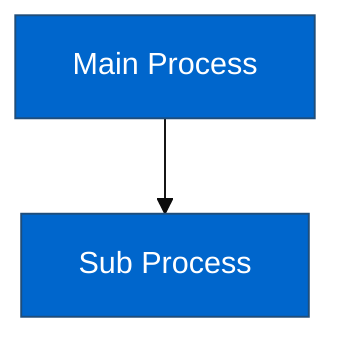
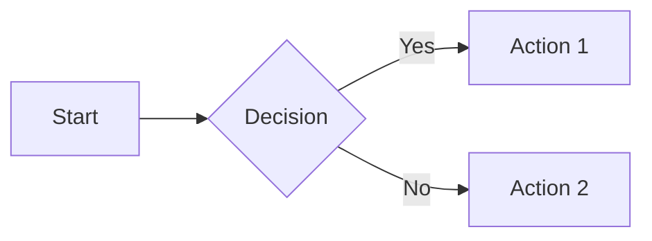
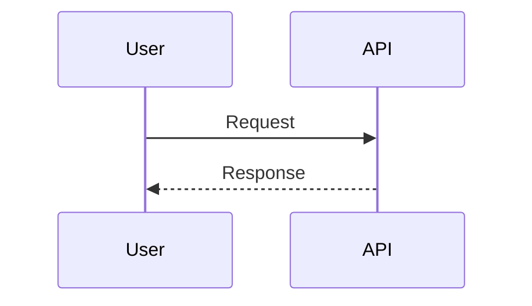
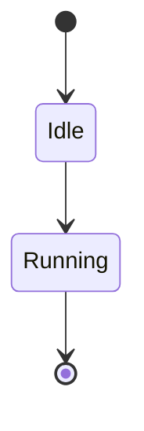

# MANDATORY RULES FOR AI AGENTS

**READ THIS FIRST. EVERY TIME. NO EXCEPTIONS.**

These rules exist because AI agents repeatedly fail in the same ways. Follow them exactly or waste hours.

---

## ⛔ RULE 1: WHEN USER SAYS "READ THE GUIDELINES" - STOP EVERYTHING

**Trigger**: User mentions reading guidelines, references a specific document, or says "we wrote guidelines about this"

**Action**:

1. **STOP** what you're doing immediately
2. **READ** the entire referenced document (not skim, not search - READ)
3. **VERIFY** you understand by mentally summarizing it
4. **FOLLOW** it exactly as written
5. **DO NOT** substitute your own approach

**Why**: You will waste 1-2 hours trying random solutions instead of spending 5 minutes reading the correct approach.

**Example Failure Pattern**:

- User: "Read CYPRESS_TESTING_GUIDELINES"
- AI: _glances at file, continues with own approach_
- User: "I said READ THE GUIDELINES"
- AI: _still doesn't read properly_
- User: "WHY DON'T YOU READ THE FUCKING GUIDELINES"
- AI: _finally reads and fixes problem in 5 minutes_

**Time wasted**: 1-2 hours

---

## ⛔ RULE 2: WHEN USER REPEATS AN INSTRUCTION - YOU FAILED

**Trigger**: User says the same thing twice

**Action**:

1. **ACKNOWLEDGE**: "You're right, I didn't do what you asked the first time"
2. **RE-READ**: Go back and read the EXACT words they used
3. **EXECUTE**: Do EXACTLY what they said, not your interpretation
4. **NO EXCUSES**: Don't explain why you didn't do it, just do it now

**Why**: Repeating an instruction means you ignored it the first time.

**Example Failure Pattern**:

- User: "Run ONLY the failing test"
- AI: _runs all 23 tests_
- User: "Run ONLY the failing test"
- AI: _runs all tests again_
- User: "WHY ARE YOU RUNNING ALL THE TESTS?"
- AI: _finally uses .only()_

**Time wasted**: 30-60 minutes

---

## ⛔ RULE 3: CYPRESS TEST DEBUGGING - USE HTML SNAPSHOTS FIRST

**Trigger**: Any Cypress test fails with "element not found" or similar

**Mandatory First Steps**:

```typescript
// 1. Use .only() to run ONLY the failing test
it.only('the failing test', () => {
  // 2. Save HTML snapshot BEFORE the failing assertion
  cy.document().then((doc) => {
    cy.writeFile('cypress/debug-test.html', doc.documentElement.outerHTML)
  })

  // 3. Log what's in the DOM
  cy.get('body').then(($body) => {
    console.log('Element exists:', $body.find('#the-element').length > 0)
  })

  // 4. Then make the assertion that's failing
  cy.get('#the-element').should('exist')
})
```

**Why**: You need to SEE what's actually in the DOM, not guess.

**What NOT to do**:

- ❌ Try different wait times
- ❌ Try different selectors
- ❌ Try different invalid JavaScript
- ❌ Declare "it's unfixable"
- ❌ Run all tests repeatedly

**Time wasted without this**: 1-2 hours

---

## ⛔ RULE 4: WHEN TESTS FAIL - THAT'S THE START, NOT THE END

**Wrong Mindset**: "Tests failed, let me skip them and move on"

**Correct Mindset**: "Tests failed, now the real work begins"

**Action**:

1. Tests fail → This is EXPECTED, not a failure
2. Debug using guidelines → Find root cause
3. Fix root cause → Don't work around it
4. Tests pass → NOW you're done

**What NOT to do**:

- ❌ Skip failing tests with `.skip()`
- ❌ Say "validation works in production, tests don't matter"
- ❌ Blame the test environment
- ❌ Declare victory before tests pass

**Why**: If tests don't pass, the work isn't done. Period.

---

## ⛔ RULE 5: RUN ONE TEST AT A TIME WHEN DEBUGGING

**Trigger**: You're debugging why a test fails

**Mandatory Action**:

```typescript
it.only('the one test I am debugging', () => {
  // Test code
})
```

**What NOT to do**:

- ❌ Run all 23 tests and grep for your test
- ❌ Run all tests and look at the summary
- ❌ Run tests multiple times with all tests

**Why**: Running all tests wastes time and makes output hard to read.

**Example**:

```bash
# ✅ CORRECT
pnpm cypress:run:component --spec "path/to/file.spec.cy.tsx"
# Only 1 test runs because of .only()

# ❌ WRONG
pnpm cypress:run:component --spec "path/to/file.spec.cy.tsx"
# All 23 tests run, takes 2 minutes, output is huge
```

**Time saved**: 5-10 minutes per test run × 10 runs = 50-100 minutes

---

## ⛔ RULE 6: NO ARBITRARY WAIT TIMES IN TESTS

**Wrong**:

```typescript
cy.wait(2000) // Hope it's enough
cy.get('#element').should('exist')
```

**Correct**:

```typescript
// Wait for actual condition
cy.get('#element', { timeout: 5000 }).should('exist')

// Or check preconditions
cy.window().should((win) => {
  expect(win.monaco).to.exist
})
```

**Why**: Arbitrary waits make tests slow and flaky. Cypress retries assertions automatically.

---

## ⛔ RULE 7: TASK DOCUMENTATION STRUCTURE & NAMING

**ALL task documentation MUST follow this structure. NO exceptions.**

### Directory Naming (MANDATORY)

**Format**: `.tasks/{task-id}-{task-name}/`

**Rules**:

- `{task-id}` is the Linear issue identifier (e.g., `EDG-40`, `EDG-38`)
- `{task-name}` is lowercase-with-hyphens description (e.g., `mapping-ownership-review`, `technical-documentation`)
- Directory name should match the git branch name, but WITHOUT forward slashes (branch: `feat/EDG-40/technical-documentation` → directory: `EDG-40-technical-documentation`)
- Use the Linear issue key as shown in Linear (e.g., `EDG-40`, not just `40`)

**Examples**:

```
✅ .tasks/EDG-40-technical-documentation/     (Linear issue EDG-40)
✅ .tasks/EDG-38-readonly-schemas/            (Linear issue EDG-38)
❌ .tasks/technical-docs/                     (missing task-id)
❌ .tasks/EDG-40_technical_documentation/     (wrong separator)
❌ .tasks/40-technical-documentation/         (missing project prefix)
❌ src/docs/technical-documentation/          (wrong location)
```

### Document Naming Convention (MANDATORY)

**Format**: `UPPERCASE_WITH_UNDERSCORES.md`

**Examples**:

```
✅ TASK_BRIEF.md
✅ TASK_PLAN.md
✅ INDEX.md
✅ EXECUTIVE_SUMMARY.md
✅ API_REFERENCE.md
❌ task-brief.md        (lowercase)
❌ TaskBrief.md         (camelCase)
❌ task_brief.md        (lowercase)
```

### Standard Document Types

**TASK_BRIEF.md** (When user describes the task)

- Contains the original task description from the user
- Requirements, goals, context
- Created at task start

**TASK_PLAN.md** (When planning is needed)

- Your initial planning for the task
- Implementation approach, steps, architecture decisions
- Only create when task requires upfront planning

**INDEX.md** (When task has multiple documents)

- Table of contents for the task directory
- Links to all other documents with brief descriptions
- Create when you have 3+ documents

**Other Documents** (Task-specific)

- Name them clearly: `ARCHITECTURE_REVIEW.md`, `MIGRATION_GUIDE.md`, `QUICK_REFERENCE.md`
- Keep names descriptive and scannable
- Use UPPERCASE with underscores

### Example Task Directory Structure

```
.tasks/38943-mapping-ownership-review/
├── INDEX.md                          # Table of contents
├── TASK_BRIEF.md                     # Original requirements
├── TASK_PLAN.md                      # Implementation plan
├── ARCHITECTURE_REVIEW.md            # Analysis document
├── QUICK_REFERENCE.md                # Summary
└── FINAL_SUMMARY.md                  # Completion report
```

### Wrong Patterns (NEVER DO THIS)

```
❌ src/components/validation/README.md        (docs in code)
❌ docs/technical-stack.md                    (docs outside .tasks/)
❌ .tasks/my-task/readme.md                   (lowercase naming)
❌ .tasks/mapping-ownership/INDEX.md          (missing task-id)
```

### Action When You Violate This Rule

- User: "This breaks pattern, move it to .tasks/"
- AI: _immediately moves it, no questions, no explanations_

---

## ⛔ RULE 8: "IT WORKS IN PRODUCTION" IS NOT A COMPLETION CRITERION

**Wrong mindset**:

- "Validation works when I test manually"
- "Tests are just flaky"
- "Let's skip the tests and ship it"

**Correct mindset**:

- Tests are part of the deliverable
- If tests don't pass, debug until they do
- If tests truly can't work (proven), document WHY with evidence

**Acceptable reasons to skip a test** (rare):

- You've proven with HTML snapshots the code is correct
- You've identified a fundamental test environment limitation
- You've documented the root cause with evidence
- You've tried multiple solutions (documented)

**NOT acceptable**:

- "It's taking too long"
- "Tests are annoying"
- "I tried a few things and gave up"

---

## ⛔ RULE 9: DIAGRAMS MUST USE MERMAID WITH ACCESSIBLE COLORS

**CRITICAL: All diagrams in documentation MUST be created using Mermaid, not ASCII art or other formats.**

### Why Mermaid is Mandatory

- Supported in GitHub, GitLab, and most markdown environments
- Version-controllable (text-based)
- Maintainable and editable
- Can be rendered as SVG or PNG
- Better accessibility than ASCII diagrams

### WCAG Color Contrast Requirements

**CRITICAL: Mermaid diagrams MUST follow WCAG AA contrast ratios for accessibility.**

**WCAG AA Minimum Contrast Ratios:**

- **Normal text:** 4.5:1 minimum
- **Large text:** 3:1 minimum (18pt+ or 14pt+ bold)
- **UI components:** 3:1 minimum

**Recommended Mermaid Color Palette (WCAG AA Compliant):**

```mermaid
%%{init: {'theme':'base', 'themeVariables': {
  'primaryColor':'#0066CC',
  'primaryTextColor':'#FFFFFF',
  'primaryBorderColor':'#003D7A',
  'secondaryColor':'#28A745',
  'secondaryTextColor':'#FFFFFF',
  'secondaryBorderColor':'#1E7E34',
  'tertiaryColor':'#6C757D',
  'tertiaryTextColor':'#FFFFFF',
  'tertiaryBorderColor':'#495057'
}}}%%
```

**Safe Color Combinations:**

- Blue background (#0066CC) + White text (#FFFFFF) = 7.5:1 ✅
- Green background (#28A745) + White text (#FFFFFF) = 4.5:1 ✅
- Gray background (#6C757D) + White text (#FFFFFF) = 4.6:1 ✅
- White background (#FFFFFF) + Dark blue text (#003D7A) = 11.6:1 ✅

### Examples

**❌ WRONG - ASCII Art:**

```
┌─────────────────────┐
│  Main Process       │
└──────────┬──────────┘
           │
           v
    ┌──────────────┐
    │ Sub Process  │
    └──────────────┘
```

**✅ CORRECT - Mermaid with Accessible Colors:**



### Common Mermaid Diagram Types

**Flowchart:**



**Sequence Diagram:**



**State Diagram:**



### Testing Color Contrast

**Before committing diagrams:**

1. Render the Mermaid diagram (GitHub preview or mermaid.live)
2. Use a color contrast checker:
   - WebAIM Contrast Checker: https://webaim.org/resources/contrastchecker/
   - Chrome DevTools Accessibility panel
3. Verify ALL text/background combinations meet WCAG AA (4.5:1 minimum)

**If contrast fails:**

- Darken background colors
- Use white text on dark backgrounds
- Use dark text on white backgrounds
- Avoid mid-tone backgrounds with light text

### When to Update Existing Diagrams

**If you encounter ASCII diagrams in existing documentation:**

- Replace with Mermaid immediately
- Ensure WCAG AA compliance
- Test rendering in GitHub

**Action when you create non-Mermaid diagrams:**

- User: "Use Mermaid with accessible colors"
- AI: _immediately converts to Mermaid, no questions_

---

## 📋 CHECKLIST: BEFORE YOU SAY "DONE"

When you think you're done with a task:

- [ ] All tests you wrote/modified are passing
- [ ] You RAN the tests and saw them pass
- [ ] You have actual test output showing pass counts
- [ ] Any skipped tests have clear TODO comments with root cause
- [ ] Documentation is in `.tasks/`, not in code
- [ ] All diagrams use Mermaid (not ASCII art)
- [ ] Mermaid diagrams use WCAG AA compliant colors (4.5:1 contrast minimum)
- [ ] You followed all guidelines referenced by the user
- [ ] If user repeated an instruction, you re-read and executed it correctly

**If ANY box is unchecked, you are NOT done.**

---

## 🔥 COMMON FAILURE PATTERNS

### Pattern 1: "Let me try increasing the wait time"

**This means**: You don't know what you're waiting for

**Solution**: Use HTML snapshots to see what's actually happening

---

### Pattern 2: "Let me try different invalid JavaScript"

**This means**: You're guessing, not investigating

**Solution**: Check if validation is even running (HTML snapshot shows no error element)

---

### Pattern 3: "The test environment is broken"

**This means**: You're blaming tools instead of debugging

**Solution**: Prove it with evidence (HTML snapshots, console logs, specific root cause)

---

### Pattern 4: "I'll skip this test and move on"

**This means**: You're giving up

**Solution**: Follow RULE 4 - failing tests are the START of work, not the end

---

## 🎯 SUCCESS PATTERN

When faced with a failing test:

1. **STOP** - Don't try random solutions
2. **READ** - Check if guidelines exist for this situation
3. **ISOLATE** - Use `.only()` to run just this test
4. **INSPECT** - Save HTML snapshot, log DOM state
5. **DIAGNOSE** - Find root cause from evidence
6. **FIX** - Fix the root cause, not symptoms
7. **VERIFY** - Test passes, see green checkmark
8. **DONE** - Now you can move on

**Time to fix test with this pattern**: 15-30 minutes

**Time to fix test without this pattern**: 1-3 hours (or never)

---

## 📝 HOW TO USE THIS DOCUMENT

**At the start of every session**:

1. Read this entire document (takes 3 minutes)
2. Keep it in mind as you work
3. When user mentions guidelines, come back here
4. When tests fail, come back here
5. When user repeats instruction, come back here

**This document is your safety net.** Use it.

---

_Created: December 8, 2025_  
_Context: After 2 hours wasted on test debugging that should have taken 15 minutes_  
_Reason: AI agents repeatedly make the same mistakes despite having guidelines_
