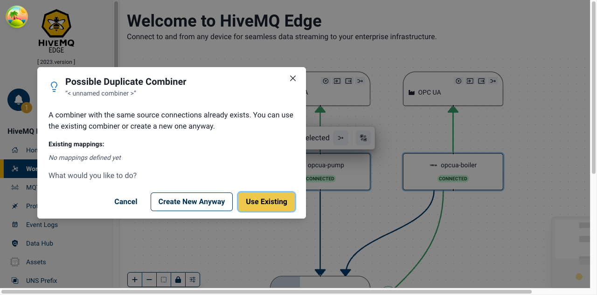
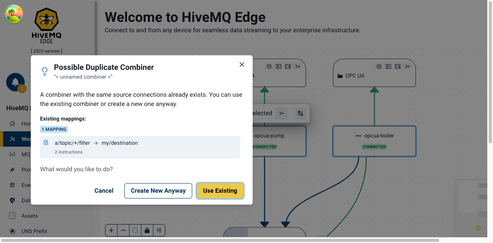

# Pull Request: Duplicate Combiner Detection Enhancement

**Kanban Ticket:** https://businessmap.io/c/57/33168

---

## Description

This PR enhances the user experience when attempting to create a combiner with sources that already exist in the workspace. Previously, users received a brief auto-dismissing toast notification that provided minimal context. Now, users are presented with a comprehensive modal dialog that:

- **Clearly identifies the duplicate**: Shows the name of the existing combiner with identical sources
- **Provides context**: Lists all existing mappings (if any) associated with the combiner, including source → destination flows and instruction counts
- **Offers clear choices**: Three explicit actions with visual hierarchy:
  - **Use Existing** (primary) - Navigate to edit the existing combiner
  - **Create New Anyway** (secondary) - Proceed with creating a duplicate combiner
  - **Cancel** - Dismiss and return to workspace
- **Visual feedback**: Animated canvas focus automatically highlights the existing combiner location
- **Better accessibility**: Full keyboard navigation, proper focus management, and screen reader support

### User Experience Improvements

**What users gain:**

- Persistent modal requiring explicit action (no auto-dismiss)
- Complete visibility of existing combiner mappings before making a decision
- Clearer understanding of why duplicate detection triggered
- Faster navigation to existing combiners with visual animation
- Reduced risk of unintentional duplicate creation
- Better workflow for both editing existing and intentionally creating duplicates

### Technical Improvements

**Code quality enhancements:**

- Extracted 5 complex utility functions from ContextualToolbar for better testability
- Created reusable CombinerMappingsList component for displaying mapping details
- Added comprehensive test coverage: 56 tests total
  - 29 Vitest unit tests for utility functions
  - 15 Cypress component tests for modal components
  - 12 Cypress E2E tests for complete user flows
- Improved maintainability through separation of concerns
- Full i18n support with proper pluralization

---

## BEFORE

### Previous Behavior - Toast Notification

The old implementation showed a brief, auto-dismissing toast notification:

**Limitations:**

- Toast auto-dismissed after a few seconds
- No visibility of existing combiner details
- No option to review existing mappings
- Limited action choices (only implicit navigation)
- Easy to miss if user wasn't paying attention
- No visual indication of where the existing combiner was located

> **Note:** Screenshots of the previous behavior can be captured by checking out the commit before this PR and manually triggering the duplicate combiner detection flow. See [PR_SCREENSHOTS_GUIDE.md](./PR_SCREENSHOTS_GUIDE.md) for instructions.

---

## AFTER

### New Behavior - Modal Dialog

The new implementation presents a comprehensive modal dialog with multiple sections:

#### 1. Modal with Empty Mappings State

When a duplicate combiner is detected that hasn't had mappings configured yet:

_Test: `cypress/e2e/workspace/duplicate-combiner.spec.cy.ts` - "Accessibility → should be accessible"_  
_Screenshot: 1400x916 viewport, captured via `cy.screenshot()` in E2E test_

**Key Elements:**

- Warning icon and clear title "Possible Duplicate Combiner"
- Combiner name prominently displayed
- Description explaining the duplicate detection
- Empty state message: "No mappings defined yet"
- Three clearly labeled action buttons with visual hierarchy:
  - **Use Existing** (primary, auto-focused)
  - **Create New Anyway** (secondary)
  - **Cancel** (tertiary)

#### 2. Modal with Populated Mappings

When a duplicate combiner is detected that has existing mappings configured:

_Test: `cypress/e2e/workspace/duplicate-combiner.spec.cy.ts` - "Accessibility → should be accessible with mappings"_  
_Screenshot: 1400x916 viewport, captured via `cy.screenshot()` in E2E test_

**Key Elements:**

- Complete list of existing mappings displayed in expandable list
- Source → Destination flow visualization with arrow indicators
- Instruction count badges for each mapping (e.g., "5 instructions")
- Scrollable list for many mappings
- Clear action buttons at bottom with same hierarchy

#### 3. Canvas Animation

When the modal opens, the canvas automatically animates to highlight the existing combiner:

_The canvas uses ReactFlow's `fitView()` animation to smoothly pan and zoom to the existing combiner location. This provides immediate visual context to help users understand which combiner already exists with these sources. The animation is coordinated with the modal opening for a smooth UX._

**Animation details:**

- Duration: Smooth transition (default ReactFlow timing)
- Target: Existing combiner node on canvas
- Effect: Backdrop blur on modal allows canvas animation to remain visible
- User benefit: Immediate spatial awareness of duplicate location

---

## Test Coverage

### Unit Tests (29 tests)

- `toolbar.utils.spec.ts` - Comprehensive testing of utility functions
  - Node validation for combiner eligibility
  - Entity reference construction
  - Duplicate combiner detection logic
  - Candidate filtering
  - Asset mapper detection

### Component Tests (15 tests)

- `DuplicateCombinerModal.spec.cy.tsx` (11 tests)
  - Modal rendering and visibility
  - All button interactions
  - Keyboard navigation
  - Accessibility validation
- `CombinerMappingsList.spec.cy.tsx` (4 tests)
  - Mappings list rendering
  - Empty state handling
  - Multiple mappings display
  - Instruction count badges

### E2E Tests (12 tests)

- `duplicate-combiner.spec.cy.ts`
  - Complete user flow testing
  - Modal interaction paths
  - Keyboard navigation
  - Accessibility validation with axe-core
  - Visual regression with Percy (2 snapshots)

**Total: 56 tests, all passing ✅**

---

## Accessibility

- ✅ Full keyboard navigation support (Tab, Shift+Tab, Enter, Escape)
- ✅ Proper focus management (initial focus on primary action)
- ✅ ARIA labels and semantic HTML throughout
- ✅ Screen reader announcements for modal state changes
- ✅ High contrast warning icon
- ✅ Validated with axe-core (0 violations)

---

## Files Changed

### Created (8 files)

1. `src/modules/Workspace/utils/toolbar.utils.ts` - Extracted utility functions
2. `src/modules/Workspace/utils/toolbar.utils.spec.ts` - Unit tests
3. `src/modules/Workspace/components/modals/DuplicateCombinerModal.tsx` - Main modal component
4. `src/modules/Workspace/components/modals/CombinerMappingsList.tsx` - Reusable mappings list
5. `src/modules/Workspace/components/modals/index.ts` - Module exports
6. `src/modules/Workspace/components/modals/DuplicateCombinerModal.spec.cy.tsx` - Component tests
7. `src/modules/Workspace/components/modals/CombinerMappingsList.spec.cy.tsx` - Component tests
8. `cypress/e2e/workspace/duplicate-combiner.spec.cy.ts` - E2E tests

### Modified (3 files)

1. `src/modules/Workspace/components/nodes/ContextualToolbar.tsx` - Refactored to use utilities and modal
2. `src/locales/en/translation.json` - Added i18n translations
3. `cypress/pages/Workspace/WorkspacePage.ts` - Added modal page object selectors

---

## Percy Visual Regression

Two Percy snapshots added for visual regression protection:

1. **"Workspace - Duplicate Combiner Modal"** - Empty mappings state
2. **"Workspace - Duplicate Combiner Modal with Mappings"** - Populated state

---

## Breaking Changes

None. All existing functionality preserved.

---

## Future Enhancements (Optional)

- [ ] Add "Don't show again for this session" option
- [ ] Show visual diff of selected vs existing sources
- [ ] Add "Edit Existing" direct action button
- [ ] Display combiner metadata (created date, last modified)
- [ ] Analytics tracking for user choice patterns

---

## Reviewer Notes

**Focus areas for review:**

1. Modal UX flow and action hierarchy
2. Animation timing coordination with canvas fitView
3. Translation key patterns and pluralization
4. Test coverage completeness
5. Accessibility implementation

**Testing instructions:**

1. Run unit tests: `pnpm test:unit toolbar.utils`
2. Run component tests: `pnpm test:cy:component -- --spec "src/modules/Workspace/components/modals/**"`
3. Run E2E tests: `pnpm test:cy:e2e -- --spec "cypress/e2e/workspace/duplicate-combiner.spec.cy.ts"`
4. Manual testing: Create combiner → attempt duplicate → verify modal behavior
