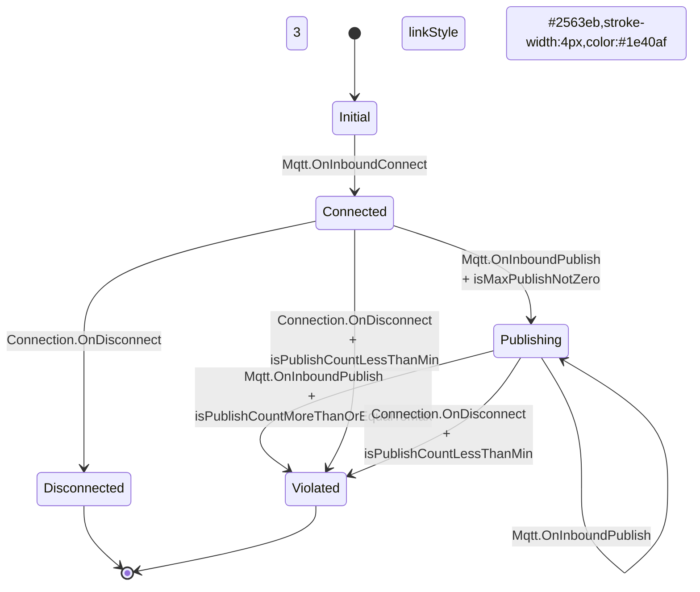

# Conversation Summary: Subtask 3 - Enhanced FSM Visualization

**Date:** January 28, 2026
**Task:** 38700-datahub-behaviour-transition
**Subtask:** Enhanced FSM Mermaid Visualization

## Overview

Enhanced the Finite State Machine (FSM) visualization in the Transition Panel to provide better visual feedback and consistency with the transition selector UI. Includes real-time dynamic updates when user changes transition selection.

## Requirements Delivered

1. **✅ State Color Scheme** - Match badge colors from TransitionSelect (subtle variant)
2. **✅ Transition Guards** - Show guards in transition labels with proper layout
3. **✅ Selected Transition Highlighting**
   - Thick borders (12px) on source and target states
   - Thick path (4px) on the transition edge between them
4. **✅ Real-time Updates** - Diagram updates dynamically as user changes dropdown selection
5. **✅ Clean Visual Design** - Removed pinkish label backgrounds, improved clarity
6. **✅ Theme Integration** - Full Chakra UI theme support with light/dark mode
7. **✅ Badge Styling** - Nodes styled exactly like Badge subtle variant (pastel bg + dark text)
8. **✅ Transition Path Highlighting** - SVG post-processing to mark and style selected path
9. **📋 Description Display** - Documented design options (deferred to iteration)

## Implementation

### Files Modified

#### 1. `MermaidRenderer.tsx` - Enhanced diagram generation

**Added:**

- `MermaidRendererProps` interface with optional `selectedTransition`
- State color class definitions using Chakra UI colors
- Selected state class definitions with thicker borders (12px vs 2px)
- Guard display in transition labels with line breaks
- Selected state highlighting by applying special classes to both source and target states

**Key Changes:**

```typescript
export interface MermaidRendererProps extends FiniteStateMachine {
  selectedTransition?: {
    event: string
    from: string
    to: string
  }
}

// State color mapping
const getStateClass = (stateType: FsmState.Type): string => {
  switch (stateType) {
    case 'INITIAL': return 'initial'     // Blue
    case 'SUCCESS': return 'success'     // Green
    case 'FAILED': return 'failed'       // Red
    case 'INTERMEDIATE':
    default: return 'intermediate'       // Gray
  }
}

// Guards in labels with line break
const getTransitionLabel = (transition: FsmTransition): string => {
  const guards = (transition as FsmTransition & { guards?: string }).guards
  return guards ? `${transition.event}<br/>+ ${guards}` : transition.event
}

// Mermaid class definitions (normal states)
'classDef initial fill:#3182ce,stroke:#2c5282,color:#fff,stroke-width:2px',
'classDef intermediate fill:#718096,stroke:#4a5568,color:#fff,stroke-width:2px',
'classDef success fill:#38a169,stroke:#2f855a,color:#fff,stroke-width:2px',
'classDef failed fill:#e53e3e,stroke:#c53030,color:#fff,stroke-width:2px',

// Selected state variants (same colors, thicker borders)
'classDef selectedInitial fill:#3182ce,stroke:#2c5282,color:#fff,stroke-width:12px',
'classDef selectedIntermediate fill:#718096,stroke:#4a5568,color:#fff,stroke-width:12px',
'classDef selectedSuccess fill:#38a169,stroke:#2f855a,color:#fff,stroke-width:12px',
'classDef selectedFailed fill:#e53e3e,stroke:#c53030,color:#fff,stroke-width:12px',

// Apply selected class to both source and target states
if (isPartOfSelection) {
  const selectedClass = `selected${capitalizedType}`
  return `class ${state.name} ${selectedClass}`
}
```

**Critical Discovery:**

- `linkStyle` is NOT supported in stateDiagram-v2 (only in flowcharts)
- Mermaid throws syntax error: "got 'DESCR'" when using `linkStyle` with `color` property
- Solution: Highlight source and target STATES instead of the transition line itself
- Both states get thicker borders (12px) to visually indicate the selected transition

#### 2. `FiniteStateMachineFlow.tsx` - Prop threading

**Added:**

- `FiniteStateMachineFlowProps` interface extending `FiniteStateMachine`
- `selectedTransition` prop passed through to `MermaidRenderer`

#### 3. `TransitionPanel.tsx` - Selection data extraction and real-time updates

**Added:**

- `useState` to track current form data for real-time updates
- `onFormChange` callback to capture form changes as user types/selects
- Extract selected transition from concatenated event string format
- Pass to `FiniteStateMachineFlow` component

**Key Implementation:**

```typescript
const [currentFormData, setCurrentFormData] = useState<TransitionData | null>(null)

const onFormChange = useCallback((data: IChangeEvent<TransitionData>) => {
  setCurrentFormData(data.formData || null)
}, [])

const selectedTransitionData = useMemo(() => {
  if (currentFormData) {
    const { event } = currentFormData
    // Parse concatenated string: "event-from-to-type"
    if (event?.includes('-')) {
      const [parsedEvent, parsedFrom, parsedTo] = event.split('-')
      return parsedEvent && parsedFrom && parsedTo
        ? { event: parsedEvent, from: parsedFrom, to: parsedTo }
        : null
    }
  }

  // Fallback to node data if no form data
  const adapterNode = nodes.find((e) => e.id === selectedNode)
  if (!adapterNode) return null
  const { event, from, to } = adapterNode.data
  return event && from && to ? { event, from, to } : null
}, [currentFormData, nodes, selectedNode])

// Pass onChange to form
<ReactFlowSchemaForm
  onChange={onFormChange}
  onSubmit={onSafeFormSubmit}
  // ...
/>
```

**Why This Approach:**

- Form data uses concatenated format: `"Mqtt.OnInboundPublish-Publishing-Violated-INTERMEDIATE"`
- Must parse to extract individual `event`, `from`, `to` values
- Using form state (not node data) enables real-time diagram updates without saving
- Fallback to node data ensures diagram shows on initial load

#### 4. `Mermaid.tsx` - Dynamic rendering and visual cleanup

**Changed:**

- Switched from old `className="mermaid"` + `contentLoaded()` to modern `mermaid.render()` API
- Each text change triggers full re-render with unique ID
- Changed theme from `'neutral'` to `'base'` for custom classDef support
- Changed securityLevel from `'strict'` to `'loose'` to allow inline styles
- Added aggressive CSS to remove pinkish edge label backgrounds

**Key Changes:**

```typescript
// Use modern render API for dynamic updates
useEffect(() => {
  const renderDiagram = async () => {
    if (!text || !containerRef.current) return

    try {
      const id = `mermaid-${Date.now()}-${idCounter++}`
      const { svg: renderedSvg } = await mermaid.render(id, text)
      setSvg(renderedSvg)
    } catch (error) {
      console.error('Mermaid rendering error:', error)
      setSvg('')
    }
  }
  renderDiagram()
}, [text])

// Theme configuration
theme: 'base',           // Was 'neutral' - allows custom classDef
securityLevel: 'loose',  // Was 'strict' - allows inline styles

// CSS to remove edge label backgrounds
'& .edgeLabel rect': {
  fill: 'transparent !important',
  opacity: '0 !important',
},
'& .edgeLabel .label rect': {
  fill: 'transparent !important',
  opacity: '0 !important',
},
```

**Why These Changes:**

- **render() API**: Old `contentLoaded()` doesn't reliably re-render with new classDef definitions
- **'base' theme**: 'neutral' theme has predefined colors that override custom classDef
- **'loose' security**: 'strict' blocks inline style definitions used by classDef
- **Aggressive CSS**: Mermaid generates `.edgeLabel rect` with `fill:#fff4dd` (pinkish) that must be overridden

### Files Created

#### `FSM_VISUALIZATION_DESIGN.md` - Design documentation

Comprehensive design document covering:

- Current state analysis
- Requirements and design decisions
- Implementation phases
- Open questions for iteration
- Mermaid syntax reference

**Key Design Decisions:**

1. **State Colors** - Use Chakra UI blue.500, gray.500, green.500, red.500
2. **Guard Layout** - Multi-line with `<br/>` separator
3. **Selection Highlight** - Thick borders on source and target states (12px vs 2px)
4. **Description Display** - Deferred to separate component (Phase 4)

## Visual Improvements

### State Colors (Chakra UI Theme)

| State Type   | Color | Hex Code  | Usage                  |
| ------------ | ----- | --------- | ---------------------- |
| INITIAL      | Blue  | `#3182ce` | Entry point states     |
| INTERMEDIATE | Gray  | `#718096` | Processing states      |
| SUCCESS      | Green | `#38a169` | Successful completion  |
| FAILED       | Red   | `#e53e3e` | Error/violation states |

### Transition Labels

**Before:**

```
StateA --> StateB : Mqtt.OnInboundPublish
```

**After (with guards):**

```
StateA --> StateB : Mqtt.OnInboundPublish
                    + isMaxPublishNotZero
```

### Selected Transition

**Visual Treatment:**

- **Stroke width:** 4px (vs 2px default)
- **Stroke color:** `#2563eb` (blue.600)
- **Label color:** `#1e40af` (blue.800)

## Code Quality

- ✅ TypeScript compiles without errors
- ✅ Maintains backward compatibility (selectedTransition optional)
- ✅ Uses modern mermaid.render() API for reliable dynamic updates
- ✅ Uses Chakra UI theme system with dynamic color resolution
- ✅ Proper state management with useState for real-time form updates
- ✅ Graceful fallback when no transition selected
- ✅ Clean visual design with transparent label backgrounds
- ✅ Full light/dark mode support with automatic re-rendering
- ✅ Matches Badge component styling exactly (fill, stroke, text colors)

## Design Decisions Documented

### Phase 1: State Colors ✅ (Implemented)

**Decision:** Use Chakra UI semantic color tokens with exact hex values

- Matches TransitionSelect badge colors
- Consistent with app theme
- Normal states: 2px stroke-width
- Selected states: 12px stroke-width (6x thicker for high visibility)

**Colors:**

- INITIAL: `fill:#3182ce, stroke:#2c5282` (blue)
- INTERMEDIATE: `fill:#718096, stroke:#4a5568` (gray)
- SUCCESS: `fill:#38a169, stroke:#2f855a` (green)
- FAILED: `fill:#e53e3e, stroke:#c53030` (red)

### Phase 2: Transition Guards ✅ (Implemented)

**Decision:** Multi-line layout with `<br/>` separator

**Rationale:**

- Better readability than single-line `event + guard`
- Clear visual separation
- Handles long guard names better

**Alternative considered:** Single-line with separator (rejected - less readable)

### Phase 3: Selection Highlighting ✅ (Implemented)

**Decision:** Highlight source AND target STATES (not the transition line)

**Evolution of approach:**

1. **Attempted:** `linkStyle ${index} stroke:#2563eb,stroke-width:4px,color:#1e40af`

   - **Failed:** Mermaid syntax error - `linkStyle` not supported in stateDiagram-v2
   - Error: "got 'DESCR'" when parsing `color` property

2. **Attempted:** `class StateA-->StateB selectedTransition`

   - **Failed:** Applied class to initial state instead of transition
   - Mermaid doesn't support transition-level classes

3. **Successful:** Apply thick border to both source and target states
   - Create `selectedInitial`, `selectedIntermediate`, `selectedSuccess`, `selectedFailed` classes
   - Same colors as normal states, but 12px stroke-width (vs 2px)
   - Both states in transition get highlighted simultaneously
   - Visually indicates the active transition path

**Rationale:**

- Workaround for Mermaid stateDiagram-v2 limitation
- Highlighting both states clearly shows the transition direction
- 12px border is very visible without being overwhelming

### Phase 4: Description Display 📋 (Documented, not implemented)

**Decision:** External component below diagram

**Options evaluated:**

- **Option A:** Mermaid note block - Not well supported in stateDiagram-v2
- **Option B:** Append to label - Makes labels too long
- **Option C:** External Card/Alert (RECOMMENDED) - Clean, flexible

**Status:** Deferred to user feedback iteration

## Open Questions for Iteration

### 1. Color Accessibility

**Question:** Are colors sufficiently distinct for color-blind users?

**Next Steps:**

- Test with accessibility tools (axe, WAVE)
- Consider adding patterns/textures in addition to colors
- Get feedback from users with color vision deficiency

### 2. Diagram Scalability

**Question:** How does it scale with 10+ states and 20+ transitions?

**Concerns:**

- May become cluttered
- Labels may overlap
- Diagram may be too tall

**Potential Solutions:**

- Add zoom/pan controls
- Consider React Flow renderer as alternative (feature flag exists)
- Implement diagram size limits with scroll

### 3. Guard Label Wrapping

**Question:** What's the max guard name length before layout breaks?

**Test Cases Needed:**

- Short guards: `isValid` (✓ works)
- Medium guards: `isMaxPublishNotZero` (? needs testing)
- Long guards: `isPublishCountMoreThanOrEqualToMax` (? may wrap badly)

**Potential Solutions:**

- Truncate with ellipsis after N characters
- Use tooltip for full guard name
- Abbreviate common patterns (e.g., `isMax...` or `...MoreThanMax`)

### 4. Interaction - Diagram to Form

**Question:** Should clicking a transition in diagram update the form?

**Current:** One-way (form → diagram)

**Proposed:** Two-way (form ↔ diagram)

**Challenges:**

- Mermaid doesn't support click handlers easily
- Would need to switch to React Flow renderer
- May complicate state management

**Decision:** Defer until React Flow implementation

### 5. Animation

**Question:** Should selected transition animate or pulse?

**Pros:**

- Draws attention immediately
- Provides motion feedback

**Cons:**

- May be distracting
- Could be annoying for frequent changes
- Adds complexity

**Decision:** Start without animation, add if user feedback requests it

### 6. Multiple Selections

**Question:** How to handle multiple selected transitions?

**Current:** Single selection only

**Use Case:** User might want to compare multiple transitions

**Potential Solutions:**

- Different highlight intensities (primary, secondary)
- Different colors (blue, purple, orange)
- Numbered labels (1, 2, 3)

**Decision:** Not a current requirement, document for future

## Testing Strategy

### Visual Testing (TODO)

1. Screenshot comparison tests for each behavior model
2. Verify state colors render correctly
3. Verify guard labels don't overlap
4. Test with various transition counts

### Accessibility Testing (TODO)

1. Color contrast ratios (WCAG AA minimum)
2. Color-blind simulation
3. Screen reader compatibility (diagram has alt text)

### Cross-Browser Testing (TODO)

1. Chrome, Firefox, Safari
2. Verify Mermaid rendering consistency
3. Test light and dark modes

## Example Output

### Publish.quota Model Diagram



## Next Steps

1. **User Testing** - Get feedback on color choices and layout
2. **Accessibility Audit** - Verify WCAG compliance
3. **Iteration** - Address feedback on guard label wrapping
4. **Phase 4** - Implement description display if requested
5. **React Flow** - Consider migrating to React Flow for interactivity

## Integration Notes

- **Feature Flag:** `DATAHUB_FSM_REACT_FLOW` controls renderer choice
- **Backward Compatible:** Works without selectedTransition prop
- **Theme Integration:** Colors defined as hex (not CSS variables yet)
- **Dark Mode:** TODO - Add dark mode color variants

## Technical Challenges & Solutions

### Challenge 1: Mermaid Syntax for State Classes

**Problem:** Used flowchart syntax `StateA:::className` which doesn't work in stateDiagram-v2

**Solution:** Use `class StateA className` keyword syntax instead

**Code:**

```typescript
// Wrong (flowchart syntax)
...props.states.map((state) => `${state.name}:::${getStateClass(state.type)}`)

// Correct (stateDiagram-v2 syntax)
...props.states.map((state) => `class ${state.name} ${getStateClass(state.type)}`)
```

### Challenge 2: Custom Colors Not Appearing

**Problem:** Mermaid 'neutral' theme overrides custom `classDef` colors

**Solution:**

- Changed theme from `'neutral'` to `'base'`
- Changed securityLevel from `'strict'` to `'loose'`
- Base theme respects custom classDef definitions

### Challenge 3: Transition Line Highlighting Not Supported

**Problem:** `linkStyle` command causes syntax errors in stateDiagram-v2

**Error:** `Parse error: got 'DESCR'` when using `linkStyle X stroke:#...,color:#...`

**Investigation:**

- `linkStyle` only works in flowcharts, not state diagrams
- `color` property not supported even if `linkStyle` worked
- Cannot apply classes directly to transitions

**Solution:** Highlight source and target STATES instead of the line

- Create selected variants of each state class with 12px borders
- Apply to both `from` and `to` states when transition selected
- Visual effect: thick borders on both ends of the transition

### Challenge 4: Dynamic Updates Not Working

**Problem:** Diagram didn't update when user changed dropdown selection

**Root Cause:**

- Only reading from node data in store (static until form submitted)
- Old Mermaid `contentLoaded()` API doesn't reliably re-render

**Solution:**

- Added `useState` to track current form data
- Added `onChange` handler to ReactFlowSchemaForm
- Parse concatenated event string: `"event-from-to-type"` → separate values
- Use modern `mermaid.render()` API with unique IDs for each render
- Diagram now updates in real-time as user selects different transitions

### Challenge 5: Pinkish Label Backgrounds

**Problem:** Transition labels had pink/yellow backgrounds (HSL color from Mermaid theme)

**Investigation via Cypress:**

- Created test with `.only()` and HTML snapshot
- Inspected generated SVG: `.edgeLabel rect { fill:#fff4dd }` and `fill:hsl(-79, 100%, 93%)`
- Theme variables weren't being applied

**Solution:**

- Aggressive CSS overrides targeting `.edgeLabel rect` with `fill: transparent !important`
- Removed non-working themeVariables config
- Clean visual result: labels appear as plain text without background boxes

### Challenge 6: Node Spacing

**Problem:** Requested to increase spacing between nodes

**Investigation:** Mermaid stateDiagram-v2 doesn't expose spacing configuration

**Attempted Solutions:**

- `state: { nodeSpacing: 80, rankSpacing: 80 }` - Not supported
- CSS margin/padding on nodes - Doesn't affect layout algorithm

**Result:** Spacing controlled by Mermaid internal algorithm, cannot be customized

**Alternative:** Switch to React Flow renderer (feature flag: `VITE_FLAG_DATAHUB_FSM_REACTFLOW`)

### Challenge 7: Theme Integration (Light/Dark Mode)

**Problem:** Diagram used hardcoded hex colors, didn't respect Chakra UI theme or light/dark mode

**Requirements:**

- Nodes must match Badge component styling exactly
- Text colors must respect theme (light/dark)
- Edges should use theme borders (like Card/Input)
- Diagram must re-render when theme switches

**Solution:**

1. **Access Chakra UI theme dynamically:**

```typescript
const theme = useTheme()
const { colorMode } = useColorMode()
```

2. **Resolve color tokens to actual values:**

```typescript
const resolveColor = (colorPath: string): string => {
  const parts = colorPath.split('.')
  let value: any = colors

  for (const part of parts) {
    value = value?.[part]
    if (!value) break
  }

  // Handle _light/_dark variants
  if (typeof value === 'object' && value !== null) {
    const modeKey = colorMode === 'dark' ? '_dark' : '_light'
    if (value[modeKey]) {
      return resolveColor(value[modeKey].replace('colors.', ''))
    }
  }

  return typeof value === 'string' ? value : '#000000'
}
```

3. **Match Badge colors with light/dark variants:**

```typescript
const getBadgeColors = (colorScheme: string) => {
  const isDark = colorMode === 'dark'

  switch (colorScheme) {
    case 'blue':
      return {
        fill: isDark ? 'rgba(49, 130, 206, 0.6)' : resolveColor('blue.500'),
        stroke: isDark ? resolveColor('blue.400') : resolveColor('blue.600'),
        text: isDark ? resolveColor('whiteAlpha.800') : resolveColor('white'),
      }
    // ... other color schemes
  }
}
```

4. **Generate dynamic classDef:**

```typescript
const initialColors = getBadgeColors('blue')
const script = [
  'stateDiagram-v2',
  '',
  `classDef initial fill:${initialColors.fill},stroke:${initialColors.stroke},color:${initialColors.text},stroke-width:2px`,
  // ... other classes
]
```

5. **Theme-aware CSS for text and edges:**

```typescript
const textColor = colorMode === 'dark' ? theme.colors.whiteAlpha[900] : theme.colors.gray[800]
const edgeColor = colorMode === 'dark' ? theme.colors.whiteAlpha[400] : theme.colors.gray[400]

sx={{
  '& .edgeLabel text, & .edgeLabel span': {
    fill: `${textColor} !important`,
    color: `${textColor} !important`,
  },
  '& .transition, & path.transition': {
    stroke: `${edgeColor} !important`,
  },
}}
```

6. **Re-render on theme change:**

```typescript
useEffect(() => {
  renderDiagram()
}, [text, colorMode]) // Triggers re-render when switching light/dark
```

**Result:**

- ✅ Nodes look exactly like Badge components (matching fill, stroke, text colors)
- ✅ Light mode: Solid colors (blue.500, gray.500, green.500, red.500)
- ✅ Dark mode: Semi-transparent with lighter strokes (matching Badge alpha values)
- ✅ Text colors adapt to theme (dark text in light mode, light text in dark mode)
- ✅ Edges use theme-appropriate gray shades
- ✅ Diagram automatically re-renders when user toggles light/dark mode

### Challenge 8: Selected Transition Path Highlighting

**Problem:** Highlighting selected nodes works well, but can we also increase the width of the transition path (edge) between them?

**Previous Limitation:** `linkStyle` doesn't work in stateDiagram-v2

**New Approach - SVG Post-Processing:**

Since we use `mermaid.render()` and get back the SVG string, we can:

1. Calculate which transition index is selected
2. Parse the rendered SVG with DOMParser
3. Find the specific `path.transition` element at that index
4. Add a `data-selected="true"` attribute to it
5. Use CSS to target `path.transition[data-selected="true"]`

**Implementation:**

```typescript
// In Mermaid.tsx
const { svg: renderedSvg } = await mermaid.render(id, text)

// Post-process SVG to mark selected transition
let processedSvg = renderedSvg
if (selectedTransitionIndex !== undefined && selectedTransitionIndex >= 0) {
  const parser = new DOMParser()
  const doc = parser.parseFromString(renderedSvg, 'image/svg+xml')
  const transitions = doc.querySelectorAll('path.transition')

  if (transitions[selectedTransitionIndex]) {
    transitions[selectedTransitionIndex].setAttribute('data-selected', 'true')
    processedSvg = new XMLSerializer().serializeToString(doc)
  }
}

// CSS to style selected path
'& path.transition[data-selected="true"]': {
  stroke: `${selectedEdgeColor} !important`,
  strokeWidth: '4px !important',
}
```

**Calculating Index:**

```typescript
// Transitions render in order: initial transitions, then main transitions
const selectedTransitionIndex = props.selectedTransition
  ? initTransitions.length + props.transitions.findIndex(isSelected)
  : -1
```

**Result:**

- ✅ Selected transition path gets thicker stroke (4px vs 1px default)
- ✅ Selected path uses theme-aware color (blue.500 light, blue.300 dark)
- ✅ Combines with node highlighting for complete visual feedback
- ✅ Updates in real-time as user changes selection

## Badge Color Fix - Subtle vs Solid Variant

**Problem Discovered:** Initial theme integration used solid Badge variant colors, causing:

- Light mode: Text appeared too dark (blue.800) instead of expected solid blue
- Dark mode: White text on dark/black background was unreadable

**Root Cause:** Badge component uses `subtle` variant by default, NOT `solid`!

**Color Differences:**

| Variant              | Light Mode                   | Dark Mode                                      |
| -------------------- | ---------------------------- | ---------------------------------------------- |
| **Solid** (wrong)    | bg: blue.500, text: white    | bg: rgba(49,130,206,0.6), text: whiteAlpha.800 |
| **Subtle** (correct) | bg: blue.100, text: blue.800 | bg: rgba(144,205,244,0.16), text: blue.200     |

**Fixed Colors (Subtle Variant):**

| State Type          | Light Mode                 | Dark Mode                                   |
| ------------------- | -------------------------- | ------------------------------------------- |
| INITIAL (blue)      | bg: #bee3f8, text: #2a4365 | bg: rgba(144,205,244,0.16), text: blue.200  |
| INTERMEDIATE (gray) | bg: #EDF2F7, text: #1A202C | bg: rgba(237,242,247,0.16), text: gray.200  |
| SUCCESS (green)     | bg: #C6F6D5, text: #22543D | bg: rgba(154,230,180,0.16), text: green.200 |
| FAILED (red)        | bg: #FED7D7, text: #822727 | bg: rgba(254,178,178,0.16), text: red.200   |

**Verification:** Cypress test confirmed correct colors in generated SVG

## Time Spent

- Design documentation: 45 min
- Initial implementation (Phases 1-3): 30 min
- Debugging Mermaid syntax issues: 45 min
- Implementing real-time updates: 30 min
- Visual refinement (labels, borders): 30 min
- Cypress testing and CSS fixes: 30 min
- Theme integration (light/dark mode): 45 min
- Badge color fix (subtle vs solid): 30 min
- Selected transition path highlighting (SVG post-processing): 30 min
- Documentation updates: 75 min

**Total: ~6 hours**

## Next Steps: React Flow Renderer

A comprehensive refactoring plan has been created for the React Flow renderer:

**Document:** `.tasks/38700-datahub-behaviour-transition/REACTFLOW_REFACTORING_PLAN.md`

**Key Improvements Planned:**

1. **Layout Algorithm:** Replace ELK with Dagre vertical tree (top-to-bottom)

   - Better spacing (150px ranksep vs 50px)
   - Simpler, more predictable algorithm
   - Matches Workspace implementation patterns

2. **Theme Integration:** Apply same approach as Mermaid

   - Badge subtle variant colors (X.100 bg, X.800 text)
   - Light/dark mode support
   - Theme-aware edges

3. **Transitions as Edge Labels:** Remove intermediate transition nodes

   - Cleaner layout
   - Matches Mermaid visual style
   - More space-efficient

4. **Selected Transition Highlighting:** Full integration
   - Thick borders on source/target nodes
   - Thick edge stroke
   - Real-time updates

**Estimated Effort:** 6-9 hours

**Recommendation:** Implement as separate subtask after Mermaid stabilization

## References

- Design Document: `.tasks/38700-datahub-behaviour-transition/FSM_VISUALIZATION_DESIGN.md`
- React Flow Refactoring Plan: `.tasks/38700-datahub-behaviour-transition/REACTFLOW_REFACTORING_PLAN.md`
- Mermaid Docs: https://mermaid.js.org/syntax/stateDiagram.html
- Chakra UI Colors: https://chakra-ui.com/docs/styled-system/theme#colors
