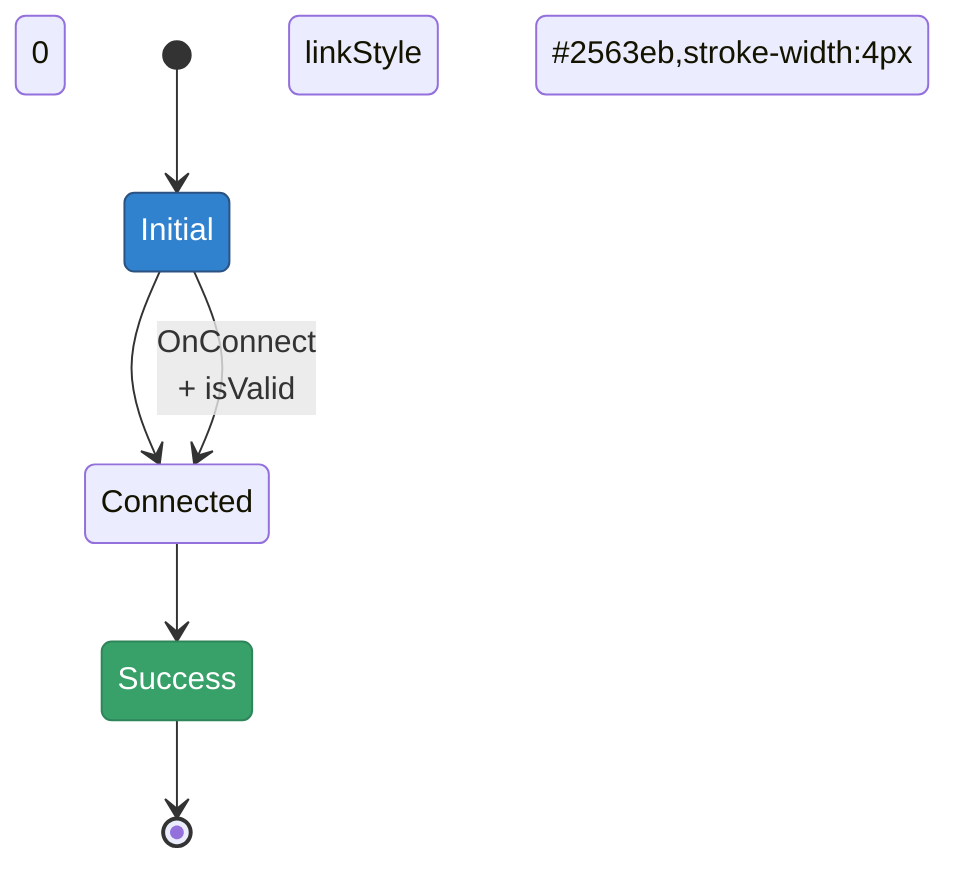

# FSM Visualization Design Document

**Date:** January 28, 2026
**Task:** 38700-datahub-behaviour-transition
**Subtask:** Enhanced FSM Visualization with Mermaid

## Current State

The TransitionPanel renders a Mermaid state diagram showing:

- All states in the FSM
- All transitions between states
- Initial state markers (`[*] -->`)
- Terminal state markers (`--> [*]`)

**Current limitations:**

- All states have the same color (Mermaid default)
- Transition labels only show event name (no guards)
- No visual indication of which transition is currently selected
- No way to see transition descriptions without hovering

## Requirements

1. **State colors** - Match the color scheme used in TransitionSelect badges
2. **Transition labels** - Include guards with proper layout (`event<br>+ guard`)
3. **Selected transition highlighting** - Visually distinguish the selected transition
4. **Transition descriptions** - Optionally show description for selected transition

## Design Decisions

### 1. State Color Scheme

Use Chakra UI color schemes that match TransitionSelect badges:

| State Type   | Chakra ColorScheme | Mermaid Color         |
| ------------ | ------------------ | --------------------- |
| INITIAL      | blue               | `#3182ce` (blue.500)  |
| INTERMEDIATE | gray               | `#718096` (gray.500)  |
| SUCCESS      | green              | `#38a169` (green.500) |
| FAILED       | red                | `#e53e3e` (red.500)   |

**Implementation:** Mermaid `classDef` and `:::className` syntax

```mermaid
classDef initial fill:#3182ce,stroke:#2c5282,color:#fff
classDef intermediate fill:#718096,stroke:#4a5568,color:#fff
classDef success fill:#38a169,stroke:#2f855a,color:#fff
classDef failed fill:#e53e3e,stroke:#c53030,color:#fff

StateA:::initial
StateB:::intermediate
StateC:::success
StateD:::failed
```

### 2. Transition Label with Guards

**Option A: Single line with separator**

```
event + guard
```

Pro: Simple, compact
Con: Can be long and wrap awkwardly

**Option B: Multi-line with line break (RECOMMENDED)**

```
event
+ guard
```

Pro: Clear visual separation, better readability
Con: Takes more vertical space

**Implementation:**

```typescript
const label = transition.guards ? `${transition.event}<br/>+ ${transition.guards}` : transition.event
```

### 3. Selected Transition Highlighting

**Option A: Bold arrow with thicker stroke**

```mermaid
linkStyle 2 stroke:#2563eb,stroke-width:4px
```

Pro: Clear visual distinction
Con: May look heavy on small diagrams

**Option B: Different color (blue highlight)**

```mermaid
linkStyle 2 stroke:#3b82f6,stroke-width:3px
```

Pro: Uses color to draw attention
Con: May conflict with state colors

**Option C: Both bold and colored (RECOMMENDED)**

```mermaid
linkStyle 2 stroke:#2563eb,stroke-width:4px,color:#1e40af
```

Pro: Maximum visibility
Con: Most intrusive

**Option D: Dashed line with label styling**

```mermaid
linkStyle 2 stroke:#3b82f6,stroke-width:2px,stroke-dasharray:5
```

Pro: Subtle but distinctive
Con: May look like "proposed" rather than "selected"

**DECISION: Option C** - Use bold stroke + blue color for maximum clarity

### 4. Transition Description Display

**Option A: Note block attached to selected transition**

```mermaid
note right of StateA
  Description text here
end note
```

Pro: Integrated into diagram
Con: Mermaid stateDiagram-v2 doesn't support notes well

**Option B: Append description to transition label**

```
event
+ guard
[Description]
```

Pro: Shows inline with transition
Con: Can make labels very long, cluttered

**Option C: External tooltip/card below diagram (RECOMMENDED)**
Display description in a separate Card/Alert below the Mermaid diagram when a transition is selected.

Pro: Clean diagram, full description visible, can include more metadata
Con: Requires separate UI component

**DECISION: Option C** - Keep diagram clean, show description in separate component

### 5. Identifying Selected Transition

Need to match selected transition from form to Mermaid diagram transition.

**Data available:**

- Selected: `event`, `from` (fromState), `to` (toState), `guards`
- Mermaid: Array of transitions with same properties

**Matching strategy:**

```typescript
const isSelectedTransition = (transition: FsmTransition, selected: SelectedTransition) => {
  return (
    transition.event === selected.event && transition.fromState === selected.from && transition.toState === selected.to
  )
}
```

**Edge case:** Multiple transitions with same event/from/to but different guards

- **Solution:** Include guards in matching logic

## Implementation Plan

### Phase 1: State Colors ✅

1. Define Chakra color mappings
2. Add `classDef` declarations to Mermaid script
3. Apply classes to each state based on type
4. Test with all three behavior models

### Phase 2: Transition Labels with Guards ✅

1. Update transition label generation
2. Add `<br/>+ ${guard}` for transitions with guards
3. Test layout with short and long guard names
4. Handle wrapping for very long labels

### Phase 3: Selected Transition Highlighting ✅

1. Add `selectedTransition` prop to FiniteStateMachineFlow
2. Thread through to MermaidRenderer
3. Find index of selected transition in array
4. Add `linkStyle` declaration for that index
5. Test with all transition types

### Phase 4: Description Display ✅

1. Create TransitionDescription component
2. Display below diagram when transition selected
3. Show: event, guards, description, from→to states
4. Style as info Alert or Card

## Open Questions & Iteration Points

1. **Color accessibility** - Are the chosen colors sufficiently distinct for color-blind users?

   - Consider adding patterns/textures in addition to colors
   - Test with accessibility tools

2. **Diagram complexity** - How does it scale with 10+ states and 20+ transitions?

   - May need zoom/pan controls
   - Consider React Flow renderer as alternative

3. **Guard label wrapping** - What's the max guard name length before it looks bad?

   - Test with real guard names from JSON schema
   - May need truncation strategy

4. **Selection feedback loop** - Should clicking a transition in the diagram update the form?

   - Currently form → diagram (one-way)
   - Could add diagram → form (two-way)
   - Requires click handlers on Mermaid (complex)

5. **Animation** - Should selected transition animate or pulse?

   - Could add CSS animation to highlighted link
   - May be distracting for frequent changes

6. **Multiple selected transitions** - What if form supports multiple selections?
   - Current design assumes single selection
   - Could highlight multiple with different intensities

## Testing Strategy

1. **Visual regression tests** - Screenshot comparison of diagrams
2. **Color contrast tests** - Ensure WCAG AA compliance
3. **Layout tests** - Verify guard labels don't overlap
4. **Selection tests** - Verify correct transition highlighted
5. **Cross-browser tests** - Mermaid rendering consistency

## Chakra UI Theme Integration

Chakra UI uses semantic color tokens that adapt to light/dark mode:

```typescript
// Light mode (default)
blue.500: '#3182ce'
gray.500: '#718096'
green.500: '#38a169'
red.500: '#e53e3e'

// Dark mode
blue.500: '#63b3ed' (lighter)
gray.500: '#a0aec0' (lighter)
green.500: '#68d391' (lighter)
red.500: '#fc8181' (lighter)
```

**Decision:** Use CSS variables from Chakra theme if possible, otherwise hardcode light mode colors for now and add dark mode support later.

## Mermaid Syntax Reference



## Next Steps

1. Implement Phase 1 (State Colors)
2. Test with all three behavior models
3. Get user feedback on color choices
4. Implement Phase 2 (Guards)
5. Iterate based on feedback
6. Implement Phases 3-4

## References

- Mermaid State Diagram Syntax: https://mermaid.js.org/syntax/stateDiagram.html
- Chakra UI Colors: https://chakra-ui.com/docs/styled-system/theme#colors
- WCAG Color Contrast: https://www.w3.org/WAI/WCAG21/Understanding/contrast-minimum.html
