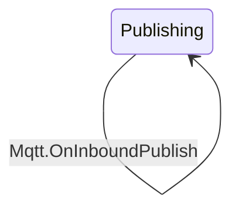

# React Flow FSM Renderer Refactoring Plan

**Date:** January 29, 2026
**Task:** 38700-datahub-behaviour-transition
**Context:** Improve React Flow renderer with better layout and theme integration

## Current State Analysis

### Existing Implementation (ReactFlowRenderer.tsx)

**Layout Algorithm:** ELK.js with `mrtree` (Multi-rooted tree)

```typescript
elkOptions: {
  'elk.algorithm': 'mrtree',
  'elk.spacing.nodeNode': '50',
  'elk.mrtree.edgeRoutingMode': 'MIDDLE_TO_MIDDLE',
  'elk.mrtree.searchOrder': 'BFS',
}
```

**Node Structure:**

- **State nodes:** Custom `StateNode` component (Card with border styling)
- **Transition nodes:** Custom `TransitionNode` component (Tag with Checkbox)
- Transitions rendered as intermediate nodes (not edges)

**Styling Approach:**

- Hardcoded border styles based on state type
- No theme integration
- No color scheme matching with Badge components
- Fixed node dimensions (150x50)

**Problems:**

1. ❌ ELK `mrtree` is complex and over-engineered for simple FSMs
2. ❌ Spacing of 50px is too tight
3. ❌ No theme awareness (light/dark mode)
4. ❌ Doesn't match Mermaid visual style (Badge colors)
5. ❌ Transition nodes as intermediate nodes clutters the layout
6. ❌ No selected transition highlighting
7. ❌ **Self-referencing edges not handled properly** (CRITICAL for FSMs)

---

## Proposed Architecture

### 1. Layout Algorithm: Dagre Vertical Tree

**Why Dagre over ELK?**

- ✅ **Simpler:** Hierarchical tree algorithm, perfect for FSMs (INITIAL → INTERMEDIATE → SUCCESS/FAILED)
- ✅ **Better spacing:** More configurable with `ranksep` and `nodesep`
- ✅ **Proven in codebase:** Already used successfully in Workspace
- ✅ **Vertical tree:** Natural for state machines (top-to-bottom flow)

**Recommended Settings:**

```typescript
const FSM_DAGRE_OPTIONS: DagreOptions = {
  rankdir: 'TB', // Top-to-bottom (vertical tree)
  ranksep: 150, // Space between ranks (INITIAL -> INTERMEDIATE -> SUCCESS)
  nodesep: 100, // Space between nodes at same rank
  edgesep: 30, // Space between edges
  ranker: 'network-simplex', // Default ranker
  animate: true,
  animationDuration: 300,
  fitView: true,
}
```

**Why Vertical Tree?**

- FSMs have natural hierarchy: INITIAL → INTERMEDIATE → TERMINAL (SUCCESS/FAILED)
- Easier to read top-to-bottom than left-to-right
- Matches mental model of state progression

**Alternative:** WebCola force-directed

- Could work but less structured
- More organic/clustered appearance
- Harder to predict node positions

---

## 2. Theme Integration Strategy

### Apply Mermaid Approach to React Flow

#### StateNode Theme Colors (Badge Subtle Variant)

**Current:** Hardcoded border styles only

```typescript
const stateStyle: Record<string, CardBodyProps> = {
  INITIAL: { borderStyle: 'dashed', borderWidth: 2 },
  SUCCESS: { borderStyle: 'solid', borderWidth: 4 },
  INTERMEDIATE: {},
  FAILED: { borderStyle: 'dashed', borderWidth: 4 },
}
```

**Proposed:** Theme-aware Badge colors

```typescript
import { useTheme, useColorMode, Badge } from '@chakra-ui/react'

const StateNode: FC<NodeProps<Node<FsmState>>> = (props) => {
  const theme = useTheme()
  const { colorMode } = useColorMode()

  // Match Badge subtle variant colors
  const getStateColors = (stateType: FsmState.Type) => {
    const isDark = colorMode === 'dark'

    switch (stateType) {
      case 'INITIAL':
        return {
          bg: isDark ? 'rgba(144, 205, 244, 0.16)' : theme.colors.blue[100],
          text: isDark ? theme.colors.blue[200] : theme.colors.blue[800],
          border: isDark ? theme.colors.blue[300] : theme.colors.blue[200],
        }
      case 'INTERMEDIATE':
        return {
          bg: isDark ? 'rgba(237, 242, 247, 0.16)' : theme.colors.gray[100],
          text: isDark ? theme.colors.gray[200] : theme.colors.gray[800],
          border: isDark ? theme.colors.gray[300] : theme.colors.gray[200],
        }
      case 'SUCCESS':
        return {
          bg: isDark ? 'rgba(154, 230, 180, 0.16)' : theme.colors.green[100],
          text: isDark ? theme.colors.green[200] : theme.colors.green[800],
          border: isDark ? theme.colors.green[300] : theme.colors.green[200],
        }
      case 'FAILED':
        return {
          bg: isDark ? 'rgba(254, 178, 178, 0.16)' : theme.colors.red[100],
          text: isDark ? theme.colors.red[200] : theme.colors.red[800],
          border: isDark ? theme.colors.red[300] : theme.colors.red[200],
        }
    }
  }

  const colors = getStateColors(props.data.type)

  return (
    <Card
      bg={colors.bg}
      borderColor={colors.border}
      borderWidth={props.selected ? 12 : 2}
      borderStyle="solid"
    >
      <CardBody>
        <Text color={colors.text}>{props.data.name}</Text>
      </CardBody>
    </Card>
  )
}
```

#### Edge Styling (Theme-aware)

**Current:** Default React Flow edges (black)

**Proposed:** Theme-aware gray edges

```typescript
const defaultEdgeOptions = {
  style: {
    stroke: colorMode === 'dark' ? theme.colors.whiteAlpha[400] : theme.colors.gray[400],
    strokeWidth: 2,
  },
  markerEnd: {
    type: MarkerType.ArrowClosed,
    color: colorMode === 'dark' ? theme.colors.whiteAlpha[400] : theme.colors.gray[400],
  },
}

// Selected edge (thicker)
const selectedEdgeStyle = {
  strokeWidth: 4,
}
```

---

## 3. Self-Referencing Edges (Critical Issue)

### Problem Statement

FSMs frequently have **self-loops** - transitions that go from a state back to itself:

**Example from Publish.quota model:**

```
Publishing --> Publishing : Mqtt.OnInboundPublish
```

**React Flow's Default Behavior:**

- Native edge components don't render self-loops properly
- They appear as invisible or tiny straight lines
- Makes the diagram unusable for FSMs with self-referencing transitions

**Real-world Impact:**
Looking at the Publish.quota FSM:

- `Publishing --> Publishing : Mqtt.OnInboundPublish` (self-loop)
- `Connected --> Connected : ...` (potential self-loop)

These are **common patterns** in FSMs (e.g., staying in the same state while processing events).

### Proposed Solution: Custom Self-Loop Edge Component

**Approach:** Create a custom React Flow edge type that renders self-loops as circular arcs

#### Implementation Strategy

**1. Custom Edge Component: `SelfLoopEdge`**

```typescript
import { BaseEdge, EdgeProps, getBezierPath } from '@xyflow/react'
import { useTheme, useColorMode } from '@chakra-ui/react'

export const SelfLoopEdge: React.FC<EdgeProps> = ({
  id,
  source,
  target,
  sourceX,
  sourceY,
  sourcePosition,
  targetX,
  targetY,
  targetPosition,
  data,
  style = {},
  markerEnd,
  label,
  labelStyle,
  labelBgStyle,
}) => {
  const theme = useTheme()
  const { colorMode } = useColorMode()

  const edgeColor = colorMode === 'dark' ? theme.colors.whiteAlpha[400] : theme.colors.gray[400]
  const isSelfLoop = source === target

  if (isSelfLoop) {
    // Create a circular arc path for self-loops
    const loopSize = 40 // Radius of the loop
    const loopOffset = 30 // How far to offset from node

    // Calculate control points for a circular arc
    // Position loop above the node
    const centerX = sourceX
    const centerY = sourceY - loopOffset

    // SVG path for circular arc loop
    // Start from right side, arc up and around, end at top
    const path = `
      M ${centerX + 15},${sourceY}
      Q ${centerX + loopSize},${centerY - loopSize / 2}
        ${centerX},${centerY - loopSize}
      Q ${centerX - loopSize},${centerY - loopSize / 2}
        ${centerX - 15},${sourceY}
    `

    // Label position (above the loop)
    const labelX = centerX
    const labelY = centerY - loopSize - 10

    return (
      <>
        <path
          id={id}
          d={path}
          fill="none"
          stroke={style.stroke || edgeColor}
          strokeWidth={style.strokeWidth || 2}
          markerEnd={markerEnd}
          className="react-flow__edge-path"
        />
        {label && (
          <g transform={`translate(${labelX}, ${labelY})`}>
            {labelBgStyle && (
              <rect
                x={-30}
                y={-10}
                width={60}
                height={20}
                rx={4}
                fill={labelBgStyle.fill || 'transparent'}
              />
            )}
            <text
              x={0}
              y={0}
              textAnchor="middle"
              dominantBaseline="middle"
              style={labelStyle}
              className="react-flow__edge-label"
            >
              {label}
            </text>
          </g>
        )}
      </>
    )
  }

  // Regular edge - use default bezier path
  const [edgePath, labelXPos, labelYPos] = getBezierPath({
    sourceX,
    sourceY,
    sourcePosition,
    targetX,
    targetY,
    targetPosition,
  })

  return (
    <BaseEdge
      id={id}
      path={edgePath}
      style={style}
      markerEnd={markerEnd}
      label={label}
      labelX={labelXPos}
      labelY={labelYPos}
      labelStyle={labelStyle}
      labelBgStyle={labelBgStyle}
    />
  )
}
```

**2. Register Custom Edge Type**

```typescript
const edgeTypes = useMemo(
  () => ({
    selfLoop: SelfLoopEdge, // Custom edge for self-loops
  }),
  []
)

<ReactFlow
  nodes={nodes}
  edges={edges}
  nodeTypes={nodeTypes}
  edgeTypes={edgeTypes}  // Register custom edge
  // ...
/>
```

**3. Detect and Assign Self-Loop Edge Type**

```typescript
const transitionEdges: Edge[] = props.transitions.map((transition) => {
  const isSelfLoop = transition.fromState === transition.toState
  const selected = isEdgeSelected(transition)

  return {
    id: `${transition.fromState}-${transition.toState}-${transition.event}`,
    source: transition.fromState,
    target: transition.toState,
    type: isSelfLoop ? 'selfLoop' : 'smoothstep', // Use custom type for self-loops
    label: getEdgeLabel(transition),
    data: transition,
    markerEnd: {
      type: MarkerType.ArrowClosed,
      color: edgeColor,
    },
    style: {
      stroke: edgeColor,
      strokeWidth: selected ? 4 : 2,
    },
    // ...
  }
})
```

#### Visual Design for Self-Loops

**Mermaid Rendering:**

```
     ┌──────────┐
     │Publishing│◄───┐
     └──────────┘    │
          ↓          │ Mqtt.OnInboundPublish
     ─────────────────
```

**React Flow Target:**

```
        Mqtt.OnInboundPublish
              ╭─────╮
              │     │
              ↓     ↑
         ┌──────────┐
         │Publishing│
         └──────────┘
```

**Key Design Decisions:**

1. **Loop position:** Above the node (avoids collision with downward flow)
2. **Loop size:** 40px radius (visible but not overwhelming)
3. **Arrow placement:** At return point (shows direction clearly)
4. **Label position:** Above the loop (readable, doesn't overlap)

#### Advanced Considerations

**Multiple Self-Loops on Same Node:**
If a state has multiple self-loops (rare but possible):

```typescript
// Offset loops horizontally based on index
const loopOffsetX = (selfLoopIndex - totalSelfLoops / 2) * 50
```

**Loop Direction Options:**

- Above node (default) - works with TB layout
- To the side (alternative) - works with LR layout
- Make configurable based on layout direction

---

## 4. Transition Representation

### Current Approach: Transitions as Intermediate Nodes

**Problems:**

- Clutters the layout with extra nodes
- Makes diagram harder to read
- Doesn't match Mermaid visual style
- **Hides self-loops entirely** (critical issue)

**Proposed Approach: Transitions as Edge Labels (with Custom Self-Loop Handling)**

```typescript
// Instead of creating transition nodes:
const initialEdges: Edge[] = props.transitions.map((transition) => ({
  id: `${transition.fromState}-${transition.toState}-${transition.event}`,
  source: transition.fromState,
  target: transition.toState,
  label: transition.event,
  data: transition, // Store full transition data
  type: 'smoothstep', // or 'default'
  markerEnd: {
    type: MarkerType.ArrowClosed,
  },
  // Show guards in label
  labelStyle: { fontSize: 12 },
  labelBgStyle: { fill: 'transparent' },
}))
```

**Benefits:**

- ✅ Cleaner layout (fewer nodes)
- ✅ Matches Mermaid approach
- ✅ Easier to understand at a glance
- ✅ More space-efficient

**Guard Display:**

```typescript
const getEdgeLabel = (transition: FsmTransition): string => {
  const guards = transition.guards
  return guards ? `${transition.event}\n+ ${guards}` : transition.event
}
```

---

## 4. Selected Transition Highlighting

### Pass Selected Transition Down

```typescript
interface ReactFlowRendererProps extends FiniteStateMachine {
  selectedTransition?: {
    event: string
    from: string
    to: string
  }
}

export const ReactFlowRenderer: FC<ReactFlowRendererProps> = (props) => {
  // Identify selected edge
  const edges = initialEdges.map((edge) => ({
    ...edge,
    selected:
      props.selectedTransition &&
      edge.source === props.selectedTransition.from &&
      edge.target === props.selectedTransition.to &&
      edge.data.event === props.selectedTransition.event,
    style: {
      ...defaultEdgeOptions.style,
      strokeWidth: edge.selected ? 4 : 2,
    },
  }))

  // Identify selected nodes (source and target)
  const nodes = initialNodes.map((node) => ({
    ...node,
    selected:
      props.selectedTransition &&
      (node.id === props.selectedTransition.from || node.id === props.selectedTransition.to),
  }))
}
```

StateNode automatically gets `props.selected` from React Flow, use it for thick borders.

---

## 5. Refactoring Phases

### Phase 1: Layout Algorithm Migration ⚙️

**Goal:** Replace ELK with Dagre vertical tree

**Tasks:**

1. Import Dagre from existing workspace implementation
2. Create FSM-specific layout options
3. Replace `getLayoutedElements` with Dagre implementation
4. Test with all three behavior models (Publish.quota, etc.)

**Files to modify:**

- `ReactFlowRenderer.tsx`

**Estimated effort:** 1-2 hours

---

### Phase 2: Custom Self-Loop Edge Component 🔄 **[CRITICAL]**

**Goal:** Create custom edge component for self-referencing transitions

**Tasks:**

1. Create `SelfLoopEdge.tsx` component

   - Implement circular arc path rendering
   - Position label above loop
   - Handle arrow marker placement
   - Apply theme-aware colors

2. Register custom edge type in `ReactFlowRenderer.tsx`

   - Add to `edgeTypes` map
   - Detect self-loops (`source === target`)
   - Assign `type: 'selfLoop'`

3. Test self-loop rendering:
   - Single self-loop per node
   - Multiple self-loops (if applicable)
   - Selected state highlighting

**Files to create:**

- `src/extensions/datahub/components/fsm/SelfLoopEdge.tsx`

**Files to modify:**

- `ReactFlowRenderer.tsx`

**Why critical:** Without this, FSMs with self-loops are unusable in React Flow

**Estimated effort:** 2-3 hours

---

### Phase 3: Theme Integration 🎨

**Goal:** Apply Chakra UI theme to all FSM components

**Tasks:**

1. Update `StateNode.tsx`:

   - Add `useTheme()` and `useColorMode()`
   - Implement `getStateColors()` function
   - Apply Badge subtle variant colors
   - Use `props.selected` for thick borders

2. Update `ReactFlowRenderer.tsx`:

   - Apply theme-aware edge colors
   - Remove `TransitionNode` component
   - Convert transitions to labeled edges

3. Update `SelfLoopEdge.tsx`:

   - Apply theme-aware colors
   - Theme-aware label styling

4. Add `selectedTransition` prop support

**Files to modify:**

- `StateNode.tsx`
- `ReactFlowRenderer.tsx`
- `SelfLoopEdge.tsx`
- `FiniteStateMachineFlow.tsx` (pass selectedTransition prop)

**Estimated effort:** 2-3 hours

---

### Phase 4: Edge Label Styling 🏷️

**Goal:** Display transition events and guards on edges

**Tasks:**

1. Format edge labels with event + guards
2. Style labels (transparent background, theme-aware text)
3. Handle long labels (truncation or wrapping)
4. Position labels correctly on both regular and self-loop edges

**Files to modify:**

- `ReactFlowRenderer.tsx`
- `SelfLoopEdge.tsx`

**Estimated effort:** 1 hour

---

### Phase 5: Testing & Refinement 🧪

**Goal:** Ensure all features work and match Mermaid parity

**Tasks:**

1. Test with all behavior models (especially Publish.quota with self-loops)
2. Test light/dark mode switching
3. Test selected transition highlighting (including self-loops)
4. Test self-loop edge rendering:
   - Single self-loop visibility
   - Multiple self-loops on same node (if applicable)
   - Label positioning and readability
   - Arrow marker placement
5. Compare with Mermaid output for consistency
6. Adjust spacing if needed
7. Performance test with large FSMs

**Estimated effort:** 2-3 hours

---

## 6. Implementation Example

### Complete ReactFlowRenderer.tsx Refactor

```typescript
import type { FC } from 'react'
import { useCallback, useLayoutEffect, useMemo } from 'react'
import type { Edge, Node } from '@xyflow/react'
import { ReactFlow, MarkerType, useEdgesState, useNodesState, useReactFlow } from '@xyflow/react'
import { useTheme, useColorMode } from '@chakra-ui/react'
import dagre from '@dagrejs/dagre'

import { StateNode } from '@datahub/components/fsm/StateNode.tsx'
import type { FiniteStateMachine, FsmState, FsmTransition } from '@datahub/types.ts'

import '@xyflow/react/dist/style.css'

const FSM_DAGRE_OPTIONS = {
  rankdir: 'TB',
  ranksep: 150,
  nodesep: 100,
  edgesep: 30,
  ranker: 'network-simplex',
}

interface ReactFlowRendererProps extends FiniteStateMachine {
  selectedTransition?: {
    event: string
    from: string
    to: string
  }
}

const getLayoutedElements = (nodes: Node[], edges: Edge[]) => {
  const g = new dagre.graphlib.Graph()
  g.setDefaultEdgeLabel(() => ({}))
  g.setGraph(FSM_DAGRE_OPTIONS)

  nodes.forEach((node) => {
    g.setNode(node.id, { width: 150, height: 50 })
  })

  edges.forEach((edge) => {
    g.setEdge(edge.source, edge.target)
  })

  dagre.layout(g)

  return {
    nodes: nodes.map((node) => {
      const position = g.node(node.id)
      return {
        ...node,
        position: {
          x: position.x - 75, // center to top-left
          y: position.y - 25,
        },
      }
    }),
    edges,
  }
}

export const ReactFlowRenderer: FC<ReactFlowRendererProps> = (props) => {
  const [nodes, setNodes, onNodesChange] = useNodesState<Node>([])
  const [edges, setEdges, onEdgesChange] = useEdgesState<Edge>([])
  const { fitView } = useReactFlow()
  const theme = useTheme()
  const { colorMode } = useColorMode()

  const edgeColor = colorMode === 'dark' ? theme.colors.whiteAlpha[400] : theme.colors.gray[400]

  const { initialNodes, initialEdges } = useMemo(() => {
    // Create state nodes
    const stateNodes: Node<FsmState>[] = props.states.map((state) => ({
      id: state.name,
      type: 'state',
      data: state,
      position: { x: 0, y: 0 },
    }))

    // Helper to format edge label
    const getEdgeLabel = (transition: FsmTransition): string => {
      const guards = (transition as FsmTransition & { guards?: string }).guards
      return guards ? `${transition.event}\n+ ${guards}` : transition.event
    }

    // Check if edge is selected
    const isEdgeSelected = (transition: FsmTransition) => {
      if (!props.selectedTransition) return false
      return (
        transition.event === props.selectedTransition.event &&
        transition.fromState === props.selectedTransition.from &&
        transition.toState === props.selectedTransition.to
      )
    }

    // Create edges with labels
    const transitionEdges: Edge[] = props.transitions.map((transition) => {
      const selected = isEdgeSelected(transition)
      return {
        id: `${transition.fromState}-${transition.toState}-${transition.event}`,
        source: transition.fromState,
        target: transition.toState,
        label: getEdgeLabel(transition),
        data: transition,
        type: 'smoothstep',
        markerEnd: {
          type: MarkerType.ArrowClosed,
          color: edgeColor,
        },
        style: {
          stroke: edgeColor,
          strokeWidth: selected ? 4 : 2,
        },
        labelStyle: {
          fontSize: 12,
          fill: colorMode === 'dark' ? theme.colors.whiteAlpha[900] : theme.colors.gray[800],
        },
        labelBgStyle: {
          fill: 'transparent',
        },
      }
    })

    // Mark selected nodes
    const nodesWithSelection = stateNodes.map(node => ({
      ...node,
      selected: props.selectedTransition &&
        (node.id === props.selectedTransition.from ||
         node.id === props.selectedTransition.to),
    }))

    return {
      initialNodes: nodesWithSelection,
      initialEdges: transitionEdges
    }
  }, [props.states, props.transitions, props.selectedTransition, colorMode, theme, edgeColor])

  const onLayout = useCallback(() => {
    const { nodes: layoutedNodes, edges: layoutedEdges } = getLayoutedElements(
      initialNodes,
      initialEdges
    )

    setNodes(layoutedNodes)
    setEdges(layoutedEdges)
    window.requestAnimationFrame(() => fitView())
  }, [initialNodes, initialEdges, setNodes, setEdges, fitView])

  useLayoutEffect(() => {
    onLayout()
  }, [onLayout])

  const nodeTypes = useMemo(() => ({ state: StateNode }), [])

  return (
    <ReactFlow
      nodes={nodes}
      edges={edges}
      nodeTypes={nodeTypes}
      onNodesChange={onNodesChange}
      onEdgesChange={onEdgesChange}
      fitView
      proOptions={{ hideAttribution: true }}
    />
  )
}
```

---

## 7. Visual Comparison

### Current (ELK + Intermediate Nodes)

```
[INITIAL] ──→ [Mqtt.OnInboundConnect] ──→ [Connected]
```

- Too many boxes
- Harder to follow flow
- More cluttered
- **Self-loops invisible/broken**

### Proposed (Dagre + Edge Labels + Self-Loop Edges)

```
            Mqtt.OnInboundConnect
[INITIAL] ─────────────────────────→ [Connected]
                                           │
                                   OnInboundPublish
                                         ╭─┴─╮
                                         ↓   ↑
                                     [Publishing]
```

- Cleaner
- Easier to read
- More space-efficient
- **Self-loops clearly visible as circular arcs**

### Self-Loop Comparison

**Mermaid (Working):**



**React Flow Current (Broken):**

- Self-loop edge renders as invisible or tiny line
- Unusable

**React Flow Proposed (Fixed):**

```
        Mqtt.OnInboundPublish
              ╭─────╮
              │     │
              ↓     ↑
         ┌──────────┐
         │Publishing│
         └──────────┘
```

- Clear circular arc above node
- Label positioned above arc
- Arrow shows direction
- Matches Mermaid semantics

---

## 8. Benefits Summary

### Layout Improvements

- ✅ Better spacing (150px between ranks vs 50px)
- ✅ Vertical tree matches mental model
- ✅ Simpler algorithm (Dagre vs ELK)
- ✅ More predictable positioning

### Theme Integration

- ✅ Matches Mermaid visual style exactly
- ✅ Badge subtle variant colors (pastel + dark text)
- ✅ Light/dark mode support
- ✅ Automatic re-rendering on theme change

### User Experience

- ✅ Selected transition highlighting (thick borders + thick edge)
- ✅ Real-time updates
- ✅ Cleaner layout (no intermediate nodes)
- ✅ Guards displayed on edges

### Code Quality

- ✅ Reuses existing Workspace layout patterns
- ✅ Consistent with rest of application
- ✅ TypeScript type safety
- ✅ Easier to maintain

---

## 9. Open Questions

### 1. Edge Routing Style

**Options:**

- `default`: Straight lines
- `smoothstep`: Smooth 90-degree corners (RECOMMENDED)
- `step`: Sharp 90-degree corners
- `simplebezier`: Curved lines

**Recommendation:** `smoothstep` for clean, modern look

### 2. Node Dimensions

**Current:** 150x50 hardcoded

**Options:**

- Keep fixed dimensions
- Auto-size based on text length
- Make configurable

**Recommendation:** Keep fixed 150x50 for consistency

### 3. Multiple Edges Between Same States

**Problem:** If two transitions go from A → B with different events, they overlap

**Options:**

- Accept overlap (simplest)
- Use edge offset (complex)
- Show as single edge with multiple labels

**Recommendation:** Start with overlap, iterate if needed

### 4. Self-Loop Rendering Position

**Question:** Where to position self-loop arcs?

**Options:**

- Above node (default for TB layout)
- To the right (for LR layout)
- Make configurable based on layout direction

**Recommendation:** Above node for TB layout (our default)

### 5. Multiple Self-Loops on Same Node

**Question:** How to handle multiple self-loops on the same state?

**Example:**

```
StateA --> StateA : Event1
StateA --> StateA : Event2
```

**Options:**

- Stack loops vertically above node
- Offset loops horizontally (left/right of node)
- Combine into single edge with multiple labels

**Recommendation:** Offset horizontally if needed, but test if this pattern exists first

### 4. Feature Flag Strategy

**Current:** `DATAHUB_FSM_REACT_FLOW` enables React Flow

**After refactor:**

- Keep flag to allow switching between Mermaid and React Flow
- Default to Mermaid for now (more stable)
- React Flow as opt-in power user feature

---

## 10. Testing Strategy

### Visual Testing

1. Compare side-by-side with Mermaid
2. Test all three behavior models
3. Verify colors match Badge components exactly
4. Check light/dark mode

### Functional Testing

1. Test selected transition highlighting
2. Test layout with 5, 10, 15 states
3. Test with multiple transitions between same states
4. Test with guards and without guards

### Performance Testing

1. Time layout calculation (should be < 100ms)
2. Test with large FSM (20+ states, 50+ transitions)

---

## 11. Migration Path

### Step 1: Create Feature Branch

```bash
git checkout -b feat/38700-reactflow-refactor
```

### Step 2: Implement Phases

1. Phase 1: Layout (test with feature flag OFF)
2. Phase 2: Theme (test with feature flag ON)
3. Phase 3: Edge labels (test both renderers)
4. Phase 4: Testing & refinement

### Step 3: Documentation

- Update FSM_VISUALIZATION_DESIGN.md with React Flow approach
- Document layout options
- Add comparison screenshots

### Step 4: User Testing

- Get feedback on layout spacing
- Compare with Mermaid for consistency
- Iterate on spacing if needed

---

## 12. Estimated Total Effort

- **Phase 1 (Layout):** 1-2 hours
- **Phase 2 (Self-Loop Edge):** 2-3 hours **[CRITICAL]**
- **Phase 3 (Theme):** 2-3 hours
- **Phase 4 (Edge Labels):** 1 hour
- **Phase 5 (Testing):** 2-3 hours
- **Documentation:** 1 hour

**Total:** 9-13 hours

**Critical Path:** Self-loop edge component must be implemented before theme integration

---

## 13. Success Criteria

- ✅ Vertical tree layout with better spacing
- ✅ **Self-referencing edges render as visible circular loops** (CRITICAL)
- ✅ Self-loop labels positioned clearly above/beside node
- ✅ Theme-aware colors matching Badge subtle variant
- ✅ Light/dark mode support with automatic re-rendering
- ✅ Selected transition highlighting (nodes + edge, including self-loops)
- ✅ Transitions as edge labels (not intermediate nodes)
- ✅ Guards displayed on edges (including self-loops)
- ✅ Visual parity with Mermaid renderer
- ✅ Layout calculation < 100ms
- ✅ Works with all behavior models (especially Publish.quota with self-loops)

---

## References

- **Dagre Layout:** `src/modules/Workspace/utils/layout/dagre-layout.ts`
- **WebCola Layout:** `src/modules/Workspace/utils/layout/cola-force-layout.ts`
- **Mermaid Theme Integration:** `src/extensions/datahub/components/fsm/MermaidRenderer.tsx`
- **Badge Colors:** Chakra UI subtle variant (X.100 bg, X.800 text)
- **React Flow Docs:** https://reactflow.dev/
- **Dagre Docs:** https://github.com/dagrejs/dagre
