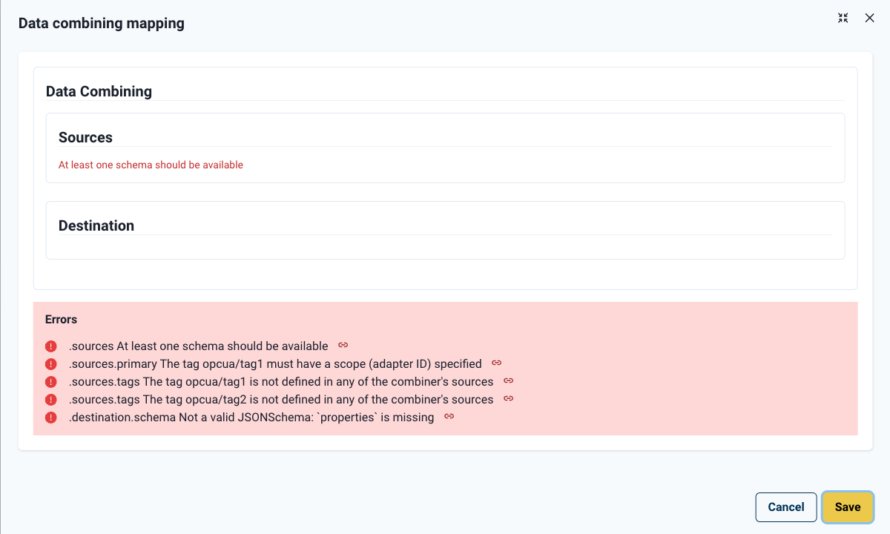

# Pull Request: Tag Reference Scope - Data Integrity Enhancement

**Kanban Ticket:** https://hivemq.kanbanize.com/ctrl_board/57/cards/38936/details/

---

## Description

This PR enhances the data integrity of combiner configurations by implementing proper scope tracking for tag references. When multiple protocol adapters expose tags with identical names, the system now maintains clear ownership, ensuring that each tag reference correctly identifies its source adapter.

The enhancement introduces:

- **Scope Field Integration**: All `DataIdentifierReference` objects now include a `scope` field that identifies the owning adapter for TAG types
- **Referential Integrity Validation**: Client-side validation ensures tag references point to valid adapters within the combiner's sources
- **Backward Compatibility**: Legacy combiners (created before this change) load gracefully with clear validation feedback
- **Operational Status Accuracy**: Workspace status computation now correctly distinguishes between identically-named tags from different adapters

### User Experience Improvements

**What users gain:**

- **Unambiguous Tag Selection**: When selecting tags from multiple adapters with the same tag name, the system tracks which adapter owns each reference
- **Data Integrity Protection**: Validation prevents saving combiner configurations with invalid or missing adapter references
- **Reliable Status Indicators**: Workspace operational status correctly reflects which adapter's tag is being used
- **Smooth Migration**: Existing combiners continue to work with clear guidance when validation issues are detected

### Technical Summary

**Implementation highlights:**

- Added `scope` field to `DataIdentifierReference` type (TAG types: adapterId string, non-TAG types: explicit null)
- Implemented RJSF custom validation (`validateDataIdentifierScope`) enforcing backend constraints
- Updated all 6 creation points where `DataIdentifierReference` objects are constructed
- Enhanced operational status computation to use scope for tag matching
- Added backward compatibility tests ensuring legacy data loads without crashes
- Updated 23 files across data handling, validation, status computation, and testing

---

## Out-of-Scope

**Stage 2: Full DataIdentifierReference Migration** (Separate PR)

- [ ] Migrate `sources.tags[]` from `string[]` to `DataIdentifierReference[]`
- [ ] Migrate `sources.topicFilters[]` from `string[]` to `DataIdentifierReference[]`
- [ ] Update all array handling code for unified data structure

**Additional Improvements:**

- [ ] Add scope auto-completion when user selects from single adapter
- [ ] Visual indicator in UI showing which adapter owns each tag
- [ ] Scope validation hints during tag selection (prevent invalid selections)

---

## Backward Compatibility

Legacy combiners load successfully and display validation feedback when attempting to save:



_Screenshot: Validation error when submitting legacy combiner without scope field_

---

## Test Coverage

### Comprehensive Testing

- **2032+ tests total, all passing ✅**
- **Unit tests (21)**: Custom RJSF validators for scope integrity
  - TAG types must have non-null scope referencing valid adapters
  - Non-TAG types must have explicit null scope
  - Validation applied to both primary sources and instruction sourceRefs
- **Component tests (4)**: Backward compatibility testing
  - Legacy payload loading without crashes
  - Validation warnings for missing scope
  - Modern payload handling with scope field
  - Accessibility compliance
- **Integration tests (8)**: Updated mock data across combiner and asset mapper tests
  - All mocks now include proper scope fields
  - Referential integrity maintained in test data

### Visual Regression

- Cypress component test screenshots
- Viewport: 1200x720
- Tests cover legacy data loading and validation feedback scenarios

---

## Reviewer Notes

**Focus areas for review:**

1. **Scope Validation Logic**: Review `validateDataIdentifierScope` in `useValidateCombiner.ts`

   - TAG types require non-null scope referencing valid adapters
   - Non-TAG types require explicit null scope
   - Validation applied to both `sources.primary` and `instructions[].sourceRef`

2. **Data Creation Points**: Verify all 6 locations properly set scope

   - `combining.utils.ts` (line 61, 69)
   - `MappingInstruction.tsx` (lines 85-87, 167-169)
   - `AutoMapping.tsx` (lines 47-50, 71-73)
   - `DestinationSchemaLoader.tsx` (lines 90-92)
   - `PrimarySelect.tsx` (uses formContext + getAdapterIdForTag)

3. **Test Data Integrity**: All mock data includes scope with correct referential integrity

   - Scope values reference actual adapters in sources
   - TAG mocks have adapter IDs, non-TAG mocks have explicit null

4. **Backward Compatibility**: Legacy data handling gracefully degrades
   - Component doesn't crash with missing scope
   - Validation provides clear feedback
   - User can fix by re-selecting tags

**Manual testing suggestions:**

1. **Create combiner with two adapters having same tag name:**

   - Add two OPC UA adapters (e.g., `opcua-1` and `opcua-2`)
   - Ensure both expose a tag named `temperature`
   - Create combiner selecting both adapters as sources
   - Select `temperature` as primary from `opcua-1`

2. **Verify scope preservation:**

   - Save the combiner
   - Reload the page
   - Open the combiner editor
   - Verify `primary.scope === 'opcua-1'`

3. **Test operational status:**

   - With combiner active, check workspace canvas
   - Edge from `opcua-1` should show operational status
   - Edge from `opcua-2` should show different status (not using its tag)

4. **Test legacy data handling:**
   - Manually edit combiner JSON in browser dev tools to remove scope
   - Reload combiner editor
   - Verify: component loads, validation shows error on save

**Quick test commands:**

```bash
# Run validation unit tests
npx vitest run useValidateCombiner.spec

# Run backward compatibility tests
npx cypress run --component --spec 'src/modules/Mappings/combiner/DataCombiningEditorDrawer.backward-compat.spec.cy.tsx'

# Run all tests
pnpm test

# Type check
pnpm type-check
```
