```mermaid
flowchart TD
    subgraph Create
        A[User Selects Sources] --> B[selectedSources in context]
        B --> C[✅ Full ownership preserved]
        C --> D[API: tags string array]
    end

    subgraph Save
        D --> E[POST /api/combiners]
        E --> F[Backend reconstructs from instructions]
        F --> G[Stores instructions with scope]
    end

    subgraph Reload
        G --> H[GET /api/combiners]
        H --> I[Frontend receives payload]
        I --> J[Reconstruct selectedSources]
        J --> K{Reconstruction sources?}
        K -->|From primary| L[✅ If same tag]
        K -->|From instructions| M[✅ Always available]
        K -->|From context lookup| N[✅ Fallback]
        L --> O[✅ Display with ownership]
        M --> O
        N --> O
    end

    style C fill:#90ee90
    style O fill:#90ee90
```

```mermaid
flowchart TD
    subgraph Create
        A[User Selects Sources] --> B["sources.tags: DataIdentifierReference[]"]
        B --> C[✅ Full ownership in API]
    end

    subgraph Save
        C --> D[POST /api/combiners]
        D --> E[Backend validates scope]
        E --> F[Stores with ownership]
    end

    subgraph Reload
        F --> G[GET /api/combiners]
        G --> H[Frontend receives payload]
        H --> I[sources.tags already has scope]
        I --> J[✅ Direct use, no reconstruction]
        J --> K[✅ Display with ownership]
    end

    style C fill:#90ee90
    style F fill:#90ee90
    style J fill:#90ee90
    style K fill:#90ee90
```

```mermaid
flowchart TD
    A[User Submits Form] --> B{Validate Primary}
    B -->|Has scope?| C[✅ Valid]
    B -->|Missing scope?| D[❌ Error]

    A --> E{Validate Instructions}
    E -->|sourceRef has scope?| F[✅ Valid]
    E -->|Missing scope?| G[❌ Error]

    A --> H{Validate selectedSources.tags}
    H -->|Has scope?| I[✅ Check if in entityQueries]
    H -->|Missing scope?| J[❌ Error]
    I -->|Scope valid?| K[✅ Valid]
    I -->|Scope invalid?| L[❌ Error: Unknown adapter]

    A --> M{Validate selectedSources.topicFilters}
    M -->|scope === null?| N[✅ Valid]
    M -->|scope !== null?| O[❌ Error: Should be null]

    style K fill:#90ee90
    style N fill:#90ee90
```

# Data Flow Comparison: Current vs. Proposed

**Task:** 38943-mapping-ownership-overall
**Purpose:** Visual comparison of data structures and flows before/after changes

---

## Table of Contents

1. [Data Structure Evolution](#data-structure-evolution)
2. [Context Structure](#context-structure)
3. [Selection Flow](#selection-flow)
4. [Save/Reload Cycle](#savereload-cycle)
5. [Validation Flow](#validation-flow)

---

## Data Structure Evolution

### Current State (Post-38936)

```mermaid
classDiagram
    class DataCombining {
        +string id
        +sources
        +destination
        +instructions[]
    }

    class Sources {
        +DataIdentifierReference primary ✅
        +string[] tags ❌
        +string[] topicFilters ❌
    }

    class Instruction {
        +DataIdentifierReference sourceRef ✅
        +string destination
        +string source
    }

    class DataIdentifierReference {
        +string id
        +type type
        +string scope ✅
    }

    DataCombining --> Sources
    DataCombining --> Instruction
    Sources --> DataIdentifierReference : primary
    Instruction --> DataIdentifierReference : sourceRef

    note for Sources "❌ tags/topicFilters are string arrays<br/>No ownership information"
    note for DataIdentifierReference "✅ Has scope field<br/>Fixed in 38936"
```



### Proposed State (After This Task)

**Option A: DataIdentifierReference Arrays**

```mermaid
classDiagram
    class DataCombining {
        +string id
        +sources
        +destination
        +instructions[]
    }

    class Sources {
        +DataIdentifierReference primary ✅
        +DataIdentifierReference[] tags ✅
        +DataIdentifierReference[] topicFilters ✅
    }

    class Instruction {
        +DataIdentifierReference sourceRef ✅
        +string destination
        +string source
    }

    class DataIdentifierReference {
        +string id
        +type type
        +string scope ✅
    }

    DataCombining --> Sources
    DataCombining --> Instruction
    Sources --> DataIdentifierReference : primary, tags, topicFilters
    Instruction --> DataIdentifierReference : sourceRef

    note for Sources "✅ All fields use DataIdentifierReference<br/>Complete ownership tracking"
    note for DataIdentifierReference "✅ Consistent across all fields"
```



---

## Context Structure

### Current (Index-Based)


**Problems:**

- ❌ Implicit index-based relationship
- ❌ Easy to break during refactoring
- ❌ Hard to debug mismatches
- ❌ No type-level enforcement

### Proposed (Explicit Pairing)


**Improvements:**

- ✅ Explicit entity-query pairing
- ✅ Type-safe relationship
- ✅ Cannot mismatch
- ✅ Self-documenting code
- ✅ Optional frontend-only ownership tracking

---

## Selection Flow

### Current Flow (Losing Ownership)


### Proposed Flow (Preserving Ownership)

**With Phase 2 (Frontend Context):**


**With Phase 3 (API Migration - Option A):**

```mermaid
sequenceDiagram
    participant User
    participant UI as CombinedEntitySelect
    participant Context as formContext
    participant Data as DataCombining

    User->>UI: Select opcua-1/temperature
    UI->>Context: Query entityQueries[0]
    Context-->>UI: temperature + entity.id: opcua-1
    UI->>UI: Create DataIdentifierReference {<br/>id: "temperature",<br/>type: TAG,<br/>scope: "opcua-1"<br/>}

    User->>UI: Confirm selection
    UI->>Data: sources.tags = [{<br/>id: "temperature",<br/>type: TAG,<br/>scope: "opcua-1"<br/>}]
    Note over Data: ✅ Full ownership in API!

    User->>UI: Select opcua-2/temperature
    UI->>Context: Query entityQueries[1]
    Context-->>UI: temperature + entity.id: opcua-2
    UI->>Data: sources.tags = [<br/>{id: "temperature", scope: "opcua-1"},<br/>{id: "temperature", scope: "opcua-2"}<br/>]
    Note over Data: ✅ Unambiguous!
```



---

## Save/Reload Cycle

### Current Cycle (Information Loss)

```mermaid
flowchart TD
    subgraph Create
        A[User Selects Sources] --> B[tags: 'temperature', 'temperature']
        B --> C[❌ Ambiguous which adapter]
    end

    subgraph Save
        C --> D[POST /api/combiners]
        D --> E[Backend reconstructs from instructions]
        E --> F[Stores 'temperature', 'temperature']
    end

    subgraph Reload
        F --> G[GET /api/combiners]
        G --> H[Frontend receives payload]
        H --> I{Can reconstruct ownership?}
        I -->|From tags array| J[❌ No - string only]
        I -->|From primary| K[✅ Yes - if same tag]
        I -->|From instructions| L[✅ Yes - if used]
        J --> M[❌ Display ambiguous]
    end

    style C fill:#ff6b6b
    style F fill:#ff6b6b
    style J fill:#ff6b6b
    style M fill:#ff6b6b
```



### Proposed Cycle (Complete Ownership)

**Phase 2 (Frontend Context):**



**Phase 3 (API Migration - Option A):**



---

## Validation Flow

### Current Validation (Incomplete)

```mermaid
flowchart TD
    A[User Submits Form] --> B{Validate Primary}
    B -->|Has scope?| C[✅ Valid]
    B -->|Missing scope?| D[❌ Error]

    A --> E{Validate Instructions}
    E -->|Has scope?| F[✅ Valid]
    E -->|Missing scope?| G[❌ Error]

    A --> H{Validate tags array}
    H --> I[❌ Cannot validate<br/>No scope to check]

    A --> J{Validate topicFilters array}
    J --> K[❌ Cannot validate<br/>No scope to check]

    style I fill:#ff6b6b
    style K fill:#ff6b6b
```



**Problems:**

- Cannot validate that "temperature" belongs to selected adapter
- Cannot check referential integrity
- Cannot detect duplicate tags from same adapter

### Proposed Validation (Complete)

**Phase 2 (Frontend Context):**



**Phase 3 (API Migration - Option A):**



```mermaid
flowchart TD
    A[User Submits Form] --> B{Validate All Fields}
    B --> C[sources.primary]
    B --> D[sources.tags array]
    B --> E[sources.topicFilters array]
    B --> F[instructions array]

    C --> C1{Has scope?}
    C1 -->|Yes, valid| C2[✅]
    C1 -->|No/invalid| C3[❌ Error]

    D --> D1{Each has scope?}
    D1 -->|All valid| D2{Scopes in entityQueries?}
    D1 -->|Some invalid| D3[❌ Error: Missing scope]
    D2 -->|All valid| D4[✅]
    D2 -->|Some invalid| D5[❌ Error: Unknown adapter]

    E --> E1{All scope === null?}
    E1 -->|Yes| E2[✅]
    E1 -->|No| E3[❌ Error: Should be null]

    F --> F1{All sourceRef have scope?}
    F1 -->|Yes, all valid| F2[✅]
    F1 -->|Some invalid| F3[❌ Error]

    style C2 fill:#90ee90
    style D4 fill:#90ee90
    style E2 fill:#90ee90
    style F2 fill:#90ee90
```

**Complete Validation Coverage:**

- ✅ Primary has valid scope
- ✅ Each tag has valid scope referencing entityQuery
- ✅ Topic filters have null scope
- ✅ Instructions have valid scope
- ✅ No orphaned references
- ✅ Referential integrity enforced

---

## Code Comparison Examples

### Example 1: Getting Adapter ID for Tag

**Current (Index-Based):**

```typescript
// ❌ Fragile: assumes parallel arrays
const adapterId = formContext.entities?.[queryIndex]?.id
```

**Proposed (Explicit):**

```typescript
// ✅ Type-safe: entity paired with query
const adapterId = entityQuery.entity.id
```

---

### Example 2: Processing Tags

**Current (Losing Ownership):**

```typescript
// ❌ Converts to string, loses adapterId
const newTags = selectedOptions.filter((opt) => opt.type === 'TAG').map((opt) => opt.value) // Just the string

// Result: ["temperature", "temperature"]
```

**Proposed Phase 2 (Context Ownership):**

```typescript
// ✅ Preserves full ownership
const newTags = selectedOptions
  .filter((opt) => opt.type === 'TAG')
  .map((opt) => ({
    id: opt.value,
    type: DataIdentifierReference.type.TAG,
    scope: opt.adapterId ?? null,
  }))

// Result: [
//   { id: "temperature", type: "TAG", scope: "opcua-1" },
//   { id: "temperature", type: "TAG", scope: "opcua-2" }
// ]

// Store in context
formContext.selectedSources.tags = newTags

// Also update API format for backward compatibility
formData.sources.tags = newTags.map((t) => t.id)
```

**Proposed Phase 3 (API Ownership):**

```typescript
// ✅ Direct assignment, no conversion
const newTags = selectedOptions
  .filter((opt) => opt.type === 'TAG')
  .map((opt) => ({
    id: opt.value,
    type: DataIdentifierReference.type.TAG,
    scope: opt.adapterId ?? null,
  }))

// Direct assignment to API
formData.sources.tags = newTags

// Result in API payload:
// sources: {
//   tags: [
//     { id: "temperature", type: "TAG", scope: "opcua-1" },
//     { id: "temperature", type: "TAG", scope: "opcua-2" }
//   ]
// }
```

---

### Example 3: Validation

**Current (Cannot Validate):**

```typescript
// ❌ Cannot validate ownership
formData?.sources?.tags?.forEach((tag, index) => {
  // tag is just a string "temperature"
  // Cannot check if it belongs to selected adapter
  // Cannot check if scope is valid
})
```

**Proposed (Complete Validation):**

```typescript
// ✅ Full validation
formData?.sources?.tags?.forEach((tag, index) => {
  if (tag.type === DataIdentifierReference.type.TAG) {
    // Check scope exists
    if (!tag.scope || tag.scope.trim() === '') {
      errors.sources?.tags?.[index]?.addError(`Tag ${tag.id} must have a scope`)
    }

    // Check scope is valid
    const entityExists = formContext.entityQueries.some((eq) => eq.entity.id === tag.scope)
    if (!entityExists) {
      errors.sources?.tags?.[index]?.addError(`Tag ${tag.id} references unknown adapter ${tag.scope}`)
    }

    // Check tag actually exists in that adapter's data
    const entityQuery = formContext.entityQueries.find((eq) => eq.entity.id === tag.scope)
    const tagExists = (entityQuery?.query.data?.items as DomainTag[])?.some((t) => t.name === tag.id)
    if (!tagExists) {
      errors.sources?.tags?.[index]?.addError(`Tag ${tag.id} not found in adapter ${tag.scope}`)
    }
  }
})
```

---

## Summary of Transformations

| Aspect                   | Current               | Phase 1               | Phase 2                                                   | Phase 3                      |
| ------------------------ | --------------------- | --------------------- | --------------------------------------------------------- | ---------------------------- |
| **Context Structure**    | Parallel arrays       | EntityQuery pairing   | + selectedSources                                         | Same as Phase 2              |
| **sources.tags**         | string[] ❌           | string[] ❌           | string[] (API)<br/>+ context DataIdentifierReference[] ✅ | DataIdentifierReference[] ✅ |
| **sources.topicFilters** | string[] ❌           | string[] ❌           | string[] (API)<br/>+ context DataIdentifierReference[] ✅ | DataIdentifierReference[] ✅ |
| **Ownership Tracking**   | Lost on selection ❌  | Lost on selection ❌  | Preserved in context ✅                                   | Fully persistent ✅          |
| **Reload Behavior**      | Cannot reconstruct ❌ | Cannot reconstruct ❌ | Reconstruct from instructions 🟡                          | Direct use ✅                |
| **Validation**           | Incomplete ❌         | Incomplete ❌         | Complete in context ✅                                    | Complete in API ✅           |
| **API Changes**          | None                  | None                  | None                                                      | Breaking change ⚠️           |
| **Risk**                 | N/A                   | Low ✅                | Low ✅                                                    | Medium-High ⚠️               |

---

## Visual Cheat Sheet

### What's Fixed Where


---

## Migration Path Visualization


---

## Quick Reference: Data Structures

### EntityQuery (Phase 1)

```typescript
interface EntityQuery {
  entity: EntityReference      // The adapter/bridge/broker
  query: UseQueryResult<...>   // The data query for this entity
}
```

### CombinerContext (Phase 2)

```typescript
interface CombinerContext {
  entityQueries: EntityQuery[]
  selectedSources?: {
    tags: DataIdentifierReference[]
    topicFilters: DataIdentifierReference[]
  }
}
```

### DataCombining Sources (Phase 3 - Option A)

```typescript
sources: {
  primary: DataIdentifierReference
  tags?: Array<DataIdentifierReference>        // Changed from string[]
  topicFilters?: Array<DataIdentifierReference> // Changed from string[]
}
```

---

This visualization document provides a complete before/after comparison for all major aspects of the ownership tracking implementation.
