# Implementation Plan: Complete Mapping Ownership

**Task:** 38943-mapping-ownership-overall
**Prerequisites:** Task 38936 (scope field for primary and instructions) ✅
**Last Updated:** February 5, 2026

---

## Strategic Approach

This plan follows a **phased, incremental approach** to minimize risk and allow early value delivery. Each phase can be deployed independently.

---

## Phase Overview

| Phase       | Dependency        | Scope     | Risk    | Can Start?                   |
| ----------- | ----------------- | --------- | ------- | ---------------------------- |
| **Phase 1** | ✅ Self-contained | 13 files  | 🟢 Low  | Yes, immediately             |
| **Phase 2** | ✅ Self-contained | 8 files   | 🟢 Low  | After Phase 1                |
| **Phase 3** | 🔒 Blocked        | 15+ files | 🟠 High | After API decision + backend |

---

## Phase 1: Query Structure Refactoring

### Dependency Status

- **Type:** ✅ Self-contained
- **Blockers:** None
- **Can Start:** Immediately

### Scope Metrics

- **Files to modify:** 13 files
  - 3 type definitions
  - 4 UI components
  - 2 utility files
  - 4 test files
- **New types:** 1 (`EntityQuery`)
- **API changes:** None
- **Behavioral changes:** None (pure refactoring)

### Risk Assessment

- **Risk Level:** 🟢 Low
- **Reversibility:** Easy (git revert, no data changes)
- **Testing complexity:** Low (existing tests still valid)
- **Production impact:** None (no behavior change)

### What Changes

Replace fragile index-based relationships with explicit type-safe pairings:


### Implementation Steps

#### 1.1: Define New Types

**File:** `src/modules/Mappings/types.ts`

```typescript
import type { UseQueryResult } from '@tanstack/react-query'
import type { EntityReference, DomainTagList, TopicFilterList } from '@/api/__generated__'

/**
 * Explicit pairing of an entity with its data query.
 * Replaces implicit index-based relationship between parallel arrays.
 */
export interface EntityQuery {
  /** The entity (adapter, bridge, broker) */
  entity: EntityReference
  /** The query for this entity's integration points (tags or topic filters) */
  query: UseQueryResult<DomainTagList | TopicFilterList, Error>
}

/**
 * Context passed to combiner form components via RJSF formContext
 */
export interface CombinerContext {
  /** Explicit entity-query pairings (replaces parallel entities/queries arrays) */
  entityQueries: EntityQuery[]
}
```

#### 1.2: Update Context Provider

**File:** `src/modules/Mappings/combiner/CombinedSchemaLoader.tsx`

**Before:**

```typescript
const formContext: CombinerContext = {
  entities: dataSources,
  queries: results,
}
```

**After:**

```typescript
const formContext: CombinerContext = {
  entityQueries: dataSources.map((entity, index) => ({
    entity,
    query: results[index],
  })),
}
```

#### 1.3: Update UI Components (4 files)

**CombinedEntitySelect.tsx**

```typescript
// Before: formContext?.entities?.[queryIndex]?.id
// After:  entityQuery.entity.id

const allOptions = useMemo(() => {
  return formContext?.entityQueries?.reduce<EntityOption[]>((acc, entityQuery) => {
    const { entity, query } = entityQuery // ✅ Explicit pairing

    if (!query.data?.items.length) return acc

    if ((query.data.items[0] as DomainTag).name) {
      const options = (query.data.items as DomainTag[]).map<EntityOption>((tag) => ({
        label: tag.name,
        value: tag.name,
        description: tag.description,
        adapterId: entity.id, // ✅ Direct access
        type: DataIdentifierReference.type.TAG,
      }))
      acc.push(...options)
    }
    // ... handle topic filters

    return acc
  }, [])
}, [formContext?.entityQueries])
```

**Other components to update:**

- `DataCombiningEditorField.tsx`
- `PrimarySelect.tsx`
- `useValidateCombiner.ts`

#### 1.4: Update Helper Functions

**File:** `src/modules/Mappings/utils/combining.utils.ts`

**Before:**

```typescript
// Index-based lookup across parallel arrays
for (let i = 0; i < formContext.queries.length; i++) {
  const query = formContext.queries[i]
  // ...
  if (found && adapterEntities[i]) {
    return adapterEntities[i].id // ❌ Index-based
  }
}
```

**After:**

```typescript
// Direct entity access
for (const { entity, query } of formContext.entityQueries) {
  if (entity.type !== EntityType.ADAPTER) continue

  const items = query.data?.items || []
  if (items.length > 0 && (items[0] as DomainTag).name) {
    const tags = items as DomainTag[]
    const found = tags.find((tag) => tag.name === tagId)
    if (found) {
      return entity.id // ✅ Direct access
    }
  }
}
```

#### 1.5: Update Tests (4 files)

All tests referencing `formContext.entities` or `formContext.queries` must be updated to use `formContext.entityQueries`.

### Completion Criteria

- [ ] TypeScript compiles without errors
- [ ] All 2011 tests pass
- [ ] No behavioral changes (same functionality)
- [ ] No index-based lookups remain
- [ ] Code review approved

### Files Changed

```
src/modules/Mappings/
├── types.ts                                    (1 new type)
├── combiner/
│   ├── CombinedSchemaLoader.tsx               (context creation)
│   ├── CombinedEntitySelect.tsx               (use entityQueries)
│   ├── DataCombiningEditorField.tsx           (use entityQueries)
│   └── PrimarySelect.tsx                      (use entityQueries)
├── hooks/
│   └── useValidateCombiner.ts                 (use entityQueries)
└── utils/
    ├── combining.utils.ts                     (helper functions)
    └── combining.utils.spec.ts                (tests)

Tests: 4 files
Total: 13 files
```

---

## Phase 2: Frontend Context Extension

### Dependency Status

- **Type:** ✅ Self-contained (frontend only)
- **Blockers:** Phase 1 completion
- **Can Start:** After Phase 1

### Scope Metrics

- **Files to modify:** 8 files
  - 1 type extension
  - 3 UI components
  - 2 state management
  - 2 test files
- **New state:** `selectedSources` in context
- **API changes:** None
- **Behavioral changes:** Ownership preserved in frontend

### Risk Assessment

- **Risk Level:** 🟢 Low
- **Reversibility:** Easy (backward compatible)
- **Testing complexity:** Medium (new state flow)
- **Production impact:** Minimal (frontend only)

### What Changes

Add ownership tracking to frontend context without changing API:


### Implementation Steps

#### 2.1: Extend CombinerContext

**File:** `src/modules/Mappings/types.ts`

```typescript
export interface CombinerContext {
  entityQueries: EntityQuery[]

  /**
   * Selected sources with full ownership information.
   * Maintained in frontend context to support UX flow without API changes.
   */
  selectedSources?: {
    tags: DataIdentifierReference[]
    topicFilters: DataIdentifierReference[]
  }
}
```

#### 2.2: Add State Management

**File:** `src/modules/Mappings/combiner/CombinedSchemaLoader.tsx`

```typescript
const [selectedSources, setSelectedSources] = useState<{
  tags: DataIdentifierReference[]
  topicFilters: DataIdentifierReference[]
}>({ tags: [], topicFilters: [] })

const formContext: CombinerContext = useMemo(() => ({
  entityQueries: /* ... */,
  selectedSources
}), [entityQueries, selectedSources])
```

#### 2.3: Update Selection Component

**File:** `src/modules/Mappings/combiner/DataCombiningEditorField.tsx`

Store selections with full ownership:

```typescript
<CombinedEntitySelect
  onChange={(newValue: MultiValue<EntityOption>) => {
    // Build DataIdentifierReference arrays with scope
    const newTags = newValue
      .filter((e) => e.type === DataIdentifierReference.type.TAG)
      .map((e) => ({
        id: e.value,
        type: DataIdentifierReference.type.TAG,
        scope: e.adapterId ?? null  // ✅ Preserve ownership
      }))

    const newTopicFilters = newValue
      .filter((e) => e.type === DataIdentifierReference.type.TOPIC_FILTER)
      .map((e) => ({
        id: e.value,
        type: DataIdentifierReference.type.TOPIC_FILTER,
        scope: null
      }))

    // Update context via callback
    onSourcesChange({ tags: newTags, topicFilters: newTopicFilters })

    // Update formData (API still expects strings)
    props.onChange?.({
      ...formData,
      sources: {
        ...formData?.sources,
        tags: newTags.map(t => t.id),
        topicFilters: newTopicFilters.map(tf => tf.id)
      }
    })
  }}
/>
```

#### 2.4: Reconstruction Logic

**File:** `src/modules/Mappings/combiner/CombinedSchemaLoader.tsx`

Rebuild `selectedSources` when loading existing combiner:

```typescript
const reconstructSelectedSources = (
  formData: DataCombining,
  formContext: CombinerContext
): { tags: DataIdentifierReference[]; topicFilters: DataIdentifierReference[] } => {
  const tags =
    formData.sources?.tags?.map((tagId) => {
      // Try primary
      if (
        formData.sources.primary?.id === tagId &&
        formData.sources.primary?.type === DataIdentifierReference.type.TAG
      ) {
        return formData.sources.primary
      }

      // Try instructions
      const instruction = formData.instructions?.find(
        (inst) => inst.sourceRef?.id === tagId && inst.sourceRef?.type === DataIdentifierReference.type.TAG
      )
      if (instruction?.sourceRef) {
        return instruction.sourceRef
      }

      // Fallback: lookup from context
      const adapterId = getAdapterIdForTag(tagId, formContext)
      return {
        id: tagId,
        type: DataIdentifierReference.type.TAG,
        scope: adapterId ?? null,
      }
    }) || []

  const topicFilters =
    formData.sources?.topicFilters?.map((tfId) => ({
      id: tfId,
      type: DataIdentifierReference.type.TOPIC_FILTER,
      scope: null,
    })) || []

  return { tags, topicFilters }
}
```

#### 2.5: Update Auto-Mapping

**File:** `src/modules/Mappings/combiner/components/AutoMapping.tsx`

Use `selectedSources` directly instead of complex lookups:

```typescript
// Before: complex lookup logic
const sourceRef = createInstructionSourceRef(...)

// After: direct access
const sourceRef = formContext.selectedSources?.tags.find(
  tag => tag.id === source.key
) || formContext.selectedSources?.topicFilters.find(
  tf => tf.id === source.key
)
```

### Completion Criteria

- [ ] TypeScript compiles without errors
- [ ] All tests pass
- [ ] `selectedSources` populated on user selection
- [ ] `selectedSources` reconstructed on reload
- [ ] Ownership preserved through full UX flow
- [ ] No API changes required

### Files Changed

```
src/modules/Mappings/
├── types.ts                                    (extend CombinerContext)
├── combiner/
│   ├── CombinedSchemaLoader.tsx               (state management + reconstruction)
│   ├── DataCombiningEditorField.tsx           (selection with ownership)
│   └── components/
│       └── AutoMapping.tsx                    (use selectedSources)
└── tests/                                      (2 test files)

Total: 8 files
```

---

## Phase 3: API Migration

### Dependency Status

- **Type:** 🔒 Blocked
- **Blockers:**
  1. **Decision needed:** Choose Option A, B, or C (see below)
  2. **Backend team:** Availability + coordination
  3. **API strategy:** Versioning, migration path, deployment window
- **Can Start:** After decision + backend coordination

### Scope Metrics

- **Files to modify:** 15-25 files (depends on option chosen)
- **API changes:** Breaking (requires migration)
- **Backend coordination:** Required
- **Deployment coordination:** Required

### Risk Assessment

- **Risk Level:** 🟠 High
- **Reversibility:** Complex (requires rollback plan)
- **Testing complexity:** High (integration, migration, E2E)
- **Production impact:** High (data migration required)

### Decision Point: Choose API Strategy

```mermaid
flowchart TD
    Start{Choose API Strategy}

    Start -->|Recommended| OptionA[Option A:<br/>DataIdentifierReference Arrays]
    Start -->|Simplest| OptionB[Option B:<br/>Remove from API]
    Start -->|Compromise| OptionC[Option C:<br/>Entity-Source Mapping]

    OptionA --> Backend1[Backend: 8-10 files]
    OptionB --> Backend2[Backend: 5-7 files]
    OptionC --> Backend3[Backend: 12-15 files]

    Backend1 --> Frontend1[Frontend: 15 files]
    Backend2 --> Frontend2[Frontend: 8 files]
    Backend3 --> Frontend3[Frontend: 20 files]

    Frontend1 --> Complete[✅ Complete Solution]
    Frontend2 --> Minimal[⚠️ Lost on Reload]
    Frontend3 --> Balanced[✅ Balanced]

    style OptionA fill:#90ee90
    style OptionB fill:#ffd93d
    style OptionC fill:#87ceeb
```



### Option A: Migrate to DataIdentifierReference Arrays

**⭐ Recommended**

**API Change:**

```typescript
export type DataCombining = {
  id: string
  sources: {
    primary: DataIdentifierReference
    tags?: Array<DataIdentifierReference> // ✅ Was: Array<string>
    topicFilters?: Array<DataIdentifierReference> // ✅ Was: Array<string>
  }
  // ... rest unchanged
}
```

**Scope:**

- Backend files: 8-10
- Frontend files: 15
- Migration logic: Required
- API version: Breaking change

**Pros:**

- ✅ Complete ownership tracking
- ✅ Consistent with existing patterns (`primary`, `instructions`)
- ✅ Backend validates referential integrity
- ✅ Frontend reconstructs perfectly on reload
- ✅ Future-proof for additional metadata

**Cons:**

- ❌ Breaking API change (migration required)
- ❌ Larger payload size
- ❌ Backend coordination required

**When to choose:** If backend team agrees and migration window available

---

### Option B: Remove from API Entirely

**📋 Detailed Analysis:** See [OPTION_B_ANALYSIS.md](./OPTION_B_ANALYSIS.md) for React lifecycle safety and preprocessing strategy

**API Change:**

```typescript
export type DataCombining = {
  id: string
  sources: {
    primary: DataIdentifierReference
    // ❌ REMOVED: tags, topicFilters
  }
  // ... rest unchanged
}
```

**Scope:**

- Backend files: 5-7
- Frontend files: 8
- Migration logic: Not required (fields just removed)
- API version: Breaking change

**Pros:**

- ✅ Smallest payload
- ✅ No redundancy (backend reconstructs anyway)
- ✅ Simpler backend validation
- ✅ Phases 1-2 already prepared frontend for this

**Cons:**

- ❌ Lost after reload (must reconstruct from instructions)
- ❌ More complex reconstruction logic
- ❌ Cannot show selected sources if no instructions yet
- ❌ Breaking API change

**When to choose:** If backend confirms they reconstruct from instructions and don't need these fields

---

### Option C: Entity-Source Mapping

**API Change:**

```typescript
export type DataCombining = {
  id: string
  sources: {
    primary: DataIdentifierReference
    sourcesByEntity?: Array<{
      entityId: string
      tags?: Array<string>
      topicFilters?: Array<string>
    }>
    // Keep for backward compatibility during migration
    tags?: Array<string>
    topicFilters?: Array<string>
  }
  // ... rest unchanged
}
```

**Scope:**

- Backend files: 12-15
- Frontend files: 20
- Migration logic: Complex (two structures)
- API version: Non-breaking (additive)

**Pros:**

- ✅ Clear ownership (grouped by entity)
- ✅ Can be non-breaking (keep old fields during migration)
- ✅ Backend can validate per-entity

**Cons:**

- ❌ More complex structure
- ❌ Higher transformation overhead
- ❌ Two representations to maintain during migration

**When to choose:** If backward compatibility is critical and Option A too risky

---

### Decision Matrix

| Criterion                  | Option A    | Option B         | Option C     |
| -------------------------- | ----------- | ---------------- | ------------ |
| **Ownership tracking**     | ✅ Complete | ⚠️ Reconstructed | ✅ Complete  |
| **Backend work**           | Medium      | Low              | High         |
| **Frontend work**          | Medium      | Low              | High         |
| **Migration complexity**   | Medium      | Low              | High         |
| **Payload size**           | Larger      | Smaller          | Largest      |
| **Backward compatibility** | Breaking    | Breaking         | Non-breaking |
| **Future maintainability** | ✅ Best     | ⚠️ Complex       | ⚠️ Complex   |

**Recommendation:** Option A if backend available, Option B if backend confirms reconstruction

---

### Questions for Backend Team

Before starting Phase 3, we need answers to:

1. **Do you reconstruct `sources.tags/topicFilters` from instructions?**

   - If yes → Option B viable
   - If no → Option A or C needed

2. **Can you support migration window for breaking changes?**

   - If yes → Option A preferred
   - If no → Option C or delay

3. **Timeline for backend changes?**

   - Impacts when Phase 3 can start

4. **Preference on API structure?**
   - Review Options A/B/C

---

## Implementation Readiness

| Phase       | Ready?      | Blockers           | Action                   |
| ----------- | ----------- | ------------------ | ------------------------ |
| **Phase 1** | ✅ Yes      | None               | Can start immediately    |
| **Phase 2** | 🟡 After P1 | Phase 1 completion | Start after Phase 1 done |
| **Phase 3** | ❌ No       | Decision + Backend | Schedule backend meeting |

---

## Success Criteria

### Phase 1 Success

- [ ] No index-based lookups in codebase
- [ ] TypeScript compilation successful
- [ ] All 2011 tests passing
- [ ] No behavioral changes
- [ ] Code simpler and more maintainable

### Phase 2 Success

- [ ] `selectedSources` tracks ownership in frontend
- [ ] Ownership preserved through UX flow
- [ ] Reconstruction works on reload
- [ ] No API changes
- [ ] Tests verify ownership tracking

### Phase 3 Success (depends on option)

- [ ] API accepts chosen format
- [ ] Backend validates ownership
- [ ] Frontend sends correct data
- [ ] Migration handles existing data
- [ ] All tests pass (unit + integration + E2E)
- [ ] No production incidents

### Overall Success

- [ ] Can distinguish identical tags from different adapters
- [ ] Ownership never lost or ambiguous
- [ ] Operational status uses correct scope
- [ ] Code is type-safe and maintainable
- [ ] No runtime errors

---

## Risk Mitigation

| Risk                             | Impact   | Mitigation                                             |
| -------------------------------- | -------- | ------------------------------------------------------ |
| **Phase 1 introduces bugs**      | Medium   | Comprehensive tests, no behavior change, easy rollback |
| **Phase 2 reconstruction fails** | Low      | Fallback to context lookup, graceful degradation       |
| **Phase 3 breaks production**    | High     | Feature flags, staged rollout, 2-week migration window |
| **Backend unavailable**          | Medium   | Phases 1-2 deliverable independently                   |
| **Data loss in migration**       | Critical | Backup strategy, validation, rollback plan             |

---

## Next Steps

### Immediate Actions

1. ✅ Analysis complete
2. ✅ Implementation plan complete (this document)
3. ⏳ **Decision needed:** Review this plan
4. ⏳ **Decision needed:** Choose API strategy for Phase 3
5. ⏳ **Schedule:** Backend team meeting for Phase 3 coordination

### Phase 1 (Can start now)

1. Get approval to start
2. Implement query refactoring
3. Update all consumers
4. Verify tests pass
5. Deploy (low risk)

### Phase 2 (After Phase 1)

1. Add `selectedSources` to context
2. Implement state management
3. Add reconstruction logic
4. Verify ownership preserved
5. Deploy (low risk)

### Phase 3 (After decision + backend)

1. Coordinate with backend team
2. Implement chosen option
3. Migration strategy
4. Integration testing
5. Staged rollout

---

## Summary

**Can we start?**

- Phase 1: ✅ Yes, immediately
- Phase 2: 🟡 After Phase 1
- Phase 3: ❌ Blocked on decision + backend

**What's blocking us?**

- Phase 3 requires: API strategy decision + backend team coordination

**What decisions do you need to make?**

1. Approve starting Phase 1?
2. Choose API strategy (A/B/C) for Phase 3?
3. When to coordinate with backend team?

**Estimated scope for Phases 1-2 (what we can do now):**

- 21 files total
- 3-4 hours focused work (Phase 1)
- 4-6 hours focused work (Phase 2)
- All tests passing
- Production ready
