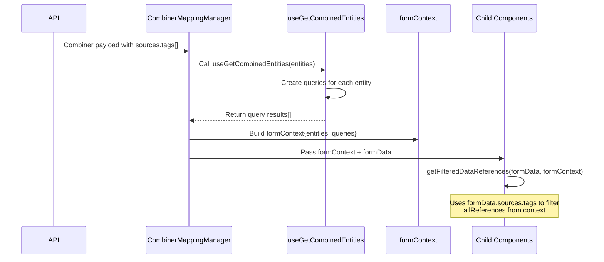
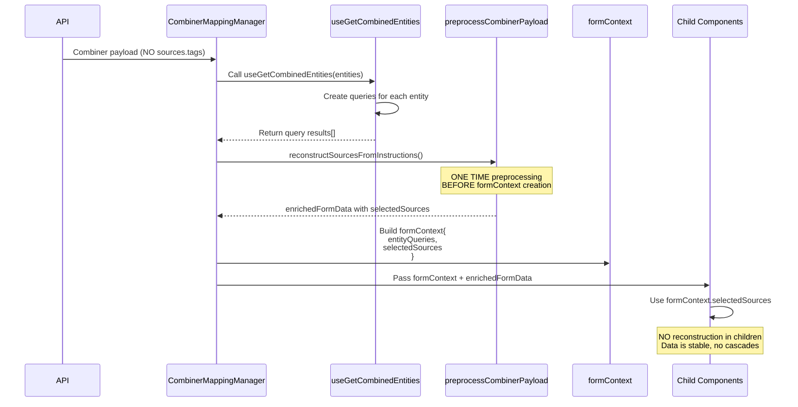

# Option B: Remove sources.tags/topicFilters from API

**Analysis for Task 38943**
**Date:** February 5, 2026
**Focus:** React lifecycle safety and preprocessing strategy

---

## Executive Summary

Option B removes `sources.tags` and `sources.topicFilters` from the API entirely, reconstructing them in the frontend from `instructions[].sourceRef`. The main risk is **not** lost data (already a problem), but **React lifecycle cascades** causing infinite re-renders or component thrashing.

**Key Strategy:** Preprocessing at load-time, ONE TIME, before any child components mount.

---

## Current Data Flow



**Current Reality:**
- `formData.sources.tags` comes from API (string array)
- `formContext` provides all available tags/topics from queries
- `getFilteredDataReferences()` filters context data by formData arrays
- Children read, but never write back to formData

---

## Option B Data Flow (Proposed)



**Key Changes:**
1. API payload has no `sources.tags/topicFilters`
2. **Preprocessing happens ONCE** in Manager after queries load
3. Enriched data stored in `formContext.selectedSources`
4. Children use stable preprocessed data
5. **No circular dependencies** - children never trigger reconstruction

---

## The React Lifecycle Problem

### ❌ Dangerous Pattern (What NOT to Do)

```typescript
// IN A CHILD COMPONENT - DANGEROUS!
const MyComponent = ({ formData, formContext }) => {
  // ❌ Reconstruct on every render
  const sources = useMemo(() => {
    return reconstructSourcesFromInstructions(
      formData.instructions,
      formContext
    )
  }, [formData.instructions, formContext])

  // This triggers parent to update formData
  useEffect(() => {
    if (onChange) {
      onChange({
        ...formData,
        sources: { tags: sources.tags.map(t => t.id) }
      })
    }
  }, [sources])

  // ❌ PROBLEM: onChange updates formData
  //    formData change triggers useMemo
  //    useMemo triggers useEffect
  //    useEffect calls onChange
  //    INFINITE LOOP!
}
```

**Why this fails:**
1. Child reconstructs → Updates formData
2. formData update → Child re-renders
3. Child re-renders → Reconstructs again
4. Infinite cascade

### ✅ Safe Pattern (Preprocessing at Load Time)

```typescript
// IN PARENT MANAGER - SAFE!
const CombinerMappingManager = () => {
  const entities = [/* from combiner node */]

  // 1. Load queries (happens once, cached by React Query)
  const sources = useGetCombinedEntities(entities)

  // 2. Load combiner data from API
  const rawFormData = selectedNode.data.mappings.items[0]

  // 3. PREPROCESS ONCE - before formContext creation
  const enrichedFormData = useMemo(() => {
    if (!rawFormData) return null

    // Reconstruct sources from instructions
    const reconstructed = reconstructSourcesFromInstructions(
      rawFormData.instructions || [],
      entities,
      sources
    )

    return {
      ...rawFormData,
      // Keep API clean (no tags/topicFilters)
      sources: {
        primary: rawFormData.sources.primary
      },
      // Add to context instead
      _preprocessed: {
        selectedSources: reconstructed
      }
    }
  }, [rawFormData, entities, sources])

  // 4. Build stable context
  const formContext = useMemo(() => ({
    entityQueries: entities.map((entity, index) => ({
      entity,
      query: sources[index]
    })),
    selectedSources: enrichedFormData?._preprocessed?.selectedSources
  }), [entities, sources, enrichedFormData])

  // 5. Pass to children - data is STABLE
  return (
    <ChakraRJSForm
      formData={enrichedFormData}
      formContext={formContext}
      // Children see stable data, no reconstruction needed
    />
  )
}
```

**Why this works:**
1. Preprocessing happens **once** in parent
2. Result stored in `useMemo` with proper dependencies
3. Children receive **stable** preprocessed data
4. Children **never** reconstruct
5. No circular dependencies

---

## Preprocessing Implementation

### Step 1: Reconstruction Function

```typescript
/**
 * Reconstructs selectedSources from instructions.
 * Called ONCE at load time, not in render loops.
 */
export const reconstructSourcesFromInstructions = (
  instructions: Instruction[],
  entities: EntityReference[],
  queryResults: UseQueryResult<DomainTagList | TopicFilterList, Error>[]
): {
  tags: DataIdentifierReference[]
  topicFilters: DataIdentifierReference[]
} => {
  // Extract unique sources from instructions
  const sourceRefs = instructions
    .map(inst => inst.sourceRef)
    .filter((ref): ref is DataIdentifierReference => ref != null)

  // Deduplicate by id + scope
  const uniqueTags = sourceRefs
    .filter(ref => ref.type === DataIdentifierReference.type.TAG)
    .filter((ref, index, self) =>
      self.findIndex(r => r.id === ref.id && r.scope === ref.scope) === index
    )

  const uniqueTopicFilters = sourceRefs
    .filter(ref => ref.type === DataIdentifierReference.type.TOPIC_FILTER)
    .filter((ref, index, self) =>
      self.findIndex(r => r.id === ref.id) === index
    )

  return {
    tags: uniqueTags,
    topicFilters: uniqueTopicFilters
  }
}
```

### Step 2: Manager Integration

**File:** `src/modules/Mappings/CombinerMappingManager.tsx`

```typescript
const CombinerMappingManager: FC<CombinerMappingManagerProps> = ({ wizardContext }) => {
  // ... existing code ...

  const entities = useMemo(() => {
    const entities = selectedNode.data.sources.items || []
    const isBridgeIn = Boolean(
      entities.find((entity) => entity.id === IdStubs.EDGE_NODE && entity.type === EntityType.EDGE_BROKER)
    )
    if (!isBridgeIn) entities.push({ id: IdStubs.EDGE_NODE, type: EntityType.EDGE_BROKER })
    return entities
  }, [selectedNode.data.sources.items])

  // Load queries
  const sources = useGetCombinedEntities(entities)

  // ✅ PREPROCESS: Reconstruct sources from instructions
  const preprocessedData = useMemo(() => {
    const mappings = selectedNode.data.mappings.items
    if (!mappings || mappings.length === 0) return null

    const combinerData = mappings[0]

    // Reconstruct selectedSources from instructions
    const reconstructed = reconstructSourcesFromInstructions(
      combinerData.instructions || [],
      entities,
      sources
    )

    return {
      combinerData,
      selectedSources: reconstructed
    }
  }, [selectedNode.data.mappings.items, entities, sources])

  // ✅ Build formContext with preprocessed data
  const formContext: CombinerContext = useMemo(() => ({
    entityQueries: entities.map((entity, index) => ({
      entity,
      query: sources[index]
    })),
    selectedSources: preprocessedData?.selectedSources
  }), [entities, sources, preprocessedData])

  // ... rest of component uses formContext and preprocessedData.combinerData ...
}
```

### Step 3: Update Child Components

**File:** `src/modules/Mappings/combiner/CombinedEntitySelect.tsx`

```typescript
// BEFORE: Convert from API arrays
const values = useMemo(() => {
  const tagValue = tags?.map<EntityOption>((value) => ({
    value: value,
    label: value,
    type: DataIdentifierReference.type.TAG,
  })) || []
  // ...
}, [tags, topicFilters])

// AFTER: Use preprocessed context
const values = useMemo(() => {
  // If formContext has preprocessed data, use it
  if (formContext?.selectedSources) {
    const tagValue = formContext.selectedSources.tags.map<EntityOption>((ref) => ({
      value: ref.id,
      label: ref.id,
      type: ref.type,
      adapterId: ref.scope || undefined, // ✅ Has ownership!
    }))

    const topicFilterValue = formContext.selectedSources.topicFilters.map<EntityOption>((ref) => ({
      value: ref.id,
      label: ref.id,
      type: ref.type,
    }))

    return [...tagValue, ...topicFilterValue]
  }

  // Fallback for empty/new combiners
  return []
}, [formContext?.selectedSources])
```

**File:** `src/modules/Mappings/utils/combining.utils.ts`

```typescript
// BEFORE: Filter by formData arrays
export const getFilteredDataReferences = (
  formData?: DataCombining,
  formContext?: CombinerContext
) => {
  const tags = formData?.sources?.tags || []
  const topicFilters = formData?.sources?.topicFilters || []
  const indexes = [...tags, ...topicFilters]

  const allDataReferences = getDataReference(formContext)
  return allDataReferences?.filter((dataReference) =>
    indexes.includes(dataReference.id)
  ) || []
}

// AFTER: Use preprocessed context
export const getFilteredDataReferences = (
  formData?: DataCombining,
  formContext?: CombinerContext
) => {
  // Use preprocessed selectedSources if available
  if (formContext?.selectedSources) {
    return [
      ...formContext.selectedSources.tags,
      ...formContext.selectedSources.topicFilters
    ]
  }

  // Fallback: empty array (new combiner)
  return []
}
```

---

## Edge Cases & Safety

### Case 1: New Combiner (No Instructions Yet)

```typescript
const reconstructed = reconstructSourcesFromInstructions(
  [], // No instructions
  entities,
  sources
)
// Result: { tags: [], topicFilters: [] }
// ✅ Safe: Empty arrays, user can select sources
```

### Case 2: Partial Instructions

```typescript
// User selected 3 tags, created 2 instructions
const instructions = [
  { sourceRef: { id: 'tag1', type: 'TAG', scope: 'adapter1' } },
  { sourceRef: { id: 'tag2', type: 'TAG', scope: 'adapter1' } }
]
// Reconstruction only shows tag1, tag2
// ❌ Missing tag3!

// SOLUTION: Maintain selectedSources separately
// Don't reconstruct from instructions for NEW changes
// Only reconstruct on LOAD
```

### Case 3: Instructions Reference Deleted Adapter

```typescript
const instructions = [
  { sourceRef: { id: 'tag1', type: 'TAG', scope: 'deleted-adapter' } }
]
// Reconstruction includes tag1 with scope 'deleted-adapter'
// Validation will catch this (adapter not in sources)
// ✅ Safe: Validation prevents saving invalid state
```

---

## Lifecycle Safety Checklist

- [ ] ✅ Preprocessing happens **once** in parent component
- [ ] ✅ Preprocessing uses `useMemo` with correct dependencies
- [ ] ✅ Dependencies are **stable** (entities, sources cached by React Query)
- [ ] ✅ Result stored in **formContext** (passed down)
- [ ] ✅ Children **never** reconstruct (read from context)
- [ ] ✅ Children **never** write to formData.sources.tags/topicFilters
- [ ] ✅ onChange only updates `instructions` (not sources)
- [ ] ✅ formContext doesn't change unless entities/sources change
- [ ] ✅ No circular dependencies
- [ ] ✅ Validation runs on formData, not context

---

## Comparison: Before & After

### Current (With API Arrays)

**Props stability:**
- ✅ formData.sources.tags: Stable (from API)
- ✅ formData.sources.topicFilters: Stable (from API)
- ✅ formContext: Stable (queries cached)

**Render count on load:** 3-4 (initial + queries resolve)

**Risk:** Low (data from API is stable)

### Option B (Without API Arrays)

**Props stability:**
- ✅ formContext.selectedSources: Stable (computed once in useMemo)
- ✅ formContext.entityQueries: Stable (same as before)
- ❌ Risk: If preprocessing moves to children

**Render count on load:** 3-4 (same as current)

**Risk:** Low **IF** preprocessing stays in parent, Medium-High if in children

---

## Implementation Strategy

### Phase 1: Add Preprocessing (No Breaking Changes)

```typescript
// Add preprocessing alongside existing code
const formContext = useMemo(() => ({
  // Existing
  entities,
  queries: sources,
  // NEW: Add selectedSources
  selectedSources: formData?.sources?.tags
    ? {
        // Convert existing API arrays
        tags: formData.sources.tags.map(id => ({
          id,
          type: DataIdentifierReference.type.TAG,
          scope: getAdapterIdForTag(id, formContext) ?? null
        })),
        topicFilters: formData.sources.topicFilters?.map(id => ({
          id,
          type: DataIdentifierReference.type.TOPIC_FILTER,
          scope: null
        }))
      }
    : reconstructSourcesFromInstructions(/* ... */)
}), [/* ... */])
```

**Test:** Verify no behavior changes

### Phase 2: Update Children to Use Context

Update child components one by one to read from `formContext.selectedSources` instead of `formData.sources.tags`.

**Test:** Each component after update

### Phase 3: Remove API Fields (Coordinate with Backend)

Once all children use context, backend removes fields from API.

**Test:** Integration tests with new API

---

## Testing Strategy

### Unit Tests

```typescript
describe('reconstructSourcesFromInstructions', () => {
  it('should extract unique tags from instructions', () => {
    const instructions = [
      { sourceRef: { id: 'tag1', type: 'TAG', scope: 'adapter1' } },
      { sourceRef: { id: 'tag1', type: 'TAG', scope: 'adapter1' } }, // Duplicate
      { sourceRef: { id: 'tag2', type: 'TAG', scope: 'adapter2' } }
    ]

    const result = reconstructSourcesFromInstructions(instructions, [], [])

    expect(result.tags).toHaveLength(2)
    expect(result.tags[0]).toEqual({
      id: 'tag1',
      type: 'TAG',
      scope: 'adapter1'
    })
  })

  it('should handle empty instructions', () => {
    const result = reconstructSourcesFromInstructions([], [], [])
    expect(result.tags).toEqual([])
    expect(result.topicFilters).toEqual([])
  })
})
```

### Component Tests

```typescript
describe('CombinedEntitySelect with Option B', () => {
  it('should render selected sources from context', () => {
    const formContext = {
      entityQueries: [],
      selectedSources: {
        tags: [
          { id: 'tag1', type: 'TAG', scope: 'adapter1' },
          { id: 'tag2', type: 'TAG', scope: 'adapter2' }
        ],
        topicFilters: []
      }
    }

    cy.mountWithProviders(
      <CombinedEntitySelect formContext={formContext} />
    )

    cy.contains('tag1').should('be.visible')
    cy.contains('tag2').should('be.visible')
  })

  it('should not re-render when formContext is stable', () => {
    let renderCount = 0
    const TestWrapper = () => {
      renderCount++
      return <CombinedEntitySelect formContext={stableContext} />
    }

    cy.mountWithProviders(<TestWrapper />)
    cy.wait(1000)

    expect(renderCount).toBe(1) // Only initial render
  })
})
```

### Integration Tests

```typescript
describe('Combiner Load with Option B', () => {
  it('should load existing combiner without cascades', () => {
    // Mock API response (no sources.tags)
    cy.intercept('GET', '/api/combiners/test-id', {
      id: 'test-id',
      sources: {
        primary: { id: 'tag1', type: 'TAG', scope: 'adapter1' }
        // NO tags or topicFilters arrays
      },
      instructions: [
        { sourceRef: { id: 'tag1', type: 'TAG', scope: 'adapter1' } },
        { sourceRef: { id: 'tag2', type: 'TAG', scope: 'adapter2' } }
      ]
    })

    // Track render count
    let formRenderCount = 0
    cy.intercept('POST', '/api/combiners', () => {
      formRenderCount++
    })

    cy.visit('/combiner/test-id')

    // Wait for load
    cy.wait(2000)

    // Verify no excessive renders (< 10 is acceptable)
    expect(formRenderCount).toBeLessThan(10)

    // Verify UI shows correct sources
    cy.contains('tag1').should('be.visible')
    cy.contains('tag2').should('be.visible')
  })
})
```

---

## Risk Mitigation Summary

| Risk | Severity | Mitigation |
|------|----------|------------|
| **Infinite re-render loops** | 🔴 Critical | Preprocess in parent, not children |
| **Component thrashing** | 🟠 High | Use useMemo with stable dependencies |
| **Lost data on reload** | 🟡 Medium | Already exists, not worse than current |
| **Missing sources (partial instructions)** | 🟡 Medium | Maintain selectedSources separately for new changes |
| **Invalid scope references** | 🟢 Low | Validation catches before save |

---

## Recommendation

✅ **Option B is safe IF:**
1. Preprocessing happens **once** in parent (CombinerMappingManager)
2. Result stored in `formContext.selectedSources`
3. Children **never** reconstruct
4. Proper `useMemo` dependencies

⚠️ **Do NOT proceed if:**
- Preprocessing must happen in children
- formContext dependencies are unstable
- No way to prevent circular updates

---

## Next Steps for Option B

1. **Implement reconstruction function** (1 hour)
2. **Add preprocessing to Manager** (2 hours)
3. **Update child components** (3-4 hours)
4. **Write tests** (3 hours)
5. **Coordinate with backend** (depends on availability)

**Total engineering:** 9-10 hours focused work

**Blocked on:** Backend team confirmation + API coordination
