# Combiner Mapping Ownership Analysis

**Task:** 38943-mapping-ownership-overall
**Date:** February 5, 2026
**Status:** Analysis Phase

---

## Executive Summary

This document analyzes the complete ownership chain in the combiner mapping system, identifying gaps where adapter ownership information is lost or ambiguous. Building on task 38936 (which addressed `scope` in `DataIdentifierReference`), this analysis reveals that **ownership ambiguity persists in two critical areas**:

1. **`sources.tags[]` and `sources.topicFilters[]`** - String arrays without ownership
2. **Query/Entity index-based relationships** - Fragile parallel array structure

### Key Findings

| Issue                                  | Severity        | Impact                                                    | Current State                                        |
| -------------------------------------- | --------------- | --------------------------------------------------------- | ---------------------------------------------------- |
| String arrays lose ownership           | 🔴 **Critical** | Cannot distinguish identical tags from different adapters | Task 38936 partial fix (primary + instructions only) |
| Backend reconstructs from instructions | 🟡 **Medium**   | Frontend arrays are redundant, cause sync issues          | Not addressed                                        |
| Index-based query structure            | 🟠 **High**     | Fragile, error-prone, difficult to debug                  | Not addressed                                        |
| Instruction sourceRef scope            | 🟢 **Fixed**    | Fixed in task 38936                                       | ✅ Complete                                          |
| Primary scope                          | 🟢 **Fixed**    | Fixed in task 38936                                       | ✅ Complete                                          |

---

## Data Structure Overview

### Current API Structure (DataCombining)

```typescript
export type DataCombining = {
  id: string
  sources: {
    primary: DataIdentifierReference // ✅ Has scope (38936)
    tags?: Array<string> // ❌ No ownership
    topicFilters?: Array<string> // ❌ No ownership
  }
  destination: {
    assetId?: string
    topic?: string
    schema?: string
  }
  instructions: Array<Instruction> // ✅ Has scope in sourceRef (38936)
}
```

### Ownership Flow Diagram

```mermaid
flowchart TD
    Start[User Selects Sources] --> Queries[Load Queries for Each Entity]
    Queries --> Options[Create EntityOptions with adapterId]
    Options --> Select[User Selects Tags/Topics]
    Select --> Convert[Convert to String Arrays]
    Convert --> Loss[❌ Ownership Lost]
    Loss --> API[Save to Backend]

    API --> Backend[Backend Reconstructs from Instructions]
    Backend --> Reload[Frontend Reloads Payload]
    Reload --> NoOwnership[❌ Cannot Reconstruct Ownership]

    style Loss fill:#ff6b6b
    style NoOwnership fill:#ff6b6b
    style Convert fill:#ffd93d
```



---

## Problem 1: String Arrays Lose Ownership

### Current Implementation

#### CombinedEntitySelect.tsx (Lines 84-94)

When converting selected options to form data:

```typescript
const values = useMemo(() => {
  const tagValue =
    tags?.map<EntityOption>((value) => ({
      value: value,
      label: value,
      type: DataIdentifierReference.type.TAG,
      // ❌ No adapterId!
    })) || []

  const topicFilter =
    topicFilters?.map<EntityOption>((value) => ({
      value: value,
      label: value,
      type: DataIdentifierReference.type.TOPIC_FILTER,
    })) || []

  return [...tagValue, ...topicFilter]
}, [tags, topicFilters])
```

#### DataCombiningEditorField.tsx (Lines 99-117)

When user changes selection:

```typescript
<CombinedEntitySelect
  tags={formData?.sources?.tags}           // ❌ String array
  topicFilters={formData?.sources?.topicFilters}  // ❌ String array
  formContext={formContext}
  onChange={(newValue: MultiValue<EntityOption>) => {
    // EntityOption has adapterId, but we discard it:
    const newTags = newValue
      .filter((e) => e.type === DataIdentifierReference.type.TAG)
      .map((e) => e.value)  // ❌ Convert to string, lose adapterId

    const newTopicFilters = newValue
      .filter((e) => e.type === DataIdentifierReference.type.TOPIC_FILTER)
      .map((e) => e.value)  // ❌ Convert to string

    // Update formData with ownership-less arrays
    props.onChange?.({
      ...formData,
      sources: {
        ...formData?.sources,
        tags: newTags,
        topicFilters: newTopicFilters
      }
    })
  }}
/>
```

### Impact

```mermaid
sequenceDiagram
    participant User
    participant UI as CombinedEntitySelect
    participant FormData as DataCombining
    participant Backend
    participant Reload as After Reload

    User->>UI: Select opcua-1/temperature
    UI->>FormData: tags: ["temperature"] ❌ No adapterId
    User->>UI: Select opcua-2/temperature
    UI->>FormData: tags: ["temperature", "temperature"] ❌ Duplicate!

    Note over FormData: Frontend has ["temperature", "temperature"]<br/>but cannot distinguish sources

    FormData->>Backend: Save payload
    Backend->>Backend: Reconstruct from instructions
    Backend->>Reload: Return payload

    Note over Reload: Reload shows ["temperature", "temperature"]<br/>but ownership is ambiguous
```



### Scenarios Where This Breaks

1. **Two adapters with same tag name**:

   - Adapter `opcua-1` has tag `temperature`
   - Adapter `opcua-2` has tag `temperature`
   - User selects both → `sources.tags: ["temperature", "temperature"]`
   - After reload, cannot determine which is which

2. **Operational status computation**:

   - Workspace tries to match tags to adapters for status
   - String matching is ambiguous with identical names
   - Status indicators show incorrect state

3. **Validation**:
   - Cannot validate if tag belongs to selected adapter
   - Cannot verify referential integrity

---

## Problem 2: Backend Reconstruction Makes Frontend Arrays Redundant

### Backend Behavior

According to the constraint, the backend:

- **Does NOT use** `sources.tags` or `sources.topicFilters` from the API
- **Reconstructs** these arrays from `instructions[].sourceRef`
- Frontend maintains them only for **UX flow** (select sources first, then create instructions)

### Data Flow Comparison

```mermaid
graph LR
    subgraph Frontend UX Flow
        A[User Selects Sources] --> B[sources.tags/topicFilters]
        B --> C[User Creates Instructions]
        C --> D[instructions with sourceRef]
    end

    subgraph Backend Processing
        D --> E[Backend Receives Payload]
        E --> F[❌ Ignores sources.tags/topicFilters]
        F --> G[Reconstructs from instructions]
    end

    subgraph Problems
        B -.Sync Issue.-> H[❌ Can become out of sync]
        B -.Redundancy.-> I[❌ Duplicates data]
        B -.No Validation.-> J[❌ Backend doesn't validate]
    end

    style F fill:#ff6b6b
    style H fill:#ff6b6b
    style I fill:#ffd93d
    style J fill:#ffd93d
```



### Issues This Creates

1. **Data Synchronization**:

   - Frontend maintains `sources.tags` and `sources.topicFilters`
   - Backend reconstructs from `instructions`
   - If frontend and backend disagree → which is source of truth?

2. **Wasted Bandwidth**:

   - Sending arrays that backend ignores
   - Receiving arrays that don't reflect backend state

3. **Validation Gap**:
   - Frontend validates string arrays
   - Backend validates instructions
   - Mismatch can cause silent failures

---

## Problem 3: Index-Based Query/Entity Relationship

### Current Structure

The relationship between queries and entities is established through **parallel array indexing**:

```typescript
// formContext structure
const formContext: CombinerContext = {
  entities: [
    { id: 'opcua-1', type: EntityType.ADAPTER }, // Index 0
    { id: 'opcua-2', type: EntityType.ADAPTER }, // Index 1
    { id: 'edge', type: EntityType.EDGE_BROKER }, // Index 2
  ],
  queries: [
    useGetDomainTags('opcua-1'), // Index 0 → entities[0]
    useGetDomainTags('opcua-2'), // Index 1 → entities[1]
    useGetTopicFilters('edge'), // Index 2 → entities[2]
  ],
}
```

### Where Index Matching Happens

#### CombinedEntitySelect.tsx (Line 57)

```typescript
const options = (queryResult.data.items as DomainTag[]).map<EntityOption>((tag, index) => ({
  label: tag.name,
  value: tag.name,
  description: tag.description,
  adapterId: formContext.entities?.[index]?.id, // ❌ Index-based!
  type: DataIdentifierReference.type.TAG,
}))
```

**Bug**: Uses `index` from `map()` (tag index) instead of query index!

#### getAdapterIdForTag in combining.utils.ts (Lines 185-196)

```typescript
for (let i = 0; i < formContext.queries.length; i++) {
  const query = formContext.queries[i]
  const items = query.data?.items || []

  if (items.length > 0 && (items[0] as DomainTag).name) {
    const tags = items as DomainTag[]
    const found = tags.find((tag) => tag.name === tagId)
    if (found && adapterEntities[i]) {
      return adapterEntities[i].id // ✅ Correct: uses query index
    }
  }
}
```

**Correct**: Uses query index `i` to match with `adapterEntities[i]`

### Fragility Diagram


### Issues

1. **Implicit Contract**:

   - No type-level enforcement that arrays must be parallel
   - Easy to break during refactoring
   - Silent failures (wrong adapterId assigned)

2. **Debugging Difficulty**:

   - Index mismatch produces wrong data, not errors
   - Cannot trace which entity corresponds to which query
   - Hard to validate in tests

3. **Maintenance Burden**:
   - Every code that touches formContext must preserve parallel structure
   - Adding/removing entities requires careful array management
   - Code reviewers must understand implicit relationship

---

## Ownership Chain Analysis

### Complete Data Flow

```mermaid
graph TD
    subgraph User Actions
        A[User Selects Entities]
    end

    subgraph Data Loading
        A --> B[Load Queries for Each Entity]
        B --> C{Query Index = Entity Index?}
        C -->|Yes| D[Create formContext]
        C -->|No| E[❌ Mismatch]
    end

    subgraph UI Selection
        D --> F[CombinedEntitySelect]
        F --> G[Create EntityOptions with adapterId]
        G --> H{User Selects Items}
    end

    subgraph Data Conversion
        H --> I[Convert to String Arrays]
        I --> J[❌ Lose adapterId]
        J --> K[sources.tags / topicFilters]
    end

    subgraph Primary Selection
        H --> L[PrimarySelect]
        L --> M[✅ Include scope via getAdapterIdForTag]
        M --> N[sources.primary]
    end

    subgraph Instructions
        H --> O[Create Instructions]
        O --> P[✅ Include scope in sourceRef]
        P --> Q[instructions array]
    end

    subgraph API Save
        K --> R[DataCombining payload]
        N --> R
        Q --> R
        R --> S[POST /api/combiners]
    end

    subgraph Backend Processing
        S --> T[Backend Receives]
        T --> U[❌ Ignores sources.tags/topicFilters]
        U --> V[Reconstructs from instructions]
        V --> W[Stores in DB]
    end

    subgraph Reload
        W --> X[GET /api/combiners]
        X --> Y[Frontend Receives Payload]
        Y --> Z{Can Reconstruct Ownership?}
        Z -->|sources.tags| AA[❌ No - String array]
        Z -->|sources.primary| AB[✅ Yes - Has scope]
        Z -->|instructions| AC[✅ Yes - Has scope]
    end

    style E fill:#ff6b6b
    style J fill:#ff6b6b
    style U fill:#ff6b6b
    style AA fill:#ff6b6b
    style M fill:#90ee90
    style P fill:#90ee90
    style AB fill:#90ee90
    style AC fill:#90ee90
```



### Ownership Status by Field

| Field                      | Creation       | Storage      | Reload             | Status                 |
| -------------------------- | -------------- | ------------ | ------------------ | ---------------------- |
| `sources.primary`          | ✅ Has scope   | ✅ Persisted | ✅ Reconstructible | 🟢 Fixed (38936)       |
| `sources.tags[]`           | ❌ String only | ❌ No scope  | ❌ Ambiguous       | 🔴 **Broken**          |
| `sources.topicFilters[]`   | ❌ String only | ❌ No scope  | ❌ Ambiguous       | 🔴 **Broken**          |
| `instructions[].sourceRef` | ✅ Has scope   | ✅ Persisted | ✅ Reconstructible | 🟢 Fixed (38936)       |
| `destination.*`            | N/A            | N/A          | N/A                | 🟢 No ownership needed |

---

## Root Causes

### 1. Historical API Design

The API was designed before multiple adapters with identical tag names was a consideration:

- Assumed tag names would be unique across all adapters
- Used simple string arrays for convenience
- No foresight for ownership tracking

### 2. Frontend UX Requirements

The frontend needs to show all available tags **before** instructions are created:

- Users select sources first
- Then create mapping instructions
- This flow requires storing selected sources independently

### 3. Backend Optimization

Backend reconstructs from instructions to ensure consistency:

- Single source of truth (instructions)
- Avoids sync issues between arrays and instructions
- Simpler validation logic

### 4. Index-Based Quick Fix

When multiple adapters were added:

- Quick solution: use parallel arrays
- Implicit contract instead of explicit data structure
- No refactoring of core data types

---

## Proposed Solutions (High-Level)

### Option A: Migrate to DataIdentifierReference Arrays (Recommended)

**Change API structure:**

```typescript
export type DataCombining = {
  id: string
  sources: {
    primary: DataIdentifierReference
    tags?: Array<DataIdentifierReference> // ✅ With scope
    topicFilters?: Array<DataIdentifierReference> // ✅ With scope
  }
  // ... rest unchanged
}
```

**Pros:**

- ✅ Complete ownership tracking
- ✅ Consistent with `primary` and `instructions[].sourceRef`
- ✅ Backend can validate referential integrity
- ✅ Frontend can reconstruct after reload

**Cons:**

- ❌ Breaking API change (requires backend coordination)
- ❌ Migration path for existing data
- ❌ More verbose payload

---

### Option B: Remove from API, Store in Frontend Context Only

**Change API:**

```typescript
export type DataCombining = {
  id: string
  sources: {
    primary: DataIdentifierReference
    // ❌ REMOVED: tags, topicFilters
  }
  // ... rest unchanged
}
```

**Frontend-only storage:**

```typescript
interface CombinerContext {
  entities: EntityReference[]
  queries: UseQueryResult[]
  // NEW: Store selected sources locally
  selectedSources?: {
    tags: DataIdentifierReference[]
    topicFilters: DataIdentifierReference[]
  }
}
```

**Pros:**

- ✅ API payload smaller
- ✅ Backend doesn't need to handle redundant data
- ✅ Frontend has full ownership control
- ✅ No API migration for existing data

**Cons:**

- ❌ Lost after page reload (must reconstruct from instructions)
- ❌ More complex frontend state management
- ❌ Potential UX degradation (rebuild source list on reload)

---

### Option C: Hybrid - Explicit Entity-Source Mapping

**Change API:**

```typescript
export type DataCombining = {
  id: string
  sources: {
    primary: DataIdentifierReference
    // NEW: Explicit mapping structure
    sourcesByEntity: Array<{
      entityId: string // Adapter or bridge ID
      tags?: Array<string>
      topicFilters?: Array<string>
    }>
  }
  // ... rest unchanged
}
```

**Pros:**

- ✅ Clear ownership (grouped by entity)
- ✅ Backend can reconstruct and validate
- ✅ Frontend can reload without ambiguity
- ✅ Non-breaking (can keep old fields for migration)

**Cons:**

- ❌ More complex structure
- ❌ Requires backend changes
- ❌ Frontend needs more transformation logic

---

## Query Structure Refactoring

### Current Problem

```typescript
// Parallel arrays - implicit contract
formContext: {
  entities: EntityReference[]
  queries: UseQueryResult[]
}
```

### Proposed Solution: Explicit EntityQuery Mapping

```typescript
interface EntityQuery {
  entity: EntityReference
  query: UseQueryResult<DomainTagList | TopicFilterList>
}

interface CombinerContext {
  entityQueries: EntityQuery[] // Explicit pairing
}
```

**Benefits:**

```mermaid
graph LR
    subgraph Current - Parallel Arrays
        A1[entities array] -.index.-> B1[queries array]
        B1 -.fragile.-> C1[❌ Implicit contract]
    end

    subgraph Proposed - Explicit Pairing
        A2[entityQueries] --> B2[entity + query together]
        B2 --> C2[✅ Type-safe relationship]
    end

    style C1 fill:#ff6b6b
    style C2 fill:#90ee90
```



**Usage Example:**

```typescript
// Instead of:
formContext.entities?.[index]?.id // ❌ Fragile

// Use:
entityQuery.entity.id // ✅ Type-safe, explicit
```

---

## Impact Assessment

### Files Requiring Changes


### Estimated Complexity

| Change Category   | Files   | Complexity | Risk              |
| ----------------- | ------- | ---------- | ----------------- |
| API Types         | 2       | Low        | Medium (breaking) |
| Context Structure | 3       | Medium     | Low               |
| UI Components     | 5       | High       | Medium            |
| Validation        | 2       | Medium     | Low               |
| Tests             | 15+     | High       | Low               |
| **Total**         | **27+** | **High**   | **Medium**        |

---

## Recommendations

### Phase 1: Query Structure Refactoring (Low Risk)

1. Refactor `CombinerContext` to use explicit `EntityQuery` pairing
2. Update all consumers to use new structure
3. Remove index-based lookups
4. **Benefit**: Immediate code quality improvement, no API changes

### Phase 2: Frontend Context Extension (Medium Risk)

1. Add `selectedSources` to `CombinerContext` with `DataIdentifierReference[]`
2. Update UI components to maintain ownership locally
3. Keep API unchanged for now
4. **Benefit**: Ownership tracking without backend dependency

### Phase 3: API Migration (High Risk, High Value)

1. Coordinate with backend team on API changes
2. Choose between Option A (migrate arrays) or Option C (hybrid structure)
3. Implement migration path for existing data
4. Update all API consumers
5. **Benefit**: Complete, persistent ownership tracking

### Phase 4: Backend Alignment (Optional)

1. If Option B chosen: Remove `sources.tags/topicFilters` from API entirely
2. Backend reconstructs on read, doesn't expect on write
3. Simplify frontend-backend contract
4. **Benefit**: Cleaner API, less redundancy

---

## Next Steps

1. **Review this analysis** with product and backend teams
2. **Choose solution option** based on priorities (see "Proposed Solutions")
3. **Create detailed implementation plan** for chosen option
4. **Estimate timeline and resources**
5. **Begin Phase 1** (query structure) independently of API decisions
