# Task 38943: Complete Mapping Ownership

**Status:** 📋 Planning Complete - Awaiting Stakeholder Review
**Created:** February 5, 2026
**Priority:** High
**Complexity:** High (6-7 weeks, multi-phase)

---

## Quick Summary

Complete the ownership tracking started in task 38936 by addressing the remaining ambiguity in `sources.tags[]` and `sources.topicFilters[]` arrays, and refactoring the fragile query structure.

### What's Fixed (38936)

- ✅ `sources.primary` has scope
- ✅ `instructions[].sourceRef` has scope
- ✅ Validation enforces scope integrity
- ✅ Operational status uses scope for matching

### What's Broken (This Task)

- ❌ `sources.tags[]` - string array, no ownership
- ❌ `sources.topicFilters[]` - string array, no ownership
- ❌ Query/Entity relationship - fragile index-based pairing
- ❌ Backend reconstructs from instructions - frontend arrays redundant

---

## Documents

| Document                                           | Purpose                                                           | Status      |
| -------------------------------------------------- | ----------------------------------------------------------------- | ----------- |
| [OWNERSHIP_ANALYSIS.md](./OWNERSHIP_ANALYSIS.md)   | Complete ownership chain analysis, problems, and solutions        | ✅ Complete |
| [IMPLEMENTATION_PLAN.md](./IMPLEMENTATION_PLAN.md) | Phased implementation plan (Phases 1-3, all options)              | ✅ Complete |
| [OPTION_B_ANALYSIS.md](./OPTION_B_ANALYSIS.md)     | Detailed Option B analysis: React lifecycle safety & preprocessing | ✅ Complete |
| [DATA_FLOW_COMPARISON.md](./DATA_FLOW_COMPARISON.md) | Data flow comparison across options                            | ✅ Complete |
| README.md (this file)                              | Quick reference and navigation                                    | ✅ Complete |

---

## Problem Visualization

```mermaid
flowchart TD
    A[User Selects Sources] --> B[Multiple Adapters]
    B --> C{Same Tag Name?}
    C -->|Yes| D[❌ Ambiguous]
    C -->|No| E[✅ Unique]

    D --> F[sources.tags: 'temperature', 'temperature']
    F --> G[Cannot Distinguish Ownership]
    G --> H[❌ Operational Status Wrong]
    G --> I[❌ Validation Incomplete]
    G --> J[❌ Cannot Reload Correctly]

    E --> K[Different Tag Names]
    K --> L[✅ Works Today]

    style D fill:#ff6b6b
    style F fill:#ff6b6b
    style G fill:#ff6b6b
    style H fill:#ff6b6b
    style I fill:#ff6b6b
    style J fill:#ff6b6b
```

---

## Solution Overview

### Phase 1: Query Structure Refactoring

**Dependency:** ✅ Self-contained | **Scope:** 13 files | **Risk:** 🟢 Low

**Goal:** Remove fragile index-based relationships

**Can Start:** Immediately (no blockers)

---

### Phase 2: Frontend Context Extension

**Dependency:** ✅ Self-contained | **Scope:** 8 files | **Risk:** 🟢 Low

**Goal:** Track ownership in frontend context

**Can Start:** After Phase 1

---

### Phase 3: API Migration

**Dependency:** 🔒 Blocked | **Scope:** 15-25 files | **Risk:** 🟠 High

**Goal:** Persistent ownership in API

**Choose Your Path:**

```mermaid
flowchart LR
    Start{API Strategy}
    Start -->|Recommended| A[Option A:<br/>DataIdentifierReference Arrays]
    Start -->|Simplest| B[Option B:<br/>Remove from API]
    Start -->|Compromise| C[Option C:<br/>Entity-Source Mapping]

    A --> A1[✅ Complete Solution]
    B --> B1[✅ Minimal Payload]
    C --> C1[✅ Balanced]

    style A fill:#90ee90
    style A1 fill:#90ee90
```

**Blockers:** API strategy decision + backend team availability

---

## Decision Matrix

| Option                                | Pros                                                                     | Cons                                         | Files | Recommendation                         |
| ------------------------------------- | ------------------------------------------------------------------------ | -------------------------------------------- | ----- | -------------------------------------- |
| **A: DataIdentifierReference Arrays** | Complete ownership, consistent with existing patterns, backend validates | Breaking API change, migration needed        | ~23   | ⭐ **Recommended**                     |
| **B: Remove from API**                | Smaller payload, no sync issues                                          | Lost after reload, frontend complexity       | ~13   | Use if backend confirms reconstruction |
| **C: Entity-Source Mapping**          | Clear ownership by entity, non-breaking                                  | More complex structure, more transform logic | ~32   | Compromise if A not feasible           |

---

## Key Stakeholder Questions

### Backend Team

1. Do you reconstruct `sources.tags/topicFilters` from instructions?
2. Can we remove these fields from API?
3. Which migration option do you prefer?
4. Timeline for backend changes?

### Product Team

1. Priority level for this feature?
2. Acceptable timeline (6-7 weeks)?
3. Concerns about backward compatibility?

### QA Team

1. Test environment with multiple adapters?
2. Migration testing strategy?
3. Performance testing requirements?

---

## Files Impacted by Phase

**Phase 1 (Query Refactoring):** 13 files

- 3 type definitions
- 4 UI components
- 2 utility files
- 4 test files

**Phase 2 (Context Extension):** 8 files

- 1 type extension
- 3 UI components
- 2 state management
- 2 test files

**Phase 3 (API Migration):** 15-25 files (depends on option)

- Option A: ~23 files
- Option B: ~13 files
- Option C: ~32 files

**Total Phases 1-2:** 21 files (can complete now)

---

## Implementation Readiness

| Phase       | Status      | Blockers           | Files | Risk    |
| ----------- | ----------- | ------------------ | ----- | ------- |
| **Phase 1** | ✅ Ready    | None               | 13    | 🟢 Low  |
| **Phase 2** | 🟡 After P1 | Phase 1 completion | 8     | 🟢 Low  |
| **Phase 3** | ❌ Blocked  | Decision + Backend | 15-25 | 🟠 High |

**Phases 1-2 Scope:**

- 21 files total
- 3-4 hours (Phase 1)
- 4-6 hours (Phase 2)
- Can complete independently of Phase 3

---

## Success Metrics

### Technical

- [ ] No index-based lookups remain
- [ ] All ownership explicitly tracked
- [ ] Can distinguish identical tags from different adapters
- [ ] Operational status uses correct scope
- [ ] TypeScript compilation successful
- [ ] All tests passing (2000+)

### Business

- [ ] No production incidents
- [ ] No data loss during migration
- [ ] User workflows uninterrupted
- [ ] Performance maintained or improved

---

## Risk Mitigation

| Risk                 | Mitigation                                             |
| -------------------- | ------------------------------------------------------ |
| Breaking API changes | Feature flags, API versioning, 2-week migration period |
| Backend unavailable  | Phase 1-2 don't require backend                        |
| Data loss            | Backup strategy, migration validation, rollback plan   |
| Performance impact   | Profiling, monitoring, optimization before deployment  |

---

## Next Actions

### Decisions Needed (You)

1. **Approve Phase 1 start?** (No blockers, 13 files, low risk)
2. **Choose API strategy for Phase 3?** (Option A/B/C)
3. **When to coordinate with backend team?** (Phase 3 timing)

### Can Start Now (No Blockers)

**Phase 1:** Query structure refactoring

- 13 files
- 3-4 hours focused work
- No API changes
- Easy rollback

**Phase 2:** After Phase 1 complete

- 8 files
- 4-6 hours focused work
- No API changes
- Backward compatible

### Requires Coordination

**Phase 3:** After decision + backend availability

- Backend team meeting needed
- API versioning strategy
- Migration planning
- Deployment window

---

## Quick Summary

**What we can do now (Phases 1-2):**

- ✅ 21 files
- ✅ 7-10 hours focused work
- ✅ No backend dependency
- ✅ Low risk, easy rollback
- ✅ Immediate code quality improvement

**What's blocked (Phase 3):**

- 🔒 Need API strategy decision (A/B/C)
- 🔒 Need backend team coordination
- 🔒 15-25 files depending on choice
- 🔒 High risk, requires migration

**Key questions for you:**

1. Should we start Phases 1-2?
2. Which API option for Phase 3? (A: full migration, B: remove fields, C: hybrid)
3. When can we coordinate with backend?

---

## Related Tasks

- **38936** - Tag Reference Scope (prerequisite) - ✅ Complete
- **TBD** - Full Topic Filter Migration (follow-up)
- **TBD** - Query Performance Optimization (follow-up)

---

## Contact

**Task Owner:** AI Assistant
**Stakeholders:** Frontend Team, Backend Team, Product Team, QA Team
**Reviewers:** Nicolas (Tech Lead)

---

## Quick Links

- [Detailed Analysis](./OWNERSHIP_ANALYSIS.md) - Problem deep-dive
- [Implementation Plan](./IMPLEMENTATION_PLAN.md) - Step-by-step execution
- [Task 38936 Summary](../38936-tag-reference-scope/TASK_SUMMARY.md) - Prerequisite work
- [Pull Request Template](../PULL_REQUEST_TEMPLATE.md) - For future PR
