# Mapping Ownership Analysis

## Executive Summary

This document analyzes the ownership tracking issues in HiveMQ Edge frontend's mapping system. Task 38936 partially fixed ownership by adding scope to `sources.primary` and `instructions[].sourceRef`, but **critical gaps remain** in `sources.tags[]` and `sources.topicFilters[]` arrays, which lose adapter ownership information.

## Problem Statement

### What Works (Fixed in 38936)

- ✅ `sources.primary` has scope field
- ✅ `instructions[].sourceRef` has scope field
- ✅ Validation enforces scope integrity
- ✅ Operational status matching uses scope
- ✅ Auto-instruction generation includes sourceRef

### What's Broken (This Task)

- ❌ `sources.tags[]` - plain string array, no adapter ownership
- ❌ `sources.topicFilters[]` - plain string array, no adapter ownership
- ❌ Query/Entity relationship uses fragile index-based pairing
- ❌ Backend reconstructs from instructions, making frontend arrays redundant
- ❌ Information loss during UI selection (adapter ID stripped)

## Root Causes

### 1. Data Structure Mismatch

**Type Definition Issue:**

```typescript
// DataCombining.ts - sources.tags[] and topicFilters[] are plain strings
export interface DataCombining {
  sources: {
    primary?: DataIdentifierReference // ✅ Has scope
    tags?: Array<string> // ❌ No ownership
    topicFilters?: Array<string> // ❌ No ownership
  }
  instructions?: Array<Instruction>
}

// Instruction.ts - sourceRef has full reference
export interface Instruction {
  sourceRef?: DataIdentifierReference // ✅ Has scope
  // ...
}
```

**The Gap:** `DataIdentifierReference` type in backend schema (commit c53bb0594) includes scope, but the generated TypeScript models are outdated:

- **Backend Schema** (OpenAPI): `DataIdentifierReference` has `id`, `type`, and `scope`
- **Frontend Models** (`src/api/__generated__/models/DataIdentifierReference.ts:1-27`): Missing `scope` field

### 2. Information Loss in UI Flow

```mermaid
sequenceDiagram
    participant User
    participant CombinedEntitySelect
    participant DataCombiningEditor
    participant Backend

    User->>CombinedEntitySelect: Select tag from adapter X
    Note over CombinedEntitySelect: Query result has:<br/>{adapterId, tagName, ...}
    CombinedEntitySelect->>DataCombiningEditor: Returns only "tagName"
    Note over DataCombiningEditor: ❌ Adapter ID LOST
    DataCombiningEditor->>Backend: Save {tags: ["tagName"]}
    Note over Backend: ❌ Cannot determine ownership<br/>without instructions
```



**File:** `src/modules/Mappings/components/forms/DataCombiningEditorField.tsx:96-136`

The editor extracts only string values when building the sources object, discarding adapter information.

### 3. Fragile Index-Based Pairing

**Query/Entity Relationship:** `src/modules/Mappings/utils/combining.utils.ts:26-69`

```typescript
// Pairing relies on array order matching query order
const buildQueriesForCombiner = (
  domainTagQueries,
  sources.tags,  // Order must match domainTagQueries order
  // ...
)

// ❌ CRITICAL BUG at combining.utils.ts:57
// Uses tag's index WITHIN tags array, not query index
currentIndex += 1
```

**The Problem:**

1. Queries are paired with entity arrays through implicit index alignment
2. No explicit relationship tracking
3. Array reordering breaks the association
4. CombinedEntitySelect uses wrong index (tag's position, not query index)

### 4. Redundant Dual Representation


**The Issue:**

- Frontend maintains `sources.tags[]` and `sources.topicFilters[]` arrays
- Backend reconstructs from `instructions[].sourceRef`
- Arrays are redundant but maintained for UI display
- Creates synchronization risk

## Data Flow Analysis

### Current State Flow


### Index-Based Pairing Fragility


**File References:**

- Query building: `combining.utils.ts:26-69`
- Entity selection: `CombinedEntitySelect.tsx:45-82`
- Index bug: `combining.utils.ts:57`

## Impact Assessment

### User Experience Issues

1. **Ambiguous validation errors:** Cannot identify which adapter's tag is invalid
2. **Operational status confusion:** May match tags from wrong adapter
3. **Migration fragility:** Changing adapter IDs breaks implicit associations

### Technical Debt

1. **Fragile refactoring:** Index-based pairing prevents safe array operations
2. **Testing complexity:** Must maintain parallel array synchronization
3. **Code duplication:** Multiple places reconstruct adapter context
4. **Type safety gaps:** String arrays bypass ownership validation

### Backward Compatibility Risk

Any fix must preserve existing mappings that store only string arrays without scope information.

## Key Findings Summary

| Issue                           | Location                            | Severity  | Impact                            |
| ------------------------------- | ----------------------------------- | --------- | --------------------------------- |
| Missing scope in tags[]         | DataCombining.ts:1-47               | 🔴 High   | Cannot determine tag ownership    |
| Missing scope in topicFilters[] | DataCombining.ts:1-47               | 🔴 High   | Cannot determine filter ownership |
| Index-based pairing             | combining.utils.ts:26-69            | 🟡 Medium | Fragile, prone to bugs            |
| Wrong index used                | combining.utils.ts:57               | 🔴 High   | Incorrect query/entity pairing    |
| Information loss in UI          | DataCombiningEditorField.tsx:96-136 | 🔴 High   | Adapter ID discarded on save      |
| Redundant arrays                | Backend reconstruction              | 🟡 Medium | Sync risk, maintenance burden     |
| Outdated TypeScript models      | DataIdentifierReference.ts          | 🟡 Medium | Missing scope field               |

## Next Steps

See `SOLUTION_OPTIONS.md` for detailed analysis of potential fixes with effort estimates and trade-offs.
