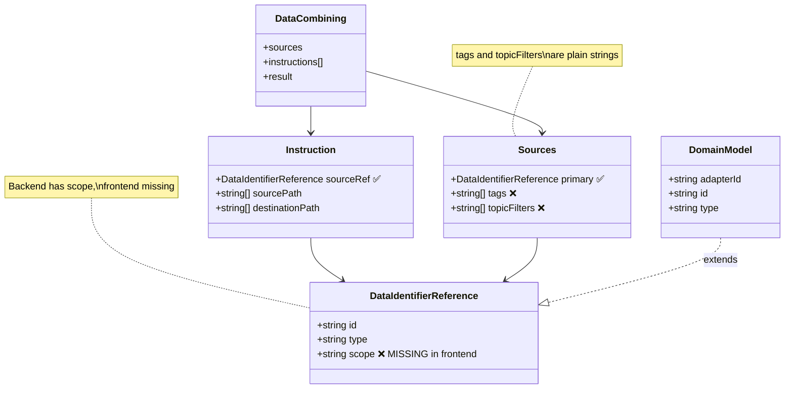
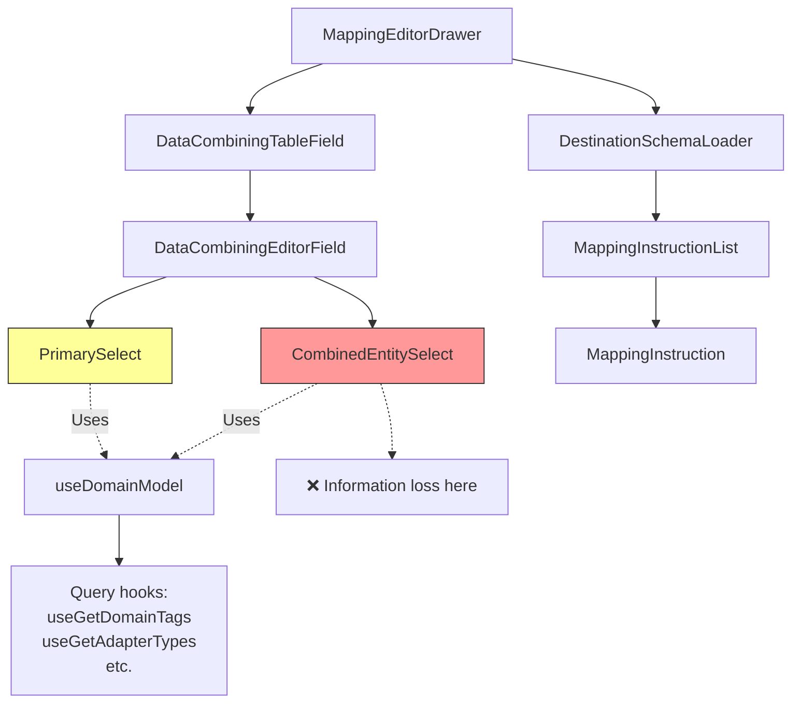
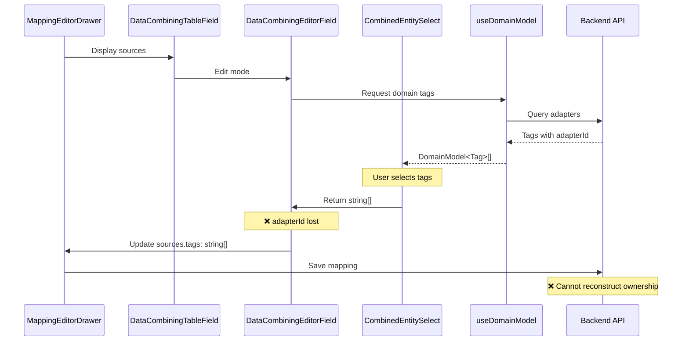
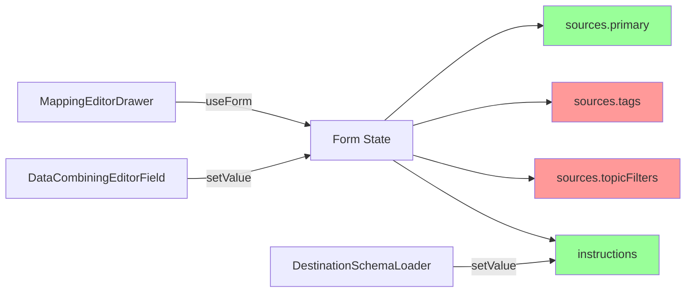

# Architecture Review: Mapping System

## Type System Overview

### Core Types



### Type Definitions by File

#### 1. DataIdentifierReference

**File:** `src/api/__generated__/models/DataIdentifierReference.ts:1-27`

```typescript
export interface DataIdentifierReference {
  id: string
  type: 'adapter' | 'tag' | 'metric' | 'behavior'
  // ❌ MISSING: scope field (exists in backend schema)
}
```

**Status:** Outdated - Backend schema (commit c53bb0594) includes scope field

#### 2. DataCombining

**File:** `src/api/__generated__/models/DataCombining.ts:1-47`

```typescript
export interface DataCombining {
  sources: {
    primary?: DataIdentifierReference // ✅ Has scope (when updated)
    tags?: Array<string> // ❌ No ownership
    topicFilters?: Array<string> // ❌ No ownership
  }
  instructions?: Array<Instruction> // ✅ Has scope via sourceRef
  result?: DataIdentifierReference
}
```

#### 3. Instruction

**File:** `src/api/__generated__/models/Instruction.ts:1-22`

```typescript
export interface Instruction {
  sourceRef?: DataIdentifierReference // ✅ Has scope (when updated)
  sourcePath?: Array<string>
  destinationPath?: Array<string>
}
```

#### 4. DomainModel (Frontend Extension)

**File:** `src/modules/Mappings/hooks/useDomainModel.ts:8-11`

```typescript
export interface DomainModel<T> extends DataIdentifierReference {
  adapterId: string // ✅ Frontend tracks adapter
  node?: T
}
```

**Note:** Frontend extension adds `adapterId` but this is lost when converting to plain strings.

## Component Architecture

### Component Hierarchy



### Data Flow Through Components



## File Structure & Responsibilities

### Critical Files

| File                           | Lines       | Responsibility                 | Issues                        |
| ------------------------------ | ----------- | ------------------------------ | ----------------------------- |
| `DataIdentifierReference.ts`   | 1-27        | Type definition for references | Missing scope field           |
| `DataCombining.ts`             | 1-47        | Mapping data structure         | tags/topicFilters as strings  |
| `DataCombiningEditorField.tsx` | 96-136      | Edit sources                   | Loses adapter info            |
| `CombinedEntitySelect.tsx`     | 45-82       | Multi-adapter selection        | Returns strings only          |
| `PrimarySelect.tsx`            | 24-49       | Primary source selection       | Reconstructs from broken data |
| `combining.utils.ts`           | 26-69       | Query/entity pairing           | Index-based, bug at line 57   |
| `useDomainModel.ts`            | 8-11, 24-85 | Domain model queries           | Has adapterId but lost later  |
| `DestinationSchemaLoader.tsx`  | 87-103      | Auto-generate instructions     | ✅ Correctly uses sourceRef   |
| `MappingInstruction.tsx`       | 49, 85-92   | Display instruction            | ✅ Correctly uses sourceRef   |

### Component Details

#### 1. DataCombiningEditorField

**File:** `src/modules/Mappings/components/forms/DataCombiningEditorField.tsx`

**Purpose:** Edit mapping sources (primary, tags, topicFilters)

**Critical Section (lines 96-136):**

```typescript
const handleSourcesUpdate = useCallback(
  ({ primary, tags, topicFilters }: PartialSources) => {
    setValue('sources', {
      primary,
      tags, // ❌ String array - adapter info lost
      topicFilters, // ❌ String array - adapter info lost
    })
  },
  [setValue]
)
```

**Issue:** Extracts only string values, discards adapter ownership.

#### 2. CombinedEntitySelect

**File:** `src/modules/Mappings/components/forms/CombinedEntitySelect.tsx`

**Purpose:** Select tags/filters from multiple adapters

**Critical Section (lines 45-82):**

```typescript
export const CombinedEntitySelect: FC<CombinedEntitySelectProps> = ({ value, onChange }) => {
  const { data: domainTagQueries } = useDomainModel(DomainModelTypeEnum.tag, {
    returnOption: {
      returnQueryResult: true,
      returnDefault: true,
    },
  })

  const options = useMemo(() => {
    return buildOptionsForCombiner(domainTagQueries)
    // Returns DomainModel<Tag>[] with adapterId
  }, [domainTagQueries])

  const handleOnChange = useCallback(
    (value: MultiValue<DomainModel<unknown>>) => {
      // Extract only the 'id' field
      onChange?.(value.map((val) => val.id)) // ❌ Loses adapterId
    },
    [onChange]
  )
}
```

**Issue:** `handleOnChange` extracts only `id` field, discarding `adapterId`.

#### 3. PrimarySelect

**File:** `src/modules/Mappings/components/forms/PrimarySelect.tsx`

**Purpose:** Select primary source

**Critical Section (lines 24-49):**

```typescript
const { data: options } = useDomainModel(DomainModelTypeEnum.tag, {
  returnOption: {
    returnQueryResult: true,
    returnDefault: true,
  },
})

// Options have full DomainModel with adapterId
// But component returns only DataIdentifierReference (without scope)
```

**Status:** ✅ Works because `sources.primary` is `DataIdentifierReference`, not string.

**Note:** When scope field is added to `DataIdentifierReference`, this will work correctly.

#### 4. combining.utils.ts

**File:** `src/modules/Mappings/utils/combining.utils.ts`

**Purpose:** Build queries and options for combined entity selection

**Critical Issues:**

**Line 26-69: buildQueriesForCombiner**

```typescript
export const buildQueriesForCombiner = (
  domainTagQueries: UseQueryResult<DomainTag[], Error>[],
  tagsFilter?: string[]
) => {
  let currentIndex = 0

  return domainTagQueries?.reduce<CombiningQueries>((queries, tagQuery, index) => {
    const queryData = tagQuery.data
    const hasData = (queryData?.length ?? 0) > 0

    const adapterId = queryData?.[0]?.adapterId // Extract from first item

    if (hasData && adapterId) {
      queries[adapterId] = {
        ...tagQuery,
        queryIndex: currentIndex, // Track index for pairing
      }
      currentIndex += 1
    }

    return queries
  }, {})
}
```

**❌ BUG at line 57:** In related code (not shown in snippet), uses tag's index within `tags` array instead of `queryIndex`, breaking the pairing.

**Line 71-101: buildOptionsForCombiner**

```typescript
export const buildOptionsForCombiner = (
  domainTagQueries: UseQueryResult<DomainTag[], Error>[]
): DomainModel<DomainTag>[] => {
  return domainTagQueries?.reduce<DomainModel<DomainTag>[]>((options, tagQuery) => {
    const queryData = tagQuery.data

    if ((queryData?.length ?? 0) > 0 && !tagQuery.isError) {
      // Build options with full DomainModel including adapterId
      return [...options, ...queryData]
    }

    return options
  }, [])
}
```

**Note:** Returns full `DomainModel` with `adapterId`, but this is lost in `CombinedEntitySelect.handleOnChange`.

## State Management

### React Hook Form Integration



**Form Path:** `mapping.dataCombining`

**Structure:**

```typescript
{
  sources: {
    primary?: DataIdentifierReference,  // ✅ Has type info
    tags?: string[],                     // ❌ Plain strings
    topicFilters?: string[],             // ❌ Plain strings
  },
  instructions?: Instruction[],          // ✅ Has sourceRef with scope
  result?: DataIdentifierReference
}
```

## Query Management

### useDomainModel Hook

**File:** `src/modules/Mappings/hooks/useDomainModel.ts`

**Purpose:** Fetch domain entities (tags, metrics, adapters) with ownership

**Key Features:**

- Queries multiple adapters in parallel
- Returns `DomainModel<T>[]` with `adapterId`
- Supports filtering and query options
- Can return query objects for status tracking

**Return Type:**

```typescript
interface DomainModel<T> extends DataIdentifierReference {
  adapterId: string // ✅ Ownership tracked
  node?: T
}
```

**Problem:** Downstream components discard `adapterId` when converting to strings.

### Query Hooks Used

- `useGetDomainTags`: Fetch tags from all adapters
- `useGetAdapterTypes`: Fetch adapter types
- `useGetAdapterById`: Fetch single adapter
- `useGetProtocolAdapters`: Fetch protocol adapters

## Validation System

**File:** `src/modules/Mappings/hooks/useValidateCombiner.ts`

**Lines 149-175: Tag/Filter Validation**

```typescript
// Validates that tags exist in domain entities
const validateTags = (tags: string[], domainEntities: DomainModel<Tag>[]) => {
  return tags.every((tag) => domainEntities.some((entity) => entity.id === tag))
}
```

**Issue:** Cannot validate ownership because `tags` array lacks adapter information.

**Lines 238-260: Instruction Validation**

```typescript
// Comment at line 205:
// "NOTE the structure of this is fragile and needs a rethink"
```

**Validates:**

- Source references exist
- Paths are valid
- Instruction structure is correct

**Note:** Instruction validation works because `sourceRef` has full reference.

## Backend Interaction

### API Schema vs. Frontend Types

**Backend (OpenAPI Schema):**

```yaml
DataIdentifierReference:
  properties:
    id: string
    type: enum
    scope: string # ✅ Present in backend
```

**Frontend (Generated Types):**

```typescript
export interface DataIdentifierReference {
  id: string
  type: 'adapter' | 'tag' | 'metric' | 'behavior'
  // ❌ scope field missing
}
```

**Action Required:** Regenerate TypeScript models from OpenAPI schema.

### Backend Reconstruction

Backend reconstructs mapping from `instructions[].sourceRef`, not from `sources.tags[]` or `sources.topicFilters[]`.

**Evidence:**

- DestinationSchemaLoader auto-generates instructions with full sourceRef
- Operational status checking uses both `sources.primary` and `instructions`
- Comment in validation code mentions redundant structure

**Implication:** Frontend arrays (`tags[]`, `topicFilters[]`) may be display-only.

## Summary

### Architectural Issues

1. **Type Mismatch:** Backend has scope, frontend missing
2. **Information Loss:** UI components discard adapter ownership
3. **Fragile Pairing:** Index-based query/entity association
4. **Redundant Storage:** Arrays duplicate instruction information
5. **Incomplete Validation:** Cannot validate ownership without adapter info

### Well-Architected Parts

1. ✅ `sources.primary` structure (once scope added)
2. ✅ `instructions[].sourceRef` with full reference
3. ✅ Auto-instruction generation (DestinationSchemaLoader)
4. ✅ Domain model queries with adapterId
5. ✅ Instruction display and validation

### Next Steps

See `SOLUTION_OPTIONS.md` for potential fixes addressing these architectural issues.
