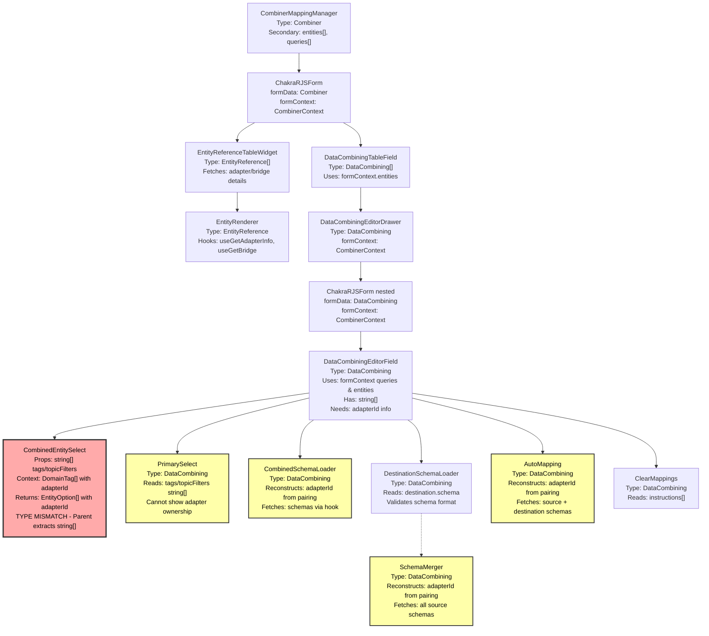
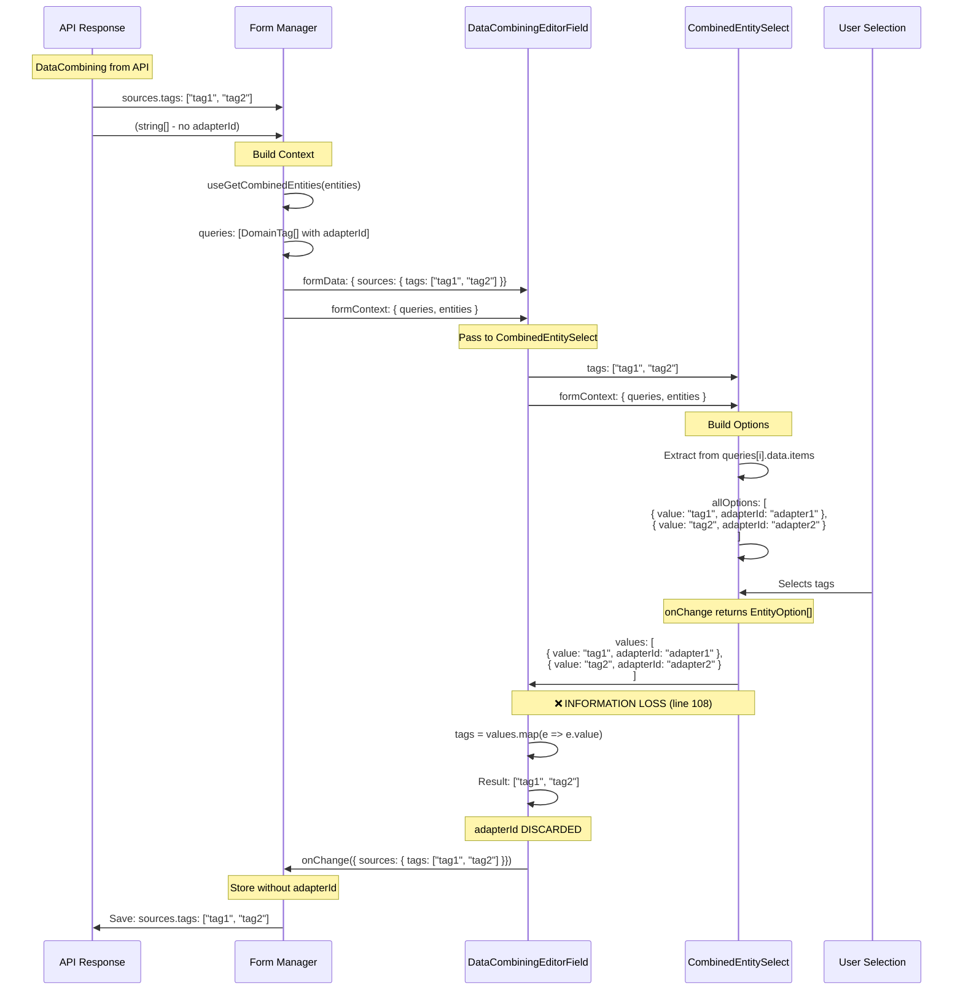

# Combiner RJSF Components Inventory

Complete technical reference for all custom components, validation rules, and hooks in the HiveMQ Edge Combiner RJSF system.

## Table of Contents

1. [Custom RJSF Components](#custom-rjsf-components)
   - [RJSF Fields](#rjsf-fields)
   - [RJSF Widgets](#rjsf-widgets)
   - [Supporting Components](#supporting-components)
2. [Validation Rules](#validation-rules)
3. [Hooks](#hooks)
4. [Component Registration](#component-registration)

---

## Custom RJSF Components

### RJSF Fields

RJSF Fields are custom form fields that replace standard RJSF rendering for specific schema paths. They receive `FieldProps` from RJSF.

#### 1. DataCombiningEditorField

**File:** `src/modules/Mappings/combiner/DataCombiningEditorField.tsx:27`

**Purpose:** Main editor field for a single DataCombining mapping. Orchestrates the entire mapping editing experience with sources, destination, and instructions.

**Props Signature:**

```typescript
FC<FieldProps<DataCombining, RJSFSchema, CombinerContext>>
```

**Props Interface:**

```typescript
interface FieldProps<T, S, F> {
  formData?: DataCombining
  formContext?: CombinerContext
  uiSchema?: UiSchema
  registry: Registry
  schema: RJSFSchema
  errorSchema?: ErrorSchema<DataCombining>
  onChange: (value: DataCombining) => void
  // ... standard RJSF FieldProps
}
```

**Key Responsibilities:**

- Renders 2-column grid layout (sources | destination)
- Integrates CombinedEntitySelect for tag/topic filter selection
- Integrates PrimarySelect for primary source selection
- Integrates DestinationSchemaLoader for schema management
- Integrates CombinedSchemaLoader for viewing source schemas
- Handles AutoMapping and ClearMappings actions
- Manages error display for all nested fields

**Data Flow:**

```
formData (DataCombining) → Extract sources/destination
                         ↓
CombinedEntitySelect → onChange with EntityOption[]
                         ↓
Transform to string[] → Update formData.sources.tags/topicFilters
                         ↓
props.onChange(updated DataCombining)
```

**Used At:** `combiner-mapping.ui-schema.ts:66` for `mappings.items.items`

---

#### 2. DataCombiningTableField

**File:** `src/modules/Mappings/combiner/DataCombiningTableField.tsx:23`

**Purpose:** Table display of all DataCombining mappings with add/edit/delete actions. Manages the list of mappings.

**Props Signature:**

```typescript
FC<FieldProps<DataCombining[], RJSFSchema, CombinerContext>>
```

**Props Interface:**

```typescript
interface FieldProps<T, S, F> {
  formData?: DataCombining[] // Array of mappings
  formContext?: CombinerContext
  onChange: (value: DataCombining[]) => void
  schema: RJSFSchema
  uiSchema?: UiSchema
  // ... standard RJSF FieldProps
}
```

**Key Responsibilities:**

- Displays PaginatedTable with all mappings
- Add new mapping (empty or from ManagedAsset)
- Edit mapping via DataCombiningEditorDrawer
- Delete mapping from array
- Shows primary source indicator (PrimaryWrapper)
- Conditional asset manager mode

**Table Columns:**

1. **Asset Name** (if asset manager mode)
2. **Destination Topic** - with Topic tag
3. **Sources** - tags/topicFilters with primary indicator
4. **Actions** - Edit/Delete buttons

**Used At:** `combiner-mapping.ui-schema.ts:64` for `mappings.items`

---

### RJSF Widgets

RJSF Widgets are custom input controls for specific data types. They receive `WidgetProps` from RJSF.

#### 1. EntityReferenceTableWidget

**File:** `src/modules/Mappings/combiner/EntityReferenceTableWidget.tsx:14`

**Purpose:** Widget to display EntityReference[] as a read-only table showing connected adapters/bridges.

**Props Signature:**

```typescript
WidgetProps<WidgetProps<Array<EntityReference>, RJSFSchema>>
```

**Props Interface:**

```typescript
interface WidgetProps<T, S> {
  value: Array<EntityReference>
  schema: RJSFSchema
  onChange: (value?: Array<EntityReference>) => void
  // ... standard RJSF WidgetProps
}
```

**Key Responsibilities:**

- Renders PaginatedTable of EntityReference items
- Uses EntityRenderer to show adapter/bridge/broker details
- Shows delete button (disabled) for non-permanent entities
- EDGE_BROKER and PULSE_AGENT are permanent (no delete)

**Table Columns:**

1. **Source** - EntityRenderer with name, icon, description
2. **Actions** - Disabled delete button

**Used At:** `combiner-mapping.ui-schema.ts:57` for `sources.items`

---

### Supporting Components

These components are not directly registered with RJSF but are used within Fields and Widgets.

#### 1. CombinedEntitySelect

**File:** `src/modules/Mappings/combiner/CombinedEntitySelect.tsx:32`

**Purpose:** Multi-select dropdown for tags and topic filters with adapter ownership context.

**Props:**

```typescript
interface EntityReferenceSelectProps extends Omit<BoxProps, 'onChange'> {
  id?: string
  tags?: Array<string> // Current selected tags (strings)
  topicFilters?: Array<string> // Current selected topic filters (strings)
  formContext?: CombinerContext // Contains queries with adapterId
  onChange: (value: MultiValue<EntityOption>) => void // Returns EntityOption[]
}

interface EntityOption extends OptionBase {
  label: string
  value: string
  type: DataIdentifierReference.type
  adapterId?: string
  description?: string
}
```

**Data Transformation:**

**Input:**

- `tags: string[]` (e.g., `["tag1", "tag2"]`)
- `topicFilters: string[]` (e.g., `["filter1"]`)
- `formContext.queries` - Contains DomainTag[] with adapterId

**Process:**

1. Build `allOptions` from `formContext.queries`:

   ```typescript
   // Extracts DomainTag[] from queries and creates EntityOption[]
   {
     label: tag.name,
     value: tag.name,
     adapterId: formContext.entities?.[index]?.id,  // ✅ Has adapterId
     type: DataIdentifierReference.type.TAG
   }
   ```

2. Build `values` from `tags/topicFilters`:
   ```typescript
   // Creates EntityOption[] from string[] (NO adapterId)
   {
     label: value,
     value: value,
     type: DataIdentifierReference.type.TAG
     // ❌ adapterId missing
   }
   ```

**Output (onChange):**

```typescript
MultiValue<EntityOption> // Array of EntityOption with adapterId
```

**⚠️ CRITICAL: Information Loss**

The onChange handler receives full `EntityOption[]` with `adapterId`, but the parent component (`DataCombiningEditorField:103-129`) **extracts only the `value` (string)** and discards `adapterId`:

```typescript
onChange={(values) => {
  const tags = values
    .filter((entity) => entity.type === DataIdentifierReference.type.TAG)
    .map((entity) => entity.value)  // ❌ EXTRACTS ONLY STRING, DISCARDS adapterId

  props.onChange({
    ...formData,
    sources: {
      ...formData.sources,
      tags: tags,  // string[] without ownership
    }
  })
}}
```

**Key Features:**

- Groups tags and topic filters in single selector
- Custom Option component showing description
- Custom MultiValueContainer with entity type badges
- Deduplicates options

---

#### 2. PrimarySelect

**File:** `src/modules/Mappings/combiner/PrimarySelect.tsx:21`

**Purpose:** Single-select dropdown for choosing primary data source from existing tags/topic filters.

**Props:**

```typescript
interface PrimarySelectProps {
  id?: string
  formData?: DataCombining
  onChange: (newValue: SingleValue<PrimaryOption>) => void
}

interface PrimaryOption {
  label: string
  value: string
  type: DataIdentifierReference.type
}
```

**Key Features:**

- Builds options from `formData.sources.tags` and `formData.sources.topicFilters`
- Shows key icon (FaKey) in control
- Returns selected option with `id` and `type`
- Parent converts to `DataIdentifierReference`

**Used In:** `DataCombiningEditorField.tsx:227`

---

#### 3. SchemaMerger

**File:** `src/modules/Mappings/combiner/SchemaMerger.tsx:41`

**Purpose:** Modal component to merge schemas from multiple sources and auto-generate destination schema.

**Props:**

```typescript
interface SchemaMergerProps {
  formData?: DataCombining
  formContext?: CombinerContext
  onUpload: (properties: FlatJSONSchema7[]) => void
  onClose: () => void
}
```

**Key Features:**

- Fetches schemas for all selected tags/topic filters
- Merges properties from all schemas
- Displays merged property list with origin markers
- Prefixes properties with `${STUB_TAG_PROPERTY}${index}` or `${STUB_TOPIC_FILTER_PROPERTY}${index}`
- Validates at least one valid schema exists
- Generates auto-instructions with `sourceRef` field

**Process:**

1. Get filtered data references (tags/topicFilters with metadata)
2. Fetch schemas via `useGetCombinedDataSchemas`
3. Merge and prefix properties
4. Generate `FlatJSONSchema7[]`
5. Call `onUpload` which creates destination schema + instructions

**Used In:** `DestinationSchemaLoader.tsx:194`

---

#### 4. CombinedSchemaLoader

**File:** `src/modules/Mappings/combiner/CombinedSchemaLoader.tsx:19`

**Purpose:** Display schemas for all selected tags and topic filters (read-only view).

**Props:**

```typescript
interface CombinedSchemaLoaderProps {
  formData?: DataCombining
  formContext?: CombinerContext
}
```

**Key Features:**

- Shows JsonSchemaBrowser for each valid schema
- Shows ErrorMessage for invalid schemas
- Displays PLCTag or TopicFilter badge for each schema
- Read-only, draggable property display

**Used In:** `DataCombiningEditorField.tsx:162`

---

#### 5. DestinationSchemaLoader

**File:** `src/modules/Mappings/combiner/DestinationSchemaLoader.tsx:61`

**Purpose:** Manage destination topic schema - upload, infer, download, and edit mapping instructions.

**Props:**

```typescript
interface DestinationSchemaLoaderProps {
  title?: string
  description?: string
  isInvalid?: boolean
  isEditable?: boolean
  formData?: DataCombining
  formContext?: CombinerContext
  onChange: (schema: string, v?: Instruction[]) => void
  onChangeInstructions: (v: Instruction[]) => void
}
```

**Key Features:**

- **Infer:** Opens SchemaMerger modal to auto-generate schema
- **Upload:** Opens SchemaUploader modal for manual upload
- **Download:** Downloads destination schema as JSON
- **Edit:** Displays MappingInstructionList for instruction editing
- Validates schema from data URI
- Shows error messages for invalid schemas

**Editor Modes:**

```typescript
enum EDITOR_MODE {
  UPLOADER = 'UPLOADER', // Manual schema upload
  INFERRER = 'INFERRER', // Auto-generate from sources
}
```

**Used In:** `DataCombiningEditorField.tsx:198`

---

#### 6. AutoMapping

**File:** `src/modules/Mappings/combiner/components/AutoMapping.tsx:27`

**Purpose:** Button to auto-generate mapping instructions using best-match algorithm.

**Props:**

```typescript
interface AutoMappingProps {
  id?: string
  formData?: DataCombining
  formContext?: CombinerContext
  onChange?: (instructions: Instruction[]) => void
}
```

**Process:**

1. Get source schemas (tags/topic filters)
2. Get destination schema properties
3. For each destination property, find best match from sources
4. Generate `Instruction[]` with `sourceRef`, `source`, `destination`
5. Call `onChange` with instructions

**Algorithm:** Uses `findBestMatch` from `combining.utils.ts` for fuzzy name matching

**Used In:** `DataCombiningEditorField.tsx:171`

---

#### 7. ClearMappings

**File:** `src/modules/Mappings/combiner/components/ClearMappings.tsx:14`

**Purpose:** Button to clear all mapping instructions.

**Props:**

```typescript
interface ClearMappingsProps {
  formData?: DataCombining
  onChange?: (instructions: Instruction[]) => void
}
```

**Key Features:**

- Calls `onChange([])` to clear instructions
- Disabled if no instructions exist

**Used In:** `DataCombiningEditorField.tsx:183`

---

#### 8. EntityRenderer

**File:** `src/modules/Mappings/combiner/EntityRenderer.tsx:64`

**Purpose:** Renders entity reference (adapter/bridge/broker) as a card with icon and details.

**Props:**

```typescript
interface EntityRendererProps {
  reference: EntityReference
}
```

**Key Features:**

- Routes to specific renderer based on entity type:
  - `ADAPTER` → AdapterEntityRenderer (with protocol icon)
  - `BRIDGE` → BridgeEntityRenderer
  - `EDGE_BROKER` → BrokerEntityRenderer
  - `PULSE_AGENT` → PulseAgentEntityRenderer
- Shows NodeNameCard with name, icon, description
- Fetches entity details via hooks

**Used In:** `EntityReferenceTableWidget.tsx:24`

---

#### 9. PrimaryWrapper

**File:** `src/modules/Mappings/combiner/components/PrimaryWrapper.tsx:12`

**Purpose:** Conditional wrapper that adds a "primary" badge with key icon to child elements.

**Props:**

```typescript
interface PrimaryWrapperProps {
  isPrimary: boolean
  children: ReactElement
}
```

**Key Features:**

- Wraps child in Tag with key icon if `isPrimary === true`
- Otherwise, renders child directly
- Uses ConditionalWrapper pattern

**Used In:** `DataCombiningTableField.tsx:115,120`

---

## Validation Rules

All validation logic is in `useValidateCombiner` hook.

### Hook Signature

**File:** `src/modules/Mappings/hooks/useValidateCombiner.ts:28`

```typescript
export const useValidateCombiner = (
  queries: UseQueryResult<DomainTagList | TopicFilterList, Error>[],
  entities: EntityReference[]
): {
  validateCombiner: CustomValidator<Combiner, RJSFSchema, CombinerContext>
  validateCombining: CustomValidator<DataCombining, RJSFSchema, CombinerContext>
} | undefined
```

**Returns:** Two validators (Combiner-level and DataCombining-level), or `undefined` if data not loaded

---

### Validation Functions

#### 1. validateSourceCapability

**File:** `useValidateCombiner.ts:124`

**Purpose:** Verify that connected entities are eligible for data combining.

**Rules:**

```typescript
// For each entity in sources.items:
if (entity.type === EntityType.ADAPTER) {
  // Must have 'COMBINE' capability
  if (!hasAdapterCapability(entity.id)) {
    errors.sources.items[index].addError('notCombineCapability')
  }
}

// Must have exactly one EDGE_BROKER
if (hasEdge.length !== 1) {
  errors.sources.items.addError('notEdgeSource')
}
```

**Error Messages:**

- `combiner.error.validation.notValidReference` - Adapter not found
- `combiner.error.validation.notCombineCapability` - Adapter lacks COMBINE capability
- `combiner.error.validation.notEdgeSource` - Missing or multiple EDGE_BROKER

---

#### 2. validateDataSources

**File:** `useValidateCombiner.ts:149`

**Purpose:** Verify that data sources (tags/topic filters) belong to connected entities.

**Rules:**

```typescript
// For each tag in formData.sources.tags:
if (!allDataSourcesFromEntities.tags.includes(tag)) {
  errors.sources.tags.addError('notDataSourceOwner', { context: 'TAG', tag })
}

// For each topic filter in formData.sources.topicFilters:
if (!allDataSourcesFromEntities.topicFilters.includes(topicFilter)) {
  errors.sources.tags.addError('notDataSourceOwner', {
    context: 'TOPIC_FILTER',
    topicFilter,
  })
}
```

**⚠️ LIMITATION:** Validates that tag/topic filter exists in connected entities, but **cannot validate which specific adapter owns each tag** because `sources.tags` is `string[]` without ownership info.

**Error Message:**

- `combiner.error.validation.notDataSourceOwner` - Tag/filter not found in any connected entity

---

#### 3. validateDestinationSchema

**File:** `useValidateCombiner.ts:180`

**Purpose:** Verify that destination topic schema is valid JSON Schema.

**Rules:**

```typescript
const handleSchema = validateSchemaFromDataURI(formData.destination.schema)
if (handleSchema.status !== 'success' || !handleSchema.schema) {
  errors.destination.schema.addError(handleSchema.error)
}

// Must have at least one property
const properties = getPropertyListFrom(handleSchema.schema)
if (!properties.length) {
  errors.destination.schema.addError('notDestinationProperties')
}
```

**Error Messages:**

- Schema parsing error (from `validateSchemaFromDataURI`)
- `combiner.error.validation.notDestinationProperties` - Schema has no properties

---

#### 4. validateDataSourceSchemas

**File:** `useValidateCombiner.ts:198`

**Purpose:** Verify that at least one data source has a valid schema.

**Rules:**

```typescript
const hasAtLeastOneSchema = allSchemaReferences.some((e) => e.data !== undefined && e.isSuccess)
if (!hasAtLeastOneSchema) {
  errors.sources.addError('notMinimumRequiredSchema')
}
```

**Note:** Per-source schema validation is commented out (lines 205-231) due to data structure issues.

**Error Message:**

- `combiner.error.validation.notMinimumRequiredSchema` - No valid source schemas

---

#### 5. validateInstructions

**File:** `useValidateCombiner.ts:238`

**Purpose:** Verify that mapping instructions reference valid paths in source and destination schemas.

**Rules:**

```typescript
// For each instruction:
const destinationPaths = getPropertyListFrom(destinationSchema)
if (!destinationPaths.includes(instruction.destination)) {
  errors.instructions[index].addError('notInstructionDestinationPath')
}

if (!allPathsFromSources.includes(instruction.source)) {
  errors.instructions[index].addError('notInstructionSourcePath')
}
```

**Note:** Does NOT validate `instruction.sourceRef` because there's no source to verify against (ownership info missing).

**Error Messages:**

- `combiner.error.validation.notInstructionDestinationPath` - Invalid destination path
- `combiner.error.validation.notInstructionSourcePath` - Invalid source path

---

#### 6. validateCombiner

**File:** `useValidateCombiner.ts:262`

**Purpose:** Main validator for entire Combiner (with multiple mappings).

**Rules:**

```typescript
// Validate payload exists
if (!formData) {
  errors.addError('notValidPayload')
}

// Validate source capability (once for all mappings)
validateSourceCapability(formData, errors)

// For each mapping in formData.mappings.items:
validateDataSources(mapping, errors)
validateDataSourceSchemas(mapping, errors)
validateDestinationSchema(mapping, errors)
validateInstructions(mapping, errors)
```

---

#### 7. validateCombining

**File:** `useValidateCombiner.ts:282`

**Purpose:** Validator for single DataCombining mapping.

**Rules:**

```typescript
// Validate payload exists
if (!formData) {
  errors.addError('notValidPayload')
}

// Validate mapping
validateDataSources(formData, errors)
validateDataSourceSchemas(formData, errors)
validateDestinationSchema(formData, errors)
validateInstructions(formData, errors)
```

---

### Validation Helper Data

#### allReferences

**File:** `useValidateCombiner.ts:50`

```typescript
const allReferences = useMemo<DataReference[]>(() => {
  // Reduce queries to DataReference[]
  // Extracts tags/topic filters with adapterId
  return queries?.reduce<DataReference[]>((acc, cur, currentIndex) => {
    if (isDomainTag) {
      acc.push({
        id: tag.name,
        type: DataIdentifierReference.type.TAG,
        adapterId: dataSources?.[currentIndex]?.id, // ✅ Has adapterId
      })
    }
    // ...
  }, [])
}, [entities, queries])
```

---

#### allDataSourcesFromEntities

**File:** `useValidateCombiner.ts:82`

```typescript
const allDataSourcesFromEntities = useMemo(() => {
  return queries.reduce<{ tags: string[]; topicFilters: string[] }>(
    (acc, cur) => {
      if (isDomainTag) {
        acc.tags.push(...items.map((e) => e.name)) // ❌ Only names, no adapterId
      }
      // ...
    },
    { tags: [], topicFilters: [] }
  )
}, [queries])
```

**⚠️ ISSUE:** Returns only tag/filter names as strings, without adapter ownership. Used for validation but cannot verify correct adapter.

---

## Hooks

### Data Fetching Hooks

#### 1. useGetCombinedEntities

**File:** `src/api/hooks/useDomainModel/useGetCombinedEntities.ts:9`

**Purpose:** Fetch tags and topic filters for multiple entities in parallel.

**Signature:**

```typescript
export const useGetCombinedEntities = (
  entities: EntityReference[]
): UseQueryResult<DomainTagList | TopicFilterList, Error>[]
```

**Process:**

```typescript
// For each entity:
if (entity.type === EntityType.ADAPTER) {
  // Query: getAdapterDomainTags(entity.id)
  // Returns: DomainTagList with DomainTag[]
} else if (entity.type === EntityType.BRIDGE || entity.type === EntityType.EDGE_BROKER) {
  // Query: getTopicFilters()
  // Returns: TopicFilterList with TopicFilter[]
}
// PULSE_AGENT is ignored (no integration points)
```

**Returns:** Array of `UseQueryResult[]` - one query per entity

**Key Feature:** Each query result is paired with its entity by array index, allowing components to extract `adapterId` from `entities[index]`.

**Used In:**

- `CombinerMappingManager.tsx:151` - Main data loading
- Validation hook via formContext

---

#### 2. useGetCombinedDataSchemas

**File:** `src/api/hooks/useDomainModel/useGetCombinedDataSchemas.ts:13`

**Purpose:** Fetch schemas for multiple data identifiers (tags/topic filters) in parallel.

**Signature:**

```typescript
export const useGetCombinedDataSchemas = (
  dataIdentifiers: DataReference[]
): UseQueryResult<SchemaHandler | string, Error>[]

interface DataReference extends DataIdentifierReference {
  adapterId?: string
  schema?: SchemaHandler
}
```

**Process:**

```typescript
// For each DataReference:
if (dataPoint.type === DataIdentifierReference.type.TAG) {
  // Query: getWritingSchema(adapterId, tag.id)
  // Returns: JSONSchema7 for tag
} else {
  // TOPIC_FILTER
  // Query: getTopicFilters() + find matching filter
  // Returns: schema string (data URI)
}
```

**Returns:** Array of `UseQueryResult[]` with schema data

**Used In:**

- `useValidateCombiner.ts:78` - Schema validation
- `SchemaMerger.tsx:48` - Schema merging
- `CombinedSchemaLoader.tsx:27` - Schema display
- `AutoMapping.tsx:35` - Auto-mapping

---

### Validation Hooks

#### useValidateCombiner

**See [Validation Rules](#validation-rules) section above**

---

### Other Hooks

#### useGetAdapterInfo

**File:** `src/modules/ProtocolAdapters/hooks/useGetAdapterInfo.ts`

**Purpose:** Fetch adapter and protocol type information.

**Used In:** `EntityRenderer.tsx:19` - Display adapter details

---

#### useGetBridge

**File:** `src/api/hooks/useGetBridges/useGetBridge.ts`

**Purpose:** Fetch bridge information by ID.

**Used In:** `EntityRenderer.tsx:35` - Display bridge details

---

#### useGetAdapterTypes

**File:** `src/api/hooks/useProtocolAdapters/useGetAdapterTypes.ts`

**Purpose:** Fetch all available adapter types with capabilities.

**Used In:** `useValidateCombiner.ts:33` - Check COMBINE capability

---

#### useListProtocolAdapters

**File:** `src/api/hooks/useProtocolAdapters/useListProtocolAdapters.ts`

**Purpose:** List all configured protocol adapters.

**Used In:** `useValidateCombiner.ts:34` - Validate adapter exists

---

## Component Registration

### RJSF UI Schema

**File:** `src/api/schemas/combiner-mapping.ui-schema.ts`

Components are registered in the UI schema returned by `combinerMappingUiSchema()`:

```typescript
{
  sources: {
    items: {
      'ui:widget': EntityReferenceTableWidget,  // Widget for EntityReference[]
    },
  },
  mappings: {
    items: {
      'ui:field': DataCombiningTableField,  // Field for DataCombining[]
      items: {
        'ui:field': DataCombiningEditorField,  // Field for single DataCombining
      },
    },
  },
}
```

### Registration Map

| Component                  | Type   | Registered At          | Schema Path                  |
| -------------------------- | ------ | ---------------------- | ---------------------------- |
| EntityReferenceTableWidget | Widget | `sources.items`        | `Combiner.sources.items`     |
| DataCombiningTableField    | Field  | `mappings.items`       | `Combiner.mappings.items`    |
| DataCombiningEditorField   | Field  | `mappings.items.items` | `Combiner.mappings.items[i]` |

### Component Hierarchy

#### Basic Hierarchy (ASCII)

```
CombinerMappingManager
└─ ChakraRJSForm (RJSF)
   └─ EntityReferenceTableWidget
      └─ EntityRenderer
   └─ DataCombiningTableField
      └─ DataCombiningEditorDrawer
         └─ ChakraRJSForm (nested)
            └─ DataCombiningEditorField
               ├─ CombinedEntitySelect
               ├─ PrimarySelect
               ├─ CombinedSchemaLoader
               ├─ DestinationSchemaLoader
               │  ├─ SchemaMerger
               │  └─ MappingInstructionList
               ├─ AutoMapping
               └─ ClearMappings
```

#### Enhanced Hierarchy with Types (ASCII)

```
CombinerMappingManager
├─ Type: Combiner
├─ Secondary: entities[], queries[]
├─ Status: ✓ Source of truth
│
└─ ChakraRJSForm
   ├─ formData: Combiner
   ├─ formContext: CombinerContext { queries, entities }
   │
   ├─ EntityReferenceTableWidget
   │  ├─ Type: EntityReference[]
   │  ├─ Secondary: useGetAdapterInfo, useGetBridge per entity
   │  ├─ Status: ⚠ Requires per-entity fetch
   │  │
   │  └─ EntityRenderer
   │     ├─ Type: EntityReference
   │     ├─ Secondary: useGetAdapterInfo(id), useGetBridge(id)
   │     └─ Status: ⚠ Fetches full details for display
   │
   └─ DataCombiningTableField
      ├─ Type: DataCombining[]
      ├─ Secondary: formContext.entities (asset mode)
      ├─ Status: ✓ Clean, no reconstruction
      │
      └─ DataCombiningEditorDrawer
         ├─ Type: DataCombining
         ├─ formContext: CombinerContext
         │
         └─ ChakraRJSForm (nested)
            ├─ formData: DataCombining
            ├─ formContext: CombinerContext
            │
            └─ DataCombiningEditorField
               ├─ Type: DataCombining
               ├─ Secondary: formContext.queries, formContext.entities
               ├─ Status: ⚠ Has string[], needs adapterId for children
               │
               ├─ CombinedEntitySelect ⚠⚠⚠ INFORMATION LOSS ⚠⚠⚠
               │  ├─ Props: string[] tags, string[] topicFilters
               │  ├─ Secondary: formContext.queries → DomainTag[] with adapterId
               │  ├─            formContext.entities → for index pairing
               │  ├─ Returns: EntityOption[] with adapterId
               │  ├─ Status: ✗✗✗ TYPE MISMATCH ✗✗✗
               │  ├─          Input: string[] (no adapterId)
               │  ├─          Context: DomainTag[] (has adapterId)
               │  ├─          Output: EntityOption[] (has adapterId)
               │  └─          Parent extracts: string[] only (line 108) → LOSS
               │
               ├─ PrimarySelect
               │  ├─ Type: DataCombining
               │  ├─ Reads: formData.sources.tags/topicFilters (string[])
               │  └─ Status: ⚠ Cannot show which adapter owns primary
               │
               ├─ CombinedSchemaLoader
               │  ├─ Type: DataCombining
               │  ├─ Reads: formData.sources.tags/topicFilters (string[])
               │  ├─ Secondary: formContext.entities (for adapterId pairing)
               │  ├─            useGetCombinedDataSchemas(reconstructed refs)
               │  └─ Status: ⚠ INDEX-BASED RECONSTRUCTION REQUIRED
               │              Pairs tags[i] with entities[i].id
               │
               ├─ DestinationSchemaLoader
               │  ├─ Type: DataCombining
               │  ├─ Reads: formData.destination.schema
               │  ├─ Secondary: validateSchemaFromDataURI
               │  ├─ Status: ✓ Clean, self-contained
               │  │
               │  └─ SchemaMerger
               │     ├─ Type: DataCombining
               │     ├─ Reads: formData.sources.tags/topicFilters (string[])
               │     ├─ Secondary: formContext.entities (for adapterId pairing)
               │     ├─            useGetCombinedDataSchemas(reconstructed refs)
               │     └─ Status: ⚠ INDEX-BASED RECONSTRUCTION REQUIRED
               │                 Pairs arrays to build DataReference[]
               │
               ├─ AutoMapping
               │  ├─ Type: DataCombining
               │  ├─ Reads: formData.sources.tags/topicFilters (string[])
               │  ├─        formData.destination.schema
               │  ├─ Secondary: formContext.entities (for adapterId pairing)
               │  ├─            useGetCombinedDataSchemas(reconstructed refs)
               │  ├─            validateSchemaFromDataURI
               │  └─ Status: ⚠ INDEX-BASED RECONSTRUCTION REQUIRED
               │              Reconstructs DataReference[] for schema fetch
               │
               └─ ClearMappings
                  ├─ Type: DataCombining
                  ├─ Reads: formData.instructions
                  └─ Status: ✓ Clean, no reconstruction


LEGEND:
  ✓ = Clean component, no reconstruction needed
  ⚠ = Requires reconstruction or secondary data
  ✗ = Critical issue (information loss)

ISSUE SUMMARY:
  Clean (4):         EntityReferenceTableWidget (fetch only),
                     DataCombiningTableField,
                     DestinationSchemaLoader,
                     ClearMappings

  Reconstruction (5): CombinedSchemaLoader,
                      SchemaMerger,
                      AutoMapping,
                      PrimarySelect (limited),
                      + Validation (useValidateCombiner)

  Information Loss (1): CombinedEntitySelect → DataCombiningEditorField
                        Line 108: .map(entity => entity.value)
                        Discards adapterId from EntityOption[]
```

#### Enhanced Hierarchy with Types and Data Dependencies



**Legend:**

- 🟥 Red (CombinedEntitySelect) = Critical information loss point
- 🟨 Yellow = Requires reconstruction logic or has limitations

---

### Detailed Component Type Analysis

This table shows the type mismatches and secondary data dependencies that necessitate reconstruction logic.

| Component                      | Primary Type                                                             | Secondary Data Sources                                                                                                                                                                                    | Reconstruction Needed             | Issue                                                                                                                                                                                                                          |
| ------------------------------ | ------------------------------------------------------------------------ | --------------------------------------------------------------------------------------------------------------------------------------------------------------------------------------------------------- | --------------------------------- | ------------------------------------------------------------------------------------------------------------------------------------------------------------------------------------------------------------------------------ |
| **CombinerMappingManager**     | `Combiner`                                                               | • Builds `EntityReference[]`<br>• Fetches via `useGetCombinedEntities`                                                                                                                                    | ✅ **Source of Truth**            | Creates context with full data                                                                                                                                                                                                 |
| **EntityReferenceTableWidget** | `EntityReference[]`                                                      | • `useGetAdapterInfo(id)`<br>• `useGetBridge(id)`<br>• Adapter protocol details                                                                                                                           | ⚠️ Per-entity fetch               | Must fetch details for display                                                                                                                                                                                                 |
| **EntityRenderer**             | `EntityReference`                                                        | • `useGetAdapterInfo(id)`<br>• `useGetBridge(id)`                                                                                                                                                         | ⚠️ Individual fetch               | Entity has only `id` + `type`, needs full details                                                                                                                                                                              |
| **DataCombiningTableField**    | `DataCombining[]`                                                        | • `formContext.entities` (for asset mode)                                                                                                                                                                 | ✅ No reconstruction              | Display only, uses formData                                                                                                                                                                                                    |
| **DataCombiningEditorField**   | `DataCombining`                                                          | • `formContext.queries` (UseQueryResult[])<br>• `formContext.entities` (EntityReference[])                                                                                                                | ⚠️ Passes context                 | Has `string[]`, needs context for children                                                                                                                                                                                     |
| **🔴 CombinedEntitySelect**    | **Props: `string[]` tags/topicFilters**<br>**Returns: `EntityOption[]`** | • `formContext.queries`<br>&nbsp;&nbsp;→ `DomainTag[]` with `adapterId`<br>• `formContext.entities`<br>&nbsp;&nbsp;→ For index pairing                                                                    | **❌ CRITICAL LOSS**              | **Input:** `string[]` without ownership<br>**Context:** Full objects with `adapterId`<br>**Output:** `EntityOption[]` with `adapterId`<br>**Parent extracts:** `string[]` only (line 108)<br>**Result:** `adapterId` discarded |
| **PrimarySelect**              | `DataCombining`                                                          | • Reads `formData.sources.tags`<br>• Reads `formData.sources.topicFilters`<br>(both `string[]` without adapterId)                                                                                         | ⚠️ Cannot show adapter            | Has `string[]`, cannot determine which adapter owns the primary source                                                                                                                                                         |
| **CombinedSchemaLoader**       | `DataCombining`                                                          | • `formData.sources.tags` (`string[]`)<br>• `formData.sources.topicFilters` (`string[]`)<br>• `formContext.entities` (for pairing)<br>• `useGetCombinedDataSchemas(refs)`                                 | **⚠️ Index-based reconstruction** | Must pair `tags[i]` with `entities[i].id` to build `DataReference[]` with `adapterId`                                                                                                                                          |
| **SchemaMerger**               | `DataCombining`                                                          | • `formData.sources.tags` (`string[]`)<br>• `formData.sources.topicFilters` (`string[]`)<br>• `formContext.entities` (for pairing)<br>• `useGetCombinedDataSchemas(refs)`                                 | **⚠️ Index-based reconstruction** | Must pair arrays to build `DataReference[]`, then fetch schemas                                                                                                                                                                |
| **AutoMapping**                | `DataCombining`                                                          | • `formData.sources.tags` (`string[]`)<br>• `formData.sources.topicFilters` (`string[]`)<br>• `formContext.entities` (for pairing)<br>• `useGetCombinedDataSchemas(refs)`<br>• Destination schema parsing | **⚠️ Index-based reconstruction** | Reconstructs `DataReference[]` with `adapterId` for schema fetching + instruction generation                                                                                                                                   |
| **DestinationSchemaLoader**    | `DataCombining`                                                          | • `formData.destination.schema`<br>• `validateSchemaFromDataURI`                                                                                                                                          | ✅ No reconstruction              | Self-contained, validates schema string                                                                                                                                                                                        |
| **ClearMappings**              | `DataCombining`                                                          | • `formData.instructions`                                                                                                                                                                                 | ✅ No reconstruction              | Simple read of instructions array                                                                                                                                                                                              |

#### Key Observations

**1. Type Split at CombinedEntitySelect (Line 108)**

```typescript
// Component receives full context:
formContext.queries → [
  { data: { items: [
    { name: "tag1", description: "...", adapterId: "adapter1" }  // ✅ Has adapterId
  ]}}
]

// formData has strings only:
formData.sources.tags → ["tag1", "tag2"]  // ❌ No adapterId

// Component builds EntityOption[] with adapterId:
allOptions → [
  { label: "tag1", value: "tag1", adapterId: "adapter1", ... }  // ✅ Has adapterId
]

// User selects, component returns EntityOption[]:
onChange(values) → [
  { value: "tag1", adapterId: "adapter1", ... }  // ✅ Has adapterId
]

// Parent extracts string[] only:
const tags = values.map(entity => entity.value)  // ❌ DISCARDS adapterId
// Result: ["tag1", "tag2"] without ownership
```

**2. Reconstruction Pattern in Multiple Components**

Four components use the same reconstruction logic:

- CombinedSchemaLoader
- SchemaMerger
- AutoMapping
- Validation (useValidateCombiner)

**Common Pattern:**

```typescript
// 1. Start with string[] from formData
const tags = formData.sources.tags // ["tag1", "tag2"]

// 2. Start with EntityReference[] from formContext
const entities = formContext.entities // [{ id: "adapter1", type: "ADAPTER" }, ...]

// 3. Pair by index to rebuild DataReference[]
const references = tags.map((tag, index) => ({
  id: tag, // "tag1"
  type: DataIdentifierReference.type.TAG,
  adapterId: entities[index]?.id, // "adapter1" - RECONSTRUCTED from index
}))

// 4. Use reconstructed references to fetch schemas
const schemas = useGetCombinedDataSchemas(references)
```

**⚠️ Fragility:** If array order changes or indexes don't align, pairing breaks.

**3. No Reconstruction Needed (Ideal Components)**

- DataCombiningTableField - Display only, no complex logic
- DestinationSchemaLoader - Schema validation, self-contained
- ClearMappings - Simple instruction array manipulation

These components work well because they don't need to correlate `string[]` with ownership.

#### Information Loss Visualization



**The Critical Transformation:**

| Stage            | Data Structure                       | Has adapterId?   | Location                                  |
| ---------------- | ------------------------------------ | ---------------- | ----------------------------------------- |
| 1. Fetch         | `queries[0].data.items: DomainTag[]` | ✅ Yes           | `useGetCombinedEntities`                  |
| 2. Build Options | `allOptions: EntityOption[]`         | ✅ Yes           | `CombinedEntitySelect:53-59`              |
| 3. User Selects  | `values: MultiValue<EntityOption>`   | ✅ Yes           | `CombinedEntitySelect:107` onChange param |
| 4. **Transform** | **`tags: string[]`**                 | **❌ NO - LOST** | **`DataCombiningEditorField:108`**        |
| 5. Store         | `formData.sources.tags: string[]`    | ❌ No            | Form state                                |
| 6. Save          | `API body: sources.tags: string[]`   | ❌ No            | Backend                                   |

**The One Line That Causes All Problems:**

```typescript
// DataCombiningEditorField.tsx:108
const tags = values.filter((entity) => entity.type === DataIdentifierReference.type.TAG).map((entity) => entity.value) // ❌ THIS LINE
//                   ^^^^^^^^
//                   Should be: map(entity => ({ id: entity.value, type: entity.type, scope: entity.adapterId }))
```

---

### Component Type Architecture Summary

#### Type Distribution

**Clean Components (No Reconstruction):** 4 components

- DataCombiningTableField
- DestinationSchemaLoader
- ClearMappings
- EntityReferenceTableWidget (fetches per entity but straightforward)

**Reconstruction Required:** 5 components

- CombinedSchemaLoader (index-based pairing)
- SchemaMerger (index-based pairing)
- AutoMapping (index-based pairing)
- PrimarySelect (cannot show adapter, but works)
- Validation (useValidateCombiner - index-based pairing)

**Information Loss:** 1 component

- **CombinedEntitySelect** → DataCombiningEditorField transformation

#### The Root Architectural Issue

**Problem:** Type mismatch between storage and usage

**Storage Type:**

```typescript
DataCombining.sources.tags: string[]
// ["tag1", "tag2"] - no ownership
```

**Usage Requirements:**

- Display: Needs `adapterId` to show which adapter
- Validation: Needs `adapterId` to verify correct adapter
- Schema Loading: Needs `adapterId` to fetch correct schema
- Instructions: Needs `adapterId` for `sourceRef.scope`

**Current Solution:** Pass ownership via separate channel (`formContext`)

```typescript
formContext = {
  queries: UseQueryResult[],      // Contains DomainTag[] with adapterId
  entities: EntityReference[]     // For index pairing
}
```

**Result:** Every component that needs ownership must:

1. Receive `formContext` as separate prop
2. Implement index-based reconstruction logic
3. Hope array order matches (fragile)

#### Impact on Each Solution Option

**Option A (Upgrade Arrays to DataIdentifierReference[]):**

- ✅ Eliminates all reconstruction logic
- ✅ 5 components become simpler (no pairing needed)
- ✅ Type system enforces ownership
- ✅ Single source of truth

**Option G (Form Layer Enrichment):**

- ⚠️ Still requires reconstruction for display components
- ⚠️ Maintains dual type system
- ⚠️ Transform on load (reconstruct) and save (simplify)
- ⚠️ 4 components still need reconstruction (validation, display)

**Other Options:**

- Options B-F all maintain the type mismatch
- Still require reconstruction or workarounds
- Don't address root cause

---

## Context Flow

### CombinerContext

**File:** `src/modules/Mappings/types.ts:45`

```typescript
export interface CombinerContext {
  queries?: UseQueryResult<DomainTagList | TopicFilterList, Error>[]
  entities?: EntityReference[]
}
```

**Created In:** `CombinerMappingManager.tsx:337`

```typescript
const sources = useGetCombinedEntities(entities)

<ChakraRJSForm
  formContext={{ queries: sources, entities }}
  // ...
/>
```

**Flows To:**

1. RJSF passes `formContext` to all Fields and Widgets
2. Components extract `queries` to build options with `adapterId`
3. Validation uses `queries` to validate data sources

---

## Data Transformation Summary

### Critical Transformation: CombinedEntitySelect → DataCombiningEditorField

**Location:** `DataCombiningEditorField.tsx:103-129`

```typescript
// CombinedEntitySelect onChange handler
<CombinedEntitySelect
  onChange={(values: MultiValue<EntityOption>) => {
    // values contains:
    // [
    //   { value: "tag1", type: "TAG", adapterId: "adapter1", ... },
    //   { value: "tag2", type: "TAG", adapterId: "adapter2", ... }
    // ]

    const tags = values
      .filter((entity) => entity.type === DataIdentifierReference.type.TAG)
      .map((entity) => entity.value)  // ❌ EXTRACTS ONLY STRING

    // Result: ["tag1", "tag2"] - adapterId LOST

    props.onChange({
      ...formData,
      sources: {
        ...formData.sources,
        tags: tags,  // string[] without ownership
      }
    })
  }}
/>
```

### Transformation Table

| Stage            | Data Type                    | Has Ownership              | Location                        |
| ---------------- | ---------------------------- | -------------------------- | ------------------------------- |
| 1. Fetch         | `DomainTag[]`                | ✅ `adapterId`             | `useGetCombinedEntities` result |
| 2. Build Options | `EntityOption[]`             | ✅ `adapterId`             | `CombinedEntitySelect:53-59`    |
| 3. User Selects  | `MultiValue<EntityOption>`   | ✅ `adapterId`             | `CombinedEntitySelect:107`      |
| 4. Transform     | `string[]`                   | ❌ **LOST**                | `DataCombiningEditorField:108`  |
| 5. Store         | `DataCombining.sources.tags` | ❌ No ownership            | Form state                      |
| 6. Validate      | `string[]`                   | ❌ Cannot validate adapter | `useValidateCombiner:151`       |
| 7. Save          | `string[]`                   | ❌ No ownership            | API request                     |

**This is the root cause identified in the ownership analysis.**

---

## Summary Statistics

### Components

- **RJSF Fields:** 2

  - DataCombiningEditorField
  - DataCombiningTableField

- **RJSF Widgets:** 1

  - EntityReferenceTableWidget

- **Supporting Components:** 9
  - CombinedEntitySelect ⚠️ (information loss)
  - PrimarySelect
  - SchemaMerger
  - CombinedSchemaLoader
  - DestinationSchemaLoader
  - AutoMapping
  - ClearMappings
  - EntityRenderer
  - PrimaryWrapper

### Validation Rules

- **Validators:** 2 main (validateCombiner, validateCombining)
- **Sub-validators:** 5
  - validateSourceCapability
  - validateDataSources ⚠️ (cannot validate adapter ownership)
  - validateDestinationSchema
  - validateDataSourceSchemas
  - validateInstructions ⚠️ (cannot validate sourceRef)

### Hooks

- **Data Fetching:** 5

  - useGetCombinedEntities ⭐ (fetches with adapterId)
  - useGetCombinedDataSchemas
  - useGetAdapterInfo
  - useGetBridge
  - useGetAdapterTypes
  - useListProtocolAdapters

- **Validation:** 1
  - useValidateCombiner

---

## Key Findings

### 1. Information Loss Point

**Component:** `CombinedEntitySelect` → `DataCombiningEditorField`
**Location:** `DataCombiningEditorField.tsx:108`
**Issue:** Extracts only `value` (string) from `EntityOption`, discarding `adapterId`

### 2. Validation Gaps

**Cannot Validate:**

- Which adapter owns each tag
- Whether tag belongs to correct adapter
- `instruction.sourceRef` correctness

**Can Validate:**

- Tag exists in some connected entity
- Source/destination paths are valid
- Adapters have COMBINE capability

### 3. Data Flow Architecture

```
Fetch (with adapterId) → Display (with adapterId) → Transform (discard adapterId) → Store (no adapterId)
```

This creates a **one-way information loss** where UI has ownership data but doesn't persist it.

---

**Document Version:** 1.0
**Date:** 2026-02-10
**Task:** 38943-mapping-ownership-review
**Related:** [COMPLETE_DATA_FLOW.md](./COMPLETE_DATA_FLOW.md), [ANALYSIS.md](./ANALYSIS.md)
