# Complete Data Transformation Flow

## The Holistic Picture

This document maps **EVERY data transformation** from API → Form → Back to API, including all custom components, hooks, context, and where ownership is lost/preserved.

## Architecture Overview


## Complete Data Flow by Stage

### Stage 1: Data Loading & Context Building

**File:** `CombinerMappingManager.tsx`

#### Step 1.1: Extract Entities from Workflow (Lines 138-145)

```typescript
// CombinerMappingManager.tsx:138-145
const entities = useMemo(() => {
  const entities = selectedNode.data.sources.items || []
  const isBridgeIn = Boolean(
    entities.find((entity) => entity.id === IdStubs.EDGE_NODE && entity.type === EntityType.EDGE_BROKER)
  )
  if (!isBridgeIn) entities.push({ id: IdStubs.EDGE_NODE, type: EntityType.EDGE_BROKER })
  return entities
}, [selectedNode.data.sources.items])

// Data Structure:
// Input: selectedNode.data.sources.items
// Output: EntityReference[]
// Example: [
//   { id: "adapter-1", type: "ADAPTER" },
//   { id: "adapter-2", type: "ADAPTER" },
//   { id: "edge-broker", type: "EDGE_BROKER" }
// ]
```

**Transformation:** Workflow node sources → Entity reference list

#### Step 1.2: Fetch Combined Data with Queries (Line 151)

```typescript
// CombinerMappingManager.tsx:151
const sources = useGetCombinedEntities(entities)

// What happens inside useGetCombinedEntities:
// 1. For each entity, determine what to query (tags, metrics, etc.)
// 2. Execute parallel React Queries using useQuery
// 3. Return array of UseQueryResult objects

// Data Structure:
// Output: UseQueryResult<DomainTagList | TopicFilterList, Error>[]
// Each query result contains:
// {
//   data: [
//     { adapterId: "adapter-1", id: "tag1", tagName: "tag1", ... },
//     { adapterId: "adapter-1", id: "tag2", tagName: "tag2", ... }
//   ],
//   isSuccess: true,
//   isLoading: false,
//   ...
// }
```

**Transformation:** Entity references → Parallel query results with FULL ownership (adapterId)

#### Step 1.3: Build CombinerContext (Line 337)

```typescript
// CombinerMappingManager.tsx:337
formContext={{ queries: sources, entities } as CombinerContext}

// Type Definition (types.ts:45-48):
export interface CombinerContext {
  queries?: UseQueryResult<DomainTagList | TopicFilterList, Error>[]
  entities?: EntityReference[]
}

// Context Structure:
// {
//   queries: [
//     UseQueryResult<[{adapterId: "adapter-1", id: "tag1", ...}]>,
//     UseQueryResult<[{adapterId: "adapter-2", id: "tag3", ...}]>
//   ],
//   entities: [
//     { id: "adapter-1", type: "ADAPTER" },
//     { id: "adapter-2", type: "ADAPTER" }
//   ]
// }
```

**Transformation:** Query results + entities → CombinerContext (passed to RJSF)

---

### Stage 2: RJSF Form Initialization

**File:** `CombinerMappingManager.tsx:330-339`

```typescript
<ChakraRJSForm
  showNativeWidgets={showNativeWidgets}
  id="combiner-main-form"
  schema={combinerMappingJsonSchema}                           // JSON Schema
  uiSchema={combinerMappingUiSchema(isAssetManager, tabId)}    // UI Schema
  formData={selectedNode.data}                                  // Initial Data
  onSubmit={handleOnSubmit}                                     // Submit handler
  formContext={{ queries: sources, entities } as CombinerContext}  // ✅ Context with ownership
  customValidate={validator?.validateCombiner}                  // Validation
/>
```

**RJSF Behavior:**

1. Reads `schema` to determine form structure
2. Reads `uiSchema` to determine which custom widgets/fields to use
3. Loads `formData` as initial values
4. Makes `formContext` available to ALL custom components
5. Calls `customValidate` before submit

**Data Flow:**

```
API Data → formData → RJSF → Custom Components
                              ↑
                     CombinerContext (queries + entities)
```

---

### Stage 3: Custom Components & Data Transformations

#### Component 3.1: DataCombiningTableField (Display Mode)

**File:** `combiner/DataCombiningTableField.tsx`

**Purpose:** Display existing mappings in a table

```typescript
// Receives from RJSF:
// - value: DataCombining (from formData)
// - formContext: CombinerContext (queries + entities)

// Displays:
// - sources.primary (DataIdentifierReference) ✅
// - sources.tags (string[]) ❌ - Only shows IDs
// - sources.topicFilters (string[]) ❌ - Only shows IDs
// - instructions (Instruction[]) ✅

// Data Transformation: NONE (read-only display)
// Problem: Can't show which adapter owns each tag (only has string IDs)
```

#### Component 3.2: DataCombiningEditorField (Edit Mode)

**File:** `combiner/DataCombiningEditorField.tsx:96-136`

**Purpose:** Edit mapping sources (primary, tags, topicFilters)

```typescript
// Receives from RJSF:
// - value: DataCombining (current mapping)
// - onChange: (newValue: DataCombining) => void
// - formContext: CombinerContext ✅ (has queries with ownership)

// Internal State:
const [partialSources, setPartialSources] = useState<PartialSources>({
  primary: value?.sources.primary,
  tags: value?.sources.tags,
  topicFilters: value?.sources.topicFilters,
})

// Update Handler (LINE 96-136):
const handleSourcesUpdate = useCallback(
  ({ primary, tags, topicFilters }: PartialSources) => {
    // ❌ CRITICAL TRANSFORMATION: Receives rich data, stores as-is
    setValue('sources', {
      primary, // DataIdentifierReference (has scope)
      tags, // ❌ What type? string[] or DataIdentifierReference[]?
      topicFilters, // ❌ What type? string[] or DataIdentifierReference[]?
    })
  },
  [setValue]
)

// Problem: Depends on what CombinedEntitySelect returns!
```

**Data Transformation:** Depends on child component output (see next)

#### Component 3.3: CombinedEntitySelect ❌ **CRITICAL - INFORMATION LOSS**

**File:** `combiner/CombinedEntitySelect.tsx:45-82`

**Purpose:** Multi-select tags from multiple adapters

```typescript
// Receives from parent (DataCombiningEditorField):
// - value: string[] (current selection)
// - onChange: (newValue: string[]) => void
// - formContext: CombinerContext ✅ (has queries with ownership)

// Step 1: Build options with FULL ownership
const options = useMemo(() => {
  return buildOptionsForCombiner(domainTagQueries)
  // Returns: DomainModel<Tag>[] where each has:
  // {
  //   adapterId: "adapter-1",  // ✅ Ownership
  //   id: "tag1",
  //   type: "tag",
  //   node: { /* full tag data */ }
  // }
}, [domainTagQueries])

// Step 2: ❌ ❌ ❌ INFORMATION LOSS HERE ❌ ❌ ❌
const handleOnChange = useCallback(
  (value: MultiValue<DomainModel<unknown>>) => {
    onChange?.(
      value.map((val) => val.id) // ❌ ❌ ❌ EXTRACTS ONLY ID ❌ ❌ ❌
      // Input: [
      //   { adapterId: "adapter-1", id: "tag1", type: "tag" },
      //   { adapterId: "adapter-2", id: "tag3", type: "tag" }
      // ]
      // Output: ["tag1", "tag3"]  ❌ OWNERSHIP LOST
    )
  },
  [onChange]
)

// Data Transformation:
// Input: DomainModel<Tag>[] (with adapterId)
// Output: string[] (id only)
// Lost: adapterId, type, all context
```

**This is THE critical transformation where ownership is lost!**

#### Component 3.4: PrimarySelect

**File:** `combiner/PrimarySelect.tsx:24-49`

**Purpose:** Select primary source

```typescript
// Receives from RJSF:
// - value: DataIdentifierReference | undefined
// - onChange: (newValue: DataIdentifierReference) => void
// - formContext: CombinerContext ✅

// Builds options with ownership:
const { data: options } = useDomainModel(DomainModelTypeEnum.tag, {
  returnOption: { returnQueryResult: true, returnDefault: true },
})
// Returns: DomainModel<Tag>[] with adapterId

// On change:
const handleOnChange = (value: DomainModel<Tag>) => {
  onChange?.({
    id: value.id,
    type: value.type,
    // ✅ Scope would be added here if DataIdentifierReference had it
  })
}

// Data Transformation:
// Input: DomainModel<Tag> (with adapterId)
// Output: DataIdentifierReference (id + type, NO scope yet)
// Status: ✅ Works correctly (returns full reference)
```

#### Component 3.5: DestinationSchemaLoader

**File:** `combiner/DestinationSchemaLoader.tsx:87-103`

**Purpose:** Auto-generate instructions from destination schema

```typescript
// Receives from RJSF:
// - formData: DataCombining
// - formContext: CombinerContext ✅

// Auto-generates instructions:
const instructionsFromDestinationSchema = useMemo(() => {
  if (!destinationSchema || !firstAdapter) return undefined

  const instructions: InstructionType[] = []

  destinationSchema.forEach((element) => {
    const sourceRef: DataIdentifierReference = {
      id: element.adapter || firstAdapter,
      type: 'adapter',
      // ✅ Scope included from element
    }

    instructions.push({
      sourceRef, // ✅ Full reference with scope
      sourcePath: [element.tag],
      destinationPath: [element.name],
    })
  })

  return instructions
}, [destinationSchema, firstAdapter])

// Data Transformation:
// Input: Destination schema + form data
// Output: Instruction[] with full DataIdentifierReference
// Status: ✅ Works correctly (includes scope)
```

#### Component 3.6: CombinedSchemaLoader

**File:** `combiner/CombinedSchemaLoader.tsx`

**Purpose:** Display schemas for selected sources

```typescript
// Receives from RJSF:
// - formData: DataCombining
// - formContext: CombinerContext ✅

// Step 1: Get filtered references (LINE 23-25)
const references = useMemo(() => {
  return getFilteredDataReferences(formData, formContext)
}, [formContext, formData])

// What getFilteredDataReferences does (combining.utils.ts):
// 1. Takes formData.sources.tags (string[])
// 2. Needs to match with formContext.queries (has adapterId)
// 3. ❌ Problem: Must RECONSTRUCT which adapter owns each tag

// Data Transformation:
// Input: sources.tags (string[]) + formContext.queries (with adapterId)
// Process: Reconstruction to build DataReference[]
// Output: DataReference[] for schema loading
// Status: ⚠️ Works but requires reconstruction
```

---

### Stage 4: Validation System

**File:** `hooks/useValidateCombiner.ts`

```typescript
// Called by CombinerMappingManager (line 153):
const validator = useValidateCombiner(sources, entities)

// Receives:
// - sources: UseQueryResult[] (queries with full ownership data)
// - entities: EntityReference[]

// Validation Functions:

// 1. Validate Tags (Lines 149-175)
const validateTags = (tags: string[], domainTagsList: DomainTag[]) => {
  return tags.every(
    (tag) => domainTagsList.some((domainTag) => domainTag.id === tag)
    // ❌ Can only check if tag exists ANYWHERE
    // ❌ Cannot verify: domainTag.adapterId === correctAdapter
    //    because tags is string[], no adapter info
  )
}

// 2. Validate Instructions (Lines 238-260)
const validateInstructions = (instructions: Instruction[]) => {
  // ✅ Works correctly because instructions have sourceRef with scope
  return instructions.every((inst) => {
    const sourceRef = inst.sourceRef
    // Can validate ownership because sourceRef has scope
  })
}

// Data Transformation: NONE (reads existing data)
// Problem: Tags validation is incomplete (can't verify ownership)
```

---

### Stage 5: Save & Submit Flow

**File:** `CombinerMappingManager.tsx:217-279`

```typescript
const handleOnSubmit = (data: IChangeEvent) => {
  if (!data.formData) return

  // data.formData structure:
  // {
  //   name: string
  //   description: string
  //   sources: {
  //     primary?: DataIdentifierReference
  //     tags?: string[]  // ❌ Lost ownership
  //     topicFilters?: string[]  // ❌ Lost ownership
  //   }
  //   mappings: {
  //     items: [{
  //       dataCombining: {
  //         sources: { ... },  // Same problem
  //         instructions: Instruction[]  // ✅ Has ownership
  //       }
  //     }]
  //   }
  // }

  // Wizard mode: Creates Combiner object
  const combinerData: Combiner = {
    id: selectedNode.data.id,
    name: data.formData.name,
    description: data.formData.description,
    sources: { items: entities }, // EntityReferences
    mappings: data.formData.mappings,
  }

  // Edit mode: Posts to API
  const promise = updateCombiner.mutateAsync({
    combinerId,
    requestBody: data.formData, // ❌ Tags as strings
  })

  // Data Transformation:
  // Input: Form data from RJSF
  // Output: POST to backend API
  // Problem: sources.tags[] sent as strings (ownership lost)
}
```

---

## Complete Data Transformation Pipeline

### The Full Journey

```mermaid
graph TD
    START["🔵 API Data<br/>GET /combiners/{id}"] --> LOAD1["{<br/>  sources: { items: EntityReference[] },<br/>  mappings: { items: Mapping[] }<br/>}"]

    LOAD1 --> MGR["📦 CombinerMappingManager"]

    MGR --> ENTITIES["Extract entities<br/>EntityReference[]<br/>✅ Has: id, type"]

    ENTITIES --> FETCH["useGetCombinedEntities<br/>Parallel Queries"]

    FETCH --> QUERIES["UseQueryResult[]<br/>✅ Has: adapterId, id, type, data"]

    QUERIES --> CTX["🟢 CombinerContext<br/>{<br/>  queries: UseQueryResult[],<br/>  entities: EntityReference[]<br/>}<br/>✅ FULL OWNERSHIP"]

    CTX --> RJSF["📝 ChakraRJSForm (RJSF)<br/>formContext = CombinerContext"]

    RJSF --> SCHEMA["Load custom widgets<br/>based on UI Schema"]

    SCHEMA --> EDIT["🔷 DataCombiningEditorField<br/>Manages sources"]

    EDIT --> SELECT["🔴 CombinedEntitySelect<br/>Multi-select tags"]

    SELECT --> TRANS["❌ ❌ ❌<br/>TRANSFORMATION:<br/>DomainModel[] → string[]<br/>❌ OWNERSHIP LOST"]

    TRANS --> STORE["💾 Form State<br/>sources: {<br/>  tags: string[]  ❌<br/>}"]

    STORE --> VAL["🔍 useValidateCombiner<br/>⚠️ Can't validate ownership"]

    VAL --> SUBMIT["✅ Submit Handler"]

    SUBMIT --> POST["🔵 POST /combiners/{id}<br/>tags: string[]  ❌"]

    style CTX fill:#9f9,stroke:#333,stroke-width:4px,color: #000
    style TRANS fill:#f99,stroke:#333,stroke-width:4px,color: #000
    style STORE fill:#f99,stroke:#333,stroke-width:3px,color: #000
    style POST fill:#f99,stroke:#333,stroke-width:3px,color: #000
    style QUERIES fill:#9f9,stroke:#333,stroke-width:2px,color: #000
```



### Transformation Table

| Stage | Component                | Input Data         | Output Data       | Transformation        | Ownership Status            |
| ----- | ------------------------ | ------------------ | ----------------- | --------------------- | --------------------------- |
| 1     | CombinerMappingManager   | API Response       | EntityReference[] | Extract sources.items | ✅ Has type                 |
| 2     | useGetCombinedEntities   | EntityReference[]  | UseQueryResult[]  | Fetch from APIs       | ✅ Has adapterId            |
| 3     | CombinerContext          | UseQueryResult[]   | CombinerContext   | Wrap in context       | ✅ Full ownership           |
| 4     | RJSF                     | CombinerContext    | formContext       | Pass to components    | ✅ Available                |
| 5     | buildOptionsForCombiner  | UseQueryResult[]   | DomainModel[]     | Extract data          | ✅ Has adapterId            |
| 6     | **CombinedEntitySelect** | **DomainModel[]**  | **string[]**      | **Extract id only**   | **❌ LOST**                 |
| 7     | DataCombiningEditorField | string[]           | Form state        | Store as-is           | ❌ Still strings            |
| 8     | useValidateCombiner      | string[] + Context | Validation        | Check existence only  | ❌ Can't validate ownership |
| 9     | handleOnSubmit           | Form state         | API payload       | Pass through          | ❌ Sent as strings          |
| 10    | Backend API              | API payload        | Stored            | Persist               | ❌ Stored without ownership |

---

## The Missing Links

### What's Missing in the Flow

1. **CombinerContext → Component Bridge**

   - CombinerContext HAS ownership (queries with adapterId)
   - Components RECEIVE CombinerContext via formContext
   - But CombinedEntitySelect IGNORES ownership when transforming

2. **Type System Gap**

   - RJSF passes formContext as `any` type
   - Custom components must manually extract and type it
   - No compile-time enforcement that ownership is preserved

3. **Reconstruction Points**
   - CombinedSchemaLoader must reconstruct: Which adapter owns this tag?
   - Validation must reconstruct: Is this tag from the correct adapter?
   - Display must reconstruct: Which adapter does this tag belong to?

### Why Reconstruction is Complex

```typescript
// To reconstruct ownership, must:

// 1. Look at sources.tags (string[])
// ["tag1", "tag3", "tag5"]

// 2. Look at formContext.queries (UseQueryResult[])
// [
//   { data: [{ adapterId: "adapter-1", id: "tag1" }, { adapterId: "adapter-1", id: "tag2" }] },
//   { data: [{ adapterId: "adapter-2", id: "tag3" }, { adapterId: "adapter-2", id: "tag4" }] },
//   { data: [{ adapterId: "adapter-3", id: "tag5" }] }
// ]

// 3. Match each string with query data
// "tag1" → Found in adapter-1's query → adapterId: "adapter-1" ✅
// "tag3" → Found in adapter-2's query → adapterId: "adapter-2" ✅
// "tag5" → Found in adapter-3's query → adapterId: "adapter-3" ✅

// 4. But what if:
// - Tag exists in multiple adapters?
// - Query is still loading?
// - Tag was removed from adapter?

// This is why reconstruction is fragile!
```

---

## Summary: The Complete Picture

### Data Flow Layers

```
┌─────────────────────────────────────────────────────────────┐
│ API Layer: Backend API                                      │
│ - GET: Returns EntityReferences (no adapter ownership yet) │
│ - POST: Receives sources.tags as strings                   │
└─────────────────────────────────────────────────────────────┘
                           ↓ ↑
┌─────────────────────────────────────────────────────────────┐
│ Manager Layer: CombinerMappingManager                       │
│ - Builds entities list                                      │
│ - Fetches with useGetCombinedEntities (adds adapterId) ✅  │
│ - Creates CombinerContext (has full ownership) ✅           │
└─────────────────────────────────────────────────────────────┘
                           ↓
┌─────────────────────────────────────────────────────────────┐
│ Form Layer: ChakraRJSForm (RJSF)                           │
│ - Receives formContext with ownership ✅                    │
│ - Renders custom components based on UI Schema             │
│ - Manages form state                                        │
└─────────────────────────────────────────────────────────────┘
                           ↓
┌─────────────────────────────────────────────────────────────┐
│ Component Layer: Custom Field Widgets                      │
│ - DataCombiningEditorField: Orchestrates editing           │
│ - CombinedEntitySelect: ❌ LOSES OWNERSHIP HERE            │
│ - PrimarySelect: ✅ Works correctly                         │
│ - DestinationSchemaLoader: ✅ Preserves ownership          │
└─────────────────────────────────────────────────────────────┘
                           ↓
┌─────────────────────────────────────────────────────────────┐
│ Validation Layer: useValidateCombiner                      │
│ - Receives formContext (has ownership) ✅                   │
│ - Receives form data (strings only) ❌                      │
│ - Must reconstruct to validate properly ⚠️                  │
└─────────────────────────────────────────────────────────────┘
```

### The Core Problem

**CombinerContext provides full ownership data, but the transformation at CombinedEntitySelect.handleOnChange discards it.**

Everything else in the system is trying to work around this single point of information loss through reconstruction, which is:

- Complex (matching strings to query data)
- Fragile (depends on query state)
- Duplicated (multiple places reconstruct)
- Incomplete (can't handle all edge cases)

### The Fix

**Option A (Upgrade Arrays)** fixes this by making CombinedEntitySelect return the full DataIdentifierReference[] instead of string[], so no reconstruction is ever needed.

**Option G (Form Layer Enrichment)** works around this by reconstructing on form load and maintaining rich data only within the form context.

Now you have the COMPLETE picture of how data flows through every layer!
