# Solution Decision Tree

## Quick Decision Flowchart

```mermaid
graph TD
    START[Need to fix mapping ownership] --> Q1{Can backend API<br/>change eventually?}

    Q1 -->|Yes, within 6 months| A["✅ OPTION A<br/>Upgrade Arrays<br/>16 hours"]
    Q1 -->|No, permanently frozen| Q2{What's the priority?}

    Q2 -->|Form editing UX| G["⚠️ OPTION G<br/>Form Layer Enrichment<br/>20 hours"]
    Q2 -->|Consistent everywhere| Q3{Migration acceptable?}

    Q3 -->|Yes| A
    Q3 -->|No| C["⚠️ OPTION C<br/>Arrays Display-Only<br/>15 hours"]

    style A fill:#9f9,stroke:#333,stroke-width:3px
    style G fill:#ff9,stroke:#333,stroke-width:2px
    style C fill:#ff9,stroke:#333,stroke-width:2px
```



## Detailed Decision Tree

```mermaid
graph TD
    START["🎯 Need to fix<br/>mapping ownership"] --> CONSTRAINT{Backend constraints?}

    CONSTRAINT -->|"API can change<br/>(frontend models only)"| PATH_CLEAN["Clean Solution Path"]
    CONSTRAINT -->|"API frozen forever<br/>(regulatory/vendor)"| PATH_PRAGMATIC["Pragmatic Path"]

    PATH_CLEAN --> Q_MIGRATION{Migration acceptable?}

    Q_MIGRATION -->|"Yes<br/>(accept 'unknown' scope)"| OPT_A["✅ OPTION A<br/>Upgrade Arrays to<br/>DataIdentifierReference[]<br/><br/>• 16 hours<br/>• Clean architecture<br/>• Fixes everything<br/>• Type safe"]

    Q_MIGRATION -->|"No<br/>(cannot touch old data)"| Q_DUPLICATION{Accept duplication?}

    Q_DUPLICATION -->|"Yes<br/>(sync logic OK)"| OPT_C["⚠️ OPTION C<br/>Arrays as Display-Only<br/><br/>• 15 hours<br/>• Full backward compat<br/>• Sync complexity<br/>• Dual representation"]

    Q_DUPLICATION -->|"No"| OPT_D["⚠️ OPTION D<br/>Parallel Arrays<br/><br/>• 6-13 hours (phased)<br/>• Technical debt<br/>• Complex transition<br/>• NOT RECOMMENDED"]

    PATH_PRAGMATIC --> Q_PRIORITY{What's the priority?}

    Q_PRIORITY -->|"Form editing UX<br/>(80% of use case)"| OPT_G["⚠️ OPTION G<br/>Form Layer Enrichment<br/><br/>• 20 hours<br/>• Rich form experience<br/>• Display uses reconstruction<br/>• Can migrate to A later"]

    Q_PRIORITY -->|"Display/Status equally<br/>important"| Q_COMPLEX{Willing to maintain<br/>complex algorithm?}

    Q_COMPLEX -->|"Yes"| OPT_F["⚠️ OPTION F<br/>Smart Reconstruction<br/><br/>• 20 hours<br/>• Confidence levels<br/>• High complexity<br/>• Runtime overhead"]

    Q_COMPLEX -->|"No"| RECONSIDER["❌ Reconsider constraints<br/><br/>All pragmatic options<br/>have significant drawbacks.<br/><br/>Can backend really<br/>not change?"]

    OPT_A --> IMPL_A[Implement]
    OPT_C --> IMPL_C[Implement]
    OPT_G --> IMPL_G[Implement]
    OPT_F --> IMPL_F[Implement]

    style OPT_A fill:#9f9,stroke:#333,stroke-width:4px
    style OPT_C fill:#ff9,stroke:#333,stroke-width:2px
    style OPT_G fill:#ff9,stroke:#333,stroke-width:2px
    style OPT_F fill:#ff9,stroke:#333,stroke-width:2px
    style OPT_D fill:#f99,stroke:#333,stroke-width:2px
    style RECONSIDER fill:#f99,stroke:#333,stroke-width:2px
```



## Decision Factors Reference

### Factor 1: Backend Constraints

```mermaid
graph LR
    A[Backend API] --> B{Can it change?}

    B -->|Yes| C["Frontend models only<br/>No backend code changes<br/>✅ VIABLE"]
    B -->|No| D{Why?}

    D --> D1["Vendor/third-party API<br/>❌ TRUE CONSTRAINT"]
    D --> D2["Regulatory freeze<br/>❌ TRUE CONSTRAINT"]
    D --> D3["Backend team unavailable<br/>⚠️ TEMPORARY?"]
    D --> D4["'Too much work'<br/>⚠️ RECONSIDER"]

    C --> REC_A["→ Option A"]
    D1 --> REC_G["→ Option G"]
    D2 --> REC_G
    D3 --> WAIT["Wait or Option G"]
    D4 --> PUSH["Push for Option A"]

    style REC_A fill:#9f9
    style REC_G fill:#ff9
    style D1 fill:#f99
    style D2 fill:#f99
```



### Factor 2: Use Case Priority


### Factor 3: Migration Tolerance

```mermaid
graph TD
    A[Old Mappings] --> B{Can accept<br/>'unknown' scope?}

    B -->|Yes| C["Migration acceptable<br/>Document limitation"]
    B -->|No| D{Why?}

    D --> D1["Data quality concerns<br/>Valid"]
    D --> D2["User communication<br/>Valid"]
    D --> D3["'Don't want to deal'<br/>⚠️ Reconsider"]

    C --> OPT_A["Option A with<br/>smart migration"]
    D1 --> OPT_C["Option C<br/>(no migration)"]
    D2 --> OPT_C2["Option C<br/>(no migration)"]
    D3 --> PUSH["Push for Option A<br/>(effort is similar)"]

    style OPT_A fill:#9f9
    style OPT_C fill:#ff9
    style OPT_C2 fill:#ff9
```



## Scenario-Based Recommendations

### Scenario 1: Typical Frontend Modernization

```
Context:
- Backend can change (just regenerate types)
- Team owns full stack (or can coordinate)
- Want clean, maintainable solution
- 1-2 weeks implementation time acceptable

Recommendation: ✅ OPTION A
Reasoning: Best overall solution, fixes root cause
```

### Scenario 2: Vendor API Integration

```
Context:
- Backend is third-party vendor API
- Cannot change API structure
- Form editing is primary use case
- Display is secondary (dashboards, reports)

Recommendation: ⚠️ OPTION G
Reasoning: Form layer enrichment optimizes critical path
Note: Consider Option F if display equally important
```

### Scenario 3: Regulatory Constraint

```
Context:
- API schema frozen by regulatory approval
- Re-approval takes 6-12 months
- Need fix now for user experience
- Will eventually update API

Recommendation: ⚠️ OPTION G → OPTION A
Reasoning: Fix form now, migrate to clean solution later
Timeline: Implement G now (20h), migrate to A in 6-12mo (12h)
```

### Scenario 4: Large Legacy Codebase

```
Context:
- Thousands of existing mappings
- Cannot risk data issues
- Migration communication difficult
- Backward compatibility critical

Recommendation: ⚠️ OPTION C
Reasoning: No migration, sync from instructions
Note: Higher maintenance, but safest for legacy
```

### Scenario 5: Startup/Agile Team

```
Context:
- Small team, fast iterations
- Backend changes frequently
- Code quality over backward compat
- Users can re-create mappings if needed

Recommendation: ✅ OPTION A (or even OPTION B)
Reasoning: Clean break, fresh start
Note: Option B viable if can coordinate with users
```

## Common Pitfalls to Avoid

### ❌ Pitfall 1: Choosing Complexity Over Constraint Analysis

```mermaid
graph LR
    WRONG["❌ Backend 'can't' change<br/>→ Jump to Option G"] --> REALITY["Reality: Just need<br/>frontend model update"]

    RIGHT["✅ Analyze WHY backend<br/>'can't' change"] --> DECIDE["True constraint?<br/>→ Option G<br/>False constraint?<br/>→ Option A"]

    style WRONG fill:#f99
    style RIGHT fill:#9f9
```



**Fix:** Always challenge the "backend can't change" assumption. Updating TypeScript models ≠ backend API changes.

### ❌ Pitfall 2: Over-Optimizing for Backward Compatibility

```
Wrong thinking:
"Migration is risky, let's avoid it"
→ Choose Option C/G
→ Maintain complex dual representation forever

Right thinking:
"Migration has one-time cost, clean solution has ongoing benefit"
→ Choose Option A
→ Simple, maintainable code
```

### ❌ Pitfall 3: Not Considering Future Maintenance

```
Decision focus:
Implementation time: 15h vs 16h → "Choose 15h option!"

Missing factor:
Maintenance over 2 years: 40h vs 10h → "16h option saves 30h!"
```

**Rule:** Factor in 2-year maintenance cost, not just implementation.

### ❌ Pitfall 4: Solving Wrong Problem

```
Symptom: Display shows wrong adapter for tags
Wrong: "Fix display components" → Band-aid
Right: "Fix data structure" → Root cause

Symptom: Validation allows cross-adapter conflicts
Wrong: "Add more validation rules" → Complex logic
Right: "Track ownership properly" → Type safety
```

## Quick Reference Table

| If you have...                  | Then choose...   | Because...                      |
| ------------------------------- | ---------------- | ------------------------------- |
| 🟢 Full control                 | **Option A**     | Best solution, fixes root cause |
| 🟠 Frozen API, form priority    | **Option G**     | Optimizes critical path         |
| 🟠 No migration tolerance       | **Option C**     | Full backward compat            |
| 🔴 Frozen API, equal priorities | **Option F**     | Handles both, but complex       |
| 🔴 Temporary constraint         | **Wait or G→A**  | Avoid permanent workaround      |
| ⚫ "Backend too hard"           | **Challenge it** | Likely not true constraint      |

## Implementation Decision Checklist

Before committing to an option, verify:

- [ ] **Backend constraint is real** (not just "seems hard")
- [ ] **Use case priority is clear** (form vs display weight)
- [ ] **Migration impact is understood** ('unknown' scope acceptable?)
- [ ] **Team capacity is sufficient** (for chosen complexity level)
- [ ] **Maintenance cost is factored** (2-year view, not just now)
- [ ] **Future evolution is considered** (can migrate later?)
- [ ] **Stakeholders are aligned** (engineering + product + users)

## When to Escalate Decision

Escalate to leadership if:

1. **Backend constraint is unclear** - Need architecture committee decision
2. **Migration risk is high** - Need product/business approval
3. **Multiple teams affected** - Need cross-team coordination
4. **Budget/timeline tight** - Need prioritization decision
5. **Long-term strategy unclear** - Need technical direction

## Final Recommendation

### For 80% of cases: **Option A**

```
✅ Upgrade Arrays to DataIdentifierReference[]
• Clean architecture
• Fixes root cause
• Type safe
• 16 hours
• Maintainable
```

### For frozen backends with form priority: **Option G**

```
⚠️ Form Layer Enrichment
• Rich form experience
• Acceptable display
• 20 hours
• Can migrate to A later
```

### Avoid unless special circumstance:

- Option B (cannot migrate data)
- Option D (increases technical debt)
- Option E/F (workarounds, not solutions)

---

**Next Step:** Use this decision tree with your team to align on the right approach for your specific constraints.
