# Task 38943: Mapping Ownership Review - Index

## Overview

This task analyzes and addresses ownership tracking gaps in the HiveMQ Edge frontend mapping system, continuing work from task 38936. This index provides navigation to all analysis documents.

## Quick Summary

### The Problem

Task 38936 fixed ownership for `sources.primary` and `instructions[].sourceRef`, but **critical gaps remain**:

- ❌ `sources.tags[]` - string array with no adapter ownership
- ❌ `sources.topicFilters[]` - string array with no adapter ownership
- ❌ Index-based query/entity pairing is fragile
- ❌ Information loss when user selects tags in UI

### Root Cause

**Information loss at `CombinedEntitySelect.handleOnChange`:**

- Component receives full `DomainModel<Tag>` with `adapterId`
- Returns only `string` with tag ID
- Adapter ownership discarded

### Current Solution (Implemented)

**Option H: Frontend Context Storage with EntityQuery**

- ✅ Implemented in branch `refactor/38943-mapping-ownership-review`
- Deprecates API fields, stores ownership in frontend context
- Eliminates index-based pairing via EntityQuery type
- Perfect backward compatibility
- 18 hours effort, migration path to Option A

### Ideal Long-Term Solution

**Option A: Upgrade arrays to `DataIdentifierReference[]`**

- ⭐ Cleanest architecture but blocked by on-premises migration cost
- Change from `string[]` to `DataIdentifierReference[]`
- API as single source of truth
- 16 hours effort
- Future migration target from Option H

## Document Structure

### 7. [OPTION_F_SMART_RECONSTRUCTION.md](./OPTION_F_SMART_RECONSTRUCTION.md)

**Advanced reconstruction algorithm analysis**

Smart algorithm that uses instructions as ground truth with confidence levels. Complex but handles edge cases better than simple reconstruction.

### 8. [OPTION_G_FORM_LAYER_ENRICHMENT.md](./OPTION_G_FORM_LAYER_ENRICHMENT.md)

**Form layer transformation strategy**

Keep API simple but maintain rich data in form context. Pragmatic compromise when backend truly cannot change.

### 9. [DECISION_TREE.md](./DECISION_TREE.md) ⭐ **Decision making guide**

**Interactive decision tree for choosing the right option**

**Includes:**

- Quick decision flowchart
- Detailed decision tree with constraints
- Scenario-based recommendations
- Common pitfalls to avoid
- Implementation decision checklist

**Best for:** Teams deciding which option to implement

### 10. [MIGRATION_GUIDE_G_TO_A.md](./MIGRATION_GUIDE_G_TO_A.md)

**Step-by-step guide for migrating from Option G to Option A**

**Covers:**

- 4-phase migration process
- Testing strategy
- Rollback plan
- Common issues & solutions
- Timeline example (12 hours over 3 weeks)

**Best for:** Teams that implemented Option G and are ready to upgrade to Option A

### 11. [COMBINER_COMPONENTS_INVENTORY.md](./COMBINER_COMPONENTS_INVENTORY.md) ⭐ **Technical reference**

**Complete inventory of all custom RJSF components, validation rules, and hooks**

**Includes:**

- 12 custom components with full prop signatures
- 7 validation rules with error messages
- 6 data fetching hooks
- Component registration map
- Data transformation analysis
- Information loss documentation

**Best for:** Developers implementing solutions or understanding component architecture

### 12. [COMPLETE_DATA_FLOW.md](./COMPLETE_DATA_FLOW.md) ⭐ **Data transformation analysis**

**Stage-by-stage data flow from API to UI and back**

**Covers:**

- 5 pipeline stages with code examples
- 10-stage transformation table
- CombinerContext structure and flow
- All custom component transformations
- Validation system integration

**Best for:** Understanding where and how ownership information is lost

### 13. [OPTION_H_CURRENT_IMPLEMENTATION.md](./OPTION_H_CURRENT_IMPLEMENTATION.md) ⭐ **Current implementation**

**Analysis of the implemented solution (Option H)**

**Covers:**

- Complete implementation details in current branch
- EntityQuery type and architecture
- Per-mapping state management
- Reconstruction strategy (3-tier fallback)
- Comparison to Options A and G
- Migration path H → A
- Performance analysis and trade-offs

**Best for:** Understanding what's implemented and why

## Documents

### 1. [TASK_BRIEF.md](./TASK_BRIEF.md)

**Original task requirements and objectives**

- What was fixed in task 38936
- What remains broken
- Objectives and constraints
- Read this first to understand the context

### 2. [ANALYSIS.md](./ANALYSIS.md) ⭐ **Start here for problem understanding**

**Comprehensive problem analysis with root causes**

**Key Sections:**

- Executive Summary
- Problem Statement (what works vs. what's broken)
- Root Causes (4 main issues)
- Data Flow Analysis (with mermaid diagrams)
- Impact Assessment
- Key Findings Summary (table with severity ratings)

**Best for:** Understanding what's wrong and why

**Diagrams:**

- Information loss sequence diagram
- Data flow (current state)
- Index-based pairing fragility

### 3. [ARCHITECTURE_REVIEW.md](./ARCHITECTURE_REVIEW.md)

**Technical deep dive into code structure**

**Key Sections:**

- Type System Overview (with class diagram)
- Type Definitions by File (all interfaces)
- Component Architecture (hierarchy and data flow)
- File Structure & Responsibilities (table with line numbers)
- Component Details (critical code sections)
- State Management
- Query Management
- Validation System
- Backend Interaction

**Best for:** Understanding the codebase structure and finding specific files

**Includes:**

- Complete file references with line numbers
- Code snippets from critical sections
- Type definitions
- React Hook Form integration

### 4. [UX_FLOW_ANALYSIS.md](./UX_FLOW_ANALYSIS.md)

**React lifecycle and user journey**

**Key Sections:**

- User Journey Overview (with journey diagram)
- Complete Component Flow
- Detailed React Lifecycle (5 phases)
- Index-Based Pairing Issue
- State Management Summary
- Performance Considerations

**Best for:** Understanding the user experience and where information loss occurs

**Phases Covered:**

1. Initialization & Data Loading
2. User Interaction & Selection (⚠️ information loss here)
3. Auto-Instruction Generation
4. Validation
5. Save & Backend Processing

**Diagrams:**

- User journey map
- Component hierarchy
- Sequence diagrams for each phase
- Index-based pairing visualization
- State management flow

### 5. [SEPARATION_OF_CONCERNS.md](./SEPARATION_OF_CONCERNS.md) ⭐ **Critical architectural analysis**

**How ownership logic is scattered across layers and why this is problematic**

**Key Sections:**

- Logic Distribution Map (current scattered state)
- Detailed Analysis by Layer (Query, Display, Storage, Validation, Instruction)
- Risk Analysis: Distributed Logic (5 major risks)
- Proper Separation of Concerns (ideal architecture)
- How Each Solution Affects Separation

**Best for:** Understanding the architectural implications and why Option A is the cleanest solution

**Covers:**

- Logic duplication across 5+ places
- Inconsistent behavior between layers
- Brittle refactoring due to tight coupling
- Testing complexity from distributed logic
- Knowledge distribution problems

### 6. [SOLUTION_OPTIONS.md](./SOLUTION_OPTIONS.md) ⭐ **Read for recommendations**

**Detailed analysis of 7 potential solutions**

**Options Analyzed:**

1. **Option A: Upgrade Arrays to DataIdentifierReference[]** ✅ **RECOMMENDED**

   - Effort: 16 hours
   - Clean solution, type safe, backward compatible with migration
   - Detailed implementation roadmap included

2. **Option B: Remove Arrays, Use Only Instructions** ❌ Not viable

   - Effort: 37 hours
   - Cannot migrate existing data (blocking issue)

3. **Option C: Arrays as Display-Only** ⚠️ Acceptable alternative

   - Effort: 15 hours
   - Full backward compatibility but maintains duplication

4. **Option D: Add Parallel Arrays** ⚠️ Acceptable alternative

   - Effort: 6-13 hours (phased)
   - Increases technical debt

5. **Option E: Reconstruct Ownership at Runtime** ❌ Not clean

   - Effort: 14 hours
   - Violates "clean solution" constraint

6. **Option F: Smart Reconstruction Algorithm** ⚠️ Complex

   - Effort: 20 hours
   - Advanced reconstruction with confidence levels, high complexity

7. **Option G: Form Layer Enrichment** ⚠️ Pragmatic
   - Effort: 20 hours
   - Rich form experience, acceptable display, good for frozen backends

**Each option includes:**

- Detailed description
- Implementation flow (mermaid diagram)
- Changes required (with code examples)
- Effort estimation (breakdown by task)
- Pros and cons
- Risk assessment
- Backward compatibility strategy

**Final sections:**

- Comparison matrix
- Recommendations with rationale
- Implementation roadmap for Option A
- Decision criteria (weighted scoring)

## Critical File References

Quick reference to the most important files in the codebase:

| File                           | Lines     | Issue                               | Severity |
| ------------------------------ | --------- | ----------------------------------- | -------- |
| `DataCombining.ts`             | 1-47      | tags/topicFilters are strings       | 🔴 High  |
| `CombinedEntitySelect.tsx`     | 45-82     | Information loss in handleOnChange  | 🔴 High  |
| `DataCombiningEditorField.tsx` | 96-136    | Stores only strings                 | 🔴 High  |
| `combining.utils.ts`           | 57        | Wrong index used for pairing        | 🔴 High  |
| `useDomainModel.ts`            | 8-11      | Has adapterId (correct)             | ✅ Good  |
| `DestinationSchemaLoader.tsx`  | 87-103    | Auto-generates with scope (correct) | ✅ Good  |
| `MappingInstruction.tsx`       | 49, 85-92 | Uses sourceRef correctly            | ✅ Good  |

## Key Findings at a Glance

### What's Broken

```mermaid
graph LR
    A["sources.tags[]<br/>string array"] --> E["❌ No ownership"]
    B["sources.topicFilters[]<br/>string array"] --> E
    C[Index-based pairing] --> F["❌ Fragile"]
    D[UI component extraction] --> G["❌ Information loss"]

    style A fill:#f99
    style B fill:#f99
    style C fill:#f99
    style D fill:#f99
```

### What Works

```mermaid
graph LR
    A["sources.primary<br/>DataIdentifierReference"] --> E["✅ Has scope"]
    B["instructions[].sourceRef<br/>DataIdentifierReference"] --> E
    C[Auto-instruction generation] --> F["✅ Correct"]
    D[Validation of instructions] --> G["✅ Works"]

    style A fill:#9f9
    style B fill:#9f9
    style C fill:#9f9
    style D fill:#9f9
```

## Decision Summary

### Constraints Applied

1. ❌ **On-premises customer migration** - Blocking constraint (API schema changes not viable)
2. ✅ **Backward compatibility** - Must preserve existing mappings
3. ✅ **Proportionate effort** - ~15-20 hours is reasonable
4. ✅ **Clean solution** - Avoid workarounds where possible

### ✅ Implemented: Option H

**Frontend Context Storage with EntityQuery type**

**Why Implemented:**

- ✅ On-premises viable - No API schema changes
- ✅ Eliminates index-based pairing - EntityQuery provides explicit relationships
- ✅ Full frontend type safety - DataIdentifierReference[] with scope
- ✅ Perfect backward compatibility - Dual path support
- ✅ Migration path to Option A - When constraint lifts
- ⚠️ Reconstruction overhead - 50-100ms on load (acceptable)

**Implementation Details:**

- Effort: 18 hours (completed)
- Branch: `refactor/38943-mapping-ownership-review`
- Status: Working, tested, backward compatible

**Key Changes:**

- EntityQuery type eliminates parallel arrays
- SelectedSources in formContext
- Per-mapping state isolation
- 3-tier reconstruction fallback

### ⭐ Ideal Long-Term: Option A

**Upgrade arrays from `string[]` to `DataIdentifierReference[]`**

**Why Ideal:**

- ✅ Cleanest architecture - API as single source of truth
- ✅ No reconstruction overhead - 20-40x faster
- ✅ Simpler code - No dual paths
- ❌ Blocked by on-premises constraint

**When Viable:**

- After all customers on cloud/SaaS
- Or coordinated on-premises migration planned

**Migration from H:**

- Effort: 12-16 additional hours
- See OPTION_H_CURRENT_IMPLEMENTATION.md for details

## Next Steps

1. **Review this analysis** with team/stakeholders
2. **Decide between Option A (recommended) or Option C** based on migration concerns
3. **If Option A selected:**
   - Read detailed implementation roadmap in `SOLUTION_OPTIONS.md`
   - Follow 3-week timeline
4. **If Option C selected:**
   - Implement sync logic
   - Make arrays display-only
5. **Create implementation ticket** with chosen option

## Questions to Answer

Before implementation, confirm:

1. **Migration strategy:** Accept 'unknown' scope for old mappings without instructions?
2. **Validation:** Should 'unknown' scope pass validation or fail?
3. **UI display:** How to show tags with 'unknown' ownership?
4. **Admin tooling:** Need tool to identify/fix ambiguous mappings?
5. **Timeline:** Is 3-week timeline acceptable?

## Related Work

- **Task 38936:** Added scope to `sources.primary` and `instructions[].sourceRef`
- **Commit c53bb0594:** OpenAPI schema updated with scope field
- **DataIdentifierReference:** Backend has scope, frontend models need regeneration

## Contact & Feedback

This analysis was generated based on comprehensive codebase exploration. If you have questions or need clarification on any section:

1. Check the relevant detailed document
2. Review code references with file:line format
3. Examine mermaid diagrams for visual understanding

---

**Last Updated:** 2026-02-10
**Task:** 38943-mapping-ownership-review
**Status:** Analysis complete, awaiting decision on implementation approach
