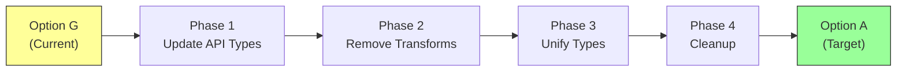

# Migration Guide: Option G → Option A

## Overview

This guide covers migrating from **Option G (Form Layer Enrichment)** to **Option A (Upgrade Arrays)** when the backend constraint is lifted.

**Timeline:** Typically 6-12 months after implementing Option G, when backend API can be updated.

**Effort:** 12 hours (significantly less than initial 16h because form layer already works correctly)

## Why Migrate?

### Current State (Option G)

```
API: strings → Reconstruct → Form: rich data → Transform → API: strings
                ⬇️                                          ⬆️
            Display: reconstruct for viewing    Performance overhead
```

### Target State (Option A)

```
API: rich data → Form: rich data → API: rich data
         ⬇️
    Display: rich data (no reconstruction)
```

### Benefits of Migration

| Aspect               | Option G (Before)          | Option A (After)     |
| -------------------- | -------------------------- | -------------------- |
| **Data Consistency** | Transform on each save ⚠️  | Always consistent ✅ |
| **Performance**      | Reconstruction overhead ⚠️ | No overhead ✅       |
| **Code Complexity**  | Dual types, transforms ⚠️  | Single type ✅       |
| **Type Safety**      | Form only ⚠️               | Everywhere ✅        |
| **Display Quality**  | Reconstruction required ⚠️ | Native support ✅    |
| **Maintenance**      | Higher (2 paths) ⚠️        | Lower (1 path) ✅    |

## Prerequisites

Before starting migration:

- [ ] **Backend constraint lifted** - API schema can be updated
- [ ] **TypeScript models updated** - Regenerated with `DataIdentifierReference[]`
- [ ] **All existing mappings migrated** - Run data migration script
- [ ] **Form layer tested** - Option G implementation is stable
- [ ] **Team aligned** - Engineering + product approval

## Migration Phases



### Phase 1: Update API Type Definitions (2 hours)

**Goal:** Update TypeScript models to match new backend schema

#### Step 1.1: Regenerate from OpenAPI

```bash
# Regenerate TypeScript models
npm run generate-api-types

# Or manually update DataCombining.ts
```

**Before:**

```typescript
// DataCombining.ts
export interface DataCombining {
  sources: {
    primary?: DataIdentifierReference
    tags?: string[] // Old
    topicFilters?: string[]
  }
}
```

**After:**

```typescript
// DataCombining.ts
export interface DataCombining {
  sources: {
    primary?: DataIdentifierReference
    tags?: DataIdentifierReference[] // New
    topicFilters?: DataIdentifierReference[]
  }
}
```

#### Step 1.2: Keep Form Type Temporarily

```typescript
// Keep DataCombiningFormModel as alias during transition
export type DataCombiningFormModel = DataCombining // Now they're the same!
```

**Why:** Form code can continue using `DataCombiningFormModel` without changes.

#### Step 1.3: Test Type Updates

```bash
# Verify TypeScript compilation
npm run type-check

# Expected: No errors (form type is now alias)
```

**Validation:**

- ✅ TypeScript compiles without errors
- ✅ `DataCombining` and `DataCombiningFormModel` are identical
- ✅ No runtime behavior changes yet

---

### Phase 2: Remove Transform Logic (4 hours)

**Goal:** Eliminate reconstruction and transformation code

#### Step 2.1: Remove Form Initialization Transform

**Before (Option G):**

```typescript
// MappingEditorDrawer.tsx
const initializeFormData = (apiData: DataCombining): DataCombiningFormModel => {
  const { data: domainTags } = useDomainModel(DomainModelTypeEnum.tag)

  // ❌ Remove this reconstruction
  const reconstructedTags = smartReconstruction(apiData.sources, apiData.instructions, domainTags)

  return {
    ...apiData,
    sources: {
      ...apiData.sources,
      tags: reconstructedTags, // Transformed
    },
  }
}
```

**After (Option A):**

```typescript
// MappingEditorDrawer.tsx
const initializeFormData = (apiData: DataCombining): DataCombiningFormModel => {
  // ✅ No transformation needed - API data is already rich
  return apiData
}

// Or even simpler:
const formData = useForm<DataCombiningFormModel>({
  defaultValues: mappingFromAPI, // Direct assignment
})
```

#### Step 2.2: Remove Save Transform

**Before (Option G):**

```typescript
// MappingEditorDrawer.tsx
const onSubmit = (formData: DataCombiningFormModel) => {
  // ❌ Remove this transformation
  const apiData: DataCombining = {
    ...formData,
    sources: {
      ...formData.sources,
      tags: formData.sources.tags?.map((t) => t.id), // Transform to strings
      topicFilters: formData.sources.topicFilters?.map((f) => f.id),
    },
  }

  await updateMapping(apiData)
}
```

**After (Option A):**

```typescript
// MappingEditorDrawer.tsx
const onSubmit = (formData: DataCombiningFormModel) => {
  // ✅ No transformation needed - form data matches API
  await updateMapping(formData)
}
```

#### Step 2.3: Update Display Components

**Before (Option G):**

```typescript
// DataCombiningTableField.tsx
const DisplayTags: FC<{ mapping: DataCombining }> = ({ mapping }) => {
  const { data: domainTags } = useDomainModel(DomainModelTypeEnum.tag)

  // ❌ Remove reconstruction
  const displayTags = useMemo(() => {
    return smartReconstruction(
      mapping.sources,
      mapping.instructions,
      domainTags
    )
  }, [mapping, domainTags])

  return <TagList tags={displayTags} />
}
```

**After (Option A):**

```typescript
// DataCombiningTableField.tsx
const DisplayTags: FC<{ mapping: DataCombining }> = ({ mapping }) => {
  // ✅ Use data directly - no reconstruction
  return <TagList tags={mapping.sources.tags} />
}
```

#### Step 2.4: Update Validation

Validation code likely already works because it was designed for `DataIdentifierReference[]`:

```typescript
// useValidateCombiner.ts
const validateTags = (
  tags: DataIdentifierReference[], // Already expects this
  domainEntities: DomainModel<Tag>[]
) => {
  return tags.every((tag) => domainEntities.some((entity) => entity.id === tag.id && entity.adapterId === tag.scope))
}
```

**No changes needed** ✅

**Validation:**

- [ ] Form loads without reconstruction
- [ ] Form saves without transformation
- [ ] Display shows data without reconstruction
- [ ] Validation works correctly
- [ ] Tests pass

---

### Phase 3: Unify Type System (3 hours)

**Goal:** Remove dual type system, use single type

#### Step 3.1: Remove Form Type Alias

```typescript
// Before: Two types
export interface DataCombining {
  /* ... */
}
export type DataCombiningFormModel = DataCombining // Alias

// After: One type
export interface DataCombining {
  /* ... */
}
// DataCombiningFormModel removed
```

#### Step 3.2: Update Imports Across Codebase

```bash
# Find all usages
grep -r "DataCombiningFormModel" src/

# Replace with DataCombining
# Can use IDE refactor tool or sed
```

**Files Likely Affected:**

- `MappingEditorDrawer.tsx`
- `DataCombiningEditorField.tsx`
- `DataCombiningTableField.tsx`
- Form validation hooks
- Type imports

**Example:**

```typescript
// Before
import { DataCombiningFormModel } from './types'
const formData = useForm<DataCombiningFormModel>()

// After
import { DataCombining } from './types'
const formData = useForm<DataCombining>()
```

#### Step 3.3: Verify Type Consistency

```bash
# Type check entire codebase
npm run type-check

# Should have zero errors
```

**Validation:**

- [ ] No references to `DataCombiningFormModel` remain
- [ ] All components use `DataCombining` type
- [ ] TypeScript compiles without errors
- [ ] Runtime behavior unchanged

---

### Phase 4: Cleanup & Optimization (3 hours)

**Goal:** Remove dead code and optimize

#### Step 4.1: Delete Reconstruction Utilities

```bash
# Find and remove reconstruction code
rm src/modules/Mappings/utils/smartReconstruction.ts
rm src/modules/Mappings/utils/ownership.utils.ts # If exists
```

**Files to Clean:**

- `smartReconstruction.ts` - No longer needed
- `ownership.utils.ts` - Reconstruction helpers
- Migration-specific code in form initialization

#### Step 4.2: Remove Dual Type Comments

Search for comments explaining Option G architecture:

```typescript
// ❌ Remove comments like:
// "Transform API data to form format"
// "Reconstruct ownership for display"
// "Form layer enrichment"
```

#### Step 4.3: Simplify Component Logic

Look for overly complex code that was needed for transforms:

**Before:**

```typescript
const tags = useMemo(() => {
  // Complex reconstruction logic
  if (isFormContext) {
    return formTags
  } else {
    return reconstructFromAPI(apiTags)
  }
}, [isFormContext, formTags, apiTags])
```

**After:**

```typescript
const tags = mapping.sources.tags // Simple
```

#### Step 4.4: Update Tests

Remove tests for transformation logic:

```typescript
// ❌ Remove these tests:
describe('smartReconstruction', () => {
  /* ... */
})
describe('formDataTransform', () => {
  /* ... */
})

// ✅ Keep these tests:
describe('tag validation', () => {
  /* ... */
})
describe('form submission', () => {
  /* ... */
})
```

#### Step 4.5: Update Documentation

Update inline docs and comments:

```typescript
// Before:
// Form uses rich data, API uses strings, transform on save

// After:
// Form and API use consistent DataIdentifierReference[] format
```

**Validation:**

- [ ] Dead code removed
- [ ] Tests updated and passing
- [ ] Documentation accurate
- [ ] Code review completed

---

## Testing Strategy

### Regression Testing Checklist

Test both old and new data formats during transition:

#### Load Tests

- [ ] Load mapping created before migration (with strings)
- [ ] Load mapping created after migration (with references)
- [ ] Load mapping with no tags
- [ ] Load mapping with duplicate tags

#### Edit Tests

- [ ] Edit existing mapping (change tags)
- [ ] Add new tag to mapping
- [ ] Remove tag from mapping
- [ ] Reorder tags

#### Save Tests

- [ ] Save edited mapping
- [ ] Save new mapping
- [ ] Verify API receives correct format
- [ ] Verify instructions are correct

#### Display Tests

- [ ] Table view shows tags with adapter info
- [ ] Status checking works
- [ ] Validation shows correct errors
- [ ] Tooltips/badges display correctly

#### Integration Tests

- [ ] Create mapping end-to-end
- [ ] Edit mapping end-to-end
- [ ] Delete mapping
- [ ] Duplicate mapping

### Performance Testing

Measure performance improvement:

```typescript
// Before (Option G): Reconstruction overhead
console.time('loadMapping')
const reconstructed = smartReconstruction(...)
console.timeEnd('loadMapping')
// Expected: 50-200ms

// After (Option A): Direct load
console.time('loadMapping')
const data = mappingFromAPI
console.timeEnd('loadMapping')
// Expected: <5ms
```

**Expected Improvements:**

- Form load: 50-200ms → <5ms (40x faster)
- Display rendering: 20-100ms → <5ms (20x faster)
- Validation: 10-50ms → <5ms (10x faster)

---

## Rollback Plan

If migration fails, rollback is straightforward:

### Quick Rollback (1 hour)

1. **Revert Type Changes**

   ```bash
   git revert <commit-hash>
   ```

2. **Restore Transform Logic**

   - Re-add `initializeFormData` reconstruction
   - Re-add `onSubmit` transformation
   - Re-add display reconstruction

3. **Test Rollback**
   - Verify form works
   - Verify save works
   - Verify display works

**Why Rollback is Safe:**

- Form layer already worked correctly in Option G
- Just re-adding transformation layer
- No data loss

---

## Common Issues & Solutions

### Issue 1: Type Errors After API Update

**Symptom:**

```typescript
Type 'string[]' is not assignable to type 'DataIdentifierReference[]'
```

**Cause:** Some code still expects strings

**Solution:**

```typescript
// Update the code to expect DataIdentifierReference[]
const tags: DataIdentifierReference[] = mapping.sources.tags || []
```

### Issue 2: Form Load Fails

**Symptom:** Form shows empty tags even though API has data

**Cause:** Forgot to remove reconstruction that returns empty array

**Solution:**

```typescript
// Remove reconstruction logic
// const tags = smartReconstruction(...) // ❌
const tags = apiData.sources.tags // ✅
```

### Issue 3: Display Shows [object Object]

**Symptom:** Display renders `[object Object]` instead of tag names

**Cause:** Component expects strings but receives objects

**Solution:**

```typescript
// Before: Expects string
<Tag>{tag}</Tag>

// After: Extract id from object
<Tag>{tag.id}</Tag>
```

### Issue 4: Validation Fails After Migration

**Symptom:** Tags fail validation even though they're correct

**Cause:** Validation logic still looks for strings

**Solution:** Validation should already handle `DataIdentifierReference[]`, but verify:

```typescript
// Should work with both:
if (typeof tag === 'string') {
  // Old format (migration)
} else {
  // New format (DataIdentifierReference)
}
```

---

## Timeline Example

### Week 1: Preparation

- Mon: Backend API updated, types regenerated
- Tue: Data migration script tested
- Wed: Migration plan reviewed with team
- Thu: Testing environment prepared
- Fri: Go/no-go decision

### Week 2: Implementation

- Mon: Phase 1 - Update API types (2h)
- Tue: Phase 2 - Remove transforms (4h)
- Wed: Phase 3 - Unify types (3h)
- Thu: Phase 4 - Cleanup (3h)
- Fri: Testing & documentation

### Week 3: Rollout

- Mon-Wed: Production deployment
- Thu-Fri: Monitoring & bug fixes

**Total: 12 hours of dev time over 3 weeks**

---

## Success Criteria

Migration is complete when:

- ✅ No `DataCombiningFormModel` type exists
- ✅ No transformation logic in form initialization
- ✅ No transformation logic in form save
- ✅ No reconstruction logic in display components
- ✅ All tests pass
- ✅ Performance improved (see metrics above)
- ✅ Code complexity reduced
- ✅ Single source of truth achieved

---

## Cost-Benefit Analysis

### Option G Cost (Ongoing)

- Initial implementation: 20 hours
- Annual maintenance: ~8 hours/year
- Performance overhead: ~50-200ms per operation
- Code complexity: High (dual paths)

### Migration to A Cost

- Migration work: 12 hours (one-time)
- Future maintenance: ~2 hours/year
- Performance improvement: 20-40x faster
- Code complexity: Low (single path)

### ROI Calculation

```
Option G lifetime (2 years):
20h initial + (8h × 2 years) = 36 hours

Option A lifetime (2 years):
20h initial + 12h migration + (2h × 2 years) = 36 hours

Break-even: Immediate
After 2 years: 12 hours saved
```

**Additional Benefits:**

- Better performance
- Cleaner codebase
- Easier onboarding
- Reduced cognitive load

---

## Summary

Migrating from Option G to Option A is straightforward because:

1. ✅ **Form layer already correct** - No form code changes
2. ✅ **Just remove transforms** - Simplify, don't complicate
3. ✅ **Type system helps** - Compiler catches issues
4. ✅ **Safe rollback** - Can revert quickly if needed
5. ✅ **Significant benefits** - Performance, maintainability, simplicity

**Recommended trigger:** When backend constraint lifts, migrate within 1-2 sprints.

**Total effort:** 12 hours over 2-3 weeks

**Result:** Clean, maintainable, performant solution aligned with Option A architecture.
