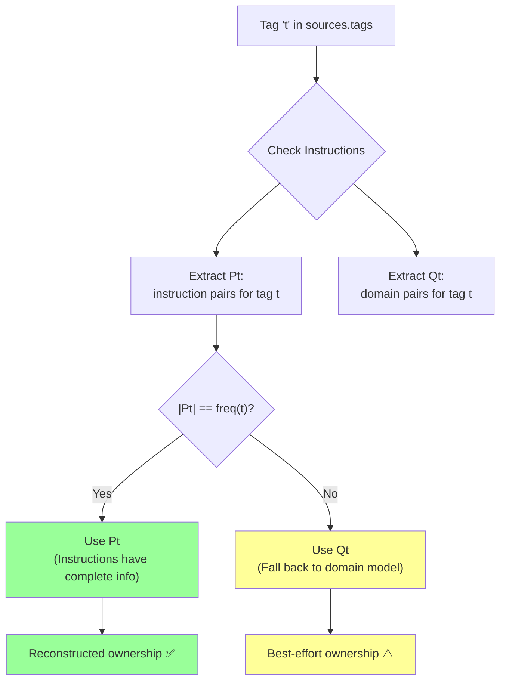

# Option F: Smart Reconstruction Algorithm

## Overview

Instead of upgrading data structures, implement an intelligent reconstruction algorithm that infers ownership from the combination of:

1. Existing `instructions[].sourceRef` (has scope)
2. Current domain model (all adapter-tag pairs)
3. Frequency analysis of tag names

**Key Insight:** Instructions already contain ownership information. We can use them as ground truth to reconstruct ownership for the string arrays.

## The Algorithm

### Formal Definition

Given:

- `t` = a concrete tagname in `combining.sources.tags`
- `P` = set of all `(adapter, tagname)` pairs from `combining.instructions[*].sourceRef` (deduplicated)
- `Pt` = subset of `P` where `tagname = t`
- `Q` = set of all `(adapter, tagname)` pairs from current domain model (all adapters)
- `Qt` = subset of `Q` where `tagname = t`
- `freq(t)` = number of times `t` appears in `combining.sources.tags`

**Reconstruction Logic:**

```
IF |Pt| == freq(t) THEN
    // Instructions have complete information
    replace occurrences of t with pairs from Pt
ELSE
    // Fall back to domain model
    replace occurrences of t with pairs from Qt
END IF
```

### Visual Flow



## Implementation

### Core Function

```typescript
interface ReconstructedTag {
  id: string
  type: 'tag'
  scope: string
  confidence: 'high' | 'medium' | 'low'
}

/**
 * Smart reconstruction algorithm
 */
function reconstructTagOwnership(
  sources: Sources,
  instructions: Instruction[],
  domainModel: DomainModel<Tag>[]
): ReconstructedTag[] {
  // Build P: all (adapter, tag) pairs from instructions
  const P = new Map<string, Set<string>>() // tagId -> Set<adapterId>

  instructions.forEach((inst) => {
    if (inst.sourceRef?.type === 'tag') {
      const tagId = inst.sourceRef.id
      const adapterId = inst.sourceRef.scope

      if (!P.has(tagId)) {
        P.set(tagId, new Set())
      }
      P.get(tagId)!.add(adapterId)
    }
  })

  // Build Q: all (adapter, tag) pairs from domain model
  const Q = new Map<string, Set<string>>() // tagId -> Set<adapterId>

  domainModel.forEach((model) => {
    const tagId = model.id
    const adapterId = model.adapterId

    if (!Q.has(tagId)) {
      Q.set(tagId, new Set())
    }
    Q.get(tagId)!.add(adapterId)
  })

  // Count frequency of each tag in sources.tags
  const freq = new Map<string, number>()
  sources.tags?.forEach((tag) => {
    freq.set(tag, (freq.get(tag) || 0) + 1)
  })

  // Reconstruct ownership for each tag
  const reconstructed: ReconstructedTag[] = []

  sources.tags?.forEach((t) => {
    const Pt = P.get(t) || new Set()
    const Qt = Q.get(t) || new Set()
    const frequency = freq.get(t) || 0

    if (Pt.size === frequency && Pt.size > 0) {
      // Case 1: Instructions have complete information
      Array.from(Pt).forEach((adapterId) => {
        reconstructed.push({
          id: t,
          type: 'tag',
          scope: adapterId,
          confidence: 'high', // ✅ Based on instructions
        })
      })
    } else if (Qt.size === frequency && Qt.size > 0) {
      // Case 2: Domain model matches frequency
      Array.from(Qt).forEach((adapterId) => {
        reconstructed.push({
          id: t,
          type: 'tag',
          scope: adapterId,
          confidence: 'medium', // ⚠️ Based on current state
        })
      })
    } else if (Qt.size > 0) {
      // Case 3: Take first N from domain model
      Array.from(Qt)
        .slice(0, frequency)
        .forEach((adapterId) => {
          reconstructed.push({
            id: t,
            type: 'tag',
            scope: adapterId,
            confidence: 'low', // ⚠️ Ambiguous, guessing
          })
        })
    } else {
      // Case 4: No information available
      reconstructed.push({
        id: t,
        type: 'tag',
        scope: 'unknown',
        confidence: 'low', // ❌ Cannot determine
      })
    }
  })

  return reconstructed
}
```

### Usage Example

```typescript
// In validation hook
const validateTags = (sources: Sources, instructions: Instruction[]) => {
  const { data: domainTags } = useDomainModel(DomainModelTypeEnum.tag)

  // Reconstruct ownership
  const reconstructedTags = reconstructTagOwnership(sources, instructions, domainTags)

  // Validate with full ownership context
  return reconstructedTags.every((tag) => {
    // Skip if low confidence
    if (tag.confidence === 'low') {
      console.warn(`Low confidence for tag ${tag.id}`)
      return true // Don't fail validation
    }

    // Validate ownership
    return domainTags.some((entity) => entity.id === tag.id && entity.adapterId === tag.scope)
  })
}
```

## Analysis

### Scenarios

#### Scenario 1: Perfect Match (High Confidence)

```typescript
// Mapping
sources.tags = ['temperature', 'humidity']

instructions = [
  { sourceRef: { id: 'adapter1', scope: 'adapter1' }, sourcePath: ['temperature'] },
  { sourceRef: { id: 'adapter2', scope: 'adapter2' }, sourcePath: ['humidity'] },
][
  // Result:
  // P = { "temperature": ["adapter1"], "humidity": ["adapter2"] }
  // freq("temperature") = 1, |Pt| = 1 ✅ Match
  // freq("humidity") = 1, |Pt| = 1 ✅ Match

  // Reconstructed with HIGH confidence ✅
  ({ id: 'temperature', scope: 'adapter1', confidence: 'high' },
  { id: 'humidity', scope: 'adapter2', confidence: 'high' })
]
```

#### Scenario 2: Duplicate Tags (Instructions Match)

```typescript
// Mapping
sources.tags = ['temperature', 'temperature']

instructions = [
  { sourceRef: { id: 'adapter1', scope: 'adapter1' }, sourcePath: ['temperature'] },
  { sourceRef: { id: 'adapter2', scope: 'adapter2' }, sourcePath: ['temperature'] },
][
  // Result:
  // Pt = { "adapter1", "adapter2" }
  // freq("temperature") = 2, |Pt| = 2 ✅ Match

  // Reconstructed with HIGH confidence ✅
  ({ id: 'temperature', scope: 'adapter1', confidence: 'high' },
  { id: 'temperature', scope: 'adapter2', confidence: 'high' })
]
```

#### Scenario 3: Missing Instructions (Fall Back to Domain)

```typescript
// Mapping
sources.tags = ['temperature']

instructions = [] // No instructions yet

// Domain model
domainTags = [
  { id: 'temperature', adapterId: 'adapter1' },
  { id: 'temperature', adapterId: 'adapter2' },
][
  // Result:
  // Pt = {} (empty)
  // Qt = { "adapter1", "adapter2" }
  // freq("temperature") = 1, |Qt| = 2 ⚠️ Ambiguous

  // Reconstructed with LOW confidence ⚠️
  { id: 'temperature', scope: 'adapter1', confidence: 'low' } // Picks first
]
```

#### Scenario 4: Instructions Incomplete

```typescript
// Mapping
sources.tags = ['temperature', 'temperature']

instructions = [
  { sourceRef: { id: 'adapter1', scope: 'adapter1' }, sourcePath: ['temperature'] },
  // Missing second instruction
]

// Domain model
domainTags = [
  { id: 'temperature', adapterId: 'adapter1' },
  { id: 'temperature', adapterId: 'adapter2' },
][
  // Result:
  // Pt = { "adapter1" }
  // Qt = { "adapter1", "adapter2" }
  // freq("temperature") = 2, |Pt| = 1 ❌ No match
  // freq("temperature") = 2, |Qt| = 2 ✅ Match

  // Reconstructed with MEDIUM confidence ⚠️
  ({ id: 'temperature', scope: 'adapter1', confidence: 'medium' },
  { id: 'temperature', scope: 'adapter2', confidence: 'medium' })
]
```

### Truth Table

| Scenario                                | `   | Pt  | `   | `freq(t)`        | `         | Qt  | `   | Decision | Confidence |
| --------------------------------------- | --- | --- | --- | ---------------- | --------- | --- | --- | -------- | ---------- |
| Instructions complete                   | 2   | 2   | 2   | Use Pt           | High ✅   |
| Instructions match                      | 1   | 1   | 3   | Use Pt           | High ✅   |
| No instructions, domain matches         | 0   | 2   | 2   | Use Qt           | Medium ⚠️ |
| No instructions, domain doesn't match   | 0   | 1   | 3   | Use Qt (first N) | Low ⚠️    |
| Instructions incomplete, domain matches | 1   | 2   | 2   | Use Qt           | Medium ⚠️ |
| No information                          | 0   | 1   | 0   | Unknown          | Low ❌    |

## Advantages

### ✅ Strengths

1. **One Central Implementation**

   - Algorithm lives in single utility function
   - All consumers call same function
   - No scattered logic

2. **Leverages Existing Data**

   - Uses instructions as ground truth
   - Falls back gracefully to domain model
   - Works with incomplete data

3. **Backward Compatible**

   - No schema changes
   - No migration needed
   - Works with old and new mappings

4. **Confidence Levels**

   - High: Based on instructions (reliable)
   - Medium: Based on domain model (current state)
   - Low: Ambiguous or guessing
   - Enables smart validation behavior

5. **Minimal Code Changes**
   - Add reconstruction utility
   - Update validation to use it
   - Update display to use it
   - ~3-4 places to change

## Disadvantages

### ❌ Weaknesses

1. **Not Truly "One Change"**

   - Validation must call reconstruction
   - Display must call reconstruction
   - Status checking must call reconstruction
   - Testing must call reconstruction
   - Still 4+ places, not 1

2. **Runtime Overhead**

   - Build P and Q on every render/validation
   - O(n\*m) complexity (n tags, m instructions)
   - Must memoize aggressively

3. **Violates "Clean Solution" Constraint**

   - Reconstruction is a workaround
   - Doesn't fix root cause (information loss)
   - Complexity hidden in utility, not eliminated

4. **Confidence System is Complex**

   - What to do with "low" confidence?
   - Should validation fail or warn?
   - Display ambiguity to user?

5. **Temporal Coupling**

   - Algorithm depends on current domain model
   - If adapters are offline, Qt is incomplete
   - Results vary based on system state

6. **Edge Cases Are Tricky**

**Problem: Order Ambiguity**

```typescript
sources.tags = ['temp', 'temp', 'temp']
instructions = [
  { sourceRef: { scope: 'adapter1' }, sourcePath: ['temp'] },
  { sourceRef: { scope: 'adapter2' }, sourcePath: ['temp'] },
  { sourceRef: { scope: 'adapter3' }, sourcePath: ['temp'] },
]

// Which "temp" goes with which adapter?
// Algorithm reconstructs correctly by count, but order is arbitrary
// If user meant: [adapter1, adapter2, adapter3]
// But display shows: [adapter2, adapter1, adapter3]
// ⚠️ Visual inconsistency
```

**Problem: Instruction Changes**

```typescript
// Initial state
sources.tags = ['temp']
instructions = [{ sourceRef: { scope: 'adapter1' }, sourcePath: ['temp'] }]
// Reconstructed: adapter1 (high confidence) ✅

// User edits instructions
instructions = [{ sourceRef: { scope: 'adapter2' }, sourcePath: ['temp'] }]
// Reconstructed: adapter2 (high confidence) ✅

// But sources.tags is still ["temp"]
// Now display shows adapter2, but user thought it was adapter1
// ❌ Silent change in interpretation
```

7. **Testing Complexity**
   - Must test reconstruction algorithm with all scenarios
   - Must test confidence level handling
   - Must test edge cases (empty, duplicates, etc.)
   - Must test temporal coupling (domain model changes)

## Comparison with Other Options

| Criterion                     | Option A<br/>(Upgrade Arrays) | Option E<br/>(Simple Reconstruction) | **Option F<br/>(Smart Reconstruction)** |
| ----------------------------- | ----------------------------- | ------------------------------------ | --------------------------------------- |
| **Data Structure**            | Clean ✅                      | Broken ❌                            | Broken ❌                               |
| **Information Loss**          | Fixed ✅                      | Still exists ❌                      | Still exists ❌                         |
| **Reconstruction Complexity** | None ✅                       | Simple ⚠️                            | Complex ❌                              |
| **Confidence Levels**         | N/A                           | No                                   | Yes ✅                                  |
| **Runtime Performance**       | Fast ✅                       | Medium ⚠️                            | Slow ❌                                 |
| **Backward Compatible**       | With migration ⚠️             | Yes ✅                               | Yes ✅                                  |
| **Code Changes**              | 6 files                       | 4 files                              | 4 files                                 |
| **Maintainability**           | High ✅                       | Medium ⚠️                            | Low ❌                                  |
| **Clean Solution**            | Yes ✅                        | No ❌                                | No ❌                                   |

## Effort Estimation

| Task                                 | Effort       | Complexity |
| ------------------------------------ | ------------ | ---------- |
| Core reconstruction algorithm        | 4 hours      | High       |
| Memoization/performance optimization | 2 hours      | Medium     |
| Update validation hooks              | 2 hours      | Medium     |
| Update display components            | 2 hours      | Medium     |
| Update status checking               | 1 hour       | Low        |
| Confidence level handling            | 2 hours      | Medium     |
| Edge case handling                   | 2 hours      | High       |
| Testing (unit + integration)         | 5 hours      | High       |
| **TOTAL**                            | **20 hours** | **High**   |

**Note:** 4 hours MORE than Option A, with HIGHER complexity.

## Risk Assessment

| Risk                         | Likelihood | Impact | Mitigation                           |
| ---------------------------- | ---------- | ------ | ------------------------------------ |
| Algorithm bugs in edge cases | High       | High   | Extensive testing, confidence levels |
| Performance degradation      | Medium     | Medium | Aggressive memoization               |
| Order ambiguity issues       | High       | Medium | Document limitation                  |
| Temporal coupling issues     | Medium     | High   | Cache domain model                   |
| Confidence level confusion   | Medium     | Medium | Clear UI indicators                  |
| Maintenance burden           | High       | High   | Good documentation                   |

## Decision Criteria

### When Option F Makes Sense

✅ **Consider this if:**

- Absolutely CANNOT change data structure (regulatory/legal constraint)
- Must maintain 100% backward compatibility with zero migration
- Instructions are always present and complete
- Performance is not critical
- Team has bandwidth for complex algorithm maintenance

### When Option A Makes More Sense

✅ **Choose Option A instead if:**

- Clean architecture is important ✅ (per requirements)
- Type safety is valued ✅
- Performance matters ✅
- Maintainability is key ✅
- 16 hours is acceptable (vs 20 hours for Option F)

## Hybrid Approach

### Option F-Lite: Reconstruction During Migration Only

Use smart reconstruction algorithm **only during migration**, then store the result:

```typescript
// On first load of old mapping
const migrateSources = (mapping: DataCombining): DataCombining => {
  const { data: domainTags } = useDomainModel(DomainModelTypeEnum.tag)

  // If already migrated, return as-is
  if (typeof mapping.sources.tags?.[0] === 'object') {
    return mapping
  }

  // Use smart reconstruction ONCE
  const reconstructed = reconstructTagOwnership(mapping.sources, mapping.instructions, domainTags)

  // Store the result permanently
  return {
    ...mapping,
    sources: {
      ...mapping.sources,
      tags: reconstructed, // Now DataIdentifierReference[]
    },
  }
}
```

**Advantages:**

- ✅ Reconstruction complexity is one-time cost
- ✅ After migration, data is clean
- ✅ No runtime overhead
- ✅ Best of both worlds

**Result:** This is essentially **Option A with smarter migration**, not a separate option.

## Recommendation

### ❌ Do NOT use Option F as standalone solution

**Reasoning:**

1. **Violates "clean solution" constraint** - Reconstruction is a workaround
2. **Higher effort than Option A** - 20 hours vs 16 hours
3. **Higher complexity** - More moving parts, more edge cases
4. **Runtime overhead** - Must reconstruct on every operation
5. **Not truly "one change"** - Still 4+ places to update
6. **Maintenance burden** - Complex algorithm to maintain

### ✅ DO use smart reconstruction in Option A's migration

**Integrate the algorithm into Option A:**

1. Use smart reconstruction during migration
2. Store result as `DataIdentifierReference[]`
3. After migration, no more reconstruction needed
4. Clean architecture going forward

**Modified Option A Effort:**

- Core changes: 12 hours (from Option A)
- Smart migration: +4 hours (from Option F algorithm)
- **Total: 16 hours** (same as Option A)
- **Complexity: Medium** (lower than standalone Option F)

## Summary

Option F (Smart Reconstruction) is an **improvement over Option E** (simple reconstruction) but is **worse than Option A** (upgrade arrays) on all key criteria:

- **Cleanliness:** Option A wins ✅
- **Effort:** Option A is 20% less effort ✅
- **Performance:** Option A is faster ✅
- **Maintainability:** Option A is easier ✅
- **Type Safety:** Option A has it, Option F doesn't ✅

**Best Path Forward:** Use Option A with smart reconstruction in migration step.

This gives you:

- Clean data structure (no workarounds)
- Smart migration (handles edge cases)
- Type safety (compiler enforced)
- Performance (no runtime reconstruction)
- Same effort (16 hours)

The smart reconstruction algorithm is valuable, but as a **one-time migration tool**, not a permanent runtime solution.
