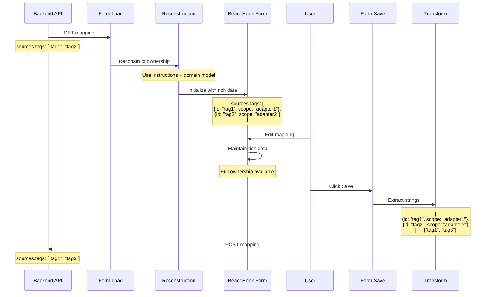

# Option G: Form Layer Enrichment with Runtime Source of Truth

## Overview

**Key Insight:** The form is where users interact with mappings. Keep the API unchanged but maintain a **rich, runtime-only representation** within the React Hook Form (RJSF) context.

**Architecture:**

- ✅ API/Backend: Keep `sources.tags: string[]` (never changes)
- ✅ Form Layer: Use `sources.tags: DataIdentifierReference[]` (enhanced)
- ✅ Reconstruction: Build enhanced version on form load
- ✅ Transformation: Simplify back to strings on save

```mermaid
graph LR
    A[API Format<br/>tags: string[]] -->|Load| B[Reconstruction Algorithm]
    B -->|Enrich| C[Form Format<br/>tags: DataIdentifierReference[]]
    C -->|Edit| C
    C -->|Save| D[Transform to strings]
    D -->|POST| A

    style A fill:#f99,stroke:#333
    style C fill:#9f9,stroke:#333
```

## Architecture

### Layer Separation

```mermaid
graph TD
    subgraph "API Layer (Unchanged)"
        A1[Backend API<br/>sources.tags: string[]]
        A2[TypeScript Models<br/>sources.tags: string[]]
    end

    subgraph "Form Layer (Enhanced)"
        F1[Form State<br/>sources.tags: DataIdentifierReference[]]
        F2[Form Components<br/>Work with rich data]
        F3[Form Validation<br/>Full ownership checks]
    end

    subgraph "Display Layer (Read-Only)"
        D1[Table Display<br/>Uses reconstruction]
        D2[Status Checking<br/>Uses reconstruction]
    end

    A2 -->|Load & Reconstruct| F1
    F1 -->|Edit| F1
    F1 -->|Transform & Save| A1

    A2 -->|Reconstruct| D1
    A2 -->|Reconstruct| D2

    style F1 fill:#9f9,stroke:#333
    style A1 fill:#f99,stroke:#333
    style A2 fill:#f99,stroke:#333
```

### Data Flow



## Implementation

### Step 1: Form Schema Extension

Create a **form-specific type** that extends the API type:

```typescript
// API Type (unchanged)
export interface DataCombining {
  sources: {
    primary?: DataIdentifierReference
    tags?: string[] // ❌ API keeps strings
    topicFilters?: string[]
  }
  instructions?: Instruction[]
}

// Form Type (enhanced)
export interface DataCombiningFormModel extends Omit<DataCombining, 'sources'> {
  sources: {
    primary?: DataIdentifierReference
    tags?: DataIdentifierReference[] // ✅ Form uses references
    topicFilters?: DataIdentifierReference[]
  }
  instructions?: Instruction[]
}
```

### Step 2: Form Initialization with Reconstruction

```typescript
// In MappingEditorDrawer or form initialization
const initializeFormData = (apiData: DataCombining): DataCombiningFormModel => {
  const { data: domainTags } = useDomainModel(DomainModelTypeEnum.tag)

  // Use smart reconstruction algorithm (Option F)
  const reconstructedTags = smartReconstruction(apiData.sources, apiData.instructions, domainTags)

  const reconstructedFilters = smartReconstruction(
    { ...apiData.sources, tags: apiData.sources.topicFilters },
    apiData.instructions,
    domainTags // Or domain filters
  )

  return {
    ...apiData,
    sources: {
      primary: apiData.sources.primary,
      tags: reconstructedTags, // ✅ Rich data for form
      topicFilters: reconstructedFilters,
    },
  }
}

// Initialize form
const formData = useForm<DataCombiningFormModel>({
  defaultValues: initializeFormData(mappingFromAPI),
})
```

### Step 3: Form Components Use Rich Data

```typescript
// CombinedEntitySelect - NO CHANGES NEEDED
const CombinedEntitySelect: FC<Props> = ({ value, onChange }) => {
  const options = useMemo(() => {
    return buildOptionsForCombiner(domainTagQueries)
  }, [domainTagQueries])

  const handleOnChange = useCallback(
    (value: MultiValue<DomainModel<unknown>>) => {
      // Now this returns DataIdentifierReference[]
      onChange?.(
        value.map(v => ({
          id: v.id,
          type: v.type,
          scope: v.adapterId // ✅ Full ownership preserved
        }))
      )
    },
    [onChange]
  )

  return (
    <Select<DomainModel<unknown>, true>
      options={options}
      value={value} // Now DataIdentifierReference[]
      onChange={handleOnChange}
      isMulti
    />
  )
}
```

### Step 4: Form Validation with Full Ownership

```typescript
// useValidateCombiner - simplified
const validateTags = (
  tags: DataIdentifierReference[], // ✅ Form has rich data
  domainEntities: DomainModel<Tag>[]
) => {
  return tags.every((tag) =>
    domainEntities.some(
      (entity) => entity.id === tag.id && entity.adapterId === tag.scope // ✅ Can validate ownership
    )
  )
}
```

### Step 5: Transform Back on Save

```typescript
const onSubmit = (formData: DataCombiningFormModel) => {
  // Transform form model to API model
  const apiData: DataCombining = {
    ...formData,
    sources: {
      primary: formData.sources.primary,
      tags: formData.sources.tags?.map((t) => t.id), // ✅ Extract strings
      topicFilters: formData.sources.topicFilters?.map((f) => f.id),
    },
  }

  // Save to API
  await updateMapping(apiData)
}
```

### Step 6: Display Components (Outside Form)

```typescript
// For read-only display (table, status checking)
const DisplayTags: FC<{ mapping: DataCombining }> = ({ mapping }) => {
  const { data: domainTags } = useDomainModel(DomainModelTypeEnum.tag)

  // Reconstruct for display
  const displayTags = useMemo(() => {
    return smartReconstruction(
      mapping.sources,
      mapping.instructions,
      domainTags
    )
  }, [mapping, domainTags])

  return (
    <div>
      {displayTags.map(tag => (
        <Tag key={tag.id}>
          {tag.id} <Badge>{tag.scope}</Badge>
        </Tag>
      ))}
    </div>
  )
}
```

## Benefits

### ✅ Advantages

1. **No Backend Changes** ✅

   - API remains unchanged
   - Backend never needs updates
   - Meets critical constraint

2. **Clean Form Experience** ✅

   - Form works with rich data
   - Full ownership during editing
   - Type-safe form state

3. **Backward Compatible** ✅

   - API format unchanged
   - Old data works
   - No migration needed

4. **Scoped Changes** ✅

   - Changes isolated to form layer
   - Display layer uses reconstruction
   - Clear separation

5. **Best User Experience** ✅

   - Rich data where it matters (editing)
   - Validation works correctly
   - No information loss during edit session

6. **Leverages Reconstruction** ✅
   - Smart algorithm on load
   - One-time cost per edit session
   - Results cached in form state

## Drawbacks

### ❌ Disadvantages

1. **Dual Representation** ⚠️

   - API has one format
   - Form has another format
   - Must maintain both

2. **Transform Complexity** ⚠️

   - Load: API → Form (enrich)
   - Save: Form → API (simplify)
   - Two-way transformation logic

3. **Reconstruction Still Needed** ⚠️

   - Display components need it
   - Status checking needs it
   - Not eliminated, just moved

4. **Type Complexity** ⚠️

   - Two types: `DataCombining` and `DataCombiningFormModel`
   - Components must know which type to use
   - Import management

5. **Information Loss on Save** ⚠️

   - User edits with rich data
   - Save strips to strings
   - Next load must reconstruct again

6. **Not a Full Solution** ❌
   - Form is fixed ✅
   - Display still needs reconstruction ❌
   - Status checking still needs reconstruction ❌
   - Validation outside form still broken ❌

## Comparison with Other Options

| Aspect                    | Option A<br/>(Upgrade API) | Option F<br/>(Runtime Reconstruction) | **Option G<br/>(Form Layer)** |
| ------------------------- | -------------------------- | ------------------------------------- | ----------------------------- |
| **Backend Changes**       | None ✅                    | None ✅                               | None ✅                       |
| **API Format**            | Clean ✅                   | Broken ❌                             | Broken ❌                     |
| **Form Format**           | Clean ✅                   | Broken ❌                             | Clean ✅                      |
| **Display Format**        | Clean ✅                   | Broken ❌                             | Broken ❌                     |
| **Form Experience**       | Excellent ✅               | Poor ❌                               | Excellent ✅                  |
| **Display Experience**    | Excellent ✅               | Poor ❌                               | Acceptable ⚠️                 |
| **Type Safety (Form)**    | Yes ✅                     | No ❌                                 | Yes ✅                        |
| **Type Safety (Display)** | Yes ✅                     | No ❌                                 | No ❌                         |
| **Reconstruction Needed** | Once (migration)           | Always ❌                             | On load + display ⚠️          |
| **Dual Representation**   | No ✅                      | No ✅                                 | Yes ❌                        |
| **Code Complexity**       | Low ✅                     | High ❌                               | Medium ⚠️                     |

## Effort Estimation

| Task                                    | Effort       | Complexity |
| --------------------------------------- | ------------ | ---------- |
| Create `DataCombiningFormModel` type    | 1 hour       | Low        |
| Form initialization with reconstruction | 3 hours      | Medium     |
| Update form components (minimal)        | 2 hours      | Low        |
| Transform on save                       | 2 hours      | Low        |
| Update form validation                  | 2 hours      | Medium     |
| Display reconstruction (table, status)  | 3 hours      | Medium     |
| Memoization/performance                 | 2 hours      | Medium     |
| Testing (unit + integration)            | 5 hours      | High       |
| **TOTAL**                               | **20 hours** | **Medium** |

## Risk Assessment

| Risk                              | Likelihood | Impact | Mitigation                   |
| --------------------------------- | ---------- | ------ | ---------------------------- |
| Transform bugs (data loss)        | Medium     | High   | Thorough testing, validation |
| Type confusion (Form vs API)      | Medium     | Medium | Clear naming, documentation  |
| Reconstruction overhead           | Medium     | Medium | Memoization, caching         |
| Display still broken outside form | High       | Medium | Accept limitation, document  |
| Information loss on reload        | High       | Low    | Reconstruction handles it    |

## When This Makes Sense

### ✅ Choose Option G if:

1. **Backend is truly frozen** 🔒

   - Regulatory constraints prevent API changes
   - Backend team unavailable indefinitely
   - API versioning not feasible

2. **Form experience is priority** 🎯

   - Editing is the primary use case
   - Display is secondary
   - Users mostly work in edit mode

3. **Gradual improvement acceptable** 📈

   - Fix form first
   - Fix display later (if ever)
   - Phased approach preferred

4. **Team structure supports it** 👥
   - Frontend team owns form layer
   - Can maintain dual types
   - Comfortable with transformation logic

### ❌ Don't choose Option G if:

1. **Backend can change** (even slowly)

   - Option A is cleaner
   - Better long-term solution
   - Less dual maintenance

2. **Display is equally important** 📊

   - Read-only views common
   - Status monitoring critical
   - Option G doesn't fix these

3. **Type safety is critical** 🛡️

   - Need consistency everywhere
   - Option A provides this
   - Option G only fixes form

4. **Team prefers simplicity** 🎯
   - Dual types add complexity
   - Transform logic adds risk
   - Option A is simpler

## Hybrid with Option A

### Best Path: Form Layer Now, API Later

**Phase 1: Implement Option G (20 hours)**

- Form gets rich data immediately
- Users can edit correctly
- Display uses reconstruction (acceptable)

**Phase 2: Upgrade to Option A (12 hours)**

- When backend can change
- Migrate API to `DataIdentifierReference[]`
- Remove transformation logic
- Form type becomes API type

**Total Effort:** 32 hours over 2 phases
**Benefit:** Immediate form fix, clean architecture later

## Recommendation

### ✅ Use Option G if backend is TRULY frozen

**Scenarios where Option G is best choice:**

- Backend is third-party/vendor controlled
- Regulatory freeze on API changes
- Backend team disbanded/unavailable
- API versioning impossible

**Otherwise, prefer Option A:**

- Cleaner architecture
- Lower long-term maintenance
- Fixes everything, not just form
- Similar effort (16h vs 20h)

### 🔄 Pragmatic Approach

If unsure about backend changes:

```typescript
// Use Option G as stepping stone
// Design transformation to be easily removable

// Step 1: Implement Option G (form layer)
type FormModel = Enhanced // Rich data

// Step 2: When backend ready, switch to Option A
type FormModel = APIModel // Remove transformation

// Code remains similar, just remove transform layer
```

## Implementation Checklist

### Week 1: Core Transformation

- [ ] Define `DataCombiningFormModel` type
- [ ] Implement smart reconstruction for initialization
- [ ] Implement transform on save
- [ ] Add unit tests for transformations

### Week 2: Form Integration

- [ ] Update form initialization
- [ ] Update form validation (now has ownership)
- [ ] Update form components (minimal changes)
- [ ] Test form flow end-to-end

### Week 3: Display & Testing

- [ ] Update display components (reconstruction)
- [ ] Update status checking (reconstruction)
- [ ] Performance optimization (memoization)
- [ ] Integration tests
- [ ] Documentation

## Summary

**Option G is a pragmatic compromise:**

| What It Fixes           | What Stays Broken        |
| ----------------------- | ------------------------ |
| ✅ Form editing         | ❌ Display components    |
| ✅ Form validation      | ❌ Status checking       |
| ✅ Type safety in form  | ❌ Type safety elsewhere |
| ✅ User edit experience | ❌ Read-only experience  |

**When to choose:**

- Backend cannot change (hard constraint)
- Form experience is priority
- Gradual improvement acceptable

**When to skip:**

- Backend can change eventually → Use Option A
- Display equally important → Use Option A
- Want clean solution → Use Option A

**Best of both worlds:**
Implement Option G now (if backend frozen), migrate to Option A later (when backend can change). Form layer isolation makes this transition smooth.
