# Separation of Concerns Analysis

## Overview

The mapping ownership issue reveals a deeper architectural problem: **ownership logic is scattered across display, queries, and validation layers**, creating a distributed system of responsibilities that's difficult to maintain and prone to inconsistencies.

## Current State: Scattered Concerns

### Logic Distribution Map

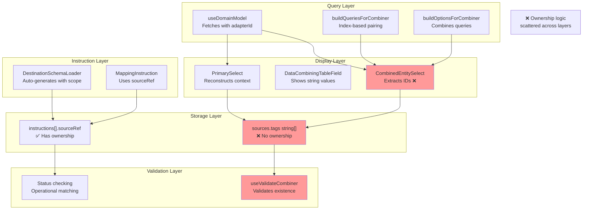

### Problem: Multiple Sources of Truth

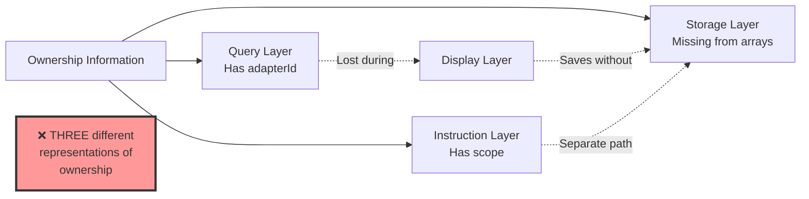

## Detailed Analysis by Layer

### 1. Query Layer: Has Context But Doesn't Enforce

**Files:**

- `useDomainModel.ts:24-85`
- `combining.utils.ts:26-69, 71-101`

**Responsibilities:**

- ✅ Fetch data from multiple adapters
- ✅ Track `adapterId` with each entity
- ✅ Return `DomainModel<T>` with full context
- ❌ **Doesn't enforce** that consumers preserve this context

**Current Implementation:**

```typescript
// useDomainModel.ts
export interface DomainModel<T> extends DataIdentifierReference {
  adapterId: string // ✅ Context provided
  node?: T
}

// Returns full context
const { data: options } = useDomainModel(DomainModelTypeEnum.tag)
// options: DomainModel<Tag>[] with adapterId
```

**Problem:** Query layer provides ownership context, but has no control over what happens next.

**Coupling Issues:**

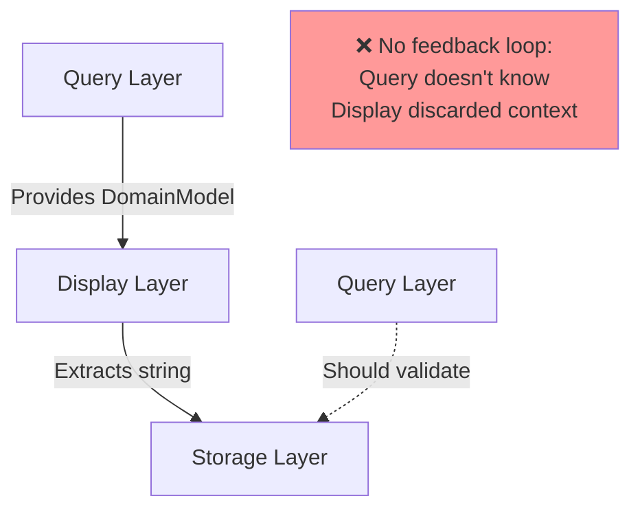

### 2. Display Layer: Transformation Without Preservation

**Files:**

- `CombinedEntitySelect.tsx:45-82`
- `DataCombiningEditorField.tsx:96-136`
- `DataCombiningTableField.tsx:44-57`
- `PrimarySelect.tsx:24-49`

**Current Responsibilities:**

- ✅ Present options to user
- ✅ Handle user selection
- ❌ **Transform** full context to partial data
- ❌ **Reconstruct** context from partial data

**The Transformation Problem:**

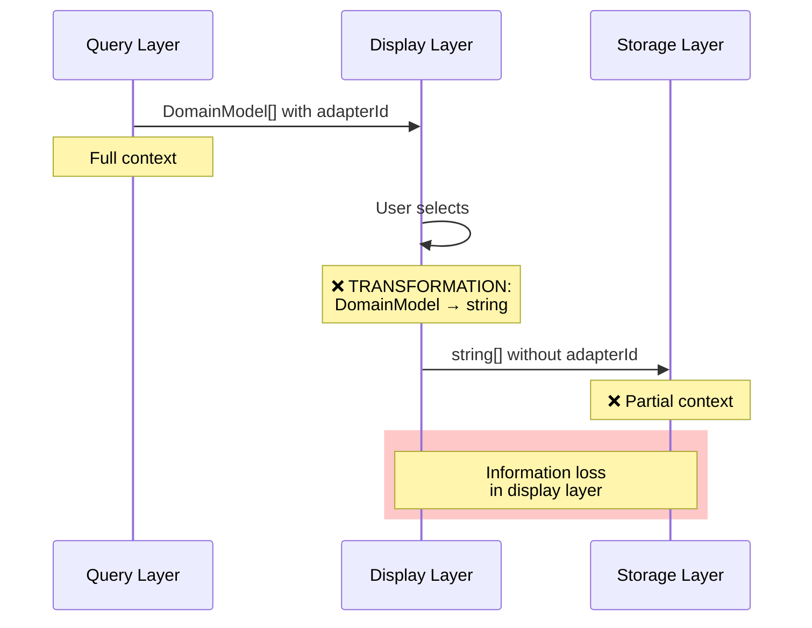

**Code Example - The Transformation:**

```typescript
// CombinedEntitySelect.tsx:45-82
const CombinedEntitySelect: FC<Props> = ({ value, onChange }) => {
  // Receives full context from query layer
  const options = useMemo(() => {
    return buildOptionsForCombiner(domainTagQueries)
    // Returns: DomainModel<Tag>[] with adapterId ✅
  }, [domainTagQueries])

  // ❌ LOSES CONTEXT HERE
  const handleOnChange = useCallback(
    (value: MultiValue<DomainModel<unknown>>) => {
      onChange?.(
        value.map((val) => val.id)  // ❌ Transformation: Object → String
      )
    },
    [onChange]
  )

  return <Select options={options} onChange={handleOnChange} />
}
```

**Why This is Problematic:**

1. **Display has too much power:** Can arbitrarily transform data structure
2. **No type enforcement:** Nothing prevents extracting only partial data
3. **Silent data loss:** No warning that context is being discarded
4. **Reconstruction burden:** Other components must rebuild what was lost

**The Reconstruction Problem:**

```typescript
// PrimarySelect.tsx:24-49
const PrimarySelect: FC<Props> = ({ value }) => {
  // Must reconstruct context from other sources
  const { data: options } = useDomainModel(DomainModelTypeEnum.tag)

  // If value is just a string "tag1", how do we know which adapter?
  // Must query ALL adapters to find it
  const displayValue = options?.find((opt) => opt.id === value)

  // ❌ Inefficient: O(n) search across all adapters
  // ❌ Ambiguous: Multiple adapters might have same ID
}
```

### 3. Storage Layer: Dual Representation

**Files:**

- `DataCombining.ts:1-47`
- Form state in React Hook Form

**Current Responsibilities:**

- ❌ Store **TWO representations** of same data:
  - `sources.tags[]` - Partial (strings)
  - `instructions[].sourceRef` - Complete (with scope)
- ❌ Keep them synchronized
- ❌ Handle migration between formats

**Dual Representation Diagram:**

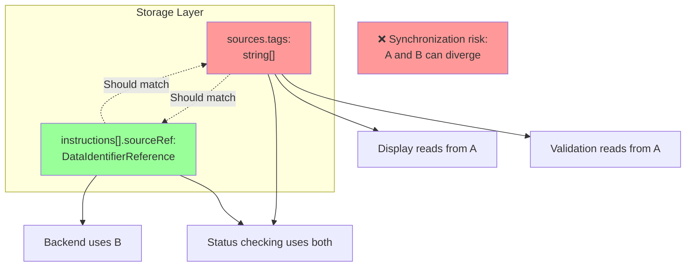

**Synchronization Problems:**

```typescript
// Scenario: Instructions updated but arrays not synced
{
  sources: {
    tags: ["tag1", "tag3"]  // ❌ Out of date
  },
  instructions: [
    {
      sourceRef: { id: "adapter1", type: "adapter", scope: "adapter1" },
      sourcePath: ["tag2"],  // ✅ Updated to tag2, not tag1
      // ...
    }
  ]
}

// Now display shows "tag1" but instructions reference "tag2"
// ❌ INCONSISTENT STATE
```

### 4. Validation Layer: Incomplete Information

**Files:**

- `useValidateCombiner.ts:149-175, 238-260`
- `status-adapter-edge-operational.utils.ts`

**Current Responsibilities:**

- ✅ Validate tag existence
- ❌ **Cannot validate ownership** (missing context)
- ✅ Validate instruction structure
- ⚠️ **Different logic** for tags vs. instructions

**Validation Split:**

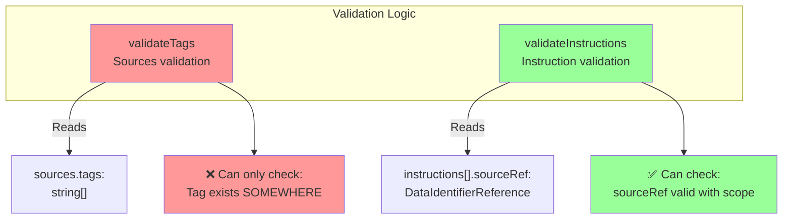

**Code Example - Incomplete Validation:**

```typescript
// useValidateCombiner.ts:149-175
const validateTags = (tags: string[], domainEntities: DomainModel<Tag>[]) => {
  return tags.every(
    (tag) => domainEntities.some((entity) => entity.id === tag)
    // ❌ Can only check ID match
    // ❌ Cannot verify: entity.adapterId === correctAdapter
    //    because tag is just a string, no adapter info
  )
}

const validateInstructions = (instructions: Instruction[], domainEntities: DomainModel<Tag>[]) => {
  return instructions.every((inst) =>
    domainEntities.some(
      (entity) => entity.id === inst.sourceRef?.id && entity.adapterId === inst.sourceRef?.scope // ✅ Can validate ownership
    )
  )
}
```

**Problem:** Two different validation strategies for logically related data.

### 5. Instruction Layer: Does It Right

**Files:**

- `DestinationSchemaLoader.tsx:87-103`
- `MappingInstruction.tsx:49, 85-92`

**Responsibilities:**

- ✅ Auto-generate instructions with full context
- ✅ Store complete `DataIdentifierReference` with scope
- ✅ Display with full ownership information

**What This Layer Gets Right:**

```typescript
// DestinationSchemaLoader.tsx:87-103
const instructionsFromDestinationSchema = useMemo(() => {
  const instructions: InstructionType[] = []

  destinationSchema.forEach((element) => {
    const sourceRef: DataIdentifierReference = {
      id: element.adapter || firstAdapter,
      type: 'adapter',
      // ✅ Scope included from the start
    }

    instructions.push({
      sourceRef, // ✅ Full reference, no transformation
      sourcePath: [element.tag],
      destinationPath: [element.name],
    })
  })

  return instructions
}, [destinationSchema, firstAdapter])
```

**Why This Works:**

- ✅ **No transformation:** Query → Storage preserves full context
- ✅ **Single representation:** One source of truth
- ✅ **Type enforced:** `DataIdentifierReference` required
- ✅ **Validation works:** Has all needed information

## Risk Analysis: Distributed Logic

### Risk 1: Logic Duplication

**Current State:**
Multiple components implement similar ownership logic:

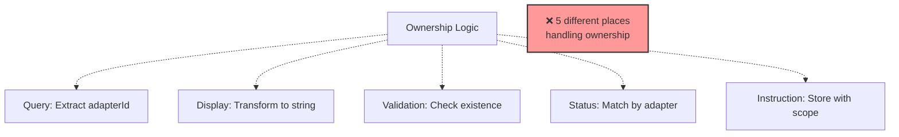

**Examples:**

```typescript
// 1. Query layer - combining.utils.ts:26-69
const adapterId = queryData?.[0]?.adapterId // Extract from first item

// 2. Display layer - CombinedEntitySelect.tsx:45-82
const handleOnChange = (value) => {
  onChange?.(value.map((val) => val.id)) // Extract ID only
}

// 3. Validation layer - useValidateCombiner.ts:149-175
const validateTags = (tags, entities) => {
  return tags.every((tag) => entities.some((e) => e.id === tag)) // Match by ID
}

// 4. Status layer - status-adapter-edge-operational.utils.ts
const matchByAdapter = (sources, operational) => {
  // Match using both sources.tags and instructions
}

// 5. Instruction layer - DestinationSchemaLoader.tsx:87-103
const sourceRef = { id: adapter, type: 'adapter' } // Build reference
```

**Problem:** Changes to ownership model require updates in 5+ places.

### Risk 2: Inconsistent Behavior

**Different layers handle ownership differently:**

| Layer                     | Ownership Representation | Validation Strategy |
| ------------------------- | ------------------------ | ------------------- |
| Query                     | `adapterId` field        | ✅ Full context     |
| Display                   | Extracted `id` only      | ❌ Context lost     |
| Storage (tags)            | `string`                 | ❌ No context       |
| Storage (instructions)    | `scope` field            | ✅ Full context     |
| Validation (tags)         | ID match only            | ⚠️ Partial          |
| Validation (instructions) | ID + scope match         | ✅ Complete         |

**Example Inconsistency:**

```typescript
// Scenario: Two adapters have tag with same ID
const adapter1Tags = [{ adapterId: "adapter1", id: "temperature", ... }]
const adapter2Tags = [{ adapterId: "adapter2", id: "temperature", ... }]

// User selects "temperature" from adapter1
// Display stores: "temperature"  ❌ Which adapter?

// Validation checks: Does "temperature" exist in ANY adapter?
// Result: ✅ Valid (finds it in both adapters)

// Actual intent: Should be adapter1's temperature
// ❌ FALSE POSITIVE - Validated wrong tag
```

### Risk 3: Brittle Refactoring

**Tight coupling between layers:**

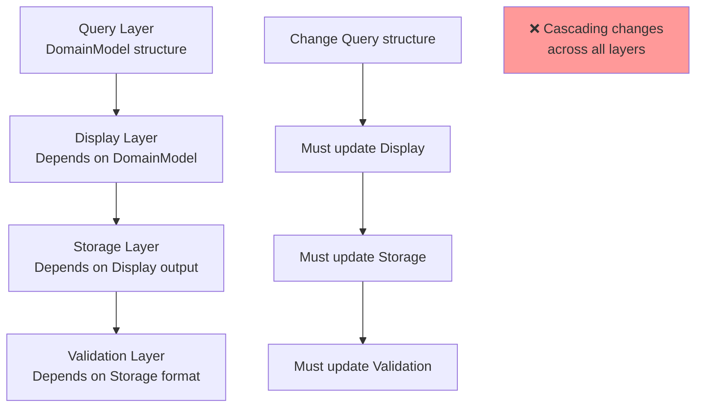

**Example Refactoring Challenge:**

```typescript
// If we change DomainModel structure:
interface DomainModel<T> {
  adapterId: string // ❌ Change to: adapterIdentifier
  id: string
  type: string
  node?: T
}

// Must update:
// 1. buildOptionsForCombiner - Extract from queryData
// 2. CombinedEntitySelect - Read from options
// 3. DataCombiningEditorField - Handle onChange
// 4. PrimarySelect - Reconstruct context
// 5. useValidateCombiner - Match logic
// 6. Status checking - Operational matching

// ❌ 6+ files affected by single field rename
```

### Risk 4: Testing Complexity

**Must test coordination between layers:**

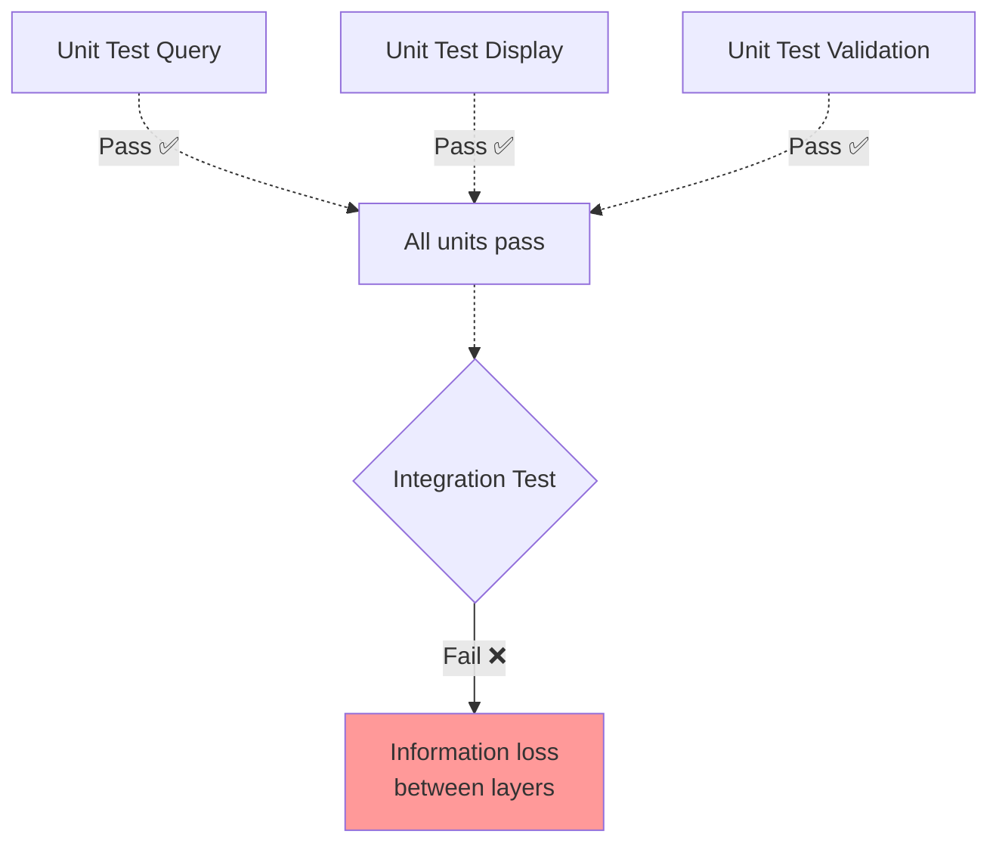

**Testing Burden:**

```typescript
// Must test:
// 1. Query returns correct data ✅
// 2. Display handles query data ✅
// 3. Display transforms correctly ⚠️
// 4. Storage receives correct format ⚠️
// 5. Validation reads storage ✅
// 6. Validation logic is correct ✅
// 7. Query → Display → Storage → Validation (INTEGRATION) ❌

// Steps 3, 4, 7 are where bugs hide
```

### Risk 5: Knowledge Distribution

**Understanding requires knowledge of multiple layers:**

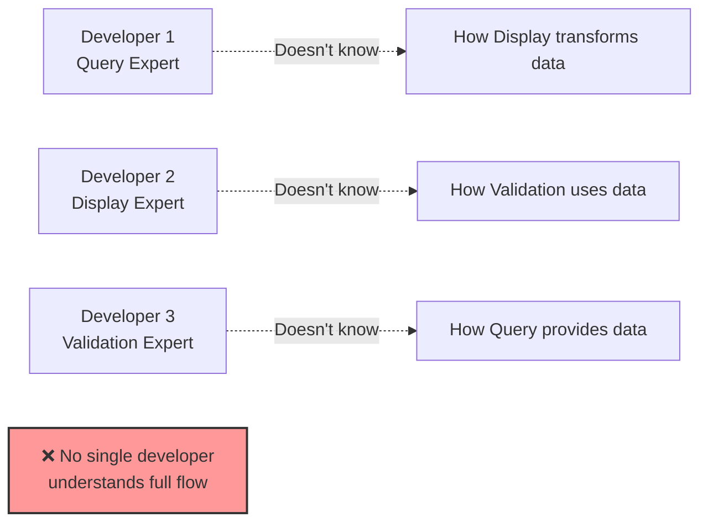

**Documentation Burden:**

- Each layer must document its expectations
- Interfaces become implicit contracts
- Changes require cross-team coordination

## Proper Separation of Concerns

### Ideal Architecture

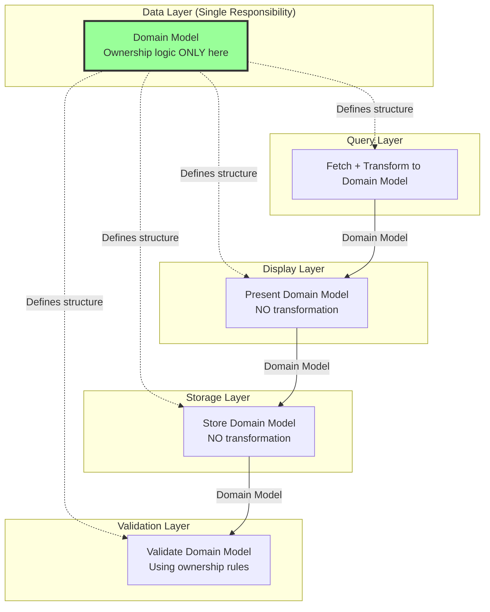

### Principle: Data Preservation Through Layers

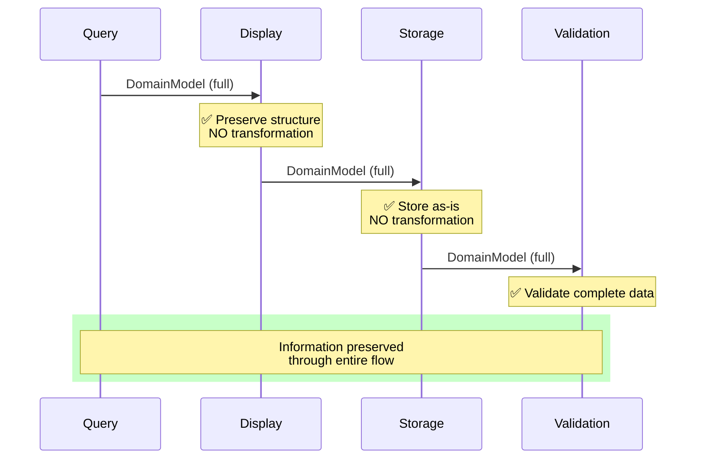

### Clear Responsibilities

| Layer           | Should Do                         | Should NOT Do                        |
| --------------- | --------------------------------- | ------------------------------------ |
| **Query**       | Fetch data, build DomainModel     | ❌ Know about display/validation     |
| **Display**     | Present DomainModel to user       | ❌ Transform or extract fields       |
| **Storage**     | Store DomainModel as-is           | ❌ Maintain multiple representations |
| **Validation**  | Validate DomainModel fields       | ❌ Reconstruct missing data          |
| **Instruction** | Generate instructions from schema | ❌ Duplicate storage logic           |

## How Each Solution Affects Separation of Concerns

### Option A: Upgrade Arrays to DataIdentifierReference[]

**Impact on Separation:**

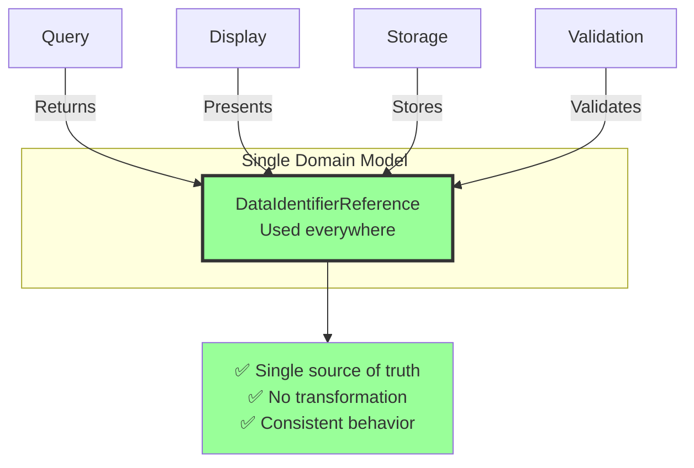

**Benefits:**

- ✅ **Single representation** throughout entire flow
- ✅ **No transformation** between layers
- ✅ **Type enforcement** prevents information loss
- ✅ **Consistent validation** for all data
- ✅ **Easy testing** - Same structure everywhere

**Code Example:**

```typescript
// Query Layer
const { data: options }: DomainModel<Tag>[] = useDomainModel()

// Display Layer
const handleOnChange = (value: MultiValue<DomainModel<Tag>>) => {
  onChange?.(
    value.map(v => ({
      id: v.id,
      type: v.type,
      scope: v.adapterId  // ✅ Preserve full structure
    }))
  )
}

// Storage Layer
sources: {
  tags: DataIdentifierReference[]  // ✅ Same structure as input
}

// Validation Layer
const validateTags = (
  tags: DataIdentifierReference[],  // ✅ Complete data
  entities: DomainModel<Tag>[]
) => {
  return tags.every(tag =>
    entities.some(e =>
      e.id === tag.id &&
      e.adapterId === tag.scope  // ✅ Can validate ownership
    )
  )
}
```

### Option B: Remove Arrays, Use Only Instructions

**Impact on Separation:**

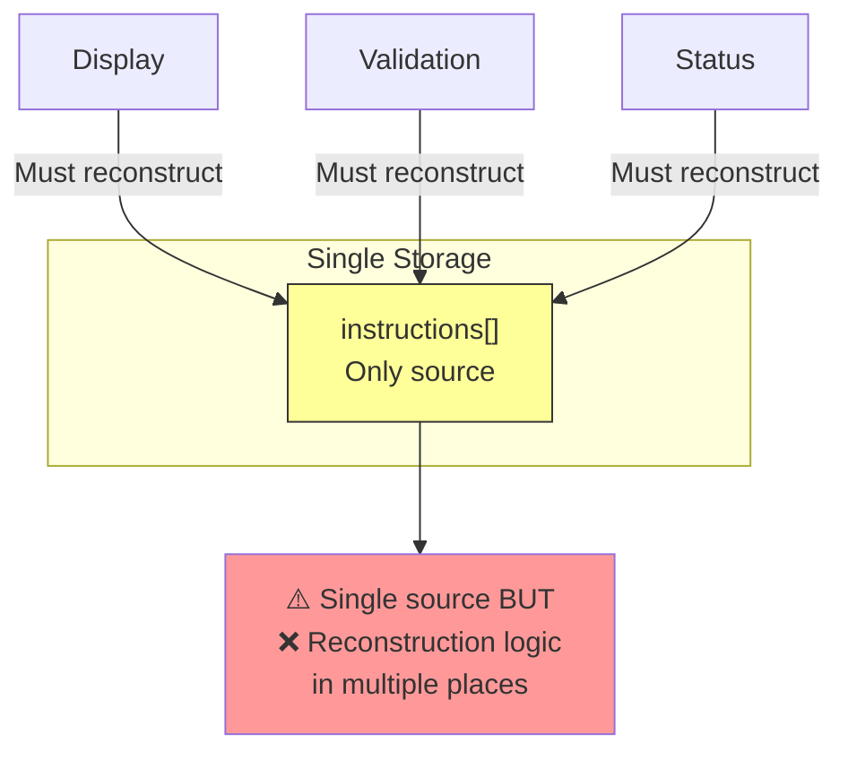

**Problems:**

- ❌ **Reconstruction logic duplicated** in display, validation, status
- ❌ **Violates DRY principle** - Same extraction code everywhere
- ❌ **Display layer does business logic** - Reconstructing from instructions
- ❌ **Cannot migrate** - Breaks separation completely for old data

### Option C: Arrays as Display-Only

**Impact on Separation:**

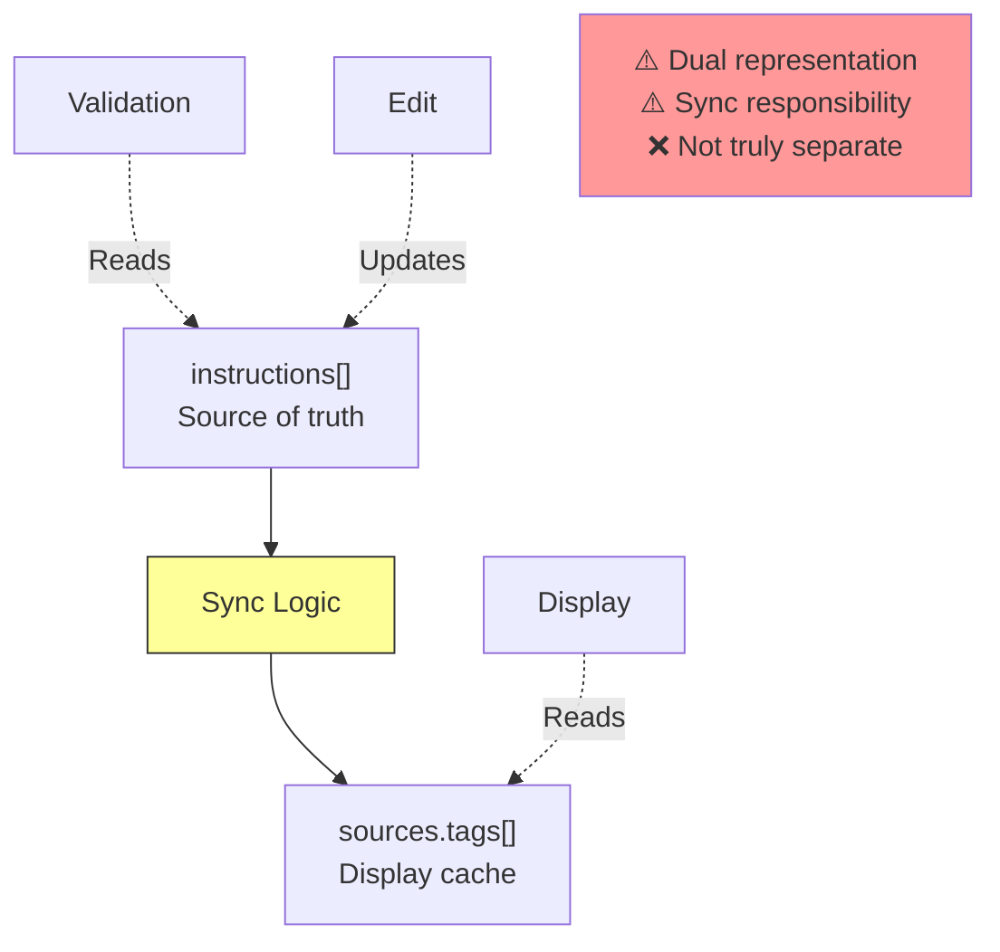

**Problems:**

- ⚠️ **Sync logic is a new concern** - Where does it live?
- ⚠️ **Display vs. Validation use different sources** - Inconsistency risk
- ⚠️ **Arrays become "cache"** - Cache invalidation is hard
- ❌ **Violates single responsibility** - Sync logic touches multiple layers

### Option D: Parallel Arrays with Ownership

**Impact on Separation:**

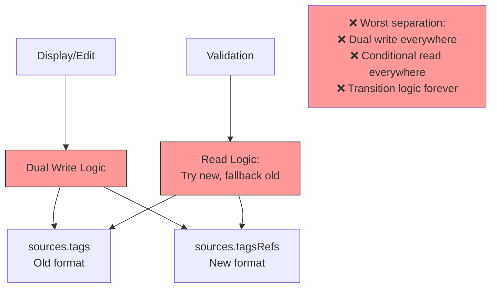

**Problems:**

- ❌ **Every layer must know about both formats**
- ❌ **Dual write logic scattered** across components
- ❌ **Validation becomes complex** - Check which format to use
- ❌ **Technical debt increases** - More distributed logic
- ❌ **Cleanup phase may never happen** - Forever maintaining both

### Option E: Runtime Reconstruction

**Impact on Separation:**

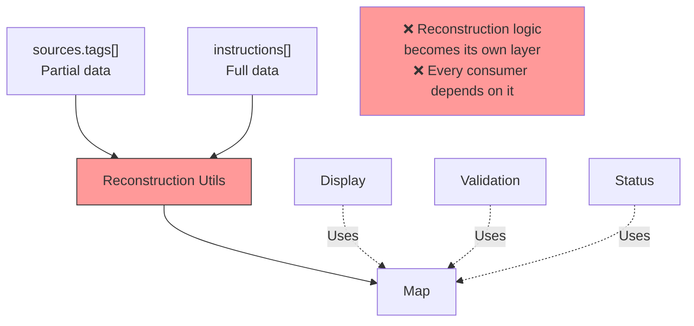

**Problems:**

- ❌ **New intermediary layer** - Reconstruction becomes a concern
- ❌ **Performance overhead** - Build map on every render
- ❌ **Implicit dependency** - Every component needs reconstruction
- ❌ **Workaround becomes architecture** - Temporary fix becomes permanent
- ❌ **Doesn't fix root cause** - Information still lost, just reconstructed

## Recommendations

### 1. Choose Option A for Proper Separation

**Reasoning:**

- ✅ Single domain model throughout all layers
- ✅ No transformation or reconstruction
- ✅ Each layer has clear, single responsibility
- ✅ Type system enforces proper separation
- ✅ Easy to understand and maintain

### 2. Establish Clear Boundaries

```typescript
// Define domain model at top level
// All layers MUST use this exact structure
export interface DataIdentifierReference {
  id: string
  type: 'adapter' | 'tag' | 'metric' | 'behavior'
  scope: string // Ownership
}

// Query Layer: Build domain model
export function useDomainModel(): DomainModel<T>[] {
  // Fetch and transform TO domain model
  // NO other layer should do this transformation
}

// Display Layer: Present domain model
export function CombinedEntitySelect({
  onChange,
}: {
  onChange: (value: DataIdentifierReference[]) => void // ✅ Type enforced
}) {
  // Present options, return SAME structure
  // NO transformation allowed
}

// Storage Layer: Store domain model
export interface Sources {
  tags?: DataIdentifierReference[] // ✅ Exact same structure
}

// Validation Layer: Validate domain model
export function validateTags(
  tags: DataIdentifierReference[], // ✅ Complete data
  entities: DomainModel<T>[]
): boolean {
  // Validate with full context
  // NO reconstruction needed
}
```

### 3. Enforce with TypeScript

```typescript
// Make transformation impossible
type PreserveStructure<T> = T extends DataIdentifierReference
  ? DataIdentifierReference // ✅ Must return same structure
  : never

// Use in components
function CombinedEntitySelect<T extends DataIdentifierReference>({
  value,
  onChange,
}: {
  value?: T[]
  onChange?: (value: PreserveStructure<T>[]) => void // ✅ Enforced
}) {
  // TypeScript prevents returning different structure
}
```

### 4. Single Point of Transformation

**Only ONE place should transform data: Query Layer**

```typescript
// ONLY useDomainModel should do this:
const domainModel = rawApiData.map((item) => ({
  id: item.id,
  type: item.type,
  scope: item.adapterId, // ✅ Transform once, here only
  adapterId: item.adapterId,
  node: item,
}))

// After this, NO other layer transforms
// Everyone uses DomainModel / DataIdentifierReference as-is
```

## Summary: Risks of Distributed Logic

| Risk                       | Current State          | Option A                 | Other Options     |
| -------------------------- | ---------------------- | ------------------------ | ----------------- |
| **Logic Duplication**      | 🔴 5+ places           | ✅ 1 place               | 🔴 More places    |
| **Inconsistent Behavior**  | 🔴 Different per layer | ✅ Consistent            | ⚠️ More complex   |
| **Brittle Refactoring**    | 🔴 Cascading changes   | ✅ Isolated              | 🔴 More cascading |
| **Testing Complexity**     | 🔴 Integration issues  | ✅ Unit tests sufficient | 🔴 Worse          |
| **Knowledge Distribution** | 🔴 No single owner     | ✅ Clear structure       | 🔴 More confusion |
| **Maintainability**        | 🔴 Hard to change      | ✅ Easy to change        | 🔴 Harder         |

**Conclusion:** Option A (Upgrade Arrays to DataIdentifierReference[]) is the only solution that properly addresses separation of concerns by establishing a single domain model used consistently throughout all layers.
