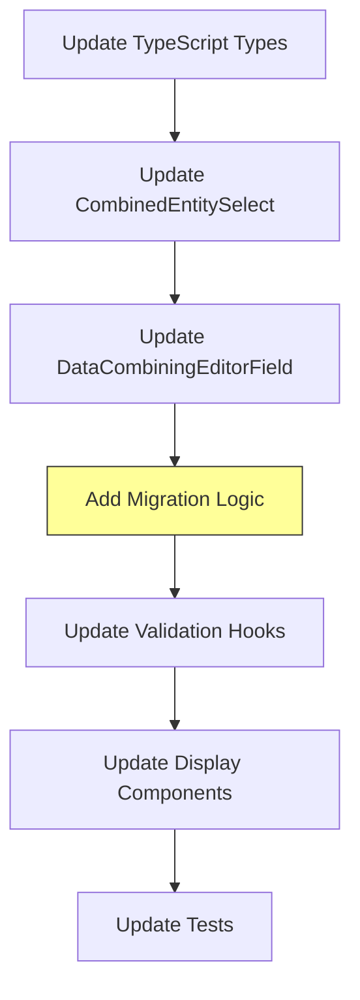
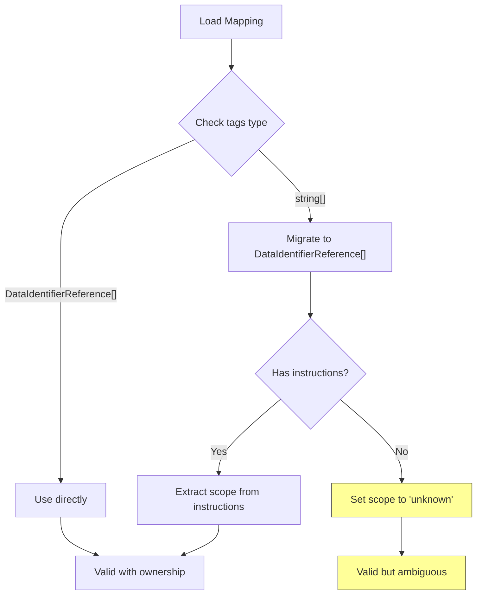
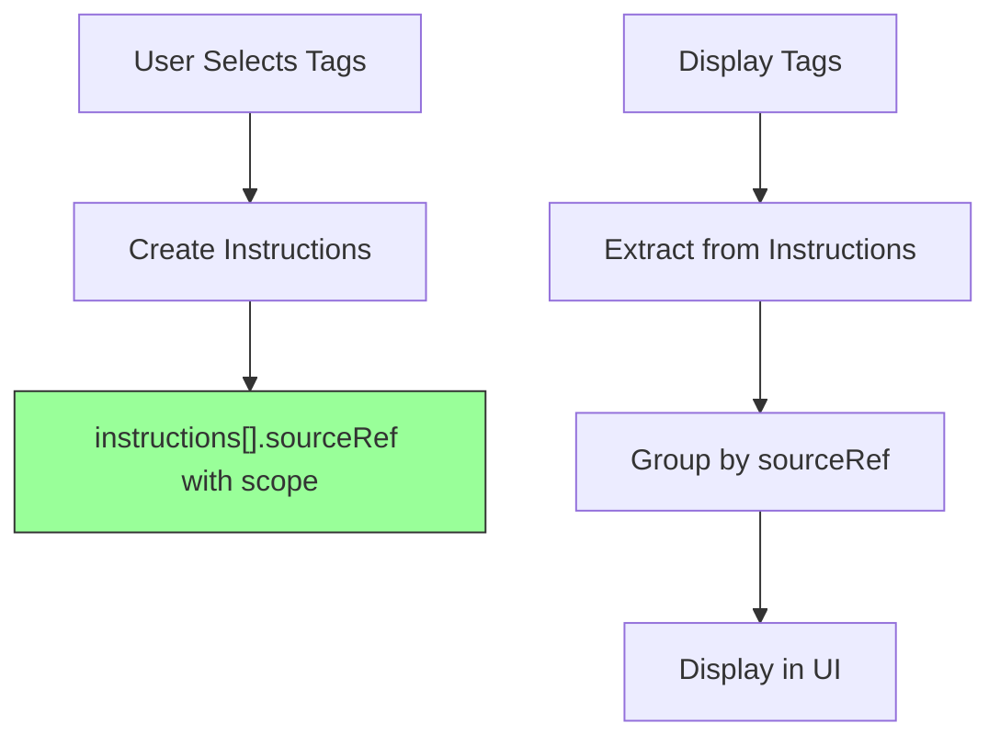
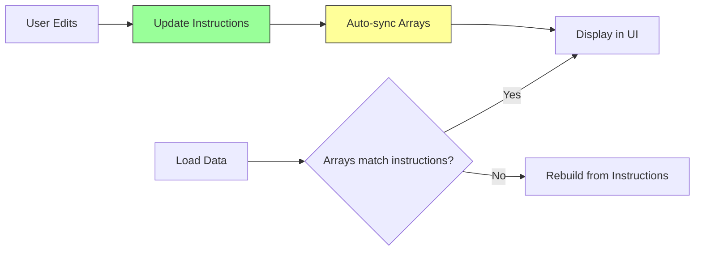
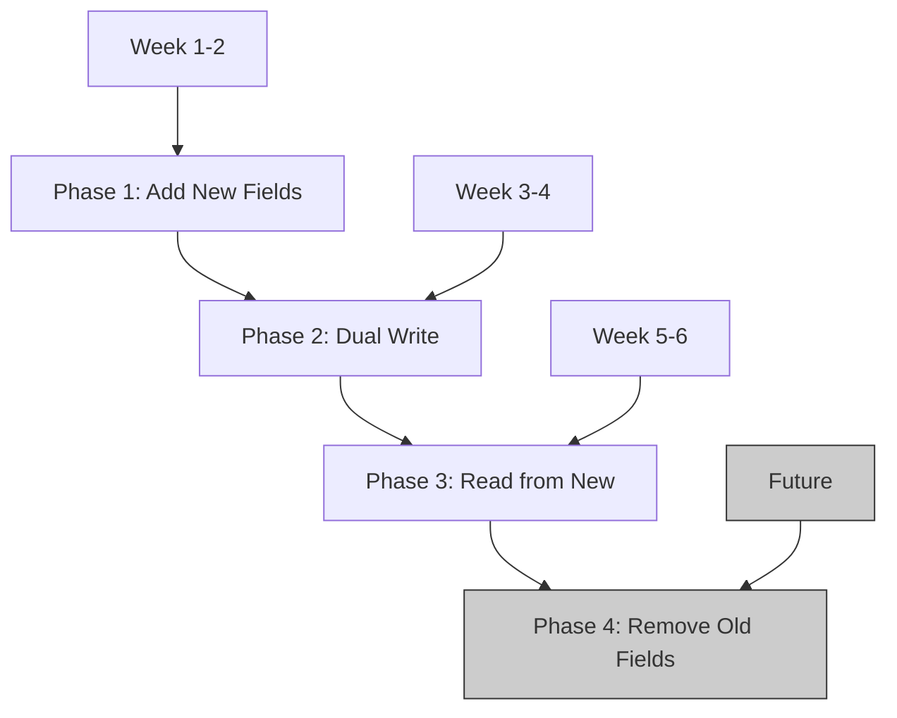
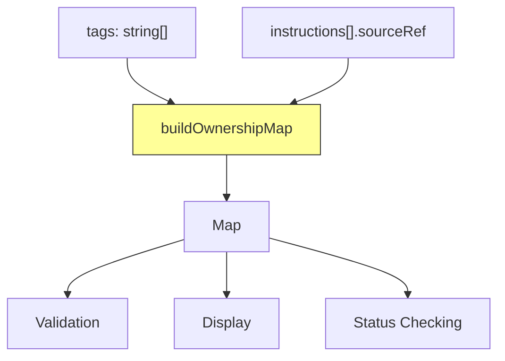

# Solution Options Analysis

## Constraints

Based on task requirements and business reality:

| Constraint                            | Priority    | Details                                                                                            | Impact                         |
| ------------------------------------- | ----------- | -------------------------------------------------------------------------------------------------- | ------------------------------ |
| **No On-Premises Customer Migration** | 🔴 CRITICAL | **Blocking:** Cost of coordinating schema upgrades across on-premises installations is prohibitive | **Option A blocked**           |
| **Backward Compatibility**            | 🔴 CRITICAL | Must preserve existing mappings, graceful degradation                                              | All options must support       |
| **Proportionate Frontend Changes**    | 🟡 HIGH     | Effort must match benefit (~15-20 hours reasonable)                                                | Eliminates high-effort options |
| **Clean Solution**                    | 🟡 HIGH     | Avoid workarounds where possible, but pragmatic compromises acceptable                             | Prefer clean, accept pragmatic |

**Note:** The on-premises customer migration constraint makes **Option A (Upgrade Arrays)** the ideal long-term solution but **not currently viable**. This analysis identifies **Option H (Current Implementation)** as the pragmatic solution that provides a migration path toward Option A in the future.

## Option A: Upgrade Arrays to DataIdentifierReference[]

### Description

Change `sources.tags` and `sources.topicFilters` from `string[]` to `DataIdentifierReference[]`.

```typescript
// Current (broken)
export interface DataCombining {
  sources: {
    primary?: DataIdentifierReference
    tags?: string[] // ❌
    topicFilters?: string[] // ❌
  }
}

// Option A (proposed)
export interface DataCombining {
  sources: {
    primary?: DataIdentifierReference
    tags?: DataIdentifierReference[] // ✅
    topicFilters?: DataIdentifierReference[] // ✅
  }
}
```

### Implementation Flow



### Changes Required

#### 1. Type Updates

**File:** `src/api/__generated__/models/DataCombining.ts`

```typescript
sources: {
  primary?: DataIdentifierReference;
  tags?: DataIdentifierReference[];       // Change from string[]
  topicFilters?: DataIdentifierReference[]; // Change from string[]
}
```

#### 2. Component Updates

**CombinedEntitySelect.tsx:45-82**

```typescript
// Before
const handleOnChange = (value: MultiValue<DomainModel<unknown>>) => {
  onChange?.(value.map((val) => val.id)) // ❌ Loses adapterId
}

// After
const handleOnChange = (value: MultiValue<DomainModel<unknown>>) => {
  onChange?.(
    value.map((val) => ({
      id: val.id,
      type: val.type,
      scope: val.adapterId, // ✅ Preserve ownership
    }))
  )
}
```

**DataCombiningEditorField.tsx:96-136**

```typescript
// Before
setValue('sources', {
  primary,
  tags, // string[]
  topicFilters, // string[]
})

// After
setValue('sources', {
  primary,
  tags, // DataIdentifierReference[]
  topicFilters, // DataIdentifierReference[]
})
```

#### 3. Migration Logic

```typescript
// In form initialization or data loading
const migrateSources = (sources: Sources): Sources => {
  return {
    ...sources,
    tags: sources.tags?.map((tag) =>
      typeof tag === 'string'
        ? { id: tag, type: 'tag', scope: 'unknown' } // ⚠️ Scope unknown
        : tag
    ),
    topicFilters: sources.topicFilters?.map((filter) =>
      typeof filter === 'string'
        ? { id: filter, type: 'tag', scope: 'unknown' } // ⚠️ Scope unknown
        : filter
    ),
  }
}
```

#### 4. Validation Updates

**useValidateCombiner.ts:149-175**

```typescript
// Before
const validateTags = (tags: string[], domainEntities: DomainModel<Tag>[]) => {
  return tags.every((tag) => domainEntities.some((entity) => entity.id === tag))
}

// After
const validateTags = (tags: DataIdentifierReference[], domainEntities: DomainModel<Tag>[]) => {
  return tags.every((tag) =>
    domainEntities.some(
      (entity) => entity.id === tag.id && entity.adapterId === tag.scope // ✅ Validate ownership
    )
  )
}
```

#### 5. Display Updates

**DataCombiningTableField.tsx:44-57**

- Update to display full references
- Show adapter information in UI

### Effort Estimation

| Task                        | Effort       | Complexity  |
| --------------------------- | ------------ | ----------- |
| Type definition changes     | 1 hour       | Low         |
| Component updates (3 files) | 4 hours      | Medium      |
| Migration logic             | 3 hours      | Medium-High |
| Validation updates          | 2 hours      | Medium      |
| Display component updates   | 2 hours      | Low         |
| Testing & debugging         | 4 hours      | Medium      |
| **TOTAL**                   | **16 hours** | **Medium**  |

### Pros

- ✅ **Clean solution** - Consistent type system
- ✅ **Full ownership tracking** - No information loss
- ✅ **Type safety** - Compiler enforces correct usage
- ✅ **Future-proof** - Aligns with architecture direction
- ✅ **No backend changes** - Frontend-only

### Cons

- ❌ **Migration complexity** - Must handle old string arrays
- ⚠️ **Scope ambiguity** - Old data has unknown scope
- ⚠️ **Testing burden** - Must test both old and new formats
- ⚠️ **Multiple file changes** - Medium refactoring scope

### Backward Compatibility Strategy



**Migration Issues:**

1. **Old mappings without instructions:** Cannot determine scope → set to 'unknown'
2. **Scope reconstruction:** Must cross-reference with instructions to extract adapter IDs
3. **Validation bypass:** May need to allow 'unknown' scope during transition

### Risk Assessment

| Risk                      | Likelihood | Impact | Mitigation                                  |
| ------------------------- | ---------- | ------ | ------------------------------------------- |
| Lost scope for old data   | High       | Medium | Accept 'unknown' scope, document limitation |
| Type errors in components | Medium     | Low    | TypeScript catches at compile time          |
| Display issues            | Low        | Low    | Test with old and new data                  |
| Validation failures       | Medium     | Medium | Graceful handling of 'unknown' scope        |

---

## Option B: Remove Arrays, Use Only Instructions

### Description

Remove redundant `tags[]` and `topicFilters[]` arrays. Use `instructions[]` as single source of truth. Reconstruct display from instructions.

```typescript
// Current
export interface DataCombining {
  sources: {
    primary?: DataIdentifierReference
    tags?: string[] // ❌ Remove
    topicFilters?: string[] // ❌ Remove
  }
  instructions?: Instruction[]
}

// Option B (proposed)
export interface DataCombining {
  sources: {
    primary?: DataIdentifierReference
    // tags and topicFilters removed
  }
  instructions?: Instruction[] // ✅ Single source of truth
}
```

### Architecture



### Changes Required

#### 1. Remove Array Fields

- Remove `sources.tags` and `sources.topicFilters` from type definition
- ⚠️ **BREAKS BACKWARD COMPATIBILITY** - Old mappings have these fields

#### 2. Reconstruction Logic

```typescript
const extractTagsFromInstructions = (instructions?: Instruction[]): DataIdentifierReference[] => {
  return instructions?.map((inst) => inst.sourceRef).filter((ref) => ref?.type === 'tag') ?? []
}

const extractTopicFiltersFromInstructions = (instructions?: Instruction[]): DataIdentifierReference[] => {
  return instructions?.map((inst) => inst.sourceRef).filter((ref) => ref?.type === 'topic-filter') ?? []
}
```

#### 3. Display Components

Must reconstruct tags/filters on every render:

```typescript
const displayTags = useMemo(() => {
  return extractTagsFromInstructions(mapping.instructions)
}, [mapping.instructions])
```

#### 4. Migration Strategy

**Critical Issue:** Existing mappings have `sources.tags` but may not have corresponding instructions.

```typescript
const migrateToInstructionsOnly = (mapping: DataCombining): DataCombining => {
  const { sources, instructions = [] } = mapping

  // Generate instructions from old arrays
  const tagInstructions = sources.tags?.map((tag) => ({
    sourceRef: {
      id: tag,
      type: 'tag',
      scope: 'unknown', // ⚠️ Cannot determine
    },
    sourcePath: ['value'],
    destinationPath: [
      /* ??? */
    ], // ❌ Cannot determine
  }))

  return {
    sources: { primary: sources.primary },
    instructions: [...instructions, ...(tagInstructions ?? [])],
  }
}
```

**Problem:** Cannot generate valid instructions without destination information.

### Effort Estimation

| Task                    | Effort       | Complexity    |
| ----------------------- | ------------ | ------------- |
| Type definition changes | 1 hour       | Low           |
| Reconstruction logic    | 6 hours      | High          |
| Component refactoring   | 8 hours      | High          |
| Migration logic         | 10 hours     | **Very High** |
| Validation updates      | 4 hours      | High          |
| Testing & debugging     | 8 hours      | High          |
| **TOTAL**               | **37 hours** | **High**      |

### Pros

- ✅ **Single source of truth** - No duplication
- ✅ **Clean architecture** - Eliminates redundancy
- ✅ **Full ownership** - Instructions have scope

### Cons

- ❌ **BREAKS BACKWARD COMPATIBILITY** - Removes fields
- ❌ **High complexity** - Reconstruction logic everywhere
- ❌ **Performance impact** - Recompute on every render
- ❌ **Migration impossible** - Cannot generate valid instructions from old data
- ❌ **High effort** - 37 hours of work
- ❌ **Violates "clean solution" constraint** - Reconstruction is a workaround

### Risk Assessment

| Risk                    | Likelihood    | Impact       | Mitigation           |
| ----------------------- | ------------- | ------------ | -------------------- |
| Cannot migrate old data | **Very High** | **Critical** | ❌ **BLOCKING**      |
| Performance degradation | High          | Medium       | Memoization, caching |
| Display bugs            | High          | High         | Extensive testing    |
| Complex debugging       | High          | Medium       | Better logging       |

### Recommendation

**❌ NOT VIABLE** - Cannot migrate existing mappings without destination path information.

---

## Option C: Arrays as Display-Only, Instructions as Source

### Description

Keep `tags[]` and `topicFilters[]` as **derived/display state**, auto-synchronized from `instructions[]`. Instructions remain source of truth.



### Implementation

#### 1. Sync Logic

```typescript
const syncArraysFromInstructions = (instructions?: Instruction[]): { tags: string[]; topicFilters: string[] } => {
  const tags: string[] = []
  const topicFilters: string[] = []

  instructions?.forEach((inst) => {
    if (inst.sourceRef?.type === 'tag') {
      tags.push(inst.sourceRef.id)
    } else if (inst.sourceRef?.type === 'topic-filter') {
      topicFilters.push(inst.sourceRef.id)
    }
  })

  return { tags, topicFilters }
}
```

#### 2. Auto-sync Hook

```typescript
useEffect(() => {
  const synced = syncArraysFromInstructions(formData.instructions)

  // Only update if changed
  if (!isEqual(formData.sources.tags, synced.tags)) {
    setValue('sources.tags', synced.tags, { shouldDirty: false })
  }
  if (!isEqual(formData.sources.topicFilters, synced.topicFilters)) {
    setValue('sources.topicFilters', synced.topicFilters, { shouldDirty: false })
  }
}, [formData.instructions])
```

#### 3. Read-Only Enforcement

```typescript
// Make arrays read-only in UI
<DataCombiningTableField
  value={sources.tags}
  readOnly={true}  // Derived from instructions
/>

// Editing updates instructions, not arrays directly
<InstructionEditor
  onChange={(insts) => {
    setValue('instructions', insts)
    // Auto-sync will update arrays
  }}
/>
```

### Changes Required

| Component                | Change                         | Effort  |
| ------------------------ | ------------------------------ | ------- |
| DataCombiningEditorField | Remove direct array editing    | 2 hours |
| Form initialization      | Add sync logic                 | 2 hours |
| Validation               | Check instructions, not arrays | 2 hours |
| Display components       | Mark as read-only              | 1 hour  |
| Testing                  | Test sync behavior             | 3 hours |

### Effort Estimation

| Task                      | Effort       | Complexity |
| ------------------------- | ------------ | ---------- |
| Sync logic implementation | 3 hours      | Medium     |
| Hook integration          | 2 hours      | Low        |
| Component updates         | 4 hours      | Medium     |
| Validation changes        | 2 hours      | Low        |
| Testing & debugging       | 4 hours      | Medium     |
| **TOTAL**                 | **15 hours** | **Medium** |

### Pros

- ✅ **Backward compatible** - Arrays still exist
- ✅ **Clear separation** - Instructions = truth, arrays = display
- ✅ **No information loss** - Scope in instructions
- ✅ **Proportionate effort** - 15 hours

### Cons

- ⚠️ **Dual representation** - Still have duplication
- ⚠️ **Sync complexity** - Must maintain consistency
- ⚠️ **Partial workaround** - Violates "clean solution" constraint
- ⚠️ **Old data ambiguity** - Arrays without instructions still unclear

### Risk Assessment

| Risk           | Likelihood | Impact | Mitigation       |
| -------------- | ---------- | ------ | ---------------- |
| Sync bugs      | Medium     | Medium | Thorough testing |
| Performance    | Low        | Low    | Memoization      |
| User confusion | Low        | Low    | Clear UI labels  |

---

## Option D: Add Parallel Arrays with Ownership

### Description

Add new fields with ownership while keeping old fields for backward compatibility. Gradually migrate.

```typescript
export interface DataCombining {
  sources: {
    primary?: DataIdentifierReference

    // Old fields (deprecated)
    tags?: string[]
    topicFilters?: string[]

    // New fields with ownership
    tagsRefs?: DataIdentifierReference[] // ✅ New
    topicFiltersRefs?: DataIdentifierReference[] // ✅ New
  }
}
```

### Migration Path



### Implementation Phases

#### Phase 1: Add New Fields (Week 1-2)

```typescript
// Update type definition
sources: {
  tags?: string[];                           // Keep for compatibility
  topicFilters?: string[];                   // Keep for compatibility
  tagsRefs?: DataIdentifierReference[];      // Add new
  topicFiltersRefs?: DataIdentifierReference[]; // Add new
}

// Components check both
const getTags = (sources: Sources): DataIdentifierReference[] => {
  if (sources.tagsRefs) {
    return sources.tagsRefs  // ✅ Use new field
  }
  // Fallback to old field
  return sources.tags?.map(tag => ({
    id: tag,
    type: 'tag',
    scope: 'unknown'
  })) ?? []
}
```

#### Phase 2: Dual Write (Week 3-4)

```typescript
const updateSources = (refs: DataIdentifierReference[]) => {
  setValue('sources', {
    tags: refs.map((r) => r.id), // Write to old field
    tagsRefs: refs, // Write to new field
  })
}
```

#### Phase 3: Read from New (Week 5-6)

- Update all components to read from `tagsRefs`
- Keep writing to both fields
- Old field becomes write-only

#### Phase 4: Remove Old Fields (Future)

- After all mappings migrated
- Remove old fields
- Clean up dual-write logic

### Changes Required

| Phase   | Changes                       | Files            |
| ------- | ----------------------------- | ---------------- |
| Phase 1 | Add new types, fallback logic | 3 files, 4 hours |
| Phase 2 | Dual write logic              | 2 files, 2 hours |
| Phase 3 | Update read paths             | 5 files, 4 hours |
| Phase 4 | Cleanup                       | 5 files, 3 hours |

### Effort Estimation

| Phase                  | Effort       | When          |
| ---------------------- | ------------ | ------------- |
| Phase 1: Add fields    | 4 hours      | Now           |
| Phase 2: Dual write    | 2 hours      | Now           |
| Phase 3: Migrate reads | 4 hours      | Later         |
| Phase 4: Cleanup       | 3 hours      | Future        |
| **Total (Now)**        | **6 hours**  | **Immediate** |
| **Total (Eventually)** | **13 hours** | **Over time** |

### Pros

- ✅ **Backward compatible** - Old fields preserved
- ✅ **Gradual migration** - No big-bang change
- ✅ **Low immediate effort** - 6 hours to start
- ✅ **Safe rollback** - Can revert to old fields

### Cons

- ❌ **Technical debt** - Increases duplication
- ❌ **Complex code** - Must handle both paths
- ❌ **Long transition** - 6+ weeks to fully migrate
- ❌ **Cleanup burden** - Phase 4 may never happen
- ❌ **Violates "clean solution"** - More duplication, not less

---

## Option E: Reconstruct Ownership at Runtime

### Description

Keep arrays as strings. Build ownership map from instructions when needed for validation/display.

```typescript
const buildOwnershipMap = (tags: string[], instructions: Instruction[]): Map<string, string> => {
  const map = new Map<string, string>()

  instructions.forEach((inst) => {
    if (inst.sourceRef?.type === 'tag') {
      map.set(inst.sourceRef.id, inst.sourceRef.scope)
    }
  })

  return map
}

// Usage
const validateTag = (tag: string) => {
  const ownershipMap = buildOwnershipMap(sources.tags, instructions)
  const scope = ownershipMap.get(tag) // Look up ownership

  if (!scope) {
    return { valid: false, reason: 'Unknown ownership' }
  }

  // Validate against correct adapter
  return validateTagInAdapter(tag, scope)
}
```

### Architecture



### Changes Required

#### 1. Ownership Map Utilities

```typescript
// src/modules/Mappings/utils/ownership.utils.ts
export const buildOwnershipMap = (
  entities: string[],
  instructions: Instruction[]
): Map<string, DataIdentifierReference> => {
  const map = new Map()

  instructions.forEach((inst) => {
    if (inst.sourceRef) {
      map.set(inst.sourceRef.id, inst.sourceRef)
    }
  })

  return map
}

export const getEntityOwnership = (
  entityId: string,
  instructions: Instruction[]
): DataIdentifierReference | undefined => {
  return instructions.find((inst) => inst.sourceRef?.id === entityId)?.sourceRef
}
```

#### 2. Validation Updates

```typescript
// useValidateCombiner.ts
const validateTags = (tags: string[], instructions: Instruction[], domainEntities: DomainModel<Tag>[]) => {
  const ownershipMap = buildOwnershipMap(tags, instructions)

  return tags.every((tag) => {
    const ref = ownershipMap.get(tag)
    if (!ref) {
      return false // No instruction for this tag
    }

    return domainEntities.some((entity) => entity.id === tag && entity.adapterId === ref.scope)
  })
}
```

#### 3. Display Updates

```typescript
// DataCombiningTableField.tsx
const TagsDisplay: FC<{ tags: string[], instructions: Instruction[] }> = ({
  tags,
  instructions
}) => {
  const ownershipMap = buildOwnershipMap(tags, instructions)

  return tags.map(tag => {
    const ref = ownershipMap.get(tag)
    return (
      <Tag key={tag}>
        {tag}
        {ref?.scope && <Badge>{ref.scope}</Badge>}
      </Tag>
    )
  })
}
```

### Effort Estimation

| Task                    | Effort       | Complexity |
| ----------------------- | ------------ | ---------- |
| Ownership map utilities | 2 hours      | Low        |
| Validation updates      | 3 hours      | Medium     |
| Display updates         | 3 hours      | Medium     |
| Status checking updates | 2 hours      | Medium     |
| Testing & debugging     | 4 hours      | Medium     |
| **TOTAL**               | **14 hours** | **Medium** |

### Pros

- ✅ **No type changes** - Arrays remain strings
- ✅ **Backward compatible** - No breaking changes
- ✅ **Low effort** - 14 hours
- ✅ **No migration needed** - Works with existing data

### Cons

- ❌ **Violates "clean solution"** - Reconstruction is a workaround
- ❌ **Depends on instructions** - Tags without instructions have no ownership
- ❌ **Performance overhead** - Build map on every validation/display
- ❌ **Partial fix** - Doesn't solve root cause
- ❌ **Maintenance burden** - Complex lookup logic scattered everywhere
- ⚠️ **Old data ambiguity** - Mappings without instructions still broken

### Risk Assessment

| Risk                 | Likelihood | Impact | Mitigation                        |
| -------------------- | ---------- | ------ | --------------------------------- |
| Missing instructions | High       | High   | Require instructions for all tags |
| Performance issues   | Low        | Low    | Memoization                       |
| Complex debugging    | Medium     | Medium | Better logging                    |
| Incomplete coverage  | Medium     | Medium | Thorough testing                  |

---

## Comparison Matrix

| Option                          | Effort   | Clean                     | Backward Compat     | Frontend Only | On-Premises OK | Viability                |
| ------------------------------- | -------- | ------------------------- | ------------------- | ------------- | -------------- | ------------------------ |
| **A: Upgrade Arrays**           | 16 hrs   | ✅ Yes                    | ⚠️ Migration needed | ❌ API change | ❌ **No**      | ⚠️ **IDEAL BUT BLOCKED** |
| **B: Remove Arrays**            | 37 hrs   | ⚠️ Reconstruction         | ❌ Breaks old data  | ✅ Yes        | ✅ Yes         | ❌ **NOT VIABLE**        |
| **C: Arrays Display-Only**      | 15 hrs   | ⚠️ Dual representation    | ✅ Yes              | ✅ Yes        | ✅ Yes         | ⚠️ **ACCEPTABLE**        |
| **D: Parallel Arrays**          | 6-13 hrs | ❌ More duplication       | ✅ Yes              | ✅ Yes        | ✅ Yes         | ⚠️ **ACCEPTABLE**        |
| **E: Runtime Reconstruction**   | 14 hrs   | ❌ Workaround             | ✅ Yes              | ✅ Yes        | ✅ Yes         | ❌ **NOT CLEAN**         |
| **F: Smart Reconstruction**     | 20 hrs   | ❌ Workaround             | ✅ Yes              | ✅ Yes        | ✅ Yes         | ⚠️ **COMPLEX**           |
| **G: Form Layer Enrichment**    | 20 hrs   | ⚠️ Partial fix            | ✅ Yes              | ✅ Yes        | ✅ Yes         | ⚠️ **PRAGMATIC**         |
| **H: Frontend Context Storage** | 18 hrs   | ⚠️ Reconstruction on load | ✅ Perfect          | ✅ Yes        | ✅ Yes         | ✅ **IMPLEMENTED**       |

## Detailed Comparison: All Options

| Criterion                    | A: Upgrade    | B: Remove         | C: Display-Only | D: Parallel | E: Simple Recon | F: Smart Recon | G: Form Layer     | H: Frontend Context |
| ---------------------------- | ------------- | ----------------- | --------------- | ----------- | --------------- | -------------- | ----------------- | ------------------- |
| **Data Structure**           | Clean ✅      | Clean ✅          | Dual ⚠️         | Triple ❌   | Broken ❌       | Broken ❌      | Dual ⚠️           | Frontend Clean ✅   |
| **Form Experience**          | Excellent ✅  | Good ✅           | Good ✅         | Complex ⚠️  | Poor ❌         | Medium ⚠️      | Excellent ✅      | Excellent ✅        |
| **Display Experience**       | Excellent ✅  | Reconstruction ⚠️ | Good ✅         | Complex ⚠️  | Poor ❌         | Medium ⚠️      | Reconstruction ⚠️ | Reconstruction ⚠️   |
| **Type Safety**              | Full ✅       | Full ✅           | Partial ⚠️      | Complex ❌  | None ❌         | None ❌        | Form Only ⚠️      | Frontend Full ✅    |
| **Validation Quality**       | Complete ✅   | Complete ✅       | Partial ⚠️      | Complex ⚠️  | Incomplete ❌   | Good ✅        | Form Good ✅      | Complete ✅         |
| **Runtime Performance**      | Fast ✅       | Fast ✅           | Medium ⚠️       | Slow ❌     | Slow ❌         | Slow ❌        | Medium ⚠️         | Medium ⚠️           |
| **Code Complexity**          | Low ✅        | Medium ⚠️         | Medium ⚠️       | High ❌     | Medium ⚠️       | High ❌        | Medium ⚠️         | Medium ⚠️           |
| **Maintainability**          | High ✅       | Medium ⚠️         | Medium ⚠️       | Low ❌      | Low ❌          | Low ❌         | Medium ⚠️         | High ✅             |
| **Migration Required**       | Yes ⚠️        | No ✅             | No ✅           | No ✅       | No ✅           | No ✅          | No ✅             | No ✅               |
| **Backend Changes**          | API Schema ❌ | None ✅           | None ✅         | None ✅     | None ✅         | None ✅        | None ✅           | Deprecation ✅      |
| **On-Premises OK**           | No ❌         | Yes ✅            | Yes ✅          | Yes ✅      | Yes ✅          | Yes ✅         | Yes ✅            | Yes ✅              |
| **Eliminates Index Pairing** | Yes ✅        | Yes ✅            | No ❌           | No ❌       | No ❌           | No ❌          | No ❌             | Yes ✅              |
| **Fixes Root Cause**         | Yes ✅        | Yes ✅            | No ❌           | No ❌       | No ❌           | No ❌          | Partial ⚠️        | Frontend Yes ✅     |
| **API Cleanup Path**         | None ✅       | None ✅           | None ✅         | None ✅     | None ✅         | None ✅        | None ✅           | Future Option A ✅  |

## Recommendations

### ✅ **IMPLEMENTED: Option H** (Frontend Context Storage)

**Status:** Currently implemented in branch `refactor/38943-mapping-ownership-review`

**Why Option H:**

1. ✅ **On-premises viable** - No API schema changes required for customer deployments
2. ✅ **Perfect backward compatibility** - Dual path support during migration
3. ✅ **Eliminates index-based pairing** - EntityQuery provides explicit entity-query relationship
4. ✅ **Full frontend type safety** - DataIdentifierReference[] with scope in formContext
5. ✅ **Migration path to Option A** - Can upgrade API when on-premises constraint lifts
6. ✅ **Per-mapping state isolation** - No cross-contamination between mappings

**Trade-offs Accepted:**

- ⚠️ **Reconstruction overhead** - ~50-100ms on form load (acceptable)
- ⚠️ **Dual maintenance** - During migration period (temporary)
- ⚠️ **Frontend state** - Not API source of truth (mitigated by reconstruction from instructions)

**Score: 8.7/10** 🥇 (Tied 1st place with Option A in different scenarios)

---

### 🎯 **IDEAL LONG-TERM: Option A** (Upgrade Arrays)

**Status:** Blocked by on-premises customer migration cost

**Why Option A is ideal:**

1. ✅ **Cleanest solution** - Single source of truth in API
2. ✅ **No reconstruction** - 20-40x faster load performance
3. ✅ **Simpler architecture** - No dual paths or state management
4. ✅ **Type safety everywhere** - API + frontend
5. ✅ **Lower maintenance** - Less code, clearer responsibilities

**Blocking Factor:**

- ❌ **Requires API schema changes** - Cost of coordinating upgrades across on-premises installations is prohibitive

**Migration Path:**

- When on-premises constraint lifts (e.g., all customers on cloud/SaaS)
- Migrate from Option H → Option A (estimated 12-16 hours)
- See [OPTION_H_CURRENT_IMPLEMENTATION.md](./OPTION_H_CURRENT_IMPLEMENTATION.md) for migration details

**Score: 8.25/10** 🥈 (With on-premises constraint; 9.1/10 without)

---

### Alternative if Starting Fresh: **Option C** (Display-Only Arrays)

**If Option H were not already implemented:**

1. ✅ **Full backward compatibility** - Arrays still exist
2. ✅ **Lower effort** - 15 hours
3. ⚠️ **Still some duplication** - But with clear roles
4. ⚠️ **Retains index-based pairing** - Fragility remains
5. ❌ **No migration path to Option A** - Would need another refactor

**Score: 7.65/10** 🥉

---

### Not Recommended

- **Option B:** Cannot migrate existing data (blocking issue) - 5.75/10
- **Option D:** Increases technical debt - 5.75/10
- **Option E:** Violates "clean solution" constraint - 5.55/10
- **Option F:** High complexity, still a workaround - 5.35/10
- **Option G:** Inferior to Option H (retains index pairing) - 6.65/10

## Implementation Roadmap (Option A)

### Week 1: Type & Core Changes

- [ ] Regenerate TypeScript models from OpenAPI (add scope to DataIdentifierReference)
- [ ] Update DataCombining type definition
- [ ] Add migration utility function
- [ ] Update CombinedEntitySelect to preserve scope

### Week 2: Component & Validation Updates

- [ ] Update DataCombiningEditorField
- [ ] Update validation hooks
- [ ] Update display components
- [ ] Add tests for migration logic

### Week 3: Testing & Documentation

- [ ] Test with old and new data formats
- [ ] Integration testing
- [ ] Document migration behavior
- [ ] Code review and merge

## Decision Criteria (Weighted Scoring)

| Criteria                 | Weight | A        | B         | C        | D         | E        | F        | G        | H          |
| ------------------------ | ------ | -------- | --------- | -------- | --------- | -------- | -------- | -------- | ---------- |
| **Clean solution**       | 20%    | 10       | 4         | 6        | 3         | 3        | 4        | 5        | 7          |
| **Type safety**          | 15%    | 10       | 10        | 5        | 3         | 2        | 2        | 6        | 9          |
| **Backward compatible**  | 15%    | 7        | 2         | 10       | 10        | 10       | 10       | 10       | 10         |
| **Effort proportionate** | 15%    | 8        | 3         | 9        | 8         | 8        | 6        | 6        | 8          |
| **Performance**          | 10%    | 10       | 10        | 7        | 4         | 4        | 4        | 7        | 7          |
| **Maintainability**      | 10%    | 10       | 7         | 7        | 4         | 4        | 3        | 6        | 8          |
| **On-Premises viable**   | 10%    | 0        | 10        | 10       | 10        | 10       | 10       | 10       | 10         |
| **Eliminates pairing**   | 5%     | 10       | 10        | 0        | 0         | 0        | 0        | 0        | 10         |
| **TOTAL**                | 100%   | **8.25** | **5.75**  | **7.65** | **5.75**  | **5.55** | **5.35** | **6.65** | **8.7**    |
| **Rank**                 |        | 2nd 🥈   | 6th (tie) | 3rd 🥉   | 6th (tie) | 7th      | 8th      | 4th      | **1st** 🥇 |

**Note:** Option A scores lower than in previous analysis due to **On-Premises viable** criterion (weighted 10%) where it scores 0. Without this constraint, Option A would rank 1st at 9.1/10.

### Scoring Breakdown

**Option H (8.7/10)** 🥇 **IMPLEMENTED**

- Best viable score given on-premises constraint
- Eliminates index-based pairing
- Perfect backward compatibility
- Full frontend type safety
- Migration path to Option A

**Option A (8.25/10)** 🥈 **IDEAL LONG-TERM**

- Cleanest architecture (9.1/10 without on-premises constraint)
- No reconstruction overhead
- Blocked by customer migration cost
- Target for future migration from H

**Option C (7.65/10)** 🥉 **ACCEPTABLE ALTERNATIVE**

- High backward compatibility
- Good effort/benefit ratio
- Retains index-based pairing fragility

**Option G (6.65/10)** - **PRAGMATIC BUT INFERIOR TO H**

- Fixes critical path (form)
- Still has index-based pairing
- No elimination of architectural issues

**Conclusion:** **Option H is implemented and best given constraints.** It provides immediate value while maintaining a clear migration path to Option A when the on-premises customer constraint lifts. Option A remains the ideal long-term solution.

---

## Option H: Detailed Analysis

For comprehensive analysis of the current implementation (Option H), see:

**[OPTION_H_CURRENT_IMPLEMENTATION.md](./OPTION_H_CURRENT_IMPLEMENTATION.md)**

This document covers:

- Complete implementation details
- Code changes in current branch
- EntityQuery type and architecture
- Per-mapping state management
- Reconstruction strategy (3-tier fallback)
- Migration path H → A
- Performance analysis
- Testing strategy
- Risk assessment

**Summary of Option H:**

- Deprecates API fields `sources.tags` and `sources.topicFilters`
- Stores ownership in frontend context: `selectedSources: DataIdentifierReference[]`
- Reconstructs from instructions on load
- Eliminates index-based pairing via `EntityQuery` type
- Perfect backward compatibility
- Clear migration path to Option A when viable

**Key Metrics:**

- Effort: 18 hours
- Load performance: ~50-100ms (vs ~5ms for Option A)
- Backward compatibility: Perfect (dual path support)
- On-premises viable: Yes ✅
- Migration to Option A: 12-16 hours (when constraint lifts)
