# UX Flow & React Lifecycle Analysis

## User Journey Overview


**Pain Points:**

- 🔴 **Select tags (multi-adapter):** Score 2/5 - Information loss occurs here
- 🟡 **Load adapter data:** Score 3/5 - Complex query coordination
- 🟡 **Configure instructions:** Score 3/5 - Fragile index-based pairing

## Complete Component Flow

### High-Level Architecture


## Detailed React Lifecycle

### Phase 1: Initialization & Data Loading


**Key Files:**

- `MappingEditorDrawer.tsx` - Container component
- `useDomainModel.ts:24-85` - Parallel queries for all adapters
- `combining.utils.ts:71-101` - Combines query results

**State at End of Phase 1:**

```typescript
{
  // Form state
  sources: {
    tags: ["tag1", "tag2"],  // ❌ String array from existing mapping
  },

  // Query state
  domainTagQueries: [
    { data: [{ adapterId: "adapter1", id: "tag1", ... }], isSuccess: true },
    { data: [{ adapterId: "adapter2", id: "tag3", ... }], isSuccess: true },
    { data: [{ adapterId: "adapter3", id: "tag5", ... }], isSuccess: true },
  ],

  // Options for select
  options: [
    { adapterId: "adapter1", id: "tag1", type: "tag", ... },  // ✅ Has ownership
    { adapterId: "adapter2", id: "tag3", type: "tag", ... },  // ✅ Has ownership
    { adapterId: "adapter3", id: "tag5", type: "tag", ... },  // ✅ Has ownership
  ]
}
```

### Phase 2: User Interaction & Selection


**Critical Code - CombinedEntitySelect.tsx:45-82**

```typescript
const CombinedEntitySelect: FC<Props> = ({ value, onChange }) => {
  // Build options with full ownership
  const options = useMemo(() => {
    return buildOptionsForCombiner(domainTagQueries)
    // Returns: DomainModel<Tag>[] with adapterId
  }, [domainTagQueries])

  // ❌ INFORMATION LOSS HERE
  const handleOnChange = useCallback(
    (value: MultiValue<DomainModel<unknown>>) => {
      onChange?.(
        value.map((val) => val.id)  // ❌ Extract only 'id', discard 'adapterId'
      )
    },
    [onChange]
  )

  return (
    <Select<DomainModel<unknown>, true>
      options={options}           // ✅ Full DomainModel
      onChange={handleOnChange}   // ❌ Returns string[]
      value={/* ... */}
      isMulti
    />
  )
}
```

**The Problem:**

1. **Input:** `DomainModel<Tag>[]` with `adapterId`
2. **Output:** `string[]` with only `id`
3. **Lost:** Adapter ownership information

**State at End of Phase 2:**

```typescript
{
  // Form state after user selection
  sources: {
    tags: ["tag1", "tag3"],  // ❌ No way to know which adapter
  },

  // What we SHOULD have
  sources: {
    tags: [
      { id: "tag1", type: "tag", scope: "adapter1" },  // ✅ With ownership
      { id: "tag3", type: "tag", scope: "adapter2" },  // ✅ With ownership
    ]
  }
}
```

### Phase 3: Auto-Instruction Generation

```mermaid
sequenceDiagram
    participant User
    participant Loader as DestinationSchemaLoader
    participant Form as React Hook Form
    participant Utils as Schema Utils

    User->>Loader: Select destination schema
    activate Loader

    Loader->>Utils: analyzeSchema(destinationSchema)
    Utils-->>Loader: Schema analysis

    Loader->>Loader: Generate instructions
    Note over Loader: For each schema field:<br/>1. Determine source<br/>2. Create instruction

    Loader->>Form: setValue('instructions', [...])
    Note over Form: ✅ Instructions have sourceRef with scope

    deactivate Loader
```



**DestinationSchemaLoader.tsx:87-103**

```typescript
const instructionsFromDestinationSchema = useMemo(() => {
  if (!destinationSchema || !firstAdapter) return undefined

  const instructions: InstructionType[] = []

  destinationSchema.forEach((element) => {
    const sourceRef: DataIdentifierReference = {
      id: element.adapter || firstAdapter,
      type: 'adapter',
      // scope added from adapter info  // ✅ Ownership preserved in instructions
    }

    instructions.push({
      sourceRef,
      sourcePath: [element.tag],
      destinationPath: [element.name],
    })
  })

  return instructions
}, [destinationSchema, firstAdapter])
```

**Result:** Instructions have ownership, but `sources.tags` still doesn't.

**State at End of Phase 3:**

```typescript
{
  sources: {
    tags: ["tag1", "tag3"],  // ❌ Still no ownership
  },

  instructions: [
    {
      sourceRef: { id: "adapter1", type: "adapter", scope: "adapter1" },  // ✅ Has scope
      sourcePath: ["tag1"],
      destinationPath: ["field1"]
    },
    {
      sourceRef: { id: "adapter2", type: "adapter", scope: "adapter2" },  // ✅ Has scope
      sourcePath: ["tag3"],
      destinationPath: ["field2"]
    }
  ]
}
```

### Phase 4: Validation


**useValidateCombiner.ts:149-175**

```typescript
const validateTags = (tags: string[], domainEntities: DomainModel<Tag>[]) => {
  // ❌ Can only check if tag exists ANYWHERE
  return tags.every((tag) => domainEntities.some((entity) => entity.id === tag))

  // ❌ CANNOT validate ownership:
  // - Is "tag1" from correct adapter?
  // - Multiple adapters might have "tag1"
  // - No way to distinguish without scope
}
```

**Validation Issues:**

1. **Tag existence:** Can verify ✅
2. **Tag ownership:** Cannot verify ❌
3. **Cross-adapter conflicts:** Cannot detect ❌
4. **Instruction validation:** Works correctly ✅

### Phase 5: Save & Backend Processing

```mermaid
sequenceDiagram
    participant User
    participant Form as React Hook Form
    participant API as Backend API
    participant Backend as Edge Backend

    User->>Form: Click "Save"
    Form->>API: POST /mappings
    Note over API: {<br/>  sources: { tags: ["tag1", "tag3"] },<br/>  instructions: [{sourceRef: ...}]<br/>}

    API->>Backend: Save mapping
    Backend->>Backend: Process instructions
    Note over Backend: ✅ Uses instructions[].sourceRef<br/>❌ Ignores sources.tags

    Backend-->>API: Saved
    API-->>Form: Success
    Form-->>User: Mapping saved
```



**Backend Behavior:**

- **Uses:** `instructions[].sourceRef` (has scope)
- **Ignores:** `sources.tags` and `sources.topicFilters` (redundant)

**This confirms:** Frontend arrays are display-only, backend reconstructs from instructions.

## Index-Based Pairing Issue

### Current Implementation

```mermaid
graph LR
    subgraph "Query Results (with adapterId)"
        Q0["Query 0<br/>adapter1<br/>data: tag1, tag2"]
        Q1["Query 1<br/>adapter2<br/>data: tag3, tag4"]
        Q2["Query 2<br/>adapter3<br/>data: tag5"]
    end

    subgraph "Sources Tags Array"
        T0["tags[0] = 'tag1'"]
        T1["tags[1] = 'tag3'"]
        T2["tags[2] = 'tag5'"]
    end

    Q0 -.->|Paired by index 0| T0
    Q1 -.->|Paired by index 1| T1
    Q2 -.->|Paired by index 2| T2

    subgraph "Problem"
        P["❌ If tags array reordered:<br/>['tag3', 'tag1', 'tag5']<br/>Pairing breaks"]
    end

    style P fill:#f99,stroke:#333
```



**combining.utils.ts:26-69 - buildQueriesForCombiner**

```typescript
export const buildQueriesForCombiner = (
  domainTagQueries: UseQueryResult<DomainTag[], Error>[],
  tagsFilter?: string[]
) => {
  let currentIndex = 0 // ❌ Index-based pairing

  return domainTagQueries?.reduce<CombiningQueries>((queries, tagQuery, index) => {
    const queryData = tagQuery.data
    const hasData = (queryData?.length ?? 0) > 0
    const adapterId = queryData?.[0]?.adapterId

    if (hasData && adapterId) {
      queries[adapterId] = {
        ...tagQuery,
        queryIndex: currentIndex, // Track query position
      }
      currentIndex += 1
    }

    return queries
  }, {})
}
```

**The Bug - combining.utils.ts:57**

```typescript
// ❌ WRONG: Uses tag's position within tags array
const tagIndex = sources.tags.indexOf(currentTag)

// ✅ SHOULD USE: Query index from buildQueriesForCombiner
const queryIndex = queries[adapterId].queryIndex
```

**Impact:**

1. Fragile: Array order changes break pairing
2. Error-prone: Wrong index used in some places
3. No explicit relationship: Relies on implicit ordering

## State Management Summary

### Form State Structure

```typescript
interface MappingFormState {
  mapping: {
    dataCombining: {
      sources: {
        primary?: DataIdentifierReference
        tags?: string[] // ❌ No ownership
        topicFilters?: string[] // ❌ No ownership
      }
      instructions?: Instruction[] // ✅ Has ownership via sourceRef
      result?: DataIdentifierReference
    }
  }
}
```

### React Hook Form Flow


## Performance Considerations

### Query Parallelization

**useDomainModel.ts** executes queries in parallel:

```typescript
const queries = adapters.map((adapter) => useGetDomainTags({ adapterId: adapter.id }))
```

**Performance:**

- ✅ **Parallel execution** - All adapter queries run simultaneously
- ✅ **React Query caching** - Results cached for 5 minutes
- ⚠️ **Re-render on each query** - Form re-renders as queries complete

### Rendering Optimization


**Optimization in CombinedEntitySelect:**

```typescript
const options = useMemo(() => {
  return buildOptionsForCombiner(domainTagQueries)
}, [domainTagQueries]) // ✅ Memoized
```

## Key Findings

### Information Loss Points

| Stage       | Component                | Lost Data                 | Impact      |
| ----------- | ------------------------ | ------------------------- | ----------- |
| **Phase 2** | CombinedEntitySelect     | `adapterId`               | 🔴 Critical |
| **Phase 2** | DataCombiningEditorField | Ownership context         | 🔴 Critical |
| **Phase 4** | useValidateCombiner      | Cannot validate ownership | 🟡 Medium   |

### Working Correctly

| Component               | Feature                         | Status   |
| ----------------------- | ------------------------------- | -------- |
| useDomainModel          | Parallel queries with adapterId | ✅ Works |
| buildOptionsForCombiner | Builds full DomainModel         | ✅ Works |
| PrimarySelect           | Single selection with type      | ✅ Works |
| DestinationSchemaLoader | Auto-generates instructions     | ✅ Works |
| MappingInstruction      | Displays sourceRef correctly    | ✅ Works |

### Broken Components

| Component                                    | Issue                  | Severity  |
| -------------------------------------------- | ---------------------- | --------- |
| CombinedEntitySelect:handleOnChange          | Extracts only ID       | 🔴 High   |
| DataCombiningEditorField:handleSourcesUpdate | Stores only strings    | 🔴 High   |
| combining.utils.ts:57                        | Wrong index used       | 🔴 High   |
| useValidateCombiner:validateTags             | Cannot check ownership | 🟡 Medium |

## Recommendations

### Immediate Fixes

1. **Fix CombinedEntitySelect.handleOnChange** (combining.utils.ts:45-82)

   - Return full `DataIdentifierReference` instead of string
   - Change: `value.map(v => v.id)` → `value.map(v => ({ id: v.id, type: v.type, scope: v.adapterId }))`

2. **Fix Index Bug** (combining.utils.ts:57)

   - Use `queryIndex` instead of tag's array position

3. **Update Type Definitions**
   - Change `sources.tags` from `string[]` to `DataIdentifierReference[]`
   - Change `sources.topicFilters` from `string[]` to `DataIdentifierReference[]`

### Architecture Improvements

1. **Remove Index-Based Pairing**

   - Build explicit `Map<tagId, DataIdentifierReference>`
   - Use direct lookup instead of array indices

2. **Single Source of Truth**

   - Consider removing `sources.tags` entirely
   - Reconstruct from `instructions[]` when needed for display

3. **Validation Enhancement**
   - Validate ownership using scope field
   - Detect cross-adapter conflicts

See `SOLUTION_OPTIONS.md` for detailed implementation plans.
