# Visual Summary: Before & After

## Current State (Broken)

### Data Structure



```mermaid
classDiagram
    class DataCombining {
        +sources
        +instructions[]
    }

    class Sources {
        +DataIdentifierReference primary ✅
        +string[] tags ❌
        +string[] topicFilters ❌
    }

    class Instruction {
        +DataIdentifierReference sourceRef ✅
    }

    DataCombining --> Sources
    DataCombining --> Instruction

    note for Sources "tags and topicFilters\nare plain strings\nNO OWNERSHIP"
```

### Information Flow (Current - Broken)

```mermaid
flowchart LR
    A[Adapter 1<br/>Tags: tag1, tag2] --> B[Query Result<br/>adapterId: adapter1<br/>id: tag1]
    C[Adapter 2<br/>Tags: tag3, tag4] --> D[Query Result<br/>adapterId: adapter2<br/>id: tag3]

    B --> E[User Selects<br/>tag1 from adapter1<br/>tag3 from adapter2]
    D --> E

    E --> F{CombinedEntitySelect}
    F --> G[Extract IDs only]

    G --> H["sources.tags:<br/>'tag1', 'tag3'<br/>❌ NO OWNERSHIP"]

    style H fill:#f99,stroke:#333,stroke-width:3px
    style G fill:#f99,stroke:#333
```



### Storage (Current - Broken)

```typescript
// What we store now ❌
{
  sources: {
    primary: { id: "adapter1", type: "adapter", scope: "adapter1" },  // ✅ Good
    tags: ["tag1", "tag3"],                    // ❌ Which adapter?
    topicFilters: ["filter1", "filter2"]       // ❌ Which adapter?
  },
  instructions: [
    {
      sourceRef: { id: "adapter1", type: "adapter", scope: "adapter1" },  // ✅ Good
      sourcePath: ["tag1"],
      destinationPath: ["field1"]
    }
  ]
}
```

**Problems:**

- 🔴 Cannot determine which adapter owns "tag1"
- 🔴 Validation can't verify ownership
- 🔴 Multiple adapters might have same tag ID
- 🔴 Migration to new adapter IDs breaks implicit associations

---

## Proposed State (Option A - Fixed)

### Data Structure



```mermaid
classDiagram
    class DataCombining {
        +sources
        +instructions[]
    }

    class Sources {
        +DataIdentifierReference primary ✅
        +DataIdentifierReference[] tags ✅
        +DataIdentifierReference[] topicFilters ✅
    }

    class Instruction {
        +DataIdentifierReference sourceRef ✅
    }

    class DataIdentifierReference {
        +string id
        +string type
        +string scope ✅
    }

    DataCombining --> Sources
    DataCombining --> Instruction
    Sources --> DataIdentifierReference
    Instruction --> DataIdentifierReference

    note for Sources "ALL fields now have\nfull ownership tracking"
```

### Information Flow (Proposed - Fixed)

```mermaid
flowchart LR
    A[Adapter 1<br/>Tags: tag1, tag2] --> B[Query Result<br/>adapterId: adapter1<br/>id: tag1]
    C[Adapter 2<br/>Tags: tag3, tag4] --> D[Query Result<br/>adapterId: adapter2<br/>id: tag3]

    B --> E[User Selects<br/>tag1 from adapter1<br/>tag3 from adapter2]
    D --> E

    E --> F{CombinedEntitySelect}
    F --> G[Build Full References]

    G --> H["sources.tags:<br/>id: 'tag1', scope: 'adapter1'<br/>id: 'tag3', scope: 'adapter2'<br/>✅ OWNERSHIP PRESERVED"]

    style H fill:#9f9,stroke:#333,stroke-width:3px
    style G fill:#9f9,stroke:#333
```



### Storage (Proposed - Fixed)

```typescript
// What we'll store after fix ✅
{
  sources: {
    primary: { id: "adapter1", type: "adapter", scope: "adapter1" },  // ✅ Good
    tags: [
      { id: "tag1", type: "tag", scope: "adapter1" },      // ✅ Ownership tracked
      { id: "tag3", type: "tag", scope: "adapter2" }       // ✅ Ownership tracked
    ],
    topicFilters: [
      { id: "filter1", type: "topic-filter", scope: "adapter1" },  // ✅ Ownership tracked
      { id: "filter2", type: "topic-filter", scope: "adapter2" }   // ✅ Ownership tracked
    ]
  },
  instructions: [
    {
      sourceRef: { id: "adapter1", type: "adapter", scope: "adapter1" },  // ✅ Good
      sourcePath: ["tag1"],
      destinationPath: ["field1"]
    }
  ]
}
```

**Benefits:**

- ✅ Clear ownership: Every tag/filter knows its adapter
- ✅ Validation can verify correct adapter
- ✅ No cross-adapter conflicts
- ✅ Safe adapter ID migration
- ✅ Type-safe with compiler enforcement

---

## Component Changes

### Before: CombinedEntitySelect (Broken)

```mermaid
sequenceDiagram
    participant Select as CombinedEntitySelect
    participant Handler as handleOnChange
    participant Form as Form State

    Select->>Handler: User selects tags
    Note over Handler: Input: DomainModel[]<br/>{adapterId, id, type, ...}

    Handler->>Handler: value.map(v => v.id)
    Note over Handler: ❌ Extract only ID<br/>❌ Discard adapterId

    Handler->>Form: onChange(["tag1", "tag3"])
    Note over Form: ❌ Ownership lost

    style Handler fill:#f99
```

**Code (Before):**

```typescript
const handleOnChange = (value: MultiValue<DomainModel<unknown>>) => {
  onChange?.(
    value.map((val) => val.id) // ❌ Loses adapterId
  )
}
```

### After: CombinedEntitySelect (Fixed)

```mermaid
sequenceDiagram
    participant Select as CombinedEntitySelect
    participant Handler as handleOnChange
    participant Form as Form State

    Select->>Handler: User selects tags
    Note over Handler: Input: DomainModel[]<br/>{adapterId, id, type, ...}

    Handler->>Handler: value.map(v => ({<br/>  id: v.id,<br/>  type: v.type,<br/>  scope: v.adapterId<br/>}))
    Note over Handler: ✅ Build full reference<br/>✅ Preserve ownership

    Handler->>Form: onChange([<br/>  {id: "tag1", type: "tag", scope: "adapter1"},<br/>  {id: "tag3", type: "tag", scope: "adapter2"}<br/>])
    Note over Form: ✅ Ownership preserved

    style Handler fill:#9f9
```

**Code (After):**

```typescript
const handleOnChange = (value: MultiValue<DomainModel<unknown>>) => {
  onChange?.(
    value.map((val) => ({
      id: val.id,
      type: val.type,
      scope: val.adapterId, // ✅ Preserves ownership
    }))
  )
}
```

---

## Validation Comparison

### Before: Cannot Validate Ownership

```mermaid
graph TD
    A[Validate sources.tags] --> B{Check each tag}
    B --> C[Tag: 'tag1']
    C --> D{Exists in ANY adapter?}

    D -->|Yes| E["✅ Valid"]
    D -->|No| F["❌ Invalid"]

    G["❌ PROBLEM:<br/>Can't check if tag<br/>is in CORRECT adapter"]

    style G fill:#f99,stroke:#333,stroke-width:2px
```



**Code (Before):**

```typescript
const validateTags = (tags: string[], domainEntities: DomainModel<Tag>[]) => {
  return tags.every(
    (tag) => domainEntities.some((entity) => entity.id === tag) // ❌ Can't check adapter
  )
}
```

**Issues:**

- ❌ Can only check if tag exists ANYWHERE
- ❌ Can't verify correct adapter
- ❌ Can't detect cross-adapter conflicts
- ❌ False positives if multiple adapters have same tag ID

### After: Full Ownership Validation

```mermaid
graph TD
    A[Validate sources.tags] --> B{Check each tag}
    B --> C[Tag: <br/>id: 'tag1'<br/>scope: 'adapter1']
    C --> D{Exists in adapter1?}

    D -->|Yes| E{Scope matches?}
    D -->|No| F["❌ Invalid:<br/>Tag not in adapter1"]

    E -->|Yes| G["✅ Valid"]
    E -->|No| H["❌ Invalid:<br/>Wrong adapter"]

    style G fill:#9f9,stroke:#333,stroke-width:2px
```



**Code (After):**

```typescript
const validateTags = (tags: DataIdentifierReference[], domainEntities: DomainModel<Tag>[]) => {
  return tags.every((tag) =>
    domainEntities.some(
      (entity) => entity.id === tag.id && entity.adapterId === tag.scope // ✅ Verify correct adapter
    )
  )
}
```

**Benefits:**

- ✅ Verify tag exists in CORRECT adapter
- ✅ Detect cross-adapter conflicts
- ✅ Accurate error messages
- ✅ No false positives

---

## Migration Strategy

### Backward Compatibility

```mermaid
graph TD
    A[Load Mapping] --> B{Check tags type}

    B -->|"string[]<br/>Old format"| C[Migrate]
    B -->|"DataIdentifierReference[]<br/>New format"| D[Use directly]

    C --> E{Has instructions?}

    E -->|Yes| F["Extract scope from<br/>instructions[].sourceRef"]
    E -->|No| G[Set scope to 'unknown']

    F --> H[Full ownership ✅]
    G --> I[Partial ownership ⚠️]

    D --> H

    style H fill:#9f9,stroke:#333
    style I fill:#ff9,stroke:#333
```



### Migration Code

```typescript
const migrateSources = (sources: Sources): Sources => {
  // If already new format, return as-is
  if (typeof sources.tags?.[0] === 'object') {
    return sources
  }

  // Migrate old format
  return {
    ...sources,
    tags: sources.tags?.map((tag) =>
      typeof tag === 'string'
        ? { id: tag, type: 'tag', scope: 'unknown' } // ⚠️ Can't determine scope
        : tag
    ),
    topicFilters: sources.topicFilters?.map((filter) =>
      typeof filter === 'string' ? { id: filter, type: 'topic-filter', scope: 'unknown' } : filter
    ),
  }
}
```

**Note:** Old mappings without instructions will have `scope: 'unknown'`. This is acceptable as it's an improvement over current state (no scope at all).

---

## Side-by-Side Comparison

### Type Definitions

| Aspect                 | Before (Broken) | After (Fixed)               |
| ---------------------- | --------------- | --------------------------- |
| **tags type**          | `string[]`      | `DataIdentifierReference[]` |
| **topicFilters type**  | `string[]`      | `DataIdentifierReference[]` |
| **Ownership tracking** | ❌ None         | ✅ Full                     |
| **Type safety**        | ❌ Weak         | ✅ Strong                   |
| **Validation**         | ⚠️ Partial      | ✅ Complete                 |

### Example Data

| Field                        | Before             | After                                                                                          |
| ---------------------------- | ------------------ | ---------------------------------------------------------------------------------------------- |
| **tags**                     | `["tag1", "tag3"]` | `[{id: "tag1", type: "tag", scope: "adapter1"}, {id: "tag3", type: "tag", scope: "adapter2"}]` |
| **Can determine owner?**     | ❌ No              | ✅ Yes                                                                                         |
| **Can validate ownership?**  | ❌ No              | ✅ Yes                                                                                         |
| **Cross-adapter conflicts?** | ❌ Can't detect    | ✅ Detected                                                                                    |

### Component Changes

| Component                    | Before                        | After                               | Change Type             |
| ---------------------------- | ----------------------------- | ----------------------------------- | ----------------------- |
| **CombinedEntitySelect**     | Returns `string[]`            | Returns `DataIdentifierReference[]` | Update return value     |
| **DataCombiningEditorField** | Accepts `string[]`            | Accepts `DataIdentifierReference[]` | Update prop types       |
| **useValidateCombiner**      | Validates tag exists anywhere | Validates tag in correct adapter    | Update validation logic |
| **DataCombiningTableField**  | Displays tag ID only          | Displays tag ID + adapter           | Update display          |

---

## Implementation Impact

### Files to Change


### Effort Breakdown

| Phase      | Tasks                             | Time       | Risk           |
| ---------- | --------------------------------- | ---------- | -------------- |
| **Week 1** | Type definitions, core changes    | 6 hrs      | Low            |
| **Week 2** | Components, validation, display   | 6 hrs      | Medium         |
| **Week 3** | Testing, migration, documentation | 4 hrs      | Low            |
| **Total**  |                                   | **16 hrs** | **Low-Medium** |

---

## Key Metrics

### Problem Severity

| Issue                   | Current Severity | After Fix   |
| ----------------------- | ---------------- | ----------- |
| Ownership tracking      | 🔴 Critical      | ✅ Resolved |
| Validation accuracy     | 🔴 High          | ✅ Resolved |
| Type safety             | 🟡 Medium        | ✅ Resolved |
| Cross-adapter conflicts | 🟡 Medium        | ✅ Resolved |
| Code maintainability    | 🟡 Medium        | ✅ Improved |

### Success Criteria

- ✅ All tags have adapter ownership
- ✅ Validation verifies correct adapter
- ✅ Type system enforces ownership
- ✅ Backward compatibility maintained
- ✅ No backend/API changes required
- ✅ Clean, maintainable solution

---

## Conclusion

**Option A (Upgrade Arrays to DataIdentifierReference[])** provides:

1. **Complete ownership tracking** - No information loss
2. **Type safety** - Compiler enforces correct usage
3. **Better validation** - Can verify correct adapter
4. **Consistent architecture** - Same pattern as primary and sourceRef
5. **Reasonable effort** - 16 hours of work
6. **Backward compatible** - Migration handles old data

This is a **clean, proportionate, frontend-only solution** that resolves all identified issues while maintaining backward compatibility.
