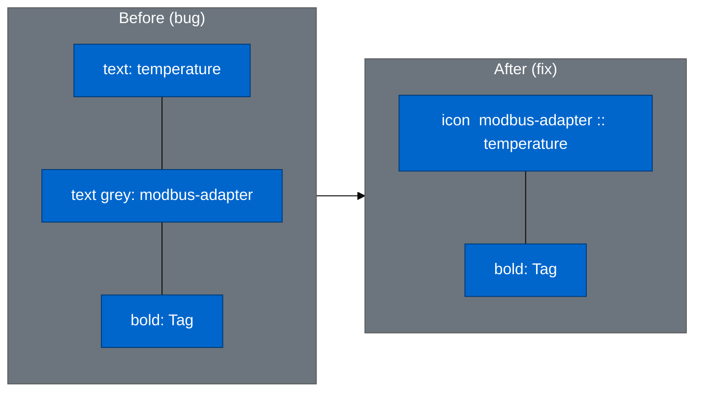

# EDG-222 — Task Plan

## Root Cause Analysis

### The shared component: `CombinerOptionContent.tsx`

Both `CombinedEntitySelect` (sources) and `PrimarySelect` (primary/trigger) use
`CombinerOptionContent` to render each option row in their dropdowns.

Current rendering for a TAG option:

```
[ Text: tag.name ]  [ Text (grey): adapterId ]  [ Text (bold): "Tag" ]
```

Expected rendering per EDG-35 visual spec:

```
[ PLCTagIcon  adapter :: tag.name ]  [ Text (bold): "Tag" ]
```

### Why selected chips work but options don't

`CombinedEntitySelect` values (selected chips) use `formatOwnershipString(ref)` as the label and
render via `PLCTag` in `MultiValueContainer`. This path was fixed in EDG-35/EDG-176.

`CombinerOptionContent` — used for the dropdown option rows — was never updated to display the
ownership format.

---

## Design Decision: Icon + Text, not Badge

An early approach considered rendering TAG options using the full `PLCTag` badge component (rounded
pill, background, icon). This was rejected for two reasons:

**1. Layout conflict with metadata**

`CombinerOptionContent` is a multi-line row (label + optional description). Inserting a full badge
(pill container, padding, background colour) into the label row of an already-complex layout creates
visual layering that competes with the surrounding content. The badge paradigm is designed for
compact, isolated chip display — the selected chip in the input area is exactly that. A dropdown
option row is not.

**2. Truncation behaviour in ReactSelect**

The label row has a constrained, variable-width container. The current `<Text flex={1}>` truncates
naturally as a string. A full `PLCTag` badge does not truncate cleanly: `flex={1}` would stretch the
pill horizontally, and the badge border/icon would remain after the text is cut, with no tooltip
fallback available in ReactSelect.

**Chosen approach: inline icon + ownership text**

- Use the `PLCTagIcon` inline (small, no container) to communicate type
- Display the ownership string as plain text: `adapter :: tag.name`
- Natural CSS truncation: the adapter prefix stays visible, the tag name truncates from the right
- The type badge on the right is kept — `CombinedEntitySelect` lists both TAGs and TOPIC_FILTERs
  mixed together; the badge is the explicit, scannable text label that distinguishes them

**Trade-off summary**

| Approach                              | `adapter :: tag` | Truncation | Visual weight | Badge consistency |
| ------------------------------------- | ---------------- | ---------- | ------------- | ----------------- |
| Current (plain text + grey adapter)   | ❌               | ✅         | Low           | ❌                |
| Full PLCTag badge (rejected)          | ✅               | ⚠️ tricky  | High          | ✅                |
| Inline icon + ownership text (chosen) | ✅               | ✅         | Low           | Partial (icon ✅) |

The badge in the selected chip and the icon-only in the option use different visual weights but
share the same icon — sufficient for recognition. The `::` separator carries the semantic weight.

---

## Files to Change

### Production Code

| File                                                      | Change                                  |
| --------------------------------------------------------- | --------------------------------------- |
| `src/modules/Mappings/combiner/CombinerOptionContent.tsx` | Main fix — inline icon + ownership text |

### Tests

| File                                                              | Reason                                                                                             |
| ----------------------------------------------------------------- | -------------------------------------------------------------------------------------------------- |
| `src/modules/Mappings/combiner/CombinerOptionContent.spec.cy.tsx` | Assertions use `cy.get('p')` for adapter text; that text moves into a different node after the fix |
| `src/modules/Mappings/combiner/CombinedEntitySelect.spec.cy.tsx`  | Update test description; add explicit `adapter :: tag` format assertion                            |

`PrimarySelect.spec.cy.tsx` — **no changes needed**: all assertions use `.should('contain.text',
...)` which still match after the fix (adapter and tag text remain present in the DOM).

---

## Implementation Plan

### Step 1 — Fix `CombinerOptionContent.tsx`

```tsx
// BEFORE
<HStack>
  <Text flex={1}>{label}</Text>
  {adapterId && (
    <Text fontSize="sm" color="gray.500">
      {adapterId}
    </Text>
  )}
  <Text fontSize="sm" fontWeight="bold">
    {t('combiner.schema.mapping.combinedSelector.type', { context: type })}
  </Text>
</HStack>

// AFTER
<HStack>
  <HStack flex={1} gap={1} overflow="hidden">
    {type === DataIdentifierReference.type.TAG && (
      <PLCTagIcon boxSize="12px" flexShrink={0} color="blue.500" />
    )}
    <Text isTruncated>{adapterId ? `${adapterId} :: ${label}` : label}</Text>
  </HStack>
  <Text fontSize="sm" fontWeight="bold">
    {t('combiner.schema.mapping.combinedSelector.type', { context: type })}
  </Text>
</HStack>
```

Key decisions:

- **No badge container**: icon only, no pill background or rounded border
- **`isTruncated`** on the ownership text: natural ellipsis, adapter prefix stays visible
- **`flexShrink={0}`** on the icon: icon never squishes under constrained width
- **TOPIC_FILTER** rendering: no icon change (topic filters have no adapter scope), type badge
  remains the sole type indicator
- **No adapterId**: PLCTagIcon + plain `label` text (no `::`) — unchanged visual for unscoped tags
- **Type badge kept** on the right: critical for mixed TAG/TOPIC_FILTER lists

### Step 2 — Update `CombinerOptionContent.spec.cy.tsx`

Tests that will break (the separate grey adapterId `<p>` no longer exists):

1. **"should render the label and type badge"** (TAG, no adapterId)

- Remove: `cy.get('p').should('contain.text', 'boiler/temperature')`
- Add: check the ownership text is present via broader selector

2. **"should render the adapter name when adapterId is provided"**

- Remove: `cy.get('p').should('contain.text', 'muc-opc-server')`
- Add: check the label text contains `muc-opc-server :: boiler/temperature`

3. **"should not render a description element when description is absent"** (TAG, no adapterId)

- `cy.get('p').should('have.length', 2)` — the `<p>` count changes now that the ownership
  text is in a `<Text>` inside a nested `<HStack>`, but the type badge `<p>` remains
- Update count assertion accordingly

Tests that still pass without changes:

- "should not render the adapter name when adapterId is absent" (TOPIC_FILTER — rendering unchanged)
- "should render the description when provided"
- "should render the correct type badge for topic filters"

### Step 3 — Update `CombinedEntitySelect.spec.cy.tsx`

- Rename "should show adapterId as secondary text in each option row" → reflects the new format
- Existing `:contains("modbus-adapter")` filter assertions still pass (the adapter name is now part
  of the ownership string, still present in the text content)
- Add an explicit assertion verifying `adapter :: tag` format appears in each TAG option row

---

## Screenshots for PR

Before/after screenshots must be captured of the **full `CombinedEntitySelect` component** with the
dropdown open — not just an isolated option row. This shows the real-world visual change in context:
selected chips + option list together.

### Strategy

A dedicated screenshot test is added to `CombinedEntitySelect.spec.cy.tsx` **before** touching any
production code, to capture the "before" state while the current (broken) rendering is still in
place. After the fix is applied, the same test re-runs to produce the "after" screenshot. Both are
saved to `.tasks/EDG-222-adapter-tag-sources-dropdown/screenshots/`.

The test mounts the component with:

- Two selected sources already shown as chips (one tag with scope, one topic filter)
- The dropdown open, showing a mix of TAG and TOPIC_FILTER options from two adapters
- Viewport wide enough to show the full layout without clipping

```ts
it.skip('screenshot: sources dropdown — before/after', () => {
  // mount with pre-selected sources + open dropdown
  // cy.screenshot('sources-dropdown-before', { ... })
  // cy.screenshot('sources-dropdown-after', { ... })   ← re-run after fix
})
```

The test uses `.skip` so it never runs in CI — it is invoked manually only during PR preparation.

---

## Verification

```bash
# All three suites must pass
pnpm cypress:run:component --spec "src/modules/Mappings/combiner/CombinerOptionContent.spec.cy.tsx"
pnpm cypress:run:component --spec "src/modules/Mappings/combiner/CombinedEntitySelect.spec.cy.tsx"
pnpm cypress:run:component --spec "src/modules/Mappings/combiner/PrimarySelect.spec.cy.tsx"
```

---

## Visual Summary



## Checklist

- [ ] Screenshot test added to `CombinedEntitySelect.spec.cy.tsx`
- [ ] "Before" screenshot captured and saved
- [ ] `CombinerOptionContent.tsx` updated
- [ ] `CombinerOptionContent.spec.cy.tsx` updated
- [ ] `CombinedEntitySelect.spec.cy.tsx` updated (functional tests + screenshot test)
- [ ] "After" screenshot captured and saved
- [ ] All three test suites pass
- [ ] PR created with before/after screenshots
- [ ] Prettier run on markdown files
