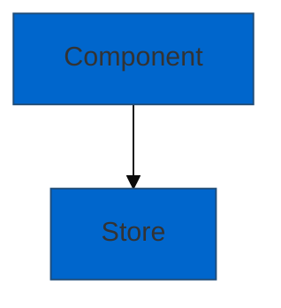

# Documentation Acceptance Criteria

**Task:** EDG-40-technical-documentation
**Last Updated:** 2026-02-13

This document defines the acceptance criteria for reviewing, creating, and relocating documentation to the `docs/` structure.

---

## Purpose

These criteria ensure all documentation in `docs/` maintains:

- **Accuracy** - Reflects current codebase
- **Accessibility** - WCAG AA compliant diagrams
- **Usability** - Readable by both humans and AI agents
- **Maintainability** - Clear structure and references
- **Traceability** - Missing docs tracked

---

## Acceptance Criteria Checklist

### 1. Document Accuracy ✅

**The document must accurately reflect the current codebase.**

**Verification Steps:**

- [ ] All file paths exist and are correct
- [ ] All component names match actual code
- [ ] All function/method signatures accurate
- [ ] All store interfaces match implementation
- [ ] All API endpoints match OpenAPI spec
- [ ] All configuration examples are current
- [ ] Code examples use current syntax/patterns

**How to Verify:**

1. Use `Read` tool to check mentioned files exist
2. Use `Grep` to verify component/function names
3. Compare type definitions with actual types
4. Test code examples if applicable

**Example Checks:**

```bash
# Verify file exists
ls src/extensions/datahub/hooks/useDataHubDraftStore.ts

# Verify component name
grep -r "ToolboxSelectionListener" src/extensions/datahub/

# Check type definition
grep -A 10 "interface WorkspaceState" src/extensions/datahub/types.ts
```

**Rejection Criteria:**

- ❌ File paths that don't exist
- ❌ Component names not found in code
- ❌ Outdated type definitions
- ❌ Deprecated API patterns

---

### 2. Structure & Readability ✅

**The document must be well-structured and readable for both developers and AI agents.**

**Required Elements:**

- [ ] **Document Header** with:
  - Title
  - Last Updated date
  - Purpose statement
  - Audience specification
- [ ] **Table of Contents** (for docs >200 lines)
  - Anchor links to major sections
  - Clear section hierarchy
- [ ] **Clear Section Organization**
  - Logical flow from overview to details
  - Consistent heading levels (H2 for main, H3 for sub, H4 for detail)
- [ ] **Code Examples** with:
  - Syntax highlighting (`typescript, `bash, etc.)
  - Inline comments where helpful
  - Real-world usage patterns
- [ ] **Document Footer** with:
  - "Document Maintained By"
  - "Last Review" date
  - "Next Review" date (quarterly default)
  - Link to INDEX.md

**Structure Template:**

```markdown
# Document Title

**Last Updated:** YYYY-MM-DD
**Purpose:** [Brief description]
**Audience:** [Developers/AI agents/Both]

---

## Table of Contents

[Only if >200 lines]

---

## Overview

[High-level introduction]

## Main Sections

[Core content]

## Related Documentation

[Links to other docs]

---

**Document Maintained By:** Development Team
**Last Review:** YYYY-MM-DD
**Next Review:** YYYY-MM-DD (Quarterly)
**See:** [Documentation Index](../INDEX.md)
```

**Rejection Criteria:**

- ❌ No metadata header
- ❌ Poor section organization
- ❌ No table of contents for long docs
- ❌ Wall of text without structure

---

### 3. Diagrams in Mermaid (RULE 9 Compliance) ✅

**ALL diagrams must be created using Mermaid with WCAG AA compliant colors.**

**Requirements:**

- [ ] **No ASCII Art** - All diagrams use Mermaid
- [ ] **WCAG AA Compliance** - Minimum 4.5:1 contrast ratio
- [ ] **Theme Configuration** - Use recommended color palette
- [ ] **Diagram Types Appropriate**
  - `flowchart` for processes and architecture
  - `sequenceDiagram` for interactions
  - `graph` for relationships
  - `stateDiagram` for state machines
- [ ] **Labels Clear** - All nodes have descriptive text
- [ ] **Rendering Verified** - Diagrams render correctly in GitHub/GitLab

**Recommended Color Palette (WCAG AA Compliant):**

```mermaid
%%{init: {'theme':'base', 'themeVariables': {
  'primaryColor':'#0066CC',
  'primaryTextColor':'#FFFFFF',
  'primaryBorderColor':'#003D7A',
  'secondaryColor':'#28A745',
  'secondaryTextColor':'#FFFFFF',
  'secondaryBorderColor':'#1E7E34',
  'tertiaryColor':'#6C757D',
  'tertiaryTextColor':'#FFFFFF',
  'tertiaryBorderColor':'#495057',
  'lineColor':'#003D7A'
}}}%%
```

**Color Contrast Ratios:**

- Primary Blue (#0066CC) + White (#FFFFFF) = **7.5:1** ✅
- Secondary Green (#28A745) + White (#FFFFFF) = **4.5:1** ✅
- Tertiary Gray (#6C757D) + White (#FFFFFF) = **4.6:1** ✅
- Error Red (#DC3545) + White (#FFFFFF) = **5.9:1** ✅

**Verification:**

1. Render diagram in GitHub preview or https://mermaid.live
2. Use WebAIM Contrast Checker: https://webaim.org/resources/contrastchecker/
3. Verify all text/background combinations meet 4.5:1 minimum

**Rejection Criteria:**

- ❌ ASCII art diagrams
- ❌ Diagrams with <4.5:1 contrast
- ❌ Diagrams without theme configuration
- ❌ Unreadable or unclear labels

**See:** `.github/AI_MANDATORY_RULES.md` RULE 9 for complete requirements

---

### 4. References to docs/ Structure Only ✅

**All internal references must point to `docs/` structure. Missing documents must be marked clearly.**

**Requirements:**

- [ ] **Internal Links** use relative paths within `docs/`
  - Format: `[Link Text](../section/DOCUMENT.md)`
  - No absolute paths
  - No references to `.tasks/` files
- [ ] **Missing Documents** clearly marked
  - Format: `[Document Name](../path/DOCUMENT.md) _(TODO)_`
  - Italicized `_(TODO)_` suffix
  - Link href still points to future location
- [ ] **External Resources** separated
  - Dedicated section: "External Resources"
  - Full URLs provided
  - Description of what resource provides
- [ ] **No Orphaned References**
  - Every reference has a target (even if TODO)
  - All referenced docs added to INDEX.md

**Correct Patterns:**

✅ **Internal Reference (Existing):**

```markdown
See [Technical Stack](../technical/TECHNICAL_STACK.md) for dependencies.
```

✅ **Internal Reference (Missing):**

```markdown
**Related:** [Testing Guide](../guides/TESTING_GUIDE.md) _(TODO)_
```

✅ **External Reference:**

```markdown
### External Resources

- **React Flow:** https://reactflow.dev/
- **Zustand:** https://github.com/pmndrs/zustand
```

**Incorrect Patterns:**

❌ **Reference to .tasks/:**

```markdown
See .tasks/TESTING_GUIDELINES.md
```

❌ **Absolute Path:**

```markdown
See /Users/nicolas/dev-projects/edge/hivemq-edge/hivemq-edge-frontend/docs/...
```

❌ **Missing TODO Marker:**

```markdown
See [Testing Guide](../guides/TESTING_GUIDE.md)
```

(When file doesn't exist yet)

❌ **Broken Link:**

```markdown
See [Old Document](../old/REMOVED.md)
```

**Verification:**

1. Check all `[Link](path)` patterns in document
2. For each link, verify target exists OR marked `_(TODO)_`
3. Ensure all TODO references in MISSING_DOCS_TRACKER.md

**Rejection Criteria:**

- ❌ References to `.tasks/` files
- ❌ Absolute file paths
- ❌ Broken links without TODO marker
- ❌ External URLs in internal reference sections

---

### 5. Missing Documents Tracked ✅

**All referenced but not-yet-created documents must be tracked in `MISSING_DOCS_TRACKER.md`.**

**Requirements:**

- [ ] **Tracker File Exists**
  - Location: `.tasks/{task-id}/MISSING_DOCS_TRACKER.md`
  - Updated with each new document
- [ ] **Every TODO Reference Tracked**
  - Document name
  - Intended location
  - Priority level
  - Referenced by which docs
- [ ] **Priority Classification**
  - 🔴 Critical - Blocks understanding of key features
  - 🟡 High - Important for developers working in area
  - 🟢 Medium - Nice to have, not blocking
  - ⚪ Low - Optional, can be deferred
- [ ] **Migration Tasks Identified**
  - Docs moving from `.tasks/` to `docs/`
  - Source and target locations
  - Action items
- [ ] **Creation Priority Order**
  - Phase 1: Critical foundation
  - Phase 2: High-value guides
  - Phase 3: Feature-specific
  - Phase 4: Supporting docs
- [ ] **Metrics Tracked**
  - Total documents needed
  - Completed count
  - In progress count
  - Not started count
  - Completion percentage

**Tracker Structure:**

```markdown
# Missing Documentation Tracker

## Status Legend

[Priority indicators]

## Architecture Documents

| Document | Status | Priority | Referenced By | Notes |
[Table]

## Guide Documents

[Table]

## Completed Documents

[Table]

## Migration Tasks

[List with sources and targets]

## Creation Priority Order

[Phased approach]

## Tracking Metrics

[Counts and percentages]
```

**Verification:**

1. Find all `_(TODO)_` markers in document
2. Verify each appears in MISSING_DOCS_TRACKER.md
3. Check priority assignment is reasonable
4. Ensure "Referenced By" column includes current doc

**Rejection Criteria:**

- ❌ TODO references not in tracker
- ❌ No priority assigned
- ❌ Missing "Referenced By" info
- ❌ No metrics/progress tracking

---

### 6. Screenshots (When Beneficial) ✅

**Screenshots enhance documentation by showing actual UI implementation and visual states. Use sparingly and only when they add significant value.**

**Requirements:**

- [ ] **Appropriate Use** - Screenshots used for UI, diagrams for architecture
- [ ] **Quality Standards** - Correct viewport, clean state, realistic data
- [ ] **Naming Convention** - Format: `{feature}-{state}-{description}.png`
- [ ] **Correct Storage** - Located in `docs/assets/screenshots/{section}/`
- [ ] **Proper Integration** - Alt text, caption, referenced in text
- [ ] **Test Coverage** - Test exists to regenerate screenshot

**When to Include Screenshots:**

- UI components and their visual states
- Error states, loading states, empty states, success states
- Step-by-step workflows (wizards, multi-step forms)
- Before/after comparisons for visual changes

**When to Use Diagrams Instead:**

- Architecture and component relationships
- Data flow and state management
- Process workflows (not UI workflows)
- Abstract concepts

**Naming Convention:**

```
{feature}-{state}-{description}.png

Examples:
- schema-table-empty-state.png
- policy-designer-with-nodes.png
- adapter-wizard-01-menu.png
- workspace-layout-after-radial.png
```

**Storage Location (Organized by Feature/Domain):**

```
docs/assets/screenshots/
├── datahub/           # DataHub extension screenshots
├── workspace/         # Workspace/topology screenshots
├── adapters/          # Protocol adapter screenshots
├── bridges/           # Bridge configuration screenshots
├── ui-components/     # Shared UI component screenshots
├── development/       # Development tools/processes
└── common/            # Common UI elements/patterns
```

**Rationale:** Feature-based organization enables screenshot reuse across multiple documents (architecture, guides, etc.)

**Quality Requirements:**

1. **Viewport Size**

   - **E2E tests: `cy.viewport(1280, 720)` - REQUIRED (HD standard)**
   - Component tests: Flexible (e.g., `cy.viewport(800, 800)`)
   - Full HD (1920x1080): Exceptional cases only, must be justified

   **Rationale:** HD (1280x720) ensures:

   - Consistent screenshot sizing
   - Responsive behavior testing
   - Screenshots fit well in documentation
   - Standardized E2E test environment

2. **Capture Settings**

   ```typescript
   cy.screenshot('screenshot-name', {
     overwrite: true,
     capture: 'viewport', // Preferred
   })
   ```

3. **Visual Clarity**
   - Clean state (no dev tools, browser chrome)
   - Realistic test data (not "foo", "bar", "test123")
   - Stable render (wait for animations, network requests)
   - Focus on relevant content

**Documentation Integration:**

```markdown
**Figure: Policy Designer Canvas - Empty State**


The policy designer starts with a clean canvas. Users drag nodes from the toolbox (left) onto the canvas to build policies.
```

**Creating Screenshots in Tests:**

**Component Test:**

```typescript
it('should capture component state for documentation', () => {
  cy.viewport(800, 800)
  cy.intercept('/api/v1/resource', { items: [mockData] })

  cy.mountWithProviders(<Component />)
  cy.wait(500)  // Stabilize render

  cy.screenshot('component-name-with-data', {
    overwrite: true,
    capture: 'viewport'
  })
})
```

**E2E Test:**

```typescript
it('should document workflow steps', () => {
  cy.viewport(1280, 720)

  // Step 1
  cy.visit('/feature/new')
  cy.screenshot('feature-workflow-01-start')

  // Step 2
  cy.getByTestId('next-button').click()
  cy.screenshot('feature-workflow-02-configure')
})
```

**Verification:**

1. Screenshot file exists in correct location
2. Alt text is descriptive and explains content
3. Caption provides context
4. Screenshot is referenced in documentation text
5. Test exists to regenerate screenshot
6. No sensitive data visible (API keys, passwords, internal URLs)

**Rejection Criteria:**

- ❌ Poor quality (low resolution, cropped incorrectly)
- ❌ Contains sensitive data or development artifacts
- ❌ Missing alt text or caption
- ❌ Stored in test directory instead of docs/assets/
- ❌ Inconsistent naming (spaces, slashes, special characters)
- ❌ Overused (too many screenshots, diagram would be better)

**See:** [SCREENSHOT_GUIDELINES.md](./SCREENSHOT_GUIDELINES.md) for complete specifications

---

## Complete Review Checklist

Use this checklist when reviewing or creating documentation:

### Accuracy

- [ ] All file paths verified to exist
- [ ] All component/function names match code
- [ ] All type definitions accurate
- [ ] All API patterns current
- [ ] Code examples tested or verified

### Structure

- [ ] Document header with metadata
- [ ] Table of contents (if >200 lines)
- [ ] Logical section organization
- [ ] Code examples with syntax highlighting
- [ ] Document footer with maintenance info

### Diagrams

- [ ] All diagrams use Mermaid (no ASCII art)
- [ ] All diagrams use WCAG AA compliant colors
- [ ] Theme configuration included
- [ ] Diagrams render correctly
- [ ] All labels clear and descriptive

### References

- [ ] All internal links use relative paths
- [ ] All missing docs marked with `_(TODO)_`
- [ ] External resources in separate section
- [ ] No references to `.tasks/` files
- [ ] No broken links

### Tracking

- [ ] All TODO references in MISSING_DOCS_TRACKER.md
- [ ] Priority assigned to each missing doc
- [ ] "Referenced By" documented
- [ ] Metrics updated
- [ ] Migration tasks identified

### Screenshots (When Applicable)

- [ ] Screenshots add value (not redundant with diagrams)
- [ ] Named correctly (`{feature}-{state}-{description}.png`)
- [ ] Stored in `docs/assets/screenshots/{feature-domain}/`
- [ ] High quality (HD 1280x720 for E2E, flexible for components)
- [ ] Uses standard HD viewport unless Full HD is justified
- [ ] Alt text and caption provided
- [ ] Referenced in documentation text
- [ ] Test exists to regenerate
- [ ] No sensitive data visible

### Final Checks

- [ ] Document added to INDEX.md
- [ ] Status updated in INDEX.md (TODO/Complete)
- [ ] Related docs cross-linked
- [ ] Security scan passed (no secrets)
- [ ] Document reviewed for clarity

---

## Document Types & Their Requirements

### Architecture Documents

**Additional Requirements:**

- Must include "Overview" section with Mermaid diagram
- Must document key components
- Must show data flow (sequence diagrams recommended)
- Must include "Key Implementation Insights"
- Target: Both developers and AI agents

### Guide Documents

**Additional Requirements:**

- Must include "Quick Start" section
- Must provide copy-paste examples
- Must include "Common Patterns" section
- Must include "Troubleshooting" section
- Target: Primarily developers, some agent use

### API Documents

**Additional Requirements:**

- Must document request/response patterns
- Must show error handling
- Must include code examples
- Must reference OpenAPI spec where applicable
- Target: Both developers and AI agents

### Technical Documents

**Additional Requirements:**

- Must include version information
- Must document configuration options
- Must show command examples
- Must include troubleshooting
- Target: DevOps and developers

---

## Review Process

### Self-Review (Before Submission)

1. **Run through complete checklist** above
2. **Verify all links** manually
3. **Render all diagrams** in GitHub preview
4. **Check contrast ratios** for all colors used
5. **Update MISSING_DOCS_TRACKER.md** if new TODOs added
6. **Update INDEX.md** with document status
7. **Run security scan**: `pnpm docs:security-scan`

### Peer Review (Optional)

1. Another developer reviews for clarity
2. Verify technical accuracy
3. Check examples are helpful
4. Suggest improvements

### Quarterly Review

1. Check "Last Review" date
2. Verify all information still accurate
3. Update code examples if syntax changed
4. Check missing docs are still tracked
5. Update "Next Review" date

---

## Examples

### Example: DATAHUB_ARCHITECTURE.md Review

✅ **Passed All Criteria:**

1. **Accuracy**: Verified all 15+ file paths, component names, store interfaces
2. **Structure**: Added TOC, clear sections, 797 lines well-organized
3. **Diagrams**: Created 5 Mermaid diagrams, all WCAG AA compliant
4. **References**: All point to docs/, 18 TODOs marked clearly
5. **Tracking**: Created MISSING_DOCS_TRACKER.md with priorities

**Result:** Document approved and moved to `docs/architecture/`

---

## Quick Reference

**Good Example:**

````markdown
# Feature Architecture

**Last Updated:** 2026-02-13
**Purpose:** Complete architecture reference
**Audience:** Developers and AI agents

## Overview


````

## Related Documentation

- [Testing Guide](../guides/TESTING_GUIDE.md) _(TODO)_
- [API Patterns](../api/REACT_QUERY_PATTERNS.md) _(TODO)_

**External:**

- React: https://react.dev/

---

**Document Maintained By:** Development Team
**Last Review:** 2026-02-13
**Next Review:** 2026-05-13

````

**Bad Example:**
```markdown
# Feature

Here's how it works...

[ASCII diagram]

See .tasks/TESTING_GUIDELINES.md for more.
````

---

## Common Rejection Reasons

1. **ASCII Art Diagrams** - Must use Mermaid
2. **References to .tasks/** - Must use docs/ structure
3. **Missing TODO Markers** - Must mark non-existent docs
4. **Poor Contrast** - Must meet WCAG AA (4.5:1)
5. **Outdated Information** - Must verify against current code
6. **No Metadata** - Must include header/footer
7. **Untracked TODOs** - Must be in MISSING_DOCS_TRACKER.md

---

## Tools & Resources

**Verification:**

- Contrast Checker: https://webaim.org/resources/contrastchecker/
- Mermaid Live Editor: https://mermaid.live
- Markdown Preview: GitHub preview or IDE preview

**Commands:**

````bash
# Security scan
pnpm docs:security-scan

# Find all TODO markers
grep -r "_(TODO)_" docs/

# Check for .tasks references
grep -r "\.tasks/" docs/

# List all Mermaid diagrams
grep -r "```mermaid" docs/
````

---

**Last Updated:** 2026-02-13
**Review Frequency:** Update as new patterns emerge
**Owner:** Documentation Team
