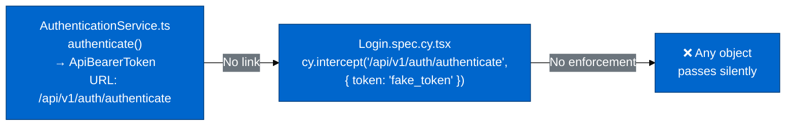
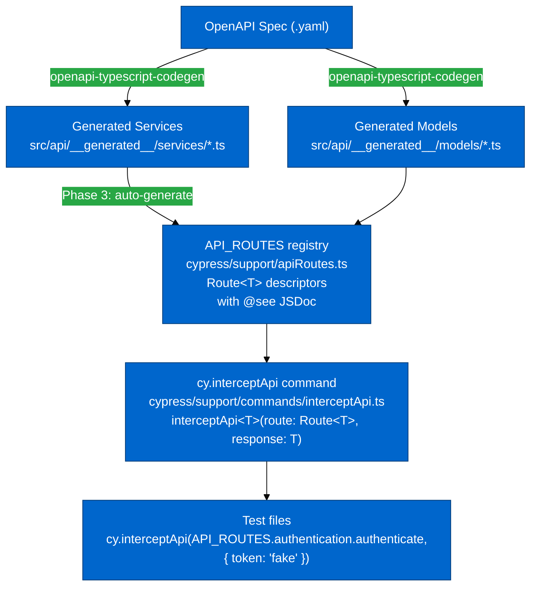

# EDG-73: Implementation Plan — Type-Safe Cypress Intercepts

## Analysis Summary

### How the Current Type System Fails



### What `cy.intercept<T>` Actually Types (vs. What Devs Assume)

| Usage                                                      | What `T` Actually Types         | Effect on Response Body             |
| ---------------------------------------------------------- | ------------------------------- | ----------------------------------- |
| `cy.intercept<NorthboundMappingOwnerList>(url, staticObj)` | The **request body** `req.body` | ❌ None — static obj is unvalidated |
| `cy.intercept<Bridge>('POST', url, (req) => { ... })`      | `req.body` is typed as `Bridge` | ❌ `req.reply(...)` still untyped   |
| `cy.intercept(url, { statusCode: 404 })`                   | Nothing (default `unknown`)     | ❌ No validation                    |

### Why the MSW Layer (Vitest) Works But Cypress Doesn't

MSW uses proper generics on both sides:

```typescript
// Vitest/MSW — FULLY TYPED
http.post('*/auth/authenticate', () => {
  return HttpResponse.json<ApiBearerToken>({ token: TOKEN }, { status: 200 })
  //                   ^^^^^^^^^^^^^^^^ TypeScript validates the response body
})
```

Cypress network interception has no equivalent mechanism in the standard API.

---

## Proposed Solution: `cy.interceptApi` Custom Command

### Core Mechanism: Phantom-Typed Route Objects

The registry uses a `Route<T>` type that carries the response type as a **phantom type parameter**
— present at compile time for TypeScript inference, erased at runtime:

```typescript
// cypress/support/apiRoutes.ts

type HttpMethod = 'GET' | 'POST' | 'PUT' | 'DELETE' | 'PATCH'

/** A route descriptor. T is the phantom response type — never stored, only inferred by TS. */
export type Route<T> = {
  readonly method: HttpMethod
  readonly url: string // Cypress intercept pattern (may contain ** wildcards)
  readonly _responseType: T // phantom — undefined at runtime, inferred by TypeScript
}

/** Factory for routes with no path parameters. */
const route = <T>(method: HttpMethod, url: string): Route<T> => ({
  method,
  url,
  _responseType: undefined as unknown as T,
})
```

### Parametric Routes: `routeWithParams` and `withParams()`

Routes with OpenAPI path parameters (e.g., `{bridgeId}`) use a second factory that carries
the URL template as a TypeScript literal type. This allows TypeScript to infer the exact
parameter names and enforce them at the call site.

```typescript
// TypeScript template literal inference extracts parameter names from the URL template
type ExtractUrlParams<Template extends string> = Template extends `${infer _}{${infer Param}}${infer Rest}`
  ? Param | ExtractUrlParams<Rest>
  : never

// Produces a record type keyed by the extracted param names
// E.g., UrlParams<'/api/v1/management/bridges/{bridgeId}'> = { bridgeId: string }
// E.g., UrlParams<'.../{combinerId}/mappings/{mappingId}'> = { combinerId: string; mappingId: string }
type UrlParams<Template extends string> = {
  [K in ExtractUrlParams<Template>]: string
}

/**
 * A ParametricRoute extends Route<T> (usable as-is with ** wildcard) and adds
 * withParams() to resolve specific path parameters into an exact URL.
 */
export type ParametricRoute<T, Template extends string> = Route<T> & {
  readonly urlTemplate: Template
  /**
   * Resolve the URL template with specific path parameter values.
   * Returns a plain Route<T> with an exact URL (no wildcards).
   * TypeScript enforces the correct parameter names from the URL template.
   *
   * @example
   * API_ROUTES.bridges.getBridgeById.withParams({ bridgeId: 'my-bridge' })
   * // → Route<Bridge> with url '/api/v1/management/bridges/my-bridge'
   */
  withParams(params: UrlParams<Template>): Route<T>
}

/**
 * Factory for routes with path parameters.
 * Default url uses ** for each {param} placeholder (matches any value).
 * TypeScript infers Template from the string literal — only T needs to be explicit.
 */
const routeWithParams = <T, Template extends string>(
  method: HttpMethod,
  urlTemplate: Template
): ParametricRoute<T, Template> => {
  const defaultUrl = (urlTemplate as string).replace(/\{[^}]+\}/g, '**')
  return {
    method,
    url: defaultUrl,
    urlTemplate,
    _responseType: undefined as unknown as T,
    withParams(params: UrlParams<Template>): Route<T> {
      const resolvedUrl = (urlTemplate as string).replace(
        /\{([^}]+)\}/g,
        (_, name) => (params as Record<string, string>)[name] ?? '**'
      )
      return { method, url: resolvedUrl, _responseType: undefined as unknown as T }
    },
  }
}
```

The `cy.interceptApi` command accepts any `Route<T>` — both simple routes and the result of
`withParams()` are plain `Route<T>` objects, so the command signature never changes:

```typescript
// cypress/support/commands/interceptApi.ts

export const interceptApi = <T>(
  route: Route<T>,
  response: T | { statusCode: number; log?: boolean }
): Cypress.Chainable<null> => {
  return cy.intercept(route.method, route.url, response as object)
}
```

TypeScript infers `T` from the route object, so the response body is validated automatically
with no type assertions in test code.

---

### Registry Structure: Mirrors `HiveMqClient`

The registry namespace matches exactly how the app accesses services in production:

| App code                                   | Test code                                                       |
| ------------------------------------------ | --------------------------------------------------------------- |
| `appClient.authentication.authenticate()`  | `cy.interceptApi(API_ROUTES.authentication.authenticate, ...)`  |
| `appClient.bridges.listBridges()`          | `cy.interceptApi(API_ROUTES.bridges.getBridges, ...)`           |
| `appClient.protocolAdapters.getAdapters()` | `cy.interceptApi(API_ROUTES.protocolAdapters.getAdapters, ...)` |

This is intentional: when a developer finds a `cy.interceptApi` call in a test, the namespace
tells them which service owns the route. Go-to-definition on the route constant opens the
registry entry with its `@see` JSDoc, which links directly to the service class and method.

```typescript
// cypress/support/apiRoutes.ts
import type {
  ApiBearerToken,
  BridgeList,
  Bridge,
  AdaptersList,
  ProtocolAdaptersList,
  // ...
} from '@/api/__generated__'

export const API_ROUTES = {
  /**
   * @see {@link AuthenticationService}
   */
  authentication: {
    /**
     * Authenticate with username/password to obtain a bearer token.
     * @see {@link AuthenticationService.authenticate}
     */
    authenticate: route<ApiBearerToken>('POST', '/api/v1/auth/authenticate'),
    /**
     * Obtain a fresh JWT from a previously authenticated token.
     * @see {@link AuthenticationService.refreshToken}
     */
    refreshToken: route<ApiBearerToken>('POST', '/api/v1/auth/refresh-token'),
    /**
     * @see {@link AuthenticationService.validateToken}
     */
    validateToken: route<void>('POST', '/api/v1/auth/validate-token'),
  },

  /**
   * @see {@link BridgesService}
   */
  bridges: {
    /**
     * @see {@link BridgesService.listBridges}
     */
    getBridges: route<BridgeList>('GET', '/api/v1/management/bridges'),
    /**
     * @see {@link BridgesService.createBridge}
     */
    createBridge: route<Bridge>('POST', '/api/v1/management/bridges'),
    /**
     * Use as-is to match any bridge ID, or call .withParams({ bridgeId }) for a specific one.
     * @see {@link BridgesService.getBridgeByName}
     */
    getBridgeById: routeWithParams<Bridge>('GET', '/api/v1/management/bridges/{bridgeId}'),
    /**
     * @see {@link BridgesService.removeBridge}
     */
    deleteBridge: routeWithParams<void>('DELETE', '/api/v1/management/bridges/{bridgeId}'),
    /**
     * @see {@link BridgesService.updateBridge}
     */
    updateBridge: routeWithParams<void>('PUT', '/api/v1/management/bridges/{bridgeId}'),
  },

  combiners: {
    /**
     * Two path parameters — TypeScript enforces both names.
     * @see {@link CombinersService.getMappingInstructions}
     */
    getMappingInstructions: routeWithParams<Instruction[]>(
      'GET',
      '/api/v1/management/combiners/{combinerId}/mappings/{mappingId}/instructions'
    ),
  },

  // ... all other services
} as const
```

### Usage in Tests

```typescript
// ✅ TypeScript validates { token } against ApiBearerToken
cy.interceptApi(API_ROUTES.authentication.authenticate, { token: 'fake_token' }).as('auth')

// ✅ Status-only shorthand works for any route
cy.interceptApi(API_ROUTES.bridges.getBridges, { statusCode: 404 })

// ✅ Wildcard — matches any bridge ID (the default)
cy.interceptApi(API_ROUTES.bridges.getBridgeById, { id: 'x', name: 'Bridge' })
// → cy.intercept('GET', '/api/v1/management/bridges/**', ...)

// ✅ Specific ID — TypeScript enforces { bridgeId: string } from the URL template
cy.interceptApi(
  API_ROUTES.bridges.getBridgeById.withParams({ bridgeId: 'my-bridge-123' }),
  { id: 'my-bridge-123', name: 'Bridge' }
)
// → cy.intercept('GET', '/api/v1/management/bridges/my-bridge-123', ...)

// ✅ Multiple path params — TypeScript requires BOTH names
cy.interceptApi(
  API_ROUTES.combiners.getMappingInstructions.withParams({
    combinerId: 'combiner-abc',
    mappingId: 'mapping-xyz',
  }),
  []
)

// ❌ TypeScript error — { items: [] } does not satisfy ApiBearerToken
cy.interceptApi(API_ROUTES.authentication.authenticate, { items: [] })

// ❌ TypeScript error — wrong param name ('id' instead of 'bridgeId')
cy.interceptApi(API_ROUTES.bridges.getBridgeById.withParams({ id: 'x' }), { ... })

// ❌ TypeScript error — missing required param
cy.interceptApi(API_ROUTES.bridges.getBridgeById.withParams({}), { ... })
```

IDE autocomplete on `API_ROUTES.` surfaces the service namespaces first, then the method
names — the same discovery path a developer uses when writing production code. Autocomplete
on `.withParams({` shows only the valid parameter names extracted from the URL template.

### Architecture



---

## Implementation Phases

### Phase 1: Core Infrastructure

**Deliverables:**

1. `cypress/support/apiRoutes.ts` — `Route<T>` type, `route()` factory, `API_ROUTES` registry
   (seed with ~40 most-used routes covering authentication, bridges, adapters, frontend,
   datahub schemas/scripts/policies, metrics)
2. `cypress/support/commands/interceptApi.ts` — command implementation
3. `cypress/support/commands.ts` — add type declaration and registration
4. `src/modules/Login/components/Login.spec.cy.tsx` — proof-of-concept migration

**Validation — before declaring Phase 1 done:**

```typescript
// These must all behave as described

cy.interceptApi(API_ROUTES.authentication.authenticate, { token: 'x' }) // ✅ compiles
cy.interceptApi(API_ROUTES.authentication.authenticate, { statusCode: 401 }) // ✅ compiles
cy.interceptApi(API_ROUTES.authentication.authenticate, { items: [] }) // ❌ TS error
cy.interceptApi(API_ROUTES.bridges.getBridges, { items: [mockBridge] }) // ✅ compiles
```

---

### Phase 2: ESLint Rule (Enforcement)

**Deliverables:**

1. Custom ESLint rule `no-bare-cy-intercept` — warns on `cy.intercept('/api/v1/...')` or
   `cy.intercept('GET', '/api/v1/...')` patterns (excludes non-API URLs like CDN, GitHub)
2. Configure as `warn` initially (not `error`) to allow incremental migration
3. Priority migration targets (shared utilities, used everywhere):
   - `cypress/utils/intercept.utils.ts`
   - `cypress/utils/intercept-pulse.utils.ts`

---

### Phase 3: Route Registry Generation

The generator runs after `openapi-typescript-codegen` and produces `cypress/support/apiRoutes.ts`
automatically, replacing the hand-maintained file.

**How the generator works:**

```
For each service file in src/api/__generated__/services/:
  Derive namespace from class name (AuthenticationService → authentication)
  For each public method calling httpRequest.request():
    Extract: method (GET/POST/PUT/DELETE) from the request options
    Extract: url template (/api/v1/management/bridges/{bridgeId})
    Extract: return type (CancelablePromise<BridgeList> → BridgeList)
    If url template contains {param} placeholders:
      Emit: routeWithParams<ReturnType>('METHOD', '/api/v1/.../{param}')
      (withParams() and ** glob URL are produced automatically by the factory)
    Else:
      Emit: route<ReturnType>('METHOD', '/api/v1/...')
    Emit: @see JSDoc linking to the service class and method name
```

**Pipeline integration:**

```
// package.json (scripts section)
"dev:openAPI": "openapi-typescript-codegen && tsx scripts/generateInterceptRoutes.ts"
```

When the OpenAPI spec changes and services regenerate, the route registry regenerates too.
Any test using a removed or type-changed route fails at compile time — the goal.

---

### Phase 4: Full Migration

**Deliverables:**

1. Codemod script (`scripts/migrateIntercepts.ts`) using `jscodeshift` or AST rewriting to
   bulk-replace static `cy.intercept('/api/v1/...')` calls with `cy.interceptApi(API_ROUTES.x.y, ...)`
2. ESLint rule escalated to `error`
3. `CYPRESS_TESTING_GUIDELINES.md` updated with the new pattern and migration rationale

---

### Phase 5: Documentation (EDG-40 branch)

> **Branch note:** This phase is delivered on the `feat/EDG-40/technical-documentation` branch,
> not the EDG-73 feature branch. Documentation changes describe completed infrastructure; they
> should land after Phase 1 is merged and `cy.interceptApi` is available in `main`.

**Context:** The EDG-40 technical documentation suite (`docs/`) already covers the OpenAPI
integration and Cypress testing. Three existing documents require updates and one new document
should be created to make the infrastructure discoverable.

#### 5.1 — Update `docs/guides/CYPRESS_GUIDE.md` — Network Intercepts section

The existing "Network Intercepts" section (lines 340–392) documents only bare `cy.intercept`.
Replace with the two-tier pattern:

- **Preferred:** `cy.interceptApi(API_ROUTES.x.y, response)` for all static API responses
  - Show type-enforcement examples (valid, invalid, status-only shorthand)
  - Show `withParams()` for parametric routes
  - Reference `cypress/support/apiRoutes.ts` for the full registry
- **Retained:** bare `cy.intercept` for stateful callback handlers (CRUD with `req.reply`)
- **Retained:** `cy_interceptCoreE2E()` helper (still valid, but should migrate internally)

Add `cy.interceptApi` to the **Custom Commands** section table with location
`cypress/support/commands/interceptApi.ts`.

#### 5.2 — Update `docs/api/OPENAPI_INTEGRATION.md` — Migration Notes section

The existing "Migration Notes" section (lines 604–626) already notes that
`openapi-typescript-codegen` is in maintenance mode and suggests `@hey-api/openapi-ts` as
a future migration target.

**Add to this section:** A note that the Cypress intercept registry
(`cypress/support/apiRoutes.ts`) is generated from the `openapi-typescript-codegen` output
and couples the test infrastructure to this tool. When the generator is eventually migrated
(EDG-73 context), the `generateInterceptRoutes.ts` script will need to be updated to parse
the new generator's output format. Reference EDG-73 as the tracking task for this dependency.

#### 5.3 — Create `docs/api/CYPRESS_INTERCEPT_API.md`

A new focused document covering the `cy.interceptApi` command and `API_ROUTES` registry.
Content:

- Overview: why `cy.interceptApi` exists and what problem it solves
- `Route<T>` and `ParametricRoute<T, Template>` type definitions (with usage)
- `API_ROUTES` registry structure (namespace → service mapping table)
- `withParams()` for parametric routes (with TypeScript enforcement examples)
- How to add a new route to the registry
- How the registry is regenerated (Phase 3 pipeline)
- Cross-reference to `docs/api/MSW_MOCKING.md` (contrast: MSW for Vitest unit tests vs.
  `cy.interceptApi` for Cypress component and E2E tests)

#### 5.4 — Update `docs/api/INDEX.md`

Add an entry for `CYPRESS_INTERCEPT_API.md` alongside the existing entries for
`OPENAPI_INTEGRATION.md`, `REACT_QUERY_PATTERNS.md`, and `MSW_MOCKING.md`.

#### 5.5 — Update `docs/api/MSW_MOCKING.md` — Cypress Integration section

The existing "Cypress Integration" section notes that Cypress uses `cy.intercept` separately
from MSW. Add a pointer: "For type-safe static responses in Cypress component and E2E tests,
use `cy.interceptApi`. See [Cypress Intercept API](./CYPRESS_INTERCEPT_API.md)."

---

## Design Decisions & Trade-offs

### Decision 1: Route objects vs. `'METHOD /url'` string keys

**Rejected: `'POST /api/v1/auth/authenticate'` string keys**

- TypeScript can map string literal types to response types
- But: custom string format developers must memorise
- But: no IDE navigation — go-to-definition on a string literal goes nowhere
- But: string parsing required in the command implementation
- But: no `@see` JSDoc link — the service connection is lost

**Chosen: Named `Route<T>` objects in a namespaced registry**

- IDE autocomplete surfaces `API_ROUTES.authentication.authenticate` directly
- Go-to-definition opens the registry entry with `@see AuthenticationService.authenticate`
- Command implementation is zero-magic: `cy.intercept(route.method, route.url, response)`
- Generator has a clear, unambiguous output structure to produce
- Namespace mirrors `HiveMqClient` — the same navigation path in both production and test code

### Decision 2: Manual registry (Phase 1) vs. generated (Phase 3)

Manual Phase 1 delivers immediate value. The `Route<T>` type structure is identical between
phases — switching from manual to generated is a file replacement, transparent to test code.

### Decision 3: Stateful/callback intercepts are excluded

`cy.interceptApi` targets **static response** use cases only. Callback intercepts
(database-backed, stateful CRUD, etc.) continue using existing patterns:

```typescript
// This stays as-is — complex handler logic, not a static response
cy.intercept<Bridge>('POST', '/api/v1/management/bridges', (req) => {
  const bridge = req.body // req.body typed as Bridge ✅
  factory.bridge.create({ id: bridge.id, json: JSON.stringify(bridge) })
  req.reply(200, newBridgeData)
})
```

The `<T>` on `cy.intercept<T>` correctly types `req.body` here. This usage is valid and stays.

---

## ESLint Rule CI Strictness — Configuration Options

The `no-bare-cy-intercept` rule is `warn`-level by design to allow incremental migration.
Three modes are possible depending on how strictly CI should treat these warnings.

### Option A — Warnings visible, CI non-blocking (current)

Developers see guidance in their IDE and in `pnpm lint:eslint` output. CI exits 0 as long as
there are no errors; warnings are informational only.

**`eslint.config.mjs`:** rule enabled for all files (no spec-file override for this rule)

**`package.json`:** lint scripts without `--max-warnings`

```json
"lint:eslint": "eslint src --report-unused-disable-directives",
"lint:eslint:fix": "eslint src --report-unused-disable-directives --fix",
"lint:all": "eslint src --report-unused-disable-directives && prettier --check ."
```

**When to use:** Phase 2–4 — migration in progress, developers guided by IDE warnings.

---

### Option B — Warnings silenced, rule dormant

No warnings appear anywhere. The rule is registered but disabled for all spec files.
Useful if you want the infrastructure in place without any noise before Phase 5.

**`eslint.config.mjs`:** add `'local/no-bare-cy-intercept': 'off'` to the spec-file override block:

```js
{
  files: ['**/*.spec.cy.tsx', '**/*.spec.cy.ts'],
  rules: {
    'sonarjs/no-duplicate-string': 'off',
    'local/no-bare-cy-intercept': 'off', // silenced until Phase 5
  },
}
```

**`package.json`:** restore `--max-warnings 0`:

```json
"lint:eslint": "eslint src --report-unused-disable-directives --max-warnings 0",
"lint:eslint:fix": "eslint src --report-unused-disable-directives --max-warnings 0 --fix",
"lint:all": "eslint src --report-unused-disable-directives --max-warnings 0 && prettier --check ."
```

**When to use:** Temporary hold — e.g. if Option A causes noise complaints before Phase 5 starts.

---

### Option C — Warnings treated as errors, migration enforced

Any remaining bare `cy.intercept` call breaks CI. Only viable after Phase 5 completes.

**`eslint.config.mjs`:** escalate rule from `warn` to `error` in the main config block:

```js
'local/no-bare-cy-intercept': 'error',
```

**`package.json`:** restore `--max-warnings 0` (errors already fail, this is belt-and-braces):

```json
"lint:eslint": "eslint src --report-unused-disable-directives --max-warnings 0",
```

**When to use:** After Phase 5 (full migration) is merged. Zero bare intercepts should remain.

---

### Switching Summary

| From \ To | Option A                                          | Option B                                          | Option C                           |
| --------- | ------------------------------------------------- | ------------------------------------------------- | ---------------------------------- |
| **A**     | —                                                 | Add `'off'` override + restore `--max-warnings 0` | Change rule to `'error'`           |
| **B**     | Remove `'off'` override + drop `--max-warnings 0` | —                                                 | Remove `'off'` + rule to `'error'` |
| **C**     | Rule back to `'warn'` + drop `--max-warnings 0`   | Rule to `'warn'` + add `'off'` override           | —                                  |

---

## Files to Create / Modify

| File                                             | Action                                               | Phase | Branch |
| ------------------------------------------------ | ---------------------------------------------------- | ----- | ------ |
| `cypress/support/apiRoutes.ts`                   | Create — `Route<T>` type + `API_ROUTES` registry     | 1     | EDG-73 |
| `cypress/support/commands/interceptApi.ts`       | Create — command implementation                      | 1     | EDG-73 |
| `cypress/support/commands.ts`                    | Modify — type declaration and registration           | 1     | EDG-73 |
| `src/modules/Login/components/Login.spec.cy.tsx` | Modify — proof-of-concept migration                  | 1     | EDG-73 |
| `.eslintrc` or `eslint.config.js`                | Modify — add `no-bare-cy-intercept` rule             | 2     | EDG-73 |
| `cypress/utils/intercept.utils.ts`               | Modify — migrate static intercepts                   | 2     | EDG-73 |
| `cypress/utils/intercept-pulse.utils.ts`         | Modify — migrate static intercepts                   | 2     | EDG-73 |
| `scripts/generateInterceptRoutes.ts`             | Create — route registry generator                    | 3     | EDG-73 |
| `package.json`                                   | Modify — integrate generator into `dev:openAPI`      | 3     | EDG-73 |
| All `*.spec.cy.tsx` and `*.spec.cy.ts` files     | Modify — bulk migration                              | 4     | EDG-73 |
| `docs/guides/CYPRESS_GUIDE.md`                   | Modify — add `cy.interceptApi` to Network Intercepts | 5     | EDG-40 |
| `docs/api/OPENAPI_INTEGRATION.md`                | Modify — add EDG-73 note to Migration Notes          | 5     | EDG-40 |
| `docs/api/CYPRESS_INTERCEPT_API.md`              | Create — full API reference document                 | 5     | EDG-40 |
| `docs/api/INDEX.md`                              | Modify — add entry for `CYPRESS_INTERCEPT_API.md`    | 5     | EDG-40 |
| `docs/api/MSW_MOCKING.md`                        | Modify — add pointer to `cy.interceptApi`            | 5     | EDG-40 |

---

## Success Criteria

**Type enforcement:**

1. `cy.interceptApi(API_ROUTES.authentication.authenticate, { items: [] })` is a **TypeScript
   compile error** — `{ items: [] }` does not satisfy `ApiBearerToken`
2. `cy.interceptApi(API_ROUTES.authentication.authenticate, { token: 'x' })` compiles cleanly
3. Changing `ApiBearerToken` in the generated models causes test files using the wrong
   shape to fail at compile time
4. No runtime changes — the underlying `cy.intercept(method, url, body)` call is unchanged

**Service traceability:**

1. Go-to-definition on `API_ROUTES.authentication.authenticate` opens the registry entry
   with a `@see AuthenticationService.authenticate` JSDoc link (clickable in VS Code / WebStorm)

**Parametric routes:**

1. `API_ROUTES.bridges.getBridgeById` used directly resolves to the `**` glob URL
2. `API_ROUTES.bridges.getBridgeById.withParams({ bridgeId: 'x' })` resolves to the exact URL
3. `API_ROUTES.bridges.getBridgeById.withParams({ id: 'x' })` is a **TypeScript compile error**
   — `id` is not a valid parameter name for that template
4. `API_ROUTES.combiners.getMappingInstructions.withParams({ combinerId: 'x' })` is a
   **TypeScript compile error** — `mappingId` is also required

**Generation (Phase 3):**

1. Regenerating the OpenAPI client (`pnpm dev:openAPI`) automatically regenerates the route
   registry; any test using a removed or type-changed route fails at compile time
