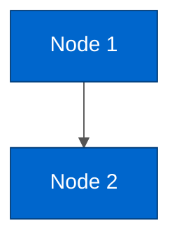

# [Document Title]

---

## Table of Contents

- [Overview](#overview)
- [Section 1](#section-1)
- [Section 2](#section-2)
- [Glossary](#glossary)
- [Related Documentation](#related-documentation)

---

## Overview

[High-level introduction to the topic. What is this component/module/system?]

### Subsection

[Additional context or details]

---

## [Main Content Sections]

[Each major section should:]
- Use `##` for top-level sections
- Use `###` for subsections
- Use `####` for sub-subsections
- Include Mermaid diagrams where appropriate with:
  - Semantic colors (same type = same color)
  - Color legend after each diagram
  - WCAG AA compliant text contrast
  - Transparent edge labels
  - Proper line colors for dark/light mode

**Example Mermaid diagram structure:**



**Color Legend:**
- **Blue** - Node type description
- **Green** - Another type
- **Orange** - Another type

---

## [Additional Sections]

[Continue with content-specific sections]

---

## Glossary

| Term | Definition |
|------|------------|
| **Term 1** | Definition of term 1 |
| **Term 2** | Definition of term 2 |
| **Term 3** | Definition of term 3 |

---

## Related Documentation

**Architecture:**
- [Related Architecture Doc 1](./OTHER_DOC.md)

**Guides:**
- [Testing Guide](../guides/TESTING_GUIDE.md)
- [Cypress Guide](../guides/CYPRESS_GUIDE.md)
- [Design Guide](../guides/DESIGN_GUIDE.md)

**API:**
- [React Query Patterns](../api/REACT_QUERY_PATTERNS.md)

**Technical:**
- [Technical Stack](../technical/TECHNICAL_STACK.md)

---

## Template Rules

### Document Structure

1. **Frontmatter** - YAML block at top between `---` delimiters
2. **Title** - Single H1 matching frontmatter title
3. **Separator** - Triple dash (`---`) after title
4. **Table of Contents** - Bullet list with anchor links
5. **Separator** - Triple dash after TOC
6. **Main Content** - Sections as needed
7. **Glossary** - Always before Related Documentation
8. **Separator** - Triple dash before Related Documentation
9. **Related Documentation** - Last section, grouped by category

### Formatting Conventions

**Headers:**
- H1 (`#`) - Document title only (one per document)
- H2 (`##`) - Major sections
- H3 (`###`) - Subsections
- H4 (`####`) - Sub-subsections (use sparingly)

**Separators:**
- Use `---` to separate major sections
- Always add separator before and after TOC
- Always add separator before Glossary
- Always add separator before Related Documentation

**Frontmatter:**
- YAML format between `---` delimiters at top of file
- Required fields: title, author, last_updated, purpose, audience, maintained_at
- Use double quotes for string values
- Date format: YYYY-MM-DD

**Lists:**
- Use `-` for unordered lists (NOT `*` or `+`)
- Use `1.`, `2.`, `3.` for ordered lists
- Maintain consistent indentation (2 spaces)

**Code Blocks:**
- Always specify language: ` ```typescript `, ` ```bash `, ` ```json `
- Use syntax highlighting when available

**Links:**
- Internal docs: Relative paths from current file
- Only link to documents that exist (no TODO markers)
- External links: Use full URLs
- Reference to `.tasks/` directory: **NEVER** - integrate content instead

**Tables:**
- Use pipe-delimited format with header row
- Align columns with separators
- Bold important terms in first column

**Mermaid Diagrams:**
- Always include `%%{init: ...}%%` theme configuration
- Set `edgeLabelBackground: 'transparent'`
- Set `lineColor: '#555555'` for dark mode compatibility
- Use semantic colors (same type = same color)
- Add color legend after every diagram
- WCAG AA compliant (4.5:1 contrast minimum for text)

### Content Conventions

**Glossary:**
- Required section
- Alphabetical order preferred but not mandatory
- Bold terms in first column
- Concise definitions in second column

**Related Documentation:**
- Required section
- Group by category: Architecture, Guides, API, Technical
- Bold category labels
- Use relative paths
- Only link to existing documents (no TODO markers or broken links)

**Cross-References:**
- Use descriptive link text, not "click here"
- Include file paths for code references
- Example: `src/modules/Workspace/hooks/useWorkspaceStore.ts`

**Avoiding `.tasks/` References:**
- Documentation should be self-contained
- Integrate any necessary content from task documentation
- Reference only permanent docs in `docs/`
- External resources (MIRO, external sites) can be mentioned but should not be required reading

---

## Frontmatter Fields

All documents MUST include these frontmatter fields at the top:

- **title** - Document title (matches H1)
- **author** - Document author or team (e.g., "Edge Frontend Team", "Nicolas Van Labeke")
- **last_updated** - Last update date in YYYY-MM-DD format
- **purpose** - One-sentence description of what the document covers
- **audience** - Who should read this (e.g., "Frontend Developers", "AI Agents", "New Team Members")
- **maintained_at** - File path where document lives (e.g., "docs/architecture/OVERVIEW.md")
