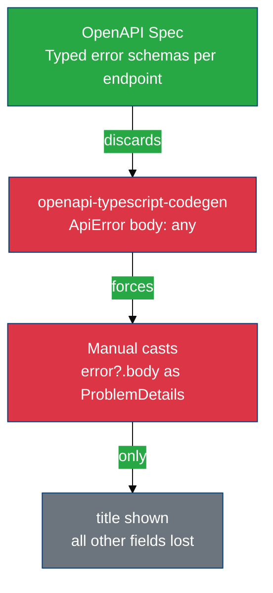
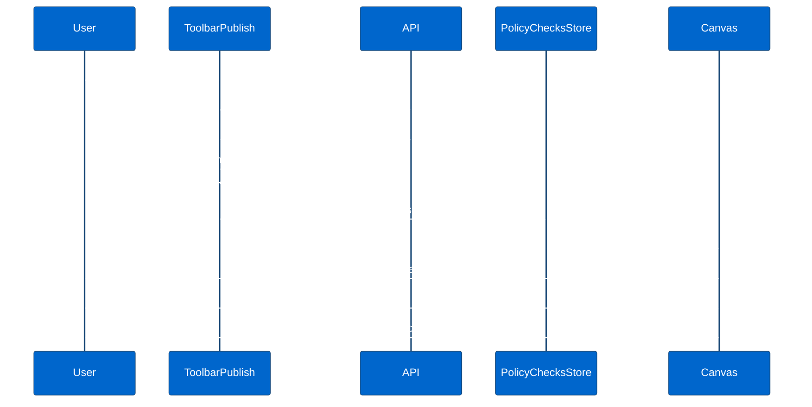

# Problem Detail (RFC 9457) Frontend Integration Analysis

**Analysis Date:** February 2026
**Task:** 34055-problem-detail-analysis
**Backend Reference:** PR #993 (DataHub Problem Detail backend work)
**Standards Reference:** RFC 9457 (supersedes RFC 7807)

---

## Table of Contents

- [Executive Summary](#executive-summary)
- [The Problem Detail Standard (RFC 9457)](#the-problem-detail-standard-rfc-9457)
- [Backend Work Done](#backend-work-done)
- [Current Frontend State](#current-frontend-state)
  - [The Generator Limitation](#the-generator-limitation)
  - [Custom ProblemDetails Type](#custom-problemdetails-type)
  - [Error Handling Components](#error-handling-components)
  - [Error Handling Patterns](#error-handling-patterns)
  - [Affected Component Inventory](#affected-component-inventory)
- [What a Capable Generator Produces](#what-a-capable-generator-produces)
- [Gap Analysis](#gap-analysis)
- [Migration Proposal](#migration-proposal)
  - [Phase 1 — Switch the Code Generator](#phase-1--switch-the-code-generator)
  - [Phase 2 — Type Alignment and Normalizer](#phase-2--type-alignment-and-normalizer)
  - [Phase 3 — Production Toast Component](#phase-3--production-toast-component)
  - [Phase 4 — Rich Error Navigation (DataHub)](#phase-4--rich-error-navigation-datahub)
- [Metrics and Scope](#metrics-and-scope)
- [Risks and Dependencies](#risks-and-dependencies)
- [Glossary](#glossary)
- [Related Documentation](#related-documentation)

---

## Executive Summary

The backend has applied RFC 9457 to the DataHub domain (PR #993). The frontend **cannot leverage any of these improvements** because the root cause is in the toolchain, not the application code: the current code generator (`openapi-typescript-codegen`) produces `body: any` for all error responses — it ignores the typed error schemas defined in the OpenAPI spec entirely.

**Switching the code generator is the foundational prerequisite for the entire migration.**

A prototype using `@hey-api/openapi-ts` was used to assess what the generated output would look like — the results confirm that a capable generator can produce per-operation discriminated error unions with full TypeScript narrowing. This is the evidence base for the migration plan. The prototype is not a deliverable.

### Scorecard

| Dimension | Current State | After Phase 1 (Generator) | After Phase 4 (Full) |
|-----------|--------------|---------------------------|----------------------|
| Error body type | `any` (generator limitation) | Per-operation discriminated unions | Per-operation discriminated unions |
| RFC 9457 `type` URI used for logic | Never | Available but not wired | Node highlighting + path navigation |
| RFC 9457 `detail` in UI | Only `title` shown | Available | Production toast |
| `errors[]` sub-causes rendered | Partial, wrong field names | Available | Typed sub-cause rendering |
| Correlation `code` surfaced | No | Available | Shown in support section |
| Backend domains using RFC 9457 | DataHub only | DataHub only | DataHub only (others TBD) |

### Key Findings

1. **Root cause is the generator.** `openapi-typescript-codegen` does not process `responses` error schemas. Every consumer of `ApiError.body` is working around a toolchain gap, not a code quality problem.
2. **The OpenAPI spec is ahead of the generator.** The spec already defines per-endpoint error schemas with full discriminated unions. The generator discards this information.
3. **DataHub is the only backend domain with RFC 9457.** Bridges, Protocol Adapters, Workspace, and all other modules still receive old-format errors. The migration must handle both formats in parallel.
4. **Two layers of technical debt in the UI.** Beyond the generator: `useEdgeToast` accesses non-existent RFC fields (`body.message`, `errors[].fieldName`), and `ApiErrorToastDevMode` is explicitly marked dev-only.
5. **DataHub has the richest requirements.** Typed validation errors with `path` fields could drive node highlighting in the policy canvas — but only after the generator switch.

---

## The Problem Detail Standard (RFC 9457)

RFC 9457 (October 2023, supersedes RFC 7807) defines `application/problem+json` as the standard media type for machine-readable error details in HTTP APIs.

### Required and Optional Fields

| Field | Required | Type | Description |
|-------|----------|------|-------------|
| `type` | No (default: `about:blank`) | URI string | Identifies the problem type; **must be stable per type** |
| `title` | No | string | Short human-readable summary; **same for all occurrences of the same type** |
| `detail` | No | string | Human-readable explanation **specific to this occurrence** |
| `status` | No | integer | HTTP status code (informational only) |
| `instance` | No | URI string | URI identifying this specific occurrence |

### Key Rules

1. `type` is a URI — it identifies the *problem type*, not this occurrence. Clients may use it for programmatic logic.
2. `detail` must not be machine-parseable. It is for human display only — never extract field paths from it.
3. Extension members are allowed. Fields like `code` (correlation ID) and `errors` (sub-causes array) are standard extensions.
4. Multiple causes use an `errors` extension array, where each element is a `ProblemDetailCause` with its own `type`, `title`, `detail`, `path`.

### Minimum Viable Toast

Two fields are sufficient for a production-quality error message: `title` (what went wrong) and `detail` (specific explanation for this occurrence). Both are now guaranteed to be proper user-facing strings in domains where RFC 9457 has been applied.

---

## Backend Work Done

PR #993 applied RFC 9457 to the DataHub domain only. **No other backend domain has been updated.**

### Improved Payload Structure

**Before (still current for all non-DataHub endpoints):**
```json
{
  "type": "DataPolicyInvalid",
  "title": "DataPolicy is invalid",
  "detail": "DataPolicy failed validation",
  "status": 400,
  "errors": [
    {
      "detail": "Illegal value",
      "parameter": "produced by policy validation: Field '…schemaVersion' has illegal value 'fddf'."
    }
  ]
}
```

Issues: `type` is not a URI; `detail` is a generic repeat of the title; `errors[].parameter` embeds machine-parseable path strings inside prose.

**After (DataHub RFC 9457 compliant):**
```json
{
  "type": "https://hivemq.com/edge/api/model/DataPolicyInvalid",
  "title": "DataPolicy is invalid",
  "detail": "The data policy cannot be validated because two requirements are not met",
  "status": 400,
  "code": "573ac428-ec14-4fd5-8135-806cedb81041",
  "errors": [
    {
      "type": "https://hivemq.com/edge/api/model/FunctionDependency",
      "title": "A function is missing in the pipeline",
      "detail": "If 'Serdes.deserialize' is present, 'Serdes.serialize' must be present as well.",
      "path": "$.onSuccess.pipeline[0].functionId",
      "condition": "Serdes.deserialize",
      "dependencies": ["Serdes.serialize"],
      "rule": "policy-validation-function-dependency"
    }
  ]
}
```

### New DataHub Error Types Defined in OpenAPI

| Error Type | Extension Fields | Scenario |
|------------|-----------------|----------|
| `BehaviorPolicyInvalidErrors` | `childErrors[]` of `BehaviorPolicyValidationError` | Behavior policy validation |
| `BehaviorPolicyAlreadyPresentError` | `id` | Duplicate policy |
| `MissingFieldValidationError` | `path` | Missing mandatory field |
| `InvalidFieldValueValidationError` | `path`, `value?` | Invalid value at path |
| `AtLeastOneFieldMissingValidationError` | `paths[]` | One-of field set |
| `AtMostOneFunctionValidationError` | `function`, `occurrences`, `paths[]` | Pipeline function overuse |
| `FunctionMustBePairedValidationError` | `existingFunction`, `missingFunction` | Pipeline function dependency |
| `EmptyFieldValidationError` | `path` | Empty required field |
| `InvalidFunctionOrderValidationError` | `function`, `path`, `previousFunction` | Pipeline ordering |
| `InvalidIdentifierValidationError` | `path`, `value` | Invalid identifier |
| `UnknownVariableValidationError` | `path`, `variables[]` | Unknown interpolation variable |
| `InvalidSchemaVersionValidationError` | `id`, `version` | Invalid schema reference |

All of this is expressed in the OpenAPI spec. The current generator ignores it.

---

## Current Frontend State

### The Generator Limitation

**This is the primary blocker for everything else.**

The application uses `openapi-typescript-codegen`. This generator does not process the `responses` error schemas from the OpenAPI spec. For every API call, errors arrive as a generic `ApiError` class:

```typescript
// src/api/__generated__/core/ApiError.ts
export class ApiError extends Error {
  public readonly url: string;
  public readonly status: number;
  public readonly statusText: string;
  public readonly body: any;    // ← always any; generator limitation
  public readonly request: ApiRequestOptions;
}
```

The OpenAPI spec defines rich, typed error schemas per operation — discriminated unions by status code, with specific error type URIs. The generator **discards all of this** and produces `body: any`.

This means:
- TypeScript cannot narrow on the error `type` URI
- Consumers must guess at fields and cast manually
- The `@deprecated` `errors` array with `parameter` fields is the only error detail available
- No per-operation error typing exists

The consequence is visible in every module: `error?.body as ProblemDetails` is a cast to a manually-maintained type, not a generated type. Any mismatch between the cast and the actual payload is invisible to TypeScript.

The generated `ProblemDetails` model from the old generator:
```typescript
// src/api/__generated__/models/ProblemDetails.ts
export type ProblemDetails = {
  code?: string;
  detail?: string;
  errors?: Array<Error>;   // @deprecated
  status?: number;
  title: string;
  type?: string;           // just a string, not a URI-typed discriminator
};

export type Error = {
  detail: string;
  parameter?: string;      // Non-standard: embeds machine-parseable paths in prose
};
```

### Custom ProblemDetails Type

A hand-crafted supplement at `src/api/types/http-problem-details.ts` was added to bridge the gap:
```typescript
export interface ProblemDetails {
  detail?: string
  instance?: string
  status: number
  title: string
  type?: string
}

export type ProblemDetailsExtended = ProblemDetails & Record<string, unknown>
```

This is closer to RFC 9457 but does not match the generated model (different `status` requiredness, no `code`), has no typed extension fields, and exists only because the generator cannot produce something useful.

### Error Handling Components

#### `ApiErrorToastDevMode` — explicitly dev-only

```typescript
// src/extensions/datahub/components/helpers/ApiErrorToastDevMode.tsx
/**
 * A dev-only wrapper for error messages that are not properly formatted as Problem Details
 * @todo DO NOT USE IN PRODUCTION
 */
const ApiErrorToastDevMode: FC<ApiErrorToastDevModeProps> = ({ message, body }) => {
  // renders body.detail and body.errors[].detail + body.errors[].parameter
}
```

The `@todo` is explicit: this was written knowing it is a stopgap. It renders the old `errors[].parameter` field which contains machine-parseable strings. It is used in `ToolbarPublish` — the main DataHub publish flow.

#### `PolicyErrorReport`

Used in the DataHub dry-run report. It renders `ProblemDetailsExtended[]` with `title`, `detail`, and node action buttons (fit view, open config). These are **local** validation errors manufactured in `validation.errors.ts` — not API response errors. The pattern is correct but operates entirely on client-side constructed objects.

#### `useEdgeToast`

```tsx
// src/hooks/useEdgeToast/useEdgeToast.tsx
const errorToast = (options, err) => {
  const { body } = err as ApiError
  // ...
  {body && body.message && <Text>{body.message}</Text>}         // ← not in RFC 9457
  {body?.errors?.map((e: ProblemDetailsExtended) => (
    <Text key={e.fieldName as string}>                          // ← not in RFC 9457
      {e.fieldName as string} : {e.detail || e.title}
    </Text>
  ))}
}
```

`body.message` and `body.errors[].fieldName` do not exist in RFC 9457. These appear to be vestiges of a previous custom error format that was replaced by `ProblemDetails`. This code path silently renders nothing for RFC-compliant errors.

### Error Handling Patterns

**Pattern A — Title-only (most of the app):**
```tsx
// Used in: Bridges, ProtocolAdapters, Pulse, Workspace wizard, UnifiedNamespace
message={(error?.body as ProblemDetails)?.title || t('module.error.loading')}
```
Only `title` is shown. `detail`, `errors[]`, and `code` are discarded. Manual cast required.

**Pattern B — Full body with dev component (DataHub publish only):**
```tsx
// Used in: ToolbarPublish
if (error instanceof ApiError) {
  message = error.message
  description = error.body as ProblemDetails
}
manageToast(id, {
  description: <ApiErrorToastDevMode body={description} message={message} />
})
```
Uses the dev-only component. The best the app currently does.

### Affected Component Inventory

| File | Pattern | RFC 9457 Fields Used | Status |
|------|---------|---------------------|--------|
| `Bridges.tsx` | A | `title` only | Pattern A |
| `BridgeTable.tsx` | A | `title` only | Pattern A |
| `ProtocolAdapters.tsx` | A | `title` only | Pattern A |
| `ProtocolIntegrationStore.tsx` | A | `title` only | Pattern A |
| `WizardProtocolSelector.tsx` | A | `title` only | Pattern A |
| `AssetsTable.tsx` | A | `title` only | Pattern A |
| `UnifiedNamespacePage.tsx` | A | `title` only | Pattern A |
| `ToolbarPublish.tsx` | B | `body` cast, dev-only | Dev-only |
| `ScriptEditor.tsx` | Generic | `error.message` | No RFC fields |
| `SchemaEditor.tsx` | Generic | `error.message` | No RFC fields |
| `useEdgeToast.tsx` | Utility | `body.message`, `fieldName` | Non-RFC fields |
| `ApiErrorToastDevMode.tsx` | Dev | `detail`, `errors[].parameter` | Dev-only |

---

## What a Capable Generator Produces

To evaluate what a generator switch would provide, the OpenAPI spec was processed with `@hey-api/openapi-ts`. This was done as a **proof-of-concept analysis only** — the output is not a deliverable.

The key contrast:

**Current generator:** For `createBehaviorPolicy`, the error type is `ApiError` with `body: any`.

**Capable generator:** For `createBehaviorPolicy`, the error types are:
```typescript
type CreateBehaviorPolicyErrors = {
  400: BehaviorPolicyCreationFailureError
      | BehaviorPolicyInvalidErrors
      | BehaviorPolicyRejectedError
      | RequestBodyMissingError;
  409: BehaviorPolicyAlreadyPresentError;
  500: InternalServerError;
  503: TemporaryNotAvailableError;
  507: PolicyInsufficientStorageError;
};

type BehaviorPolicyAlreadyPresentError = Omit<ApiProblemDetails, 'type'> & {
  id: string;
  type: 'https://hivemq.com/edge/api/model/BehaviorPolicyAlreadyPresentError';
};

type BehaviorPolicyInvalidErrors = Omit<ApiProblemDetails, 'type'> & {
  childErrors: Array<BehaviorPolicyValidationError>;
  type: 'https://hivemq.com/edge/api/model/BehaviorPolicyInvalidErrors';
};
```

TypeScript can then narrow on the `type` URI literal:
```typescript
// TypeScript narrowing becomes possible:
if (error.type === 'https://hivemq.com/edge/api/model/BehaviorPolicyAlreadyPresentError') {
  // TypeScript knows: error.id is the conflicting policy id
}
```

This is what the OpenAPI spec already defines. The current generator simply does not generate it.

The generator switch also changes the HTTP client from the bespoke `HiveMqClient` to an Axios-based client, and React Query integration is generated directly — both of which are separate migration concerns that overlap with the Chakra v3 migration planning (see [Chakra V3 Migration Analysis](./CHAKRA_V3_MIGRATION.md)).

---

## Gap Analysis



### Gap 1 — Generator Cannot Produce Error Types (Critical / Root Cause)

**Current:** `openapi-typescript-codegen` ignores `responses` error schemas. All errors are `body: any`.
**Required:** A generator that produces per-operation error type unions from the OpenAPI spec.
**Impact:** All other gaps are downstream of this one.

### Gap 2 — Non-Standard Field Access in `useEdgeToast` (High)

**Current:** Reads `body.message` and `body.errors[].fieldName` — neither exists in RFC 9457.
**Required:** Use `title`, `detail`, and `errors[].detail` as per the spec.
**Impact:** The error description silently renders nothing for RFC-compliant responses from DataHub.

### Gap 3 — Dev-Only Toast Component in Production Flow (High)

**Current:** `ApiErrorToastDevMode` is in the DataHub publish flow but is explicitly `@todo DO NOT USE IN PRODUCTION`.
**Required:** A production-ready error component using `title`, `detail`, `errors[]`, and `code`.
**Unblocked by:** Phase 1 (generator switch) — even before the switch, `title` and `detail` are accessible via the existing cast.

### Gap 4 — `errors[]` Sub-causes Not Rendered in Production (Medium)

**Current:** Sub-cause `errors[]` are either ignored (Pattern A) or shown via dev component (Pattern B).
**Required:** Expandable sub-causes section using RFC-compliant fields.
**Unblocked by:** Phase 1 — typed `errors[]` become accessible after generator switch.

### Gap 5 — No `type` URI Logic in DataHub (Medium)

**Current:** The `type` URI is never used to drive UI behavior.
**Target for DataHub:** Narrowing on `type` enables mapping `path` fields to React Flow node IDs.
**Unblocked by:** Phase 1 — discriminated unions require typed errors.

### Gap 6 — Backend Rollout is DataHub-Only (Scope)

**Current:** Only DataHub endpoints return RFC 9457 responses. Bridges, Protocol Adapters, Workspace, and all other domains still return the old format.
**Impact:** The normalizer utility (Phase 2) must handle both formats in parallel. Pattern A components (`title` only) are adequate for non-DataHub domains during transition.
**Risk:** If Pattern A components are upgraded to show `detail` before the backend has set proper `detail` strings, degraded UX will result.

### Gap 7 — `code` Correlation ID Not Surfaced (Low)

**Current:** The `code` field (correlation ID for backend log lookup) is never shown to users.
**Required:** Show in a collapsible "Support details" section of the error toast.
**Unblocked by:** Phase 3.

---

## Migration Proposal

The migration has four phases. Phase 1 is the **prerequisite for all others** and the most significant engineering investment. Phases 2–4 can be developed in preparation but are only fully realised after Phase 1.


### Phase 1 — Switch the Code Generator

**Objective:** Replace `openapi-typescript-codegen` with a generator capable of producing typed error responses from the OpenAPI spec.

**This is the largest, most consequential phase.** It is not purely an error handling concern — it changes the generated HTTP client, the React Query integration, the enum representation, and the import paths for all generated types. It should be planned as a distinct engineering task, potentially sequenced with or after the Chakra v3 migration (see [Chakra V3 Migration Analysis](./CHAKRA_V3_MIGRATION.md)).

**Expected output from the new generator, per operation:**
- A `{Operation}Errors` type mapping HTTP status codes to specific error types
- A `{Operation}Error` union type (all status codes flattened)
- Each error type having a literal `type` URI string TypeScript can narrow on
- Extension fields (like `path`, `childErrors[]`) fully typed per error shape

#### 1a. Enum Representation Change

This is the most pervasive breaking change in the migration.

**Old generator** produces TypeScript `enum` or namespace enums for any OpenAPI `enum` field:
```typescript
// Standalone enum
export enum PolicyType {
  DATA_POLICY = 'DATA_POLICY',
  BEHAVIOR_POLICY = 'BEHAVIOR_POLICY',
}

// Namespace enum (nested per model)
export namespace Status {
  export enum connection {
    CONNECTED = 'CONNECTED',
    DISCONNECTED = 'DISCONNECTED',
    STATELESS = 'STATELESS',
    UNKNOWN = 'UNKNOWN',
    ERROR = 'ERROR',
  }
  export enum runtime {
    STARTED = 'STARTED',
    STOPPED = 'STOPPED',
  }
}
```

**New generator** produces string union types instead:
```typescript
export type PolicyType = 'DATA_POLICY' | 'BEHAVIOR_POLICY';

// Inline within the parent type — no namespace
export type Status = {
  connection?: 'CONNECTED' | 'DISCONNECTED' | 'STATELESS' | 'UNKNOWN' | 'ERROR';
  runtime?: 'STARTED' | 'STOPPED';
  // ...
};
```

**Impact:** ~174 references across production code and test utilities must be updated. The mapping is mechanical but cannot be scripted without case-by-case review:

| Old | New |
|-----|-----|
| `Status.connection.CONNECTED` | `'CONNECTED'` |
| `Status.runtime.STOPPED` | `'STOPPED'` |
| `Script.functionType.TRANSFORMATION` | `'TRANSFORMATION'` |
| `PolicyType.DATA_POLICY` | `'DATA_POLICY'` |
| `QoS.AT_MOST_ONCE` | `'AT_MOST_ONCE'` |

**Namespaces with enum sub-types to migrate:**

| Old Namespace | Enum Members | Production Refs |
|---------------|-------------|-----------------|
| `Status.connection` | 5 values | ~15 (incl. `ConnectionStatusBadge`) |
| `Status.runtime` | 2 values | ~12 |
| `Script.functionType` | 1 value | 3 |
| `BridgeSubscription.maxQoS` | 3 values | ~5 |
| `Notification.level` | 4 values | ~5 |
| `StatusTransitionCommand.command` | 2 values | ~5 |
| `PulseStatus.activation` | 2 values | ~3 |
| `PulseStatus.runtime` | 3 values | ~3 |
| `Capability.id` | ~10 values | ~5 |
| `Event.severity` | 4 values | ~5 |
| `DataPolicyValidator.type` | 2 values | ~5 |
| `TypeIdentifier.type` | ~5 values | ~3 |
| Standalone: `PolicyType` | 2 values | ~15 |
| Standalone: `QoS` | 3 values | ~8 |
| Standalone: `EntityType` | 5 values | ~5 |
| Standalone: `BehaviorPolicyTransitionEvent` | ~8 values | ~8 |

**Secondary breakage — DataHub enum composition:**

DataHub `types.ts` extends from `PolicyType` as an enum value source:
```typescript
// Current — works because PolicyType is a real TypeScript enum
export enum DesignerPolicyType {
  DATA_POLICY = PolicyType.DATA_POLICY,      // 'DATA_POLICY'
  BEHAVIOR_POLICY = PolicyType.BEHAVIOR_POLICY,  // 'BEHAVIOR_POLICY'
  CREATE_POLICY = 'CREATE_POLICY',
}
```

With `PolicyType` as a string union (`'DATA_POLICY' | 'BEHAVIOR_POLICY'`), TypeScript enum members cannot be initialised from string union values. `DesignerPolicyType` would need to be converted to a const object or have its values hardcoded:
```typescript
// After migration — options
export const DesignerPolicyType = {
  DATA_POLICY: 'DATA_POLICY',
  BEHAVIOR_POLICY: 'BEHAVIOR_POLICY',
  CREATE_POLICY: 'CREATE_POLICY',
} as const;
export type DesignerPolicyType = typeof DesignerPolicyType[keyof typeof DesignerPolicyType];
```

This cascades to the ~25 files that use `DesignerPolicyType` as a TypeScript enum in switch statements and comparisons.

**Computed key patterns lose type safety:**

```typescript
// Current — object key indexed by enum, fully type-safe
const statusMap = {
  [Status.runtime.STOPPED]: { text: 'STOPPED', color: 'status.error' },
  [Status.connection.ERROR]: { text: 'ERROR', color: 'status.error' },
  [Status.connection.CONNECTED]: { text: 'CONNECTED', color: 'status.connected' },
  // ...
}
```

With string union types, computed key indexing loses exhaustiveness checking. The values (`'STOPPED'`, `'ERROR'`) are still correct strings but TypeScript cannot verify that all union members are covered. A `satisfies Record<Status['connection'], ...>` annotation can partially restore this.

#### 1b. React Query Pattern Change

**Current pattern:** All hooks are hand-written. They use a single injectable `HiveMqClient` instance (organised into service namespaces: `.bridges`, `.protocolAdapters`, `.dataHub`, etc.). The client is configured once in `useHttpClient()` with auth interceptors, timeout, and 401-redirect handling.

```typescript
// Current hook structure
export const useListBridges = () => {
  const appClient = useHttpClient()         // single client instance
  return useQuery<Bridge[], ApiError>({
    queryKey: [QUERY_KEYS.BRIDGES],
    queryFn: async () => {
      const { items } = await appClient.bridges.getBridges()  // namespaced service
      return items
    },
  })
}

export const useDeleteBridge = () => {
  const appClient = useHttpClient()
  const queryClient = useQueryClient()
  return useMutation<string, ApiError, string>({
    mutationFn: (name) => appClient.bridges.removeBridge(name),
    onSuccess: () => queryClient.invalidateQueries({ queryKey: [QUERY_KEYS.BRIDGES] }),
  })
}
```

**New generator pattern:** Flat named SDK functions (no namespace grouping). Generated `queryOptions()` factories for queries. Mutations still need manual `useMutation` wrappers. Cache invalidation remains manual.

```typescript
// New generator — SDK functions are flat named exports
import { getBridges, removeBridge } from '@/api/__generated__/sdk.gen'
import { getBridgesOptions } from '@/api/__generated__/@tanstack/react-query.gen'

// Query: can use generated queryOptions directly
const { data } = useQuery(getBridgesOptions())

// Mutation: still hand-written, but with typed error
export const useDeleteBridge = () => {
  const queryClient = useQueryClient()
  return useMutation<RemoveBridgeResponse, AxiosError<RemoveBridgeError>, string>({
    mutationFn: (bridgeId) => removeBridge({ path: { bridgeId }, throwOnError: true })
                                  .then(r => r.data),
    onSuccess: () => queryClient.invalidateQueries({ queryKey: getBridgesQueryKey() }),
  })
}
```

**Key differences for each hook type:**

| Concern | Current | After Generator Switch |
|---------|---------|----------------------|
| Service access | `appClient.bridges.getBridges()` | `getBridges({ ...options })` |
| Query hook | `useQuery({ queryKey, queryFn })` | Can use generated `useQuery(getBridgesOptions())` |
| Query key | Manual `QUERY_KEYS` enum | Generated `getBridgesQueryKey()` function |
| Cache invalidation | `queryClient.invalidateQueries({ queryKey: [QUERY_KEYS.BRIDGES] })` | `queryClient.invalidateQueries({ queryKey: getBridgesQueryKey() })` |
| Mutation | `useMutation<T, ApiError, U>` | `useMutation<T, AxiosError<OperationError>, U>` |
| Error type | `ApiError` with `body: any` | `AxiosError<TypedErrorUnion>` |
| Auth | Axios interceptor in `useHttpClient` | Must configure on the generated Axios client |
| 401 redirect | Interceptor in `useHttpClient` | Needs equivalent interceptor on new client |

**Hook count impact:** 153 hooks in `src/api/hooks/` and 46 in `src/extensions/datahub/api/hooks/` — a total of **199 hand-written hooks** require review and migration.

Query hooks can often be replaced by the generated `queryOptions()` factories directly (if no data transformation is needed). Mutation hooks still require manual wrappers because cache invalidation logic is application-specific.

#### 1c. Types and Interfaces

The user-visible type definitions (field names, required/optional, nesting) are **substantially stable** — both generators read the same OpenAPI spec. `Bridge`, `DataPolicy`, `Adapter`, `BehaviorPolicy`, etc. have the same field structure.

**What changes:**
- Import paths: `@/api/__generated__/models/Bridge` → single `@/api/__generated__/types.gen` (or similar)
- Models that had enum sub-types (e.g. `Status.connection`) become plain string union fields inline
- `readonly` annotations may shift slightly

**What stays the same:**
- Field names
- Required vs optional semantics
- Nesting structure

**Scope:**
- All files importing from `src/api/__generated__/` must be migrated (~50+ import sites for types alone)
- All 199 hand-written hooks reviewed and migrated
- `useHttpClient()` auth interceptor logic must be reproduced on the new client
- `QUERY_KEYS` enum must be phased out in favour of generated query key functions
- MSW test handlers: request/response shape stable, but import paths for types change

**Pre-conditions:**
- Generator choice validated against the full OpenAPI spec (the analysis used `@hey-api/openapi-ts` as a probe; this is not necessarily the final choice)
- New client Axios configuration strategy agreed (auth, timeout, 401 redirect)
- Migration strategy agreed (big bang vs. incremental per module — incremental is safer but requires both clients to coexist)

---

### Phase 2 — Type Alignment and Normalizer

**Objective:** Clean up the hand-crafted `ProblemDetails` type and create a normalizer utility that works across both the old and new client during any transition period.

**Type alignment** — update `src/api/types/http-problem-details.ts`:

```typescript
export interface ProblemDetailCause {
  type?: string      // URI identifying the cause type
  title?: string     // human-readable summary
  detail: string     // specific explanation
  path?: string      // JSON path to the affected field
  rule?: string      // validation rule identifier
}

export interface ProblemDetails {
  type?: string           // URI reference — problem type
  title: string           // stable summary
  detail?: string         // occurrence-specific explanation
  status?: number         // HTTP status (informational)
  instance?: string       // URI of this specific occurrence
  code?: string           // correlation ID for backend logs
  errors?: ProblemDetailCause[]
}

export type ProblemDetailsExtended = ProblemDetails & Record<string, unknown>
```

**Normalizer utility** — extracts a `ProblemDetails` from any error shape:
```typescript
// src/api/utils/problem-details.utils.ts

export const extractProblemDetails = (error: unknown): ProblemDetails => {
  // Post-Phase-1: typed error from new client
  // Pre-Phase-1: ApiError with body: any from old client
  // Both cases: extract title/detail/errors/code as best as possible
}
```

**Scope:** 1 type file updated, 1 utility created, ~6 hooks updated.

---

### Phase 3 — Production Toast Component

**Objective:** Replace `ApiErrorToastDevMode` and fix `useEdgeToast` with production-ready components.

**New `ProblemDetailToast` component:**
```
ProblemDetailToast
├── title (always visible)
├── detail (always visible if present)
├── [expandable] errors[] sub-causes
│   └── each: cause.detail
└── [expandable] Support details
    └── code (correlation ID)
```

**Fix `useEdgeToast`:** Remove `body.message` and `body.errors[].fieldName` access; use `title`, `detail`, `errors[]` instead.

**Note on backend rollout:** For non-DataHub endpoints (still old format), `title` and `detail` may not be user-friendly strings yet. The component should degrade gracefully — show `title`, and show `detail` only if it appears to be a user-facing sentence (not the old format's machine strings). This is a UX judgement call that needs product input.

**Scope:** 1 new component, 3 file updates (useEdgeToast, ToolbarPublish, ApiErrorToastDevMode removed).

---

### Phase 4 — Rich Error Navigation (DataHub)

**Objective:** Use discriminated error types to navigate from API error to node in the React Flow canvas.

**Requires Phase 1 (generator switch)** — discriminated types are only available after the generator is replaced.

When a DataHub publish fails with `BehaviorPolicyInvalidErrors`, the `childErrors[]` contain `path` values like `$.onSuccess.pipeline[0].functionId`. These paths encode the location of the invalid element within the policy definition.

**Error → node mapping flow:**



**Design principles:**
- Error narrowing happens in the hook/handler, not in the component
- `path` → node ID resolution logic lives in `datahub/utils/error-navigation.utils.ts`
- `PolicyErrorReport` is extended to accept API response errors in addition to local validation errors
- `usePolicyChecksStore` is extended to store per-node errors from API responses

**Path encoding convention:** The `path` format (`$.onSuccess.pipeline[0].functionId`) needs to be agreed with the backend team before implementation to ensure the frontend can reliably resolve node IDs from paths.

**Scope:** 1 new utility, ~8 DataHub files updated.

---

## Metrics and Scope

### Phase Breakdown

| Phase | Files to Create | Files to Modify | Notes |
|-------|----------------|-----------------|-------|
| 1 — Generator switch | Generated output | All `__generated__` consumers (~50+) | Largest phase; separate task |
| 2 — Type alignment + normalizer | 1 utility | 1 type file + ~6 hooks | Can start before Phase 1 |
| 3 — Production toast | 1 component | 3 files | Can start before Phase 1 |
| 4 — Rich navigation | 1 utility | ~8 DataHub files | Requires Phase 1 |

### Current Error Pattern Distribution

| Pattern | Count | Modules |
|---------|-------|---------|
| A — Title only (cast) | 7 files | Bridges, ProtocolAdapters, Pulse, Workspace, UnifiedNamespace |
| B — Dev-only toast | 1 file | DataHub ToolbarPublish |
| Generic `error.message` | 2 files | DataHub ScriptEditor, SchemaEditor |
| Non-RFC field access | 1 file | `useEdgeToast` |
| Dev-only component | 1 file | `ApiErrorToastDevMode` |

### Backend RFC 9457 Rollout Status

| Domain | RFC 9457 Applied | Error Detail Quality | Frontend Impact |
|--------|-----------------|---------------------|-----------------|
| DataHub | Yes (PR #993) | `title` + `detail` proper; `errors[]` structured | Full migration target |
| Bridges | No | Old format: `type` not URI, `detail` generic | Title-only adequate for now |
| Protocol Adapters | No | Old format | Title-only adequate for now |
| Workspace / Combiners | No | Old format | Title-only adequate for now |
| Pulse / Assets | No | Old format | Title-only adequate for now |
| Auth / Core | No | Old format | Title-only adequate for now |

---

## Risks and Dependencies

| Risk | Impact | Mitigation |
|------|--------|-----------|
| Generator switch scope | Large; touches ~50+ files | Plan as dedicated task; potentially sequence with Chakra v3 |
| Two error formats in parallel | Pattern A + new DataHub format coexist | Normalizer (Phase 2) degrades gracefully |
| `detail` quality outside DataHub | Non-DataHub endpoints have machine-strings in `detail` | Only show `detail` in production for domains with RFC 9457 applied |
| `path` encoding undocumented | Phase 4 path-to-node mapping depends on backend convention | Agree `path` format with backend before implementing Phase 4 |
| `errors[]` vs `childErrors[]` | DataHub uses `childErrors[]` (typed); old format uses `errors[]` | `ProblemDetailCause` type handles both during transition |
| Generator choice not final | `@hey-api/openapi-ts` used for analysis; production choice TBD | Analysis is generator-agnostic; recommendations hold for any capable generator |

---

## Glossary

| Term | Definition |
|------|-----------|
| **RFC 9457** | IETF standard (Oct 2023) defining `application/problem+json` error format. Supersedes RFC 7807. |
| **`type` URI** | Stable URI identifying a problem type. Used as a TypeScript discriminator after Phase 1. |
| **`detail`** | Occurrence-specific, human-readable explanation. Must not be machine-parsed. |
| **`title`** | Stable human-readable summary of the problem type. Same value for all occurrences of the same type. |
| **`code`** | Extension field: correlation ID for matching this occurrence to backend logs. |
| **`ProblemDetailCause`** | A sub-error within `errors[]`, describing one cause of the top-level problem. |
| **`openapi-typescript-codegen`** | Current code generator. Does not process error schemas. Produces `ApiError` with `body: any`. |
| **Discriminated union** | TypeScript pattern using a literal field (like `type` URI) to narrow a union to a specific member. |
| **`ApiError`** | Current generated error class: `extends Error` with `body: any`. |
| **Pattern A** | Current error display pattern: title-only with manual cast. Used in 7 modules. |
| **Pattern B** | Current DataHub error display: full body via dev-only component. |
| **`BehaviorPolicyInvalidErrors`** | DataHub error type with `childErrors[]` — each child has a `path` that maps to a policy canvas node. |

---

## Related Documentation

### This Codebase

- [DataHub Architecture](../architecture/DATAHUB_ARCHITECTURE.md) — State management for policy designer; Zustand stores relevant to Phase 4
- [OpenAPI Quality Review](./OPENAPI_QUALITY_REVIEW.md) — Broader API quality analysis; Part I-B covers opaque DataHub error structures
- [Chakra UI v3 Migration Analysis](./CHAKRA_V3_MIGRATION.md) — Generator switch may be sequenced with Chakra v3 migration

### Standards

- [RFC 9457 — Problem Details for HTTP APIs](https://www.rfc-editor.org/rfc/rfc9457) (October 2023)
- [RFC 7807 — Problem Details for HTTP APIs](https://www.rfc-editor.org/rfc/rfc7807) (March 2016, superseded)

### Key Source Files

- `src/api/types/http-problem-details.ts` — Current custom ProblemDetails type (Phase 2 target)
- `src/api/__generated__/core/ApiError.ts` — Generator output: `body: any`
- `src/api/__generated__/models/ProblemDetails.ts` — Generator output: deprecated `errors[]`
- `src/extensions/datahub/components/helpers/ApiErrorToastDevMode.tsx` — Dev-only component (Phase 3 target)
- `src/hooks/useEdgeToast/useEdgeToast.tsx` — Non-RFC field access (Phase 3 target)
- `src/extensions/datahub/components/toolbar/ToolbarPublish.tsx` — DataHub publish + error handling (Phase 3+4 target)
- `src/extensions/datahub/designer/validation.errors.ts` — Local validation error constructors (Phase 4 context)
