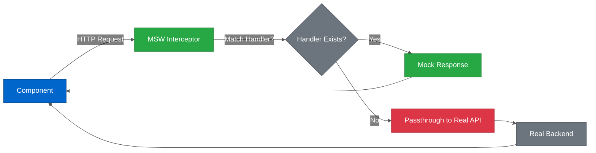

# MSW API Mocking

---

## Table of Contents

- [Overview](#overview)
- [Architecture](#architecture)
- [Setup](#setup)
- [Handler organization](#handler-organization)
- [Mock data patterns](#mock-data-patterns)
- [Testing patterns](#testing-patterns)
- [Cypress integration](#cypress-integration)
- [Debugging](#debugging)
- [Advanced patterns](#advanced-patterns)
- [Best practices](#best-practices)
- [Common pitfalls](#common-pitfalls)
- [Checklist: adding new MSW handlers](#checklist-adding-new-msw-handlers)
- [Glossary](#glossary)
- [Related documentation](#related-documentation)

---

## Overview

HiveMQ Edge frontend uses **Mock Service Worker (MSW)** for API mocking in tests. MSW intercepts network requests at the network level, allowing tests to run without a real backend.

**Benefits:**

- **Realistic testing** - Intercepts actual `fetch` calls (not mocked functions)
- **Fast execution** - No network latency, instant responses
- **Deterministic tests** - Consistent mock data prevents flaky tests
- **Error simulation** - Easy to test error states and edge cases

**Scope:** MSW is used for **Vitest unit and hook tests only**. Cypress component and E2E tests use `cy.intercept()`. See [Cypress Integration](#cypress-integration).

**Version:** msw ^2.x (latest)

---

## Architecture

### How MSW Works



**Color Legend:**
- **Blue** - UI Component
- **Green** - MSW Interceptor and Mock Response
- **Gray** - Decision Point and Real Backend
- **Red** - Passthrough (no mock)

---

## Setup

### Test setup

MSW is already installed. The server lifecycle (start / reset / close) runs automatically for all Vitest tests via `src/__test-utils__/setup.ts`. No per-test setup is required — import mock data and write assertions.

**Source:** `src/__test-utils__/setup.ts` — uses `onUnhandledRequest: 'warn'` so missing handlers surface in the console without failing the suite.

---

## Handler organization

### Colocated Handlers Pattern

**Convention:** MSW handlers live in `__handlers__/` subdirectory next to the hook they mock.

**Directory structure:**

```
src/api/hooks/
├── useProtocolAdapters/
│   ├── useGetAllProtocolAdapters.ts          # Hook
│   ├── useGetAllProtocolAdapters.spec.ts     # Test
│   ├── useCreateProtocolAdapter.ts           # Hook
│   ├── useCreateProtocolAdapter.spec.ts      # Test
│   └── __handlers__/
│       └── index.ts                          # MSW handlers
├── useCombiners/
│   ├── useListCombiners.ts
│   ├── useListCombiners.spec.ts
│   ├── useCreateCombiner.ts
│   ├── useCreateCombiner.spec.ts
│   └── __handlers__/
│       └── index.ts
└── ...
```

**Benefits:**

- **Easy to find** - Handlers live next to hooks they support
- **Scoped mocks** - Each feature has its own handlers
- **Maintainability** - Changes to API hooks suggest checking handlers

---

### Handler Structure

**Pattern:** Export array of HTTP handlers.

```typescript
// src/api/hooks/useProtocolAdapters/__handlers__/index.ts
import { http, HttpResponse } from 'msw'
import type { Adapter, AdaptersList } from '@/api/__generated__'
import { mockAdapter } from '@/__test-utils__/adapters'

export const handlers = [
  http.get('*/protocol-adapters/adapters', () => {
    return HttpResponse.json<AdaptersList>({ items: [mockAdapter] }, { status: 200 })
  }),

  http.get('*/protocol-adapters/adapters/:adapterId', ({ params }) => {
    return HttpResponse.json<Adapter>(
      { ...mockAdapter, id: params.adapterId as string },
      { status: 200 }
    )
  }),

  // POST/PUT/DELETE follow the same pattern — see source file
]
```

**Key points:**

- **Type responses** - Use TypeScript generics for `HttpResponse.json<T>()`
- **Wildcard URLs** - `*/path` matches any base URL
- **Path parameters** - Extract from `params` object
- **Status codes** - Second argument to `HttpResponse.json()`

---

### Central handler registration

**Pattern:** Aggregate handlers from all modules.

**Source files:**

- `src/__test-utils__/msw/handlers.ts` — imports handler arrays from each feature module and exports `createInterceptHandlers()`
- `src/__test-utils__/msw/mockServer.ts` — creates the MSW server: `setupServer(...createInterceptHandlers())`

**To add a new feature:** import its handler array into `handlers.ts` and spread it into `createInterceptHandlers()`.

---

## Mock data patterns

### Centralized Mock Data

**Convention:** Shared mock data lives in `src/__test-utils__/`. Each adapter type has its own file.

```typescript
// src/__test-utils__/adapters/simulation.ts (abbreviated)
export const MOCK_ADAPTER_ID = 'simulation-1'

export const mockProtocolAdapter: ProtocolAdapter = {
  id: 'simulation',
  protocol: 'Simulation',
  // ...see source for full definition
}

export const mockAdapter: Adapter = {
  id: MOCK_ADAPTER_ID,
  type: 'simulation',
  status: {
    connection: Status.connection.CONNECTED,
    runtime: Status.runtime.STARTED,
  },
  // ...see source for full definition
}
```

**Source:** `src/__test-utils__/adapters/` — one file per adapter type. Mock data is typed against generated models for compile-time safety.

---

### Factory Functions

**Pattern:** Generate dynamic mock data with per-test overrides.

```typescript
export const createMockAdapter = (overrides?: Partial<Adapter>): Adapter => ({
  id: 'test-adapter',
  type: 'simulation',
  config: {},
  status: { connection: Status.connection.CONNECTED, runtime: Status.runtime.STARTED },
  ...overrides,
})

// Usage
const errorAdapter = createMockAdapter({
  status: { connection: Status.connection.ERROR, message: 'Connection failed' },
})
```

---

## Testing patterns

### Basic Handler Usage

**Test file structure:**

```typescript
// src/api/hooks/useProtocolAdapters/useGetAllProtocolAdapters.spec.ts
import { renderHook, waitFor } from '@testing-library/react'
import { describe, it, expect } from 'vitest'
import { useGetAllProtocolAdapters } from './useGetAllProtocolAdapters'
import { wrapper } from '@/__test-utils__/hooks/SimpleWrapper'

describe('useGetAllProtocolAdapters', () => {
  it('should fetch all adapters', async () => {
    const { result } = renderHook(() => useGetAllProtocolAdapters(), { wrapper })

    await waitFor(() => expect(result.current.isSuccess).toBe(true))

    expect(result.current.data?.items).toHaveLength(1)
    expect(result.current.data?.items[0].id).toBe('simulation-1')
  })
})
```

**Wrapper provides:**

- React Query `QueryClientProvider`
- MSW handlers automatically active (via `setup.ts`)

---

### Override Handler Per Test

**Pattern:** Replace default handler for specific test case.

```typescript
import { server } from '@/__test-utils__/msw/server'
import { http, HttpResponse } from 'msw'

describe('useGetAllProtocolAdapters', () => {
  it('should handle empty adapter list', async () => {
    // Override default handler
    server.use(
      http.get('*/protocol-adapters/adapters', () => {
        return HttpResponse.json<AdaptersList>({ items: [] }, { status: 200 })
      })
    )

    const { result } = renderHook(() => useGetAllProtocolAdapters(), { wrapper })

    await waitFor(() => expect(result.current.isSuccess).toBe(true))
    expect(result.current.data?.items).toHaveLength(0)
  })
})
```

**Note:** `server.use()` handlers are reset after each test by `afterEach(() => server.resetHandlers())`.

---

### Testing error states

**Pattern:** Return error responses to test error handling.

```typescript
it('should handle 500 server error', async () => {
  server.use(
    http.get('*/protocol-adapters/adapters', () => {
      return HttpResponse.json({ error: 'Internal Server Error' }, { status: 500 })
    })
  )

  const { result } = renderHook(() => useGetAllProtocolAdapters(), { wrapper })

  await waitFor(() => expect(result.current.isError).toBe(true))
  expect(result.current.error?.status).toBe(500)
})
```

Apply the same pattern for other error cases: use `{ status: 401 }` for unauthorized, or `HttpResponse.error()` for a network-level failure.

---

### Testing Mutations

**Pattern:** Verify mutation calls correct endpoint with correct data.

```typescript
import { server } from '@/__test-utils__/msw/mockServer'

it('should create adapter', async () => {
  let capturedRequest: Adapter | null = null

  server.use(
    http.post('*/protocol-adapters/adapters/:adapterType', async ({ request }) => {
      capturedRequest = await request.json()
      return HttpResponse.json({}, { status: 200 })
    })
  )

  const { result } = renderHook(() => useCreateProtocolAdapter(), { wrapper })
  result.current.mutate({ adapterType: 'simulation', requestBody: newAdapter })

  await waitFor(() => expect(result.current.isSuccess).toBe(true))
  expect(capturedRequest).toEqual(newAdapter)
})
```

---

### Simulating Delays

**Pattern:** Add artificial delay to test loading states.

```typescript
import { delay, http, HttpResponse } from 'msw'

server.use(
  http.get('*/protocol-adapters/adapters', async () => {
    await delay(2000)  // 2 second delay
    return HttpResponse.json<AdaptersList>({ items: [mockAdapter] })
  })
)

it('should show loading state', async () => {
  const { result } = renderHook(() => useGetAllProtocolAdapters(), { wrapper })

  // Initially loading
  expect(result.current.isLoading).toBe(true)

  await waitFor(() => expect(result.current.isSuccess).toBe(true))

  // Eventually loaded
  expect(result.current.isLoading).toBe(false)
})
```

---

### Dynamic Responses

**Pattern:** Return different responses based on request parameters.

```typescript
const adapterStore = new Map<string, Adapter>([
  ['simulation-1', mockAdapter],
  ['opcua-1', mockAdapterOPCUA],
])

http.get('*/protocol-adapters/adapters/:adapterId', ({ params }) => {
  const { adapterId } = params
  const adapter = adapterStore.get(adapterId as string)

  if (!adapter) {
    return HttpResponse.json(
      { error: 'Adapter not found' },
      { status: 404 }
    )
  }

  return HttpResponse.json<Adapter>(adapter, { status: 200 })
})

http.delete('*/protocol-adapters/adapters/:adapterId', ({ params }) => {
  const { adapterId } = params
  adapterStore.delete(adapterId as string)
  return HttpResponse.json({}, { status: 200 })
})
```

---

## Cypress integration

Cypress tests — both component and E2E — use `cy.intercept()` for network mocking. The MSW server runs only in the Vitest process; it is not available to the Cypress browser runtime.

### Component tests

Stub API calls with `cy.intercept()` at the top of each test or `beforeEach`:

```typescript
describe('AdapterList', () => {
  it('should display adapters', () => {
    cy.intercept('GET', '/api/v1/management/protocol-adapters/adapters', {
      statusCode: 200,
      body: { items: [mockAdapter] },
    }).as('getAdapters')

    cy.mountWithProviders(<AdapterList />)
    cy.wait('@getAdapters')
    cy.getByTestId('adapter-list').should('exist')
  })
})
```

### E2E tests

The pattern is identical — `cy.intercept()` before `cy.visit()`:

```typescript
cy.intercept('GET', '/api/v1/management/protocol-adapters/adapters', {
  statusCode: 200,
  body: { items: [mockAdapter] },
}).as('getAdapters')

cy.visit('/adapters')
cy.wait('@getAdapters')
```

For complex stateful scenarios, E2E tests use `@mswjs/data` as an **in-memory database** to generate fixture data — not as a network interceptor. See `cypress/utils/intercept.utils.ts` for examples.

**See:** [Cypress Intercept API](./CYPRESS_INTERCEPT_API.md) for the full `cy.intercept()` reference.

---

## Debugging

### Log Handler Calls

```typescript
// src/__test-utils__/msw/mockServer.ts
export const server = setupServer(...createInterceptHandlers())

// Enable logging in development
if (import.meta.env.DEV) {
  server.events.on('request:start', ({ request }) => {
    console.log('MSW intercepted:', request.method, request.url)
  })
}
```

---

### Unhandled Requests

**Configuration:**

```typescript
// Strict mode (fail tests on unhandled requests)
server.listen({ onUnhandledRequest: 'error' })

// Warn mode (log but don't fail)
server.listen({ onUnhandledRequest: 'warn' })

// Bypass mode (let real requests through)
server.listen({ onUnhandledRequest: 'bypass' })
```

**When to use:**

- **`error`** - Unit/component tests (all requests should be mocked)
- **`warn`** - Debugging (identify missing handlers)
- **`bypass`** - Integration tests with real backend

---

### Inspect Request Body

```typescript
http.post('*/protocol-adapters/adapters/:adapterType', async ({ request }) => {
  const body = await request.json()
  console.log('Received request body:', body)
  return HttpResponse.json({}, { status: 200 })
})
```

---

## Advanced patterns

### Response Composition

**Pattern:** Build complex responses programmatically.

```typescript
import { http, HttpResponse } from 'msw'

http.get('*/protocol-adapters/adapters', () => {
  const adapters = Array.from({ length: 10 }, (_, i) => ({
    ...mockAdapter,
    id: `adapter-${i + 1}`,
  }))

  return HttpResponse.json<AdaptersList>(
    { items: adapters },
    {
      status: 200,
      headers: {
        'X-Total-Count': '10',
        'X-Page': '1',
      },
    }
  )
})
```

---

### Stateful handlers

**Pattern:** Maintain state across requests within a test using a `Map` initialized in `beforeEach`.

```typescript
describe('Adapter CRUD operations', () => {
  let adapterStore: Map<string, Adapter>

  beforeEach(() => {
    adapterStore = new Map([['simulation-1', mockAdapter]])

    server.use(
      http.get('*/protocol-adapters/adapters', () =>
        HttpResponse.json<AdaptersList>({ items: Array.from(adapterStore.values()) })
      ),
      http.post('*/protocol-adapters/adapters/:adapterType', async ({ request }) => {
        const newAdapter = await request.json()
        adapterStore.set(newAdapter.id, newAdapter)
        return HttpResponse.json({}, { status: 200 })
      }),
      http.delete('*/protocol-adapters/adapters/:adapterId', ({ params }) => {
        adapterStore.delete(params.adapterId as string)
        return HttpResponse.json({}, { status: 200 })
      })
    )
  })

  // Test: mutate via hook, re-query, assert store length changed
})
```

Initialize `adapterStore` in `beforeEach` so each test starts from a clean state. Drive mutations through hooks, then re-query to assert the outcome.

---

## Best practices

### ✅ Do

- **Colocate handlers** - Keep MSW handlers next to hooks in `__handlers__/`
- **Type responses** - Use `HttpResponse.json<T>()` with generated types
- **Use mock data utilities** - Import from `@/__test-utils__/adapters`
- **Reset handlers after each test** - `afterEach(() => server.resetHandlers())`
- **Test error states** - Override handlers to return errors
- **Extract to factories** - Use factory functions for dynamic mock data
- **Log unhandled requests** - Use `onUnhandledRequest: 'warn'` during development

### ❌ Don't

- **Don't use MSW in Cypress tests** - Use `cy.intercept()` instead (MSW runs in the Vitest process only)
- **Don't commit `.only()` tests** - Handlers are shared, isolation matters
- **Don't hardcode URLs** - Use wildcard `*/path` for flexibility
- **Don't ignore TypeScript errors** - Mock data must match generated types
- **Don't forget `await request.json()`** - Request body is async
- **Don't mix MSW and `cy.intercept()`** - Choose one per test type
- **Don't share state between tests** - Use `beforeEach()` to reset state

---

## Common pitfalls

### Issue 1: Handler Not Matching

**Problem:** Request goes through to real API despite handler existing.

**Cause:** URL pattern doesn't match.

**Solution:**

```typescript
// ❌ Wrong: Too specific
http.get('http://localhost:8080/api/v1/management/protocol-adapters/adapters', ...)

// ✅ Correct: Wildcard
http.get('*/protocol-adapters/adapters', ...)
```

---

### Issue 2: Stale Handlers

**Problem:** Handler from previous test affects current test.

**Cause:** `server.resetHandlers()` not called.

**Solution:**

```typescript
// Add to test setup
afterEach(() => {
  server.resetHandlers()
})
```

---

### Issue 3: Async Request Body

**Problem:** `await request.json()` not used.

```typescript
// ❌ Wrong: Body is a promise
http.post('*/adapters', ({ request }) => {
  const body = request.json()  // Promise!
  console.log(body)  // [Object Promise]
})

// ✅ Correct: Await the promise
http.post('*/adapters', async ({ request }) => {
  const body = await request.json()
  console.log(body)  // { id: 'adapter-1', ... }
})
```

---

### Issue 4: Handler Order

**Problem:** More specific handler is never reached.

**Cause:** MSW matches handlers in order. First match wins.

```typescript
// ❌ Wrong order: Specific handler is never reached
http.get('*/adapters/:adapterId', ...),  // Matches all adapter IDs
http.get('*/adapters/special-id', ...),  // Never reached

// ✅ Correct order: Specific handler first
http.get('*/adapters/special-id', ...),  // Matches special-id
http.get('*/adapters/:adapterId', ...),  // Matches all others
```

---

## Checklist: adding new MSW handlers

- [ ] Create `__handlers__/index.ts` in hook directory
- [ ] Export array of MSW handlers
- [ ] Use `http.{method}()` from `msw` package
- [ ] Type responses with `HttpResponse.json<T>()`
- [ ] Use wildcard URLs (`*/path`)
- [ ] Import mock data from `@/__test-utils__/`
- [ ] Handle path parameters with `({ params }) =>`
- [ ] Register handlers in `src/__test-utils__/msw/handlers.ts`
- [ ] Test handlers in hook spec file
- [ ] Document complex handler logic if needed

---

## Glossary

| Term | Definition |
|------|------------|
| **MSW** | Mock Service Worker — library for intercepting network requests in Vitest tests |
| **Handler** | Function that matches an HTTP request pattern and returns a mock response |
| **HttpResponse** | MSW utility for creating mock HTTP responses with status codes and bodies |
| **Wildcard URL** | URL pattern using `*` to match any base URL (for example, `*/api/users`) |
| **Path parameter** | Dynamic URL segment extracted from a request (for example, `:userId` in `/users/:userId`) |
| **Passthrough** | Allowing a request to bypass MSW and reach the real API |
| **Handler override** | Temporarily replacing a handler in a specific test using `server.use()` |
| **Factory function** | Function that creates mock data with customizable overrides |
| **Stateful handler** | Handler that maintains state across multiple requests within a test |

---

## Related documentation

**API:**
- [OpenAPI Integration](./OPENAPI_INTEGRATION.md)
- [React Query Patterns](./REACT_QUERY_PATTERNS.md)

**Guides:**
- [Testing Guide](../guides/TESTING_GUIDE.md)
- [Cypress Guide](../guides/CYPRESS_GUIDE.md)
