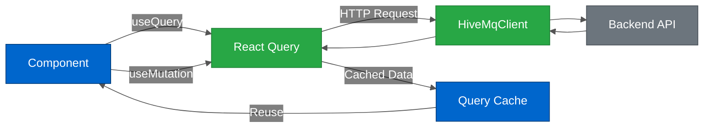

# React Query Patterns

---

## Table of Contents

- [Overview](#overview)
- [Architecture](#architecture)
- [Query Patterns](#query-patterns)
- [Mutation Patterns](#mutation-patterns)
- [Caching Strategy](#caching-strategy)
- [Error Handling](#error-handling)
- [Testing Patterns](#testing-patterns)
- [Best Practices](#best-practices)
- [Common Patterns](#common-patterns)
- [Checklist: Adding a New Query Hook](#checklist-adding-a-new-query-hook)
- [Checklist: Adding a New Mutation Hook](#checklist-adding-a-new-mutation-hook)
- [Glossary](#glossary)
- [Related Documentation](#related-documentation)

---

## Overview

HiveMQ Edge frontend uses **TanStack React Query v5** (formerly React Query) for server state management. This provides:

- **Automatic caching** - Data fetched once, reused across components
- **Background refetching** - Keep data fresh without manual refreshes
- **Optimistic updates** - Instant UI feedback before server confirms
- **Request deduplication** - Multiple components requesting same data trigger single network call
- **Loading & error states** - Built-in state management for async operations

**Version:** @tanstack/react-query 5.85.5

---

## Architecture

### Core Concepts



**Color Legend:**
- **Blue** - UI Components and Cache
- **Green** - React Query and HTTP Client
- **Gray** - Backend API

### Query vs Mutation

| Feature | useQuery | useMutation |
|---------|----------|-------------|
| **Purpose** | Fetch data (GET) | Modify data (POST/PUT/DELETE) |
| **Automatic execution** | ✅ Yes (on mount) | ❌ No (manual trigger) |
| **Caching** | ✅ Yes | ❌ No |
| **Refetching** | ✅ Yes (automatic) | ❌ N/A |
| **Optimistic updates** | ❌ N/A | ✅ Yes |
| **Example** | Get list of adapters | Create new adapter |

---

## Query Patterns

### Basic Query Hook

**Pattern:** Fetch data with automatic caching and refetching.

```typescript
// src/api/hooks/useProtocolAdapters/useGetAllProtocolAdapters.ts
import { useQuery } from '@tanstack/react-query'
import { useHttpClient } from '@/api/hooks/useHttpClient/useHttpClient'
import { QUERY_KEYS } from '@/api/utils'
import type { AdaptersList } from '@/api/__generated__'

export const useGetAllProtocolAdapters = () => {
  const appClient = useHttpClient()

  return useQuery({
    queryKey: [QUERY_KEYS.ADAPTERS],
    queryFn: () => appClient.protocolAdapters.getAdapters(),
  })
}
```

**Usage in component:**

```typescript
import { useGetAllProtocolAdapters } from '@/api/hooks/useProtocolAdapters/useGetAllProtocolAdapters'

function AdapterList() {
  const { data, isLoading, error } = useGetAllProtocolAdapters()

  if (isLoading) return <Spinner />
  if (error) return <ErrorMessage error={error} />

  return (
    <ul>
      {data?.items?.map((adapter) => (
        <li key={adapter.id}>{adapter.id}</li>
      ))}
    </ul>
  )
}
```

---

### Query with Parameters

**Pattern:** Pass dynamic parameters to query function.

```typescript
// src/api/hooks/useProtocolAdapters/useGetProtocolAdapter.ts
import { useQuery } from '@tanstack/react-query'
import { useHttpClient } from '@/api/hooks/useHttpClient/useHttpClient'
import { QUERY_KEYS } from '@/api/utils'

export const useGetProtocolAdapter = (adapterId: string) => {
  const appClient = useHttpClient()

  return useQuery({
    queryKey: [QUERY_KEYS.ADAPTERS, adapterId],
    queryFn: () => appClient.protocolAdapters.getAdapter(adapterId),
    enabled: !!adapterId,  // Only run if adapterId exists
  })
}
```

**Key points:**

- **Query key includes parameter** - Ensures separate cache entry per adapter
- **`enabled` option** - Prevents query from running when parameter is invalid

**Usage:**

```typescript
function AdapterDetails({ adapterId }: { adapterId: string }) {
  const { data: adapter } = useGetProtocolAdapter(adapterId)

  return <div>{adapter?.config.uri}</div>
}
```

---

### Conditional Queries

**Pattern:** Only fetch data when certain conditions are met.

```typescript
export const useGetAdapterIfConnected = (adapterId: string, isConnected: boolean) => {
  const appClient = useHttpClient()

  return useQuery({
    queryKey: [QUERY_KEYS.ADAPTERS, adapterId, 'status'],
    queryFn: () => appClient.protocolAdapters.getAdapter(adapterId),
    enabled: !!adapterId && isConnected,  // Only fetch if connected
    staleTime: 30000,  // Consider data fresh for 30 seconds
  })
}
```

---

### Dependent Queries

**Pattern:** Query B depends on data from Query A.

```typescript
// First query: Get adapter
const { data: adapter } = useQuery({
  queryKey: [QUERY_KEYS.ADAPTERS, adapterId],
  queryFn: () => appClient.protocolAdapters.getAdapter(adapterId),
})

// Second query: Get device tags (depends on adapter.type)
const { data: tags } = useQuery({
  queryKey: [QUERY_KEYS.DISCOVERY_TAGS, adapterId],
  queryFn: () => appClient.protocolAdapters.getTags(adapterId),
  enabled: !!adapter?.type,  // Only run after adapter is loaded
})
```

---

### Polling (Auto-Refetch)

**Pattern:** Automatically refetch data at regular intervals.

```typescript
export const useGetAdaptersStatus = () => {
  const appClient = useHttpClient()

  return useQuery({
    queryKey: [QUERY_KEYS.ADAPTERS, QUERY_KEYS.CONNECTION_STATUS],
    queryFn: () => appClient.protocolAdapters.getConnectionStatus(),
    refetchInterval: 5000,  // Poll every 5 seconds
    refetchIntervalInBackground: true,  // Continue polling when tab not focused
  })
}
```

**Use cases:**

- Connection status monitoring
- Real-time metrics
- Event logs

---

### Infinite Queries

**Pattern:** Load more data as user scrolls (pagination).

```typescript
import { useInfiniteQuery } from '@tanstack/react-query'

export const useGetEvents = () => {
  const appClient = useHttpClient()

  return useInfiniteQuery({
    queryKey: [QUERY_KEYS.EVENTS],
    queryFn: ({ pageParam = 0 }) =>
      appClient.events.getEvents({
        limit: 50,
        cursor: pageParam
      }),
    getNextPageParam: (lastPage) => lastPage.nextCursor,
    initialPageParam: 0,
  })
}
```

**Usage with infinite scroll:**

```typescript
function EventLog() {
  const {
    data,
    fetchNextPage,
    hasNextPage,
    isFetchingNextPage
  } = useGetEvents()

  return (
    <>
      {data?.pages.map((page) =>
        page.items.map((event) => (
          <EventItem key={event.id} event={event} />
        ))
      )}
      {hasNextPage && (
        <Button onClick={() => fetchNextPage()} isLoading={isFetchingNextPage}>
          Load More
        </Button>
      )}
    </>
  )
}
```

---

## Mutation Patterns

### Basic Mutation Hook

**Pattern:** Create, update, or delete data with cache invalidation.

```typescript
// src/api/hooks/useProtocolAdapters/useCreateProtocolAdapter.ts
import { useMutation, useQueryClient } from '@tanstack/react-query'
import { useHttpClient } from '@/api/hooks/useHttpClient/useHttpClient'
import { QUERY_KEYS } from '@/api/utils'
import type { Adapter, ApiError } from '@/api/__generated__'

interface CreateProtocolAdapterProps {
  adapterType: string
  requestBody: Adapter
}

export const useCreateProtocolAdapter = () => {
  const appClient = useHttpClient()
  const queryClient = useQueryClient()

  return useMutation<unknown, ApiError, CreateProtocolAdapterProps>({
    mutationFn: ({ adapterType, requestBody }) =>
      appClient.protocolAdapters.addAdapter(adapterType, requestBody),
    onSuccess: () => {
      // Invalidate and refetch adapter list
      queryClient.invalidateQueries({
        queryKey: [QUERY_KEYS.ADAPTERS]
      })
    },
  })
}
```

**Usage in component:**

```typescript
import { useCreateProtocolAdapter } from '@/api/hooks/useProtocolAdapters/useCreateProtocolAdapter'

function CreateAdapterForm() {
  const createAdapter = useCreateProtocolAdapter()

  const handleSubmit = (data: Adapter) => {
    createAdapter.mutate(
      { adapterType: 'simulation', requestBody: data },
      {
        onSuccess: () => {
          toast({ title: 'Adapter created successfully' })
          navigate('/adapters')
        },
        onError: (error) => {
          toast({ title: 'Failed to create adapter', description: error.message })
        },
      }
    )
  }

  return (
    <form onSubmit={handleSubmit}>
      {/* form fields */}
      <Button
        type="submit"
        isLoading={createAdapter.isPending}
      >
        Create Adapter
      </Button>
    </form>
  )
}
```

---

### Optimistic Updates

**Pattern:** Update UI immediately before server confirms change.

```typescript
export const useCreateProtocolAdapter = () => {
  const appClient = useHttpClient()
  const queryClient = useQueryClient()

  return useMutation<unknown, ApiError, CreateProtocolAdapterProps>({
    mutationFn: ({ adapterType, requestBody }) =>
      appClient.protocolAdapters.addAdapter(adapterType, requestBody),

    onMutate: async (newAdapter) => {
      // Cancel outgoing refetches (so they don't overwrite optimistic update)
      await queryClient.cancelQueries({
        queryKey: [QUERY_KEYS.ADAPTERS, QUERY_KEYS.CONNECTION_STATUS]
      })

      // Snapshot previous value
      const previousStatus = queryClient.getQueryData<StatusList>([
        QUERY_KEYS.ADAPTERS,
        QUERY_KEYS.CONNECTION_STATUS
      ])

      // Optimistically update cache
      queryClient.setQueryData<StatusList>(
        [QUERY_KEYS.ADAPTERS, QUERY_KEYS.CONNECTION_STATUS],
        (old) => ({
          items: [
            ...(old?.items || []),
            {
              connection: Status.connection.DISCONNECTED,
              id: newAdapter.requestBody.id,
              type: newAdapter.requestBody.type,
            },
          ],
        })
      )

      // Return context with snapshot
      return { previousStatus }
    },

    onError: (_err, _newAdapter, context) => {
      // Rollback on error
      if (context?.previousStatus) {
        queryClient.setQueryData(
          [QUERY_KEYS.ADAPTERS, QUERY_KEYS.CONNECTION_STATUS],
          context.previousStatus
        )
      }
    },

    onSettled: () => {
      // Refetch after mutation (success or error)
      queryClient.invalidateQueries({
        queryKey: [QUERY_KEYS.ADAPTERS]
      })
    },
  })
}
```

**Benefits:**

- **Instant UI feedback** - No waiting for server response
- **Automatic rollback** - Reverts on error
- **Eventual consistency** - Refetch ensures accuracy

---

### Sequential Mutations

**Pattern:** Run mutations one after another.

```typescript
function BulkCreateAdapters() {
  const createAdapter = useCreateProtocolAdapter()

  const handleBulkCreate = async (adapters: Adapter[]) => {
    for (const adapter of adapters) {
      await createAdapter.mutateAsync({
        adapterType: adapter.type,
        requestBody: adapter
      })
    }
    toast({ title: `${adapters.length} adapters created` })
  }

  return <Button onClick={() => handleBulkCreate(adapters)}>Create All</Button>
}
```

---

### Parallel Mutations

**Pattern:** Run multiple mutations simultaneously.

```typescript
function BulkDeleteAdapters({ adapterIds }: { adapterIds: string[] }) {
  const deleteAdapter = useDeleteProtocolAdapter()

  const handleBulkDelete = async () => {
    await Promise.all(
      adapterIds.map((id) =>
        deleteAdapter.mutateAsync({ adapterId: id })
      )
    )
    toast({ title: `${adapterIds.length} adapters deleted` })
  }

  return <Button onClick={handleBulkDelete}>Delete All</Button>
}
```

---

## Caching Strategy

### Query Keys

**Purpose:** Unique identifier for cached data.

**Structure:**

```typescript
// src/api/utils.ts
export const QUERY_KEYS = {
  ADAPTERS: 'adapters',
  PROTOCOLS: 'protocols',
  BRIDGES: 'bridges',
  CONNECTION_STATUS: 'connection.status',
  DISCOVERY_TAGS: 'discovery.tags',
  COMBINER: 'combiner',
  // ... 20+ keys
}
```

**Hierarchical keys:**

```typescript
// General adapters list
[QUERY_KEYS.ADAPTERS]  // ['adapters']

// Specific adapter
[QUERY_KEYS.ADAPTERS, adapterId]  // ['adapters', 'simulation-1']

// Adapter connection status
[QUERY_KEYS.ADAPTERS, QUERY_KEYS.CONNECTION_STATUS]  // ['adapters', 'connection.status']

// Specific adapter connection status
[QUERY_KEYS.ADAPTERS, adapterId, QUERY_KEYS.CONNECTION_STATUS]  // ['adapters', 'simulation-1', 'connection.status']
```

**Benefits:**

- **Granular invalidation** - Invalidate specific or all related queries
- **Predictable caching** - Same key = same cache entry
- **Type safety** - Centralized constants prevent typos

---

### Cache Invalidation

**Pattern:** Refresh stale data after mutations.

```typescript
// Invalidate all adapters queries
queryClient.invalidateQueries({
  queryKey: [QUERY_KEYS.ADAPTERS]
})

// Invalidate specific adapter
queryClient.invalidateQueries({
  queryKey: [QUERY_KEYS.ADAPTERS, adapterId]
})

// Invalidate exact match only (no nested keys)
queryClient.invalidateQueries({
  queryKey: [QUERY_KEYS.ADAPTERS],
  exact: true
})
```

---

### Stale Time

**Pattern:** Control when data is considered "stale" and needs refetching.

```typescript
useQuery({
  queryKey: [QUERY_KEYS.PROTOCOLS],
  queryFn: () => appClient.protocolAdapters.getAdapterTypes(),
  staleTime: Infinity,  // Never consider stale (static data)
})

useQuery({
  queryKey: [QUERY_KEYS.ADAPTERS, QUERY_KEYS.CONNECTION_STATUS],
  queryFn: () => appClient.protocolAdapters.getConnectionStatus(),
  staleTime: 5000,  // Consider stale after 5 seconds
})
```

**When to use:**

- **`Infinity`** - Static data (protocol types, schemas)
- **High value (30s-5min)** - Rarely changing data (configuration)
- **Low value (1-10s)** - Frequently changing data (connection status)
- **0 (default)** - Always refetch on window focus

---

### Cache Time

**Pattern:** Control how long unused data stays in cache.

```typescript
useQuery({
  queryKey: [QUERY_KEYS.ADAPTERS],
  queryFn: () => appClient.protocolAdapters.getAdapters(),
  gcTime: 5 * 60 * 1000,  // Garbage collect after 5 minutes of no usage
})
```

**Default:** 5 minutes

---

## Error Handling

### Per-Query Error Handling

```typescript
const { data, error, isError } = useQuery({
  queryKey: [QUERY_KEYS.ADAPTERS],
  queryFn: () => appClient.protocolAdapters.getAdapters(),
  retry: 3,  // Retry failed requests 3 times
  retryDelay: (attemptIndex) => Math.min(1000 * 2 ** attemptIndex, 30000),  // Exponential backoff
})

if (isError) {
  return <ErrorAlert message={error.message} />
}
```

---

### Global Error Handling

**Pattern:** Centralized error handling for all queries.

```typescript
// src/modules/App/QueryProvider.tsx
import { QueryClient, QueryClientProvider } from '@tanstack/react-query'

const queryClient = new QueryClient({
  defaultOptions: {
    queries: {
      retry: 1,
      refetchOnWindowFocus: true,
      staleTime: 0,
      onError: (error: ApiError) => {
        // Global error toast
        if (error.status === 401) {
          toast({ title: 'Unauthorized', description: 'Please log in again' })
        } else if (error.status >= 500) {
          toast({ title: 'Server Error', description: 'Something went wrong' })
        }
      },
    },
    mutations: {
      onError: (error: ApiError) => {
        toast({
          title: 'Mutation Failed',
          description: error.message,
          status: 'error'
        })
      },
    },
  },
})

export function QueryProvider({ children }: { children: React.ReactNode }) {
  return (
    <QueryClientProvider client={queryClient}>
      {children}
    </QueryClientProvider>
  )
}
```

---

## Testing Patterns

### Mock with MSW

**See:** [MSW API Mocking](./MSW_MOCKING.md) for complete patterns.

**Quick example:**

```typescript
// Test file
import { renderHook, waitFor } from '@testing-library/react'
import { useGetAllProtocolAdapters } from './useGetAllProtocolAdapters'
import { wrapper } from '@/__test-utils__/hooks/SimpleWrapper'

it('should fetch adapters', async () => {
  const { result } = renderHook(() => useGetAllProtocolAdapters(), { wrapper })

  await waitFor(() => expect(result.current.isSuccess).toBe(true))

  expect(result.current.data?.items).toHaveLength(1)
  expect(result.current.data?.items[0].id).toBe('simulation-1')
})
```

---

## Best Practices

### ✅ Do

- **Use hierarchical query keys** - `[QUERY_KEYS.ADAPTERS, adapterId]` not `['adapter-123']`
- **Colocate hooks with handlers** - Keep MSW mocks in `__handlers__/` subdirectory
- **Invalidate after mutations** - Always call `queryClient.invalidateQueries()`
- **Use `enabled` option** - Prevent queries from running with invalid parameters
- **Leverage optimistic updates** - For instant UX feedback
- **Set appropriate staleTime** - Static data = `Infinity`, dynamic data = low value
- **Export typed errors** - Use `ApiError` type from generated client

### ❌ Don't

- **Don't use string literals for query keys** - Use `QUERY_KEYS` constants
- **Don't forget to invalidate** - Stale cache causes bugs
- **Don't over-fetch** - Use `enabled`, `staleTime`, and `gcTime` appropriately
- **Don't ignore errors** - Always handle `isError` state
- **Don't mutate cache directly** - Use `setQueryData()` method
- **Don't forget rollback** - Optimistic updates need `onError` handler

---

## Common Patterns

### Prefetching Data

**Pattern:** Load data before user navigates to page.

```typescript
import { useQueryClient } from '@tanstack/react-query'

function AdapterListItem({ adapterId }: { adapterId: string }) {
  const queryClient = useQueryClient()
  const appClient = useHttpClient()

  const prefetchAdapter = () => {
    queryClient.prefetchQuery({
      queryKey: [QUERY_KEYS.ADAPTERS, adapterId],
      queryFn: () => appClient.protocolAdapters.getAdapter(adapterId),
    })
  }

  return (
    <Link
      to={`/adapters/${adapterId}`}
      onMouseEnter={prefetchAdapter}  // Prefetch on hover
    >
      {adapterId}
    </Link>
  )
}
```

---

### Suspense Mode

**Pattern:** Use React Suspense for loading states.

```typescript
import { useSuspenseQuery } from '@tanstack/react-query'

function AdapterDetails({ adapterId }: { adapterId: string }) {
  const { data } = useSuspenseQuery({
    queryKey: [QUERY_KEYS.ADAPTERS, adapterId],
    queryFn: () => appClient.protocolAdapters.getAdapter(adapterId),
  })

  // No isLoading check needed - Suspense boundary handles it
  return <div>{data.id}</div>
}

// Parent component with Suspense boundary
function App() {
  return (
    <Suspense fallback={<Spinner />}>
      <AdapterDetails adapterId="simulation-1" />
    </Suspense>
  )
}
```

---

### Initial Data from Cache

**Pattern:** Use data from one query as initial data for another.

```typescript
const { data: adaptersList } = useQuery({
  queryKey: [QUERY_KEYS.ADAPTERS],
  queryFn: () => appClient.protocolAdapters.getAdapters(),
})

const { data: adapter } = useQuery({
  queryKey: [QUERY_KEYS.ADAPTERS, adapterId],
  queryFn: () => appClient.protocolAdapters.getAdapter(adapterId),
  initialData: () => {
    // Use adapter from list as initial data
    return adaptersList?.items?.find((a) => a.id === adapterId)
  },
})
```

---

## Checklist: Adding a New Query Hook

- [ ] Create hook file in `src/api/hooks/use{Feature}/use{Action}.ts`
- [ ] Import `useQuery` and `useHttpClient`
- [ ] Define query key using `QUERY_KEYS` constants
- [ ] Implement query function calling generated client
- [ ] Add TypeScript types from `@/api/__generated__/models`
- [ ] Create MSW handler in `__handlers__/index.ts`
- [ ] Write tests in `use{Action}.spec.ts`
- [ ] Set appropriate `staleTime` and `gcTime`
- [ ] Document complex query patterns if needed

---

## Checklist: Adding a New Mutation Hook

- [ ] Create hook file in `src/api/hooks/use{Feature}/use{Action}.ts`
- [ ] Import `useMutation` and `useQueryClient`
- [ ] Define mutation function calling generated client
- [ ] Add `onSuccess` with `invalidateQueries` for affected queries
- [ ] Consider optimistic updates for instant UX
- [ ] Add `onError` rollback if using optimistic updates
- [ ] Create MSW handler in `__handlers__/index.ts`
- [ ] Write tests covering success and error cases
- [ ] Test optimistic update rollback if applicable

---

## Glossary

| Term | Definition |
|------|------------|
| **React Query** | TanStack React Query - library for managing server state in React applications |
| **Query** | A request to fetch data from the server, managed by useQuery hook |
| **Mutation** | A request to modify data on the server (create, update, delete), managed by useMutation hook |
| **Query Key** | Unique identifier for cached data, used for cache lookup and invalidation |
| **Query Function** | Async function that fetches data from the API and returns a promise |
| **Cache** | In-memory storage of fetched data to avoid redundant network requests |
| **Invalidation** | Process of marking cached data as stale, triggering a refetch |
| **Optimistic Update** | Updating UI immediately before server confirms change, with rollback on error |
| **Stale Time** | Duration data is considered fresh before being marked for refetch |
| **GC Time** | Garbage collection time - how long unused data stays in cache before removal |
| **Polling** | Automatically refetching data at regular intervals to keep it fresh |
| **Prefetching** | Loading data before it's needed (e.g., on hover) to improve perceived performance |

---

## Related Documentation

**API:**
- [OpenAPI Integration](./OPENAPI_INTEGRATION.md)
- [MSW API Mocking](./MSW_MOCKING.md)

**Architecture:**
- [State Management Architecture](../architecture/STATE_MANAGEMENT.md)
- [Data Flow](../architecture/DATA_FLOW.md)

**Guides:**
- [Testing Guide](../guides/TESTING_GUIDE.md)
