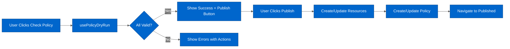

# DataHub Architecture

---

## Table of Contents

- [Overview](#overview)
- [Code Structure](#code-structure)
- [Key Design & Implementation Decisions](#key-design--implementation-decisions)
- [Testing](#testing)
- [Common Issues & Solutions](#common-issues--solutions)
- [Glossary](#glossary)
- [Related Documentation](#related-documentation)

---

## Overview

> [!CAUTION]
> The Data Hub UI has been redesigned from scratch for integration within CCV2. This is likely to mean that the Data Hub Designer as described in this document is now "abandonware"

### What is it?

DataHub is a self-contained extension module providing a **visual policy designer** for creating MQTT data and behavior policies. Users build policies by dragging nodes onto a React Flow canvas, connecting them to define data transformations or client behavior rules, then validating and publishing to the backend.

**Location:** `src/extensions/datahub/`

### Key Features

- **Visual Policy Designer** - React Flow canvas with drag-and-drop node toolbox
- **Two Policy Types** - Data policies (transform MQTT messages) and Behavior policies (define client state machines)
- **Dry-Run Validation** - Test policy configuration before publishing
- **Resource Management** - Reusable schemas (JSON/Protobuf) and scripts (JavaScript functions)
- **Side Panel Reports** - Validation results displayed in right-side drawer


_Empty policy designer - Users drag nodes from left toolbox onto canvas to build policies_

### Why This Architecture?

**React Flow:** Provides professional node-based editor without building from scratch. Supports pan, zoom, selection, and custom node types.

**Zustand Stores:** Separate concerns - draft store for canvas state, checks store for validation state.

**Validation-then-Publish Flow:** Prevents invalid policies from reaching backend. Users see all errors before attempting publish.

**Self-Contained Module:** Own routing, translations, API hooks. Can be developed and tested independently.

---

## Code Structure

### Directory Layout

```
src/extensions/datahub/
├── api/
│   └── hooks/              # React Query hooks (useGetPolicies, useDryRun)
├── components/
│   ├── controls/           # Canvas controls (ToolboxSelectionListener)
│   ├── helpers/            # Report components (PolicySummaryReport, PolicyErrorReport)
│   ├── pages/              # Page components (PolicyEditor, SchemaTable, ScriptTable)
│   └── toolbar/            # Action buttons (ToolbarDryRun, ToolbarPublish)
├── designer/
│   └── mappings/           # Node type factories and mappings
├── hooks/                  # Zustand stores (useDataHubDraftStore, usePolicyChecksStore)
├── locales/                # i18n translations (en/datahub.json)
├── types.ts                # TypeScript type definitions
├── routes.tsx              # DataHub routing configuration
└── utils/                  # Utility functions
```

### Key Components

| Component | File Path | Purpose |
|-----------|-----------|---------|
| **PolicyEditor** | `components/pages/PolicyEditor.tsx` | Main designer page with canvas and toolbar |
| **ToolboxSelectionListener** | `components/controls/ToolboxSelectionListener.tsx` | Syncs React Flow selection to Zustand store |
| **ToolbarDryRun** | `components/toolbar/ToolbarDryRun.tsx` | Check Policy button, triggers validation |
| **ToolbarPublish** | `components/toolbar/ToolbarPublish.tsx` | Publish button, creates/updates policy and resources |
| **DryRunPanelController** | `components/controls/DryRunPanelController.tsx` | Right-side drawer showing validation results |
| **PolicySummaryReport** | `components/helpers/PolicySummaryReport.tsx` | Success summary in validation drawer |
| **PolicyErrorReport** | `components/helpers/PolicyErrorReport.tsx` | Error list with actions (show in canvas, open config) |
| **SchemaTable** | `components/pages/SchemaTable.tsx` | List view for JSON/Protobuf schemas |
| **ScriptTable** | `components/pages/ScriptTable.tsx` | List view for JavaScript functions |

### Integration Points

**API Endpoints:**
- Data policies: `/api/v1/data-hub/data-validation/policies`
- Behavior policies: `/api/v1/data-hub/behavior-validation/policies`
- Schemas: `/api/v1/data-hub/schemas`
- Scripts: `/api/v1/data-hub/scripts`
- Dry-run: Policy-specific endpoints for validation

**Router:**
- Routes defined in `routes.tsx`
- Mounted at `/datahub/*` in main app router
- See: `src/modules/App/App.tsx`

**Shared Components:**
- Uses Chakra UI from app-level theme
- React Flow from `@xyflow/react`
- RJSF for node configuration forms

**API Client:**
- Generated from OpenAPI spec in `src/api/__generated__/`
- See: [OpenAPI Integration](../api/OPENAPI_INTEGRATION.md)

---

## Key Design & Implementation Decisions

### 1. React Flow Canvas

**What:** Professional node-based editor for visual policy construction.

**Why:** Provides pan, zoom, selection, custom nodes out-of-box. Avoids building canvas system from scratch.

**Where:**
- Main usage: `components/pages/PolicyEditor.tsx`
- Custom nodes: `designer/mappings/` directory
- Node types defined in `types.ts`

**How:**
- Users drag node types from toolbox onto canvas
- Nodes can be connected via edges
- Custom node components render based on node type
- Canvas state managed by Zustand draft store

**Key Pattern:** All nodes share common structure but render differently based on `DataHubNodeType`.

### 2. Dual Zustand Stores

**What:** Two separate stores - one for canvas draft, one for validation state.

**Why:** Separation of concerns. Canvas changes shouldn't affect validation state until user triggers validation.

**Where:**
- Draft: `hooks/useDataHubDraftStore.ts`
- Checks: `hooks/usePolicyChecksStore.ts`

**How:**

| Store | Responsibility | Key Actions |
|-------|----------------|-------------|
| **useDataHubDraftStore** | Canvas state (nodes, edges, policy metadata) | `onNodesChange`, `onEdgesChange`, `onConnect`, `reset` |
| **usePolicyChecksStore** | Validation state and dry-run results | `initReport`, `setReport`, `getErrors`, `setNode` |

**Key Pattern:** Toolbar buttons read from both stores - draft for canvas state, checks for selected node and validation status.

### 3. JSON Schema Forms (RJSF)

**What:** Dynamic forms for configuring node properties based on JSON schemas.

**Why:** Node configuration varies by type. RJSF generates forms from schema without custom form code per node type.

**Where:**
- Node edit modals throughout DataHub
- Schema definitions in `src/api/schemas/` _(generated)_

**How:**
- Each node type has associated JSON schema
- Double-click node → opens modal with RJSF form
- Form validates input against schema
- See: [RJSF Guide](../guides/RJSF_GUIDE.md)

**Key Pattern:** Node data conforms to JSON schema, enabling backend validation and type safety.

### 4. Validation-then-Publish Flow

**What:** Two-stage workflow - validate policy first, then publish if valid.

**Why:** Prevents invalid policies from reaching backend. User sees all errors before attempting to publish.

**Where:**
- Validation trigger: `components/toolbar/ToolbarDryRun.tsx`
- Validation logic: `api/hooks/DataHubPolicyHooks/usePolicyDryRun.ts`
- Publish logic: `components/toolbar/ToolbarPublish.tsx`

**How:**



**Key Pattern:** Report array contains per-node validation items PLUS final summary with complete policy JSON.

### 5. Side Panel for Validation Reports

**What:** Right-side drawer showing validation results and errors.

**Why:** Keeps canvas visible while showing detailed validation feedback. Users can act on errors (show in canvas, open config).

**Where:** `components/controls/DryRunPanelController.tsx`

**How:**
- Opens on validation completion
- Shows PolicySummaryReport (success) or PolicyErrorReport (errors)
- Error items have action buttons to navigate to problem nodes
- Publish button only shown on success

**Key Pattern:** Drawer is part of layout, not blocking modal. Canvas remains interactive.

---

## Testing

### Component Testing Requirements

**Wrapper:** Standard Cypress mounting with providers.

**Key Patterns:**
- All DataHub components follow standard component test structure
- MSW handlers in `api/hooks/**/__handlers__/` for API mocking
- Accessibility test required as final test in each suite

**Example:**
```typescript
describe('PolicySummaryReport', () => {
  it('should render success state', () => {
    cy.mountWithProviders(<PolicySummaryReport status={PolicyDryRunStatus.SUCCESS} />)
    cy.contains('Policy validation successful')
  })

  it('should be accessible', () => {
    cy.injectAxe()
    cy.mountWithProviders(<PolicySummaryReport status={PolicyDryRunStatus.SUCCESS} />)
    cy.checkAccessibility()  // NOT cy.checkA11y()
  })
})
```

**See:** [Testing Guide](../guides/TESTING_GUIDE.md) for general patterns.

### E2E Testing Requirements

**Critical Setup:**
1. **BOTH list AND individual resource intercepts required:**
   ```typescript
   // Data policies
   cy.intercept('GET', '/api/v1/data-hub/data-validation/policies')      // List
   cy.intercept('GET', '/api/v1/data-hub/data-validation/policies/**')   // Individual ⚠️

   // Behavior policies
   cy.intercept('GET', '/api/v1/data-hub/behavior-validation/policies')     // List
   cy.intercept('GET', '/api/v1/data-hub/behavior-validation/policies/**')  // Individual ⚠️
   ```

2. **MSW database entries:**
   - Create policy in MSW database before navigation
   - Fixtures must match exact API structure

3. **Node selection before actions:**
   - Select policy node BEFORE clicking Check Policy
   - Button disabled if no node selected

**Page Objects:** `cypress/pages/DataHub/DesignerPage.ts`

**See:** [Cypress Guide](../guides/CYPRESS_GUIDE.md) for E2E patterns.

### Specific Gotchas

| Issue | Symptom | Solution |
|-------|---------|----------|
| **Missing individual GET intercept** | Canvas never loads, timeout on `rf__wrapper` | Add `cy.intercept('GET', '.../policies/**')` |
| **Check Policy disabled** | Button unclickable in test | Select policy node first: `datahubDesignerPage.designer.selectNode('DATA_POLICY')` |
| **Invalid fixture structure** | Validation fails unexpectedly | Verify fixture matches OpenAPI schema exactly (for example, `clientIdRegex` not `clientFilter`) |

---

## Common Issues & Solutions

| Issue | Symptom | Solution | Reference |
|-------|---------|----------|-----------|
| **Validation button disabled** | Can't click Check Policy | Must select policy node first. ToolboxSelectionListener syncs selection. | `components/controls/ToolboxSelectionListener.tsx` |
| **Report array confusion** | Using wrong data for publish | Last item in report array is final summary with complete policy. Use `[...report].pop()`. | See usePolicyDryRun hook |
| **Resources not publishing** | Policy created but schemas/scripts missing | Resources must be published BEFORE policy. Check version status (DRAFT/MODIFIED). | `components/toolbar/ToolbarPublish.tsx` |
| **Fixture validation fails** | E2E tests fail on load | Fixture field names must match API exactly. Check OpenAPI spec. | `src/api/__generated__/` |
| **Canvas won't load in E2E** | Timeout waiting for React Flow | Missing individual policy GET intercept. Add wildcard intercept. | See E2E Testing section above |

---

## Glossary

| Term | Definition |
|------|------------|
| **Data Policy** | MQTT data transformation pipeline with validators, schemas, and operations |
| **Behavior Policy** | Client state machine defining allowed behaviors and event-based transitions |
| **Dry-Run** | Validation of policy configuration without publishing to backend |
| **Draft Store** | Zustand store managing canvas state (nodes, edges, policy metadata) |
| **Checks Store** | Zustand store managing validation state and dry-run results |
| **Final Summary** | Last item in report array containing complete policy JSON for publishing |
| **Resource** | Reusable schema or script node that policies depend on |
| **Working Version** | Resource status (DRAFT, MODIFIED, or numeric version) determining publish action |

---

## Related Documentation

**Architecture:**
- [Workspace Architecture](./WORKSPACE_ARCHITECTURE.md)
- [State Management](./STATE_MANAGEMENT.md)
- [Data Flow](./DATA_FLOW.md)

**Guides:**
- [Testing Guide](../guides/TESTING_GUIDE.md)
- [Cypress Guide](../guides/CYPRESS_GUIDE.md)
- [RJSF Guide](../guides/RJSF_GUIDE.md)
- [Design Guide](../guides/DESIGN_GUIDE.md)

**API:**
- [React Query Patterns](../api/REACT_QUERY_PATTERNS.md)
- [OpenAPI Integration](../api/OPENAPI_INTEGRATION.md)

**Technical:**
- [Technical Stack](../technical/TECHNICAL_STACK.md)

**Design References (Miro):**
- [DataHub – Edge Integration](https://miro.com/app/board/uXjVN7kkrF8=) — integration concept, RJSF node editors, OpenAPI constraints
- [DataHub Designer – Resource Handling Revamp](https://miro.com/app/board/uXjVJnfJQVg=) — Plan A vs Plan B for schema/script resource editing
- [DataHub Designer – FSM User-Facing Strings](https://miro.com/app/board/uXjVGKMvdqc=) — behaviour model FSMs, event/guard naming, UX copy
- [Reference Materials](../technical/REFERENCE_MATERIALS.md) — full board catalogue
