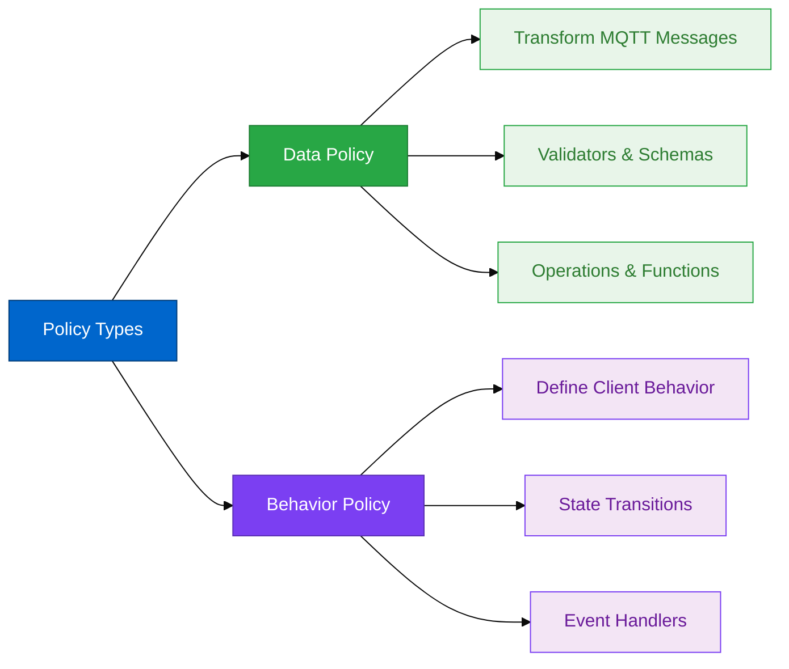
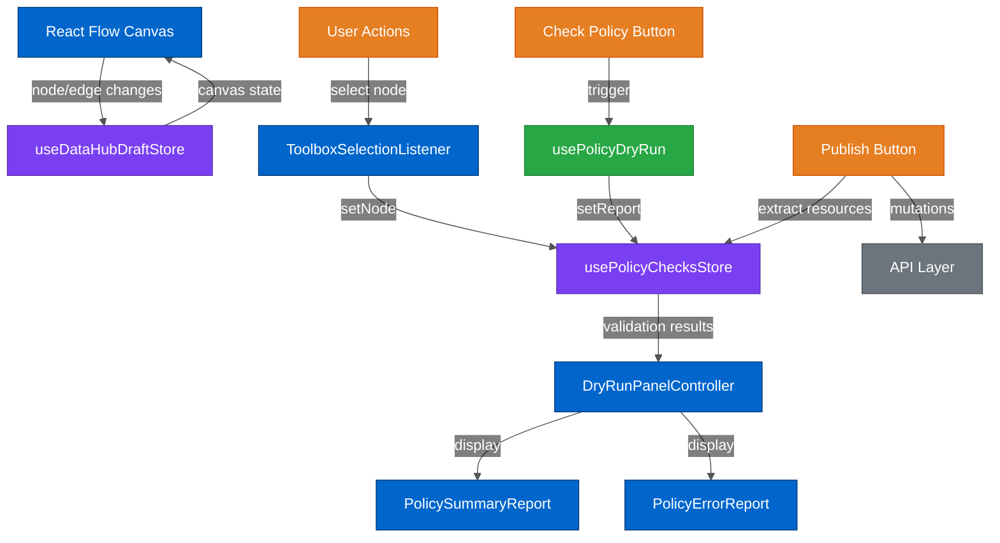
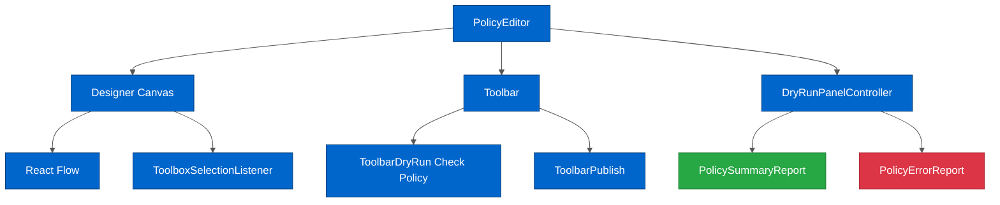
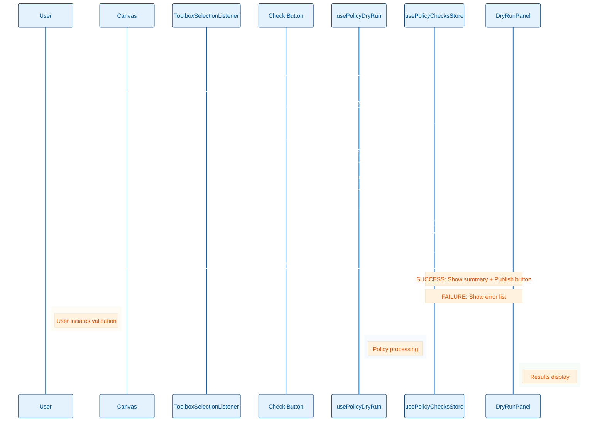
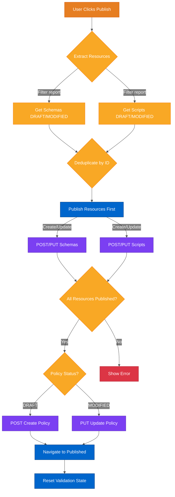
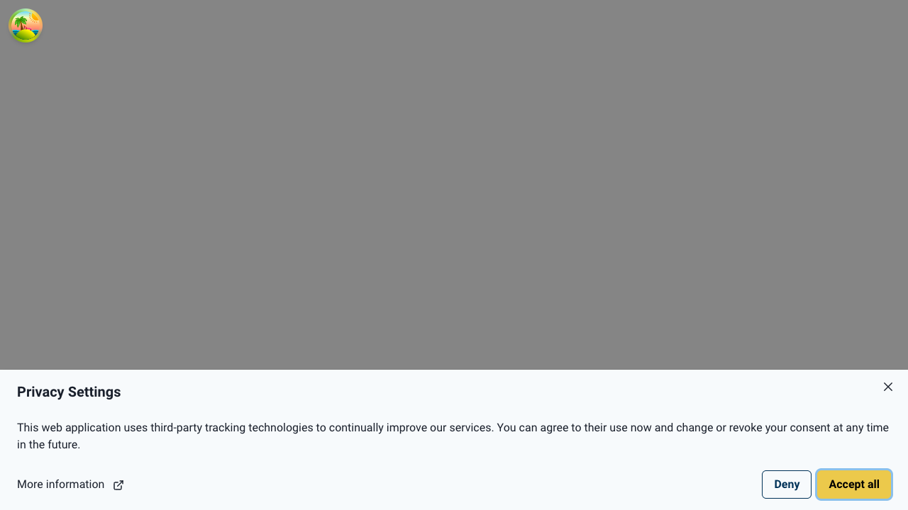

# DataHub Architecture

**Last Updated:** 2026-02-13

**Purpose:** Complete architecture reference for the DataHub extension including state management, data flow, and implementation patterns.

**Audience:** Developers and AI agents working on DataHub features

---

## Table of Contents

- [Overview](#overview)
- [Core Concepts](#core-concepts)
- [State Management](#state-management)
- [Component Architecture](#component-architecture)
- [Data Flow](#data-flow)
- [Testing](#testing)
- [Glossary](#glossary)
- [Related Documentation](#related-documentation)

---

## Overview

The DataHub extension is a self-contained module for creating and managing MQTT data and behavior policies using a visual node-based editor.

**Key Features:**
- Visual policy designer using React Flow
- State management with Zustand
- JSON Schema-based validation
- Real-time dry-run validation
- Resource management (schemas and scripts)

**Module Location:** `src/extensions/datahub/`

### Policy Designer Interface

The core user interface for creating and editing policies is the visual designer canvas:

**Figure 1: Policy Designer - Empty State**


**Interface Components:**

1. **Toolbox (Left):** Drag-and-drop library of available nodes
   - Data Policy nodes: Topic Filter, Validator, Schema, Operation, Function
   - Behavior Policy nodes: Client Filter, Transition, State

2. **Canvas (Center):** React Flow workspace for visual policy construction
   - Nodes represent policy components
   - Edges represent data flow or state transitions
   - Supports pan, zoom, and multi-selection

3. **Toolbar (Top):** Action controls
   - **Check Policy:** Validate current policy configuration
   - **Publish:** Save policy to backend
   - **Clear:** Reset canvas to empty state

Users start with a clean canvas (shown above) and drag nodes from the toolbox to construct their policies visually.

**Related Files:**
- Designer: `src/extensions/datahub/components/pages/PolicyEditor.tsx`
- Toolbox: `src/extensions/datahub/components/controls/DesignerToolbox.tsx`
- Canvas: React Flow with custom nodes and edges

---

## Core Concepts

### Policy Types



**1. Data Policies** (`DataHubNodeType.DATA_POLICY`)
- Apply data transformation on MQTT messages
- Include validators, schemas, operations, functions
- Match messages via topic filters

**2. Behavior Policies** (`DataHubNodeType.BEHAVIOR_POLICY`)
- Define behavior of MQTT clients
- Include state transitions, events, client filters
- React to client lifecycle events

**Type Definitions:**
- `src/extensions/datahub/types.ts`
- `src/api/__generated__/` (OpenAPI-generated)

---

## State Management

### Architecture Overview



**Color Legend:**
- **Purple** - Zustand stores (state management)
- **Blue** - React components (UI)
- **Orange** - User actions (buttons/interactions)
- **Green** - Validation logic (policy dry-run hook)
- **Gray** - External system (API layer)

### 1. Draft Store (`useDataHubDraftStore`)

**Location:** `src/extensions/datahub/hooks/useDataHubDraftStore.ts`

**Purpose:** Manages the visual canvas state and policy metadata

**State Interface:**
```typescript
interface WorkspaceState {
  nodes: Node[]              // React Flow nodes
  edges: Edge[]              // React Flow edges
  status: DesignerStatus     // DRAFT | LOADED | MODIFIED
  name: string               // Policy name
  type: DataHubNodeType      // DATA_POLICY | BEHAVIOR_POLICY
}
```

**Key Actions:**
- `onNodesChange()` - Handle React Flow node updates
- `onEdgesChange()` - Handle React Flow edge updates
- `onConnect()` - Handle new edge connections
- `onAddNodes()` - Add nodes to canvas
- `onUpdateNodes()` - Update node data
- `reset()` - Clear all state
- `isDirty()` - Check if canvas has unsaved changes
- `isPolicyInDraft()` - Check if policy node exists

**Designer Status:**
- `DRAFT` - New policy being created
- `LOADED` - Existing policy loaded for editing
- `MODIFIED` - Loaded policy with unsaved changes

**Related:** [State Management Guide](../guides/STATE_MANAGEMENT_GUIDE.md) _(TODO)_

### 2. Policy Checks Store (`usePolicyChecksStore`)

**Location:** `src/extensions/datahub/hooks/usePolicyChecksStore.ts`

**Purpose:** Manages validation state and dry-run results

**State Interface:**
```typescript
interface PolicyCheckState {
  node: Node | undefined           // Currently selected node
  report: DryRunResults[]          // Validation results
  status: PolicyDryRunStatus       // IDLE | RUNNING | SUCCESS | FAILURE
}
```

**Key Actions:**
- `initReport()` - Start validation (set status to RUNNING)
- `setReport(report)` - Store validation results and determine SUCCESS/FAILURE
- `getErrors()` - Extract failed results as ProblemDetailsExtended[]
- `setNode(node)` - Track selected node
- `reset()` - Clear validation state

**Status Determination:**
```typescript
setReport: (report: DryRunResults<unknown, never>[]) => {
  const failedResults = report.filter((result) => !!result.error)
  set({
    report: report,
    status: failedResults.length
      ? PolicyDryRunStatus.FAILURE
      : PolicyDryRunStatus.SUCCESS,
  })
}
```

**Validation States:**
- `IDLE` - No validation in progress
- `RUNNING` - Validation in progress
- `SUCCESS` - Validation passed, policy ready to publish
- `FAILURE` - Validation failed, errors present

---

## Component Architecture

### Designer Page Structure



**Color Legend:**
- **Blue** - React components (all UI components)
- **Green** - Success report component
- **Red** - Error report component

The diagram above shows the logical component structure. The actual designer interface (Figure 1, Overview section) implements this structure with the PolicyEditor component containing the canvas, toolbar, and validation panel.

### Key Components

#### 1. ToolboxSelectionListener

**Location:** `src/extensions/datahub/components/controls/ToolboxSelectionListener.tsx`

**Purpose:** Synchronizes React Flow selection state with usePolicyChecksStore

**Flow:**
1. User clicks on a policy node in React Flow canvas
2. Component detects selection change via React Flow events
3. Calls `setNode(node)` to store selected node
4. Toolbar buttons read selected node to determine enabled state

**Why This Matters:** The Check Policy button requires a selected node to be enabled

#### 2. ToolbarDryRun (Check Policy Button)

**Location:** `src/extensions/datahub/components/toolbar/ToolbarDryRun.tsx`

**Button State:**
```typescript
isDisabled={!selectedNode || !isPolicyEditable}
```

**Enablement Rules:**
- ✅ Policy node (DATA_POLICY or BEHAVIOR_POLICY) is selected
- ✅ Policy is editable (DRAFT or MODIFIED status)
- ❌ No node selected
- ❌ Policy is already published (not editable)

**Testing Pattern:**
```typescript
// ❌ WRONG - Button will be disabled
datahubDesignerPage.toolbar.checkPolicy.click()

// ✅ CORRECT - Select node first
datahubDesignerPage.designer.selectNode('DATA_POLICY')
datahubDesignerPage.toolbar.checkPolicy.click()
```

#### 3. DryRunPanelController

**Location:** `src/extensions/datahub/components/controls/DryRunPanelController.tsx`

**Structure:**
```
Drawer (right side panel)
├─ DrawerHeader: "Report on policy validity"
├─ DrawerBody
│  └─ Card
│     ├─ CardHeader: <PolicySummaryReport status={status} />
│     └─ CardBody: <PolicyErrorReport errors={getErrors()} />
└─ DrawerFooter
   ├─ <ToolbarPublish /> (only if SUCCESS)
   └─ Close button
```

**Display Logic:**
- Shows SUCCESS summary when all validations pass
- Shows FAILURE error list when validations fail
- Provides "Publish" button only on success
- Errors include "Show in designer" and "Open configuration" actions

#### 4. PolicySummaryReport

**Location:** `src/extensions/datahub/components/helpers/PolicySummaryReport.tsx`

**Current Implementation:** Simple Alert component with status-based styling

**Future Enhancement:** Detailed resource breakdown showing:
- Policy details (ID, type, matching criteria)
- Resource count (schemas, scripts)
- Creation vs. modification status
- JSON payload preview

**Related:** [Design Guide](../guides/DESIGN_GUIDE.md) _(TODO)_

#### 5. PolicyErrorReport

**Location:** `src/extensions/datahub/components/helpers/PolicyErrorReport.tsx`

**Structure:** Chakra UI Accordion with per-error items

**Each Error Shows:**
- Node type (translated)
- Error detail message
- "Show in designer" button (fits view to node)
- "Open configuration" button (opens node editor)

**UX Pattern:** Expandable sections with actionable buttons

---

## Data Flow

### Validation Workflow



### DryRunResults Structure

**Critical Understanding:** The report array contains validation results for each node PLUS a final summary item

```typescript
interface DryRunResults<T, R = never> {
  node: Node                           // Designer node being validated
  data?: T                             // Serialized data for this node
  error?: ProblemDetailsExtended       // Validation error (if any)
  resources?: DryRunResults<R>[]       // Nested resources (schemas, scripts)
}
```

**Report Array Structure:**

```typescript
report: DryRunResults[] = [
  // Per-node validation items (one per designer node)
  { node: topicFilterNode, data: {...}, error?: ProblemDetails },
  { node: validatorNode, data: {...}, error?: ProblemDetails },
  { node: schemaNode1, data: PolicySchema, error?: ProblemDetails },
  { node: operationNode, data: {...}, error?: ProblemDetails },
  { node: scriptNode1, data: Script, error?: ProblemDetails },
  { node: policyNode, data: {...}, error?: ProblemDetails },

  // FINAL SUMMARY ITEM (last in array) - Complete policy validation
  {
    node: policyNode,                    // Reference to policy node
    data: DataPolicy | BehaviorPolicy,   // COMPLETE policy JSON
    error: undefined,                    // No error on success
    resources: [                         // ALL resources needed
      {
        node: schemaNode1,
        data: PolicySchema,              // Complete schema definition
        error: undefined
      },
      {
        node: scriptNode1,
        data: Script,                    // Complete script definition
        error: undefined
      }
    ]
  }
]
```

**Key Distinctions:**

| Per-Node Items | Final Summary Item |
|----------------|-------------------|
| One per designer node | One per policy (last in array) |
| Validates individual node | Validates complete policy |
| May have errors | Only present if policy valid |
| Partial data | Complete JSON payload |
| No resources array | Contains ALL resources |
| Used for error reporting | Used for publishing |

**Accessing the Final Summary:**

```typescript
const finalSummary = [...report].pop()  // Last item
const policyPayload = finalSummary.data // Complete policy JSON
const allResources = finalSummary.resources // All schemas + scripts
```

**Why This Matters:**
- **Error Display:** Use per-node items to show which nodes have issues
- **Success Summary:** Use final item exclusively - has complete policy
- **Publishing:** Final item contains everything needed for API calls

### Publishing Workflow



**Color Legend:**
- **Orange** - User action (publish button click)
- **Yellow** - Decision points and data processing
- **Blue** - Actions and state updates
- **Purple** - API calls (HTTP requests)
- **Red** - Error state

**Publishing Steps:**

1. **Extract Resources from Report**
   - Filter for SCHEMA and FUNCTION nodes
   - Only include DRAFT or MODIFIED versions
   - Deduplicate by ID

2. **Publish Resources First**
   - Create schemas: `createSchema.mutateAsync()`
   - Create scripts: `createScript.mutateAsync()`
   - Update draft nodes to published versions

3. **Publish Main Policy**
   - Determine CREATE (DRAFT) or UPDATE (MODIFIED)
   - Call appropriate mutation
   - Data Policy: `createDataPolicy` or `updateDataPolicy`
   - Behavior Policy: `createBehaviorPolicy` or `updateBehaviorPolicy`

4. **Navigate to Published**
   - Reset validation state
   - Navigate to `/datahub/{type}/{id}`

**Component:** `src/extensions/datahub/components/toolbar/ToolbarPublish.tsx`

**Related:** [API Patterns](../api/REACT_QUERY_PATTERNS.md) _(TODO)_

---

## Testing

### Component Testing

**Test Pattern:** All DataHub components follow standard Cypress component testing

**Required Tests:**
1. Component rendering
2. User interactions
3. State management
4. **Accessibility** (mandatory last test)

**Example:**
```typescript
describe('PolicySummaryReport', () => {
  it('should render success state', () => {
    cy.mountWithProviders(<PolicySummaryReport status="SUCCESS" />)
    cy.contains('Policy validation successful')
  })

  it('should be accessible', () => {
    cy.injectAxe()
    cy.mountWithProviders(<PolicySummaryReport status="SUCCESS" />)
    cy.checkAccessibility()
  })
})
```

**Related:** [Testing Guide](../guides/TESTING_GUIDE.md) _(TODO)_

### E2E Testing

**Critical MSW Intercept Requirements:**

DataHub E2E tests require BOTH list and individual resource intercepts:

```typescript
// Data policies
cy.intercept('GET', '/api/v1/data-hub/data-validation/policies')      // List
cy.intercept('GET', '/api/v1/data-hub/data-validation/policies/**')   // Individual

// Behavior policies
cy.intercept('GET', '/api/v1/data-hub/behavior-validation/policies')     // List
cy.intercept('GET', '/api/v1/data-hub/behavior-validation/policies/**')  // Individual ⚠️ CRITICAL
```

**Common Mistake:** Missing individual GET intercept causes 404 → canvas never loads

**Symptom:**
```
Expected to find element: `[role="application"][data-testid="rf__wrapper"]`,
but never found it.
```

**E2E Test Pattern:**

```typescript
// 1. Create policy in MSW database
mswDB.behaviourPolicy.create({
  id: mockBehaviorPolicy.id,
  json: JSON.stringify({ ...mockBehaviorPolicy, createdAt, lastUpdatedAt }),
})

// 2. Navigate to edit
datahubPage.policiesTable.action(0, 'edit').click()

// 3. Verify URL changed (proves navigation worked)
cy.url().should('contain', '/datahub/BEHAVIOR_POLICY/test-behavior-policy')

// 4. Select node (triggers ToolboxSelectionListener)
datahubDesignerPage.designer.selectNode('BEHAVIOR_POLICY')

// 5. Trigger validation
datahubDesignerPage.toolbar.checkPolicy.click()

// 6. Wait for completion
datahubDesignerPage.toolbar.checkPolicy.should('not.be.disabled')

// 7. Open results
datahubDesignerPage.dryRunPanel.statusBadge.click()
datahubDesignerPage.dryRunPanel.drawer.should('be.visible')
```

**Fixture Requirements:**

All fixtures must match exact API response structure:

**Behavior Policy Example:**
```json
{
  "id": "test-behavior-policy",
  "matching": {
    "clientIdRegex": "client/example/1"  // ✅ Correct field name
  },
  "behavior": {
    "id": "Mqtt.events",
    "arguments": null
  },
  "onTransitions": [  // ✅ Correct field name
    {
      "fromState": "Initial",
      "toState": "Connected",
      "Mqtt.OnInboundConnect": {
        "pipeline": [
          {
            "functionId": "System.log",  // ✅ Must exist in mocks
            "id": "action-test1",
            "arguments": {
              "level": "INFO",
              "message": "Client connected"
            }
          }
        ]
      }
    }
  ]
}
```

**Common Mistakes:**
- ❌ `matching.clientFilter` (should be `clientIdRegex`)
- ❌ `transitions` (should be `onTransitions`)
- ❌ Invalid function IDs (must exist in `MOCK_DATAHUB_FUNCTIONS`)

**Page Objects:** `cypress/pages/DataHub/DesignerPage.ts`

**Related:** [Cypress Guide](../guides/CYPRESS_GUIDE.md) _(TODO)_

---

## Node Types and Resources

### Resource Management Interface

DataHub policies reference reusable resources like schemas and scripts. These resources are managed through dedicated list views:

**Figure 2: Schema Table - Empty State**



**Figure 3: Schema Table - With Data**


**Resource Tables:**

1. **Schema Table** (`/datahub/schemas`)
   - Lists all JSON and Protobuf schemas
   - Displays: Schema ID, Type, Version, Creation Date
   - Actions: Edit, Delete, View Details
   - Component: `src/extensions/datahub/components/pages/SchemaTable.tsx`

2. **Script Table** (`/datahub/scripts`)
   - Lists all custom JavaScript functions
   - Displays: Script ID, Function Count, Version, Modified Date
   - Actions: Edit, Delete, Test
   - Component: `src/extensions/datahub/components/pages/ScriptTable.tsx`

3. **Policy Tables**
   - Data Policies: `/datahub/data-policies`
   - Behavior Policies: `/datahub/behavior-policies`
   - Displays: Policy ID, Matching Criteria, Status, Last Updated
   - Actions: Edit, Clone, Delete, Test

**Empty State Pattern:**

All resource tables follow the same empty state pattern (Figure 2):
- Clear "No [resources] found" message
- Prominent "Create" button
- Helpful description text explaining the resource type

**With Data Pattern:**

When resources exist (Figure 3):
- Tabular display with sortable columns
- Version expansion for schemas/scripts with multiple versions
- Row actions for common operations
- Pagination for large datasets

### Resource Working Versions

```typescript
enum ResourceWorkingVersion {
  DRAFT = 'DRAFT',          // New resource being created
  MODIFIED = 'MODIFIED',    // Existing resource being updated
  // ... numeric versions for published resources (1, 2, 3, etc.)
}
```

**Version Status Indicates Publishing Action:**
- `DRAFT` → Will CREATE new version
- `MODIFIED` → Will UPDATE existing version
- Numeric version → Already published (no action needed)

### Node Data Interfaces

**Resource Node:**
```typescript
interface ResourceState {
  version: ResourceWorkingVersion | number
  name?: string
  // ... type-specific properties
}
```

**Policy Node:**
```typescript
interface PolicyData {
  id: string
  // ... type-specific properties
}
```

**Node Types:**
- `DATA_POLICY` - Data transformation policy
- `BEHAVIOR_POLICY` - Client behavior policy
- `TOPIC_FILTER` - MQTT topic matcher
- `VALIDATOR` - Message validator
- `SCHEMA` - JSON/Protobuf schema resource
- `OPERATION` - Data operation
- `FUNCTION` - Custom script resource
- `CLIENT_FILTER` - Client ID matcher

**Location:** `src/extensions/datahub/types.ts`

---

## Internationalization

**Translation Files:**
- Main: `src/extensions/datahub/locales/en/datahub.json`
- Type definitions: `src/extensions/datahub/locales/en/translation.json`

**Key Sections:**
- `workspace.nodes.type_*` - Node type names
- `workspace.dryRun.report.*` - Validation report text
- `publish.*` - Publishing messages
- `resource.*` - Resource-specific text

**Pattern:** All user-facing text uses `t('datahub:key.path')`

**Related:** [I18n Guide](../guides/I18N_GUIDE.md) _(TODO)_

---

## Directory Structure

```
src/extensions/datahub/
├── api/
│   └── hooks/              # React Query hooks for DataHub APIs
├── components/
│   ├── controls/           # Canvas controls and listeners
│   ├── helpers/            # Reusable helper components
│   ├── pages/              # Page-level components
│   └── toolbar/            # Toolbar action buttons
├── designer/
│   └── mappings/           # Node type mappings and factories
├── hooks/                  # Zustand stores and custom hooks
├── locales/                # i18n translations
├── types.ts                # TypeScript type definitions
├── routes.tsx              # DataHub routing configuration
└── utils/                  # Utility functions
```

---

## Key Implementation Insights

### 1. Report Structure is Consistent

The last item in `report[]` is always the main policy with complete data:

```typescript
const finalSummary = [...report].pop()
const { data: policyPayload, resources } = finalSummary
```

### 2. Resource Deduplication Required

Same schema/script can appear multiple times in the graph. Publishing logic deduplicates by ID.

### 3. Version Status Determines Action

Check `node.data.version` to determine if resource needs CREATE or UPDATE:
- `DRAFT` → POST (create)
- `MODIFIED` → PUT (update)
- Numeric → No action (already published)

### 4. Nested Resources Structure

Resources are nested within main policy result, reflecting dependency relationship.

### 5. Designer Status Affects Publishing

- `DesignerStatus.DRAFT` → Create new policy
- `DesignerStatus.MODIFIED` → Update existing policy

### 6. Node Selection Required for Actions

Toolbar buttons (Check, Publish) require a policy node to be selected. This is enforced by `ToolboxSelectionListener`.

---

## Glossary

| Term | Definition |
|------|------------|
| **Data Policy** | MQTT data transformation pipeline with validators and operations |
| **Behavior Policy** | Client state machine defining allowed behaviors and transitions |
| **Draft Store** | Zustand store managing canvas state (nodes, edges, metadata) |
| **Policy Checks Store** | Zustand store managing validation state and dry-run results |
| **Dry-Run** | Validation of policy without publishing (check if valid) |
| **Publishing** | Creating/updating policy and resources via API |
| **Designer Status** | State of policy (DRAFT, LOADED, MODIFIED) |
| **Policy Dry-Run Status** | Validation state (IDLE, RUNNING, SUCCESS, FAILURE) |
| **Resource** | Schema or Script node that policy depends on |
| **Final Summary** | Last item in report array containing complete policy JSON |
| **Per-Node Items** | Report entries for each designer node with validation results |

---

## Related Documentation

**Architecture:**
- [State Management](./STATE_MANAGEMENT.md) _(TODO)_
- [Testing Architecture](./TESTING_ARCHITECTURE.md) _(TODO)_
- [Data Flow](./DATA_FLOW.md) _(TODO)_
- [Workspace Architecture](./WORKSPACE_ARCHITECTURE.md)

**Guides:**
- [Testing Guide](../guides/TESTING_GUIDE.md) _(TODO)_
- [Cypress Guide](../guides/CYPRESS_GUIDE.md) _(TODO)_
- [Design Guide](../guides/DESIGN_GUIDE.md) _(TODO)_
- [I18n Guide](../guides/I18N_GUIDE.md) _(TODO)_

**API:**
- [React Query Patterns](../api/REACT_QUERY_PATTERNS.md) _(TODO)_
- [OpenAPI Integration](../api/OPENAPI_INTEGRATION.md) _(TODO)_

**Technical:**
- [Technical Stack](../technical/TECHNICAL_STACK.md)
