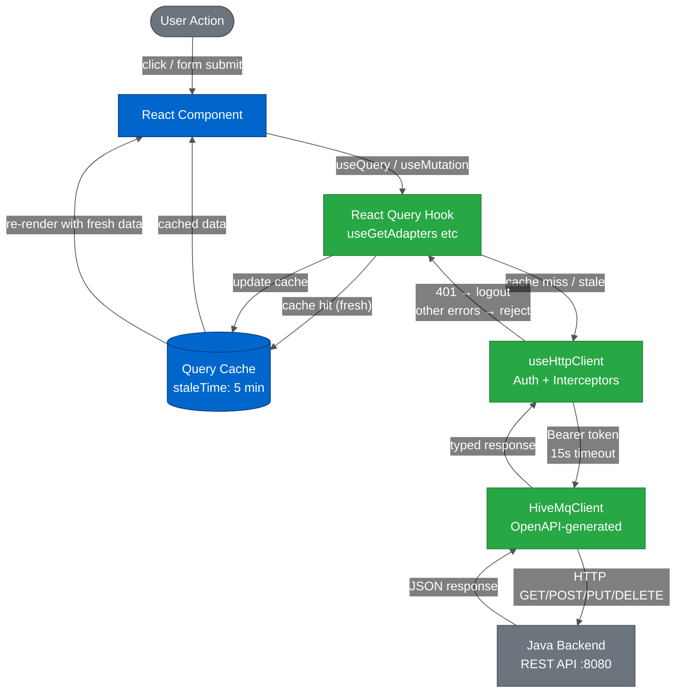
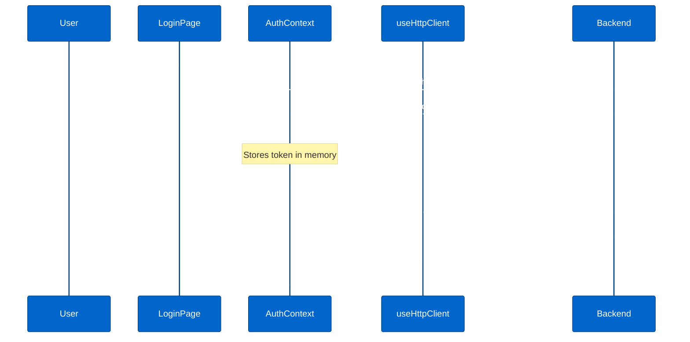
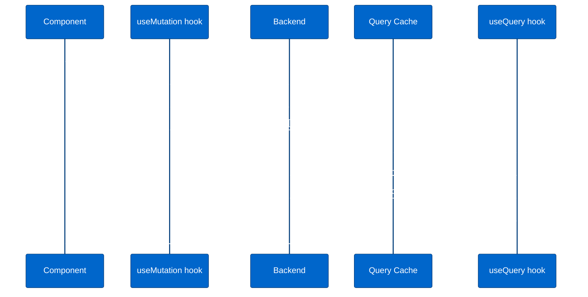
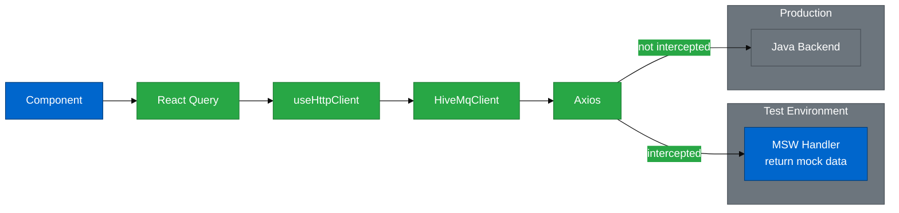

# Data Flow

---

## Table of Contents

- [Overview](#overview)
- [The Complete Flow](#the-complete-flow)
- [The API Client Stack](#the-api-client-stack)
  - [Layer 1: OpenAPI-Generated Client](#layer-1-openapi-generated-client)
  - [Layer 2: useHttpClient — Auth and Interceptors](#layer-2-usehttpclient--auth-and-interceptors)
  - [Layer 3: React Query Hooks](#layer-3-react-query-hooks)
- [Authentication Flow](#authentication-flow)
- [Read Flow (Queries)](#read-flow-queries)
  - [Query Cache Configuration](#query-cache-configuration)
  - [Query Keys](#query-keys)
  - [Polling Queries](#polling-queries)
- [Write Flow (Mutations)](#write-flow-mutations)
  - [The Invalidation Pattern](#the-invalidation-pattern)
- [Client State](#client-state)
  - [URL State (React Router)](#url-state-react-router)
  - [Application State (Zustand)](#application-state-zustand)
  - [Local Component State](#local-component-state)
- [Data Flow in Tests](#data-flow-in-tests)
- [Decision Guide: Which State Layer?](#decision-guide-which-state-layer)
- [Related Documentation](#related-documentation)

---

## Overview

The frontend is a **pure REST API client**. It holds no authoritative state — every piece of data that matters to the broker lives on the backend. The frontend's job is to:

1. **Fetch** data from the backend REST API
2. **Cache** it locally to avoid redundant requests
3. **Display** it in the UI
4. **Send mutations** back to the backend when users make changes
5. **Invalidate the cache** so fresh data is fetched after a change

This one-way dependency — backend is the source of truth, frontend subscribes — is the foundational constraint that shapes every data flow decision in the application.

---

## The Complete Flow



---

## The API Client Stack

Three layers sit between a component and the backend:

### Layer 1: OpenAPI-Generated Client

**`src/api/__generated__/HiveMqClient.ts`**

Generated automatically from the backend OpenAPI specification by `pnpm dev:openAPI`. Never edited manually. Provides typed methods for every backend endpoint, grouped by resource:

```typescript
client.protocolAdapters.getAdapters()      // GET /api/v1/management/protocol-adapters/adapters
client.bridges.getBridges()                // GET /api/v1/management/bridges
client.dataHubDataPolicies.getAllDataPolicies() // GET /api/v1/data-hub/data-validation/policies
```

The generated client uses Axios internally and returns `CancelablePromise<T>` with fully typed response models from `src/api/__generated__/models/`.

**See:** [OpenAPI Integration](../api/OPENAPI_INTEGRATION.md) for the generation workflow.

### Layer 2: useHttpClient — Auth and Interceptors

**`src/api/hooks/useHttpClient/useHttpClient.ts`**

A React hook that wraps `HiveMqClient` with two concerns the generated client cannot handle on its own:

**Authentication:** Reads the Bearer token from `AuthContext` and passes it to the client as `TOKEN`. The token is injected into every request as `Authorization: Bearer <token>`.

**Interceptors (via a shared `axiosInstance`):**

- **Request interceptor:** Sets `timeout: config.httpClient.axiosTimeout` (15 000 ms) on every outgoing request
- **Response interceptor:** Intercepts `401 Unauthorized` responses → calls `logout()` → navigates to `/login`

```typescript
// Simplified structure
export const useHttpClient = () => {
  const { credentials } = useAuth()

  return new HiveMqClient(
    {
      BASE: config.apiBaseUrl,
      TOKEN: credentials?.token,
      HEADERS: { Accept: 'application/json, application/problem+json' },
    },
    AxiosHttpRequestWithInterceptors  // custom class that injects timeout + 401 handler
  )
}
```

A simpler variant, `useSimpleHttpClient`, exists for unauthenticated requests (login page).

### Layer 3: React Query Hooks

**`src/api/hooks/`**

Hand-written hooks that wrap `useHttpClient` calls in React Query's `useQuery` or `useMutation`. This is where caching, polling, and cache invalidation logic lives. Components interact with this layer only — they never call `useHttpClient` directly.

```
src/api/hooks/
├── useProtocolAdapters/
│   ├── useGetAllProtocolAdapters.ts   ← useQuery
│   ├── useGetProtocolAdapter.ts       ← useQuery (single item)
│   ├── useCreateProtocolAdapter.ts    ← useMutation
│   ├── useUpdateProtocolAdapter.ts    ← useMutation
│   └── useDeleteProtocolAdapter.ts    ← useMutation
├── useGetBridges/
├── useConnection/                     ← status polling hooks
└── ...
```

---

## Authentication Flow



The Bearer token is stored **in memory** via `AuthContext` (React context, not `localStorage`). It is lost on page refresh — the user must re-authenticate. The token is injected into every API call via `useHttpClient`.

---

## Read Flow (Queries)

When a component mounts, React Query checks the cache. If data is fresh (within `staleTime`), it is returned immediately from the cache and no network request is made. If stale or absent, a request goes to the backend.

```typescript
// Typical query hook
export const useGetAllProtocolAdapters = () => {
  const appClient = useHttpClient()

  return useQuery({
    queryKey: [QUERY_KEYS.ADAPTERS],
    queryFn: () => appClient.protocolAdapters.getAdapters(),
    // inherits global defaults: staleTime 5min, refetchOnMount: true
  })
}
```

```typescript
// Component — only knows about { data, isLoading, error }
const { data, isLoading, error } = useGetAllProtocolAdapters()
```

### Query Cache Configuration

**`src/api/queryClient.ts`**

The global `QueryClient` is configured once and provided at the app root via `QueryClientProvider`:

| Setting | Value | Effect |
|---------|-------|--------|
| `staleTime` | 5 minutes | Data fetched less than 5 min ago is served from cache without a network request |
| `refetchOnMount` | `true` | When a component mounts, stale data triggers a background refetch |
| `refetchOnWindowFocus` | `false` | Switching browser tabs does not trigger refetches |
| `refetchOnReconnect` | `false` | Network reconnection does not trigger refetches |
| `networkMode` | `'always'` | Queries fire regardless of `navigator.onLine` — appropriate since the backend is on localhost or LAN |

### Query Keys

All query keys are defined as string constants in **`src/api/utils.ts`** under `QUERY_KEYS`:

```typescript
export const QUERY_KEYS = {
  ADAPTERS: 'adapters',
  BRIDGES: 'bridges',
  CONNECTION_STATUS: 'connection.status',
  DISCOVERY_TOPIC_FILTERS: 'discovery.topic-filters',
  FRONTEND_CAPABILITIES: 'frontend.capabilities',
  METRICS: 'metrics',
  PULSE_STATUS: 'pulse.status',
  // ... 30+ keys total
}
```

Using a centralised enum prevents typos from creating orphaned cache entries and makes it easy to find all consumers of a key with a simple text search.

For parameterised queries (single item by ID), the key includes the parameter:

```typescript
queryKey: [QUERY_KEYS.ADAPTERS, adapterId]  // separate cache entry per adapter
```

### Polling Queries

Five hooks poll the backend on a fixed interval to keep status information live. They use `refetchInterval` rather than `staleTime`:

```typescript
// Example: adapter connection status — refetches every 5 seconds
export const useGetAdaptersStatus = () => {
  const appClient = useHttpClient()
  return useQuery({
    queryKey: [QUERY_KEYS.CONNECTION_STATUS],
    queryFn: () => appClient.protocolAdapters.getAdapters(),
    refetchInterval: config.httpClient.pollingRefetchInterval, // 5000 ms
  })
}
```

The 5 second interval (`config.httpClient.pollingRefetchInterval`) is a hardcoded application constant — it applies uniformly to:

- `useGetAdaptersStatus`
- `useGetBridgesStatus`
- `useGetBridgeConnectionStatus`
- `useGetSample` (MQTT metrics sampling)
- `useGetPulseStatus`

---

## Write Flow (Mutations)

Mutations send changes to the backend and then synchronise the cache. The standard pattern:

```typescript
export const useCreateProtocolAdapter = () => {
  const appClient = useHttpClient()

  return useMutation({
    mutationFn: (adapter: Adapter) =>
      appClient.protocolAdapters.addAdapter({ requestBody: adapter }),

    onSuccess: () => {
      // Invalidate the adapters list cache → triggers background refetch
      queryClient.invalidateQueries({ queryKey: [QUERY_KEYS.ADAPTERS] })
    },
  })
}
```

```typescript
// Component — calls mutate() on user action
const { mutate, isPending } = useCreateProtocolAdapter()

<Button onClick={() => mutate(newAdapter)} isLoading={isPending}>
  Save
</Button>
```

### The Invalidation Pattern

After a successful mutation, the response from the backend is not directly used to update the cache. Instead, the relevant query key is **invalidated**, which marks the cached data as stale and triggers an automatic background refetch.



**Why invalidate rather than merge the mutation response?** The backend may apply transformations, set default values, or trigger side effects not visible in the creation response. A fresh `GET` guarantees the UI reflects the actual backend state, not an optimistic guess.

Some mutations invalidate multiple keys when a write affects several resource types:

```typescript
// Deleting an asset mapper affects both the mapper list and the pulse assets list
queryClient.invalidateQueries({ queryKey: [QUERY_KEYS.ASSET_MAPPER] })
queryClient.invalidateQueries({ queryKey: [QUERY_KEYS.PULSE_ASSETS] })
```

---

## Client State

Not all state comes from the backend. Some state is purely local to the browser session.

### URL State (React Router)

Navigation state — which page is shown, which item is selected, which tab is active — is managed by the URL via React Router v6. This means:

- Sharing or bookmarking a URL preserves the UI state
- Browser back/forward buttons work correctly
- Deep linking into a specific adapter or policy works without extra code

React Router is the source of truth for anything that should survive a page navigation.

### Application State (Zustand)

Complex client-side state that is too large or dynamic for URL encoding uses Zustand stores. Currently, Zustand is used primarily within the extensions:

**DataHub stores:**

- `useDataHubDraftStore` — the in-progress policy being designed on the React Flow canvas (nodes, edges, selected element)
- `usePolicyChecksStore` — validation state for the policy under construction

These stores hold transient state (unsaved work) that should reset on navigation away. They do not persist to `localStorage` or the backend.

**See:** [DataHub Architecture](./DATAHUB_ARCHITECTURE.md) for the full store design.

### Local Component State

Ephemeral UI state — whether a modal is open, whether a tooltip is visible, transient form input before submission — uses standard React `useState`. It is not shared, not cached, and not persisted.

**The hierarchy:**

```
Backend (source of truth)
  └─ React Query cache  (server state, auto-synced)
       └─ URL / React Router  (navigation state, shareable)
            └─ Zustand stores  (complex client state, session-scoped)
                 └─ useState  (ephemeral UI state, component-scoped)
```

---

## Data Flow in Tests

In tests, **MSW (Mock Service Worker)** intercepts HTTP requests at the network boundary. The full data flow runs exactly as in production — React Query, `useHttpClient`, `HiveMqClient`, Axios — except the HTTP call never reaches the actual backend.



MSW handlers are co-located with the hooks they mock, in `__handlers__` directories:

```
src/api/hooks/useProtocolAdapters/
├── useGetAllProtocolAdapters.ts
└── __handlers__/
    └── index.ts   ← MSW handler returning mock adapter data
```

This means the same mock data used in unit and component tests is reused by the `DEV_MOCK_SERVER` feature flag in development mode.

**See:** [MSW API Mocking](../api/MSW_MOCKING.md) for handler patterns and test setup.

---

## Decision Guide: Which State Layer?

| Type of state | Where it lives | Example |
|---|---|---|
| Backend resource list | React Query cache | List of protocol adapters |
| Backend resource (single) | React Query cache, parameterised key | Adapter by ID |
| Live status (polled) | React Query cache, `refetchInterval` | Adapter connection status |
| Current page / selected item | URL (React Router) | `/adapters/opcua-1` |
| Complex in-progress edit | Zustand store | DataHub policy draft |
| Modal open/closed | `useState` | Confirmation dialog |
| Transient form input | `useState` (or React Hook Form) | Text field value before submit |

**If in doubt:** start with React Query for anything that touches the backend, `useState` for anything that doesn't, and only reach for Zustand when `useState` becomes unwieldy across multiple components.

---

## Related Documentation

**API Layer:**

- [OpenAPI Integration](../api/OPENAPI_INTEGRATION.md) — generated client, regeneration workflow
- [React Query Patterns](../api/REACT_QUERY_PATTERNS.md) — detailed hook patterns, caching strategy, mutations
- [MSW API Mocking](../api/MSW_MOCKING.md) — test handler patterns

**Architecture:**

- [Architecture Overview](./OVERVIEW.md) — layer diagram, module structure
- [DataHub Architecture](./DATAHUB_ARCHITECTURE.md) — Zustand store design for DataHub
- [Workspace Architecture](./WORKSPACE_ARCHITECTURE.md) — React Flow canvas data flows
- State Management _(planned)_

**Configuration:**

- [Configuration](../technical/CONFIGURATION.md#the-config-singleton) — `config.httpClient` constants (timeout, polling interval, network mode)
