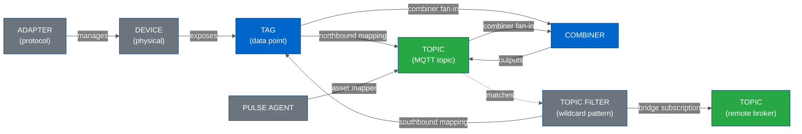
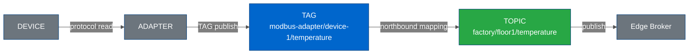
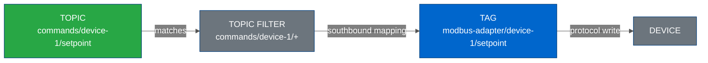
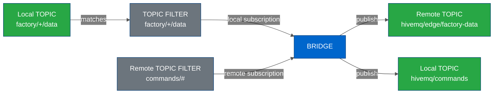
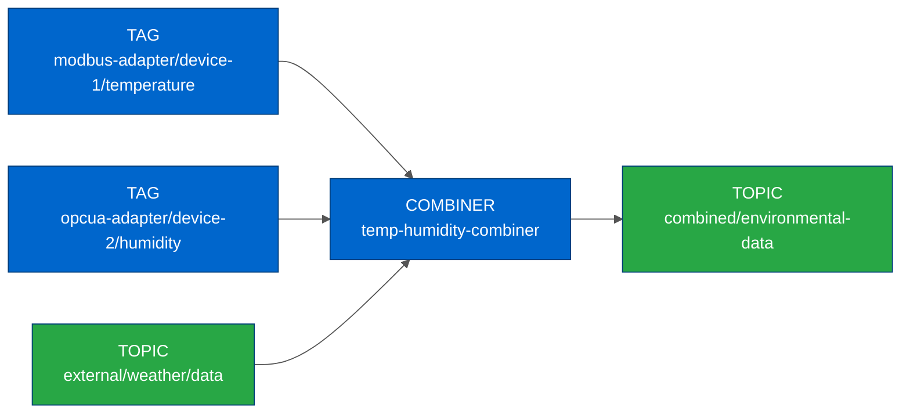
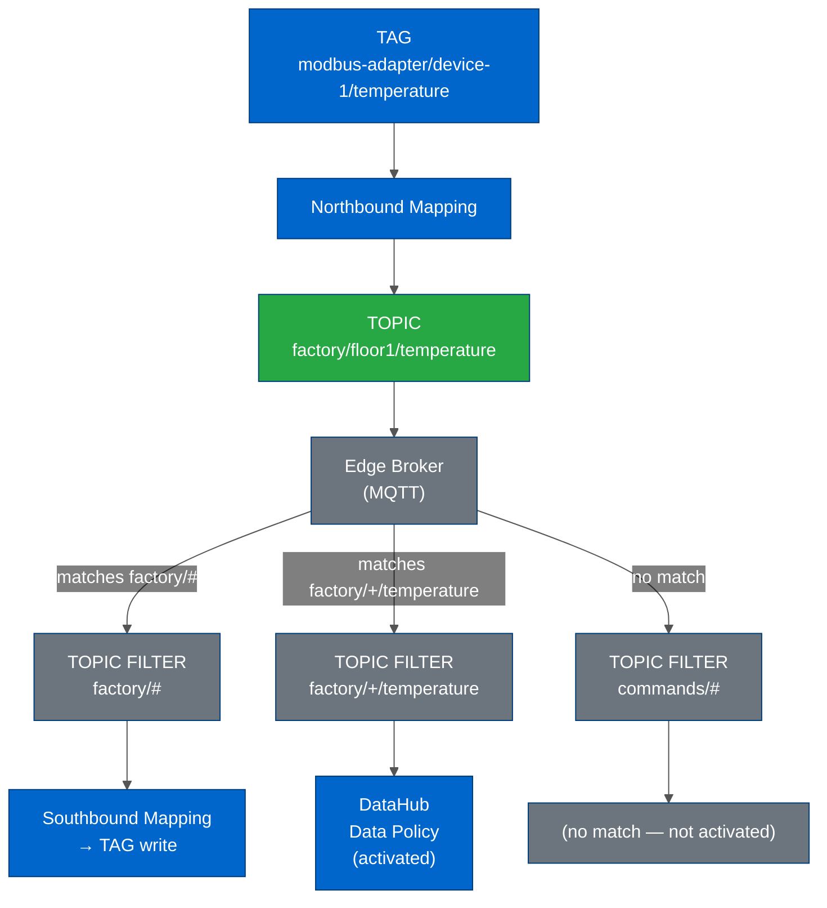

# Domain Model

---

## Table of Contents

- [Overview](#overview)
- [Integration Points](#integration-points)
  - [TAG](#tag--device-data-point)
  - [TOPIC](#topic--mqtt-topic)
  - [TOPIC FILTER](#topic-filter--pattern-matcher)
  - [COMBINER](#combiner)
  - [BRIDGE](#bridge)
  - [ASSET MAPPER](#asset-mapper)
  - [ADAPTER and DEVICE](#adapter-and-device)
- [Transformation Flows](#transformation-flows)
  - [Northbound Mapping — TAG to TOPIC](#northbound-mapping--tag-to-topic)
  - [Southbound Mapping — TOPIC FILTER to TAG](#southbound-mapping--topic-filter-to-tag)
  - [Bridge Subscription — TOPIC to TOPIC](#bridge-subscription--topic-to-topic)
  - [Combiner — Fan-in to TOPIC](#combiner--fan-in-to-topic)
- [Topic Filter as Pattern Matcher](#topic-filter-as-pattern-matcher)
- [Data Aggregation Layer](#data-aggregation-layer)
- [Entity Reference](#entity-reference)
- [Related Documentation](#related-documentation)

---

## Overview

HiveMQ Edge organizes its integration layer around **three core integration points** — TAG, TOPIC, and TOPIC FILTER — connected by **four transformation types** — northbound mapping, southbound mapping, bridge subscription, and combiner.



**Key insight:** A TOPIC FILTER is a wildcard pattern that matches MQTT topics. When a topic is published on the Edge broker and matches a filter, the entities associated with that filter (southbound mappings, DataHub policies) activate. This makes the TOPIC → TOPIC FILTER relationship the central cross-domain connection.

---

## Integration Points

### TAG — Device Data Point

A TAG is a named data point exposed by a physical device through a protocol adapter.

**API type:** `DomainTag`

**Examples:**
- `modbus-adapter/device-1/temperature`
- `opcua-adapter/plc-2/pressure`

**Naming:** Tags use a hierarchical path format — `{adapterId}/{deviceId}/{tagName}`. The adapter ID is always the first segment.

**Roles in transformations:**
- Source of northbound mappings (TAG → TOPIC)
- Target of southbound mappings (TOPIC FILTER → TAG)
- Source input for combiners

**Schema:**

```typescript
interface DomainTag {
  name: string // Unique hierarchical identifier
  adapterId: string // Parent adapter ID
  definedTags?: DefinedTag // Optional schema (data type, units, range)
}
```

---

### TOPIC — MQTT Topic

A TOPIC is an MQTT topic string on the Edge broker where data is published or consumed.

**Examples:**
- `factory/floor1/temperature`
- `enterprise/manufacturing/sensor-data`
- `hivemq/edge/factory-data`

**MQTT topic structure:** Slash-delimited path. Topics are exact strings — they do not contain wildcards. Wildcards appear only in TOPIC FILTERs.

**Roles in transformations:**
- Destination of northbound mappings (TAG → TOPIC)
- Source and destination in bridge subscriptions (TOPIC ↔ TOPIC across brokers)
- Output of combiners (multiple sources → TOPIC)
- Matched by TOPIC FILTERs

---

### TOPIC FILTER — Pattern Matcher

> [!IMPORTANT]
> A TOPIC FILTER is not a topic — it is a **wildcard pattern** that matches one or more MQTT topics. This distinction is the most commonly misunderstood concept in the domain model.

**API type:** `TopicFilter`

**MQTT wildcard syntax:**
- `+` — matches exactly one topic level (`factory/+/temperature` matches `factory/floor1/temperature` but not `factory/floor1/sensors/temperature`)
- `#` — matches any number of topic levels (`factory/#` matches any topic under `factory/`)

**Examples:**
- `factory/+/temperature` — one sensor type across all zones
- `enterprise/+/sensor-data/#` — all sensor data from any department
- `commands/device-1/+` — all command types for a specific device

**Roles in transformations:**
- Source of southbound mappings (TOPIC FILTER → TAG)
- Subscription filters in bridge configurations (local or remote)
- Pattern input for DataHub data policies (see [Topic Filter as Pattern Matcher](#topic-filter-as-pattern-matcher))

**Schema:**

```typescript
interface TopicFilter {
  topicFilter: string // MQTT filter with wildcards
  description?: string
  strategy?: string // Message handling strategy
  maxQueuedMessages?: number
}
```

---

### COMBINER

A COMBINER aggregates data from multiple sources (TAGs and/or TOPICs) into a single output TOPIC.

**API type:** `Combiner`

**Pattern:** Fan-in — many sources → one output.

**Example use case:** Combine temperature readings from three different Modbus adapters into a single `combined/environmental-data` topic for a downstream dashboard.

**Schema:**

```typescript
interface Combiner {
  id: string
  sources: EntityReferenceList // Adapter or bridge IDs contributing data
  mappings: DataCombiningList // Source → destination rules
}

interface DataCombining {
  source: string // Source TAG or TOPIC path
  destination: string // Output TOPIC
  transformScript?: string // Optional DataHub script reference
}
```

---

### BRIDGE

A BRIDGE connects the local Edge broker to a remote MQTT broker, forwarding messages in one or both directions.

**API type:** `Bridge`

**Pattern:** Bidirectional relay — local TOPIC FILTER → remote TOPIC and/or remote TOPIC FILTER → local TOPIC.

**Schema:**

```typescript
interface Bridge {
  id: string
  host: string // Remote broker URL
  localSubscriptions: Subscription[] // Edge → remote forwarding rules
  remoteSubscriptions: Subscription[] // Remote → Edge forwarding rules
}

interface Subscription {
  filters: string[] // TOPIC FILTER patterns to match locally
  destination: string // Target TOPIC on the receiving broker
  maxQoS?: number
}
```

**Visualization note:** Bridges introduce TOPIC → TOPIC flows across broker boundaries. Both ends of a bridge subscription are MQTT topics, but they live on different brokers.

---

### ASSET MAPPER

An ASSET MAPPER is a specialized COMBINER that references managed assets from a Pulse Agent rather than raw TAGs or TOPICs.

**Relationship:** Asset Mapper extends Combiner — it shares the same API structure but its `sources` list contains exactly one Pulse Agent reference and its mappings reference asset IDs.

**Pattern:** Pulse managed assets → TOPIC.

**Status values:** Pulse assets can be `MAPPED` (actively publishing to a TOPIC) or `UNMAPPED` (asset exists but has no output TOPIC configured).

---

### ADAPTER and DEVICE

**ADAPTER** — A protocol adapter that translates between a device-native protocol (Modbus, OPC UA, MQTT, HTTP, etc.) and the Edge broker. An adapter manages one or more DEVICEs and exposes their TAGs.

**DEVICE** — A physical or virtual device connected through a protocol adapter. A device owns TAGs. Devices are not independently configurable from the API perspective — they exist as part of adapter configuration.

**Hierarchy:** `ADAPTER` → `DEVICE` → `TAG`

---

## Transformation Flows

### Northbound Mapping — TAG to TOPIC

Northbound mappings publish device data to the MQTT broker.



**API type:** `NorthboundMapping`

```typescript
interface NorthboundMapping {
  tagName: string // Source TAG path
  topic: string // Destination MQTT topic
  maxQoS?: number
  messageFormat?: string // JSON, XML, etc.
}
```

**Cardinality:** One TAG can map to multiple TOPICs (one-to-many).

---

### Southbound Mapping — TOPIC FILTER to TAG

Southbound mappings write incoming messages back to physical devices. The source is a TOPIC FILTER (wildcard pattern) — any message published to a matching topic triggers the write.



**API type:** `SouthboundMapping`

**Cardinality:** One TOPIC FILTER can map to one TAG. Multiple TOPIC FILTERs can map to the same TAG.

---

### Bridge Subscription — TOPIC to TOPIC

Bridge subscriptions relay messages between the local Edge broker and a remote MQTT broker.



**Direction:** A bridge has local subscriptions (Edge → remote) and remote subscriptions (remote → Edge). Both directions use TOPIC FILTER patterns.

---

### Combiner — Fan-in to TOPIC

Combiners merge multiple data sources into a single output topic.



---

## Topic Filter as Pattern Matcher

> [!IMPORTANT]
> This section explains the most consequential — and most frequently overlooked — relationship in the domain model: the connection between TOPICs and TOPIC FILTERs, and how that connection activates DataHub.

A TOPIC FILTER is an MQTT subscription pattern. When the Edge broker receives a message on a MQTT topic, the broker evaluates every active TOPIC FILTER. Any filter whose wildcard pattern matches the topic causes the associated entities to activate.



**Implications:**

1. **One topic activates multiple filters.** A topic published to `factory/floor1/temperature` matches both `factory/#` and `factory/+/temperature`. Both their associated entities activate.

2. **TOPIC FILTERs are the gateway to DataHub.** DataHub data policies attach to TOPIC FILTERs. A policy runs on every message that matches its filter. The domain model is therefore not isolated to the Edge data layer — it extends into DataHub's validation, transformation, and routing layer.

3. **Ontology connections cross domain boundaries.** An entity graph of the full data flow includes: `TAG → TOPIC → [matched by] → TOPIC FILTER → [triggers] → DataHub policy → [executes] → schema validation / script transformation / behavior FSM`.

4. **Wildcard matching is computationally significant.** With many topics and many filters, the match set is an O(n×m) computation. The chord diagram visualization in the existing codebase already performs this matching (`mqttTopicMatch`) to determine relationship weights.

---

## Data Aggregation Layer

All entity data for the domain model comes from five API endpoints, aggregated by the `useGetDomainOntology` hook.

**File:** `src/modules/DomainOntology/hooks/useGetDomainOntology.ts`

| Data | API Endpoint | Hook |
|------|-------------|------|
| Tags | `GET /api/v1/domain/tags` | `useListDomainTags` |
| Northbound mappings | `GET /api/v1/domain/mappings/northbound` | `useListDomainNorthboundMappings` |
| Southbound mappings | `GET /api/v1/domain/mappings/southbound` | `useListDomainSouthboundMappings` |
| Topic filters | `GET /api/v1/topic-filters` | `useListTopicFilters` |
| Bridges | `GET /api/v1/mqtt/bridges` | `useListBridges` |

The hook returns a unified `DomainOntology` object:

```typescript
interface DomainOntology {
  tags: UseQueryResult<DomainTagList>
  topicFilters: UseQueryResult<TopicFilterList>
  northMappings: UseQueryResult<NorthboundMappingList>
  southMappings: UseQueryResult<SouthboundMappingList>
  bridgeSubscriptions: BridgeSubscription
  isLoading: boolean
  isError: boolean
}
```

Bridge data undergoes a flattening step inside the hook — bridge subscriptions (which contain filter arrays) become flat arrays of `[filter, destination]` pairs for easier consumption by visualization hooks.

---

## Entity Reference

| Entity | API Type | Layer | Roles |
|--------|----------|-------|-------|
| `TAG` | `DomainTag` | Device | Source (northbound), target (southbound), combiner input |
| `TOPIC` | `string` (MQTT path) | Broker | Northbound destination, combiner output, bridge endpoint |
| `TOPIC FILTER` | `TopicFilter` | Broker | Pattern matcher, southbound source, bridge filter, DataHub trigger |
| `COMBINER` | `Combiner` | Aggregation | Fan-in from multiple TAGs/TOPICs to single TOPIC |
| `BRIDGE` | `Bridge` | Connectivity | Cross-broker relay via TOPIC FILTER subscriptions |
| `ASSET MAPPER` | `Combiner` (specialized) | Aggregation | Pulse asset → TOPIC mapping |
| `ADAPTER` | `Adapter` | Protocol | Manages devices, owns tags |
| `DEVICE` | `Device` | Physical | Exposes tags via adapter |

---

## Related Documentation

**Formal Models:**

- [OWL Ontology](../ontology/DOMAIN_ONTOLOGY.ttl) — Machine-readable OWL 2 ontology in Turtle syntax; loadable in Protégé, queryable via SPARQL
- [Ontology README](../ontology/README.md) — How to load, query, and extend the OWL ontology

**Architecture:**

- [Workspace Architecture](./WORKSPACE_ARCHITECTURE.md) — How domain entities are represented as React Flow nodes
- [DataHub Architecture](./DATAHUB_ARCHITECTURE.md) — How DataHub data policies attach to TOPIC FILTERs
- [State Management](./STATE_MANAGEMENT.md) — Where domain data lives (React Query cache)

**Walkthroughs:**

- [Domain Ontology Visualization](../walkthroughs/DOMAIN_ONTOLOGY.md) — The visualizations explored to represent this model in the UI

**External:**
- [Edge Domain Ontology (Miro)](https://miro.com/app/board/uXjVLpkTwW8=) — Domain map with JSON schema shapes and API sketches
- [Edge | Alternative Workspace as ETL Designer (Miro)](https://miro.com/app/board/uXjVIFl3nyY=) — ETL canvas model for adapters, combiners, bridges, and DataHub mappers

**See:** [Reference Materials](../technical/REFERENCE_MATERIALS.md) for the full Miro board catalogue.
