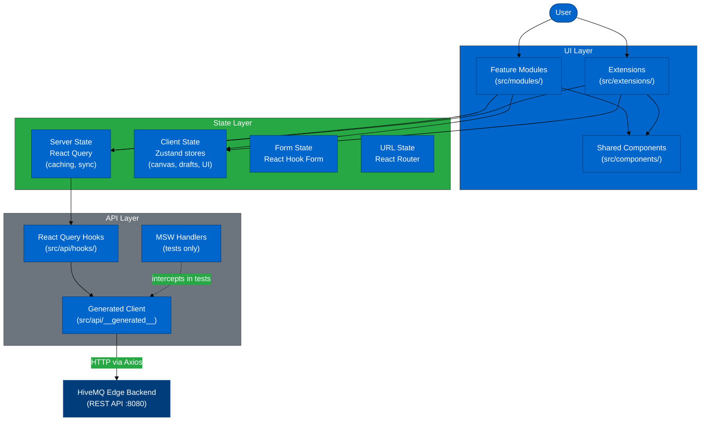
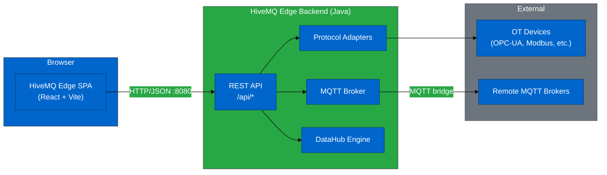

# Architecture Overview

---

## Table of Contents

- [Application Context](#application-context)
- [Module Architecture](#module-architecture)
  - [Directory Structure](#directory-structure)
  - [Feature Modules](#feature-modules)
  - [The Extension Model](#the-extension-model)
- [Layer Architecture](#layer-architecture)
- [Core Design Principles](#core-design-principles)
- [Technology Rationale](#technology-rationale)
- [System Boundaries](#system-boundaries)
- [Known Gaps and Planned Improvements](#known-gaps-and-planned-improvements)
- [Related Documentation](#related-documentation)

---

## Application Context

HiveMQ Edge is an edge MQTT broker that bridges operational technology (OT) protocols to MQTT. The frontend is the operations console for the broker: it runs entirely in the browser as a single-page application (SPA) and communicates with the backend over a REST API.

**What users do in the UI:**

- Configure protocol adapters (OPC-UA, Modbus, EtherNet/IP, S7, BACnet, 20+ types)
- Set up MQTT bridges between brokers
- Visualise device topology as an interactive graph
- Design MQTT data and behavior policies (DataHub)
- Monitor events, metrics, connection status, and notifications

The frontend does **not** perform any protocol bridging itself — it is a pure configuration and monitoring surface. All state that matters to the broker lives on the backend; the frontend's job is to make that state legible and editable.

---

## Module Architecture

### Directory Structure

```
src/
├── api/                        # API contract layer
│   ├── __generated__/          # Auto-generated OpenAPI client (never edit manually)
│   ├── hooks/                  # Hand-written React Query hooks (wrap generated client)
│   ├── schemas/                # JSON schemas for RJSF forms
│   └── types/                  # Supplementary TypeScript types (e.g. ProblemDetails)
│
├── components/                 # Shared UI components (reused across modules)
│
├── modules/                    # Feature modules (one per domain area)
│   ├── App/                    # Router, main shell, providers
│   ├── Workspace/              # Device topology graph canvas
│   ├── ProtocolAdapters/       # Adapter configuration with RJSF
│   ├── Bridges/                # MQTT bridge management
│   ├── Dashboard/              # Overview page
│   ├── Pulse/                  # Pulse feature
│   ├── Metrics/                # Metrics views
│   ├── EventLog/               # Event log
│   ├── Notifications/          # Notification management
│   ├── Mappings/               # Topic mappings
│   ├── UnifiedNamespace/       # Unified namespace configuration
│   ├── Auth/                   # Authentication handling
│   ├── Login/                  # Login page
│   └── Theme/                  # Custom Chakra UI theme
│
├── extensions/                 # Self-contained extension modules
│   └── datahub/                # DataHub policy designer (own routing + translations)
│
├── hooks/                      # Shared cross-module React hooks
├── locales/                    # Translation files (en/translation.json)
├── config/                     # App-level configuration (i18n, etc.)
├── types/                      # Global TypeScript type definitions
├── utils/                      # Shared utility functions
└── __test-utils__/             # Test helpers, MSW handlers, React Flow test wrappers
```

### Feature Modules

Each module in `src/modules/` owns one functional area of the application. The convention is:

- Colocate components, hooks, and types within the module directory
- Use the shared API layer (`src/api/hooks/`) for backend data
- Use `src/components/` for reusable UI primitives
- Keep routing declarations in `src/modules/App/`

The 19 modules range from simple read-only views (EventLog, Metrics) to complex interactive editors (Workspace, ProtocolAdapters).

### The Extension Model

DataHub lives in `src/extensions/datahub/` rather than `src/modules/` because it is substantially more complex than a module and must remain independently operable:

- **Own routing:** `datahub/routes.tsx` — mounted into App router, can evolve independently
- **Own translations:** `datahub/locales/en/datahub.json` — separate i18n namespace
- **Own API hooks:** `datahub/api/hooks/` — not shared with the core hook layer
- **Own path alias:** `@datahub/` maps to `src/extensions/datahub/`

This isolation means DataHub can be developed and tested without touching the rest of the application, and could theoretically be disabled or replaced without restructuring the core modules.

---

## Layer Architecture



---

## Core Design Principles

### 1. Server State vs. Client State Separation

**What:** React Query owns all server-derived state. Zustand owns all client-only state.

**Why:** Server data (adapter status, policies, bridge config) changes externally: it needs cache invalidation, background refetch, and stale-while-revalidate behaviour. Client state (canvas node positions, draft policies under construction, UI panel open/closed) has no network representation — it must not trigger API calls and must survive component unmounts. Mixing these concerns in a single store leads to either unnecessary re-fetches or lost local state.

**In practice:**
- `src/api/hooks/` — React Query hooks for all backend data
- `src/modules/Workspace/` Zustand store — canvas node positions, filter state
- `src/extensions/datahub/hooks/useDataHubDraftStore` — in-progress policy graph
- `src/extensions/datahub/hooks/usePolicyChecksStore` — validation results

### 2. Backend-Driven Form Configuration

**What:** Protocol adapter forms are generated at runtime from JSON Schema returned by the API, using RJSF (`@rjsf/chakra-ui`). No form is hardcoded in the frontend.

**Why:** There are 20+ adapter types, each with different configuration parameters. Hardcoding each form would make adding or modifying adapter types a frontend task. With backend-driven RJSF, adding a new adapter type requires only a backend schema update — the frontend renders it automatically.

**In practice:**
- `src/api/schemas/` — JSON schema for forms
- `src/modules/ProtocolAdapters/` — RJSF form rendering
- `src/extensions/datahub/` — DataHub policy forms also use RJSF in places

**See:** [Protocol Adapter Architecture](./PROTOCOL_ADAPTER_ARCHITECTURE.md)

### 3. Visual Canvas for Spatial Relationships

**What:** Topology (Workspace) and policy design (DataHub) both use React Flow canvas-based UIs.

**Why:** A table of adapters cannot communicate data flow direction, connection topology, or the relationships between components. The spatial canvas gives users an immediate mental model of how data moves through the system. For DataHub policies, the node graph directly represents the computational pipeline — the visual metaphor matches the domain.

**In practice:**
- `src/modules/Workspace/` — topology graph with 10 node types, status propagation
- `src/extensions/datahub/` — policy designer canvas with drag-and-drop toolbox

### 4. Validate Before Commit

**What:** Complex operations go through a validation step before the backend commit.

**Why:** Publishing an invalid DataHub policy wastes round trips and server computation. The dry-run API endpoint lets the frontend surface all validation errors in one pass before committing. Similarly, RJSF validates schema constraints client-side on every keystroke.

**In practice:**
- DataHub: ToolbarDryRun → dryRun API → PolicyErrorReport → ToolbarPublish
- RJSF: AJV8 schema validation on every form field change

### 5. OpenAPI as the Single Source of Truth

**What:** The TypeScript client (`src/api/__generated__/`) is generated from the backend OpenAPI spec. Types are never written by hand for API shapes.

**Why:** The backend team owns the API contract. Manually maintained types drift — the generator keeps the frontend in sync with the spec. Any mismatch between spec and reality is a backend issue to fix at source, not a frontend workaround to maintain.

**In practice:**
- `pnpm dev:openAPI` regenerates the client from `../hivemq-edge-openapi/dist/bundle.yaml`
- All files in `src/api/__generated__/` are read-only outputs — never edited manually

**Current limitation:** The generator (`openapi-typescript-codegen`) discards error response schemas. See [Known Gaps](#known-gaps-and-planned-improvements).

### 6. Accessibility as a Gate, Not an Afterthought

**What:** Every Cypress component test ends with `cy.checkAccessibility()` against WCAG 2.1 AA standards. This is mandatory, not optional.

**Why:** Adding accessibility checks after release is expensive — regressions accumulate invisibly. Embedding axe checks in the component test harness means every new component is verified at point of creation, and regressions are caught in CI before merge.

**In practice:**
- `cy.checkAccessibility()` — required last step in every component test
- `cy.injectAxe()` — required before the check
- CI: Cypress runs on every PR; accessibility failures block merge

**See:** [Testing Architecture](./TESTING_ARCHITECTURE.md)

### 7. Internationalisation for All User-Facing Text

**What:** All user-visible strings live in `src/locales/en/translation.json` or `src/extensions/datahub/locales/en/datahub.json`. No string literals in JSX.

**Why:** Even in English-only deployments, i18n enforces separation of content from structure. It also means every user-facing string has a single canonical location — easier to audit, update, and eventually translate.

**In practice:**
- `const { t } = useTranslation()` in every component with text
- ESLint does not enforce this currently — it is a team convention

---

## Technology Rationale

### Core Framework

| Technology | Version | Rationale |
|------------|---------|-----------|
| **React** | 18.3 | Industry standard; hooks model aligns with the state separation strategy; large ecosystem |
| **TypeScript** | 5.7 strict | Strict mode prevents `any` propagation; catches API shape mismatches at compile time |
| **Vite** | 7.1 | ES-module-native build; HMR is near-instant; Istanbul instrumentation plugin for coverage |

### UI Component Library

| Technology | Version | Rationale |
|------------|---------|-----------|
| **Chakra UI** | v2.8 | Accessible by default; composable primitives; theming system; `@rjsf/chakra-ui` package uses the same version |
| **React Router** | v6 | Declarative nested routing; file-based structure in `src/modules/App/` |

**Note:** Chakra UI v2 is aging — v3 is available but introduces breaking changes across the entire component API. A migration analysis has been completed. See [Known Gaps](#known-gaps-and-planned-improvements).

### State Management

| Technology | Version | Rationale |
|------------|---------|-----------|
| **TanStack React Query** | v5 | Best-in-class server state: automatic caching, background refetch, stale-while-revalidate, devtools |
| **Zustand** | v4 | Minimal boilerplate for client-only state; no Redux ceremony; subscription model fits canvas performance requirements |
| **React Hook Form** | v7 | Uncontrolled form state; avoids re-rendering the entire form tree on every keystroke |

### Canvas and Visualisation

| Technology | Version | Rationale |
|------------|---------|-----------|
| **React Flow (@xyflow/react)** | v12 | Production-quality node graph editor; pan, zoom, selection, custom nodes/edges — no building from scratch |
| **Dagre / ELK / Cola** | — | Graph layout algorithms: hierarchical (Dagre), hierarchical with constraints (ELK), force-directed (Cola) — different use cases require different layout strategies |
| **Nivo / Recharts** | — | Chart library coverage: Nivo for complex charts (chord, sankey, sunburst), Recharts for simpler time-series |

### Forms and Schema

| Technology | Version | Rationale |
|------------|---------|-----------|
| **RJSF (@rjsf/chakra-ui)** | v5.24 | Renders adapter configuration forms from backend-provided JSON Schema; making form generation backend-driven is the core protocol adapter design principle |
| **AJV8** | — | JSON Schema validator; validates form state against schema on every change |

### API and Mocking

| Technology | Version | Rationale |
|------------|---------|-----------|
| **Axios** | v1.13 | HTTP client with interceptors; auth header injection and 401-redirect handling via `useHttpClient()` |
| **openapi-typescript-codegen** | 0.25 | Generates TypeScript client from OpenAPI spec; **deprecated upstream** — migration planned |
| **MSW (Mock Service Worker)** | v2 | Intercepts at network level; same handlers work in browser (dev), Cypress (component/E2E), and Vitest (unit) — no separate mocking layer per environment |

### Editor Components

| Technology | Rationale |
|------------|-----------|
| **Monaco Editor** | VS Code's editor engine; used for JSON and JavaScript editing in DataHub scripts and schemas |
| **Tiptap** | Headless rich-text editor; used for structured text fields with mention support |

### Testing

| Technology | Rationale |
|------------|-----------|
| **Cypress** | Unified runner for component and E2E tests; component testing avoids needing a running app |
| **Vitest** | Fast unit tests for utilities and hooks; Vite-native so shares config |
| **cypress-axe** | Automated WCAG 2.1 AA checks embedded in every component test |
| **Percy** | Visual regression: screenshots compared against baseline on every PR |

**See:** [Testing Architecture](./TESTING_ARCHITECTURE.md) for the full 7-layer testing pyramid.

---

## System Boundaries



### Frontend-Backend Contract

- **Protocol:** HTTP/REST, JSON bodies
- **Error format:** `application/problem+json` (RFC 9457) — DataHub only; other domains use an older format
- **Authentication:** JWT token injected as `Authorization: Bearer` header via Axios interceptor in `useHttpClient()`
- **Development proxy:** Vite proxies `/api/*` to `http://127.0.0.1:8080` in dev mode
- **Production serving:** Backend serves the static `dist/` files; `/api/*` is handled natively

### What the Frontend Does Not Own

- No server-side rendering
- No direct database access
- No protocol bridging logic
- No MQTT connection handling (except the `mqtt` library used for topic inspection)
- No persistence — all configuration state lives on the backend

---

## Known Gaps and Planned Improvements

Four technical analysis documents cover the most significant improvement areas. Each links to its full analysis for migration scope, phasing, and risk assessment.

### 1. OpenAPI Code Generator — Deprecated and Limitation-Bound

**Current:** `openapi-typescript-codegen@0.25.0` — no longer maintained upstream.

**Critical limitation:** The generator discards all error response schemas from the OpenAPI spec. Every API error arrives as `ApiError` with `body: any`. The spec already defines rich typed error shapes (discriminated unions per operation, RFC 9457 structure) — the generator ignores them entirely.

**Impact:** Frontend cannot narrow on error types; manual casts everywhere; no TypeScript safety on error handling; `ApiErrorToastDevMode` is a dev-only stopgap in the DataHub publish flow.

**Planned:** Generator switch to a capable alternative (`@hey-api/openapi-ts` used for analysis). This is the prerequisite for the RFC 9457 migration. It also changes enum representation (namespace enums → string unions, ~174 references) and React Query integration (199 hand-written hooks to review).

**See:** [Problem Detail Analysis](../analysis/PROBLEM_DETAIL_ANALYSIS.md) — Generator limitation section and 4-phase migration plan.

---

### 2. Chakra UI v2 — Aging Component Library

**Current:** Chakra UI v2.8 — functional but no longer receiving new features; v3 is the active release.

**Impact:** Custom theme (`src/modules/Theme/themeHiveMQ.ts`), all ~300+ component files, 20+ RJSF custom widgets, and the `@rjsf/chakra-ui` integration are all bound to the v2 API. The v3 architecture is a substantial rewrite — the theme system, compound component pattern, and many prop APIs changed.

**Critical dependency:** `@rjsf/chakra-ui` must be compatible with whatever Chakra version is in use. This constrains the migration path.

**Planned:** 4-phase migration. Recommended to sequence with or after the generator switch (Phase 1 of the Problem Detail migration) to avoid two simultaneous breaking changes across the same files.

**See:** [Chakra UI v3 Migration Analysis](../analysis/CHAKRA_V3_MIGRATION.md) — full breaking change catalogue, 10-14 week phased plan, RJSF risk.

---

### 3. Protocol Adapter Schema Quality

**Current:** 28 issues identified across the adapter JSON schemas — missing `title` and `description` fields, type inconsistencies, undocumented constraints.

**Impact:** RJSF form fields render without labels or help text; form usability degrades for complex adapters; validation errors are not surfaced to users at the right level.

**Planned:** Remediation tracked per adapter type; a combination of frontend fallbacks (pending schema fixes) and backend schema improvements.

**See:** [Adapter Schema Analysis 2025](../analysis/ADAPTER_SCHEMA_ANALYSIS_2025.md)

---

### 4. OpenAPI Specification Quality

**Current:** 29 issues across the OpenAPI spec — security declaration gaps, copy-paste errors, missing required fields, naming inconsistencies, and opaque `arguments` fields in DataHub that hide the typed domain model.

**Impact:** Generated client types are incomplete or misleading; AI agents and frontend developers cannot rely on the spec as ground truth; DataHub error payloads contain more structure than the spec describes.

**Planned:** Backend-led spec remediation, coordinated with the generator migration.

**See:** [OpenAPI Quality Review](../analysis/OPENAPI_QUALITY_REVIEW.md)

---

## Related Documentation

### Architecture (Detailed)

- [DataHub Architecture](./DATAHUB_ARCHITECTURE.md) — Policy designer canvas, Zustand stores, validation/publish workflow
- [Workspace Architecture](./WORKSPACE_ARCHITECTURE.md) — Topology graph, dual-status model, filter system, layout algorithms
- [Protocol Adapter Architecture](./PROTOCOL_ADAPTER_ARCHITECTURE.md) — Backend-driven RJSF, adapter type coverage, schema gap remediation
- [Testing Architecture](./TESTING_ARCHITECTURE.md) — 7-layer testing pyramid, Cypress custom commands, CI/CD pipeline

### Technical Reference

- [Technical Stack](../technical/TECHNICAL_STACK.md) — All dependencies with versions, scripts reference, CI/CD pipeline detail
- [OpenAPI Integration](../api/OPENAPI_INTEGRATION.md) — Client generation workflow, `HiveMqClient` structure
- [React Query Patterns](../api/REACT_QUERY_PATTERNS.md) — Hook patterns, caching strategy, optimistic updates
- [MSW API Mocking](../api/MSW_MOCKING.md) — Handler organisation, testing patterns, error simulation

### Analysis

- [Problem Detail Analysis](../analysis/PROBLEM_DETAIL_ANALYSIS.md) — RFC 9457 gap analysis; generator limitation root cause; 4-phase migration
- [Chakra UI v3 Migration Analysis](../analysis/CHAKRA_V3_MIGRATION.md) — Cost-benefit, phased plan, RJSF dependency risk
- [Adapter Schema Analysis 2025](../analysis/ADAPTER_SCHEMA_ANALYSIS_2025.md) — 28-issue schema audit, remediation status
- [OpenAPI Quality Review](../analysis/OPENAPI_QUALITY_REVIEW.md) — 29-issue spec audit, agentic readiness assessment
