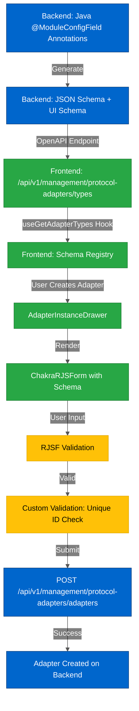

# Protocol Adapter Architecture

---

## Overview

Protocol adapters are the core mechanism for connecting HiveMQ Edge to external data sources. The frontend provides a dynamic, schema-driven configuration interface that adapts to each adapter type's specific requirements.

### What are Protocol Adapters?

Protocol adapters enable HiveMQ Edge to:
- Connect to various industrial protocols (OPC-UA, Modbus, S7, etc.)
- Poll data from external systems
- Transform data into MQTT messages
- Publish to MQTT broker

### Key Design Principles

1. **Backend-Driven**: Schemas are generated and served by backend
2. **Type-Safe**: OpenAPI client generation ensures type safety
3. **Dynamic**: Forms adapt to adapter capabilities
4. **Validated**: Schema-based validation + custom rules
5. **Testable**: Mock schemas for component testing

---

## Supported Adapter Types

| Adapter | Protocol | Backend Module | Configuration Complexity |
|---------|----------|----------------|--------------------------|
| **HTTP** | HTTP/HTTPS | hivemq-edge-module-http | Medium - Headers, body, auth |
| **MQTT** | MQTT 3.1.1/5 | Built-in | Low - Standard MQTT |
| **OPC-UA** | OPC-UA | hivemq-edge-module-opcua | High - Security policies, certificates |
| **Modbus** | Modbus TCP | hivemq-edge-module-modbus | Medium - Registers, address ranges |
| **S7** | Siemens S7 | hivemq-edge-module-plc4x | Medium - PLC-specific |
| **ADS** | Beckhoff ADS | hivemq-edge-module-plc4x | Medium - AMS Net ID |
| **EIP** | EtherNet/IP | hivemq-edge-module-eip | Medium - Tags, routing |
| **File** | File System | hivemq-edge-module-file | Low - File path, content type |
| **Databases** | JDBC | hivemq-edge-module-databases | High - SQL, encryption, certificates |
| **Simulation** | Built-in | Built-in | Low - Test data generation |
| **MTConnect** | MTConnect | hivemq-edge-module-mtconnect | Medium - HTTP endpoint |
| **BACnet/IP** | BACnet/IP | hivemq-edge-module-bacnetip | High - Object/property types |

---

## Architecture Flow



**Color Legend:**
- **Blue** - Backend components
- **Green** - Frontend components
- **Yellow** - Validation layers

---

## Data Flow

### 1. Backend Schema Generation

Backend generates schemas from Java annotations:

```java
@ModuleConfigField(
    title = "Host",
    description = "The hostname or IP address",
    format = ModuleConfigField.FieldType.HOSTNAME,
    required = true
)
private String host;
```

This generates JSON Schema:
```json
{
  "host": {
    "type": "string",
    "title": "Host",
    "description": "The hostname or IP address",
    "format": "hostname"
  },
  "required": ["host"]
}
```

And UI Schema:
```json
{
  "host": {
    "ui:widget": "text"
  }
}
```

### 2. Frontend Schema Consumption

Frontend fetches adapter types via OpenAPI:

```typescript
// src/api/hooks/useProtocolAdapters/useGetAdapterTypes.ts
export const useGetAdapterTypes = () => {
  return useQuery({
    queryKey: ['adapters', 'types'],
    queryFn: () => client.protocolAdapters.getAdapterTypes(),
  })
}
```

Returns:
```typescript
interface ProtocolAdapter {
  id: string  // 'http', 'modbus', etc.
  name: string
  logoUrl?: string
  configSchema: JSONSchema7  // JSON Schema for adapter config
  uiSchema: UiSchema  // UI Schema for form rendering
  tagSchema: JSONSchema7  // JSON Schema for tag config
  tagUISchema: UiSchema  // UI Schema for tag form
  capabilities: string[]  // ['DISCOVER', etc.]
}
```

### 3. Dynamic Form Rendering

`AdapterInstanceDrawer` extracts schema and renders form:

```typescript
const { schema, uiSchema } = useMemo(() => {
  const adapter = data?.items?.find((e) => e.id === adapterType)
  return {
    schema: adapter?.configSchema,
    uiSchema: getRequiredUiSchema(adapter?.uiSchema, isNewAdapter),
  }
}, [data?.items, isNewAdapter, adapterType])

<ChakraRJSForm
  id="adapter-instance-form"
  schema={schema}
  uiSchema={uiSchema}
  formData={defaultValues}
  onSubmit={onValidate}
  customValidate={customUniqueAdapterValidate(schema, allAdapters)}
/>
```

**See:** [Form Component API Reference](../guides/RJSF_GUIDE.md#form-component-api-reference) for detailed prop documentation.

### 4. Schema Transformation

`getRequiredUiSchema` applies frontend requirements:

```typescript
// src/modules/ProtocolAdapters/utils/uiSchema.utils.ts
export const getRequiredUiSchema = (uiSchema: UiSchema | undefined, isNewAdapter: boolean): UiSchema => {
  return {
    'ui:submitButtonOptions': {
      norender: true,  // Hide default submit button
    },
    id: {
      'ui:disabled': !isNewAdapter,  // Disable ID when editing
    },
    ...uiSchema,
  }
}
```

### 5. Validation

Two-layer validation:

**Schema Validation** (automatic from JSON Schema):
- Required fields
- Type constraints
- Min/max values
- Format validation (MQTT topics, email, URI, etc.)

**Custom Validation** (business rules):
- Unique adapter ID check
- Cross-field validation (e.g., minValue < maxValue)
- Conditional field requirements

### 6. API Submission

Form data submitted to backend:

```typescript
// POST /api/v1/management/protocol-adapters/adapters
{
  id: "my-adapter-1",
  protocolAdapterType: "modbus",
  config: {
    host: "192.168.1.100",
    port: 502,
    pollingIntervalMillis: 1000,
    // ... adapter-specific config
  }
}
```

---

## Code Structure

| Component | Purpose | File Path |
|-----------|---------|-----------|
| **Main Drawer** | Adapter configuration UI | `src/modules/ProtocolAdapters/components/drawers/AdapterInstanceDrawer.tsx` |
| **API Hook** | Fetch adapter types | `src/api/hooks/useProtocolAdapters/useGetAdapterTypes.ts` |
| **List Hook** | Fetch existing adapters | `src/api/hooks/useProtocolAdapters/useListProtocolAdapters.ts` |
| **Schema Utils** | UI schema transformations | `src/modules/ProtocolAdapters/utils/uiSchema.utils.ts` |
| **Validation Utils** | Custom validation | `src/modules/ProtocolAdapters/utils/validation-utils.ts` |
| **Widget Registry** | Custom widgets | `src/modules/ProtocolAdapters/utils/uiSchema.utils.ts` (adapterJSFWidgets) |
| **Test Mocks** | Mock schemas for testing | `src/__test-utils__/adapters/*.ts` |

---

## Backend Schema Architecture

### Java Annotations

Backend uses `@ModuleConfigField` to define configuration:

```java
@ModuleConfigField(
    title = "Port",
    description = "The port number",
    numberMin = 1,
    numberMax = 65535,
    defaultValue = "502",
    required = true
)
private Integer port;
```

### Format Types

| Format | Java Constant | Purpose | Frontend Validator |
|--------|---------------|---------|-------------------|
| `MQTT_TOPIC` | `FieldType.MQTT_TOPIC` | MQTT topic validation | `validationTopic()` |
| `MQTT_TAG` | `FieldType.MQTT_TAG` | MQTT tag validation | `validationTag()` |
| `MQTT_TOPIC_FILTER` | `FieldType.MQTT_TOPIC_FILTER` | MQTT filter validation | `validationTopicFilter()` |
| `IDENTIFIER` | `FieldType.IDENTIFIER` | Adapter ID format | Stub (basic) |
| `HOSTNAME` | `FieldType.HOSTNAME` | Hostname/IP validation | ❌ **Missing (F-M1)** |
| `URI` | `FieldType.URI` | URI validation | Standard JSON Schema |
| `BOOLEAN` | `FieldType.BOOLEAN` | Boolean type | Stub (hack) |

### Widget Specifications

Backend can specify widgets via UI Schema JSON files:

```json
{
  "port": {
    "ui:widget": "updown"
  },
  "password": {
    "ui:widget": "password"
  },
  "description": {
    "ui:widget": "textarea"
  }
}
```

---

## Frontend Implementation

### Custom Widgets for Adapters

| Widget | Purpose | File | Status |
|--------|---------|------|--------|
| `UpDownWidget` | Number input with +/- buttons | `src/components/rjsf/Widgets/UpDownWidget.tsx` | ✅ Active |
| `password` | Password input (masked) | Built-in RJSF/Chakra | ✅ Active |
| `textarea` | Multi-line text | Built-in RJSF/Chakra | ✅ Active |
| `JSONSchemaEditor` | JSON schema editor (DataHub only) | `src/extensions/datahub/components/forms` | ✅ Active |
| `discovery:tagBrowser` | Tag browser | Disabled (issue #24369) | ⚠️ Disabled |
| `ToggleWidget` | Toggle switch | `src/components/rjsf/Widgets/ToggleWidget.tsx` | ⚠️ Not in use |
| `AdapterTagSelect` | Tag selector | `src/components/rjsf/Widgets/AdapterTagSelect.tsx` | ⚠️ Not in use |

### Custom Fields

| Field | Purpose | File | Status |
|-------|---------|------|--------|
| `compactTable` | Compact array display | `src/components/rjsf/Fields/CompactArrayField.tsx` | ✅ Active |
| `InternalNotice` | Internal notice display | `src/components/rjsf/Fields/InternalNotice.tsx` | ⚠️ Not in use |

### Format Validators

Located in `src/components/rjsf/Form/validation.utils.ts`:

```typescript
export const customFormatsValidator = customizeValidator(
  {
    customFormats: {
      'mqtt-topic': (value) => validationTopic(value) === undefined,
      'mqtt-tag': (value) => validationTag(value) === undefined,
      'mqtt-topic-filter': (value) => validationTopicFilter(value) === undefined,
      identifier: () => true,  // Stub
      boolean: () => true,  // Hack for boolean format
      // Missing: hostname
    },
  },
  customLocalizer
)
```

---

## Adapter Registry

### Discovery Capability

Some adapters support automatic tag discovery:

```typescript
const { isDiscoverable } = useMemo(() => {
  const adapter = data?.items?.find((e) => e.id === adapterType)
  return {
    isDiscoverable: Boolean(adapter?.capabilities?.includes('DISCOVER')),
  }
}, [data?.items, adapterType])
```

Adapters with `DISCOVER` capability:
- OPC-UA (browse nodes)
- Modbus (scan registers)
- BACnet/IP (discover objects)

### Logo/Branding

Each adapter provides a logo URL for visual identification in the UI.

### Tag Configuration

Adapters can define separate schemas for tag configuration:
- `tagSchema`: JSON Schema for tag structure
- `tagUISchema`: UI Schema for tag form

Tags define:
- Source address (register, node ID, etc.)
- Target MQTT topic
- Transformation rules
- Polling interval (optional)

---

## Validation Strategy

### Schema-Based Validation

Automatic from JSON Schema constraints:

| Constraint | Purpose | Example |
|------------|---------|---------|
| `required` | Mandatory fields | `required: ['host', 'port']` |
| `minLength`/`maxLength` | String length | `minLength: 1, maxLength: 255` |
| `minimum`/`maximum` | Number range | `minimum: 1, maximum: 65535` |
| `pattern` | Regex validation | `pattern: '^[a-zA-Z0-9_-]+$'` |
| `format` | Format validation | `format: 'mqtt-topic'` |
| `enum` | Fixed values | `enum: ['JSON', 'PROTOBUF']` |

### Custom Validation

**Unique Adapter ID:**
```typescript
export const customUniqueAdapterValidate = (
  schema: RJSFSchema,
  allAdapters: Adapter[]
): CustomValidator => {
  return (formData, errors) => {
    const isDuplicate = allAdapters.some((adapter) => adapter.id === formData.id)
    if (isDuplicate) {
      errors.id.addError('Adapter ID must be unique')
    }
    return errors
  }
}
```

**Cross-Field Validation:**

Backend should implement validation for:
- `minValue < maxValue` (Simulation adapter)
- `startIdx <= endIdx` (Modbus address ranges)
- Conditional requirements (e.g., certificate required when TLS enabled)

---

## Known Issues & Gaps

**Comprehensive analysis available:** `.tasks/38658-adapter-jsonschema-review/REMEDIATION_REPORT.md`

### Issue Summary

| Severity | Frontend Issues | Backend Issues | Total |
|----------|-----------------|----------------|-------|
| 🔴 Critical | 1 | 1 | 2 |
| 🟠 High | 4 | 3 | 7 |
| 🟡 Medium | 1 | 12 | 13 |
| 🟢 Low | 3 | 3 | 6 |
| **Total** | **9** | **19** | **28** |

### Critical Issues

#### F-C1: File Adapter Tag Schema Completely Wrong

**Impact:** Broken functionality - tag configuration UI shows HTTP adapter fields instead of File adapter fields

**Problem:**
- `MOCK_SCHEMA_FILE` in `src/__test-utils__/adapters/file.ts` is a copy of HTTP adapter schema
- Wrong fields: `httpHeaders`, `httpRequestBody`, `url`
- Wrong `protocolId`: `'http'` instead of `'file'`

**Expected Fields:**
- `filePath` (string, required)
- `contentType` (enum: BINARY, TEXT, JSON, XML, CSV, required)
- `protocolId: 'file'`

**Fix:** Automated - `node tools/update-adapter-mocks.cjs --adapter=file`

#### B-C1: Databases Adapter getTrustCertificate() Returns Wrong Field

**Impact:** Runtime logic bug - any backend code using this getter receives the wrong value

**Problem:**
```java
public Boolean getTrustCertificate() {
    return encrypt;  // ❌ Returns wrong field!
}
```

**Fix:** Backend change required
```java
public Boolean getTrustCertificate() {
    return trustCertificate;  // ✅ Correct
}
```

**File:** `modules/hivemq-edge-module-databases/src/main/java/.../DatabasesAdapterConfig.java`

### High Priority Issues

#### F-M1: Missing HOSTNAME Format Validator

**Impact:** No client-side validation for hostname fields in 3 adapter types

**Affected Adapters:**
- Modbus (`host` field)
- EIP (`host` field)
- PLC4X - ADS/S7 (`host` field)

**Current Behavior:** Field accepts any string value

**Expected Behavior:** Should validate:
- IPv4 addresses (e.g., `192.168.1.1`)
- IPv6 addresses (e.g., `2001:db8::1`)
- Hostnames (e.g., `plc.example.com`)

**Fix:** Frontend implementation needed in `src/components/rjsf/Form/validation.utils.ts`

#### Schema Validation Issues

| Issue | Adapter | Problem | Fix |
|-------|---------|---------|-----|
| F-H1 | Databases | Port field has string constraints on integer | Change to `minimum: 1, maximum: 65535` |
| F-H2 | Databases | Port UI schema invalid (`type: 'integer'`) | Change to `'ui:widget': 'updown'` |
| F-H3 | Modbus | `id.ui:disabled` mismatch (frontend: false, backend: true) | Match backend: `'ui:disabled': true` |
| B-H1 | Databases | Backend port constraints wrong | Fix Java annotations |
| B-H2 | Databases | Missing `encrypt → trustCertificate` dependency | Add JSON Schema dependencies |
| B-H3 | OPC-UA | Missing `tls.enabled` dependency | Add JSON Schema dependencies |

### Medium Priority Issues

#### Missing Enum Display Names

Technical enum values shown instead of user-friendly labels:

| Adapter | Field | Raw Values | Should Show |
|---------|-------|------------|-------------|
| OPC-UA | `policy` | `BASIC256SHA256` | "Basic 256 SHA256" |
| OPC-UA | `messageSecurityMode` | `SIGN_AND_ENCRYPT` | "Sign and Encrypt" |
| Databases | `type` | `POSTGRESQL` | "PostgreSQL" |
| BACnet/IP | `objectType`, `propertyType` | Technical codes | Descriptive names |

**Fix:** Backend needs to add `enumDisplayValues` or frontend needs `ui:enumNames` in UI schema

#### Missing Conditional Visibility

Fields shown even when irrelevant:

| Adapter | Condition | Hidden Fields | Status |
|---------|-----------|---------------|--------|
| Databases | `encrypt = false` | `trustCertificate` | Should hide when encryption disabled |
| OPC-UA | `tls.enabled = false` | `keystore`, `truststore`, `tlsChecks` | Should hide when TLS disabled |

**Fix:** Backend needs to add JSON Schema `dependencies` or `if/then/else`

### Low Priority Issues

- **Title Casing**: Several adapters have camelCase titles instead of "Proper Case"
- **Grammar**: "millisecond" should be "milliseconds" in descriptions
- **Orphaned Components**: ToggleWidget, AdapterTagSelect, InternalNotice never used

**See:** `.tasks/38658-adapter-jsonschema-review/REMEDIATION_REPORT.md` for complete details on all 28 issues.

---

## Remediation Status

### Frontend Fixes

**Automated Fixes Available:**
```bash
# Fix F-C1, F-H1, F-H2, F-H3, F-H4
node tools/update-adapter-mocks.cjs --all
```

**Manual Fixes Required:**
- F-M1: Implement HOSTNAME format validator
- F-L1, F-L2, F-L3: Remove or document orphaned components

### Backend Fixes

**Requires Backend Team:**
- B-C1: Fix Databases getTrustCertificate() method
- B-H1: Fix port field constraints
- B-H2, B-H3: Add conditional field dependencies
- B-M1-B-M12: Title casing, enum display names, cross-field validation

### Cross-Team Coordination

1. Backend fixes port constraints (B-H1) → Frontend regenerates mocks (F-H1)
2. Backend adds widget specifications → Frontend uses them automatically
3. Backend adds enum display names → Frontend displays user-friendly labels

---

## Testing

### Mock Schemas

Test utilities in `src/__test-utils__/adapters/`:

| File | Adapter | Purpose |
|------|---------|---------|
| `http.ts` | HTTP | Mock schemas for HTTP adapter tests |
| `modbus.ts` | Modbus | Mock schemas for Modbus adapter tests |
| `opcua.ts` | OPC-UA | Mock schemas for OPC-UA adapter tests |
| `databases.ts` | Databases | Mock schemas for Databases adapter tests |
| `file.ts` | File | Mock schemas for File adapter tests |
| `mqtt.ts` | MQTT | Mock schemas for MQTT adapter tests |
| `ads.ts`, `eip.ts`, `s7.ts` | PLC4X | Mock schemas for PLC4X adapter tests |
| `bacnetip.ts` | BACnet/IP | Mock schemas for BACnet/IP adapter tests |
| `mtconnect.ts` | MTConnect | Mock schemas for MTConnect adapter tests |
| `simulation.ts` | Simulation | Mock schemas for Simulation adapter tests |

### Component Tests

**AdapterInstanceDrawer Tests:**
```typescript
describe('AdapterInstanceDrawer', () => {
  it('should render adapter form', () => {
    cy.mountWithProviders(
      <AdapterInstanceDrawer
        adapterType="modbus"
        isNewAdapter={true}
        isOpen={true}
        onClose={cy.stub()}
        onSubmit={cy.stub()}
      />
    )

    cy.get('label#root_host-label').should('be.visible')
    cy.get('label#root_port-label').should('be.visible')
  })
})
```

### E2E Tests

E2E tests cover:
- Creating adapter via UI
- Editing existing adapter
- Validating required fields
- Submitting to backend

**See:**
- [RJSF Guide](../guides/RJSF_GUIDE.md) - Complete RJSF implementation patterns
- [Form Component API Reference](../guides/RJSF_GUIDE.md#form-component-api-reference) - Detailed prop documentation
- [Testing Guide](../guides/TESTING_GUIDE.md) - General testing patterns
- [Cypress Guide](../guides/CYPRESS_GUIDE.md) - Cypress-specific patterns

---

## Common Issues & Solutions

| Issue | Cause | Solution |
|-------|-------|----------|
| **Adapter schema doesn't load** | Backend not returning schema | Check `/api/v1/management/protocol-adapters/types` endpoint |
| **Validation doesn't work** | Format validator missing | Check `validation.utils.ts` for format support |
| **Custom widget not applying** | Backend UI schema missing widget spec | Add `"ui:widget"` to backend UI schema JSON |
| **Conditional fields not hiding** | Missing JSON Schema dependencies | Add `dependencies` or `if/then/else` to backend schema |
| **Enum showing raw values** | Missing `enumDisplayValues` or `ui:enumNames` | Add to backend schema or frontend UI schema |
| **Port field validation wrong** | String constraints on integer field | Fix backend annotations: use `numberMin`/`numberMax` |
| **Duplicate adapter ID allowed** | Custom validation not applied | Ensure `customValidate` prop passed to ChakraRJSForm |

---

## Related Documentation

**Guides:**
- [RJSF Guide](../guides/RJSF_GUIDE.md) - Complete RJSF implementation guide
  - [Form Component API Reference](../guides/RJSF_GUIDE.md#form-component-api-reference) - Props: schema, uiSchema, formData, formContext, validators
- [Testing Guide](../guides/TESTING_GUIDE.md) - Testing patterns
- [Cypress Guide](../guides/CYPRESS_GUIDE.md) - Cypress-specific patterns
- [Design Guide](../guides/DESIGN_GUIDE.md) - UI component patterns

**Architecture:**
- [DataHub Architecture](./DATAHUB_ARCHITECTURE.md) - DataHub policy designer
- [Workspace Architecture](./WORKSPACE_ARCHITECTURE.md) - Workspace canvas

**Technical:**
- [Technical Stack](../technical/TECHNICAL_STACK.md) - Dependencies and toolchain

**Reviews:**
- [Adapter Schema Analysis](../analysis/ADAPTER_SCHEMA_ANALYSIS_2025.md) - Comprehensive 38658 analysis summary

---

## External References

**Task 38658 Adapter JSON Schema Review:**
- `.tasks/38658-adapter-jsonschema-review/REMEDIATION_REPORT.md` - All 28 issues documented
- `.tasks/38658-adapter-jsonschema-review/CUSTOM_WIDGET_COVERAGE_ANALYSIS.md` - Widget coverage analysis
- `.tasks/38658-adapter-jsonschema-review/CONDITIONAL_VISIBILITY_ANALYSIS.md` - Conditional field analysis
- `.tasks/38658-adapter-jsonschema-review/ENUM_DISPLAY_NAMES_AUDIT.md` - Enum display name audit

**Backend Repositories:**
- `hivemq-edge` - Core adapters (HTTP, MQTT, Simulation)
- `hivemq-edge-module-*` - External adapter modules
- `hivemq-edge-module-bacnetip` - BACnet/IP adapter (separate repo)

---

**Last Updated:** 2026-02-16
