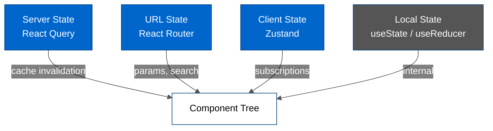

# State Management

---

## Table of Contents

- [Overview](#overview)
- [State Layer Hierarchy](#state-layer-hierarchy)
- [Server State — React Query](#server-state--react-query)
- [URL State — React Router](#url-state--react-router)
- [Client State — Zustand Stores](#client-state--zustand-stores)
- [Local Component State](#local-component-state)
- [Workspace State Issues](#workspace-state-issues)
- [Decision Guide](#decision-guide)
- [Related Documentation](#related-documentation)

---

## Overview

HiveMQ Edge uses **four distinct state layers**, each serving a different purpose and managed by a different tool.

**Rule of thumb — use the lowest layer that works:**

1. Server data that comes from the API → **React Query**
2. Navigation, shareable state, active IDs → **React Router URL**
3. UI state shared across distant components → **Zustand**
4. UI state local to one component tree → **useState**

---

## State Layer Hierarchy

| Layer | Tool | Persistence | Scope | Purpose |
|-------|------|-------------|-------|---------|
| **Server** | React Query | In-memory cache (5 min stale) | Global | All backend data |
| **URL** | React Router | Browser history / address bar | Session | Navigation, shareable state |
| **Client** | Zustand | Memory, optionally `localStorage` | Global | Cross-component UI state |
| **Local** | `useState` / `useReducer` | None | Component | Component-internal UI state |

---

## Server State — React Query

All data fetched from the backend lives in React Query's cache. This is the canonical source of truth for server-side entities: adapters, bridges, policies, schemas, scripts, combiners, and so on.

**Key characteristics:**
- Five endpoints use polling at 5-second intervals for live status

**See:** [Data Flow Architecture](./DATA_FLOW.md) for the complete request lifecycle, cache configuration (`staleTime`, `refetchOnMount`), query keys, polling hooks, and mutation invalidation pattern.

**See:** [React Query Patterns](../api/REACT_QUERY_PATTERNS.md) for hook patterns and conventions.

---

## URL State — React Router

The application uses **React Router v6** with `createBrowserRouter`. Navigation state lives in the URL and is derived from `useParams`, `useSearchParams`, or `useLocation`.

**What goes in the URL:**
- Active route: `/workspace`, `/protocol-adapters`, `/datahub/:policyId`, etc.
- Resource IDs: `/protocol-adapters/:adapterId`
- Tab selections when they represent navigable views

**What does NOT go in the URL:**
- Transient selection state (use Zustand)
- Filter state (currently managed via Zustand + localStorage — see [Workspace State Issues](#workspace-state-issues))
- Form draft values

---

## Client State — Zustand Stores

### Store Inventory

| Store | Location | localStorage? | Key | Purpose |
|-------|----------|---------------|-----|---------|
| `useWorkspaceStore` | `src/modules/Workspace/hooks/useWorkspaceStore.ts` | ✅ Yes | `edge.workspace` | Workspace canvas nodes, edges, layout |
| `useDataHubDraftStore` | `src/extensions/datahub/hooks/useDataHubDraftStore.ts` | ✅ Yes | `datahub.workspace` | DataHub canvas draft state |
| `useMetricsStore` | `src/modules/Metrics/hooks/useMetricsStore.ts` | ✅ Yes | `edge.observability` | Metrics panel subscriptions |
| `usePolicyChecksStore` | `src/extensions/datahub/hooks/usePolicyChecksStore.ts` | ❌ No | — | DataHub validation results |
| `useWizardStore` | `src/modules/Workspace/hooks/useWizardStore.ts` | ❌ No | — | Workspace add-entity wizard state |
| `useFormControlStore` | `src/components/rjsf/Form/useFormControlStore.ts` | ❌ No | — | RJSF form tab and expand state |

---

### `useWorkspaceStore` — Workspace Canvas

**File:** `src/modules/Workspace/hooks/useWorkspaceStore.ts`
**localStorage key:** `edge.workspace`

The central store for the Workspace topology view. Manages the React Flow canvas graph (nodes and edges) plus layout configuration.

**Persisted state (to `localStorage`):**

| Field | Type | Description |
|-------|------|-------------|
| `nodes` | `Node[]` | All canvas nodes including positions |
| `edges` | `Edge[]` | All canvas edges |
| `layoutConfig` | `LayoutConfig` | Current algorithm, mode, options, presets |
| `isAutoLayoutEnabled` | `boolean` | Whether auto-layout triggers on graph change |

**Ephemeral state (in-memory only):**

| Field | Type | Description |
|-------|------|-------------|
| `layoutHistory` | `LayoutHistoryEntry[]` | Layout undo history — intentionally not persisted |

**Key actions:** `onNodesChange`, `onEdgesChange`, `onConnect`, `reset`, `onInsertGroupNode`

> [!CAUTION]
> This store has significant architectural issues. See [Workspace State Issues](#workspace-state-issues) for details.

---

### `useDataHubDraftStore` — DataHub Canvas Draft

**File:** `src/extensions/datahub/hooks/useDataHubDraftStore.ts`
**localStorage key:** `datahub.workspace`

Manages the in-progress policy canvas inside the DataHub designer. The store is persisted so that an in-progress policy survives a page refresh.

**Persisted state:**

| Field | Type | Description |
|-------|------|-------------|
| `nodes` | `Node[]` | Policy canvas nodes |
| `edges` | `Edge[]` | Policy canvas edges |
| `status` | `DesignerStatus` | Designer status (IDLE, MODIFYING, etc.) |
| `name` | `string` | Policy name |
| `type` | `DataHubNodeType` | DATA_POLICY or BEHAVIOR_POLICY |

**Key actions:** `onNodesChange`, `onEdgesChange`, `onConnect`, `onAddNodes`, `onAddEdges`, `onUpdateNodes`, `setStatus`, `reset`

**Key selectors:** `isDirty()` (canvas has nodes), `isPolicyInDraft()` (has a policy node)

---

### `useMetricsStore` — Metrics Panel Configuration

**File:** `src/modules/Metrics/hooks/useMetricsStore.ts`
**localStorage key:** `edge.observability`

Persists the set of metrics the user has added to the metrics view. Each entry records which adapter/bridge (`source`) and which metric (`metrics`) the user wants to track, along with optional chart type preference.

**Persisted state:**

| Field | Type | Description |
|-------|------|-------------|
| `metrics` | `MetricDefinitionSpec[]` | Array of `{ source, metrics, chart? }` subscriptions |

**Key actions:** `addMetrics`, `removeMetrics`, `getMetricsFor`, `reset`

---

### `usePolicyChecksStore` — DataHub Validation State

**File:** `src/extensions/datahub/hooks/usePolicyChecksStore.ts`
**Persistence:** None (ephemeral, in-memory only)

Manages the dry-run validation lifecycle independently from the canvas state. Keeping validation state separate from the canvas draft means canvas edits don't affect validation state until the user explicitly triggers another dry-run.

**State:**

| Field | Type | Description |
|-------|------|-------------|
| `node` | `Node \| undefined` | Currently selected policy node |
| `report` | `DryRunResults[]` | Validation report items |
| `status` | `PolicyDryRunStatus` | IDLE / RUNNING / SUCCESS / FAILURE |

**Key actions:** `initReport`, `setReport`, `setNode`, `getErrors`, `reset`

**Key pattern:** `setReport` derives `status` from the report content — if any item has an `error`, status is `FAILURE`, otherwise `SUCCESS`.

---

### `useWizardStore` — Add-Entity Wizard

**File:** `src/modules/Workspace/hooks/useWizardStore.ts`
**Persistence:** None (devtools middleware in DEV mode only)

Drives the multi-step wizard flow for adding new entities (combiners, asset mappers) to the workspace canvas. Manages step navigation, node selection constraints, ghost node preview, and configuration data.

**State:**

| Field | Type | Description |
|-------|------|-------------|
| `isActive` | `boolean` | Whether wizard is open |
| `entityType` | `WizardType \| null` | Which entity is being created |
| `currentStep` / `totalSteps` | `number` | Current wizard position |
| `selectedNodeIds` | `string[]` | Nodes selected during step |
| `selectionConstraints` | `SelectionConstraints \| null` | Min/max/required node constraints |
| `ghostNodes` / `ghostEdges` | `GhostNode[] / GhostEdge[]` | Preview nodes on canvas |
| `configurationData` | `Record<string, unknown>` | Accumulated form values across steps |
| `isConfigurationValid` | `boolean` | Validation flag |
| `isSidePanelOpen` | `boolean` | Side panel visibility |
| `errorMessage` | `string \| null` | Current error |

**Convenience hooks:** `useWizardState`, `useWizardActions`, `useWizardSelection`, `useWizardGhosts`, `useWizardConfiguration`, `useWizardCanProceed`

**Coupling note:** `useWizardStore` reads `useWorkspaceStore` directly (via `useWorkspaceStore.getState()`) to find the Pulse Agent node when starting an Asset Mapper wizard. This cross-store read is intentional but documented as a coupling point.

---

### `useFormControlStore` — RJSF Form UI State

**File:** `src/components/rjsf/Form/useFormControlStore.ts`
**Persistence:** None

Lightweight store for RJSF form UI state shared across the form component tree — active tab index and which accordion items are expanded. Lives at the app level so tab state survives re-renders as the user interacts with the form.

**State:**

| Field | Type | Description |
|-------|------|-------------|
| `tabIndex` | `number` | Active tab in multi-tab RJSF form |
| `expandItems` | `string[]` | IDs of expanded accordion/collapsible items |

**Key actions:** `setTabIndex`, `setExpandItems`, `reset`

---

## Local Component State

Standard React `useState` and `useReducer` are used for state that is:

- Internal to a single component and its direct children
- Not needed outside the component tree
- Transient (modal open/close, hover state, loading state within a component)

**Examples:**
- Modal open/close state in dialog components
- Form-level validation before submission
- Dropdown open/close state
- Pagination offset in a table component

**Rule:** When `useState` propagates through three or more component levels via props, convert it to a Zustand store.

---

## Workspace State Issues

> [!IMPORTANT]
> The Workspace module has documented architectural problems with its state management. These are active technical debt items — two separate issues with different root causes.

### Issue 1: Node Positions Only in localStorage

**Problem:** Node positions are the only data that exist in `localStorage` and nowhere else. The backend has no concept of canvas positions — it stores adapters, bridges, and combiners as entities, but has no fields for `x`, `y` coordinates. When the workspace loads, backend entities are converted into React Flow nodes and their positions are set from the `localStorage` state.

**Root cause:** There is no stable, unique identifier linking a node in localStorage to a backend entity. Adapter IDs are user-defined strings (for example, `my-opcua-adapter`). If a user renames an adapter or if the backend regenerates its identifier, the localStorage entry becomes orphaned and the position disappears.

**Consequence:** Any feature that needs to read or set node positions programmatically (backend-triggered layout, preset management, multi-device onboarding) must work around this gap. Position presets stored in `layoutConfig.presets` share the same fragility.

**Status:** This is a **known gap that requires a fix**. The fix requires either:

- Backend support for persisting node positions (preferred, requires API changes)
- A stable, immutable UUID for each node that the backend issues and we store alongside the position (requires API changes)
- A client-side fingerprinting strategy that maps user-defined IDs to stable localStorage keys (partial mitigation, complex)

### Issue 2: Three Competing Sources of Truth

**Problem:** The Workspace canvas state has three components that all claim authority over nodes and edges:

| Source | What It Controls | Problem |
|--------|-----------------|---------|
| `useWorkspaceStore` (Zustand + localStorage) | The persisted canvas graph | Should be authoritative but is overwritten by `useGetFlowElements` |
| `useGetFlowElements` (React Query → derived graph) | Backend-derived graph reconstruction | Replaces ALL nodes on every backend change, discarding positions |
| `useReactFlow` (React Flow internal) | Internal viewport and interaction state | Duplicates node/edge data inside React Flow's own store |

**Root cause:** `useGetFlowElements` was designed to regenerate the complete graph from backend data on every fetch. This ensures graph accuracy but destroys user-set positions and any locally-added metadata.

**Consequence:** A polling cycle (every 5 seconds) can silently reset node positions. Updates via the wizard store (`useWizardStore`) can conflict with simultaneous backend re-generation. The lack of a smart merge strategy means backend truth and user positions are mutually exclusive rather than complementary.

**Detailed analysis:** See `.tasks/38111-workspace-operation-wizard/APPENDIX_ARCHITECTURE_REVIEW.md` for:
- Full problem inventory (6 documented issues)
- Three refactoring options
- Recommended approach: Option 3 (Hybrid — Zustand as authority, smart merge on backend updates, `useReactFlow` for utilities only)
- Smart merge / entity fingerprinting proposal
- 4-phase migration plan

**See also:** [Workspace Architecture](./WORKSPACE_ARCHITECTURE.md) for the Workspace module overview and node type design.

---

## Decision Guide

| Scenario | Layer to Use |
|----------|-------------|
| Data fetched from the backend API | **React Query** |
| Sharing data between sibling components | **Zustand** (if distant) or **prop drilling** (if close) |
| State that should survive page refresh | **Zustand + persist** (if client-only) or **React Query** (if server-derived) |
| Active entity ID in a detail view | **React Router URL params** |
| Filter/search input that should be shareable via URL | **React Router search params** |
| Canvas nodes and edges (workspace/designer) | **Zustand** (with caveats — see Workspace State Issues) |
| Validation state (dry-run results) | **Zustand** (ephemeral, no persist) |
| Form UI state (active tab, expanded sections) | **Zustand** (shared across form tree) or **useState** (single component) |
| Modal open/close | **useState** in the component that owns the trigger |
| User preferences persisted across sessions | **Zustand + persist** (localStorage) |

---

## Related Documentation

**Architecture:**
- [Data Flow](./DATA_FLOW.md) — Complete server state data flow (React Query)
- [Workspace Architecture](./WORKSPACE_ARCHITECTURE.md) — Workspace node types, status model
- [DataHub Architecture](./DATAHUB_ARCHITECTURE.md) — DataHub dual Zustand stores

**API:**
- [React Query Patterns](../api/REACT_QUERY_PATTERNS.md) — Query/mutation hook patterns

**Task-Specific (active technical debt):**
- [Workspace Architecture Review](../../.tasks/38111-workspace-operation-wizard/APPENDIX_ARCHITECTURE_REVIEW.md) — Deep analysis of the three-sources-of-truth problem and proposed refactoring
