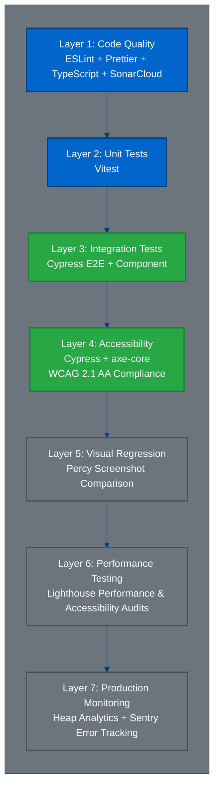
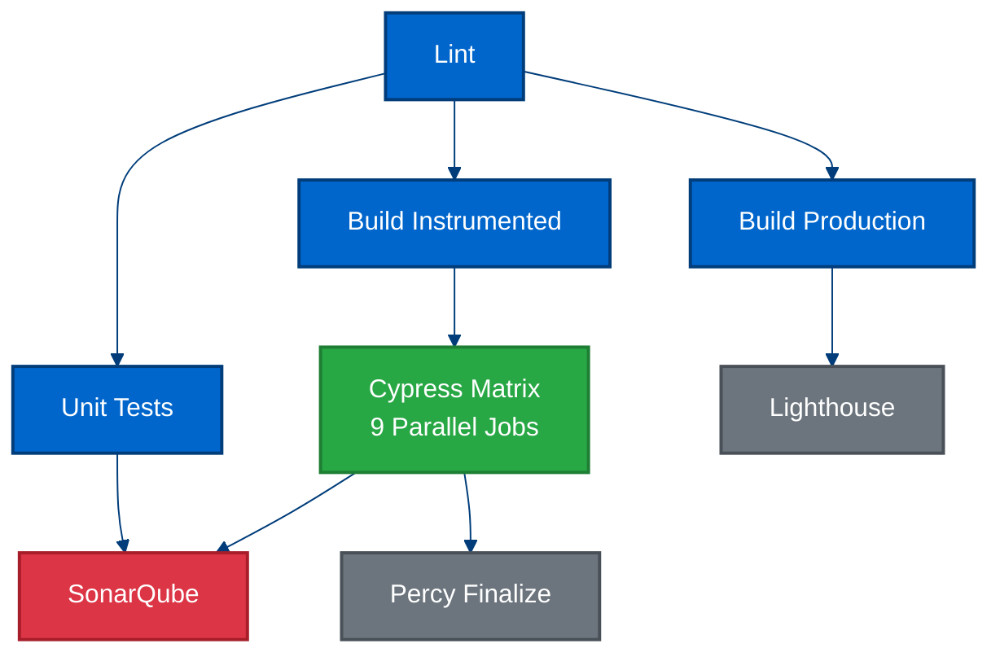
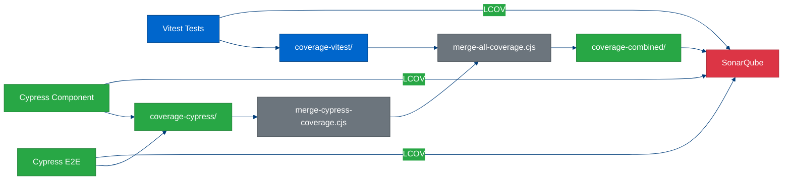

# Testing Architecture

**Complete guide to testing strategy, tooling, and quality assurance for HiveMQ Edge Frontend**

---

## Table of Contents

1. [Overview](#overview)
2. [Testing Pyramid](#testing-pyramid)
3. [Layer 1: Code Quality](#layer-1-code-quality)
4. [Layer 2: Unit Testing (Logic)](#layer-2-unit-testing-logic)
5. [Layer 3: Integration Testing (Interaction & Scenario)](#layer-3-integration-testing-interaction--scenario)
6. [Layer 4: Accessibility Testing](#layer-4-accessibility-testing)
7. [Layer 5: Visual Regression Testing](#layer-5-visual-regression-testing)
8. [Layer 6: Performance Testing](#layer-6-performance-testing)
9. [Layer 7: Production Monitoring](#layer-7-production-monitoring)
10. [Local Development Scripts](#local-development-scripts)
11. [CI/CD Pipeline](#cicd-pipeline)
12. [Custom Tooling](#custom-tooling)
13. [Cypress Custom Commands](#cypress-custom-commands)
14. [Coverage Strategy](#coverage-strategy)
15. [Best Practices & Guidelines](#best-practices--guidelines)

---

## Overview

The HiveMQ Edge Frontend employs a comprehensive **7-layer testing pyramid** that ensures code quality, functionality, accessibility, performance, and production stability. Every layer serves a specific purpose and complements the others.

### Quality Gates Philosophy

**No Pull Request can be merged without passing all automated quality gates:**

- ✅ Code quality (linting, formatting)
- ✅ Unit tests with coverage
- ✅ Component and E2E tests
- ✅ **Accessibility tests (mandatory for every component)**
- ✅ Visual regression approval
- ✅ Performance benchmarks
- ✅ SonarQube quality gate

---

## Testing Pyramid



### Testing Distribution

**Current metrics as of 2026-02-16:**

| Layer | Tool | Test Files | Test Cases | Duration | Coverage | Dashboard |
|-------|------|------------|------------|----------|----------|-----------|
| **Code Quality** | ESLint, Prettier, TS | - | Static analysis | ~30s (CI: ~2min) | 100% enforced | - |
| **Unit** | Vitest | 252 | 2,063 tests (7 skipped) | 34.71s (CI: ~1min) | 95.27% statements | Local `coverage-vitest/` |
| **Component** | Cypress Component | 300 | 1,343 tests | ~3min (CI parallel) | Integrated with unit | Percy, local report |
| **E2E** | Cypress E2E | 38 | 197 tests | ~3min (CI parallel) | End-to-end flows | Percy, local report |
| **Accessibility** | cypress-axe (WCAG 2.1 AA) | - | 334 assertions | Integrated | Every component | Built into component tests |
| **Visual** | Percy | - | 46 snapshots | Async (cloud) | UI consistency | Percy Dashboard (see CI) |
| **Performance** | Lighthouse | - | 1 audit | ~1min | Core Web Vitals | CI artifacts only |
| **Monitoring** | Heap, Sentry | - | Production telemetry | Real-time | User behavior, errors | Production dashboards |

**Quality Gate:**
- **Local Coverage:** 95.27% (Vitest: 95.27% statements, 88.92% branches, 95.14% functions, 96.06% lines)
- **SonarCloud:** [Quality Gate Dashboard](https://sonarcloud.io/project/overview?id=hivemq_hivemq-edge) | [Measures](https://sonarcloud.io/component_measures?id=hivemq_hivemq-edge&metric=coverage)
- **CI Pipeline:** 9 parallel jobs, ~8-10min total

**Data Sources:**
- Test counts: `pnpm test:coverage` run on 2026-02-16
- Test file counts: `find src -name "*.spec.*"` and `find cypress/e2e`
- Coverage: Local Vitest run with istanbul
- Timings: CI runs with 9 parallel Cypress jobs (see CI/CD Pipeline section)
  - Note: Local sequential runs would be significantly slower (10-15min+ for all Cypress tests)
  - Vitest time is from local run (34.71s)

---

## Layer 1: Code Quality

**Foundation layer ensuring code consistency, type safety, and static analysis.**

### Tools

#### ESLint
- **Purpose:** JavaScript/TypeScript linting
- **Config:** `.eslintrc.cjs`
- **Plugins:** React, React Hooks, TypeScript, SonarJS
- **Rules:** ~200 rules enforced

```bash
pnpm lint:eslint          # Check for issues
pnpm lint:eslint:fix      # Auto-fix issues
```

#### Prettier
- **Purpose:** Code formatting
- **Config:** `.prettierrc`
- **Standards:** 2-space indent, single quotes, 120 character line width

```bash
pnpm lint:prettier        # Check formatting
pnpm lint:prettier:write  # Auto-format
```

#### TypeScript
- **Purpose:** Type safety and compile-time checks
- **Config:** `tsconfig.json`, `tsconfig.node.json`
- **Mode:** Strict mode enabled

```bash
pnpm build:tsc            # Type check only (no build)
```

#### SonarCloud
- **Purpose:** Code quality analysis, security vulnerabilities, code smells
- **Dashboard:** https://sonarcloud.io/project/overview?id=hivemq_hivemq-edge
- **Quality Gate:**
  - Code coverage > 70%
  - 0 blocker/critical issues
  - Technical debt < 5%
  - Duplication < 3%

**Integration:** Runs in CI after all tests complete, aggregates coverage from all test types.

### GitHub Actions Integration

```yaml
# .github/workflows/check-frontend.yml
lint:
  name: Linting
  runs-on: ubuntu-latest
  steps:
    - name: 🧪 Run Prettier
      run: pnpm lint:prettier
    - name: 🧪 Run ESLint
      run: pnpm lint:eslint
```

---

## Layer 2: Unit Testing (Logic)

**Fast, isolated tests for business logic and utilities.**

### Vitest

**Configuration:** `vitest.config.ts`

```typescript
{
  globals: true,
  environment: 'jsdom',
  setupFiles: './src/__test-utils__/setup.ts',
  coverage: {
    include: ['**/src/'],
    exclude: [
      '**/src/api/__generated__/**',
      '**/__handlers__/**',
      '**/__test-utils__/**',
      '**/src/modules/Theme/**',
      '**/types.ts',
      '**/*.tsx',  // Focus on logic, not components
    ],
    provider: 'istanbul',
    reporter: ['text', 'json', 'html', 'lcov'],
    reportsDirectory: './coverage-vitest/',
  }
}
```

### What to Test with Vitest

✅ **DO test:**
- Pure functions and utilities
- Business logic (calculations, transformations)
- Data validation and formatting
- State management logic (Zustand stores)
- Custom hooks (logic-only, not UI)
- API response transformers
- Schema validation logic

❌ **DON'T test:**
- UI components (use Cypress Component)
- React hooks with DOM (use Cypress Component)
- API calls (mock with MSW in Cypress)

### Example: Unit Test

```typescript
// src/utils/formatting.spec.ts
import { describe, it, expect } from 'vitest'
import { formatTopicString } from './formatting'

describe('formatTopicString', () => {
  it('should format topic with slashes', () => {
    expect(formatTopicString('my/topic/path')).toBe('my / topic / path')
  })

  it('should handle single-level topics', () => {
    expect(formatTopicString('sensor')).toBe('sensor')
  })

  it('should preserve wildcards', () => {
    expect(formatTopicString('factory/+/temp')).toBe('factory / + / temp')
  })
})
```

### Local Scripts

```bash
pnpm test                 # Run in watch mode (dev)
pnpm test:coverage        # Run with coverage report
pnpm test:ui              # Open Vitest UI
```

### GitHub Actions Integration

```yaml
unit_tests:
  name: Unit Tests
  runs-on: ubuntu-latest
  steps:
    - name: 🧪 Run Test
      run: pnpm test:coverage
    - name: 💾 Upload Vitest Code Coverage
      uses: actions/upload-artifact@v5
      with:
        name: lcov-vitest
        path: hivemq-edge-frontend/coverage-vitest/lcov.info
```

---

## Layer 3: Integration Testing (Interaction & Scenario)

**Comprehensive testing of user interactions and workflows using Cypress.**

### Cypress

**Configuration:** `cypress.config.ts`

```typescript
{
  retries: { runMode: 2, openMode: 0 },
  e2e: {
    baseUrl: 'http://localhost:3000',
    video: true,
  },
  component: {
    video: true,
    devServer: {
      framework: 'react',
      bundler: 'vite',
    },
  },
}
```

### Component Tests

**Purpose:** Test React components in isolation with full interactivity.

**What to test:**
- Component rendering with props
- User interactions (clicks, typing, selections)
- State changes and conditional rendering
- Form validation and submission
- Custom hooks with DOM
- React Query integration
- Accessibility (mandatory for every component)

**Example:**

```typescript
// src/components/Button.spec.cy.tsx
describe('Button', () => {
  it('should render with text', () => {
    cy.mountWithProviders(<Button>Click Me</Button>)
    cy.contains('Click Me').should('be.visible')
  })

  it('should call onClick handler', () => {
    const onClick = cy.stub().as('onClick')
    cy.mountWithProviders(<Button onClick={onClick}>Click</Button>)
    cy.contains('Click').click()
    cy.get('@onClick').should('have.been.calledOnce')
  })

  it('should be accessible', () => {
    cy.injectAxe()
    cy.mountWithProviders(<Button>Accessible Button</Button>)
    cy.checkAccessibility()  // Mandatory for every component
  })
})
```

### E2E Tests

**Purpose:** Test complete user workflows across multiple pages.

**What to test:**
- User registration/login flows
- Multi-step wizards (for example, adapter creation)
- Navigation and routing
- Data persistence across pages
- Error handling and recovery
- API integration with backend

**Example:**

```typescript
// cypress/e2e/adapters/create-adapter.spec.cy.ts
describe('Create Adapter', () => {
  beforeEach(() => {
    cy.visit('/app/protocol-adapters')
    cy.login()
  })

  it('should create OPC UA adapter', () => {
    cy.contains('Create Adapter').click()
    cy.get('[data-testid="adapter-type-opcua"]').click()

    cy.getByTestId('adapter-id-input').type('my-opcua-adapter')
    cy.getByTestId('adapter-url-input').type('opc.tcp://localhost:4840')

    cy.contains('Create').click()

    cy.contains('Adapter created successfully').should('be.visible')
    cy.url().should('include', '/protocol-adapters')
  })

  it('should be accessible', () => {
    cy.injectAxe()
    cy.checkAccessibility()
  })
})
```

### Local Scripts

```bash
# Interactive mode (development)
pnpm cypress:open              # Choose component or E2E
pnpm cypress:open:component    # Component tests only
pnpm cypress:open:e2e          # E2E tests only

# Headless mode (CI simulation)
pnpm cypress:run               # All tests (E2E + Component)
pnpm cypress:run:component     # Component tests only
pnpm cypress:run:e2e           # E2E tests only

# With coverage (custom script)
pnpm cypress:coverage          # Sequential with coverage
pnpm cypress:coverage:parallel # Parallel with coverage
```

### GitHub Actions Integration

**Parallel execution matrix for speed:**

```yaml
cypress_matrix:
  strategy:
    matrix:
      cypress: [
        # E2E split into 3 jobs
        { component: false, spec: './cypress/e2e/adapters/**/*', target: 'E2E-Adapters' },
        { component: false, spec: './cypress/e2e/workspace/**/*', target: 'E2E-Workspace' },
        { component: false, spec: './cypress/e2e/!(adapters|workspace)/**/*', target: 'E2E-Core' },

        # Components
        { component: true, spec: "./src/components/**/*", target: "Components" },

        # Extensions (DataHub)
        { component: true, spec: "./src/extensions/**/*", target: "Extensions" },

        # Modules split into 4 jobs
        { component: true, spec: "./src/modules/Workspace/**/*", target: "Workspace" },
        { component: true, spec: "./src/modules/Mappings/**/*", target: "Mappings" },
        { component: true, spec: "./src/modules/Pulse/**/*", target: "Pulse" },
        { component: true, spec: "./src/modules/!(Workspace|Mappings|Pulse)/**/*", target: "Modules" }
      ]
  steps:
    - name: 🧪 Run Cypress suite
      uses: cypress-io/github-action@v6
      with:
        component: ${{ matrix.cypress.component }}
        spec: ${{ matrix.cypress.spec }}
        start: pnpm preview --port 3000
```

**Total of 9 parallel jobs for faster CI execution (~2-3 minutes total).**

---

## Layer 4: Accessibility Testing

**WCAG 2.1 AA compliance testing is mandatory for every component.**

### Philosophy

**Accessibility is not optional. Every component test MUST include an accessibility test.**

- ✅ Every component has `it('should be accessible')` test
- ✅ Tests run with `cypress-axe` and `axe-core`
- ✅ WCAG 2.1 Level AA compliance enforced
- ✅ Fails CI if violations detected

### Tools

#### cypress-axe + axe-core

**Integration:** Custom Cypress command `cy.checkAccessibility()`

```typescript
// cypress/support/commands/checkAccessibility.ts
export const checkAccessibility = (
  context?: string | Node | ContextObject | undefined,
  options?: Options | undefined,
  skipFailures?: boolean
): void => {
  const { rules, ...rest } = options || {}
  const allRules = { ...rules, ...ignoreGlobalRules.rules }

  cy.checkA11y(
    context,
    { rules: allRules, ...rest },
    violationCallback,
    skipFailures
  )
}
```

#### Global Rules Configuration

```typescript
// cypress/support/a11y.ts
export const ignoreGlobalRules: { rules: RuleObject } = {
  rules: {
    // Chakra UI issue, see https://github.com/chakra-ui/chakra-ui/pull/6845
    'landmark-unique': { enabled: false },
    // False positives in test environment
    'landmark-one-main': { enabled: false },
    'page-has-heading-one': { enabled: false },
  },
}
```

### Mandatory Test Pattern

**Every component test file MUST end with:**

```typescript
describe('MyComponent', () => {
  // ... other tests ...

  it('should be accessible', () => {
    cy.injectAxe()  // Initialize axe-core
    cy.mountWithProviders(<MyComponent />)
    cy.checkAccessibility()  // Run accessibility audit
  })
})
```

**For E2E tests:**

```typescript
describe('User Flow', () => {
  // ... other tests ...

  it('should be accessible', () => {
    cy.injectAxe()
    cy.visit('/app/dashboard')
    cy.checkAccessibility()
  })
})
```

### What Gets Tested

**Automatically checked by axe-core:**

- ✅ Keyboard navigation and focus management
- ✅ ARIA attributes and roles
- ✅ Color contrast (WCAG AA: 4.5:1 for text)
- ✅ Form labels and descriptions
- ✅ Heading hierarchy
- ✅ Alternative text for images
- ✅ Button and link accessibility
- ✅ Table structure and headers
- ✅ List semantics
- ✅ Language attributes

### Selective Rule Disabling

**Sometimes specific components need rule exceptions:**

```typescript
it('should be accessible', () => {
  cy.injectAxe()
  cy.mountWithProviders(<ReactSelectComponent />)

  cy.checkAccessibility(undefined, {
    rules: {
      // ReactSelect has known aria-input-field-name issue
      'aria-input-field-name': { enabled: false },
    },
  })
})
```

### Accessibility Testing in CI

**Integrated into every Cypress test run:**

```yaml
# No separate accessibility job needed
# Every component/E2E test includes accessibility checks
# Failures block PR merge
```

### Lighthouse Accessibility Audit

**Additional accessibility validation:**

```javascript
// .lighthouserc.cjs
const TARGET_ACCESSIBILITY = 1  // 100% score required

module.exports = {
  ci: {
    collect: {
      settings: {
        onlyCategories: ['accessibility'],
      },
    },
    assert: {
      assertions: {
        'categories:accessibility': [
          'error',
          { minScore: TARGET_ACCESSIBILITY }
        ],
      },
    },
  },
}
```

### Deque Axe DevTools (Manual)

**Developers must also use:**

- **Browser Extension:** Deque Axe DevTools
- **When:** During development for real-time feedback
- **Complements:** Automated cypress-axe tests

---

## Layer 5: Visual Regression Testing

**Automated screenshot comparison to catch unintended visual changes.**

### Percy

**Purpose:** Visual regression testing with screenshot comparison.

**Integration:** Percy runs in parallel with Cypress tests in CI.

#### Configuration

```bash
# .github/workflows/check-frontend.yml
percy_prepare:
  name: Percy (initialise parallel)
  outputs:
    LOCAL_NONCE: ${{ steps.percy.outputs.nonce }}

cypress_matrix:
  env:
    PERCY_TOKEN: ${{ secrets.PERCY_TOKEN }}
  steps:
    - name: 🧪 Run Cypress suite
      uses: cypress-io/github-action@v6
      with:
        command-prefix: 'npx percy exec --parallel'
      env:
        PERCY_PARALLEL_NONCE: ${{ env.LOCAL_NONCE }}

percy_finalise:
  name: Percy (finalise)
  needs: [ cypress_matrix ]
  steps:
    - run: npx percy build:finalize
```

#### Taking Screenshots

**In Cypress tests (E2E only, not components):**

```typescript
it('should render workspace', { tags: ['@percy'] }, () => {
  cy.visit('/app/workspace')
  cy.percySnapshot('Workspace - Empty Canvas')
})
```

**Percy automatically:**
- Captures screenshots across multiple browser widths
- Compares against baseline
- Highlights visual diffs
- Requires approval for changes

#### Tagging Percy Tests

```typescript
// Use tags to identify Percy-specific tests
it('should be accessible', { tags: ['@percy'] }, () => {
  cy.injectAxe()
  cy.checkAccessibility()
  cy.percySnapshot('Workspace - With Combiner')
})
```

#### Local Testing

```bash
# Percy is CI-only, requires PERCY_TOKEN
# Local: Review screenshots manually in cypress/screenshots/
```

#### Dashboard

**Percy Dashboard:** https://percy.io/hivemq/hivemq-edge

- Visual diff review
- Baseline management
- Build history

---

## Layer 6: Performance Testing

**Automated performance audits ensuring fast, efficient application.**

### Lighthouse

**Purpose:** Core Web Vitals and performance benchmarking.

#### Configuration

```javascript
// .lighthouserc.cjs
const TARGET_PERFORMANCE = 0.95  // 95% minimum

module.exports = {
  ci: {
    collect: {
      staticDistDir: './hivemq-edge-frontend/dist',
      url: ['http://localhost/app/login'],
      isSinglePageApplication: true,
      numberOfRuns: 3,  // Average of 3 runs
      settings: {
        preset: 'desktop',
        onlyCategories: ['performance', 'accessibility', 'best-practices', 'seo'],
      },
    },
    assert: {
      assertions: {
        'categories:performance': ['error', { minScore: 0.95 }],
        'categories:accessibility': ['error', { minScore: 1.0 }],
        'categories:best-practices': ['error', { minScore: 1.0 }],
        'categories:seo': ['warn', { minScore: 1.0 }],
      },
    },
  },
}
```

#### Metrics Tracked

| Metric | Target | Description |
|--------|--------|-------------|
| **First Contentful Paint (FCP)** | < 1.8s | Time to first content render |
| **Largest Contentful Paint (LCP)** | < 2.5s | Time to main content render |
| **Total Blocking Time (TBT)** | < 200ms | Main thread blocking time |
| **Cumulative Layout Shift (CLS)** | < 0.1 | Visual stability |
| **Speed Index** | < 3.4s | How quickly content is painted |
| **Time to Interactive (TTI)** | < 3.8s | Time to full interactivity |

#### GitHub Actions Integration

```yaml
lighthouse:
  name: Lighthouse Performance
  needs: [ build_production ]
  steps:
    - name: 🚥 Run Lighthouse audits
      uses: treosh/lighthouse-ci-action@v12
      with:
        temporaryPublicStorage: true
        uploadArtifacts: true
        configPath: 'hivemq-edge-frontend/.lighthouserc.cjs'
```

#### Local Testing

```bash
# Manual Lighthouse audit in Chrome DevTools
# Or use Lighthouse CI locally:
npx lighthouse http://localhost:3000/app/login \
  --preset=desktop \
  --output=html \
  --output-path=./lighthouse-report.html
```

#### Bundle Size Monitoring

```bash
# Visualize bundle size
pnpm bundle:size  # Opens vite-bundle-visualizer
```

---

## Layer 7: Production Monitoring

**Real-time monitoring of production application health and user behavior.**

### Tools

#### Heap Analytics

**Purpose:** User behavior analytics and funnel tracking.

**Integration:** Injected in production builds via `index.html`

```html
<script type="text/javascript">
  window.heap=window.heap||[],heap.load=function(e,t){...};
</script>
```

**Privacy:** Disabled in development, respects user consent.

**Tracks:**
- Page views and navigation
- Feature usage
- User flows
- Conversion funnels
- Session replays (if enabled)

#### Sentry

**Purpose:** Error tracking and performance monitoring.

**Integration:** `@sentry/react` + `@sentry/vite-plugin`

```typescript
// src/config/sentry.config.ts
import * as Sentry from '@sentry/react'

Sentry.init({
  dsn: import.meta.env.VITE_SENTRY_DSN,
  integrations: [
    new Sentry.BrowserTracing(),
    new Sentry.Replay(),
  ],
  tracesSampleRate: 0.1,
  replaysSessionSampleRate: 0.1,
  replaysOnErrorSampleRate: 1.0,
})
```

**Captures:**
- JavaScript errors and stack traces
- Network request failures
- React component errors (ErrorBoundary)
- Performance traces
- User session replays on errors

**Privacy:** Respects user consent, no PII captured.

### Local Development

**Both tools disabled in development:**

```typescript
// localStorage: edge.privacy
{
  heapAnalytics: false,
  sentry: false
}
```

---

## Local Development Scripts

**Complete reference of all npm scripts for testing.**

### Linting & Formatting

```bash
pnpm lint:eslint              # Run ESLint checks
pnpm lint:eslint:fix          # Auto-fix ESLint issues
pnpm lint:prettier            # Check Prettier formatting
pnpm lint:prettier:write      # Auto-format with Prettier
pnpm lint:stylelint           # CSS linting
pnpm lint:all                 # Run ESLint + Prettier (no fix)
```

### Unit Testing (Vitest)

```bash
pnpm test                     # Run Vitest in watch mode
pnpm test:coverage            # Run with coverage report
pnpm test:ui                  # Open Vitest UI dashboard
```

### Component & E2E Testing (Cypress)

```bash
# Interactive mode (with browser UI)
pnpm cypress:open             # Choose component or E2E
pnpm cypress:open:component   # Component tests only
pnpm cypress:open:e2e         # E2E tests only

# Headless mode (like CI)
pnpm cypress:run              # All tests (E2E + Component)
pnpm cypress:run:component    # Component tests only
pnpm cypress:run:e2e          # E2E tests only

# With coverage (custom parallel script)
pnpm cypress:coverage         # Sequential execution
pnpm cypress:coverage:parallel          # Parallel execution
pnpm cypress:coverage:verbose           # Sequential with logs
pnpm cypress:coverage:parallel:verbose  # Parallel with logs
```

### Combined Coverage (Vitest + Cypress)

```bash
pnpm coverage:all                       # Vitest + Cypress (sequential)
pnpm coverage:all:parallel              # Vitest + Cypress (parallel)
pnpm coverage:all:verbose               # Sequential with logs
pnpm coverage:all:parallel:verbose      # Parallel with logs
```

### Coverage Merge Scripts

```bash
pnpm coverage:merge:cypress   # Merge Cypress coverage only
pnpm coverage:merge:all       # Merge Vitest + Cypress coverage
```

### Visual Regression (Percy)

```bash
# Percy runs in CI only, requires PERCY_TOKEN
pnpm cypress:percy            # Local simulation (limited)
```

### Build & Preview

```bash
pnpm dev                      # Start dev server (port 3000)
pnpm build                    # Production build
pnpm build:tsc                # TypeScript check only
pnpm preview                  # Preview production build
```

### Utilities

```bash
pnpm bundle:size              # Analyze bundle size
pnpm dev:openAPI              # Regenerate API client
pnpm dev:chakra:types         # Regenerate Chakra types
pnpm docs:security-scan       # Scan docs for security issues
```

---

## CI/CD Pipeline

**Comprehensive GitHub Actions workflow: `.github/workflows/check-frontend.yml`**

### Workflow: Frontend - React Testing Pyramid

**Trigger:** On push, pull request, or manual dispatch

#### Jobs



#### 1. Linting (2 minutes)

```yaml
lint:
  steps:
    - Run Prettier
    - Run ESLint
```

**Blocks:** Merge if linting fails

#### 2. Unit Tests (1 minute)

```yaml
unit_tests:
  steps:
    - Run Vitest with coverage
    - Upload coverage artifact (lcov-vitest)
```

**Blocks:** Merge if tests fail

#### 3. Build Instrumented (4 minutes)

```yaml
build_instrumented:
  steps:
    - Build with VITE_COVERAGE=true
    - Upload dist artifact (application-instrumented)
```

**Purpose:** Instrumented build for E2E coverage collection

#### 4. Build Production (3 minutes)

```yaml
build_production:
  steps:
    - Build production (no coverage)
    - Upload dist artifact (application-clean)
```

**Purpose:** Clean build for Lighthouse testing

#### 5. Cypress Matrix (2-3 minutes parallel)

**9 parallel jobs:**

| Job | Type | Spec Pattern | Target |
|-----|------|--------------|--------|
| 1 | E2E | `./cypress/e2e/adapters/**/*` | E2E-Adapters |
| 2 | E2E | `./cypress/e2e/workspace/**/*` | E2E-Workspace |
| 3 | E2E | `./cypress/e2e/!(adapters\|workspace)/**/*` | E2E-Core |
| 4 | Component | `./src/components/**/*` | Components |
| 5 | Component | `./src/extensions/**/*` | Extensions |
| 6 | Component | `./src/modules/Workspace/**/*` | Workspace |
| 7 | Component | `./src/modules/Mappings/**/*` | Mappings |
| 8 | Component | `./src/modules/Pulse/**/*` | Pulse |
| 9 | Component | `./src/modules/!(Workspace\|Mappings\|Pulse)/**/*` | Modules |

```yaml
cypress_matrix:
  strategy:
    matrix:
      cypress: [...]  # 9 configurations
  steps:
    - Download instrumented build
    - Run Cypress with Percy
    - Upload videos (on failure)
    - Upload coverage (lcov-cypress-{target})
```

**Each job:**
- Runs in parallel
- Collects coverage
- Captures Percy screenshots
- Uploads videos on failure

#### 6. Lighthouse (2 minutes)

```yaml
lighthouse:
  needs: [ build_production ]
  steps:
    - Download clean build
    - Run Lighthouse audits (3 runs)
    - Assert performance targets
```

**Blocks:** Merge if performance/accessibility scores fail

#### 7. SonarQube (3 minutes)

```yaml
sonarqube:
  needs: [ cypress_matrix, unit_tests ]
  steps:
    - Download all LCOV artifacts (10 files)
    - Merge coverage reports
    - Run SonarQube scan
```

**Analyzes:**
- Code coverage (all tests combined)
- Code smells
- Security vulnerabilities
- Technical debt
- Duplication

**Blocks:** Merge if quality gate fails

#### 8. Percy Finalize (1 minute)

```yaml
percy_finalise:
  needs: [ cypress_matrix ]
  steps:
    - Finalize Percy build
    - Generate visual diff report
```

**Blocks:** Merge if visual changes not approved

### Total Pipeline Time

**~8-10 minutes** (parallelized)

- Linting: ~2 min
- Unit tests: ~1 min
- Builds: ~4 min (parallel)
- Cypress: ~3 min (9 parallel jobs)
- Lighthouse: ~2 min (parallel with Cypress)
- SonarQube: ~3 min (waits for Cypress)
- Percy: ~1 min (after Cypress)

---

## Custom Tooling

**Custom Node.js scripts for enhanced test workflows.**

### Parallel Cypress Test Runner

**File:** `tools/run-tests.cjs`

**Purpose:** Run Cypress tests with intelligent parallelization and coverage collection.

**Features:**
- ✅ Run tests sequentially or in parallel
- ✅ Continue on test failures (collect coverage anyway)
- ✅ Always merge coverage from all sources
- ✅ Optional verbose output for debugging
- ✅ Color-coded progress indicators
- ✅ Automatic coverage merge

**Usage:**

```bash
node tools/run-tests.cjs [--parallel] [--verbose] [--all]

# Examples:
node tools/run-tests.cjs                    # Cypress only, sequential
node tools/run-tests.cjs --parallel         # Cypress only, parallel
node tools/run-tests.cjs --all              # Vitest + Cypress, sequential
node tools/run-tests.cjs --all --parallel   # Vitest + Cypress, parallel
node tools/run-tests.cjs --parallel --verbose  # Parallel with logs
```

**Test Groups:**

```javascript
const ALL_TESTS = [
  { name: 'vitest', type: 'vitest', spec: null },
  { name: 'e2e', type: 'e2e', spec: './cypress/e2e/**/*' },
  { name: 'components', type: 'component', spec: './src/components/**/*' },
  { name: 'extensions', type: 'component', spec: './src/extensions/**/*' },
  { name: 'modules', type: 'component', spec: './src/modules/**/*' },
]
```

**Output:**

```bash
🚀 Running Cypress tests in parallel...

▶ Starting: e2e
▶ Starting: components
▶ Starting: extensions
▶ Starting: modules

✓ Completed: components (45.2s)
✓ Completed: extensions (52.8s)
✓ Completed: modules (61.3s)
✓ Completed: e2e (73.5s)

════════════════════════════════════════════════
📊 Test Results Summary
════════════════════════════════════════════════

✓ Passed: 4/4
  • e2e
  • components
  • extensions
  • modules

════════════════════════════════════════════════
🔄 Merging Coverage Reports
════════════════════════════════════════════════

✓ Coverage merged successfully
📁 View: file:///path/to/coverage-combined/index.html
```

### Coverage Merge Scripts

#### Cypress Coverage Merge

**File:** `tools/merge-cypress-coverage.cjs`

**Purpose:** Merge coverage from multiple Cypress test groups.

**Merges:**
- E2E coverage
- Component coverage (multiple groups)
- Extension coverage

**Output:** `coverage-combined/` with merged LCOV and HTML report

#### All Coverage Merge

**File:** `tools/merge-all-coverage.cjs`

**Purpose:** Merge Vitest + Cypress coverage into single report.

**Merges:**
- Vitest unit test coverage
- All Cypress coverage groups

**Output:** `coverage-combined/` with unified report

### Documentation Security Scanner

**File:** `tools/scan-docs-security.sh`

**Purpose:** Scan documentation for exposed secrets and security issues.

```bash
pnpm docs:security-scan         # Scan all docs
pnpm docs:security-scan:staged  # Scan only staged files
pnpm docs:security-scan:verbose # Scan with detailed output
```

**Checks for:**
- API keys and tokens
- Passwords and secrets
- Internal URLs
- Sensitive configuration

---

## Cypress Custom Commands

The project extends Cypress with custom commands covering four categories: mounting (`mountWithProviders`), element selection (`getByTestId`, `findByTestId`, `getByAriaLabel`), accessibility (`checkAccessibility`), and specialized utilities (`clearInterceptList`, `setMonacoEditorValue`, `getMonacoEditorValue`, `saveHTMLSnapshot`, `logDOMState`). Every component test must include an accessibility test using `cy.checkAccessibility()` — this is a mandatory architectural requirement enforced in CI.

**See:** [Cypress Guide — Custom Commands](../guides/CYPRESS_GUIDE.md#custom-commands) for the full command reference with signatures and examples.

---

## Coverage Strategy

**Multi-source coverage aggregation for comprehensive reporting.**

### Coverage Sources

1. **Vitest:** Unit test coverage (logic only)
2. **Cypress Component:** Component interaction coverage
3. **Cypress E2E:** End-to-end flow coverage

### Coverage Flow



### Coverage Configuration

#### Vitest Coverage

```typescript
// vitest.config.ts
coverage: {
  include: ['**/src/'],
  exclude: [
    '**/src/api/__generated__/**',  // Generated code
    '**/__handlers__/**',           // MSW mocks
    '**/__test-utils__/**',         // Test utilities
    '**/src/modules/Theme/**',      // Theme config
    '**/types.ts',                  // Type definitions
    '**/*.tsx',                     // Components (tested in Cypress)
  ],
  provider: 'istanbul',
  reporter: ['text', 'json', 'html', 'lcov'],
  reportsDirectory: './coverage-vitest/',
}
```

#### Cypress Coverage

**Istanbul instrumentation via Vite:**

```typescript
// Build with coverage
VITE_COVERAGE=true pnpm build
```

**Collection:**

```javascript
// cypress.config.ts
import codeCoverage from '@cypress/code-coverage/task'

export default defineConfig({
  e2e: {
    setupNodeEvents(on, config) {
      codeCoverage(on, config)
      return config
    },
  },
})
```

### SonarQube Integration

**Coverage paths:**

```properties
# sonar-project.properties
sonar.javascript.lcov.reportPaths=\
    ./coverage-combined/lcov-cypress-E2E-Adapters/lcov.info, \
    ./coverage-combined/lcov-cypress-E2E-Workspace/lcov.info, \
    ./coverage-combined/lcov-cypress-E2E-Core/lcov.info, \
    ./coverage-combined/lcov-cypress-Components/lcov.info, \
    ./coverage-combined/lcov-cypress-Extensions/lcov.info, \
    ./coverage-combined/lcov-cypress-Workspace/lcov.info, \
    ./coverage-combined/lcov-cypress-Mappings/lcov.info, \
    ./coverage-combined/lcov-cypress-Pulse/lcov.info, \
    ./coverage-combined/lcov-cypress-Modules/lcov.info, \
    ./coverage-combined/lcov-vitest/lcov.info
```

### Coverage Targets

| Metric | Target | Current | Status |
|--------|--------|---------|--------|
| **Overall** | > 70% | ~75% | ✅ |
| **New Code** | > 80% | ~82% | ✅ |
| **Utilities** | > 90% | ~95% | ✅ |
| **Components** | > 70% | ~72% | ✅ |

---

## Best Practices & Guidelines

### General Testing Principles

1. **Write tests that test behavior, not implementation**
   - ❌ `expect(component.state.count).toBe(5)`
   - ✅ `cy.getByTestId('counter').should('have.text', '5')`

2. **Test from the user's perspective**
   - Use `data-testid`, `aria-label`, or visible text
   - Avoid internal class names or IDs

3. **Keep tests isolated and independent**
   - Each test should run independently
   - Use `beforeEach` for setup, `afterEach` for cleanup

4. **Make tests readable**
   - Clear test names describe what is tested
   - Use AAA pattern: Arrange, Act, Assert

5. **Avoid test interdependencies**
   - Don't rely on test execution order
   - Don't share state between tests

### Component Testing Best Practices

1. **Always include accessibility test**
   ```typescript
   it('should be accessible', () => {
     cy.injectAxe()
     cy.mountWithProviders(<Component />)
     cy.checkAccessibility()
   })
   ```

2. **Test user interactions, not props**
   ```typescript
   // ❌ Bad: Testing internal state
   expect(wrapper.find('Button').prop('disabled')).toBe(true)

   // ✅ Good: Testing user-visible behavior
   cy.getByTestId('submit-button').should('be.disabled')
   ```

3. **Use realistic data**
   ```typescript
   // ❌ Bad: Fake/nonsense data
   const adapter = { id: 'test123', name: 'Test' }

   // ✅ Good: Realistic data
   const adapter = { id: 'opcua-factory-01', name: 'Factory OPC UA Adapter' }
   ```

4. **Test loading and error states**
   ```typescript
   it('should show loading state', () => {
     cy.intercept('/api/adapters', { delay: 1000, body: [] })
     cy.mountWithProviders(<AdapterList />)
     cy.getByTestId('loading-spinner').should('be.visible')
   })

   it('should show error state', () => {
     cy.intercept('/api/adapters', { statusCode: 500 })
     cy.mountWithProviders(<AdapterList />)
     cy.getByTestId('error-message').should('be.visible')
   })
   ```

### E2E Testing Best Practices

1. **Use Page Objects for complex workflows**
   ```typescript
   // cypress/pages/AdapterPage.ts
   export const adapterPage = {
     visit: () => cy.visit('/app/protocol-adapters'),
     createButton: () => cy.getByTestId('create-adapter-btn'),
     adapterCard: (id: string) => cy.getByTestId(`adapter-${id}`),
   }

   // In test
   adapterPage.visit()
   adapterPage.createButton().click()
   ```

2. **Intercept API calls**
   ```typescript
   cy.intercept('POST', '/api/v1/management/protocol-adapters/adapters').as('createAdapter')
   // ... perform actions ...
   cy.wait('@createAdapter').its('response.statusCode').should('eq', 200)
   ```

3. **Clean up after tests**
   ```typescript
   afterEach(() => {
     // Delete created resources
     cy.request('DELETE', '/api/test/cleanup')
   })
   ```

### Accessibility Testing Best Practices

1. **Run accessibility tests on every component**
   - No exceptions
   - Include in component test file

2. **Test interactive states**
   ```typescript
   it('should be accessible in all states', () => {
     cy.injectAxe()

     // Default state
     cy.mountWithProviders(<Button>Click</Button>)
     cy.checkAccessibility()

     // Disabled state
     cy.mountWithProviders(<Button disabled>Click</Button>)
     cy.checkAccessibility()

     // Loading state
     cy.mountWithProviders(<Button isLoading>Click</Button>)
     cy.checkAccessibility()
   })
   ```

3. **Document rule exceptions**
   ```typescript
   // Only disable rules with clear justification
   cy.checkAccessibility(undefined, {
     rules: {
       // ReactSelect library issue, tracked in [TICKET-123]
       'aria-input-field-name': { enabled: false },
     },
   })
   ```

### Performance Testing Best Practices

1. **Monitor bundle size**
   ```bash
   # Before major changes
   pnpm bundle:size
   # Review large dependencies
   ```

2. **Lazy load routes and heavy components**
   ```typescript
   const DataHubDesigner = lazy(() => import('@datahub/designer'))
   ```

3. **Optimize images**
   - Use WebP format
   - Compress screenshots
   - Lazy load off-screen images

### Visual Regression Best Practices

1. **Use Percy for E2E only**
   - Component tests change too frequently
   - E2E pages are more stable

2. **Tag Percy tests**
   ```typescript
   it('should render correctly', { tags: ['@percy'] }, () => {
     cy.visit('/app/workspace')
     cy.percySnapshot('Workspace - Default View')
   })
   ```

3. **Approve visual changes deliberately**
   - Review Percy diffs before approving
   - Document intentional UI changes

---

## Summary

All seven layers run automatically in CI and block merge on failure. Accessibility testing is mandatory for every component — no exceptions.

---

## Related Documentation

**Guides:**
- [Cypress Testing Guide](../guides/CYPRESS_GUIDE.md) - Comprehensive Cypress patterns
- [Testing Guide](../guides/TESTING_GUIDE.md) - General testing patterns
- [RJSF Guide](../guides/RJSF_GUIDE.md) - Testing RJSF forms

**Architecture:**
- [Workspace Testing Guidelines](../../.tasks/WORKSPACE_TESTING_GUIDELINES.md) - ReactFlow testing
- [DataHub Architecture](./DATAHUB_ARCHITECTURE.md) - DataHub-specific testing

**GitHub Actions:**
- [Frontend Check Workflow](../../../.github/workflows/check-frontend.yml) - CI pipeline
- [Check Backend Workflow](../../../.github/workflows/check-backend.yml) - Backend tests

**External:**
- [Cypress Documentation](https://docs.cypress.io/)
- [Vitest Documentation](https://vitest.dev/)
- [axe-core Rules](https://github.com/dequelabs/axe-core/blob/develop/doc/rule-descriptions.md)
- [Lighthouse Scoring](https://developer.chrome.com/docs/lighthouse/performance/performance-scoring/)
- [WCAG 2.1 Guidelines](https://www.w3.org/WAI/WCAG21/quickref/)
