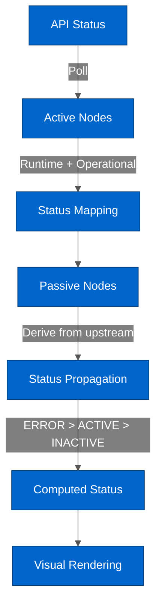

# Workspace Architecture

---

## Table of Contents

- [Overview](#overview)
- [Code Structure](#code-structure)
- [Key Design & Implementation Decisions](#key-design--implementation-decisions)
- [Testing](#testing)
- [Common Issues & Solutions](#common-issues--solutions)
- [Glossary](#glossary)
- [Related Documentation](#related-documentation)

---

## Overview

### What is it?

The Workspace is a **graph-based visualization** of the HiveMQ Edge broker topology, built on React Flow. It shows data transformation flows between protocol adapters, bridges, combiners, and the MQTT broker with real-time status propagation.

**Location:** `src/modules/Workspace/`

### Key Features

- **10 Node Types** - Adapters, bridges, devices, combiners, Edge broker, listeners, groups, Pulse, hosts, assets
- **Dual-Status System** - Runtime (is it running?) + Operational (is it configured?) for each connection
- **Status Propagation** - Passive nodes derive status from upstream active nodes
- **Filters** - Search, type, protocol, status, topic-based filtering
- **Automatic Layouts** - Dagre (hierarchical), Cola (force-directed), Radial (hub-centric), Manual
- **Real-Time Updates** - API polling updates node status every few seconds

### Why This Architecture?

**React Flow:** Professional graph editor provides pan, zoom, selection, custom nodes/edges without building from scratch. Ideal for topology visualization.

**Dual-Status Model:** Separates "is it running?" (runtime) from "is it configured for data flow?" (operational). Critical for troubleshooting - user can see if issue is connectivity or configuration.

**Active vs Passive Nodes:** Active nodes (adapters, bridges, Pulse) have own API status. Passive nodes (devices, hosts, combiners) derive status from upstream. Reduces API load and mirrors real data flow.

**Automatic Layouts:** Large topologies need automatic positioning. Multiple algorithms support different visualization needs (hierarchy vs force-directed vs radial).

---

## Code Structure

### Directory Layout

```
src/modules/Workspace/
├── components/
│   ├── controls/           # StatusListener, SelectionListener
│   ├── filters/            # Filter drawer and filter components
│   ├── layout/             # Layout selector, options drawer, presets
│   └── nodes/              # 10 node type components
├── hooks/
│   ├── useWorkspaceStore.ts    # Zustand store (graph + layout state)
│   └── useLayoutEngine.ts      # Layout algorithm application
├── types/
│   ├── nodes.types.ts      # Node type definitions
│   ├── status.types.ts     # Status model types
│   └── layout.ts           # Layout algorithm types
└── utils/
    ├── layout/             # Layout algorithm implementations
    ├── status-mapping.utils.ts         # API status → RuntimeStatus
    ├── status-propagation.utils.ts     # Passive node status computation
    ├── status-adapter-edge-operational.utils.ts  # Adapter operational rules
    └── status-edge-operational.utils.ts          # Edge/Pulse operational rules
```

### Key Components

| Component | File Path | Purpose |
|-----------|-----------|---------|
| **WorkspacePage** | `components/pages/WorkspacePage.tsx` | Main page with canvas, controls, drawers |
| **StatusListener** | `components/controls/StatusListener.tsx` | Polls API, updates node status, triggers edge updates |
| **SelectionListener** | `components/controls/SelectionListener.tsx` | Syncs React Flow selection to Zustand store |
| **Node Components** | `components/nodes/Node*.tsx` (10 files) | Custom React Flow node rendering per type |
| **FilterDrawer** | `components/filters/FilterDrawer.tsx` | Right drawer with search and filter controls |
| **LayoutEngine** | `hooks/useLayoutEngine.ts` | Applies layout algorithms to position nodes |

### Integration Points

**API Endpoints:**
- Adapter status: `/api/v1/management/protocol-adapters/status`
- Bridge status: `/api/v1/management/bridges/status`
- Pulse status: `/api/v1/pulse/status`
- Combiners: `/api/v1/data-combining/combiners`
- Listener groups: `/api/v1/mqtt/listeners`

**Router:**
- Main route: `/workspace`
- Defined in `src/modules/App/App.tsx`

**Shared Components:**
- Uses Chakra UI from app theme
- React Flow from `@xyflow/react`
- WebCola for force-directed layout
- Dagre for hierarchical layout

**Status Integration:**
- Status types defined in `src/api/__generated__/models/Status.ts`
- Mapped to internal `RuntimeStatus` and `OperationalStatus` enums

---

## Key Design & Implementation Decisions

### 1. React Flow Canvas

**What:** Professional graph visualization library powering the workspace canvas.

**Why:** Provides pan, zoom, selection, custom nodes/edges, minimap, controls without building from scratch. Industry-standard for node-based UIs.

**Where:**
- Main wrapper: `components/pages/WorkspacePage.tsx`
- Custom nodes: `components/nodes/` directory (10 node types)
- Node types enum: `types/nodes.types.ts`

**How:**
- Each node type has custom React component
- Edges computed from API relationships (adapters → devices, combiners → edge, etc.)
- Canvas state in Zustand store
- React Flow handles rendering, interaction, viewport

**Key Pattern:** Node data includes `statusModel: NodeStatusModel` for visual rendering.

### 2. Dual-Status Model

**What:** Each node and edge has TWO status dimensions - Runtime and Operational.

**Why:** Users need to know BOTH "is it connected?" AND "is it configured correctly?". Different troubleshooting paths for each.

**Where:**
- Type definition: `types/status.types.ts`
- Status mapping: `utils/status-mapping.utils.ts`
- Per-edge rules: `utils/status-utils.ts` (function `updateEdgesStatusWithModel`)

**How:**

| Status | Purpose | Visual | Values |
|--------|---------|--------|--------|
| **Runtime** | Is it running and connected? | Edge color, node border color | ACTIVE (green), INACTIVE (gray), ERROR (red) |
| **Operational** | Is it configured for data flow? | Edge animation (flowing dots) | ACTIVE (animated), INACTIVE (static), ERROR (static) |

**Key Pattern:** Edge animates ONLY if BOTH runtime=ACTIVE AND operational=ACTIVE.

### 3. Active vs Passive Nodes

**What:** Two node categories with different status sources.

**Why:** Only adapters, bridges, and Pulse have own API status. Other nodes derive status from connections. Mirrors real data flow and reduces API calls.

**Where:**
- Active: `NodeTypes.ADAPTER_NODE`, `BRIDGE_NODE`, `PULSE_NODE`
- Passive: All other node types (Device, Host, Combiner, Edge, Listener, etc.)
- Logic: `utils/status-propagation.utils.ts`

**How:**



**Active Nodes (3 types):**
- Adapter - Protocol adapters (OPC-UA, Modbus, HTTP, MQTT, etc.)
- Bridge - MQTT bridges to enterprise/cloud brokers
- Pulse - HiveMQ Pulse integration for asset management

**Passive Nodes (7 types):**
- Device - Physical devices connected via adapters
- Host - Remote brokers connected via bridges
- Combiner - Data transformation from multiple sources
- Edge - Central MQTT broker hub
- Listener - MQTT clients consuming data
- Cluster - Logical grouping of nodes
- Assets - Pulse assets collection

**Status Priority:** ERROR > ACTIVE > INACTIVE (for aggregations)

### 4. Per-Edge Operational Status

**What:** Each edge's operational status computed independently based on source and target nodes.

**Why:** Single combiner can have multiple upstream sources. Each connection may be configured differently. Users need per-connection visibility.

**Where:** `utils/status-utils.ts` - function `updateEdgesStatusWithModel()` (lines 437-617)

**How:**

| Edge Type | Runtime Status | Operational Status | Animation |
|-----------|----------------|-------------------|-----------|
| **Adapter → Device** | From adapter | From adapter | If adapter operational |
| **Adapter → Combiner** | From adapter | From combiner (has mappings using adapter tags?) | If BOTH active |
| **Adapter → Edge** | From adapter | From adapter (has northbound mappings?) | If adapter operational |
| **Bridge → Host** | From bridge | Has remote topics configured? | If bridge operational |
| **Bridge → Combiner** | From bridge | From combiner | If BOTH active |
| **Bridge → Edge** | From bridge | Has remote topics? | If bridge operational |
| **Pulse → Combiner (Asset Mapper)** | From Pulse | From combiner (has valid asset mappings?) | If BOTH active |
| **Pulse → Edge** | From Pulse | From Pulse | If Pulse operational |
| **Combiner → Edge** | Derived from upstream | Has mappings? | If combiner operational |

**Key Files:**
- `status-adapter-edge-operational.utils.ts` - Adapter operational rules
- `status-edge-operational.utils.ts` - Pulse operational rules

**Key Pattern:** For combiner edges, operational status comes from TARGET combiner, not source. Ensures all combiner edges show consistent animation state.

### 5. Filter System

**What:** Multi-criteria filtering with search, type, protocol, status, and topic filters.

**Why:** Large topologies (50+ nodes) need filtering to focus on specific areas. Combine criteria with AND/OR logic.

**Where:** `components/filters/` directory

**How:**
- FilterDrawer provides UI
- FilterConfiguration stores criteria
- filters.utils.ts applies filters (sets `hidden: true/false` on nodes)
- Live update mode: filters apply immediately
- Manual mode: user clicks Apply button

**Filter Types:**
- **Search:** Full-text search on node IDs and labels
- **Entity Types:** Show only selected node types
- **Protocol Types:** Filter adapters by protocol (OPC-UA, Modbus, etc.)
- **Runtime Status:** Show only nodes with specific runtime status
- **Operational Status:** Show only nodes with specific operational status
- **Topics:** Filter by MQTT topic subscriptions/publications

### 6. Automatic Layout System

**What:** Six layout algorithms for automatic node positioning.

**Why:** Manual positioning of 50+ nodes is tedious. Different topologies benefit from different layouts.

**Where:**
- Hook: `hooks/useLayoutEngine.ts`
- Implementations: `utils/layout/` directory

**How:**

| Algorithm | Use Case | Library |
|-----------|----------|---------|
| **DAGRE_TB** | Hierarchical top-to-bottom data flow | Dagre |
| **DAGRE_LR** | Hierarchical left-to-right data flow | Dagre |
| **COLA_FORCE** | Organic, balanced spacing | WebCola |
| **COLA_CONSTRAINED** | Force-directed with regional constraints | WebCola |
| **RADIAL_HUB** | Edge broker at center, radial outward | Custom |
| **MANUAL** | User positions, save/load presets | Custom |

**Layout Modes:**
- **STATIC:** Manual trigger only
- **DYNAMIC:** Auto-layout on graph changes (new nodes/edges)

**Layout Presets:**
- Save current positions as named preset
- Load preset to restore positions
- Stored in Zustand store

---

## Testing

### Component Testing Requirements

**Wrapper:** React Flow components MUST use `ReactFlowTesting` wrapper.

**Key Patterns:**
- All node components need React Flow context
- Provide initial nodes/edges to wrapper
- Accessibility test required as final test in suite

**Example:**
```typescript
import { ReactFlowTesting } from '@/__test-utils__/react-flow/ReactFlowTesting'

describe('NodeAdapter', () => {
  const mockNode = {
    id: 'adapter-1',
    type: NodeTypes.ADAPTER_NODE,
    position: { x: 0, y: 0 },
    data: { ...mockAdapterData, statusModel: { runtime: RuntimeStatus.ACTIVE, operational: OperationalStatus.ACTIVE } }
  }

  it('should render adapter node', () => {
    cy.mountWithProviders(<NodeAdapter {...mockNode} />, {
      wrapper: ({ children }) => (
        <ReactFlowTesting config={{ initialState: { nodes: [mockNode], edges: [] } }}>
          {children}
        </ReactFlowTesting>
      )
    })

    cy.contains(mockNode.data.id).should('be.visible')
  })

  it('should be accessible', () => {
    cy.injectAxe()
    cy.mountWithProviders(<NodeAdapter {...mockNode} />, {
      wrapper: ({ children }) => (
        <ReactFlowTesting config={{ initialState: { nodes: [mockNode], edges: [] } }}>
          {children}
        </ReactFlowTesting>
      )
    })
    cy.checkAccessibility()
  })
})
```

**See:** [Testing Guide](../guides/TESTING_GUIDE.md) for general patterns.
**See:** [Workspace Testing Guide](../guides/WORKSPACE_TESTING_GUIDE.md) for Workspace-specific patterns.

### E2E Testing Requirements

**Critical Setup:**
1. **Mock ALL status endpoints:**
   ```typescript
   // Adapter status
   cy.intercept('GET', '/api/v1/management/protocol-adapters/adapters', { items: [mockAdapter] })
   cy.intercept('GET', '/api/v1/management/protocol-adapters/status', { items: [mockAdapterStatus] })

   // Bridge status
   cy.intercept('GET', '/api/v1/management/bridges', { items: [mockBridge] })
   cy.intercept('GET', '/api/v1/management/bridges/status', { items: [mockBridgeStatus] })

   // Pulse status
   cy.intercept('GET', '/api/v1/pulse/status', mockPulseStatus)

   // Combiners
   cy.intercept('GET', '/api/v1/data-combining/combiners', { items: [mockCombiner] })
   ```

2. **Status fixtures must match API structure:**
   - `Status` type: `{ connection: 'CONNECTED', runtime: 'STARTED', type: 'adapter', id: '...' }`
   - `PulseStatus` type: `{ activation: 'ACTIVATED', runtime: 'CONNECTED' }`

3. **Wait for canvas to render:**
   ```typescript
   cy.get('[role="application"][data-testid="rf__wrapper"]').should('be.visible')
   ```

**Page Objects:** `cypress/pages/Workspace/WorkspacePage.ts`

**See:** [Cypress Guide](../guides/CYPRESS_GUIDE.md) for E2E patterns.

### Specific Gotchas

| Issue | Symptom | Solution |
|-------|---------|----------|
| **Node component not rendering in test** | TypeError about React Flow context | Use ReactFlowTesting wrapper in component test |
| **Status not updating in E2E** | Nodes show INACTIVE | Mock status endpoints with correct Status structure |
| **Canvas timeout in E2E** | Never finds rf__wrapper | Missing adapter/bridge/pulse data intercepts |
| **Edge not animating in test** | Operational status not working | Ensure node has statusModel with operational=ACTIVE |

---

## Common Issues & Solutions

| Issue | Symptom | Solution | Reference |
|-------|---------|----------|-----------|
| **Edges not animating** | All edges static, no flowing dots | Check operational status. Must be ACTIVE for animation. Runtime ACTIVE not enough. | `utils/status-utils.ts` |
| **Status not propagating** | Passive nodes stuck INACTIVE | Verify active nodes have statusModel. Check status-propagation.utils.ts logic. | `utils/status-propagation.utils.ts` |
| **Combiner edge wrong status** | Edge animated but combiner has no mappings | Per-edge rules use target combiner operational. Verify combiner.mappings exists. | `utils/status-utils.ts` (lines 437-617) |
| **Layout not applying** | Nodes overlap after layout click | Check console for errors. Verify algorithm has nodes/edges data. | `hooks/useLayoutEngine.ts` |
| **Filter not working** | Nodes still visible after filter | Check filterConfiguration.operator (AND/OR). Verify criteria format. | `components/filters/filters.utils.ts` |
| **React Flow context error in test** | Cannot read property useStore of null | Missing ReactFlowTesting wrapper. Add to cy.mountWithProviders. | See Testing section above |

---

## Glossary

| Term | Definition |
|------|------------|
| **Active Node** | Node with own API status (Adapter, Bridge, Pulse) |
| **Passive Node** | Node deriving status from upstream connections (Device, Host, Combiner, Edge, Listener, Cluster, Assets) |
| **Runtime Status** | Is the node running and connected? (ACTIVE/INACTIVE/ERROR) |
| **Operational Status** | Is the node configured for data transformation? (ACTIVE/INACTIVE/ERROR) |
| **Status Propagation** | Computing passive node status from upstream active nodes |
| **Per-Edge Status** | Each edge's status computed independently based on source/target |
| **Asset Mapper** | Combiner with Pulse Agent as source, using asset IDs in mappings |
| **Status Priority** | ERROR > ACTIVE > INACTIVE (for aggregated status) |
| **Dual-Status Model** | Runtime + Operational status for complete node/edge state |
| **Layout Algorithm** | Method for automatically positioning nodes (Dagre, Cola, Radial, Manual) |
| **Filter Configuration** | Criteria for showing/hiding nodes (search, type, status, topics) |

---

## Related Documentation

**Architecture:**
- [Domain Model](./DOMAIN_MODEL.md) — Entity definitions (TAG, TOPIC, TOPIC FILTER, COMBINER) and transformation flows; why the workspace graph differs from the domain ontology
- [DataHub Architecture](./DATAHUB_ARCHITECTURE.md)
- [State Management](./STATE_MANAGEMENT.md)
- [Data Flow](./DATA_FLOW.md)
- [Testing Architecture](./TESTING_ARCHITECTURE.md)

**Walkthroughs:**
- [Domain Ontology Visualization](../walkthroughs/DOMAIN_ONTOLOGY.md) — Why the workspace canvas is separate from the domain ontology view; seven visualization approaches explored

**Guides:**
- [Testing Guide](../guides/TESTING_GUIDE.md)
- [Cypress Guide](../guides/CYPRESS_GUIDE.md)
- [Workspace Testing Guide](../guides/WORKSPACE_TESTING_GUIDE.md)
- [Design Guide](../guides/DESIGN_GUIDE.md)

**API:**
- [React Query Patterns](../api/REACT_QUERY_PATTERNS.md)
- [OpenAPI Integration](../api/OPENAPI_INTEGRATION.md)

**Technical:**
- [Technical Stack](../technical/TECHNICAL_STACK.md)

**Design References (Miro):**
- [Edge | Workspace deconstructed](https://miro.com/app/board/uXjVJkiIoj4=) — wizard flows, integration points, persistence issues
- [Edge | Alternative Workspace as ETL Designer](https://miro.com/app/board/uXjVIFl3nyY=) — unified ETL canvas model
- [Edge – Protocol and Adapter Visual Identity](https://miro.com/app/board/uXjVNEM9gFw=) — entity design system
- [Edge Domain Ontology](https://miro.com/app/board/uXjVLpkTwW8=) — entity relationships, combiner/mapping data flow
- [Reference Materials](../technical/REFERENCE_MATERIALS.md) — full board catalogue
