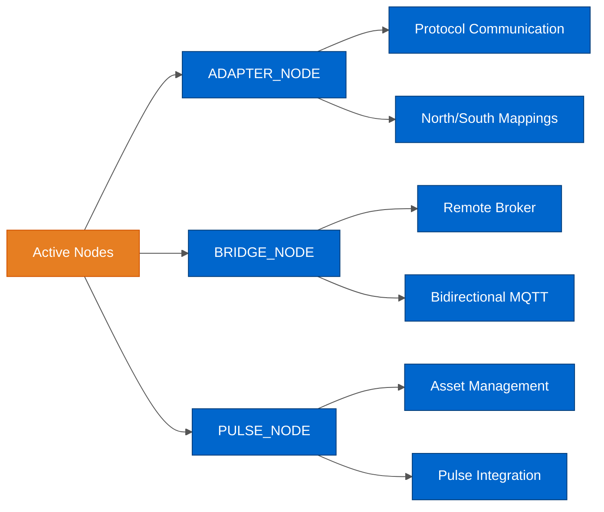
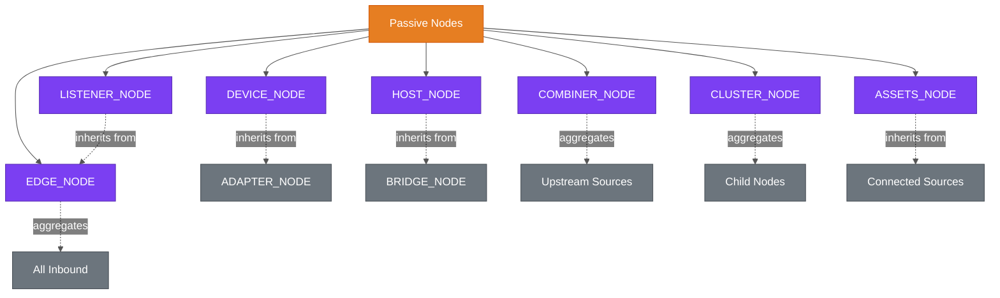
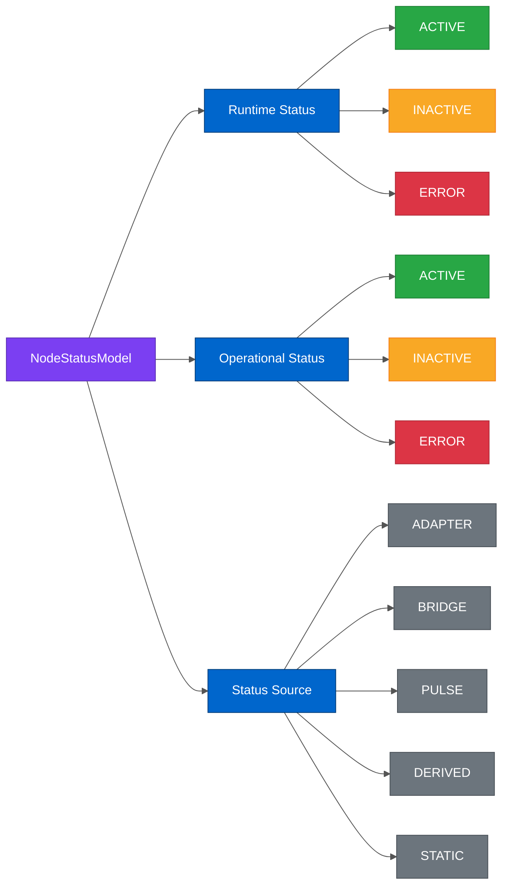
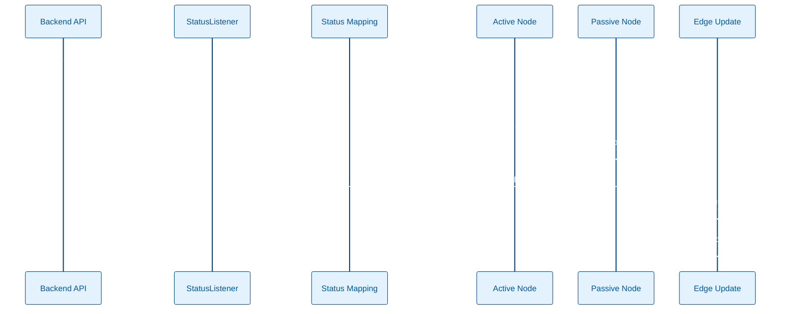
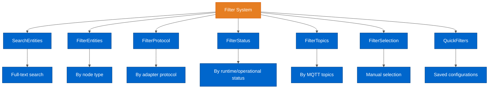
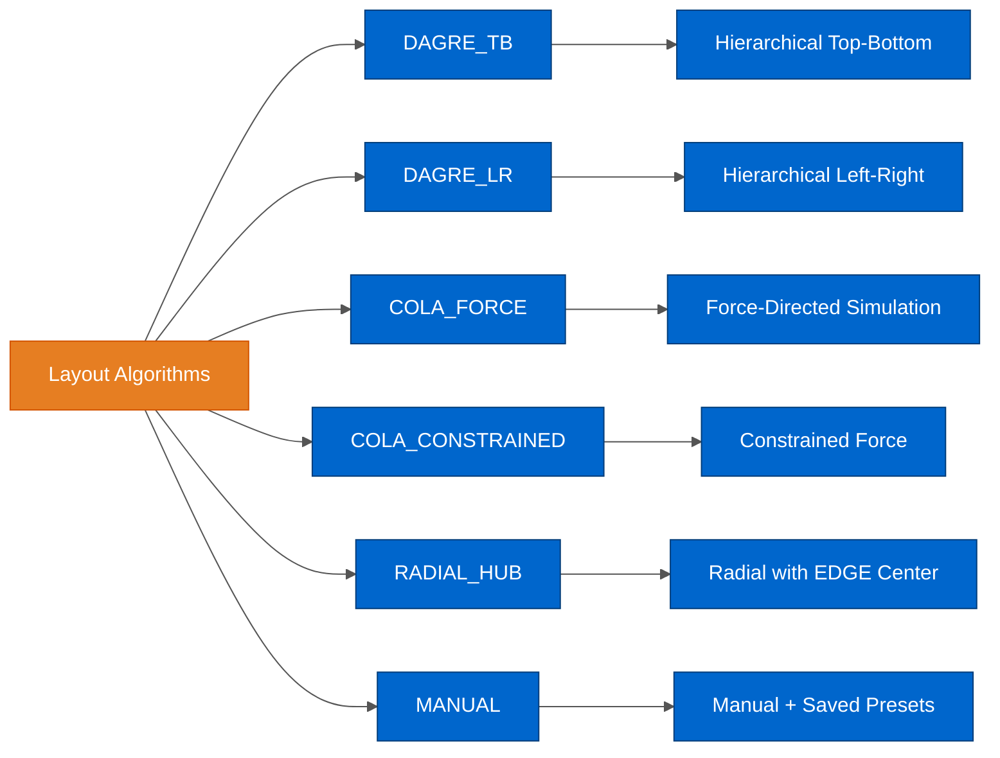
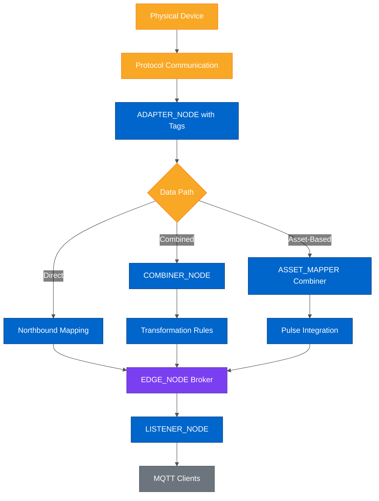

# Workspace Architecture

**Last Updated:** 2026-02-13

**Purpose:** Complete architecture reference for the Workspace module including React Flow integration, dual-status system, filters, and automatic layouts.

**Audience:** Developers and AI agents working on Workspace features

---

## Table of Contents

- [Overview](#overview)
- [Node Types](#node-types)
- [State Management](#state-management)
- [Component Architecture](#component-architecture)
- [Status System](#status-system)
- [Filter System](#filter-system)
- [Layout System](#layout-system)
- [Data Flow](#data-flow)
- [Testing](#testing)
- [Glossary](#glossary)
- [Related Documentation](#related-documentation)

---

## Overview

The HiveMQ Edge Workspace is a **graph-based visualization** of the Edge broker topology, built on React Flow, showing real-time data transformation flows between different entities.

### What is the Workspace?

The Workspace provides a visual representation of:
- **Protocol adapters** communicating with physical devices
- **MQTT bridges** connecting to enterprise brokers
- **Data combiners** transforming and routing data
- **Pulse integration** for asset-based processing
- **Real-time status** propagation through the graph

### Graph Theory Foundation

- **Nodes** = Entities (adapters, bridges, devices, combiners, etc.)
- **Edges** = Connections representing data transformation flows
- **Groups** = Logical grouping of related nodes (clusters)
- **Constraint** = Directed Acyclic Graph (DAG) for data flow

### Key Principles

1. **Connections represent configuration**, not necessarily active data flow
2. **Active nodes** have their own runtime status from API (adapters, bridges, pulse)
3. **Passive nodes** derive status from upstream connections
4. **Status propagates** through the graph topology
5. **Dual-status model** shows both runtime (is it running?) and operational (is it configured?)
6. **Per-edge operational status** ensures each connection accurately reflects its data transformation state

**Technology Stack:**
- **React Flow** (@xyflow/react) - Canvas and node rendering engine
- **Zustand** (useWorkspaceStore) - State management
- **React Query** - API data fetching and caching
- **WebCola** - Force-directed layout engine
- **Dagre** - Hierarchical layout engine

**Module Location:** `src/modules/Workspace/`

---

## Node Types

The Workspace supports 10 distinct node types, categorized as active (own runtime status) or passive (derived status).

### Active Nodes (Have Own Runtime Status)

Active nodes receive status updates from the API and maintain independent runtime state.



**Color Legend:**
- **Orange** - Category (Active Nodes)
- **Blue** - Node types and their features

#### 1. ADAPTER_NODE

**Purpose:** Software communicating with devices via specific protocols (OPC-UA, Modbus, HTTP, MQTT, etc.)

**File:** `src/modules/Workspace/components/nodes/NodeAdapter.tsx`

**Type Definition:**
```typescript
NodeAdapterType = Node<Adapter & { statusModel?: NodeStatusModel }, NodeTypes.ADAPTER_NODE>
```

**Status Sources:**
- `Status` (connection + runtime from API endpoint `/api/v1/management/protocol-adapters/status`)
- Operational status based on northbound/southbound mappings

**Outbound Connections:**
- → `DEVICE_NODE` (protocol communication with device)
- → `EDGE_NODE` (northbound data flow to broker)
- → `COMBINER_NODE` (data combining with other sources)

**Key Properties:**
- Adapter type (determines protocol: OPC-UA, Modbus, etc.)
- Tags (data points from device)
- Northbound mappings (device → Edge)
- Southbound mappings (Edge → device, for bidirectional adapters)

**Operational Status Logic:**

File: `src/modules/Workspace/utils/status-adapter-edge-operational.utils.ts`

```typescript
// Computed by: computeAdapterNodeOperationalStatus()

// Unidirectional adapters: ACTIVE if has northbound mappings
const hasNorth = adapterConfig.northboundMappings?.length > 0

// Bidirectional adapters: ACTIVE if has BOTH north AND south mappings
const hasSouth = adapterConfig.southboundMappings?.length > 0
const operational = isBidirectional(type) ? (hasNorth && hasSouth) : hasNorth
```

---

#### 2. BRIDGE_NODE

**Purpose:** Bidirectional MQTT bridge to enterprise/cloud brokers

**File:** `src/modules/Workspace/components/nodes/NodeBridge.tsx`

**Type Definition:**
```typescript
NodeBridgeType = Node<Bridge & { statusModel?: NodeStatusModel }, NodeTypes.BRIDGE_NODE>
```

**Status Sources:**
- `Status` (connection + runtime from API endpoint `/api/v1/management/bridges/status`)
- Operational status based on remote topic filters

**Outbound Connections:**
- → `HOST_NODE` (remote broker connection)
- → `EDGE_NODE` (local broker integration)
- → `COMBINER_NODE` (data combining)

**Key Properties:**
- Remote topics (upstream subscriptions from enterprise broker)
- Local topics (local subscriptions from Edge broker)
- Bidirectional communication support

**Operational Status Logic:**

File: `src/modules/Workspace/utils/status-utils.ts` (lines 518-526)

```typescript
// Bridge is operational if it has remote topics configured
const { remote } = getBridgeTopics(bridgeData)
const operational = remote.length > 0 ? OperationalStatus.ACTIVE : OperationalStatus.INACTIVE
```

---

#### 3. PULSE_NODE

**Purpose:** Distributed execution engine integrating with HiveMQ Pulse for asset management

**File:** `src/modules/Workspace/components/nodes/NodePulse.tsx`

**Type Definition:**
```typescript
NodePulseType = Node<
  {
    label: string
    id: string
    status?: PulseStatus
    statusModel?: NodeStatusModel
  },
  NodeTypes.PULSE_NODE
>
```

**Status Sources:**
- `PulseStatus` (activation + runtime from API)
- Operational status based on connected asset mappers with valid mappings

**Outbound Connections:**
- → `EDGE_NODE` (asset data publishing to broker)
- → `COMBINER_NODE` (asset mapper - combiner with Pulse source)

**Key Properties:**
- Managed assets (MAPPED or UNMAPPED status)
- Asset mapper connections (combiners with `EntityType.PULSE_AGENT` source)

**Operational Status Logic:**

File: `src/modules/Workspace/utils/status-edge-operational.utils.ts`

```typescript
// Computed by: computePulseNodeOperationalStatus()
// Pulse is operational if at least ONE connected asset mapper has valid mappings

const hasAnyValidConnection = connectedCombiners.some((combiner) =>
  combinerHasValidPulseAssetMappings(combiner.data, pulseAssets)
)

// combinerHasValidPulseAssetMappings checks:
// - Combiner has at least one mapping
// - At least one mapping references an asset with status = STREAMING (MAPPED)
```

---

### Passive Nodes (Derive Status from Upstream)

Passive nodes inherit their runtime status from connected active nodes and propagate status through the graph.



**Color Legend:**
- **Orange** - Category (Passive Nodes)
- **Purple** - Passive node types
- **Gray** - Status sources (active nodes or aggregations)

#### 4. DEVICE_NODE

**Purpose:** Physical or digital hardware connected via protocol adapter

**File:** `src/modules/Workspace/components/nodes/NodeDevice.tsx`

**Status Derivation:**
- Runtime: Inherited from parent adapter
- Operational: ACTIVE if device has tags configured

**Inbound Connections:** ← `ADAPTER_NODE`

---

#### 5. HOST_NODE

**Purpose:** Remote broker that bridge connects to

**File:** `src/modules/Workspace/components/nodes/NodeHost.tsx`

**Status Derivation:**
- Runtime: Inherited from parent bridge
- Operational: Always ACTIVE (bridge itself has topic configuration)

**Inbound Connections:** ← `BRIDGE_NODE`

---

#### 6. COMBINER_NODE

**Purpose:** Combines data from multiple sources (adapters, bridges, pulse) into single output with transformations

**File:** `src/modules/Workspace/components/nodes/NodeCombiner.tsx`

**Type Definition:**
```typescript
NodeCombinerType = Node<Combiner & { statusModel?: NodeStatusModel }, NodeTypes.COMBINER_NODE>
```

**API Type:** `src/api/__generated__/models/Combiner.ts`

**Status Derivation:**
- Runtime: ERROR if any upstream ERROR, else ACTIVE if any upstream ACTIVE, else INACTIVE
- Operational: ACTIVE if has mappings configured, else INACTIVE

**Inbound Connections:**
- ← `ADAPTER_NODE` (tag sources)
- ← `BRIDGE_NODE` (topic filter sources)
- ← `PULSE_NODE` (asset sources - when acting as asset mapper)

**Outbound Connections:** → `EDGE_NODE`

**Key Properties:**
```typescript
{
  sources: EntityReferenceList  // List of adapters/bridges/pulse agents
  mappings: DataCombiningList   // Transformation rules with source → destination
}
```

**Special Case: Asset Mapper**

A combiner becomes an "asset mapper" when it has `EntityType.PULSE_AGENT` in its sources:
- Mappings reference asset IDs from Pulse
- Destination uses `assetId` field instead of topic
- Validation uses `combinerHasValidPulseAssetMappings()`

**Operational Status Logic:**

```typescript
// Simple check: does it have any mappings?
const hasMappings = combiner.mappings?.items?.length > 0
const operational = hasMappings ? OperationalStatus.ACTIVE : OperationalStatus.INACTIVE
```

---

#### 7. EDGE_NODE

**Purpose:** Central hub representing the MQTT broker gateway

**File:** `src/modules/Workspace/components/nodes/NodeEdge.tsx`

**Status Derivation:**
- Runtime: Aggregates all upstream nodes (ERROR > ACTIVE > INACTIVE priority)
- Operational: ACTIVE if has topic filters configured

**Inbound Connections:**
- ← `ADAPTER_NODE`
- ← `BRIDGE_NODE`
- ← `PULSE_NODE`
- ← `COMBINER_NODE`

**Outbound Connections:** → `LISTENER_NODE`

---

#### 8. LISTENER_NODE

**Purpose:** MQTT listeners on the broker (clients consuming data)

**File:** `src/modules/Workspace/components/nodes/NodeListener.tsx`

**Status Derivation:**
- Runtime: Inherited from Edge node
- Operational: Always ACTIVE

**Inbound Connections:** ← `EDGE_NODE`

---

#### 9. CLUSTER_NODE (Group)

**Purpose:** Logical grouping of nodes for management and organization

**File:** `src/modules/Workspace/components/nodes/NodeGroup.tsx`

**Status Derivation:**
- Runtime: Aggregates child nodes (ERROR > ACTIVE > INACTIVE)
- Operational: Aggregates child nodes (ERROR > ACTIVE > INACTIVE)

**Key Properties:**
```typescript
{
  childrenNodeIds: string[]  // IDs of grouped nodes
  title: string
  isOpen: boolean
  colorScheme?: string
}
```

---

#### 10. ASSETS_NODE

**Purpose:** Represents Pulse assets collection

**File:** `src/modules/Workspace/components/nodes/NodeAssets.tsx`

**Status Derivation:**
- Runtime: Inherited from upstream sources
- Operational: ACTIVE if has mapped assets (status = STREAMING)

---

## State Management

### Store Architecture

```mermaid
%%{init: {'theme':'base', 'themeVariables': {
  'primaryColor':'#0066CC',
  'primaryTextColor':'#FFFFFF',
  'primaryBorderColor':'#003D7A',
  'edgeLabelBackground':'transparent',
  'lineColor':'#555555'
}}}%%
flowchart TD
    A[useWorkspaceStore] --> B[Graph State]
    A --> C[Layout State]
    A --> D[Selection State]
    A --> E[Actions]

    B --> F[nodes: Node array]
    B --> G[edges: Edge array]

    C --> H[layoutConfig]
    C --> I[isAutoLayoutEnabled]
    C --> J[layoutHistory]

    D --> K[selectedNodeIds]
    D --> L[selectedEdgeIds]

    E --> M[onNodesChange]
    E --> N[onEdgesChange]
    E --> O[setLayoutAlgorithm]
    E --> P[saveLayoutPreset]

    style A fill:#7B3FF2,stroke:#5A2FB3,color:#FFFFFF
    style B fill:#0066CC,stroke:#003D7A,color:#FFFFFF
    style C fill:#0066CC,stroke:#003D7A,color:#FFFFFF
    style D fill:#0066CC,stroke:#003D7A,color:#FFFFFF
    style E fill:#28A745,stroke:#1E7E34,color:#FFFFFF
    style F fill:#0066CC,stroke:#003D7A,color:#FFFFFF
    style G fill:#0066CC,stroke:#003D7A,color:#FFFFFF
    style H fill:#0066CC,stroke:#003D7A,color:#FFFFFF
    style I fill:#0066CC,stroke:#003D7A,color:#FFFFFF
    style J fill:#0066CC,stroke:#003D7A,color:#FFFFFF
    style K fill:#0066CC,stroke:#003D7A,color:#FFFFFF
    style L fill:#0066CC,stroke:#003D7A,color:#FFFFFF
    style M fill:#28A745,stroke:#1E7E34,color:#FFFFFF
    style N fill:#28A745,stroke:#1E7E34,color:#FFFFFF
    style O fill:#28A745,stroke:#1E7E34,color:#FFFFFF
    style P fill:#28A745,stroke:#1E7E34,color:#FFFFFF
```



**Color Legend:**
- **Purple** - Zustand store
- **Blue** - State properties
- **Green** - Store actions

### Workspace Store

**Location:** `src/modules/Workspace/hooks/useWorkspaceStore.ts`

**State Interface:**
```typescript
interface WorkspaceState {
  // Graph state
  nodes: Node[]
  edges: Edge[]

  // Layout configuration (Added: EPIC 25337 - Oct 31, 2025)
  layoutConfig: {
    currentAlgorithm: LayoutType
    mode: LayoutMode
    options: LayoutOptions
    presets: LayoutPreset[]
  }
  isAutoLayoutEnabled: boolean
  layoutHistory: LayoutHistoryEntry[]

  // Selection state
  selectedNodeIds: string[]
  selectedEdgeIds: string[]
}
```

**Key Actions:**

**Graph Manipulation:**
- `onNodesChange()` - Handle React Flow node updates
- `onEdgesChange()` - Handle React Flow edge updates
- `onConnect()` - Handle new edge connections
- `addNodes()` - Add nodes to canvas
- `updateNodes()` - Update node data
- `removeNodes()` - Remove nodes from canvas

**Layout Management (EPIC 25337):**
- `setLayoutAlgorithm()` - Change layout algorithm
- `setLayoutMode()` - Toggle STATIC/DYNAMIC mode
- `setLayoutOptions()` - Configure algorithm-specific parameters
- `toggleAutoLayout()` - Enable/disable automatic layout on graph changes
- `saveLayoutPreset()` - Save current node positions as preset
- `loadLayoutPreset()` - Load saved layout preset
- `deleteLayoutPreset()` - Remove saved layout preset
- `pushLayoutHistory()` / `clearLayoutHistory()` - Undo/redo support

**Selection Management:**
- `setSelectedNodes()` - Update selected nodes
- `setSelectedEdges()` - Update selected edges
- `clearSelection()` - Clear all selections

---

## Component Architecture

### Page Structure

```mermaid
%%{init: {'theme':'base', 'themeVariables': {
  'primaryColor':'#0066CC',
  'primaryTextColor':'#FFFFFF',
  'primaryBorderColor':'#003D7A',
  'edgeLabelBackground':'transparent',
  'lineColor':'#555555'
}}}%%
graph TD
    A[WorkspacePage] --> B[CanvasControls]
    A --> C[ReactFlowWrapper]
    A --> D[FilterDrawer]
    A --> E[LayoutOptionsDrawer]

    B --> F[ZoomControls]
    B --> G[LayoutSelector]
    B --> H[SearchEntities]

    C --> I[React Flow]
    C --> J[StatusListener]
    C --> K[SelectionListener]

    D --> L[FilterEntities]
    D --> M[FilterProtocol]
    D --> N[FilterStatus]
    D --> O[FilterTopics]

    E --> P[LayoutPresetsManager]
    E --> Q[LayoutOptionsForm]

    style A fill:#0066CC,stroke:#003D7A,color:#FFFFFF
    style B fill:#0066CC,stroke:#003D7A,color:#FFFFFF
    style C fill:#0066CC,stroke:#003D7A,color:#FFFFFF
    style D fill:#0066CC,stroke:#003D7A,color:#FFFFFF
    style E fill:#0066CC,stroke:#003D7A,color:#FFFFFF
    style F fill:#0066CC,stroke:#003D7A,color:#FFFFFF
    style G fill:#0066CC,stroke:#003D7A,color:#FFFFFF
    style H fill:#0066CC,stroke:#003D7A,color:#FFFFFF
    style I fill:#0066CC,stroke:#003D7A,color:#FFFFFF
    style J fill:#0066CC,stroke:#003D7A,color:#FFFFFF
    style K fill:#0066CC,stroke:#003D7A,color:#FFFFFF
    style L fill:#0066CC,stroke:#003D7A,color:#FFFFFF
    style M fill:#0066CC,stroke:#003D7A,color:#FFFFFF
    style N fill:#0066CC,stroke:#003D7A,color:#FFFFFF
    style O fill:#0066CC,stroke:#003D7A,color:#FFFFFF
    style P fill:#0066CC,stroke:#003D7A,color:#FFFFFF
    style Q fill:#0066CC,stroke:#003D7A,color:#FFFFFF
```



**Color Legend:**
- **Blue** - All React components (same type = same color)

### Key Components

#### 1. StatusListener

**Location:** `src/modules/Workspace/components/controls/StatusListener.tsx`

**Purpose:** Synchronizes API status updates with node visual state

**Flow:**
1. Polls adapter/bridge/pulse status from API using React Query
2. Maps API status to unified `NodeStatusModel` using `status-mapping.utils.ts`
3. Updates node data in Zustand store
4. Triggers edge re-rendering via `updateEdgesStatusWithModel()`

**Update Triggers:**

```typescript
// Trigger 1: API status changes
useEffect(() => {
  // When adapter/bridge status changes from API polling
  setEdges(updateEdgesStatusWithModel(...))
}, [adapterConnections?.items, bridgeConnections?.items, pulseStatus])

// Trigger 2: Node data changes
useEffect(() => {
  // When nodes change (e.g., combiner computes its statusModel)
  setEdges(updateEdgesStatusWithModel(...))
}, [nodes, adapterTypes])
```

**Why Both Triggers?**
- Trigger 1: Handles external status changes (API polling results)
- Trigger 2: Handles internal status changes (combiner computing operational status)
- Together they ensure edges always have fresh node data for accurate rendering

---

#### 2. SelectionListener

**Location:** `src/modules/Workspace/components/controls/SelectionListener.tsx`

**Purpose:** Tracks React Flow selection and updates Zustand store

**Flow:**
1. Listens to React Flow `onSelectionChange` events
2. Extracts selected node/edge IDs
3. Updates `useWorkspaceStore` selection state
4. Enables context menu and filter actions

---

#### 3. LayoutEngine (EPIC 25337)

**Location:** `src/modules/Workspace/hooks/useLayoutEngine.ts`

**Purpose:** Applies layout algorithms to automatically position nodes

**Supported Algorithms:**
- **DAGRE_TB** - Hierarchical top-to-bottom (uses Dagre library)
- **DAGRE_LR** - Hierarchical left-to-right (uses Dagre library)
- **COLA_FORCE** - Force-directed simulation (uses WebCola)
- **COLA_CONSTRAINED** - Constrained force-directed (uses WebCola with constraints)
- **RADIAL_HUB** - Radial layout with EDGE node at center
- **MANUAL** - Manual positioning with saved layouts

**Usage:**
```typescript
const { applyLayout, isLayouting } = useLayoutEngine()

const handleLayoutClick = async () => {
  await applyLayout(LayoutType.DAGRE_TB, nodes, edges)
}
```

**Files:** `src/modules/Workspace/utils/layout/` directory

---

## Status System

### Dual-Status Model

**File:** `src/modules/Workspace/types/status.types.ts`

The Workspace uses a **dual-status model** to represent both runtime state and configuration completeness.



**Color Legend:**
- **Purple** - Status model container
- **Blue** - Status categories
- **Green** - ACTIVE state
- **Yellow** - INACTIVE state
- **Red** - ERROR state
- **Gray** - Status sources

#### Runtime Status

**Purpose:** Is the node running and connected?

```typescript
enum RuntimeStatus {
  ACTIVE = 'ACTIVE',     // Running and connected
  INACTIVE = 'INACTIVE', // Stopped or disconnected
  ERROR = 'ERROR',       // Has errors or error state
}
```

**Visual Representation:** Color of node border and edges
- Green = ACTIVE
- Yellow/Gray = INACTIVE
- Red = ERROR

#### Operational Status

**Purpose:** Is the node configured for data transformation?

```typescript
enum OperationalStatus {
  ACTIVE = 'ACTIVE',     // Fully configured for data transformation
  INACTIVE = 'INACTIVE', // Partially configured (DRAFT) or not yet activated
  ERROR = 'ERROR',       // Not configured for data transformation
}
```

**Visual Representation:** Animation of edges (flowing dots)
- Only animates when operational = ACTIVE

#### Unified Status Model

```typescript
interface NodeStatusModel {
  runtime: RuntimeStatus
  operational: OperationalStatus
  source: 'ADAPTER' | 'BRIDGE' | 'PULSE' | 'DERIVED' | 'STATIC'
  originalStatus?: Status | PulseStatus
  lastUpdated?: string
}
```

---

### Status Mapping

**File:** `src/modules/Workspace/utils/status-mapping.utils.ts`

Converts API status types to unified `RuntimeStatus`.

#### Adapter/Bridge Status → Runtime Status

```typescript
// Maps Status.connection and Status.runtime to RuntimeStatus
function mapAdapterStatusToRuntime(status?: Status): RuntimeStatus {
  // ERROR if runtime STOPPED or connection ERROR
  if (status?.runtime === Status.runtime.STOPPED) return RuntimeStatus.ERROR

  // ACTIVE if runtime STARTED and connection CONNECTED/STATELESS
  if (status?.runtime === Status.runtime.STARTED) {
    if (status.connection === Status.connection.CONNECTED ||
        status.connection === Status.connection.STATELESS) {
      return RuntimeStatus.ACTIVE
    }
  }

  // INACTIVE otherwise (DISCONNECTED, UNKNOWN)
  return RuntimeStatus.INACTIVE
}
```

#### Pulse Status → Runtime Status

```typescript
function mapPulseStatusToRuntime(status?: PulseStatus): RuntimeStatus {
  // ERROR if activation ERROR or runtime ERROR
  if (status?.activation === PulseStatus.activation.ERROR ||
      status?.runtime === PulseStatus.runtime.ERROR) {
    return RuntimeStatus.ERROR
  }

  // INACTIVE if activation DEACTIVATED
  if (status?.activation === PulseStatus.activation.DEACTIVATED) {
    return RuntimeStatus.INACTIVE
  }

  // ACTIVE if activation ACTIVATED and runtime CONNECTED
  if (status?.activation === PulseStatus.activation.ACTIVATED &&
      status?.runtime === PulseStatus.runtime.CONNECTED) {
    return RuntimeStatus.ACTIVE
  }

  // INACTIVE otherwise
  return RuntimeStatus.INACTIVE
}
```

---

### Status Propagation

**File:** `src/modules/Workspace/utils/status-propagation.utils.ts`

Computes status for passive nodes based on their upstream connections.



**Active vs Passive Nodes:**

```typescript
// Check if node type is active (has own runtime status from API)
function isActiveNode(nodeType: NodeTypes): boolean {
  return nodeType === NodeTypes.ADAPTER_NODE ||
         nodeType === NodeTypes.BRIDGE_NODE ||
         nodeType === NodeTypes.PULSE_NODE
}
```

**Passive Node Status Computation:**

```typescript
function computePassiveNodeRuntimeStatus(
  nodeId: string,
  edges: Edge[],
  nodes: Node[]
): RuntimeStatus {
  // 1. Get all upstream active nodes connected to this passive node
  const upstreamActiveNodes = getUpstreamActiveNodes(nodeId, edges, nodes)

  // 2. ERROR if any upstream is ERROR
  if (upstreamActiveNodes.some(node => node.statusModel.runtime === RuntimeStatus.ERROR)) {
    return RuntimeStatus.ERROR
  }

  // 3. ACTIVE if at least one upstream is ACTIVE (and no ERROR)
  if (upstreamActiveNodes.some(node => node.statusModel.runtime === RuntimeStatus.ACTIVE)) {
    return RuntimeStatus.ACTIVE
  }

  // 4. INACTIVE otherwise
  return RuntimeStatus.INACTIVE
}
```

**Status Priority Rules:**

For aggregated status (Edge node, Group nodes):
```
ERROR > ACTIVE > INACTIVE
```

---

### Per-Edge Operational Status Rules

**File:** `src/modules/Workspace/utils/status-utils.ts`

Each edge has its own operational status computed from source and target nodes. This ensures visual consistency and configuration accuracy.

**Implementation:** `updateEdgesStatusWithModel()` function (line 437)

#### Rule 1: ADAPTER → DEVICE

**Implementation:** Lines 492-498

```typescript
{
  runtime: adapter.statusModel.runtime,
  operational: adapter.statusModel.operational,
  bidirectional: isBidirectional(adapterType)
}
```

**Operational Logic:**
- Uses adapter's overall operational status
- Bidirectional flag affects edge visualization

**Animation:** Edge animates if adapter is fully operational

---

#### Rule 2: ADAPTER → COMBINER

**Implementation:** Lines 501-506, calls `createNewStatusEdgeForCombiner()` (line 302)

```typescript
{
  runtime: adapter.statusModel.runtime,      // From source
  operational: combiner.statusModel.operational  // From target
}
```

**Operational Logic:**
- Runtime status from source adapter (is it active?)
- Operational status from target combiner (does it have valid tag mappings?)
- Uses `combinerHasValidAdapterTagMappings()` to verify mappings reference adapter's tags

**Fallback Logic (lines 327-334):**
```typescript
// If combiner statusModel not yet computed, check mappings directly
const hasMapping = combiner.mappings?.items?.length > 0
const operational = hasMapping ? OperationalStatus.ACTIVE : OperationalStatus.INACTIVE
```

**Animation:** Edge animates only if adapter is ACTIVE AND combiner has valid tag mappings

**File:** `src/modules/Workspace/utils/status-adapter-edge-operational.utils.ts`
- `computeAdapterToCombinerOperationalStatus()` - Validates combiner has mappings using adapter tags
- `combinerHasValidAdapterTagMappings()` - Checks if mappings reference tags from this adapter

---

#### Rule 3: ADAPTER → EDGE

**Implementation:** Lines 508-513

```typescript
{
  runtime: adapter.statusModel.runtime,
  operational: adapter.statusModel.operational
}
```

**Operational Logic:**
- Computed by `computeAdapterToEdgeOperationalStatus()` in `status-adapter-edge-operational.utils.ts`
- Checks if adapter has at least one northbound mapping

**Animation:** Edge animates if adapter is ACTIVE and has northbound mappings

---

#### Rule 4: BRIDGE → HOST

**Implementation:** Lines 516-540

```typescript
{
  runtime: bridge.statusModel.runtime,
  operational: hasRemoteTopics ? ACTIVE : INACTIVE
}
```

**Operational Logic:**
- Bridge operational status depends on having remote topic filters configured
- `getBridgeTopics(bridgeData)` extracts remote topics

**Animation:** Edge animates if bridge is ACTIVE and has remote topics

---

#### Rule 5: BRIDGE → COMBINER

**Implementation:** Lines 529-534, calls `createNewStatusEdgeForCombiner()`

```typescript
{
  runtime: bridge.statusModel.runtime,       // From source
  operational: combiner.statusModel.operational  // From target
}
```

**Operational Logic:** Same as ADAPTER → COMBINER

**Animation:** Edge animates only if bridge is ACTIVE AND combiner has valid mappings

---

#### Rule 6: BRIDGE → EDGE

**Implementation:** Lines 536-540

```typescript
{
  runtime: bridge.statusModel.runtime,
  operational: hasRemoteTopics ? ACTIVE : INACTIVE
}
```

**Animation:** Edge animates if bridge is ACTIVE and has remote topics

---

#### Rule 7: PULSE → ASSET_MAPPER (Combiner with Pulse source)

**Implementation:** Lines 544-572

```typescript
{
  runtime: pulse.statusModel.runtime,              // From source
  operational: assetMapper.statusModel.operational // From target
}
```

**Operational Logic:**
- Validates target is an asset mapper: `combiner.sources.items.some(s => s.type === EntityType.PULSE_AGENT)`
- Uses `combinerHasValidPulseAssetMappings()` to verify mappings reference MAPPED assets

**Animation:** Edge animates only if Pulse is ACTIVE AND asset mapper has valid asset mappings

**File:** `src/modules/Workspace/utils/status-edge-operational.utils.ts`
- `computePulseToAssetMapperOperationalStatus()` - Validates asset mapper configuration
- `combinerHasValidPulseAssetMappings()` - Checks if mappings reference assets with status = STREAMING

---

#### Rule 8: PULSE → EDGE

**Implementation:** Lines 574-579

```typescript
{
  runtime: pulse.statusModel.runtime,
  operational: pulse.statusModel.operational
}
```

**Operational Logic:**
- Uses Pulse node's overall operational status
- Computed by `computePulseNodeOperationalStatus()` in `status-edge-operational.utils.ts`
- Pulse is operational if at least one connected asset mapper has valid mappings

**Animation:** Edge animates if Pulse is ACTIVE and operational

---

#### Rule 9: COMBINER → EDGE

**Implementation:** Lines 582-593

```typescript
{
  runtime: combiner.statusModel.runtime,       // Derived from upstream sources
  operational: combiner.statusModel.operational // Has mappings?
}
```

**Operational Logic:**
- Runtime: Aggregated from upstream sources (ERROR > ACTIVE > INACTIVE)
- Operational: ACTIVE if has at least one mapping configured

**Animation:** Edge animates if combiner runtime is ACTIVE AND has mappings

---

### Consistency Principle

**File:** `src/modules/Workspace/utils/status-utils.ts` (function `createNewStatusEdgeForCombiner`)

**For edges connecting to COMBINER nodes**, the **target combiner's operational status** is used for the edge's operational status.

**Why?** This ensures:
1. **Visual Consistency** - All edges connected to a combiner show the same animation state
2. **Configuration Clarity** - Animation reflects whether the combiner itself is configured
3. **Data Flow Accuracy** - Only animated if the target is ready to transform data

**Implementation:**
```typescript
// Lines 302-340
export const createNewStatusEdgeForCombiner = (
  edge: Edge,
  sourceStatusModel: NodeStatusModel | undefined,
  targetNode: Node,
  theme: Partial<WithCSSVar<Dict>>
): Edge => {
  const targetStatusModel = targetNode.data.statusModel

  if (targetStatusModel) {
    // Use target combiner's operational status
    const edgeStatusModel: NodeStatusModel = {
      runtime: sourceStatusModel?.runtime || RuntimeStatus.INACTIVE,
      operational: targetStatusModel.operational, // TARGET's operational status
      source: 'DERIVED',
    }
    return { ...edge, ...getEdgeStatusFromModel(edgeStatusModel, true, theme) }
  }

  // Fallback: Check combiner mappings directly if statusModel unavailable
  const combiner = targetNode.data as Combiner
  const hasMapping = combiner.mappings?.items?.length > 0
  const fallbackStatusModel: NodeStatusModel = {
    runtime: sourceStatusModel?.runtime || RuntimeStatus.INACTIVE,
    operational: hasMapping ? OperationalStatus.ACTIVE : OperationalStatus.INACTIVE,
    source: 'DERIVED',
  }
  return { ...edge, ...getEdgeStatusFromModel(fallbackStatusModel, true, theme) }
}
```

---

### Visual Rendering

**Colors (Runtime Status):**

File: `src/modules/Workspace/utils/status-utils.ts`

```typescript
function getThemeForRuntimeStatus(theme, status: RuntimeStatus): string {
  switch (status) {
    case RuntimeStatus.ACTIVE:
      return theme.colors.status.connected[500]   // Green
    case RuntimeStatus.ERROR:
      return theme.colors.status.error[500]       // Red
    case RuntimeStatus.INACTIVE:
      return theme.colors.status.disconnected[500] // Yellow/Gray
  }
}
```

**Applied to:** Node borders, edge stroke color, edge marker (arrow) color

**Animations (Operational Status):**

```typescript
function getEdgeStatusFromModel(
  statusModel: NodeStatusModel,
  isBidirectional: boolean,
  theme
): EdgeProps {
  // Edge animates only if BOTH conditions true:
  const animated = statusModel.operational === OperationalStatus.ACTIVE &&
                   statusModel.runtime === RuntimeStatus.ACTIVE

  return {
    animated,
    style: { stroke: getThemeForRuntimeStatus(theme, statusModel.runtime) },
    markerEnd: { type: MarkerType.ArrowClosed, color: /* runtime color */ },
  }
}
```

**Result:**
- ACTIVE operational + ACTIVE runtime → Animated edge (flowing dots)
- INACTIVE operational → No animation (not configured)
- ERROR → No animation (error state)

---

## Filter System

**EPIC 37322** (October 23, 2025) - Search and Filter System

**Location:** `src/modules/Workspace/components/filters/`

### Filter Types



**Color Legend:**
- **Orange** - Filter system root
- **Blue** - Filter components and features

### Filter Configuration

**File:** `src/modules/Workspace/components/filters/types.ts`

```typescript
interface FilterConfiguration {
  // Search
  searchQuery?: string

  // Entity type filter
  entityTypes?: NodeTypes[]

  // Protocol filter (adapters only)
  protocolTypes?: string[]

  // Status filter
  runtimeStatuses?: RuntimeStatus[]
  operationalStatuses?: OperationalStatus[]

  // MQTT topics filter
  topics?: string[]

  // Manual selection
  selectedNodeIds?: string[]

  // Filter logic
  operator: 'AND' | 'OR'  // Combine criteria with AND/OR
  liveUpdate: boolean      // Apply filters as you type
}
```

### Filter Application

**File:** `src/modules/Workspace/components/filters/filters.utils.ts`

**Logic:**
1. Evaluate each filter criterion against each node
2. Combine results using AND/OR operator
3. Hide non-matching nodes (set `hidden: true`)
4. Show matching nodes (set `hidden: false`)

**Live Update:**
- When enabled: Filters apply immediately on change
- When disabled: User must click "Apply" button

---

## Layout System

**EPIC 25337** (October 31, 2025) - Automatic Layout System

**Location:** `src/modules/Workspace/components/layout/`, `src/modules/Workspace/utils/layout/`

### Layout Algorithms



**Color Legend:**
- **Orange** - Layout system root
- **Blue** - Layout algorithms and descriptions

### Layout Types

**File:** `src/modules/Workspace/types/layout.ts`

```typescript
enum LayoutType {
  DAGRE_TB = 'DAGRE_TB',               // Hierarchical top-to-bottom
  DAGRE_LR = 'DAGRE_LR',               // Hierarchical left-to-right
  COLA_FORCE = 'COLA_FORCE',           // Force-directed simulation
  COLA_CONSTRAINED = 'COLA_CONSTRAINED', // Constrained force-directed
  RADIAL_HUB = 'RADIAL_HUB',           // Radial hub with EDGE at center
  MANUAL = 'MANUAL',                   // Manual positioning with saved layouts
}

enum LayoutMode {
  STATIC = 'STATIC',   // Manual trigger only
  DYNAMIC = 'DYNAMIC', // Auto-layout on graph changes
}
```

### Layout Features

**Hierarchical Layouts (DAGRE_TB, DAGRE_LR):**
- Uses Dagre library for graph layout
- Respects graph hierarchy and data flow direction
- Configurable node spacing and rank separation
- Ideal for visualizing data flow pipelines

**Implementation:** `src/modules/Workspace/utils/layout/dagre-layout.ts`

**Force-Directed Layouts (COLA_FORCE, COLA_CONSTRAINED):**
- Uses WebCola library for force simulation
- Natural spacing based on connection density
- Optional constraints (keep nodes in specific regions)
- Ideal for organic, balanced layouts

**Implementation:**
- `src/modules/Workspace/utils/layout/cola-force-layout.ts`
- `src/modules/Workspace/utils/layout/cola-constrained-layout.ts`

**Radial Layout (RADIAL_HUB):**
- EDGE node positioned at center
- Other nodes radiate outward by distance from center
- Ideal for star topologies and hub visualization

**Implementation:** `src/modules/Workspace/utils/layout/radial-hub-layout.ts`

**Manual Layout (MANUAL):**
- User positions nodes manually
- Save/load layout presets
- Undo/redo support via layout history

**Implementation:** `src/modules/Workspace/utils/layout/manual-layout.ts`

### Layout Presets

**File:** `src/modules/Workspace/components/layout/LayoutPresetsManager.tsx`

**Features:**
- Save current node positions as named preset
- Load saved preset to restore positions
- Delete unused presets
- Export/import presets (future enhancement)

**Storage:**
```typescript
interface LayoutPreset {
  id: string
  name: string
  algorithm: LayoutType
  positions: Record<string, { x: number; y: number }>
  timestamp: string
}
```

---

## Data Flow

### Configuration Flow



**Color Legend:**
- **Yellow** - External entities and decision points
- **Blue** - Active nodes and transformations
- **Purple** - Central hub (EDGE_NODE)
- **Gray** - Output (MQTT clients)

---

## Testing

### Component Testing

**Test Pattern:** All Workspace components use React Flow testing wrapper

**Required Tests:**
1. Component rendering
2. Node interactions
3. Status propagation
4. **Accessibility** (mandatory last test)

**Example:**
```typescript
import { ReactFlowTesting } from '@/__test-utils__/react-flow/ReactFlowTesting'

describe('NodeAdapter', () => {
  it('should render adapter node', () => {
    const nodes = [mockAdapterNode]

    cy.mountWithProviders(<NodeAdapter {...nodes[0]} />, {
      wrapper: ({ children }) => (
        <ReactFlowTesting config={{ initialState: { nodes, edges: [] } }}>
          {children}
        </ReactFlowTesting>
      )
    })

    cy.contains(mockAdapterNode.data.id)
  })

  it('should be accessible', () => {
    cy.injectAxe()
    cy.mountWithProviders(<NodeAdapter {...mockAdapterNode} />)
    cy.checkAccessibility()  // NOT cy.checkA11y()
  })
})
```

**Related:** [Testing Guide](../guides/TESTING_GUIDE.md) _(TODO)_

---

### E2E Testing

**Test Pattern:** Workspace E2E tests require MSW handlers for all entities

**Critical Requirements:**
- Mock all adapter/bridge/pulse status endpoints
- Mock combiner, group, listener endpoints
- Ensure status propagation works correctly in tests

**Example:**
```typescript
describe('Workspace Status', () => {
  beforeEach(() => {
    cy_interceptCoreE2E()

    // Mock adapter status
    cy.intercept('GET', '/api/v1/management/protocol-adapters/adapters', {
      items: [mockAdapter]
    })

    // Mock adapter connections (status)
    cy.intercept('GET', '/api/v1/management/protocol-adapters/status', {
      items: [mockAdapterStatus]
    })

    cy.visit('/workspace')
  })

  it('should show active adapter with green border', () => {
    cy.get('[data-node-id="test-adapter"]')
      .should('have.attr', 'data-status', 'ACTIVE')
  })
})
```

**Related:** [Cypress Guide](../guides/CYPRESS_GUIDE.md) _(TODO)_

---

## Glossary

| Term | Definition |
|------|------------|
| **Active Node** | Node with own runtime status from API (Adapter, Bridge, Pulse) |
| **Passive Node** | Node deriving status from upstream connections (Device, Host, Combiner, Edge, Listener) |
| **Runtime Status** | Is the node running and connected? (ACTIVE/INACTIVE/ERROR) |
| **Operational Status** | Is the node configured for data transformation? (ACTIVE/INACTIVE/ERROR) |
| **Status Propagation** | Computing passive node status from upstream active nodes |
| **Per-Edge Status** | Edge status computed independently for each connection |
| **Asset Mapper** | Combiner with Pulse Agent as source, using asset IDs in mappings |
| **Consistency Principle** | For combiner edges, operational status comes from target combiner |
| **Fallback Logic** | Direct mapping check when statusModel unavailable |
| **Layout Algorithm** | Method for automatically positioning nodes (Dagre, Cola, Radial) |
| **Filter Configuration** | Set of criteria for showing/hiding nodes based on type, status, topics |
| **Quick Filter** | Saved filter configuration for reuse |
| **Dual-Status Model** | Runtime + Operational status for complete node state picture |

---

## Related Documentation

**Architecture:**
- [State Management](./STATE_MANAGEMENT.md) _(TODO)_
- [Testing Architecture](./TESTING_ARCHITECTURE.md) _(TODO)_
- [Data Flow](./DATA_FLOW.md) _(TODO)_
- [DataHub Architecture](./DATAHUB_ARCHITECTURE.md)

**Guides:**
- [Testing Guide](../guides/TESTING_GUIDE.md) _(TODO)_
- [Cypress Guide](../guides/CYPRESS_GUIDE.md) _(TODO)_
- [Design Guide](../guides/DESIGN_GUIDE.md) _(TODO)_

**API:**
- [React Query Patterns](../api/REACT_QUERY_PATTERNS.md) _(TODO)_
- [OpenAPI Integration](../api/OPENAPI_INTEGRATION.md) _(TODO)_

**Technical:**
- [Technical Stack](../technical/TECHNICAL_STACK.md)
