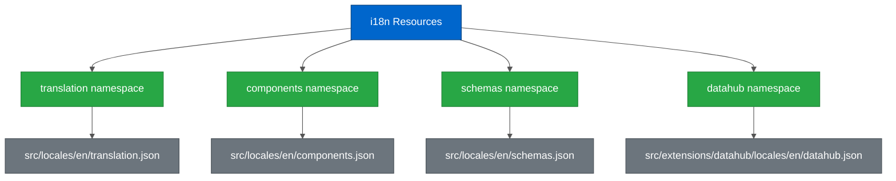

# Internationalization (i18n) Guide

---

## Table of Contents

- [Overview](#overview)
- [Configuration and Setup](#configuration-and-setup)
- [Namespace Structure](#namespace-structure)
- [Translation Key Conventions](#translation-key-conventions)
- [Using the useTranslation Hook](#using-the-usetranslation-hook)
- [Translation File Structure](#translation-file-structure)
- [Interpolation and Dynamic Values](#interpolation-and-dynamic-values)
- [Context for Conditional Translations](#context-for-conditional-translations)
- [Pluralization](#pluralization)
- [Accessibility with i18n](#accessibility-with-i18n)
- [Pseudo Translation for Testing](#pseudo-translation-for-testing)
- [Missing Key Detection](#missing-key-detection)
- [Best Practices](#best-practices)
- [Adding New Translations Workflow](#adding-new-translations-workflow)
- [Testing i18n](#testing-i18n)
- [Common Patterns](#common-patterns)
- [Glossary](#glossary)
- [Related Documentation](#related-documentation)

---

## Overview

HiveMQ Edge Frontend uses **i18next** and **react-i18next** for internationalization. All user-facing text must be translated using the `useTranslation` hook to ensure the application can support multiple languages and maintain consistent terminology.

### Key Technologies

- **i18next** (v23.11.3) - Core i18n framework
- **react-i18next** (v14.1.3) - React bindings for i18next
- **i18next-pseudo** - Pseudo-translation plugin for testing

### Design Principles

1. **All user-facing text must use translation keys** - No hardcoded strings
2. **Hierarchical key structure** - Organized by feature/component
3. **Namespace separation** - Core, components, schemas, and datahub
4. **Development-time validation** - Missing keys detected automatically

---

## Configuration and Setup

The i18n configuration is located at `/Users/nicolas/dev-projects/edge/hivemq-edge/hivemq-edge-frontend/src/config/i18n.config.ts`:

```typescript
import { initReactI18next } from 'react-i18next'
import i18n from 'i18next'
import Pseudo from 'i18next-pseudo'

import main_en from '@/locales/en/translation.json'
import component_en from '@/locales/en/components.json'
import schema_en from '@/locales/en/schemas.json'
import datahub_en from '@/extensions/datahub/locales/en/datahub.json'

const resources = {
  en: {
    translation: { ...main_en },
    components: { ...component_en },
    schemas: { ...schema_en },
    datahub: { ...datahub_en },
  },
}

i18n
  .use(
    new Pseudo({
      enabled: false,
      languageToPseudo: 'en',
      letterMultiplier: 4,
      repeatedLetters: ['B', 'o', 'a', 't'],
    })
  )
  .use(initReactI18next)
  .init({
    resources,
    ns: ['translation', 'components', 'schemas', 'datahub'],
    defaultNS: 'translation',
    lng: 'en',
    debug: import.meta.env.MODE === 'development',
    interpolation: {
      escapeValue: false, // react already safes from xss
    },
    postProcess: ['pseudo'],
    saveMissing: import.meta.env.MODE === 'development',
    missingKeyHandler: (lngs: readonly string[], ns: string, key: string) => {
      if (typeof window !== 'undefined') {
        // Store missing keys for Cypress tests to check
        window.__i18nextMissingKeys = window.__i18nextMissingKeys || []
        window.__i18nextMissingKeys.push({ key, ns, lngs })
      }
    },
  })

export default i18n
```

### Configuration Options

- **resources** - Translation files organized by namespace
- **ns** - Available namespaces (translation, components, schemas, datahub)
- **defaultNS** - Default namespace when none specified (`translation`)
- **lng** - Current language (currently English only)
- **debug** - Enables debug logging in development mode
- **saveMissing** - Triggers missing key handler in development
- **missingKeyHandler** - Custom handler that stores missing keys for testing

---

## Namespace Structure

The application uses **four namespaces** to organize translations:



**Color Legend:**
- **Blue** - Root resources
- **Green** - Namespaces
- **Gray** - Translation files

### Namespace Descriptions

| Namespace | File | Purpose |
|-----------|------|---------|
| **translation** | `src/locales/en/translation.json` | Main application translations (default namespace) |
| **components** | `src/locales/en/components.json` | Reusable component translations (pagination, search, tables) |
| **schemas** | `src/locales/en/schemas.json` | JSON Schema form field labels and descriptions |
| **datahub** | `src/extensions/datahub/locales/en/datahub.json` | DataHub extension-specific translations |

---

## Translation Key Conventions

### Hierarchical Structure

Translation keys follow a **hierarchical dot-notation** structure:

```
<feature>.<component>.<element>.<property>
```

### Examples from Codebase

```json
{
  "workspace": {
    "canvas": {
      "aria-label": "Edge Workspace",
      "toolbar": {
        "container": "Workspace toolbars",
        "search-filter": "Search & Filter toolbar",
        "controls": "Canvas toolbar"
      }
    },
    "controls": {
      "aria-label": "Workspace toolbars",
      "zoomIn": "Zoom in",
      "zoomOut": "Zoom out",
      "fitView": "Fit to the canvas"
    }
  }
}
```

### Naming Patterns

- **Feature-first** - Start with the feature/module name (`workspace`, `bridge`, `protocolAdapter`)
- **Component-second** - Then the component name (`canvas`, `controls`, `wizard`)
- **Element-third** - Then the specific element (`toolbar`, `button`, `modal`)
- **Property-last** - Finally the property (`aria-label`, `label`, `placeholder`, `helper`)

### Common Property Suffixes

| Suffix | Purpose | Example |
|--------|---------|---------|
| `.label` | Field label | `bridge.options.id.label` |
| `.placeholder` | Input placeholder | `bridge.options.id.placeholder` |
| `.helper` | Helper text | `bridge.options.id.helper` |
| `.error` | Error message | `bridge.options.id.error.required` |
| `.aria-label` | Accessibility label | `workspace.canvas.aria-label` |
| `.title` | Modal/section title | `bridge.drawer.title.create` |
| `.description` | Longer description | `bridge.description` |
| `.action` | Action button text | `bridge.action.add` |

---

## Using the useTranslation Hook

### Basic Usage

```typescript
import { useTranslation } from 'react-i18next'

const EdgeFlowPage: FC = () => {
  const { t } = useTranslation()

  return (
    <PageContainer
      title={t('welcome.title')}
      subtitle={t('welcome.description')}
    >
      {/* ... */}
    </PageContainer>
  )
}
```

### With Specific Namespace

```typescript
import { useTranslation } from 'react-i18next'

const EntityCreatableSelect: FC = () => {
  const { t } = useTranslation('components')

  return (
    <Select
      aria-label={t('EntityCreatableSelect.aria-label', { context: type })}
      placeholder={t('EntityCreatableSelect.placeholder')}
    />
  )
}
```

### Multiple Namespaces

```typescript
const { t } = useTranslation(['translation', 'components'])

// Access translation namespace (default)
t('workspace.canvas.aria-label')

// Access components namespace explicitly
t('components:pagination.ariaLabel')
```

---

## Translation File Structure

### Main Translation File (`translation.json`)

Located at `src/locales/en/translation.json`, this is the largest file containing all feature translations:

```json
{
  "branding": {
    "appName": "HiveMQ Edge",
    "company": "HiveMQ"
  },
  "action": {
    "logout": "Logout",
    "cancel": "Cancel",
    "close": "Close",
    "delete": "Delete",
    "save": "Save"
  },
  "navigation": {
    "gateway": {
      "title": "HiveMQ Edge",
      "routes": {
        "home": "Home",
        "workspace": "Workspace",
        "bridges": "MQTT Bridges"
      }
    }
  },
  "workspace": {
    "canvas": {
      "aria-label": "Edge Workspace"
    }
  }
}
```

### Components Translation File (`components.json`)

Located at `src/locales/en/components.json`, contains reusable component translations:

```json
{
  "shortcuts": {
    "modifier": {
      "META_MacOS": "⌘",
      "META_Others": "^"
    }
  },
  "pagination": {
    "ariaLabel": "Pagination Toolbar",
    "goFirstPage": "Go to the first page",
    "goPreviousPage": "Go to the previous page",
    "pageOf": "Page {{ page }} of {{ max }}",
    "perPage": "Items per page"
  },
  "SearchBar": {
    "aria-label": "Search Toolbar",
    "filter": {
      "placeholder": "Search for ..."
    }
  }
}
```

### Schema Translation File (`schemas.json`)

Located at `src/locales/en/schemas.json`, contains JSON Schema form labels:

```json
{
  "definitions": {
    "Instruction": {
      "description": "Each instruction describes how one of the properties of your destination data model is populated from the source",
      "destination": {
        "title": "Destination path"
      }
    }
  },
  "Combiner": {
    "id": {
      "title": "Unique id",
      "description": "The unique id of the data combiner"
    },
    "name": {
      "title": "Name",
      "description": "The user-facing name of the combiner"
    }
  }
}
```

### DataHub Translation File (`datahub.json`)

Located at `src/extensions/datahub/locales/en/datahub.json`, contains DataHub-specific translations.

---

## Interpolation and Dynamic Values

### Basic Interpolation

Use double curly braces `{{ }}` for variable interpolation:

```json
{
  "bridge": {
    "toast": {
      "view": {
        "noLongerExist": "The bridge {{id}} doesn't exist anymore"
      }
    }
  }
}
```

```typescript
t('bridge.toast.view.noLongerExist', { id: 'my-bridge-123' })
// Output: "The bridge my-bridge-123 doesn't exist anymore"
```

### Multiple Variables

```json
{
  "pagination": {
    "pageOf": "Page {{ page }} of {{ max }}"
  }
}
```

```typescript
t('pagination.pageOf', { page: 2, max: 10 })
// Output: "Page 2 of 10"
```

### Usage Example from Codebase

```typescript
const { t } = useTranslation('components')

return (
  <Text>
    {t('pagination.pageOf', {
      page: currentPage,
      max: totalPages
    })}
  </Text>
)
```

---

## Context for Conditional Translations

The `context` parameter allows different translations based on conditions:

### Example from Translation File

```json
{
  "topicFilter": {
    "toast": {
      "delete": {
        "description_success": "The Topic Filter has been deleted from the Edge",
        "description_error": "The Topic Filter could not be deleted"
      }
    }
  }
}
```

### Usage with Context

```typescript
const { t } = useTranslation()

// Success case
t('topicFilter.toast.delete.description', { context: 'success' })
// Output: "The Topic Filter has been deleted from the Edge"

// Error case
t('topicFilter.toast.delete.description', { context: 'error' })
// Output: "The Topic Filter could not be deleted"
```

### Real Example from Codebase

```typescript
// From useTopicFilterManager.ts
toast({
  description: t(`topicFilter.toast.${operation}.description`, {
    context: 'success'
  }),
})

toast({
  description: t(`topicFilter.toast.${operation}.description`, {
    context: 'error'
  }),
})
```

### Context with Type Variations

```json
{
  "protocolAdapter": {
    "mapping": {
      "manager": {
        "header_NORTHBOUND": "Manage Northbound mappings",
        "header_SOUTHBOUND": "Manage Southbound mappings",
        "header_COMBINING": "Manage Data combining mappings"
      }
    }
  }
}
```

```typescript
t('protocolAdapter.mapping.manager.header', { context: type })
// If type = 'NORTHBOUND' → "Manage Northbound mappings"
// If type = 'SOUTHBOUND' → "Manage Southbound mappings"
```

---

## Pluralization

i18next supports pluralization with `_zero`, `_one`, and `_other` suffixes:

### Translation Definition

```json
{
  "workspace": {
    "toolbar": {
      "selection": {
        "title_one": "1 entity selected",
        "title_other": "{{ count}} entities selected"
      }
    }
  }
}
```

### Usage

```typescript
const { t } = useTranslation()

// Automatically selects correct form based on count
t('workspace.toolbar.selection.title', { count: 1 })
// Output: "1 entity selected"

t('workspace.toolbar.selection.title', { count: 5 })
// Output: "5 entities selected"
```

### Zero Case

```json
{
  "bridge": {
    "subscription": {
      "description_zero": "Subscription",
      "description_one": "Subscription",
      "description_other": "Subscriptions"
    }
  }
}
```

---

## Accessibility with i18n

### ARIA Labels Must Use Translation Keys

**CRITICAL RULE:** All `aria-label` attributes must use translated strings, never hardcoded text.

#### ❌ Wrong

```typescript
<Select aria-label="Select an option" />
```

#### ✅ Correct

```typescript
<Select aria-label={t('component.selector.ariaLabel')} />
```

### Accessibility Translation Examples

```json
{
  "workspace": {
    "canvas": {
      "aria-label": "Edge Workspace"
    },
    "controls": {
      "aria-label": "Workspace toolbars",
      "zoomIn": "Zoom in",
      "zoomOut": "Zoom out"
    }
  }
}
```

```typescript
<div aria-label={t('workspace.canvas.aria-label')}>
  <button aria-label={t('workspace.controls.zoomIn')}>
    <ZoomInIcon />
  </button>
  <button aria-label={t('workspace.controls.zoomOut')}>
    <ZoomOutIcon />
  </button>
</div>
```

### Screen Reader Announcements

```typescript
// Announce dynamic changes to screen readers
const announcement = t('workspace.wizard.success.adapterCreated', {
  name: adapterName
})
```

---

## Pseudo Translation for Testing

The `i18next-pseudo` plugin helps identify untranslated strings by transforming text.

### Configuration

```typescript
new Pseudo({
  enabled: false,  // Set to true to enable
  languageToPseudo: 'en',
  letterMultiplier: 4,
  repeatedLetters: ['B', 'o', 'a', 't'],
})
```

### Example Output

When enabled:

```
Original: "Save Changes"
Pseudo:   "Boooaaaat Saaaveee Chaaangeees Boooaaaat"
```

### Use Cases

1. **Visual Testing** - Quickly identify hardcoded strings in UI
2. **Layout Testing** - Test UI with longer text (letterMultiplier: 4)
3. **QA Validation** - Ensure all text goes through i18n system

### Enabling Pseudo Translation

```typescript
// In i18n.config.ts
new Pseudo({
  enabled: import.meta.env.VITE_PSEUDO_I18N === 'true',
  // ...
})
```

---

## Missing Key Detection

### Development Mode Only

The `missingKeyHandler` is **only active in development mode**:

```typescript
saveMissing: import.meta.env.MODE === 'development',
missingKeyHandler: (lngs: readonly string[], ns: string, key: string) => {
  if (typeof window !== 'undefined') {
    window.__i18nextMissingKeys = window.__i18nextMissingKeys || []
    window.__i18nextMissingKeys.push({ key, ns, lngs })
  }
},
```

### How It Works

1. When a translation key is missing, the handler stores it in `window.__i18nextMissingKeys`
2. Cypress tests can access this array to detect missing translations
3. Console warnings appear in development mode

### Example Missing Key

```typescript
// If key doesn't exist in translation.json
t('workspace.nonexistent.key')
// Console: "key 'workspace.nonexistent.key' for languages 'en' won't get resolved"
```

### Cypress Integration

```typescript
it('should not have missing translation keys', () => {
  cy.window().then((win) => {
    expect(win.__i18nextMissingKeys || []).to.have.length(0)
  })
})
```

---

## Best Practices

### 1. Never Hardcode User-Facing Text

**❌ Wrong:**

```typescript
<Heading>Configure Workspace</Heading>
<Button>Save Changes</Button>
```

**✅ Correct:**

```typescript
<Heading>{t('workspace.configuration.header')}</Heading>
<Button>{t('action.save')}</Button>
```

### 2. Use Descriptive, Hierarchical Keys

**❌ Wrong:**

```typescript
t('button1')
t('text2')
t('saveBtn')
```

**✅ Correct:**

```typescript
t('workspace.wizard.action.save')
t('bridge.drawer.title.create')
t('protocolAdapter.action.add')
```

### 3. Always Provide ARIA Labels with i18n

**❌ Wrong:**

```typescript
<Select aria-label="Select protocol" />
```

**✅ Correct:**

```typescript
<Select aria-label={t('protocolAdapter.selector.ariaLabel')} />
```

### 4. Use Context for Variations

Instead of multiple similar keys, use context:

**❌ Wrong:**

```json
{
  "toast": {
    "deleteSuccess": "Successfully deleted",
    "deleteError": "Failed to delete",
    "updateSuccess": "Successfully updated",
    "updateError": "Failed to update"
  }
}
```

**✅ Correct:**

```json
{
  "toast": {
    "delete": {
      "description_success": "Successfully deleted",
      "description_error": "Failed to delete"
    },
    "update": {
      "description_success": "Successfully updated",
      "description_error": "Failed to update"
    }
  }
}
```

### 5. Keep Translation Keys Close to Usage

Organize keys by feature/module, not by UI element type:

**❌ Wrong:**

```json
{
  "buttons": {
    "workspaceSave": "Save",
    "bridgeCancel": "Cancel"
  }
}
```

**✅ Correct:**

```json
{
  "workspace": {
    "action": {
      "save": "Save"
    }
  },
  "bridge": {
    "action": {
      "cancel": "Cancel"
    }
  }
}
```

### 6. Reuse Common Actions

Create a shared `action` namespace for common terms:

```json
{
  "action": {
    "cancel": "Cancel",
    "close": "Close",
    "delete": "Delete",
    "save": "Save",
    "previous": "Previous",
    "next": "Next"
  }
}
```

### 7. Document Complex Keys

Add comments for keys with special formatting or context:

```json
{
  "bridge": {
    "connection": {
      "clientid": {
        "label": "Client Id Override",
        // Use '{#}' token for topic placeholder
        "helper": "You can use '{#}' to keep the original topic."
      }
    }
  }
}
```

---

## Adding New Translations Workflow

### Step 1: Identify the Feature/Module

Determine which namespace and feature the translation belongs to:

- Core feature → `translation.json`
- Reusable component → `components.json`
- Schema form → `schemas.json`
- DataHub feature → `datahub.json`

### Step 2: Create Hierarchical Key

Follow the pattern: `<feature>.<component>.<element>.<property>`

Example: `workspace.wizard.adapter.selectProtocol`

### Step 3: Add Translation Entry

```json
{
  "workspace": {
    "wizard": {
      "adapter": {
        "selectProtocol": "Select Protocol Type",
        "selectProtocolDescription": "Choose the protocol adapter you want to create",
        "configure": "Configure Adapter",
        "submit": "Create Adapter"
      }
    }
  }
}
```

### Step 4: Use in Component

```typescript
const { t } = useTranslation()

return (
  <Box>
    <Heading>{t('workspace.wizard.adapter.selectProtocol')}</Heading>
    <Text>{t('workspace.wizard.adapter.selectProtocolDescription')}</Text>
    <Button>{t('workspace.wizard.adapter.submit')}</Button>
  </Box>
)
```

### Step 5: Verify in Development

1. Run `pnpm dev`
2. Check browser console for missing key warnings
3. Test with pseudo-translation enabled (optional)

---

## Testing i18n

### Cypress Component Tests

Every component test should verify translations are working:

```typescript
describe('WorkspaceCanvas', () => {
  it('should render with correct translations', () => {
    cy.mountWithProviders(<WorkspaceCanvas />)

    cy.contains('Edge Workspace').should('exist')
    cy.getByTestId('zoom-in-btn')
      .should('have.attr', 'aria-label', 'Zoom in')
  })

  it('should not have missing translation keys', () => {
    cy.mountWithProviders(<WorkspaceCanvas />)

    cy.window().then((win) => {
      const missingKeys = win.__i18nextMissingKeys || []
      expect(missingKeys).to.have.length(0)
    })
  })
})
```

### Testing Interpolation

```typescript
it('should render with interpolated values', () => {
  cy.mountWithProviders(<BridgeToast id="test-bridge" />)

  cy.contains('The bridge test-bridge doesn\'t exist anymore')
    .should('exist')
})
```

### Testing Context

```typescript
it('should render success message', () => {
  cy.mountWithProviders(<Toast status="success" />)
  cy.contains('Successfully deleted').should('exist')
})

it('should render error message', () => {
  cy.mountWithProviders(<Toast status="error" />)
  cy.contains('Failed to delete').should('exist')
})
```

### Testing Pluralization

```typescript
it('should show singular form', () => {
  cy.mountWithProviders(<SelectionToolbar count={1} />)
  cy.contains('1 entity selected').should('exist')
})

it('should show plural form', () => {
  cy.mountWithProviders(<SelectionToolbar count={5} />)
  cy.contains('5 entities selected').should('exist')
})
```

---

## Common Patterns

### Pattern 1: Button Actions

```typescript
<Button variant="primary" type="submit">
  {t('action.save')}
</Button>
<Button variant="outline" onClick={onCancel}>
  {t('action.cancel')}
</Button>
```

### Pattern 2: Modal Headers

```typescript
<ModalHeader>
  {t('bridge.drawer.title.create')}
</ModalHeader>
```

### Pattern 3: Form Labels and Helpers

```typescript
<FormControl>
  <FormLabel>{t('bridge.options.id.label')}</FormLabel>
  <Input placeholder={t('bridge.options.id.placeholder')} />
  <FormHelperText>{t('bridge.options.id.helper')}</FormHelperText>
</FormControl>
```

### Pattern 4: Error Messages

```typescript
<FormErrorMessage>
  {t('bridge.options.id.error.required')}
</FormErrorMessage>
```

### Pattern 5: Toast Notifications

```typescript
toast({
  title: t('bridge.toast.create.title'),
  description: t('bridge.toast.create.description', { context: 'success' }),
  status: 'success',
})
```

### Pattern 6: Dynamic Context-Based Text

```typescript
const { t } = useTranslation()
const deviceType = 'ADAPTER_NODE'

return (
  <Heading>
    {t('workspace.property.header', { context: deviceType })}
  </Heading>
)
// Output: "Adapter Overview"
```

### Pattern 7: Reusing Common Terms

```typescript
// Don't duplicate common actions
<Button>{t('action.save')}</Button>
<Button>{t('action.cancel')}</Button>
<Button>{t('action.delete')}</Button>
```

### Pattern 8: Nested Translation References

```json
{
  "protocolAdapter": {
    "toast": {
      "status": {
        "device": "the device",
        "device_BRIDGE": "the bridge",
        "device_ADAPTER": "the adapter",
        "description_STOP": "We've successfully stopped $t(protocolAdapter.toast.status.device, {'context': '{{device}}' })"
      }
    }
  }
}
```

---

## Glossary

| Term | Definition |
|------|------------|
| **i18next** | Internationalization framework for JavaScript |
| **react-i18next** | React bindings for i18next providing hooks and components |
| **Namespace** | Logical grouping of translations (translation, components, schemas, datahub) |
| **Translation Key** | Hierarchical dot-notation path to a translation string |
| **Interpolation** | Inserting dynamic values into translation strings using `{{ variable }}` |
| **Context** | Conditional translation variations based on a context value (for example, success/error) |
| **Pluralization** | Different translation forms based on count (`_zero`, `_one`, `_other`) |
| **Pseudo Translation** | Testing technique that transforms text to identify untranslated strings |
| **Missing Key Handler** | Callback invoked when a translation key doesn't exist |
| **Default Namespace** | Namespace used when none is explicitly specified (`translation`) |
| **useTranslation Hook** | React hook providing access to translation function `t` |

---

## Related Documentation

**Guides:**
- [Testing Guide](./TESTING_GUIDE.md)
- [Cypress Guide](./CYPRESS_GUIDE.md)
- [Design Guide](./DESIGN_GUIDE.md)

**Architecture:**
- [DataHub Architecture](../architecture/DATAHUB_ARCHITECTURE.md)
- [Workspace Architecture](../architecture/WORKSPACE_ARCHITECTURE.md)

**Technical:**
- [Technical Stack](../technical/TECHNICAL_STACK.md)

**External Resources:**
- [i18next Documentation](https://www.i18next.com/)
- [react-i18next Documentation](https://react.i18next.com/)
- [i18next-pseudo Plugin](https://github.com/MattBoatman/i18next-pseudo)

---
