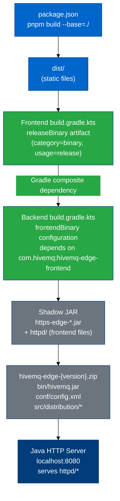

# Build and Deployment

---

## Table of Contents

- [Local Development](#local-development)
- [Building Locally](#building-locally)
- [CI Pipeline (GitHub Actions)](#ci-pipeline-github-actions)
- [Production Deployment](#production-deployment)
  - [How the Frontend Gets Into the Product](#how-the-frontend-gets-into-the-product)
  - [Distribution Artifact](#distribution-artifact)
  - [Jenkins Integration](#jenkins-integration)
- [Staging / UAT (Ephemeral Environments)](#staging--uat-ephemeral-environments)
- [Environment Variables](#environment-variables)

---

## Local Development

```bash
# Install dependencies (first time or after package.json changes)
pnpm install

# Start dev server
pnpm dev
```

The dev server starts on **port 3000**. API calls to `/api/*` are proxied to `http://127.0.0.1:8080`, where the Java backend must be running.

**Hot Module Replacement (HMR)** is enabled — file saves trigger instant in-browser updates without a full page reload.

**Dev server configuration:** `vite.config.ts`

### Running Tests Locally

```bash
# Component tests (interactive, browser UI)
pnpm cypress:open:component

# E2E tests (interactive, browser UI)
pnpm cypress:open:e2e

# Component tests (headless)
pnpm cypress:run:component

# E2E tests (headless)
pnpm cypress:run:e2e

# Run a specific test file
pnpm cypress:run:component --spec "src/path/to/Component.spec.cy.tsx"
pnpm cypress:run:e2e --spec "cypress/e2e/path/to/test.spec.cy.ts"

# Unit tests (watch mode)
pnpm test

# Unit tests with coverage
pnpm test:coverage
```

**See:** [Testing Architecture](../architecture/TESTING_ARCHITECTURE.md) for the full testing strategy.

### Code Quality Checks

```bash
pnpm lint:eslint       # ESLint (max 0 warnings)
pnpm lint:prettier     # Prettier formatting check
pnpm lint:all          # Both (used in CI)
pnpm lint:eslint:fix   # ESLint with auto-fix
pnpm lint:prettier:write  # Prettier with auto-format
```

---

## Building Locally

```bash
# Full build: TypeScript type check + Vite bundle
pnpm build

# TypeScript check only (no bundle)
pnpm build:tsc

# Analyse bundle size
pnpm bundle:size

# Preview the production build
pnpm preview
```

**Output:** `dist/` directory containing:
- Bundled and minified JavaScript (ESNext, tree-shaken)
- CSS files
- Static assets (images, fonts)
- `index.html` entry point
- Source maps for debugging

**Memory:** The default local build uses 4 GB (`--max-old-space-size=4096`). The CI instrumented build allocates 8 GB due to Istanbul overhead.

**Base path:** The local `pnpm build` uses `--base=/` (assets referenced from root). The Gradle production build overrides this to `--base=./` (see [Production Deployment](#production-deployment)).

---

## CI Pipeline (GitHub Actions)

The CI pipeline runs on every PR and push to `master`. It is defined in:

- **`.github/workflows/check.yml`** — Monorepo orchestrator (change detection, parallelism)
- **`.github/workflows/check-frontend.yml`** — Frontend-specific jobs

**Jobs run in this order:**

```
Lint → Unit Tests ──────────────────────────────────────→ SonarQube
       Build Instrumented → Cypress Matrix (9 parallel) ↗
       Build Production → Lighthouse
       Percy Prepare → Cypress Matrix → Percy Finalize
```

The 9 parallel Cypress jobs cover: E2E-Adapters, E2E-Workspace, E2E-Core, Components, Extensions, Workspace, Mappings, Pulse, Modules.

**See:** [Testing Architecture](../architecture/TESTING_ARCHITECTURE.md) — "CI/CD Pipeline" section — for the complete breakdown of all 9 jobs, artifact flow, SonarQube coverage merge, and Percy visual testing integration.

---

## Production Deployment

### How the Frontend Gets Into the Product

The frontend is **not deployed independently**. It is bundled into the Java backend's executable JAR and served by the backend's HTTP server at `http://localhost:8080`.

The integration is managed by Gradle composite builds. Here is how the pieces connect:



**Step-by-step:**

1. **`hivemq-edge-frontend/build.gradle.kts`** runs `pnpm build --base=./` (via `gradle-node-plugin`), producing `dist/`. It registers `dist/` as a Gradle artifact with attributes `category=binary, usage=release`:
   ```kotlin
   val buildFrontend by tasks.registering(PnpmTask::class) {
     pnpmCommand.set(listOf("build", "--base=./"))
     outputs.dir("${project.projectDir}/dist")
   }
   artifacts {
     add(releaseBinary.name, buildFrontend)
   }
   ```

2. **`hivemq-edge/build.gradle.kts`** declares a dependency on that artifact:
   ```kotlin
   dependencies {
     frontend("com.hivemq:hivemq-edge-frontend")
   }
   ```
   The `frontendBinary` configuration resolves this to the `dist/` output via Gradle's composite build mechanism.

3. **The shadow JAR task** includes the frontend files into the `httpd/` path inside the fat JAR:
   ```kotlin
   tasks.shadowJar {
     mergeServiceFiles()
     from(frontendBinary) { into("httpd") }
   }
   ```

4. **The Java HTTP server** (Jersey + JDK HTTP server) serves files from `httpd/` at the root of `http://localhost:8080`. The `--base=./` flag in the frontend build ensures asset URLs are relative, which is required for this embedded serving scenario.

### Distribution Artifact

The `hivemqZip` Gradle task creates the release archive:

```
hivemq-edge-{version}.zip
└── hivemq-edge-{version}/
    ├── bin/
    │   └── hivemq.jar          ← Shadow JAR (backend + frontend embedded in httpd/)
    ├── conf/
    │   └── config.xml          ← Default backend configuration
    └── [src/distribution/*]    ← Additional distribution files
```

The version is taken from `gradle.properties` in the backend project. `VITE_HIVEMQ_EDGE_VERSION` is injected into the Vite build from this same version property, so the frontend's version indicator matches the distribution package version.

### Jenkins Integration

Jenkins orchestrates the full composite build for releases. The `CompositeJenkinsfile` at the monorepo root delegates to the `hivemq-edge-composite` Jenkins job, which runs the full Gradle build (`./gradlew hivemqZip`) across all subprojects.

**Jenkins artifact build:** [https://jenkins.cicd.pd.hmq.dev/job/hivemq-edge-commercial-release/job/artifacts/](https://jenkins.cicd.pd.hmq.dev/job/hivemq-edge-commercial-release/job/artifacts/)
_(Access requires HiveMQ VPN/Okta authentication — not accessible to external contributors)_

The Jenkins configuration is maintained outside this repository and outside the frontend team's direct control.

**Access and ownership:** See [External Services — Jenkins](./EXTERNAL_SERVICES.md#jenkins) for dashboard access status and login method.

---

## Staging / UAT (Ephemeral Environments)

Staging environments ("ephemeral environments") are used to deploy a running HiveMQ Edge instance for UAT testing and frontend QA against a real backend. This process is partially automated via Jenkins, Proxmox, and Terraform, but is currently in development and not fully self-service.

**Stakeholders:** Frontend team (for testing frontend changes against a real backend), QA team (Jochen and hardware test setup).

### Process Outline

The current process has four stages:

#### 1. Build the Release Artifact (Jenkins)

Jenkins builds the full `hivemq-edge-{version}.zip` distribution artifact from the `hivemq-edge-composite` job. Relevant configs and licenses are packaged into the ZIP.

**Trigger:** Currently manual (under discussion — options include branch naming conventions or PR labels).

#### 2. Create a VM Template (Proxmox)

A template VM is created in Proxmox with a custom cloud-init user script that:
- Downloads the specific build artifact from Jenkins
- Follows the HiveMQ Edge setup instructions to start the broker

#### 3. Provision the VM (Terraform)

Terraform (using the [Telmate Proxmox provider](https://github.com/Telmate/terraform-provider-proxmox)) creates a VM from the template. The VM IP is available from Terraform output attributes.

Network connectivity between the Proxmox instance and the Jenkins/CI infrastructure uses **Tailscale** as a subnet router.

#### 4. Communicate the Instance URL

The running instance URL (derived from the Terraform IP attribute) is communicated back to the requester so frontend testing can begin.

### Current Status

This process is **under development** and not yet fully automated. The infrastructure design is documented but full end-to-end automation is pending. Frontend developers needing a staging instance should contact the team.

---

## Environment Variables

### Build-time Variables (Vite)

| Variable | Set By | Effect |
|----------|--------|--------|
| `VITE_HIVEMQ_EDGE_VERSION` | Gradle (`project.version`) | Version string shown in the UI |
| `VITE_COVERAGE` | CI pipeline | `true` enables Istanbul instrumentation for coverage collection |

**Note:** Only variables prefixed with `VITE_` are embedded in the Vite bundle and accessible in client-side code. All other environment variables are ignored at build time.

> [!CAUTION]
> `VITE_HIVEMQ_EDGE_VERSION` is only injected by Gradle during the production build. The CI pipeline runs `pnpm build` directly without this variable, so the version indicator in CI preview builds will show `undefined`. This is expected for CI — the correct version only appears in artifacts built via Gradle.

### CI-only Variables

| Variable | Used In | Purpose |
|------------------------------------------------|------------------------------------------------------|----------------------------------------------|
| `SONAR_TOKEN` | `check-frontend.yml` | SonarCloud authentication |
| `PERCY_TOKEN` | `check-frontend.yml` | Percy visual regression |
| `SNYK_TOKEN` | `snyk-pr.yml`, `snyk-push.yml`, `snyk-release.yml` | Snyk security scanning |
| `NODE_OPTIONS="--max_old_space_size=8192"` | Instrumented build | 8 GB memory for Istanbul build |

### Runtime Variables (Backend)

The frontend has no runtime environment variables — it is a fully static SPA. All runtime configuration (API base URL, auth tokens) is handled via the browser session or injected at page load by the backend.
