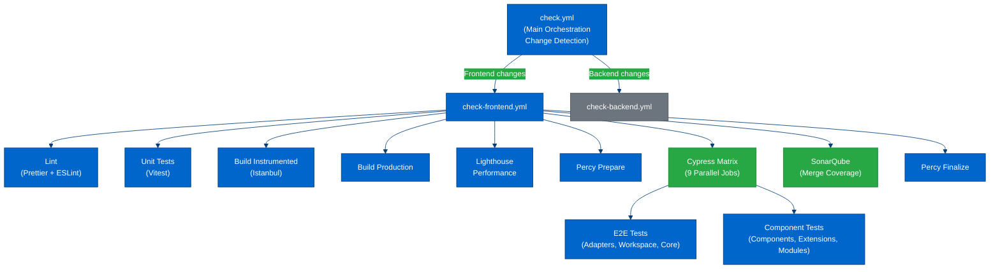

# HiveMQ Edge Frontend - Technical Stack

**Last Updated:** 2026-02-13
**Version:** 0.0.31

---

## Overview

The HiveMQ Edge Frontend is a modern React-based single-page application built with TypeScript, Vite, and a comprehensive testing infrastructure. This document provides a complete technical reference for developers.

---

## Core Toolchain

### Build System

**Vite 7.1.11** - Modern build tool and development server

- **Development Server:** Port 3000 with Hot Module Replacement (HMR)
- **API Proxy:** `/api` routes proxied to `http://127.0.0.1:8080`
- **Features:**
  - Fast ES module-based dev server
  - Optimized production builds
  - Source map generation enabled
  - Istanbul instrumentation for code coverage
  - Sentry integration for error tracking via `@sentry/vite-plugin`

**Configuration:** `vite.config.ts`

### Language & Runtime

**TypeScript 5.7.3** - Strict type checking enabled

- **Target:** ESNext
- **Module System:** ESNext with bundler resolution
- **JSX:** `react-jsx` (automatic runtime)
- **Strict Mode:** Enabled with comprehensive linting rules
- **Path Aliases:**
  - `@/` → `src/`
  - `@datahub/` → `src/extensions/datahub/`
  - `@cypr/` → `cypress/`

**Configuration:** `tsconfig.json`, `tsconfig.app.json`, `tsconfig.node.json`

### Package Manager

**pnpm 10** - Required (enforced via `engines` field)
**Node.js 22** - Required runtime version

**Rationale:** pnpm provides:
- Fast, disk-efficient package management
- Strict dependency resolution
- Monorepo support

---

## Main Dependencies

### UI Framework & Components

#### Core React
- **react 18.3.1** - UI library
- **react-dom 18.3.1** - DOM renderer

#### Component Library
- **@chakra-ui/react 2.8.2** - Component library with custom theming
- **@chakra-ui/icons 2.1.1** - Icon components
- **@chakra-ui/theme-tools 2.2.9** - Theme customization utilities
- **@emotion/react 11.11.4** - CSS-in-JS (required by Chakra UI)
- **@emotion/styled 11.11.0** - Styled components
- **framer-motion 10.12.21** - Animation library (Chakra UI dependency)
- **chakra-react-select 4.7.6** - Enhanced select components with Chakra UI styling

**Custom Theme:** `src/modules/Theme/themeHiveMQ.ts`

**Design Patterns:**
- Button variants: `primary`, `outline`, `ghost`, `danger`
- Custom color schemes
- Responsive breakpoints

### State Management

#### Server State
- **@tanstack/react-query 5.85.5** - Async state management, caching, synchronization
- **@tanstack/react-query-devtools 5.85.5** - DevTools for debugging queries

#### Client State
- **zustand 4.4.7** - Lightweight state management
  - Used for: Workspace state, DataHub drafts, UI state

#### Form State
- **react-hook-form 7.43.9** - Performant form state management with validation

### Routing

- **react-router-dom 6.30.3** - Declarative routing
  - File-based routing structure in `src/modules/App/`
  - Nested routes for DataHub extension

### Data Visualization

#### Canvas & Node Graphs
- **@xyflow/react 12.8.4** (React Flow) - Node-based graph editor for workspace topology
- **@dagrejs/dagre 1.1.5** - Directed graph layout algorithms
- **elkjs 0.9.1** - Eclipse Layout Kernel for automatic layout
- **webcola 3.4.0** - Constraint-based layout

#### Charts & Diagrams
- **@nivo/bar 0.88.0** - Bar charts
- **@nivo/chord 0.88.0** - Chord diagrams
- **@nivo/line 0.88.0** - Line charts
- **@nivo/sankey 0.88.0** - Sankey diagrams
- **@nivo/sunburst 0.88.0** - Sunburst charts
- **@nivo/tree 0.88.0** - Tree diagrams
- **recharts 2.12.7** - Additional charting library
- **d3-array 3.2.4** - Data manipulation utilities
- **d3-hierarchy 3.1.2** - Hierarchical data structures
- **d3-scale-chromatic 3.1.0** - Color scales
- **d3-shape 3.2.0** - Shape generators
- **mermaid 11.12.2** - Diagram generation from text

### Forms & Schema Validation

#### JSON Schema Forms
- **@rjsf/core 5.24.13** - JSON Schema form generator (core)
- **@rjsf/chakra-ui 5.24.13** - Chakra UI widgets for RJSF
- **@rjsf/utils 5.24.13** - Utilities for RJSF
- **@rjsf/validator-ajv8 5.24.13** - JSON Schema validation with AJV8
- **@jsonhero/schema-infer 0.1.5** - Schema inference

**Usage:** Protocol adapter configuration, bridge setup, DataHub policy forms

### Rich Text Editing

#### Tiptap (Headless Editor)
- **@tiptap/react 2.9.1** - React integration
- **@tiptap/extension-document 2.9.1** - Document node
- **@tiptap/extension-paragraph 2.9.1** - Paragraph node
- **@tiptap/extension-text 2.9.1** - Text node
- **@tiptap/extension-mention 2.9.1** - Mention functionality
- **@tiptap/extension-placeholder 2.9.1** - Placeholder text
- **@tiptap/suggestion 2.9.1** - Suggestion dropdown
- **@tiptap/pm 2.9.1** - ProseMirror integration

### Code Editing

- **monaco-editor 0.55.1** - VS Code editor component
- **@monaco-editor/react 4.7.0** - React wrapper for Monaco

**Usage:** Code snippets, JSON editing in DataHub policies

### Protocols & Communication

#### HTTP Client
- **axios 1.13.5** - Promise-based HTTP client
  - API communication with HiveMQ Edge backend
  - Interceptors for auth, error handling

#### MQTT
- **mqtt 5.10.1** - MQTT protocol implementation
- **mqtt-match 3.0.0** - MQTT topic matching utilities

#### Protocol Buffers
- **protobufjs 7.2.6** - Protocol buffers support

### Internationalization (i18n)

- **i18next 23.11.3** - i18n framework
- **react-i18next 14.1.3** - React bindings for i18next

**Translation Files:**
- `src/locales/en/translation.json` - Main translations
- `src/extensions/datahub/locales/en/datahub.json` - DataHub-specific translations

**Configuration:** `src/config/i18n.config.ts`

### Utilities

#### Date & Time
- **luxon 3.3.0** - DateTime handling (Moment.js successor)

#### IDs & Data
- **uuid 9.0.1** - UUID generation
- **ts-pattern 5.3.1** - Pattern matching for TypeScript
- **immutable-json-patch 6.0.2** - JSON patch operations

#### React Hooks
- **@uidotdev/usehooks 2.4.1** - Custom React hooks collection
- **react-hotkeys-hook 4.5.0** - Keyboard shortcuts
- **react-dropzone 14.2.3** - File upload handling

#### UI Utilities
- **react-icons 5.3.0** - Icon library (Lucide, React Icons, etc.)
- **@atlaskit/pragmatic-drag-and-drop 1.3.0** - Drag and drop primitives

#### Data Handling
- **xlsx 0.20.3** (SheetJS) - Spreadsheet reading/writing
- **@tanstack/react-table 8.9.3** - Headless table utilities
- **react-accessible-treeview 2.9.1** - Accessible tree view component

### Error Tracking & Monitoring

- **@sentry/react 8.27.0** - Error tracking and performance monitoring
- **@sentry/vite-plugin 2.22.3** - Sentry integration for Vite builds

**Configuration:** Environment-based Sentry DSN, release tracking

---

## Development Dependencies

### Testing Framework

#### Cypress (Component & E2E Testing)
- **cypress 15.8.2** - Test runner
- **@cypress/code-coverage 3.13.11** - Code coverage reporting
- **cypress-axe 1.7.0** - Accessibility testing
- **axe-core 4.10.3** - Accessibility rules engine
- **cypress-real-events 1.15.0** - Real user event simulation
- **@4tw/cypress-drag-drop 2.3.1** - Drag and drop testing
- **cypress-each 1.14.1** - Parameterized testing
- **@cypress/grep 5.0.0** - Test filtering by tags
- **cypress-terminal-report 7.3.3** - Terminal logging
- **cypress-multi-reporters 2.0.5** - Multiple test reporters

**Configuration:** `cypress.config.ts`

**Custom Commands:**
- `cy.mountWithProviders()` - Mount with React providers
- `cy.getByTestId()` - Select by data-testid
- `cy.checkAccessibility()` - Run axe accessibility checks
- `cy.injectAxe()` - Inject axe-core

#### Vitest (Unit Testing)
- **vitest 3.2.4** - Fast unit test framework
- **@vitest/ui 3.2.4** - Test UI
- **@vitest/coverage-v8 3.2.4** - V8 coverage provider
- **@vitest/coverage-istanbul 3.2.4** - Istanbul coverage provider
- **jsdom 24.0.0** - DOM implementation for Node.js

**Configuration:** `vitest.config.ts`

#### Testing Library
- **@testing-library/react 16.2.0** - React testing utilities
- **@testing-library/jest-dom 6.6.4** - Custom matchers

#### API Mocking
- **msw 2.7.0** - Mock Service Worker for API mocking
- **@mswjs/data 0.16.2** - Data modeling for MSW

**Handlers Location:** `src/api/hooks/__handlers__/`

#### Visual Regression Testing
- **@percy/cli 1.28.5** - Percy command-line interface
- **@percy/cypress 3.1.7** - Percy integration for Cypress

### Linting & Code Quality

#### ESLint (9.26.0) - Flat Config
- **@eslint/js 9.26.0** - ESLint JavaScript rules
- **typescript-eslint 8.32.1** - TypeScript rules and parser
- **eslint-plugin-react 7.37.5** - React-specific rules
- **eslint-plugin-react-hooks 5.2.0** - Hooks rules
- **eslint-plugin-react-refresh 0.4.20** - React Refresh rules
- **eslint-plugin-cypress 5.2.1** - Cypress-specific rules
- **eslint-plugin-sonarjs 3.0.2** - Code quality and bug detection
- **@tanstack/eslint-plugin-query 5.74.7** - React Query rules
- **eslint-config-prettier 10.1.8** - Disable conflicting Prettier rules

**Configuration:** `eslint.config.mjs` (flat config format)

**Key Rules:**
- Strict TypeScript checking
- React hooks validation
- Consistent type imports: `import type { ... }`
- JSX curly brace presence: `props="never"`, `children="never"`
- No unnecessary Cypress waits

#### Prettier (3.5.3) - Code Formatting
- **Configuration:** `.prettierrc.cjs`
- **Settings:**
  - Single quotes
  - No semicolons
  - 120 character line width
  - 2-space indentation
  - ES5 trailing commas

#### Stylelint (16.14.1) - CSS Linting
- **stylelint-config-standard 37.0.0** - Standard CSS rules
- **stylelint-config-standard-scss 14.0.0** - SCSS rules

**Usage:** Lint CSS files in `./src/**/*.css`

### Code Generation

#### OpenAPI Client Generation
- **openapi-typescript-codegen 0.25.0** - Generate TypeScript client from OpenAPI specs

**Command:** `pnpm dev:openAPI`

**Generated Output:** `src/api/__generated__/`

**Source:** `../hivemq-edge-openapi/dist/bundle.yaml`

#### Chakra UI Types
- **@chakra-ui/cli 2.4.1** - Generate Chakra UI theme types

**Command:** `pnpm dev:chakra:types`

### Coverage & Reporting

#### Coverage Tools
- **nyc 17.1.0** - Istanbul command-line interface
- **@istanbuljs/nyc-config-typescript 1.0.2** - TypeScript configuration for NYC
- **vite-plugin-istanbul 7.2.1** - Istanbul plugin for Vite

#### Test Reporters
- **mocha-junit-reporter 2.2.1** - JUnit XML reports for CI
- **mochawesome 7.1.4** - HTML/JSON test reports
- **mochawesome-merge 5.0.0** - Merge multiple mochawesome reports
- **mochawesome-report-generator 6.3.2** - Generate HTML from JSON

**Custom Scripts:** `tools/run-tests.cjs`, `tools/merge-cypress-coverage.cjs`, `tools/merge-all-coverage.cjs`

### Build & Utility Tools

- **@vitejs/plugin-react 4.7.0** - Vite plugin for React Fast Refresh
- **sass 1.70.0** - CSS preprocessor
- **copyfiles 2.4.1** - Cross-platform file copying
- **fs-extra 11.3.3** - Enhanced file system operations
- **commander 13.1.0** - CLI framework for custom scripts
- **globals 16.1.0** - Global variable definitions

---

## Scripts Reference

### Development

```bash
pnpm dev                    # Start Vite dev server (port 3000, proxy to :8080)
pnpm preview                # Preview production build
pnpm dev:openAPI            # Generate API client from OpenAPI spec
pnpm dev:chakra:types       # Generate Chakra UI theme types
```

### Building

```bash
pnpm build                  # TypeScript check + Vite build
pnpm build:tsc              # TypeScript check only (no Vite build)
pnpm bundle:size            # Analyze bundle size with vite-bundle-visualizer
```

**Build Output:** `dist/` directory

**Build Process:**
1. TypeScript compilation check (`tsc`)
2. Vite build (bundling, optimization, tree-shaking)
3. Source map generation
4. Sentry release artifacts upload

### Linting

```bash
pnpm lint:eslint            # Run ESLint (max 0 warnings allowed)
pnpm lint:eslint:fix        # Run ESLint with auto-fix
pnpm lint:prettier          # Check Prettier formatting
pnpm lint:prettier:write    # Fix Prettier formatting
pnpm lint:stylelint         # Lint CSS files
pnpm lint:all               # Run ESLint + Prettier checks (CI)
```

**CI Usage:** `pnpm lint:all` is used in CI pipelines to enforce code quality.

### Testing - Cypress

#### Interactive Mode (Development)

```bash
pnpm cypress:open           # Open Cypress launcher
pnpm cypress:open:component # Open component tests (Chrome)
pnpm cypress:open:e2e       # Open E2E tests (Chrome)
```

#### Headless Mode (CI)

```bash
pnpm cypress:run            # Run all tests (E2E + component)
pnpm cypress:run:component  # Run component tests only
pnpm cypress:run:e2e        # Run E2E tests only (quiet mode)
```

**Run Specific Test File:**

```bash
pnpm cypress:run:component --spec "src/path/to/Component.spec.cy.tsx"
pnpm cypress:run:e2e --spec "cypress/e2e/path/to/test.spec.cy.ts"
```

#### Coverage

```bash
pnpm cypress:coverage                    # Run Cypress with coverage
pnpm cypress:coverage:parallel           # Parallel execution
pnpm cypress:coverage:verbose            # Verbose output
pnpm cypress:coverage:parallel:verbose   # Both flags

pnpm coverage:all                        # All tests with coverage
pnpm coverage:all:parallel               # Parallel execution
pnpm coverage:all:verbose                # Verbose output
pnpm coverage:all:parallel:verbose       # Both flags

pnpm coverage:merge:cypress              # Merge Cypress coverage reports
pnpm coverage:merge:all                  # Merge all coverage reports
```

**Custom Scripts:** `tools/run-tests.cjs` orchestrates test execution and coverage collection.

#### Visual Regression (Percy)

```bash
pnpm cypress:percy          # Run tests with Percy visual testing
```

**Process:**
1. Runs E2E tests with Percy enabled
2. Runs component tests with Percy enabled
3. Finalizes Percy build

### Testing - Vitest (Unit Tests)

```bash
pnpm test                   # Run Vitest in watch mode
pnpm test:coverage          # Run with coverage report
pnpm test:ui                # Run with Vitest UI
```

**Coverage Output:** `coverage-vitest/` directory

---

## CI/CD Pipeline & Deployment

### Repository Structure

The frontend is part of a **monorepo** located at `../` (parent directory). The repository includes:
- `hivemq-edge/` - Backend Java application
- `hivemq-edge-frontend/` - Frontend React application (this codebase)
- `hivemq-edge-openapi/` - OpenAPI specifications
- `.github/workflows/` - Shared GitHub Actions workflows

### GitHub Actions Workflows

#### Main Orchestration: `check.yml`

**Trigger:** Push to main/master, pull requests, manual dispatch

**Strategy:** Path-based change detection
- Only runs frontend checks when `hivemq-edge-frontend/**` or `.github/**` changes
- Parallel execution for frontend, backend, and OpenAPI checks
- Concurrency control: cancels in-progress runs for same PR/ref

**Jobs:**
1. **check-for-changes** - Detects which parts of monorepo changed
2. **check-frontend** - Calls `check-frontend.yml` (conditional)
3. **check-backend** - Calls `check-backend.yml` (conditional)
4. **check-openapi** - Calls `check-openapi.yml` (conditional)
5. **check** - Final status aggregation

**Frontend Continue-on-Error:** Frontend checks continue on error to handle known blocks (Percy tokens, SonarCloud gates)

---

#### Frontend Testing Pipeline: `check-frontend.yml`

**Working Directory:** `./hivemq-edge-frontend/`

**Secrets Required:**
- `SONAR_TOKEN` - SonarQube/SonarCloud authentication
- `PERCY_TOKEN` - Percy visual regression testing

##### Job 1: Linting
```yaml
- Run Prettier: pnpm lint:prettier
- Run ESLint: pnpm lint:eslint
```

**Quality Gate:** Max 0 warnings allowed in ESLint

##### Job 2: Unit Tests
```yaml
- Run Vitest with coverage: pnpm test:coverage
- Upload coverage artifact: lcov-vitest
```

**Output:** `coverage-vitest/lcov.info`

##### Job 3: Build Instrumented (for E2E coverage)
```yaml
- Build with Istanbul instrumentation
- Environment: VITE_COVERAGE=true
- Memory: 8GB allocated (NODE_OPTIONS="--max_old_space_size=8192")
- Upload artifact: application-instrumented
```

**Note:** 8GB memory required due to TypeScript compiler + Istanbul instrumentation overhead

##### Job 4: Build Production (clean)
```yaml
- Build without instrumentation: pnpm run build --base=/
- Upload artifact: application-clean
```

**Output:** Clean production build in `dist/`

##### Job 5: Lighthouse Performance
```yaml
- Downloads: application-clean artifact
- Runs Lighthouse audits
- Configuration: .lighthouserc.cjs
- Uploads results to temporary public storage
```

**Metrics Audited:**
- Performance score
- Accessibility
- Best practices
- SEO

##### Job 6: Percy Prepare
```yaml
- Generates parallel execution nonce
- Coordinates parallel Percy builds
```

##### Job 7: Cypress Matrix (9 parallel jobs)

**Strategy:** Split tests across 9 parallel runners for speed

**Matrix Configuration:**

| Job Name | Type | Spec Pattern | Description |
|----------|------|--------------|-------------|
| E2E-Adapters | E2E | `./cypress/e2e/adapters/**/*` | Adapter configuration tests |
| E2E-Workspace | E2E | `./cypress/e2e/workspace/**/*` | Workspace canvas tests |
| E2E-Core | E2E | `./cypress/e2e/!(adapters\|workspace)/**/*` | Other E2E tests |
| Components | Component | `./src/components/**/*` | Shared components |
| Extensions | Component | `./src/extensions/**/*` | DataHub extension |
| Workspace | Component | `./src/modules/Workspace/**/*` | Workspace module |
| Mappings | Component | `./src/modules/Mappings/**/*` | Mappings module |
| Pulse | Component | `./src/modules/Pulse/**/*` | Pulse module |
| Modules | Component | `./src/modules/!(Workspace\|Mappings\|Pulse)/**/*` | Other modules |

**Execution:**
```yaml
- Downloads: application-instrumented artifact
- Starts preview server: pnpm preview --port 3000
- Runs Cypress with Percy: npx percy exec --parallel
- Environment: PERCY_PARALLEL_NONCE, PERCY_TOKEN
```

**Artifacts Uploaded:**
- **On Failure:** `cypress-{target}-videos` - Video recordings of failing tests
- **Always:** `lcov-cypress-{target}` - Coverage for each test group

**Continue-on-Error:** True (allows all matrix jobs to complete even if some fail)

##### Job 8: SonarQube Analysis
```yaml
- Depends on: cypress_matrix, unit_tests
- Runs even if: some tests failed (success() || failure())
- Downloads all LCOV artifacts (lcov-* pattern)
- Merges coverage from Vitest + all Cypress jobs
- Uploads to SonarCloud
```

**SonarCloud Project:** `hivemq:edge-frontend`

**Coverage Sources:**
1. Vitest unit tests (`lcov-vitest`)
2. Cypress E2E-Adapters (`lcov-cypress-E2E-Adapters`)
3. Cypress E2E-Workspace (`lcov-cypress-E2E-Workspace`)
4. Cypress E2E-Core (`lcov-cypress-E2E-Core`)
5. Cypress Components (`lcov-cypress-Components`)
6. Cypress Extensions (`lcov-cypress-Extensions`)
7. Cypress Workspace (`lcov-cypress-Workspace`)
8. Cypress Mappings (`lcov-cypress-Mappings`)
9. Cypress Pulse (`lcov-cypress-Pulse`)
10. Cypress Modules (`lcov-cypress-Modules`)

**Quality Metrics:**
- Code coverage percentage
- Code smells
- Bugs
- Vulnerabilities
- Security hotspots
- Duplications

##### Job 9: Percy Finalize
```yaml
- Depends on: cypress_matrix
- Finalizes parallel Percy build
- Command: npx percy build:finalize
```

**Percy Workflow:**
1. Percy Prepare generates nonce
2. All 9 Cypress jobs run with same nonce (parallel)
3. Percy Finalize aggregates all screenshots and completes build

---

### CI Pipeline Summary



**Total Execution Time:** ~15-20 minutes (with parallelization)
**Without Parallelization:** Would be ~90+ minutes

---

### Build Artifacts

The `pnpm build` command generates:

- **Static Assets:** `dist/` directory
  - Bundled and minified JavaScript
  - CSS files
  - Assets (images, fonts, etc.)
  - `index.html` entry point

- **Source Maps:** For debugging production issues

- **Sentry Release Artifacts:** For error tracking
  - Source maps uploaded to Sentry
  - Release version tracking

---

### Deployment Flow

1. **Build:** `pnpm build`
2. **Output:** `dist/` directory contains static files
3. **Serve:** Deploy `dist/` to static file server or CDN
4. **Backend Proxy:** Ensure `/api` routes are proxied to HiveMQ Edge backend

**Base Path:** Configurable via `--base` flag (default: `/`)

---

### Quality Gates

**Pipeline Fails If:**
- ESLint has any warnings
- Prettier formatting issues
- TypeScript compilation errors
- Unit tests fail
- Any Cypress test fails (but pipeline continues to collect all results)
- Build fails

**Pipeline Warnings (Continue-on-Error):**
- SonarCloud gate failures (informational)
- Percy token missing (visual tests skip)

---

### Environment Variables

**Required in CI:**
- `SONAR_TOKEN` - SonarCloud authentication
- `PERCY_TOKEN` - Percy visual regression testing
- `GITHUB_TOKEN` - GitHub API access (provided by Actions)

**Build-time:**
- `VITE_COVERAGE=true` - Enable Istanbul instrumentation
- `NODE_OPTIONS="--max_old_space_size=8192"` - Memory allocation for build

---

### Custom Actions

**setup_node** (`.github/actions/setup_node`)
- Sets up Node.js 22
- Installs pnpm 10
- Caches dependencies
- Runs `pnpm install` in specified working directory

---

## Configuration Files

| File | Purpose |
|------|---------|
| `vite.config.ts` | Vite build configuration, dev server, proxy |
| `tsconfig.json` | Root TypeScript configuration |
| `tsconfig.app.json` | App-specific TypeScript settings |
| `tsconfig.node.json` | Node scripts TypeScript settings |
| `eslint.config.mjs` | ESLint flat config with all rules |
| `.prettierrc.cjs` | Prettier formatting rules |
| `cypress.config.ts` | Cypress test configuration |
| `vitest.config.ts` | Vitest unit test configuration |
| `package.json` | Dependencies, scripts, project metadata |

---

## Path Aliases & Module Resolution

```typescript
// Path aliases (defined in tsconfig.json and vite.config.ts)
@/        → src/
@datahub/ → src/extensions/datahub/
@cypr/    → cypress/

// Usage examples:
import { Button } from '@/components/Button'
import { usePolicyChecksStore } from '@datahub/hooks/usePolicyChecksStore'
import { workspacePage } from '@cypr/pages'
```

---

## Key Architectural Patterns

### API Client Generation
- OpenAPI specs → TypeScript client
- Location: `src/api/__generated__/`
- Never manually edit generated files
- React Query hooks wrap generated client: `src/api/hooks/`

### Testing Strategy
- **Component Tests:** Cypress component testing for UI components
- **E2E Tests:** Cypress for full user flows
- **Unit Tests:** Vitest for utility functions, hooks
- **Accessibility:** Every component test includes `cy.checkAccessibility()`
- **Coverage:** Combined coverage from all test types

### State Management Strategy
- **Server State:** React Query (caching, synchronization)
- **Client State:** Zustand stores (workspace, DataHub, UI)
- **Form State:** React Hook Form
- **URL State:** React Router params/search

### Code Quality Gates
- **TypeScript:** Strict mode, no `any` types
- **ESLint:** Max 0 warnings in CI
- **Prettier:** Automatic formatting
- **Accessibility:** Automated axe checks in every component test
- **Test Coverage:** Tracked with Istanbul/NYC

---

## Version Information & Dependency Management

### Current Versions

**Frontend Version:** 0.0.31 (from package.json)
**Node Version:** 22 (required)
**pnpm Version:** 10 (required)

---

### Deprecations & Required Migrations

#### openapi-typescript-codegen (Current: 0.25.0)

**Status:** Deprecated - No longer maintained

**Current Implementation:**
- Package: `openapi-typescript-codegen@0.25.0`
- Command: `pnpm dev:openAPI`
- Configuration: Direct invocation in `package.json` scripts
- Input: `../hivemq-edge-openapi/dist/bundle.yaml`
- Output: `src/api/__generated__/`
- Client Type: Axios-based client

**Migration Target:** `@hey-api/openapi-ts`

**Action Required:**
- Analyze current generated code structure
- Evaluate `@hey-api/openapi-ts` compatibility
- Identify breaking changes in generated API
- Plan migration strategy for React Query hooks
- Create migration document

**Migration Document:** To be created in `.tasks/{issue-id}-openapi-codegen-migration/` when migration is approved

**Impact:**
- Generated client code structure may change
- React Query hooks in `src/api/hooks/` may need updates
- Type definitions may change
- Build scripts need updating

---

#### Chakra UI v2 → v3

**Status:** Major version upgrade available

**Current Implementation:**
- Package: `@chakra-ui/react@2.8.2`
- Custom theme: `src/modules/Theme/themeHiveMQ.ts`
- Widespread usage across all UI components
- Custom variants: `primary`, `outline`, `ghost`, `danger`

**Migration Target:** Chakra UI v3

**Known Breaking Changes:**
- Component API changes
- Theme structure updates
- Style prop modifications
- Provider configuration changes
- ColorScheme → ColorPalette naming

**Action Required:**
- Comprehensive component audit
- Migration plan for custom theme
- Update all component usage
- Test all UI interactions
- Update testing patterns

**Migration Document:** To be created in `.tasks/{issue-id}-chakra-ui-v3-migration/` when migration is approved

**Resources:**
- MCP Tool: `mcp__chakra-ui__v2_to_v3_code_review` (available for migration guidance)
- Official migration guides
- Community migration examples

**Impact:**
- High - Affects every component in the application
- Requires thorough testing
- May require design review for visual changes
- Significant time investment

---

## Additional Resources

- **Architecture Documentation:** `.tasks/DATAHUB_ARCHITECTURE.md`
- **Testing Guidelines:** `.tasks/TESTING_GUIDELINES.md`, `.tasks/CYPRESS_TESTING_GUIDELINES.md`
- **Design Guidelines:** `.tasks/DESIGN_GUIDELINES.md`
- **RJSF Patterns:** `.tasks/RJSF_WIDGET_DESIGN_AND_TESTING.md`
- **Workspace Testing:** `.tasks/WORKSPACE_TESTING_GUIDELINES.md`

---

**Document Maintained By:** Development Team
**Last Review:** 2026-02-13
