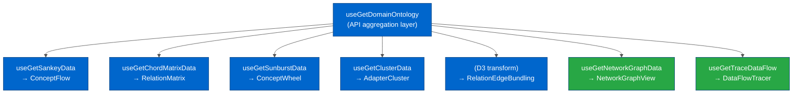

# Domain Ontology Visualization

---

## Table of Contents

- [Goal](#goal)
- [Why the Workspace Is Not the Answer](#why-the-workspace-is-not-the-answer)
- [The DomainOntologyManager](#the-domainontologymanager)
- [Five Existing Visualizations](#five-existing-visualizations)
  - [Sankey Diagram — ConceptFlow](#1-sankey-diagram--conceptflow)
  - [Chord Diagram — RelationMatrix](#2-chord-diagram--relationmatrix)
  - [Sunburst Chart — ConceptWheel](#3-sunburst-chart--conceptwheel)
  - [Cluster View — AdapterCluster](#4-cluster-view--adaptercluster)
  - [Edge Bundling — RelationEdgeBundling](#5-edge-bundling--relationedgebundling)
- [Two Phase 1 Implementations](#two-phase-1-implementations)
  - [Network Graph View](#network-graph-view)
  - [Data Flow Tracer](#data-flow-tracer)
- [What Was Not Activated](#what-was-not-activated)
- [Lessons Learned](#lessons-learned)
- [Three Formal Models (Phase 2 — EDG-40)](#three-formal-models-phase-2--edg-40)
- [Deferred Work](#deferred-work)
- [Related Documentation](#related-documentation)

---

## Goal

The domain ontology visualization project (task 38018) set out to answer a single question that every user of a complex Edge deployment eventually asks:

> "Where does my data go?"

A device publishes a temperature reading. That reading becomes a TAG. A northbound mapping converts it into a TOPIC. A bridge forwards it to an enterprise broker. A TOPIC FILTER on the local broker triggers a DataHub policy that validates the payload. A combiner aggregates it with humidity data from a second adapter. The combined payload lands on a different TOPIC consumed by a cloud dashboard.

No single screen in the Edge UI shows this chain end-to-end. The workspace canvas shows adapters, bridges, and combiners as nodes — but the mappings between them, the topic filters that cross-cut everything, and the DataHub policies that intercept in between are invisible.

The goal was to surface this chain as an interactive, navigable visualization.

**See:** [Domain Model](../architecture/DOMAIN_MODEL.md) for the full entity model underlying these visualizations.

---

## Why the Workspace Is Not the Answer

The workspace canvas (`src/modules/Workspace/`) displays a topology graph of Edge entities — adapters, bridges, combiners, and the Edge node itself — connected by edges derived from the API response structure.

This graph represents **operational status**, not **data flow**. Its node and edge set is driven by what the backend API returns for each entity type, not by the mapping relationships between them.

**Two problems make the workspace insufficient for ontology visualization:**

1. **Structural mismatch.** The workspace graph connects entities at the adapter/bridge/combiner level. Domain ontology requires connections at the TAG/TOPIC/TOPIC FILTER level — one adapter alone can have dozens of TAGs with different mapping destinations.

2. **No DataHub integration.** Topic filters and DataHub data policies do not appear as workspace nodes. The connection between a TOPIC published by a northbound mapping and the DataHub policy that intercepts it is entirely absent from the workspace view.

A domain ontology view is therefore a **different canvas** with a different data source, different entities, and different relationships than the workspace.

---

## The DomainOntologyManager

The existing implementation lives in `src/modules/DomainOntology/`. It is accessible via the Edge node's side panel:

**Access path:** Edge node → select → "Open side panel" → DomainOntologyManager



**Architecture strengths:**

- All visualizations share a single centralized data-fetching layer (`useGetDomainOntology`), which calls five API endpoints once and distributes the data to every visualization hook.
- Each visualization has a dedicated data-transformation hook that converts the unified ontology into its required format (adjacency matrix, tree hierarchy, Sankey graph, etc.).
- Tabs load on demand — switching to a visualization tab triggers its hook.

**Architecture weakness:**

- No shared selection or filter state between tabs. Selecting a node in the chord diagram does not highlight it in the Sankey. Each visualization operates in isolation.

---

## Five Existing Visualizations

### 1. Sankey Diagram — ConceptFlow

**File:** `src/modules/DomainOntology/components/ConceptFlow.tsx`
**Data hook:** `src/modules/DomainOntology/hooks/useGetSankeyData.ts`
**Library:** Nivo Sankey (`@nivo/sankey`)

**What it shows:** A left-to-right flow diagram with TAGs on the left, TOPICs in the center, and TOPIC FILTERs on the right. Link width represents connection count. The three-column layout corresponds to the three integration point types.

```
[TAG: modbus/device-1/temp] ──→ [TOPIC: factory/floor1/temp] ──→ [FILTER: factory/#]
[TAG: opcua/device-2/hum]  ──→ [TOPIC: factory/floor1/hum]  ──→ [FILTER: factory/#]
                                [TOPIC: combined/env-data]   ──→ [FILTER: combined/+]
```

**Strengths:**
- Directional flow is immediately readable
- Link width gives a sense of data volume or connection density
- Good for presentations and executive-level communication

**Weaknesses:**
- No interaction — clicking a node does nothing
- Layout degrades badly with more than ~30 nodes (overlapping flows)
- Cannot trace a specific path through the graph
- No filtering — every entity appears simultaneously

**What would make it useful:** Node click → navigate to entity configuration; link hover → mapping details tooltip; path highlighting on node selection; filter controls.

---

### 2. Chord Diagram — RelationMatrix

**File:** `src/modules/DomainOntology/components/RelationMatrix.tsx`
**Data hook:** `src/modules/DomainOntology/hooks/useGetChordMatrixData.ts`
**Library:** Nivo Chord (`@nivo/chord`)

**What it shows:** A circular adjacency matrix where every integration point is an arc on the circumference. Chords connect related entities. Source-to-target and target-to-source chords use different weights to encode directionality.

**Distinctive feature:** The chord matrix is the only existing visualization that performs **wildcard matching** — it evaluates every TOPIC against every TOPIC FILTER using MQTT wildcard semantics (`mqttTopicMatch`) and adds weighted chords for matches. This makes it the most accurate representation of the TOPIC → TOPIC FILTER relationship.

**Strengths:**
- Compact for dense graphs — all relationships fit in one circular view
- Wildcard matching reveals which topics a filter actually intercepts
- Useful for discovering unexpected connection patterns

**Weaknesses:**
- Hard to read for unfamiliar users
- Directionality is encoded only in chord weight (not visually obvious)
- Overwhelms users at more than ~30 nodes
- Wildcard matching is expensive (O(n×m) per render) and not memoized

---

### 3. Sunburst Chart — ConceptWheel

**File:** `src/modules/DomainOntology/components/ConceptWheel.tsx`
**Data hook:** `src/modules/DomainOntology/hooks/useGetSunburstData.ts`
**Library:** Nivo Sunburst (`@nivo/sunburst`)

**What it shows:** A hierarchical drill-down of the MQTT topic namespace. Each ring represents one topic level (`factory` / `floor1` / `temperature`). Clicking a segment drills down into that subtree. A `MetadataExplorer` side panel shows entity details on selection.

**Strengths:**
- Beautiful and intuitive for exploring topic namespaces
- Drill-down interaction is the most polished UX of all existing visualizations
- MetadataExplorer already provides a pattern for entity detail panels

**Weaknesses:**
- Shows only TOPICs — TAGs and TOPIC FILTERs are absent
- Transformation relationships are invisible
- Only useful for understanding namespace structure, not data flow

---

### 4. Cluster View — AdapterCluster

**File:** `src/modules/DomainOntology/components/AdapterCluster.tsx`
**Data hook:** `src/modules/DomainOntology/hooks/useGetClusterData.ts`
**Library:** D3 force simulation

**What it shows:** A force-directed network of adapters as nodes (sized by tag count) with edges representing northbound mappings to topics. Adapters of the same type cluster together through the physics simulation.

**Strengths:**
- Physics-based clustering reveals structural groupings naturally
- Node size as tag count is a useful metric for identifying adapter complexity
- No manual layout required

**Weaknesses:**
- Layout is non-deterministic — it changes on every render and on resize
- No pan/zoom controls
- Performance degrades with more than ~50 nodes
- Shows only adapters and their northbound relationships, not the full ontology

---

### 5. Edge Bundling — RelationEdgeBundling

**File:** `src/modules/DomainOntology/components/RelationEdgeBundling.tsx`
**Library:** D3 hierarchical edge bundling

**Status:** Experimental — hidden behind a feature flag.

**What it shows:** A circular layout with entity types as groups (ADAPTERS, BRIDGES, EDGE). Curved connections bundle along the hierarchy before separating to their targets, reducing visual clutter in dense graphs.

**Strengths:**
- Dramatically reduces crossing lines for dense connection patterns
- Entity type grouping gives structural clarity
- Visually appealing for presentations

**Weaknesses:**
- Experimental status means it is not visible to users by default
- No interaction — connections cannot be isolated or filtered
- Confusing for unfamiliar users (the bundling behavior is not intuitive)
- Poor performance due to SVG rendering

---

## Two Phase 1 Implementations

Task 38018 added two new implementations in commit `7251e579`. Neither was merged to the main feature branch.

### Network Graph View

**File:** `src/modules/DomainOntology/components/NetworkGraphView.tsx`
**Data hook:** `src/modules/DomainOntology/hooks/useGetNetworkGraphData.ts`
**Library:** React Flow (`@xyflow/react`) — the same library used in the workspace canvas

**What it provides:**

- Nodes representing TAGs, TOPICs, TOPIC FILTERs, COMBINERs, and ASSET MAPPERs, each color-coded by type
- Edges representing transformation types (northbound, southbound, bridge, combiner, asset mapper), each labeled with the transformation type
- Circular layout algorithm for initial positioning
- Pan, zoom, and minimap controls — the same interaction model users already know from the workspace
- A `NetworkGraphDetailsPanel` — a bottom slide-in panel showing entity details on node selection
- Custom node components (`NetworkGraphNode`) and custom edge components (`NetworkGraphEdge`)

**Why React Flow was chosen:** Users already interact with React Flow daily in the workspace canvas. The pan/zoom/drag interaction model is familiar, reducing cognitive load. React Flow handles virtualization and performance for large graphs better than D3 SVG approaches.

**Data transformation:** `useGetNetworkGraphData` takes the `DomainOntology` object and produces React Flow `Node[]` and `Edge[]` arrays. Combiner and asset mapper data was added to `useGetDomainOntology` as part of this task (subtask 4), making it available to all visualizations.

**Phase 1 limitations:** Layout algorithm is circular only (force-directed layout was deferred to Phase 2). Details panel shows node attributes but does not link to entity configuration pages. No filter controls. No E2E tests beyond a POC spec.

---

### Data Flow Tracer

**File:** `src/modules/DomainOntology/components/DataFlowTracer.tsx`
**Data hook:** `src/modules/DomainOntology/hooks/useGetTraceDataFlow.ts`
**Library:** BFS graph traversal (custom implementation)

**What it provides:**

A step-by-step interactive path tracer. The user selects any integration point — a TAG, TOPIC, or TOPIC FILTER — from a searchable `chakra-react-select` dropdown. The tracer then performs a breadth-first search through the full domain graph and returns the complete path downstream (or upstream) from that point.

**Example trace result:**

```
1. [TAG]          modbus-adapter/device-1/temperature
   ↓ Northbound Mapping → QoS: 1, Format: JSON
2. [TOPIC]        factory/floor1/temperature
   ↓ Topic Filter Match
3. [TOPIC FILTER] factory/#
   ↓ Southbound Mapping
4. [TAG]          opcua-adapter/actuator-1/setpoint
```

**Key implementation decisions:**

- **BFS over DFS** — BFS finds shorter paths first, which is more useful for debugging (users want the most direct path, not the deepest one)
- **Cycle detection** — bridges can create TOPIC → TOPIC FILTER → TOPIC cycles (a local topic forwarded to remote, then back again). The tracer detects and stops at cycles
- **Wildcard evaluation** — the tracer evaluates MQTT wildcard matching to determine whether a topic activates a given TOPIC FILTER during traversal
- **Custom option renderer** — the start-point selector uses badges to visually distinguish entity types (TAG vs. TOPIC vs. TOPIC FILTER) in the dropdown options

**Phase 1 limitations:** The trace result is a text list, not a highlighted overlay on any of the visualizations. Integration with the Network Graph View (to highlight the traced path on the canvas) was deferred to Phase 2. Export functionality was not implemented.

---

## What Was Not Activated

Both Phase 1 implementations exist in the codebase (commit `7251e579`) but were not merged into the main feature branch for several reasons:

1. **No E2E test coverage.** Only POC-level component specs existed. Full coverage against the functional requirements had not been written.

2. **Incomplete Phase 2 features.** The Network Graph View was missing the force-directed layout and the drill-down navigation to entity configuration. The Data Flow Tracer was missing the Network Graph overlay and export. Shipping Phase 1 alone would create a gap between user expectation and actual capability.

3. **No unified filter panel.** All five existing visualizations already suffer from the absence of cross-visualization filtering. Adding two more visualizations without addressing this compounded the problem.

4. **Accessibility compliance not verified.** The interactive components (dropdown selector, details panel, graph nodes) were not audited against WCAG 2.1 AA requirements.

5. **Performance benchmarks not run.** The Network Graph View's performance with large datasets (>100 entities) was not measured. React Flow handles virtualization natively, but the circular layout algorithm and data transformation hooks had not been profiled.

The feature flag pattern used for `RelationEdgeBundling` was not applied to the new implementations — they were integrated into `DomainOntologyManager`'s tab set but the entire manager remained accessible only through the Edge node side panel, which is not broadly discoverable.

---

## Lessons Learned

**1. The workspace connection was the wrong entry point.**
Placing the `DomainOntologyManager` inside the Edge node side panel makes it nearly invisible. Users access it only by selecting the Edge node, then opening the panel — a two-step path from an already-obscure action. A domain ontology view of this complexity warrants a first-class navigation destination, not a sub-panel.

**2. The TOPIC → TOPIC FILTER relationship is the hardest to visualize.**
Every visualization in this project treats northbound mappings (TAG → TOPIC) as the primary relationship because they are explicitly modelled in the API. The TOPIC → TOPIC FILTER relationship is implicit — it is derived by MQTT wildcard matching at runtime, not stored as an explicit edge in any API response. The chord diagram was the only visualization to surface this relationship, and doing so required implementing wildcard matching in the frontend. Any visualization that omits this relationship is incomplete.

**3. DataHub was missing from every visualization.**
The domain model extends beyond the data layer: TOPIC FILTER → DataHub data policy is a real edge in the ontology. None of the seven visualizations included DataHub policies as nodes. A complete domain ontology view needs to cross the Edge/DataHub boundary.

**4. Static visualizations do not answer the core question.**
"Where does my data go?" requires path tracing, not graph layout. The Data Flow Tracer was the only implementation that directly answered the question. The other visualizations show the shape of the graph but require the user to mentally trace paths themselves.

**5. A unified filter panel is not optional.**
With seven visualization types and no shared filter state, users must mentally switch context when changing tabs. Any new phase of this feature must start with a shared filter/selection model that all visualizations consume.

---

## Three Formal Models (Phase 2 — EDG-40)

Task EDG-40 added three progressively more formal representations of the domain model:

### 1. OWL Ontology in Turtle Syntax

**Files:** `docs/ontology/DOMAIN_ONTOLOGY.ttl`, `docs/ontology/README.md`

A formal OWL 2 ontology defining 13 classes, 14 object properties, 5 data properties, cardinality
axioms, and a disjointness declaration for Tag/Topic/TopicFilter. Loadable in Protégé and queryable
via SPARQL once populated with API data serialised as RDF individuals.

**Known limitation:** The `mqtt:matches` property (TopicFilter → Topic) cannot be derived by an OWL
reasoner — it requires MQTT wildcard evaluation code to populate. See the ontology README for details.

### 2. Mermaid classDiagram

**File:** `docs/architecture/DOMAIN_MODEL.md` — Structural Model section (added before the existing
per-flow diagrams)

A `classDiagram` covering all 12 entity classes, their key attributes, and all relationships with
cardinality notation. The dashed arrow (`..>`) distinguishes the runtime-computed `matches` relationship
from structural API-backed relationships.

### 3. Domain DAG (React Flow with Dagre layout)

**Files:**

- `src/modules/DomainOntology/hooks/useGetDomainOntologyDag.ts` — builds layered graph with feedback-edge detection
- `src/modules/DomainOntology/components/DomainOntologyDagView.tsx` — React Flow component with Dagre LR layout
- Added as 7th tab in `DomainOntologyManager.tsx` ("Domain DAG")

**Layer assignment:**

| Layer | Entity type | Direction |
| ----- | ----------- | --------- |
| 0 | TAG | Source of northbound data |
| 1 | TOPIC | MQTT broker topic |
| 2 | TOPIC_FILTER | Pattern matcher |
| 3 | DATA_POLICY | DataHub policy (optional — degrades gracefully if DataHub unavailable) |

**Feedback edges** (southbound TOPIC_FILTER → TAG, bridge TOPIC_FILTER → TOPIC) are rendered as
dashed lines and excluded from Dagre's forward-pass so the pipeline layout is not disturbed.

**DataHub integration:** DATA_POLICY nodes are included at Layer 3. If the DataHub API returns a
404 or network error, Layer 3 renders empty and the DAG shows Edge-only entities.

---

## Deferred Work

The following items were planned in the task roadmap but not implemented:

| Item | Priority | Notes |
| ---- | -------- | ----- |
| Network Graph — entity navigation | High | Double-click node → navigate to entity configuration page |
| Data Flow Tracer — Network Graph overlay | High | Highlight trace path on the canvas rather than as a text list |
| Data Flow Tracer — export | Medium | Export trace as Markdown/PDF for documentation |
| Unified filter panel | High | Shared adapter/entity type/status filter across all visualization tabs |
| Standalone navigation destination | Medium | Promote out of Edge node side panel into a first-class route |
| E2E test coverage | High | Required before merging either Phase 1 implementation |
| Accessibility audit | High | Required before merging |
| Performance benchmarks | Medium | Measure and profile for deployments with >100 entities |
| DAG — node click → entity navigation | High | Link DAG nodes to entity configuration pages |
| DAG — selection sync with Data Flow Tracer | Medium | Highlight DAG path when a trace is active |
| Sankey interaction enhancements | Medium | Node click, path highlighting, filter controls |
| Chord diagram legend and arc interactions | Low | Directionality explanation, arc click filtering |
| Performance optimization | Medium | Memoize wildcard matching; virtualize for >100 nodes |
| OWL triplestore integration | Low | Pre-populate RDF triples from API responses for SPARQL querying at runtime |

---

## Related Documentation

**Architecture:**
- [Domain Model](../architecture/DOMAIN_MODEL.md) — Entity definitions, transformation flows, topic filter pattern-matching mechanism
- [Workspace Architecture](../architecture/WORKSPACE_ARCHITECTURE.md) — Why the workspace canvas is separate from the domain ontology view
- [DataHub Architecture](../architecture/DATAHUB_ARCHITECTURE.md) — How DataHub data policies relate to TOPIC FILTERs

**External:**
- [Edge | Alternative Workspace as ETL Designer (Miro)](https://miro.com/app/board/uXjVIFl3nyY=) — Concept for treating the workspace as an ETL canvas unifying adapters, combiners, bridges, and DataHub
- [Edge Domain Ontology (Miro)](https://miro.com/app/board/uXjVLpkTwW8=) — Domain map with entity JSON schemas and API sketches

**Task context:**
- `.tasks/38018-domain-ontology-visualisation/DOMAIN_MODEL.md` — Detailed entity schemas, hook structure, performance benchmarks
- `.tasks/38018-domain-ontology-visualisation/VISUALIZATION_ROADMAP.md` — Full comparison and enhancement roadmap
- `.tasks/38018-domain-ontology-visualisation/TASK_SUMMARY.md` — Progress log for the five implementation subtasks
