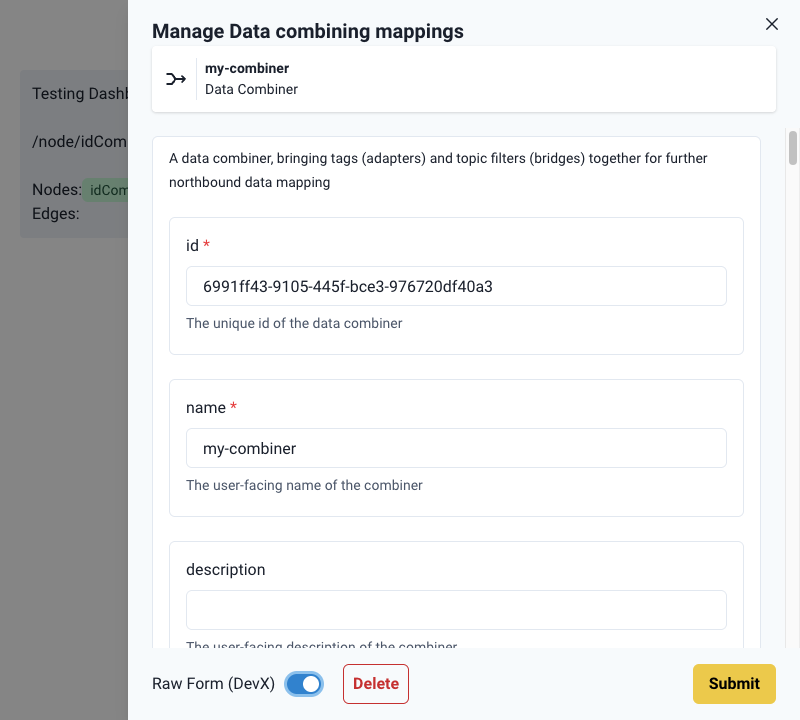
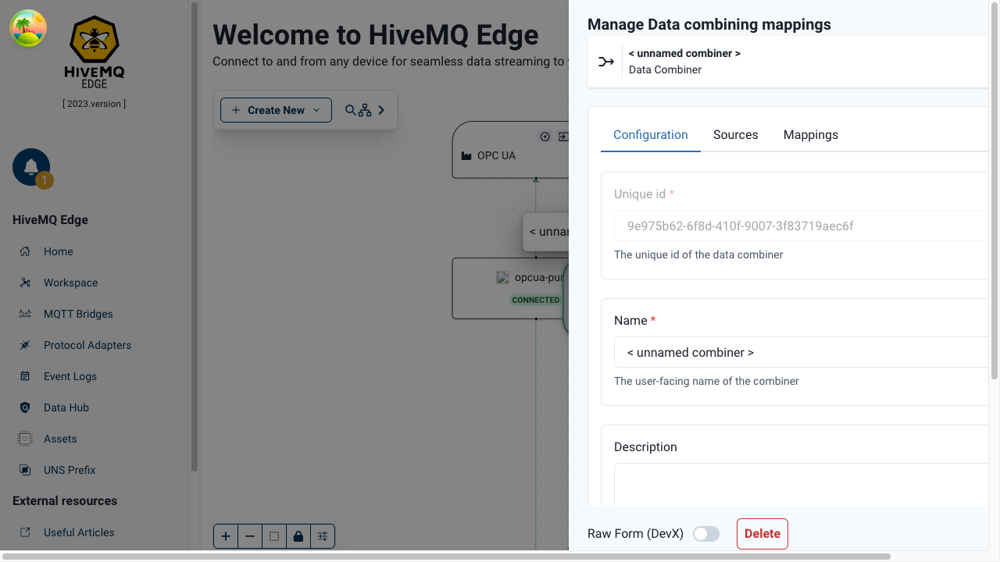
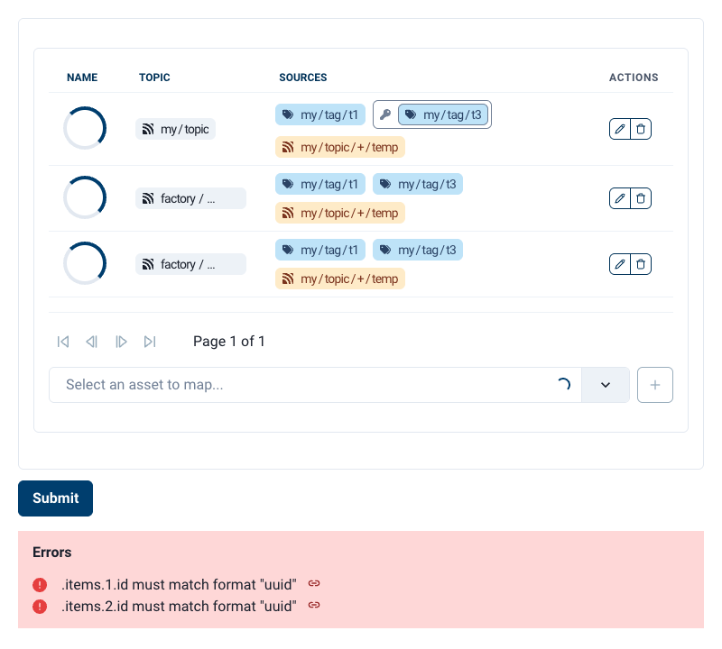
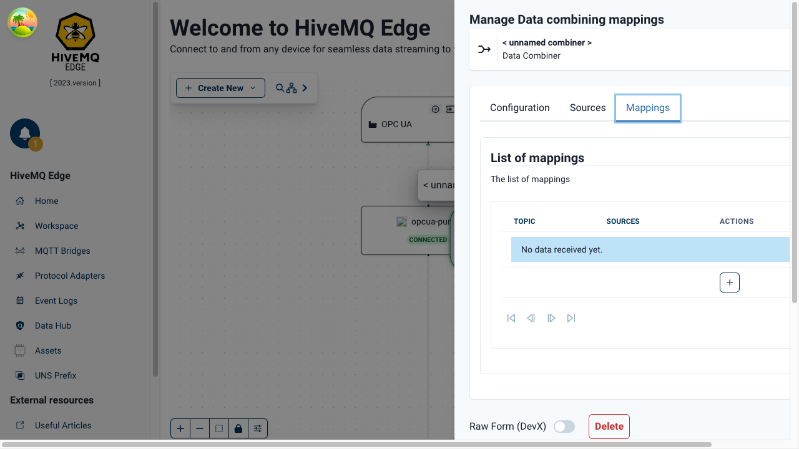
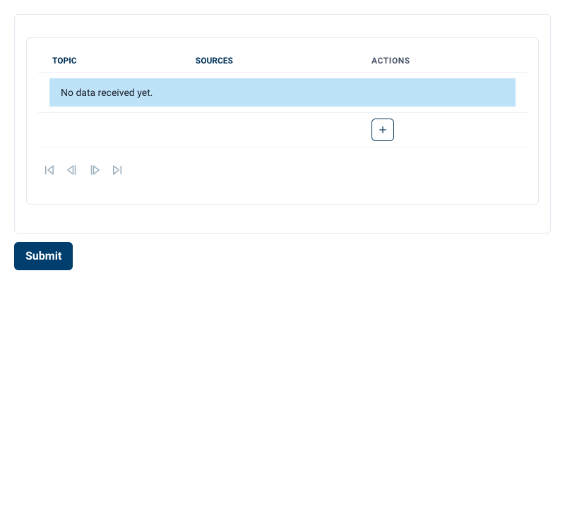
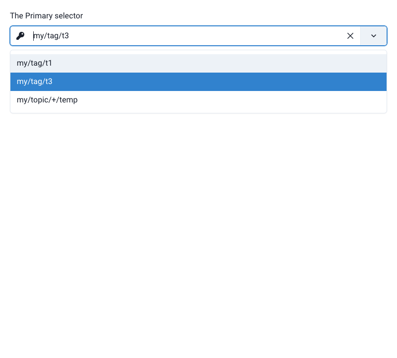
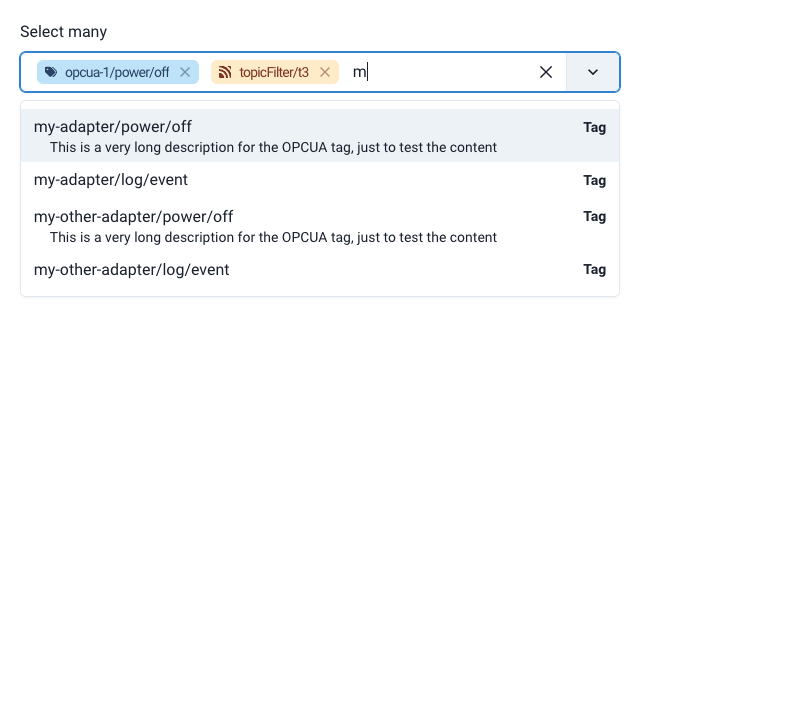
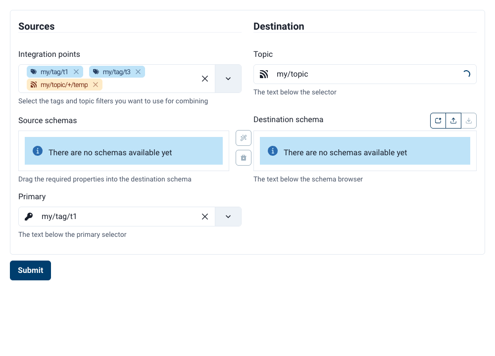
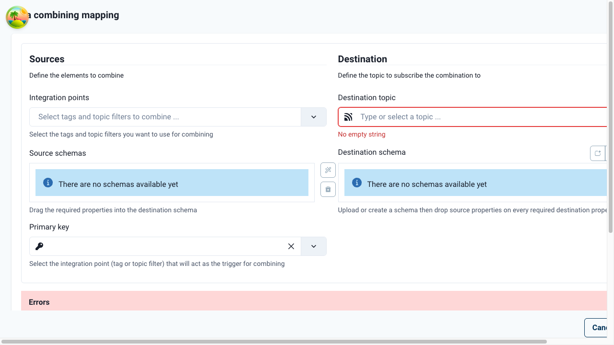

# Combiner UX Walkthrough

This walkthrough explains how we transformed the Combiner's flat RJSF form into an interactive, user-centered design. We'll explore both **why** we made these design decisions (interaction design perspective) and **how** we implemented them (technical perspective).

---

## Table of Contents

1. [Introduction](#introduction)
2. [Breaking Down the Flat Form](#breaking-down-the-flat-form)
3. [Widget Deep Dives](#widget-deep-dives)
   - [PrimarySelect Widget](#primaryselect-widget)
   - [CombinedEntitySelect Widget](#combinedentityselect-widget)
   - [DataCombiningEditorField](#datacombiningeditorfield)
   - [DataCombiningTableField](#datacombiningtablefield)
4. [Data Lifecycle Deep Dive](#data-lifecycle-deep-dive)
5. [Cross-Cutting Concerns](#cross-cutting-concerns)
6. [Testing Strategy](#testing-strategy)
7. [Common Pitfalls and Solutions](#common-pitfalls-and-solutions)
8. [Related Documentation](#related-documentation)

---

## Introduction

### What is the Combiner?

The Combiner is a data mapping tool that brings together tags (from adapters) and topic filters (from bridges) for northbound data transformation. Users configure:

- **Sources**: Which entities (adapters/bridges) provide data
- **Mappings**: How to combine and transform data from multiple sources
- **Instructions**: Field-level transformations from combined sources to destination schema

The Combiner is rendered as a two-part UX:
1. **Combiner configuration**: Entity sources and list of mappings
2. **Mapping editor**: Individual mapping configuration with transformation instructions

### Why Special Documentation?

The Combiner represents a **significant departure** from RJSF's default form rendering. Understanding this design helps developers:
- Maintain and extend the Combiner
- Apply similar patterns to other complex forms
- Understand RJSF's customization capabilities
- Balance UX needs with technical constraints

### Two-Perspective Approach

Throughout this walkthrough, we examine each component from two complementary angles:

**🎨 Interaction Design Perspective:**
- User goals and pain points
- UX challenges with flat forms
- Design solutions and visual affordances
- How the UI guides users to success

**⚙️ Technical Perspective:**
- Schema binding and props structure
- Data flow through components
- React patterns (memoization, context)
- Validation and scaffolding implementation

---

### The Technical Context

#### RJSF Architecture Primer

React JSON Schema Form (RJSF) generates forms from JSON Schemas. The library:
- Renders forms automatically from schema definitions
- Provides default HTML widgets (text inputs, checkboxes, dropdowns)
- Supports customization via **custom widgets**, **custom fields**, and **UI Schema**

**Key Principle:** Each custom widget is **isolated to its schema level**. A widget bound to `sources.primary` only receives that property's data, not the entire form payload.

**See:**
- [RJSF Guide](../guides/RJSF_GUIDE.md) for complete RJSF reference
- [Form Component API Reference](../guides/RJSF_GUIDE.md#form-component-api-reference) for detailed prop documentation

#### Schema Isolation and FormContext

**Widget Isolation:**
```typescript
// EntityReferenceTableWidget bound to sources.items
// Receives: EntityReference[]
// Does NOT receive: Combiner object

// PrimarySelect bound to sources.primary
// Receives: DataIdentifierReference
// Does NOT receive: sources.tags or sources.topicFilters directly
```

**Breaking Isolation with FormContext:**

When widgets need shared data (like query results), we use RJSF's `formContext` mechanism:

```typescript
<ChakraRJSForm
  formContext={{ combinedEntities, schemaRegistry }}
  // ...
/>
```

Child widgets access context via React Context API:
```typescript
const context = useContext(FormContext)
const entities = context?.combinedEntities
```

**See:**
- [FormContext Pattern](#formcontext-pattern) for detailed explanation
- [formContext prop reference](../guides/RJSF_GUIDE.md#formcontext-optional) for API details

#### Combiner Data Model

**OpenAPI Schema Structure:**

```typescript
Combiner {
  id: string
  name: string
  sources: EntityReferenceList {
    items: EntityReference[] {
      type: 'ADAPTER' | 'BRIDGE' | ...
      id: string
    }
  }
  mappings: DataCombiningList {
    items: DataCombining[] {
      id: string
      sources: {
        primary: DataIdentifierReference { id, type }
        tags: string[]
        topicFilters: string[]
      }
      destination: {
        topic: string
        assetId: string
        schema: string
      }
      instructions: Instruction[]
    }
  }
}
```

**See:** [Protocol Adapter Architecture](../architecture/PROTOCOL_ADAPTER_ARCHITECTURE.md) for schema generation details.

#### Component Hierarchy

```
CombinerMappingManager (Root)
└─ ChakraRJSForm (RJSF Root Form)
   ├─ EntityReferenceTableWidget
   │  └─ EntityRenderer (Row display)
   └─ DataCombiningTableField
      └─ DataCombiningEditorDrawer
         └─ ChakraRJSForm (Nested Form)
            └─ DataCombiningEditorField
               ├─ CombinedEntitySelect ← Reads FormContext
               ├─ PrimarySelect ← Reads formData.sources
               ├─ CombinedSchemaLoader ← Triggers queries
               ├─ DestinationSchemaLoader ← Triggers queries
               └─ MappingInstructionList
```

**Key Boundaries:**
- FormContext flows from CombinerMappingManager to all descendants
- Each RJSF instance manages its own formData
- Drawer contains **separate RJSF instance** for single DataCombining item

---

## Breaking Down the Flat Form

### The Flat Form Problem

**Default RJSF rendering produces a single, vertical form:**



**UX Issues:**

| Issue | Impact | User Pain Point |
|-------|--------|-----------------|
| **Cognitive Overload** | 60+ fields visible simultaneously | "Where do I start?" |
| **Poor Scannability** | No visual grouping of related fields | "Which fields are for sources vs destination?" |
| **Array Editing** | 10+ fields × N mappings = 10N visible fields | "How do I edit just one mapping?" |
| **No Context** | Entity IDs shown as strings (UUIDs, names) | "Which adapter owns this tag?" |
| **Validation Errors** | Errors at bottom of long scroll | "Where did I make a mistake?" |

**User Quote (Hypothetical):** *"I just want to add one mapping, but I have to scroll through 20 other mappings to find the 'Add' button."*

---

### Progressive Disclosure Strategy

**Solution:** Break the form into digestible chunks using three UI patterns:

#### 1. Tab Pattern - Top-Level Grouping

**Three tabs organize Combiner properties:**

- **Configuration**: Name, description (2 fields)
- **Sources**: Entity selection (1 table)
- **Mappings**: Mapping list and editor (1 table)



**UX Benefit:** User focuses on one concern at a time. "I'm configuring sources" vs "I'm creating mappings."

**Technical Implementation:**
- Tabs are NOT part of RJSF schema
- Layout wrapper (`<Tabs>`) around RJSF form
- Each tab renders specific RJSF fields via `ui:field` selectors

---

#### 2. Table Pattern - Array Overview

**Mappings array displayed as table:**

| Primary Key | Sources | Destination Topic | Actions |
|-------------|---------|-------------------|---------|
| 🔑 temperature/sensor1 | 2 sources | factory/metrics | ✏️ 🗑️ |
| 🔑 pressure/sensor2 | 3 sources | factory/sensors | ✏️ 🗑️ |



**UX Benefit:** Scannable overview. User sees all mappings at a glance, identifies target quickly.

**Technical Implementation:**
- Custom field: `DataCombiningTableField`
- Bound to `mappings.items` array
- Transforms array items into table rows
- Action buttons open drawer for editing

---

#### 3. Drawer Pattern - Focused Editing

**Single mapping editor in side drawer:**



**UX Benefit:** Full focus on one mapping. No distractions. Clear "Save" vs "Cancel" actions.

**Technical Implementation:**
- `DataCombiningEditorDrawer` component
- Contains **nested RJSF instance** for single DataCombining
- Slides from right, traps focus
- Saves changes back to array on close

---

### Contextual Scaffolding

**Scaffolding Definition:** UI components that constrain user actions to prevent invalid states before validation even runs.

**Example 1: Primary Selector**

**Without Scaffolding (text input):**
```
Primary Key: [_____________]  ← User can type anything
```
- User types "tempersture/sensor1" (typo)
- Validation error on blur: "Primary must be one of the selected sources"
- User must find and fix typo

**With Scaffolding (dropdown):**
```
Primary Key: [🔑 temperature/sensor1 ▼]
             ▼
             🔑 temperature/sensor1
             🔑 pressure/sensor2
             📡 bridge/topic/filter
```
- User can ONLY select from existing sources
- Typo impossible
- Type (TAG vs TOPIC_FILTER) automatically set

**UX Benefit:** Error prevention > Error correction. User guided to valid choices.

**Trade-off:** More component complexity, less flexibility.

---

**Example 2: Entity Selector**

**Without Scaffolding:**
```
Tags: adapter-1, adapter-2
```
- User sees only entity IDs
- No context about what data each provides
- Must remember which adapter has which tags

**With Scaffolding:**
```
Select adapters for tags:
┌─────────────────────────────────────┐
│ 🔌 Modbus Adapter 1                 │  ← Icon + name
│    Tags: temperature, pressure (2)  │  ← Available tags shown
├─────────────────────────────────────┤
│ 🔌 OPC-UA Adapter 2                 │
│    Tags: flow, level (2)            │
└─────────────────────────────────────┘
```

**UX Benefit:** Rich context helps user make informed decisions. Clear visual distinction between entity types.

---

### Visual Affordances

**Icons Indicating Field Purpose:**

| Icon | Meaning | Context |
|------|---------|---------|
| 🔑 | Primary key | PrimarySelect dropdown |
| 🔌 | Adapter | Entity options |
| 🌉 | Bridge | Entity options |
| 📄 | Schema loaded | Schema loader success |
| ⏳ | Loading | Schema loader in progress |
| ⚠️ | Error | Schema loader failed |

**Color Coding:**
- Blue accent: Source-related fields
- Green accent: Destination-related fields
- Red: Validation errors, destructive actions
- Gray: Disabled/loading states

**Empty States with CTAs:**
```
┌─────────────────────────────────┐
│   📦 No mappings configured     │
│                                 │
│   Create your first mapping to  │
│   start combining data sources  │
│                                 │
│   [+ Add Mapping]               │
└─────────────────────────────────┘
```



---

## Widget Deep Dives

### PrimarySelect Widget

**Component:** `src/modules/Mappings/combiner/PrimarySelect.tsx`

---

#### 🎨 Interaction Design Perspective

**User Goal:** Select which integration point (tag or topic filter) serves as the primary key for data combining.

**Why It Matters:** The primary key determines the triggering cadence for the mapping. When the primary's value changes, the combiner executes transformation instructions.

**UX Challenges in Flat Form:**
1. **Open text input** allows invalid values (not in sources list)
2. **No visual indication** of which sources are available
3. **Type confusion**: User must specify whether primary is a TAG or TOPIC_FILTER separately
4. **Typo risk**: Easy to mistype tag/topic filter names (e.g., "temperature/sensor1" vs "temp/sensor1")

**Design Solution:**

**Dropdown selector with autocomplete:**
- Options auto-populated from selected sources (tags + topic filters)
- Type (TAG vs TOPIC_FILTER) automatically inferred from selection
- Key icon (🔑) provides visual affordance
- Clearable to unset primary (optional field)



**Visual Design:**
- Key icon prefixed to control input
- Options labeled with raw identifier names
- Type hidden from UI (internal metadata)
- Placeholder: "Select primary key..."

**User Flow:**
1. User clicks dropdown
2. Sees list of all selected tags and topic filters
3. Selects one
4. Primary set automatically with correct type
5. Schema loader triggers (depends on primary selection)

---

#### ⚙️ Technical Perspective

**Schema Binding:**

```typescript
// Widget bound to DataCombining schema
// Property controlled: sources.primary

sources: {
  primary: DataIdentifierReference {
    id: string              // e.g., "temperature/sensor1"
    type: 'TAG' | 'TOPIC_FILTER'
  }
}
```

**Props Received:**

```typescript
interface PrimarySelectProps {
  id?: string                      // Field ID for accessibility
  formData?: DataCombining         // Full DataCombining object
  onChange: (newValue: SingleValue<PrimaryOption>) => void
}

interface PrimaryOption {
  label: string   // Display text
  value: string   // Integration point ID
  type: DataIdentifierReference.type
}
```

**Secondary Data Consumed:**

The widget reads from other parts of the `formData` it receives:
- `formData.sources.tags` (string[]) - Read-only
- `formData.sources.topicFilters` (string[]) - Read-only

These arrays are populated by `CombinedEntitySelect` widget (separate component).

**Data Flow:**

```
1. Component receives formData containing current DataCombining state
   ↓
2. useMemo computes options from tags + topicFilters:

   const primaryOptions = useMemo(() => {
     const tags = formData?.sources?.tags || []
     const topicFilters = formData?.sources?.topicFilters || []

     return [
       ...tags.map(entity => ({
         label: entity,
         value: entity,
         type: DataIdentifierReference.type.TAG
       })),
       ...topicFilters.map(entity => ({
         label: entity,
         value: entity,
         type: DataIdentifierReference.type.TOPIC_FILTER
       }))
     ]
   }, [formData])
   ↓
3. User selects option → onChange called with PrimaryOption
   ↓
4. Parent (DataCombiningEditorField) transforms to DataIdentifierReference:

   const handlePrimaryChange = (option: PrimaryOption | null) => {
     onChange({
       ...formData,
       sources: {
         ...formData.sources,
         primary: option ? { id: option.value, type: option.type } : undefined
       }
     })
   }
   ↓
5. RJSF validates new value, triggers re-render
   ↓
6. PrimarySelect receives updated formData, recomputes primaryValue
```

**Key React Patterns:**

**Memoization for Performance:**
```typescript
const primaryOptions = useMemo(() => {
  // Expensive array transformation
  return [...tags.map(), ...topicFilters.map()]
}, [formData])  // Only recompute when formData changes
```

**Derived State:**
```typescript
const primaryValue = useMemo<PrimaryOption | null>(() => {
  if (!formData?.sources.primary) return null
  return {
    label: formData.sources.primary.id,
    value: formData.sources.primary.id,
    type: formData.sources.primary.type
  }
}, [formData?.sources.primary])
```

**onChange Implementation:**

Widget calls `onChange` with `PrimaryOption`, parent transforms to schema format. This keeps widget unaware of schema structure (separation of concerns).

**Validation:**

**Schema-Based:**
- `sources.primary` is **optional** (can be null)
- `type` is enum: must be 'TAG' or 'TOPIC_FILTER'

**Custom Validation:**

Located in `CombinerMappingManager.tsx`:

```typescript
const validateDataPrimary = useCallback<CustomValidator<DataCombining>>(
  (formData, errors) => {
    const allInt = [
      ...(formData?.sources?.tags || []),
      ...(formData?.sources?.topicFilters || [])
    ]

    if (formData?.sources?.primary?.id && !allInt.includes(formData?.sources?.primary?.id)) {
      errors.sources?.primary?.addError(
        'The primary key is not one of the integration point'
      )
    }

    return errors
  },
  []
)
```

**Rule:** If primary is set, it MUST exist in tags or topicFilters arrays.

**Scaffolding in Action:**

Because dropdown options come ONLY from existing sources, user **cannot type invalid value**. This is implicit validation—the UI prevents impossible states.

Custom validation serves as **safety net** for programmatic changes or edge cases.

---

### CombinedEntitySelect Widget

**Component:** `src/modules/Mappings/combiner/CombinedEntitySelect.tsx`

---

#### 🎨 Interaction Design Perspective

**User Goal:** Select which entities (adapters, bridges) provide integration points for this mapping.

**Why It Matters:** Users need to understand which entity owns which data before creating mappings. Context about entity type, status, and available integration points is critical.

**UX Challenges in Flat Form:**

1. **Opaque IDs**: Entity IDs are UUIDs or adapter names ("modbus-adapter-1")—not meaningful
2. **No metadata**: User doesn't see entity type (adapter vs bridge), status, or description
3. **No context about data**: User doesn't know which tags/topic filters each entity provides
4. **Multi-select confusion**: Selecting from flat list of IDs error-prone

**Design Solution:**

**Multi-select dropdown with rich option display:**

Each option shows:
- Entity name (user-friendly)
- Entity type badge (Adapter, Bridge)
- Available integration points (tags or topic filters) with count
- Entity description (if available)
- Icon indicating entity type

**Grouped by type:**
- Adapters (provide tags)
- Bridges (provide topic filters)

**Clear labels:**
- "Select adapters for tags"
- "Select bridges for topic filters"



**Visual Design:**
- Icons: 🔌 (Adapter), 🌉 (Bridge)
- Badges: Color-coded by type
- Nested list showing available integration points
- Checkbox multi-select pattern

**User Flow:**
1. User clicks "Select adapters for tags"
2. Dropdown shows all adapters with tag counts
3. User selects 2 adapters
4. Tags from both adapters populate sources.tags array
5. Primary selector updates with new tag options
6. User repeats for bridges/topic filters

---

#### ⚙️ Technical Perspective

**Schema Binding:**

```typescript
// Widget bound to DataCombining schema
// Properties controlled:

sources: {
  tags: string[]            // Tag IDs from selected adapters
  topicFilters: string[]    // Topic filter IDs from selected bridges
}
```

**Props Received:**

```typescript
interface CombinedEntitySelectProps {
  formData?: DataCombining
  onChange: (field: 'tags' | 'topicFilters', values: string[]) => void
}
```

**Secondary Data Consumed:**

**FormContext:** `combinedEntities` from `useGetCombinedEntities` query.

```typescript
type CombinedEntity = {
  id: string
  name: string
  type: 'ADAPTER' | 'BRIDGE' | ...
  tags?: Tag[]              // Available for adapters
  topicFilters?: string[]   // Available for bridges
  description?: string
  status?: 'RUNNING' | 'STOPPED' | ...
}
```

**How Context is Accessed:**

```typescript
const context = useContext(FormContext)
const entities = context?.combinedEntities || []
```

**Where Context Comes From:**

Parent component (`CombinerMappingManager`) fetches entities:

```typescript
const { data: combinedEntities } = useGetCombinedEntities(
  combiner?.sources?.items || []  // EntityReference[]
)

<ChakraRJSForm
  formContext={{ combinedEntities }}
  // ...
/>
```

**Data Flow:**

```
1. Parent fetches entities via useGetCombinedEntities(combinerSources)
   - combinerSources: EntityReference[] from Combiner.sources
   - Query enriches EntityReferences with full entity data
   ↓
2. Parent passes entities to form via formContext.combinedEntities
   ↓
3. CombinedEntitySelect accesses via React Context API:

   const context = useContext(FormContext)
   const entities = context?.combinedEntities || []
   ↓
4. Component splits entities by type:

   const adapters = entities.filter(e => e.type === 'ADAPTER')
   const bridges = entities.filter(e => e.type === 'BRIDGE')
   ↓
5. User selects adapter from dropdown
   ↓
6. onChange('tags', selectedTagIds) called
   - selectedTagIds: string[] of tag IDs from selected adapters
   ↓
7. Parent updates formData.sources.tags
   ↓
8. RJSF propagates change, triggers re-render
   ↓
9. PrimarySelect receives updated tags, recomputes options
```

**React-Select Integration:**

Uses `react-select` library for multi-select UI with custom components:

**Custom Option Component:**

```typescript
const Option = (props: OptionProps<EntityOption>) => (
  <chakraComponents.Option {...props}>
    <HStack spacing={2}>
      <Icon as={getEntityIcon(props.data.type)} />
      <VStack align="start" spacing={0}>
        <Text fontWeight="medium">{props.data.label}</Text>
        <Text fontSize="sm" color="gray.500">
          {props.data.description}
        </Text>
        <Text fontSize="xs" color="blue.500">
          {props.data.integrationPointCount} {props.data.integrationPointType}
        </Text>
      </VStack>
    </HStack>
  </chakraComponents.Option>
)
```

**Custom MultiValue Component:**

```typescript
const MultiValue = (props: MultiValueProps<EntityOption>) => (
  <chakraComponents.MultiValue {...props}>
    <HStack spacing={1}>
      <Icon as={getEntityIcon(props.data.type)} boxSize={3} />
      <Text fontSize="sm">{props.data.label}</Text>
    </HStack>
  </chakraComponents.MultiValue>
)
```

**onChange Implementation:**

Two separate onChange calls—one for tags, one for topic filters:

```typescript
const handleAdapterChange = (selected: MultiValue<EntityOption>) => {
  const tagIds = selected.flatMap(opt => opt.tags.map(t => t.id))
  onChange('tags', tagIds)
}

const handleBridgeChange = (selected: MultiValue<EntityOption>) => {
  const filterIds = selected.flatMap(opt => opt.topicFilters)
  onChange('topicFilters', filterIds)
}
```

Parent merges into formData at correct paths.

**Validation:**

**Schema-Based:**
- `sources.tags` is string[] (optional, can be empty)
- `sources.topicFilters` is string[] (optional, can be empty)

**No Custom Validation:** These fields have no business logic constraints beyond type checking. Validation comes from dependent fields (PrimarySelect must be in sources list).

**Scaffolding in Action:**

- Options only show entities already selected in parent Combiner.sources
- Cannot add entities not in parent (must go back to Sources tab)
- Rich metadata prevents user confusion about what they're selecting
- Type system prevents selecting adapters for topic filters (impossible state)

---

### DataCombiningEditorField

**Component:** `src/modules/Mappings/combiner/DataCombiningEditorField.tsx`

---

#### 🎨 Interaction Design Perspective

**User Goal:** Configure a complete mapping—select sources, choose primary key, define destination, create transformation instructions.

**Why It Matters:** This is the **core UX** of the Combiner. Users spend most time here, iterating on mappings until transformation logic is correct.

**UX Challenges in Flat Form:**

1. **Linear field dump**: 10+ fields displayed vertically with no grouping
2. **Unclear relationships**: User doesn't see that primary depends on sources, instructions depend on schemas
3. **No visual hierarchy**: Source fields mixed with destination fields—hard to distinguish
4. **Schema loading invisible**: User doesn't know when schemas are ready for instruction creation
5. **Instruction list buried**: Most important part (instructions) at bottom after scrolling

**Design Solution:**

**Grid layout splitting sources (left) and destination (right):**

```
┌─────────────────────┬─────────────────────┐
│ SOURCES             │ DESTINATION         │
│                     │                     │
│ Select entities     │ Asset ID            │
│ [Entity selector]   │ [____________]      │
│                     │                     │
│ Primary key         │ Topic               │
│ [🔑 Primary ▼]      │ [____________]      │
│                     │                     │
│ Combined schema     │ Schema              │
│ 📄 Schema loaded    │ [Schema ▼]          │
│                     │                     │
│                     │ 📄 Schema loaded    │
└─────────────────────┴─────────────────────┘

TRANSFORMATION INSTRUCTIONS
┌─────────────────────────────────────────┐
│ Source Field → Destination Field        │
│ temperature  → metrics.temp             │
│ pressure     → metrics.pressure         │
│ [+ Add Instruction]                     │
└─────────────────────────────────────────┘
```



**Visual Design:**
- **Grid:** 2 columns on desktop, 1 column on mobile
- **Source section:** Blue border accent
- **Destination section:** Green border accent
- **Schema loaders:** Card with status indicator (loading → success → error)
- **Instruction list:** Full-width table below grid

**Visual Flow:**
1. Sources → Primary → Schema Loading
2. Destination → Schema Loading
3. Instructions (both schemas loaded)

**User Flow:**
1. User selects entities (adapters/bridges)
2. Tags/topic filters populate automatically
3. User selects primary key from populated options
4. Schema loader shows "Loading combined schema..."
5. Schema loader shows "📄 Combined schema loaded"
6. User enters destination topic, asset ID
7. User selects destination schema
8. Schema loader shows "📄 Destination schema loaded"
9. Instruction builder becomes active
10. User creates field mappings

---

#### ⚙️ Technical Perspective

**Schema Binding:**

Custom field bound to **full DataCombining object**:

```typescript
DataCombining {
  id: string
  sources: {
    tags: string[]
    topicFilters: string[]
    primary: DataIdentifierReference
  }
  destination: {
    assetId: string
    topic: string
    schema: string
  }
  instructions: Instruction[]
}
```

**Props Received:**

```typescript
interface DataCombiningEditorFieldProps {
  idSchema: IdSchema              // Field ID schema
  formData?: DataCombining        // Full DataCombining object
  onChange: (newValue: DataCombining) => void
  schema: RJSFSchema              // JSON Schema for DataCombining
  uiSchema: UiSchema              // UI customization
  registry: Registry              // RJSF registry (validators, widgets)
}
```

**Secondary Data Consumed:**

- **FormContext.combinedEntities:** For CombinedEntitySelect
- **React Query:** Schema loading queries
  - `useGetDataPointSchemas(sources)` for combined source schemas
  - `useGetDataHubSchema(schemaId)` for destination schema
- **Local State:**
  - Expanded/collapsed sections
  - Schema loading status
  - Instruction builder state

**Data Flow: Multi-Step Orchestration**

**Step 1: Source Selection**

```
User selects adapters in CombinedEntitySelect
↓
CombinedEntitySelect calls onChange('tags', [tag1, tag2])
↓
DataCombiningEditorField receives onChange event:

const handleSourceChange = (field: 'tags' | 'topicFilters', values: string[]) => {
  onChange({
    ...formData,
    sources: {
      ...formData.sources,
      [field]: values
    }
  })
}
↓
RJSF propagates formData update
↓
PrimarySelect receives new formData, recomputes options
```

**Step 2: Primary Selection**

```
User selects primary in PrimarySelect dropdown
↓
PrimarySelect calls onChange(primaryOption)
↓
DataCombiningEditorField transforms to schema format:

const handlePrimaryChange = (option: PrimaryOption | null) => {
  onChange({
    ...formData,
    sources: {
      ...formData.sources,
      primary: option ? {
        id: option.value,
        type: option.type
      } : undefined
    }
  })
}
↓
RJSF propagates formData update
```

**Step 3: Schema Loading (Automatic)**

```
useEffect watches formData.sources.tags and formData.sources.topicFilters
↓
When changed, triggers useGetDataPointSchemas query:

const { data: combinedSchema, isLoading } = useGetDataPointSchemas({
  tags: formData.sources.tags,
  topicFilters: formData.sources.topicFilters
})
↓
CombinedSchemaLoader displays loading state
↓
On success, shows "📄 Combined schema loaded"
↓
Schema stored in component state (NOT in formData)
```

**Step 4: Destination Configuration**

```
User enters topic, assetId, selects destination schema
↓
Each field triggers separate onChange:

const handleDestinationChange = (field: string, value: string) => {
  onChange({
    ...formData,
    destination: {
      ...formData.destination,
      [field]: value
    }
  })
}
↓
When destination schema selected, triggers useGetDataHubSchema:

const { data: destSchema } = useGetDataHubSchema(formData.destination.schema)
↓
DestinationSchemaLoader displays loading → success
```

**Step 5: Instruction Creation**

```
User interacts with MappingInstructionList
↓
Instructions added to formData.instructions[]
↓
Each instruction references:
- Source field (from combined schema)
- Destination field (from destination schema)
- Transformation function

onChange({
  ...formData,
  instructions: [...formData.instructions, newInstruction]
})
```

**Component Composition:**

DataCombiningEditorField is **NOT a simple widget**—it orchestrates multiple sub-components:

- **Layout component**: Manages grid, spacing, visual flow
- **Data router**: Receives single onChange, dispatches to children
- **Query coordinator**: Triggers schema fetches based on source selection
- **State manager**: Manages local UI state (expanded sections, loading states)

**onChange Pattern:**

```typescript
// Widget receives single onChange for entire DataCombining
// But must handle partial updates from children

const handleSourceChange = (field: string, value: any) => {
  onChange({
    ...formData,  // Spread existing data
    sources: {
      ...formData.sources,  // Spread existing sources
      [field]: value  // Update specific field
    }
  })
}
```

**Pattern:** Spread existing formData, update specific path, call onChange.

RJSF handles debouncing and validation automatically.

**Validation:**

**Schema-Based:**
- `destination.topic` format: 'mqtt-topic'
- `destination.schema` required if instructions exist
- `instructions[]` is array (optional)

**Custom Validation:**

Handled at parent (CombinerMappingManager) level. Field is responsible for data structure, not validation rules.

**Scaffolding in Action:**

- Schema loaders **block instruction creation** until schemas loaded
- Primary selector **constrains to valid sources** only
- Destination schema selector **only shows published DataHub schemas**
- Instruction builder **only shows fields from loaded schemas**

**Code Location:** `src/modules/Mappings/combiner/DataCombiningEditorField.tsx`

---

### DataCombiningTableField

**Component:** `src/modules/Mappings/combiner/DataCombiningTableField.tsx`

---

#### 🎨 Interaction Design Perspective

**User Goal:** Manage multiple mappings (DataCombining items) for a single Combiner.

**Why It Matters:** Users often create 5-10 mappings per Combiner. Managing them as a flat list of forms is unusable.

**UX Challenges in Flat Form:**

1. **Array explosion**: 10 fields × 5 mappings = 50 fields on screen
2. **No overview**: User can't see summary of all mappings without scrolling through each
3. **Scrolling nightmare**: Finding specific mapping requires scrolling past all others
4. **Cannot compare**: User can't compare mappings side-by-side
5. **Edit confusion**: Editing one mapping surrounded by other mapping fields—easy to lose context

**Design Solution:**

**Table view with mapping summaries:**

| Primary Key | Sources | Destination | Actions |
|-------------|---------|-------------|---------|
| 🔑 temperature/sensor1 | 2 (1 adapter, 1 bridge) | factory/metrics | ✏️ 🗑️ |
| 🔑 pressure/sensor2 | 3 (2 adapters, 1 bridge) | factory/sensors | ✏️ 🗑️ |
| 🔑 flow/pump1 | 1 (1 adapter) | factory/pumps | ✏️ 🗑️ |

**Table Actions:**
- **Add button** above table: "+ Add Mapping"
- **Row actions**: Edit (pencil icon), Delete (trash icon)

**Drawer for editing:**
- Click Edit → drawer slides from right
- Drawer contains full DataCombiningEditorField for single item
- "Save" updates array, closes drawer
- "Cancel" discards changes, closes drawer




**Visual Design:**
- **Table:** Alternating row colors, hover states
- **Primary key column:** Key icon + identifier
- **Source count:** Badge showing "2 sources"
- **Action buttons:** Icon buttons with tooltips
- **Drawer:** Slides from right, full height, white background, box shadow

**User Flow:**
1. User sees table with existing mappings (or empty state)
2. Clicks "+ Add Mapping"
3. Drawer opens with empty form
4. User configures mapping in drawer (see DataCombiningEditorField flow)
5. Clicks "Save"
6. Drawer closes, new row appears in table
7. User clicks "Edit" on existing row
8. Drawer opens with populated form
9. User changes fields
10. Clicks "Save"
11. Table row updates with new summary
12. User clicks "Delete" on row
13. Confirmation dialog: "Are you sure?"
14. On confirm, row removed from table

---

#### ⚙️ Technical Perspective

**Schema Binding:**

```typescript
// Custom field bound to Combiner schema
// Property controlled: mappings.items

mappings: {
  items: DataCombining[]  // Array of mappings
}
```

**Props Received:**

```typescript
interface DataCombiningTableFieldProps {
  idSchema: IdSchema
  formData?: DataCombining[]     // Array of mappings
  onChange: (newValue: DataCombining[]) => void
  schema: RJSFSchema
  uiSchema: UiSchema
  registry: Registry
}
```

**Secondary Data Consumed:**

- **FormContext.combinedEntities:** Passed through to drawer's nested form

**Data Flow: Array Manipulation Pattern**

**Render Table:**

```typescript
const rows = formData?.map((mapping, index) => ({
  id: mapping.id || `mapping-${index}`,
  primary: mapping.sources.primary?.id || '-',
  sourceCount:
    (mapping.sources.tags?.length || 0) +
    (mapping.sources.topicFilters?.length || 0),
  topic: mapping.destination?.topic || '-',
  index  // Store index for edit/delete
}))

<Table>
  {rows.map(row => (
    <Tr key={row.id}>
      <Td>{row.primary}</Td>
      <Td>{row.sourceCount} sources</Td>
      <Td>{row.topic}</Td>
      <Td>
        <IconButton icon={<EditIcon />} onClick={() => handleEdit(row.index)} />
        <IconButton icon={<DeleteIcon />} onClick={() => handleDelete(row.index)} />
      </Td>
    </Tr>
  ))}
</Table>
```

**Add New Mapping:**

```typescript
const handleAdd = () => {
  const newMapping: DataCombining = {
    id: uuidv4(),  // Generate UUID
    sources: { tags: [], topicFilters: [] },
    destination: {},
    instructions: []
  }

  onChange([...(formData || []), newMapping])  // Append to array
  setEditingIndex(formData?.length || 0)  // Set index to new item
  onDrawerOpen()  // Open drawer
}
```

**Edit Existing Mapping:**

```typescript
const handleEdit = (index: number) => {
  setEditingIndex(index)  // Store index in state
  onDrawerOpen()  // Open drawer
}

// Drawer renders editor with formData[editingIndex]
<DataCombiningEditorField
  formData={formData[editingIndex]}
  onChange={handleDrawerChange}
/>
```

**Update Mapping in Drawer:**

```typescript
const handleDrawerChange = (updatedMapping: DataCombining) => {
  const newArray = [...(formData || [])]  // Clone array
  newArray[editingIndex] = updatedMapping  // Replace item
  onChange(newArray)  // Update array
}
```

**Delete Mapping:**

```typescript
const handleDelete = (index: number) => {
  // Show confirmation dialog
  const confirmed = window.confirm('Delete this mapping?')

  if (confirmed) {
    const newArray = (formData || []).filter((_, i) => i !== index)
    onChange(newArray)
  }
}
```

**Nested Form Context:**

Drawer contains **separate RJSF instance** for single item. Must recreate FormContext:

```typescript
<Drawer isOpen={isOpen} onClose={onClose}>
  <ChakraRJSForm
    schema={itemSchema}  // Schema for single DataCombining
    formData={formData[editingIndex]}
    onChange={handleDrawerChange}
    formContext={{
      combinedEntities: context?.combinedEntities  // Propagate context
    }}
  >
    <DataCombiningEditorField {...} />
  </ChakraRJSForm>
</Drawer>
```

**Why Separate RJSF Instance?**
- Each RJSF instance manages its own formData
- Array field manages array, item field manages item
- Clean separation of concerns
- Easier to validate individual items

**onChange Implementation:**

Table field manages array operations:
- **Add:** Append to array
- **Update:** Replace item at index
- **Delete:** Filter out item at index

Each operation creates new array (immutable pattern), calls onChange.

**Validation:**

**Schema-Based:**
- `mappings.items` is DataCombining[]
- Each item validated against DataCombining schema
- Array itself optional (can be empty)

**Custom Validation:**
- Applied to each array item individually
- Same validation rules as DataCombiningEditorField

**Scaffolding in Action:**

- Table provides overview, prevents cognitive overload
- Drawer focuses user on single mapping (**progressive disclosure**)
- Cannot edit multiple mappings simultaneously (prevents confusion)
- Delete confirmation prevents accidental data loss
- Empty state with clear CTA when no mappings exist

**Code Location:** `src/modules/Mappings/combiner/DataCombiningTableField.tsx`

---

## Data Lifecycle Deep Dive

### RJSF Props Flow

**The Core Props:**

```typescript
<ChakraRJSForm
  schema={combinerSchema}       // JSON Schema defining structure
  uiSchema={combinerUiSchema}   // UI customization
  formData={currentData}        // Current form state (payload)
  formContext={contextData}     // Additional data for widgets
  onChange={handleChange}       // Called on any data change
  onSubmit={handleSubmit}       // Called on form submit
  validator={customValidator}   // Custom validation rules
/>
```

**Data Flow Diagram:**

```
User Interaction (click, type, select)
           ↓
Widget onChange called
           ↓
Transform to schema format (if needed)
           ↓
RJSF onChange handler invoked
           ↓
Validate against schema + custom rules
           ↓ (if valid)
Update formData state (React setState)
           ↓
Re-render all affected widgets
           ↓
Widget useMemo recomputes derived data
           ↓
UI updates (React render)
```

**Key Points:**
- formData is **single source of truth** for form state
- onChange triggers validation + re-render
- Widgets receive **new props** on every formData change
- Memoization prevents unnecessary recomputation

---

### FormContext Pattern

**Problem:** Custom widgets are isolated by design (only see their schema level), but Combiner widgets need shared data:
- CombinedEntitySelect needs full entity details (name, type, integration points)
- Primary selector needs to know which sources are selected (but gets this via formData)
- Schema loaders need entity data to fetch schemas

**Solution:** FormContext provides **read-only shared data** without breaking widget isolation.

**Implementation:**

**Parent (CombinerMappingManager):**

```typescript
const { data: combinedEntities } = useGetCombinedEntities(
  combiner?.sources?.items || []
)

<ChakraRJSForm
  formContext={{
    combinedEntities,  // Enriched entity data
    // Other shared data...
  }}
/>
```

**Child Widget (CombinedEntitySelect):**

```typescript
import { FormContext } from '@rjsf/utils'

const CombinedEntitySelect = ({ formData, onChange }) => {
  const context = useContext(FormContext)
  const entities = context?.combinedEntities || []

  // Use entities to render options...
}
```

**Rules:**
- FormContext is **READ-ONLY** (cannot call onChange on context)
- Should contain **query results**, not form data
- Avoids prop drilling through RJSF internals
- Standard React Context API (not RJSF-specific)

**When to Use:**
- Query results needed by multiple widgets
- Global configuration (feature flags, permissions)
- Lookup data (entity metadata, schema registry)

**When NOT to Use:**
- Form data (use formData prop instead)
- UI state (use local state or props)
- Frequently changing data (causes all widgets to re-render)

---

### Validation Separation

**Two Validation Layers:**

#### Layer 1: Schema-Based Validation (Automatic)

Defined in JSON Schema via metadata:

```typescript
// Format validation
{
  type: 'string',
  format: 'mqtt-topic'  // Custom format validator
}

// Range validation
{
  type: 'number',
  minimum: 1,
  maximum: 100
}

// Required fields
{
  required: ['id', 'name']
}

// Enum validation
{
  type: 'string',
  enum: ['TAG', 'TOPIC_FILTER']
}
```

**Behavior:**
- Automatically applied by RJSF
- Errors displayed inline below fields
- **Blocking:** Form cannot submit if schema validation fails
- No custom code required

**See:** [RJSF Guide - Validation Patterns](../guides/RJSF_GUIDE.md#validation-patterns)

#### Layer 2: Custom Validation (Manual)

Defined in validator functions for **business logic rules**:

```typescript
const validateDataPrimary = useCallback<CustomValidator<DataCombining>>(
  (formData, errors) => {
    // Rule: Primary must be in sources list
    const allInt = [
      ...(formData?.sources?.tags || []),
      ...(formData?.sources?.topicFilters || [])
    ]

    if (formData?.sources?.primary?.id && !allInt.includes(formData?.sources?.primary?.id)) {
      errors.sources?.primary?.addError(
        'The primary key is not one of the integration point'
      )
    }

    return errors
  },
  []
)
```

**Behavior:**
- Applied after schema validation
- Can access entire formData (cross-field validation)
- Must add errors to correct path in errors object
- Can be tested independently

**Why Separate?**
- **Schema validation** = data structure correctness
- **Custom validation** = business logic correctness
- **Widgets** don't know about validation (separation of concerns)
- Validation logic can be unit tested

---

### Scaffolding vs Validation

**Scaffolding Definition:** UI components that **implicitly validate** by constraining user actions to prevent invalid states.

**Comparison:**

| Approach | Example | When Error Shown | UX Impact |
|----------|---------|------------------|-----------|
| **Validation** | Text input + validation rule | On blur / submit | Error message displayed, user must fix |
| **Scaffolding** | Dropdown with valid options only | Never (invalid state impossible) | No error, clear choices |

**Example: Primary Selector**

**Without Scaffolding (text input):**
```
Primary Key: [_____________]
             ↑ User can type anything
```
- User types "tempersture/sensor1" (typo)
- Validation error on blur: ⚠️ "Primary must be one of the selected sources"
- User must manually find and fix typo

**With Scaffolding (dropdown):**
```
Primary Key: [🔑 temperature/sensor1 ▼]
             ▼
             🔑 temperature/sensor1
             🔑 pressure/sensor2
             📡 bridge/topic/filter
```
- User can **ONLY** select from existing sources
- Typo impossible
- Type (TAG vs TOPIC_FILTER) automatically set
- No validation error (UI prevents invalid state)

**Trade-offs:**

| Aspect | Scaffolding | Validation |
|--------|-------------|------------|
| **UX** | Better (error prevention) | Worse (error correction) |
| **Complexity** | Higher (custom components) | Lower (declarative rules) |
| **Flexibility** | Lower (constrained choices) | Higher (free-form input) |
| **Testing** | Harder (must mock options) | Easier (test validation fn) |

**When to Use Scaffolding:**
- Fields with constrained value sets (enums, references)
- Fields with complex formats (topics, tags)
- Multi-step dependencies (primary depends on sources)
- High-frequency fields (error prevention > flexibility)

**When to Use Validation:**
- Free-form text fields (descriptions, names)
- Fields where flexibility matters more than correctness
- Fields where validation is simple (email format, etc.)
- Low-frequency fields (setup wizards)

**Combiner Strategy:** Use **both**:
- Scaffolding for primary UX (dropdowns, entity selectors)
- Validation as **safety net** for edge cases and programmatic changes

---

### React Memoization for Performance

**Problem:** On every formData change, all widgets re-render. Expensive computations (option lists, schema merges) run on every render.

**Solution:** `useMemo` and `useCallback` hooks to cache derived data.

**Example: PrimarySelect Options**

**Without Memoization:**

```typescript
const primaryOptions = [
  ...tags.map(t => ({ label: t, value: t, type: 'TAG' })),
  ...topicFilters.map(t => ({ label: t, value: t, type: 'TOPIC_FILTER' }))
]
// ❌ Recomputed on EVERY render (even if tags/topicFilters unchanged)
```

**With Memoization:**

```typescript
const primaryOptions = useMemo(() => [
  ...tags.map(t => ({ label: t, value: t, type: 'TAG' })),
  ...topicFilters.map(t => ({ label: t, value: t, type: 'TOPIC_FILTER' }))
], [formData])  // ✅ Only recompute when formData changes
```

**When to Use useMemo:**
- Array transformations (map, filter, reduce)
- Object creation/merging
- Expensive computations (sorting, searching)

**When to Use useCallback:**
- Event handlers passed to child components
- Functions used as dependencies in other hooks

**Don't Over-Memoize:**
```typescript
// ❌ Don't memoize simple string concatenation
const label = useMemo(() => `${firstName} ${lastName}`, [firstName, lastName])

// ✅ Just compute directly
const label = `${firstName} ${lastName}`
```

**Guidelines:**
- Profile before optimizing (React DevTools)
- Memoize if computation is expensive (array operations, API calls)
- Memoize if causing unnecessary re-renders
- Don't memoize primitive values (strings, numbers)

---

## Cross-Cutting Concerns

### Error Handling

**Schema Loading Errors:**

```typescript
const { data, isLoading, isError, error } = useGetDataPointSchemas(sources)

if (isError) {
  return (
    <Alert status="error">
      <AlertIcon />
      <AlertTitle>Schema Loading Failed</AlertTitle>
      <AlertDescription>
        {error.message}
        <Link to="/entities">Check entity configuration</Link>
      </AlertDescription>
    </Alert>
  )
}
```

**User cannot proceed** to instruction creation until schemas load successfully.

**Validation Errors:**

- **Inline below fields:** Red text, icon
  ```
  Primary Key: [🔑 invalid-key ▼]
               ⚠️ Primary must be one of the selected sources
  ```
- **Summary at top:** If multiple errors
  ```
  ⚠️ 3 errors prevent saving:
  - Primary key invalid
  - Destination topic required
  - At least one instruction required
  ```

**API Errors (Save Failures):**

- Toast notification
- Form data preserved (not lost)
- Retry mechanism for transient errors
- Error details logged to console

---

### Empty States

**No Mappings:**

```
┌─────────────────────────────────┐
│   📦 No mappings configured     │
│                                 │
│   Create your first mapping to  │
│   start combining data sources  │
│                                 │
│   [+ Add Mapping]               │
└─────────────────────────────────┘
```


**No Sources Selected:**

```
┌─────────────────────────────────┐
│   ⚠️ No sources selected        │
│                                 │
│   Configure sources in the      │
│   [Sources] tab first           │
└─────────────────────────────────┘
```

**No Schemas Available:**

```
┌─────────────────────────────────┐
│   ⚠️ No schemas available       │
│                                 │
│   Selected entities do not      │
│   provide any schemas.          │
│   [Review entity configuration] │
└─────────────────────────────────┘
```

---

### Loading States

**Schema Loading:**

```
┌─────────────────────────────────┐
│   ⏳ Loading combined schema... │
│   [Skeleton loader animation]   │
└─────────────────────────────────┘
```

**Entity Loading:**

```
Select adapters for tags:
┌─────────────────────────────────┐
│   [Skeleton line]               │
│   [Skeleton line]               │
│   [Skeleton line]               │
└─────────────────────────────────┘
```

**Strategy:**
- Show skeleton loaders for known structure
- Show spinner for indeterminate loading
- Disable interactive elements during load
- Show error state if load fails

---

### Accessibility

#### Keyboard Navigation

**All interactive elements focusable:**
- Tab order: top-to-bottom, left-to-right
- Enter to open dropdowns, Space to select
- Escape to close drawer
- Arrow keys to navigate options

**Focus Management:**
- Focus trapped in drawer when open
- Focus returns to Edit button on drawer close
- Focus moves to first error field on validation failure

#### Screen Reader Support

**ARIA labels on all selectors:**

```typescript
<Select
  aria-label={t('combiner.primary.label')}
  // ...
/>
```

**Role annotations:**
```html
<div role="combobox" aria-expanded="true" aria-controls="listbox-1">
  <div role="listbox" id="listbox-1">
    <div role="option" aria-selected="false">Option 1</div>
  </div>
</div>
```

**Live regions for dynamic content:**
```html
<div role="alert" aria-live="assertive">
  ⚠️ Primary key is invalid
</div>
```

**Semantic HTML:**
- `<table>` for mappings list
- `<form>` for editor
- `<button>` for actions (not `<div onClick>`)

---

## Testing Strategy

### Component Tests (Cypress)

**See:** [Cypress Guide](../guides/CYPRESS_GUIDE.md) for full patterns.

#### PrimarySelect.spec.cy.tsx

```typescript
describe('PrimarySelect', () => {
  it('renders with empty sources → shows empty dropdown', () => {
    cy.mountWithProviders(<PrimarySelect formData={{ sources: {} }} />)
    cy.getByTestId('primary-select').click()
    cy.contains('No options available')
  })

  it('renders with tags → shows tag options', () => {
    cy.mountWithProviders(<PrimarySelect formData={{
      sources: { tags: ['tag1', 'tag2'] }
    }} />)
    cy.getByTestId('primary-select').click()
    cy.contains('tag1')
    cy.contains('tag2')
  })

  it('selection triggers onChange with correct type', () => {
    const onChange = cy.stub()
    cy.mountWithProviders(<PrimarySelect onChange={onChange} />)
    cy.getByTestId('primary-select').click()
    cy.contains('tag1').click()
    cy.wrap(onChange).should('have.been.calledWith', {
      label: 'tag1',
      value: 'tag1',
      type: 'TAG'
    })
  })

  it('should be accessible', () => {
    cy.injectAxe()
    cy.mountWithProviders(<PrimarySelect />)
    cy.checkAccessibility()
  })
})
```

---

#### DataCombiningTableField.spec.cy.tsx

```typescript
describe('DataCombiningTableField', () => {
  it('renders empty state with CTA', () => {
    cy.mountWithProviders(<DataCombiningTableField formData={[]} />)
    cy.contains('No mappings configured')
    cy.getByTestId('add-mapping-button').should('exist')
  })

  it('renders table with mappings', () => {
    cy.mountWithProviders(<DataCombiningTableField formData={mockMappings} />)
    cy.get('table').should('exist')
    cy.get('tbody tr').should('have.length', 3)
  })

  it('add button opens drawer', () => {
    cy.mountWithProviders(<DataCombiningTableField formData={[]} />)
    cy.getByTestId('add-mapping-button').click()
    cy.getByTestId('mapping-drawer').should('be.visible')
  })

  it('edit button opens drawer with correct mapping', () => {
    cy.mountWithProviders(<DataCombiningTableField formData={mockMappings} />)
    cy.get('tbody tr').first().find('[aria-label="Edit"]').click()
    cy.getByTestId('mapping-drawer').should('be.visible')
    cy.getByTestId('primary-select').should('contain', mockMappings[0].sources.primary.id)
  })

  it('delete button shows confirmation → removes mapping', () => {
    const onChange = cy.stub()
    cy.mountWithProviders(<DataCombiningTableField formData={mockMappings} onChange={onChange} />)
    cy.get('tbody tr').first().find('[aria-label="Delete"]').click()
    cy.contains('Are you sure?')
    cy.getByTestId('confirm-delete').click()
    cy.wrap(onChange).should('have.been.calledWith', Cypress.sinon.match((arr) => arr.length === 2))
  })

  it('should be accessible', () => {
    cy.injectAxe()
    cy.mountWithProviders(<DataCombiningTableField formData={mockMappings} />)
    cy.checkAccessibility()
  })
})
```

---

### Integration Tests (E2E)

**combiner-mapping-flow.spec.cy.ts:**

```typescript
describe('Combiner Mapping Flow', () => {
  beforeEach(() => {
    // Setup: Create combiner with sources
    cy.visit('/combiners/new')
    cy.getByTestId('combiner-name').type('Test Combiner')
    cy.getByTestId('tab-sources').click()
    // Add 2 adapters, 1 bridge...
  })

  it('complete mapping creation flow', () => {
    // 1. Navigate to Mappings tab
    cy.getByTestId('tab-mappings').click()
    cy.contains('No mappings configured')

    // 2. Add first mapping
    cy.getByTestId('add-mapping-button').click()
    cy.getByTestId('mapping-drawer').should('be.visible')

    // 3. Select sources
    cy.getByTestId('entity-select-tags').click()
    cy.contains('Modbus Adapter 1').click()

    // 4. Choose primary
    cy.getByTestId('primary-select').click()
    cy.contains('temperature/sensor1').click()

    // 5. Configure destination
    cy.getByTestId('destination-topic').type('factory/metrics')
    cy.getByTestId('destination-schema').click()
    cy.contains('Metrics Schema').click()

    // 6. Create instructions
    cy.getByTestId('add-instruction').click()
    // ... instruction creation

    // 7. Save drawer
    cy.getByTestId('save-mapping').click()
    cy.getByTestId('mapping-drawer').should('not.be.visible')

    // 8. Verify mapping in table
    cy.get('table tbody tr').should('have.length', 1)
    cy.contains('temperature/sensor1')
    cy.contains('factory/metrics')
  })
})
```

---

### Mock Data Strategy

**MSW Handlers:**

```typescript
// src/api/hooks/useGetCombinedEntities/__handlers__/getCombinedEntities.ts

export const mockCombinedEntities: CombinedEntity[] = [
  {
    id: 'adapter-1',
    name: 'Modbus Adapter 1',
    type: 'ADAPTER',
    tags: [
      { id: 'temperature/sensor1', name: 'Temperature Sensor 1' },
      { id: 'pressure/sensor1', name: 'Pressure Sensor 1' }
    ],
    status: 'RUNNING'
  },
  {
    id: 'bridge-1',
    name: 'MQTT Bridge 1',
    type: 'BRIDGE',
    topicFilters: ['factory/metrics/#', 'factory/sensors/#'],
    status: 'RUNNING'
  }
]

export const getCombinedEntitiesHandler = http.get('/api/combiners/:id/entities', () => {
  return HttpResponse.json({ items: mockCombinedEntities })
})
```

**FormContext Mocking:**

```typescript
cy.mountWithProviders(
  <FormContext.Provider value={{ combinedEntities: mockCombinedEntities }}>
    <CombinedEntitySelect {...props} />
  </FormContext.Provider>
)
```

**See:** [Testing Guide](../guides/TESTING_GUIDE.md) for comprehensive patterns.

---

## Common Pitfalls and Solutions

### Widget Receiving Wrong Data

**Symptom:** Widget errors with "Cannot read property X of undefined"

**Cause:** Widget bound to wrong schema level via uiSchema

**Solution:**
1. Check uiSchema path matches widget expectations
2. If widget expects `DataCombining`, bind at `mappings.items.items` (not `mappings.items`)
3. Use `console.log` in widget to inspect `formData` structure
4. Verify widget props interface matches schema structure

**Example:**

```typescript
// Wrong
uiSchema: {
  mappings: {
    'ui:field': DataCombiningTableField  // Gets DataCombining[], correct
  }
}

// Wrong
uiSchema: {
  mappings: {
    items: {
      'ui:field': DataCombiningEditorField  // Gets DataCombining[], wrong!
    }
  }
}

// Correct
uiSchema: {
  mappings: {
    items: {
      'ui:field': DataCombiningTableField,  // Gets DataCombining[]
      items: {
        'ui:field': DataCombiningEditorField  // Gets single DataCombining
      }
    }
  }
}
```

---

### FormContext Data Not Available

**Symptom:** Widget receives `context = undefined` or `context.combinedEntities = undefined`

**Cause:** FormContext not passed to nested RJSF instance (in drawer)

**Solution:**

```typescript
// Wrong - nested form doesn't get context
<ChakraRJSForm
  schema={itemSchema}
  formData={item}
/>

// Correct - propagate context
<ChakraRJSForm
  schema={itemSchema}
  formData={item}
  formContext={{
    combinedEntities: context?.combinedEntities
  }}
/>
```

**Check React DevTools** to verify context value reaches child components.

---

### onChange Not Triggering Re-Render

**Symptom:** User makes change, UI doesn't update

**Cause:** onChange called with **mutated object** (same reference)

**Solution:** Always create **new object** when calling onChange:

```typescript
// ❌ Wrong - mutates existing object
formData.sources.tags.push(newTag)
onChange(formData)

// ✅ Correct - creates new object
onChange({
  ...formData,
  sources: {
    ...formData.sources,
    tags: [...formData.sources.tags, newTag]
  }
})
```

**React detects changes by reference**, not by deep comparison.

---

### Validation Errors Not Showing

**Symptom:** Custom validation fails but no error message displayed

**Cause:** Error added to **wrong path** in errors object

**Solution:** Match error path to schema structure exactly:

```typescript
// Schema structure:
DataCombining {
  sources: {
    primary: DataIdentifierReference
  }
}

// ✅ Correct - matches schema path
errors.sources?.primary?.addError('message')

// ❌ Wrong - wrong level
errors.primary?.addError('message')
```

**Use RJSF error object hierarchy**, not custom paths.

---

### Memoization Stale Data

**Symptom:** Widget shows old data after formData changes

**Cause:** useMemo dependency array **missing formData fields**

**Solution:** Include all formData fields used in computation:

```typescript
// ❌ Wrong - dependency too coarse
useMemo(() => computeOptions(formData.sources), [formData])

// ❌ Wrong - never updates
useMemo(() => computeOptions(formData.sources), [])

// ✅ Correct - specific dependency
useMemo(() => computeOptions(formData.sources), [formData.sources])
```

**Be specific with dependencies** to avoid unnecessary recomputation or stale data.

---

## Related Documentation

### Must Read Before Working on Combiner

- **[RJSF Guide](../guides/RJSF_GUIDE.md)** - Complete RJSF reference
  - All 12+ RJSF forms in the application
  - Custom widgets inventory
  - UI Schema patterns
  - Validation and testing

- **[Protocol Adapter Architecture](../architecture/PROTOCOL_ADAPTER_ARCHITECTURE.md)** - Backend-driven schemas
  - Schema generation from OpenAPI
  - Adapter configuration patterns
  - Known issues and gaps

- **[Testing Guide](../guides/TESTING_GUIDE.md)** - Component testing patterns
  - Cypress component tests
  - Accessibility requirements
  - Mock data strategies

- **[Cypress Guide](../guides/CYPRESS_GUIDE.md)** - E2E testing reference
  - Selector strategies
  - Custom commands
  - Common patterns

### Related Architecture

- **[DataHub Architecture](../architecture/DATAHUB_ARCHITECTURE.md)** - Schema management
  - Policy designer canvas
  - Schema validation workflow
  - Publishing workflow

- **[Workspace Architecture](../architecture/WORKSPACE_ARCHITECTURE.md)** - React Flow patterns
  - Node types and rendering
  - State management with Zustand
  - Filter and layout systems

### Technical Stack

- **[Technical Stack](../technical/TECHNICAL_STACK.md)** - Complete technology reference
  - React, TypeScript, Vite
  - RJSF, React Flow, Chakra UI
  - Testing tools (Cypress, MSW)

---

**Last Updated:** 2026-02-16
**Maintainers:** Frontend Team
**Feedback:** Submit issues or questions via team channels
