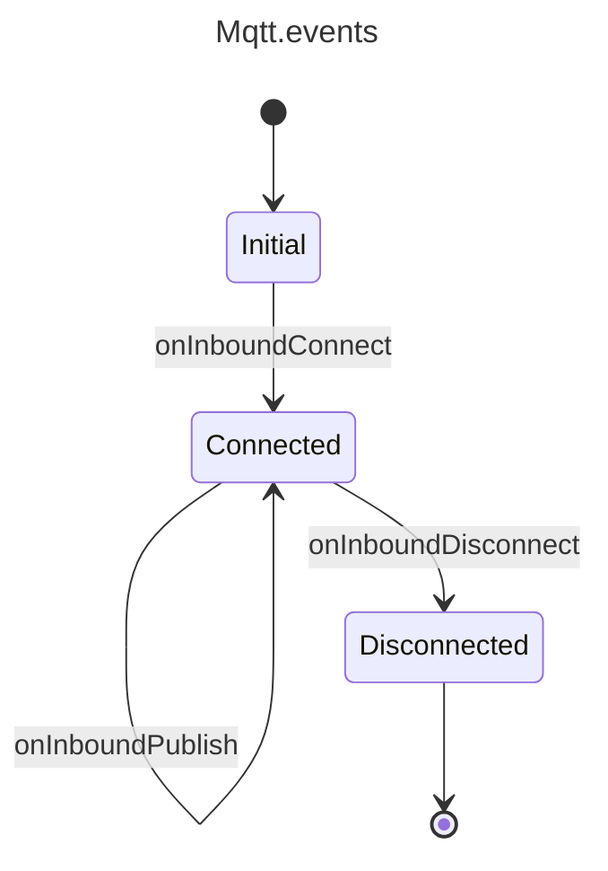
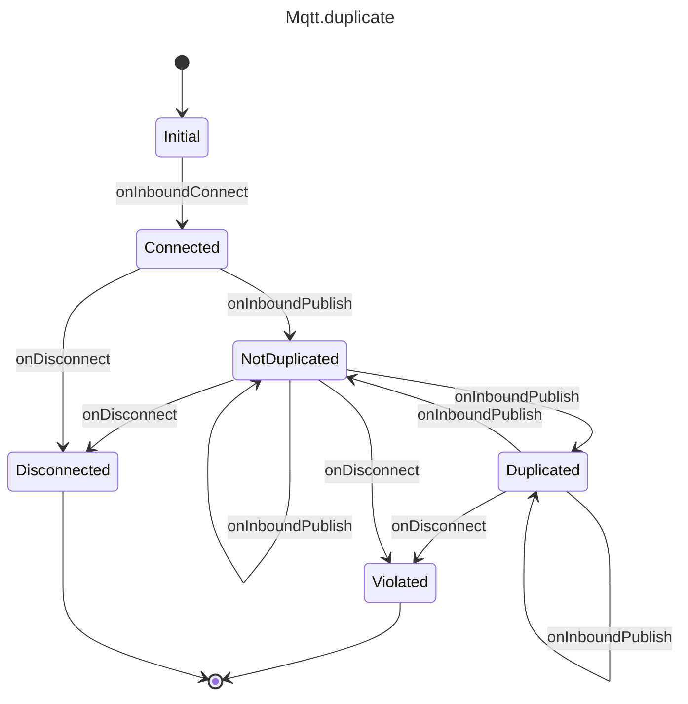
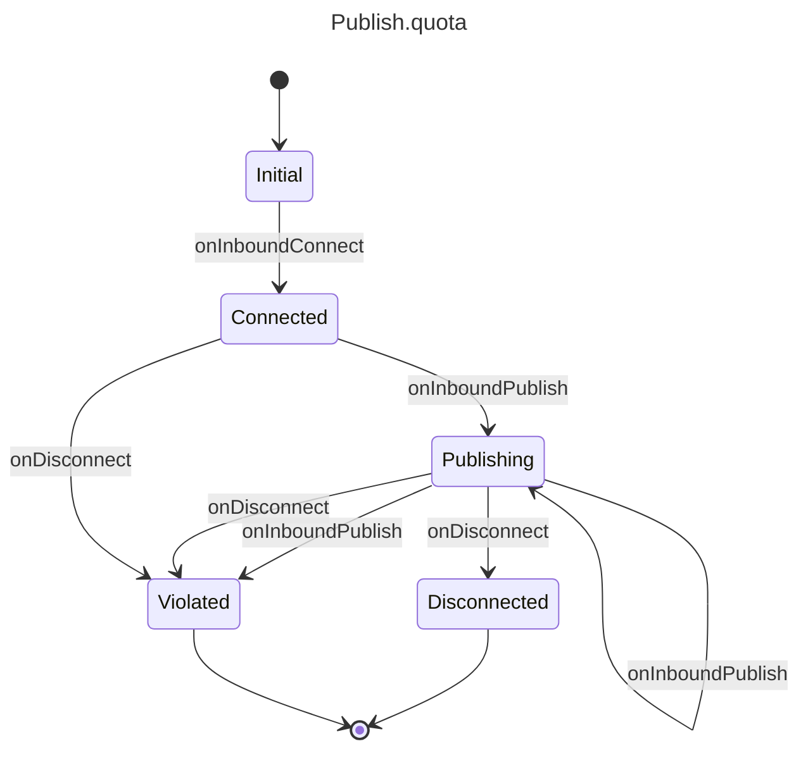

# Datahub Data Models

### BehaviorPolicy

#### Mqtt.events

```mermaid
---
title: Mqtt.events
---
stateDiagram-v2
  [*] --> Initial
  Initial --> Connected : onInboundConnect
  Connected --> Connected : onInboundSubscribe
  Connected --> Connected : onInboundPublish
  Connected --> Disconnected : onInboundDisconnect
  Disconnected --> [*]
```

#### Mqtt.duplicate

```mermaid
---
title: Mqtt.duplicate
---
stateDiagram-v2
  [*] --> Initial
  Initial --> Connected : onInboundConnect
  Connected --> NotDuplicated : onInboundPublish

    NotDuplicated --> NotDuplicated : onInboundPublish
    NotDuplicated --> Duplicated : onInboundPublish
    Duplicated --> Violated : onDisconnect
  Duplicated --> NotDuplicated : onInboundPublish
  Duplicated --> Duplicated : onInboundPublish
  NotDuplicated --> Violated : onDisconnect
  NotDuplicated --> Disconnected : onDisconnect
  Connected --> Disconnected : onDisconnect
  Violated --> [*]
  Disconnected --> [*]

```

#### Publish.quota

```mermaid
---
title: Publish.quota
---
stateDiagram-v2

  [*] --> Initial

  Initial --> Connected : onInboundConnect
  Connected --> Publishing : onInboundPublish
  Publishing --> Violated : onInboundPublish
  Publishing --> Publishing : onInboundPublish
  Publishing --> Violated : onDisconnect
  Connected --> Violated : onDisconnect
  Publishing --> Disconnected : onDisconnect
  Disconnected --> [*]
  Violated --> [*]
```
