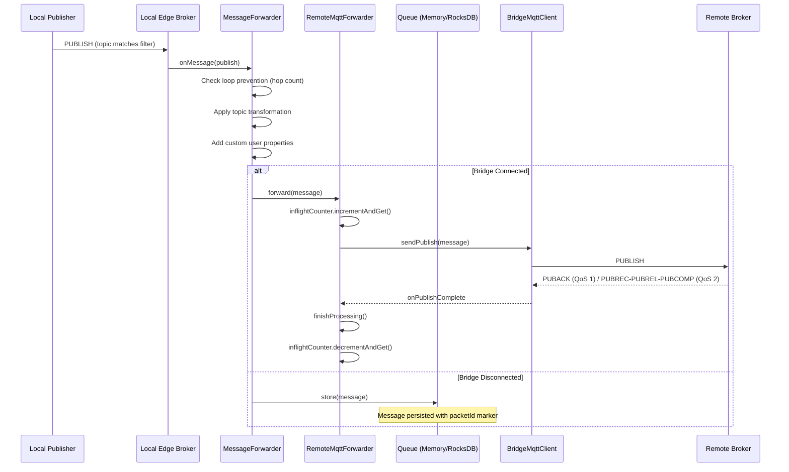
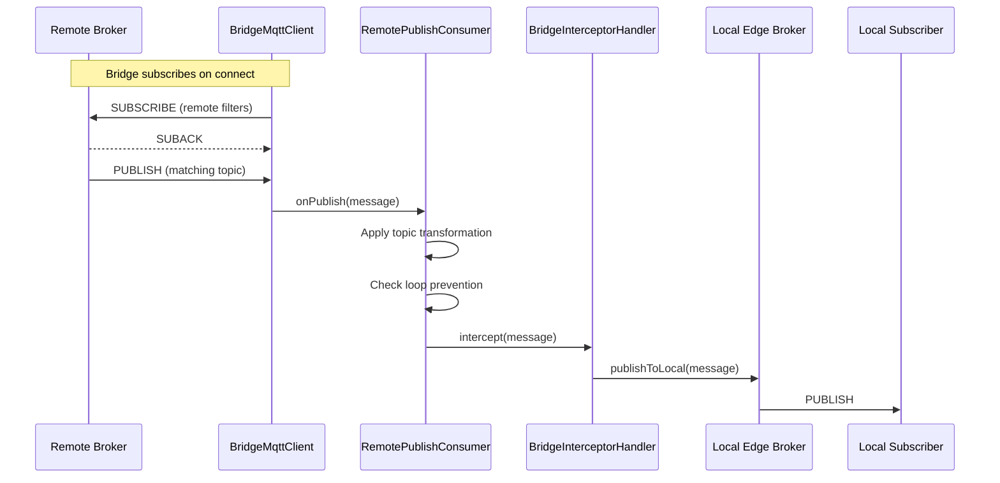
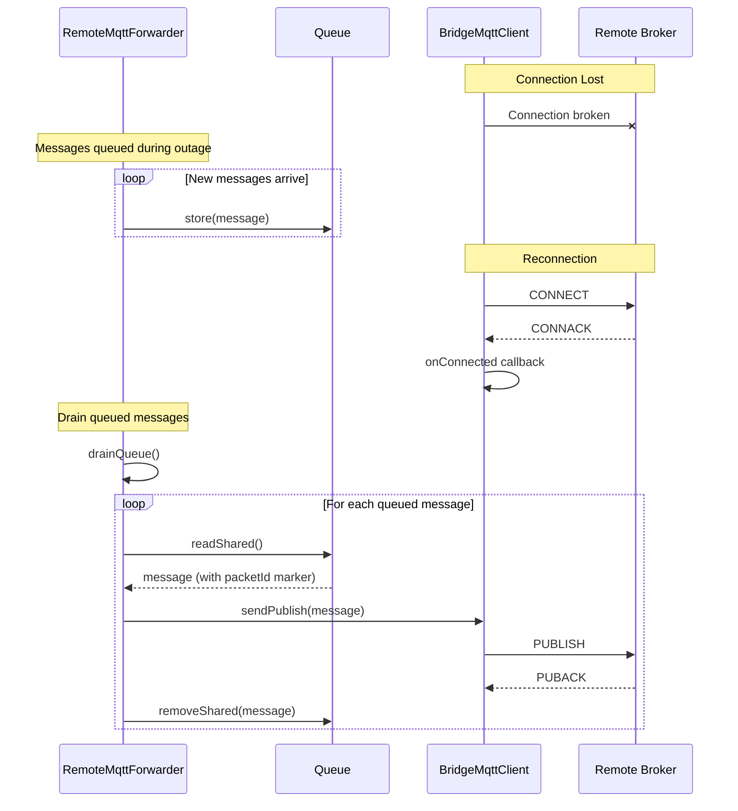
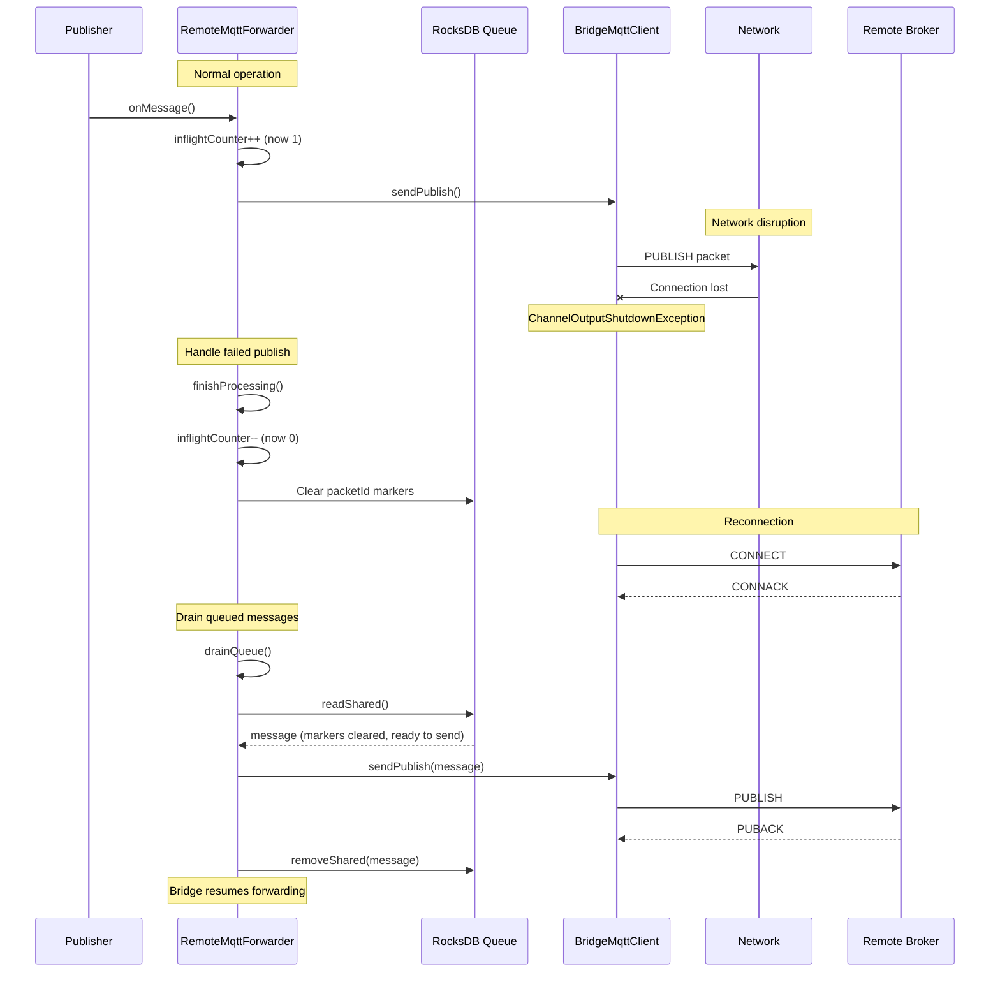
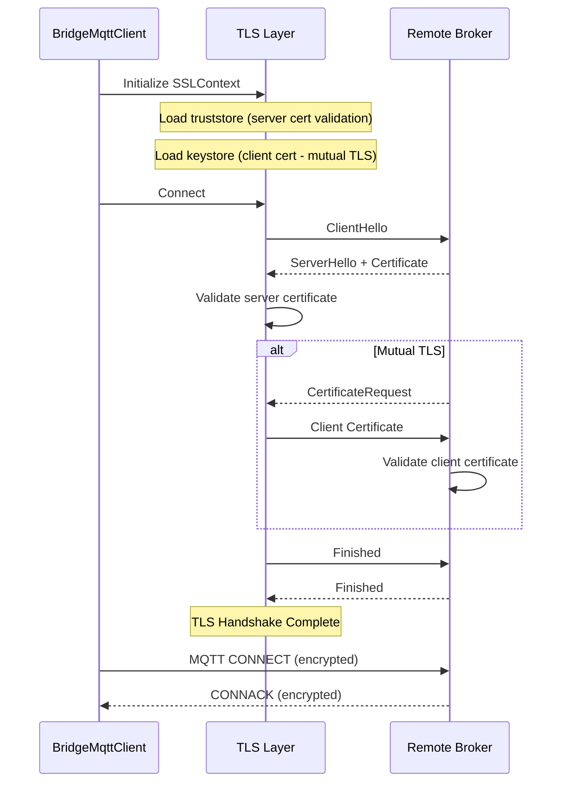
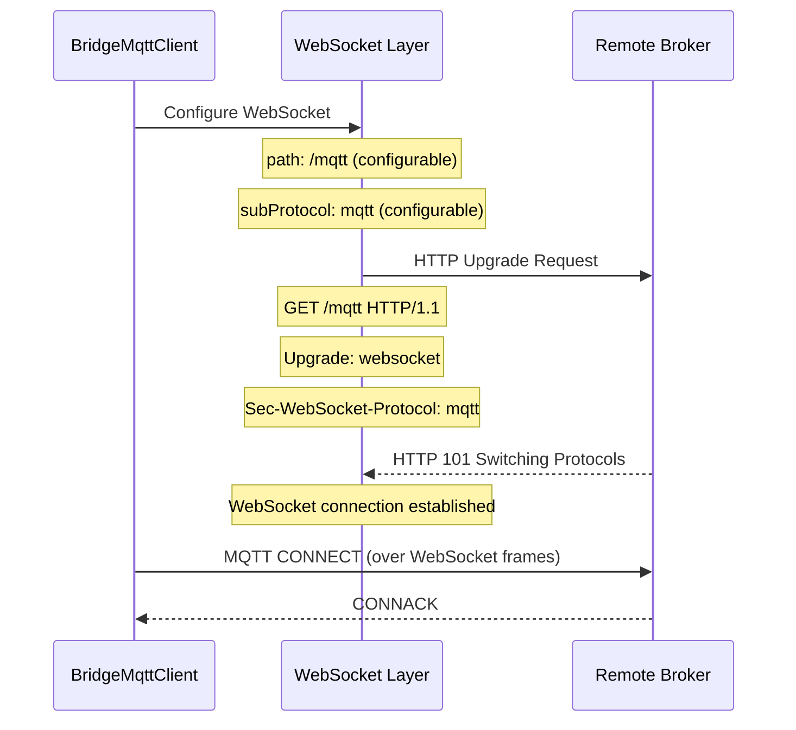
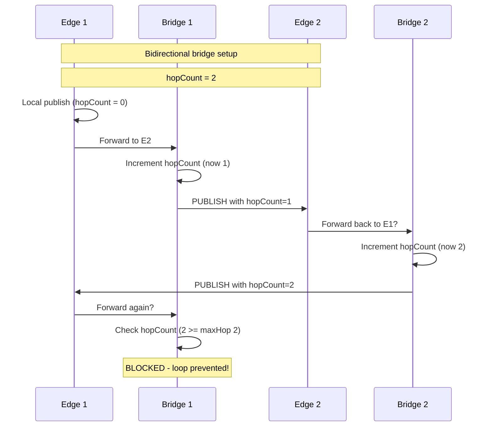

## Bridge Architecture Overview

### Core Components

```
┌─────────────────────────────────────────────────────────────────────────┐
│                              HiveMQ Edge                                │
│┌───────────────────────────────────────────────────────────────────────┐│
││                           BridgeService                               ││
││  ┌──────────────────┐  ┌──────────────────┐  ┌──────────────────────┐ ││
││  │  BridgeMqttClient│  │ MessageForwarder │  │ RemotePublishConsumer│ ││
││  │  (to Remote)     │  │ (Local→Remote)   │  │ (Remote→Local)       │ ││
││  └────────┬─────────┘  └────────┬─────────┘  └──────────┬───────────┘ ││
││           │                     │                       │             ││
││           │    ┌────────────────┴────────────────┐      │             ││
││           │    │      RemoteMqttForwarder        │      │             ││
││           │    │  - drainQueue()                 │      │             ││
││           │    │  - sendPublish()                │      │             ││
││           │    │  - finishProcessing()           │      │             ││
││           │    │  - inflightCounter              │      │             ││
││           │    └────────────────┬────────────────┘      │             ││
││           │                     │                       │             ││
││  ┌────────┴─────────────────────┴───────────────────────┴────────┐    ││
││  │                    Persistence Layer                          │    ││
││  │  - In-Memory Queue (default)                                  │    ││
││  │  - RocksDB Queue (FILE_NATIVE)                                │    ││
││  │  - Inflight markers (packetId tracking)                       │    ││
││  └───────────────────────────────────────────────────────────────┘    ││
│└───────────────────────────────────────────────────────────────────────┘│
└─────────────────────────────────────────────────────────────────────────┘
                                     │
                                     │ MQTT (TCP/TLS/WebSocket)
                                     ▼
                          ┌──────────────────────┐
                          │    Remote Broker     │
                          └──────────────────────┘
```

### Bridge Configuration Options

| Option | Type | Description | Default |
|--------|------|-------------|---------|
| `id` | String | Unique bridge identifier | Required |
| `host` | String | Remote broker hostname | Required |
| `port` | int | Remote broker port | Required |
| `clientId` | String | MQTT client ID for bridge | Required |
| `keepAlive` | int | MQTT keep-alive interval (seconds) | 60 |
| `sessionExpiry` | long | Session expiry interval (seconds) | 3600 |
| `cleanStart` | boolean | Start with clean session | false |
| `username` | String | Authentication username | null |
| `password` | String | Authentication password | null |
| `bridgeTls` | BridgeTls | TLS configuration | null |
| `bridgeWebsocketConfig` | BridgeWebsocketConfig | WebSocket configuration | null |
| `localSubscriptions` | List | Topics to forward Local→Remote | [] |
| `remoteSubscriptions` | List | Topics to pull Remote→Local | [] |
| `loopPreventionEnabled` | boolean | Enable hop count tracking | true |
| `loopPreventionHopCount` | int | Maximum hop count | 1 |
| `persist` | boolean | Persist messages to disk | true |

### LocalSubscription Options

| Option | Type | Description | Default |
|--------|------|-------------|---------|
| `filters` | List<String> | Topic filters to match | Required |
| `destination` | String | Destination topic pattern | null |
| `excludes` | List<String> | Topic patterns to exclude | [] |
| `customUserProperties` | List | User properties to add | [] |
| `preserveRetain` | boolean | Preserve retain flag | false |
| `maxQoS` | int | Maximum QoS level (0, 1, 2) | 2 |
| `queueLimit` | Long | Per-subscription queue limit | null |

### RemoteSubscription Options

| Option | Type | Description | Default |
|--------|------|-------------|---------|
| `filters` | List<String> | Topic filters to subscribe | Required |
| `destination` | String | Local destination topic pattern | null |
| `customUserProperties` | List | User properties to add | [] |
| `preserveRetain` | boolean | Preserve retain flag | false |
| `maxQoS` | int | Maximum QoS level (0, 1, 2) | 2 |

---

## Data Flow Scenarios

### 1. Local-to-Remote Forwarding (Push)



### 2. Remote-to-Local Subscription (Pull)



### 3. Reconnection Flow (Normal)



### 4. Reconnection with Network Disruption



### 5. TLS Connection Flow



### 6. WebSocket Connection Flow



### 7. Loop Prevention Flow



---
